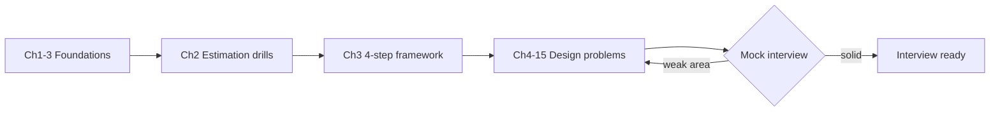

# 📗 System Design Interview: An Insider's Guide — Study Notes

Comprehensive, self-contained study notes for **_System Design Interview: An Insider's Guide_** by **Alex Xu** (2020). One design-doc-style Markdown file per chapter — original paraphrased notes (not a reproduction), packed with Mermaid diagrams, back-of-the-envelope math, deep dives, edge cases, real open-source implementations, and mock-interview questions.

> These are transformative study notes meant to support the book, not replace owning a legal copy. Alex Xu's books (and the ByteByteGo course) are worth buying: [bytebytego.com](https://bytebytego.com/).

---

## 🗂️ Chapters

### Foundations (the interview toolkit)
| Ch | Title | Notes |
|----|-------|-------|
| 1 | Scale From Zero to Millions of Users | [ch01](ch01-scale-zero-to-millions.md) |
| 2 | Back-of-the-Envelope Estimation | [ch02](ch02-back-of-envelope-estimation.md) |
| 3 | A Framework for System Design Interviews | [ch03](ch03-framework-for-interviews.md) |

### Design Problems (the case studies)
| Ch | Title | Notes | Core idea |
|----|-------|-------|-----------|
| 4 | Design a Rate Limiter | [ch04](ch04-design-a-rate-limiter.md) | Token/leaky/sliding-window algorithms, Redis |
| 5 | Design Consistent Hashing | [ch05](ch05-design-consistent-hashing.md) | Hash ring, virtual nodes |
| 6 | Design a Key-Value Store | [ch06](ch06-design-a-key-value-store.md) | CAP, quorum, vector clocks, Merkle trees, LSM |
| 7 | Design a Unique ID Generator | [ch07](ch07-unique-id-generator.md) | UUID, ticket server, Snowflake |
| 8 | Design a URL Shortener | [ch08](ch08-url-shortener.md) | base62, hashing, 301 vs 302 |
| 9 | Design a Web Crawler | [ch09](ch09-web-crawler.md) | BFS, URL frontier, politeness, traps |
| 10 | Design a Notification System | [ch10](ch10-notification-system.md) | APNs/FCM/SMS/email, fan-out, retries |
| 11 | Design a News Feed System | [ch11](ch11-news-feed-system.md) | Fan-out on write vs read, hot key |
| 12 | Design a Chat System | [ch12](ch12-chat-system.md) | WebSocket, presence, message sync |
| 13 | Design a Search Autocomplete System | [ch13](ch13-search-autocomplete.md) | Trie, prefix aggregation |
| 14 | Design YouTube | [ch14](ch14-design-youtube.md) | Upload/transcoding DAG, CDN, streaming |
| 15 | Design Google Drive | [ch15](ch15-design-google-drive.md) | Block storage, delta sync, dedup |

### Chapter 16 — The Learning Continues
The book's final chapter isn't a design problem; it's a curated list of real-world systems and engineering blogs to keep studying. Highlights worth reading:
- **Scaling / architecture write-ups:** how Facebook, Twitter, Netflix, Uber, Airbnb, Pinterest, and Yelp scale their systems.
- **Foundational papers:** Google (GFS, MapReduce, Bigtable, Chubby, Dynamo), Amazon Dynamo, Kafka, Cassandra.
- **Engineering blogs to follow:** [High Scalability](http://highscalability.com/), [Netflix Tech Blog](https://netflixtechblog.com/), [Uber Engineering](https://eng.uber.com/), [Cloudflare Blog](https://blog.cloudflare.com/), [Meta Engineering](https://engineering.fb.com/), [AWS Architecture Blog](https://aws.amazon.com/blogs/architecture/), [The Morning Paper](https://blog.acolyer.org/).
- **Companion resource:** [donnemartin/system-design-primer](https://github.com/donnemartin/system-design-primer) (~290k★) — the best free open-source study companion to this book.

---

## 🔗 How These Map to Your System-Design Guides

Alex Xu's book applies the building blocks; your [`system-design/`](../../system-design/README.md) guides explain each one in depth. Read them together.

| Alex Xu Chapter | Related System-Design Guide(s) |
|-----------------|-------------------------------|
| Ch 1 — Scale to Millions | [Load Balancing](../../system-design/01-easy/load-balancing.md), [Caching](../../system-design/01-easy/caching.md), [CDN](../../system-design/01-easy/cdn.md), [Replication](../../system-design/02-moderate/replication.md), [Sharding](../../system-design/02-moderate/database-sharding.md), [Message Queues](../../system-design/02-moderate/message-queues.md) |
| Ch 4 — Rate Limiter | [Rate Limiting](../../system-design/01-easy/rate-limiting.md) |
| Ch 5 — Consistent Hashing | [Consistent Hashing](../../system-design/02-moderate/consistent-hashing.md) |
| Ch 6 — Key-Value Store | [Replication](../../system-design/02-moderate/replication.md), [Sharding](../../system-design/02-moderate/database-sharding.md), [Consistent Hashing](../../system-design/02-moderate/consistent-hashing.md) |
| Ch 10 — Notification System | [Message Queues](../../system-design/02-moderate/message-queues.md) |
| Ch 11 — News Feed | [Caching](../../system-design/01-easy/caching.md) |
| Ch 14 — YouTube | [CDN](../../system-design/01-easy/cdn.md) |

### And to the DDIA notes (theory behind the practice)
| Alex Xu Chapter | DDIA Notes |
|-----------------|-----------|
| Ch 5/6 — Consistent Hashing, KV Store | [DDIA Ch 5 Replication](../ddia/ch05-replication.md), [Ch 6 Partitioning](../ddia/ch06-partitioning.md) |
| Ch 6 — KV Store (consistency) | [DDIA Ch 9 Consistency & Consensus](../ddia/ch09-consistency-and-consensus.md) |
| Ch 12 — Chat / Ch 10 — Notifications | [DDIA Ch 11 Stream Processing](../ddia/ch11-stream-processing.md) |

---

## 🧭 How to Use These Notes

- **First:** internalize Ch. 3's 4-step framework (Scope → High-Level → Deep Dive → Wrap-up). Apply it to every problem.
- **Warm up:** drill Ch. 2 estimation (QPS, storage, latency numbers) until it's automatic.
- **Practice loop:** read a design chapter → close it → redo the design from a blank page → check against the notes' Mock Interview Q&A.
- **Cross-reference:** when a chapter uses a concept (caching, sharding, consensus), jump to the matching `system-design/` guide or DDIA note for depth.

---

## 🧩 What's In Each Chapter File

Design-problem chapters follow a real interview flow:
1. **The Problem** — framed as an interview prompt
2. **Requirements** — functional + non-functional, plus clarifying questions
3. **Back-of-the-Envelope Estimation** — QPS/storage/bandwidth math
4. **High-Level Design** — architecture diagram, API, data model
5. **Deep Dive** — algorithms/components with Mermaid diagrams and alternatives
6. **Edge Cases, Bottlenecks & Scaling**
7. **Key Takeaways & Interview Tips**
8. **Open-Source Implementations (GitHub)**
9. **References & Further Reading**
10. **Mock Interview / Self-Check Questions**

(Foundational chapters 1–3 adapt this to Overview + Key Concepts.)

**Coverage stats:** 15 chapters · ~54,000 words · 150+ Mermaid diagrams · 100+ referenced OSS repos · full mock-interview question sets.
