# Alex Xu — Ch 1: Scale From Zero To Millions Of Users

> A guided tour of the core building blocks used to grow a system from a single box to a globally distributed platform. | Maps to: [load-balancing](../../system-design/01-easy/load-balancing.md), [caching](../../system-design/01-easy/caching.md), [cdn](../../system-design/01-easy/cdn.md), [replication](../../system-design/02-moderate/replication.md), [database-sharding](../../system-design/02-moderate/database-sharding.md), [message-queues](../../system-design/02-moderate/message-queues.md)

---

## 🎯 Overview

This chapter is **foundational** rather than a single design problem. Instead of designing one product, it tells a *story*: start with everything on one server, then add capacity and resilience one building block at a time until the system can serve **millions of users**. Each step exists to remove a bottleneck or single point of failure (SPOF) introduced by the previous step.

The narrative arc:

```mermaid
flowchart LR
    A["Single server<br/>(web + DB + cache)"] --> B["Separate DB tier"]
    B --> C["Load balancer<br/>+ multiple web servers"]
    C --> D["DB replication<br/>(master/slaves)"]
    D --> E["Cache tier"]
    E --> F["CDN for static assets"]
    F --> G["Stateless web tier<br/>+ autoscaling"]
    G --> H["Multiple data centers<br/>(geoDNS)"]
    H --> I["Message queue<br/>(async decoupling)"]
    I --> J["Logging, metrics,<br/>automation"]
    J --> K["Database sharding<br/>(horizontal scale)"]
    K --> L["Millions of users<br/>+ microservices"]
```

The two mental tools that recur throughout the chapter:

1. **Scale up vs. scale out** — add power to one machine (vertical) vs. add more machines (horizontal). Horizontal wins at large scale.
2. **Remove every SPOF and add redundancy at every tier** — a system is only as available as its weakest single-instance component.

**Why this chapter matters for interviews:** almost every "design X" question reuses these primitives. Knowing *why* each block is introduced (what failure or bottleneck it fixes) lets you narrate a design from scratch and justify each addition.

---

## 🧠 Key Concepts & Vocabulary

### 1. Single server setup

Everything — web app, database, cache — runs on **one machine**. Simple, cheap, and fine for a prototype or a handful of users. The request path introduces the vocabulary of the web:

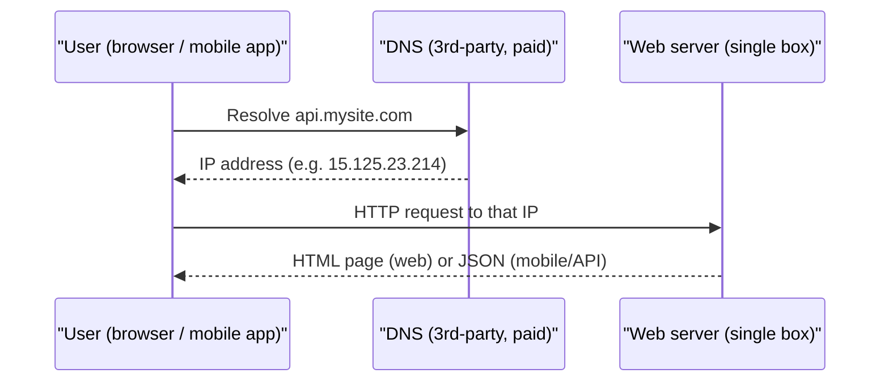

Key terms:

| Term | Meaning |
| --- | --- |
| **DNS** | Domain Name System — maps a domain name to an IP address. Usually a paid 3rd-party service, not self-hosted. |
| **IP address** | The numeric address the client actually connects to after DNS resolution. |
| **HTTP** | The request/response protocol between client and web server. |
| **Traffic sources** | Web apps (server-side + client-side languages, return HTML) and mobile apps (HTTP + **JSON** API responses, e.g. `GET /users/12`). |

### 2. Database — separating the data tier

As users grow, one box is not enough. **Split the web/mobile tier from the database tier** so each can scale independently.

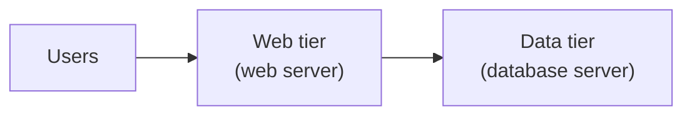

**Which database?**

| | Relational (RDBMS / SQL) | Non-relational (NoSQL) |
| --- | --- | --- |
| Examples | MySQL, PostgreSQL, Oracle | Cassandra, HBase, DynamoDB, CouchDB, Neo4j |
| Data model | Tables & rows; **JOINs** across tables | key-value, graph, column, document stores |
| JOINs | Yes (native SQL) | Generally **not** supported |
| Maturity | 40+ years, default choice | Newer, specialized |

**Reach for NoSQL when:** you need super-low latency; data is unstructured or non-relational; you only serialize/deserialize (JSON/XML/YAML); or you must store a *massive* volume of data. Otherwise relational is the safe default.

### 3. Vertical vs. horizontal scaling

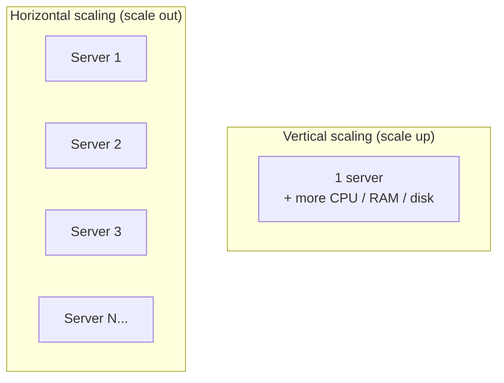

| | Vertical (scale up) | Horizontal (scale out) |
| --- | --- | --- |
| Method | Add CPU/RAM/disk to one machine | Add more machines to the pool |
| Advantage | Simple | No hard ceiling; enables failover/redundancy |
| Limits | **Hard hardware limit**; **no failover** (box dies → app dies); expensive | More complex to coordinate |
| Best for | Low traffic | Large-scale applications |

**Takeaway:** vertical scaling has a ceiling *and* leaves you with a SPOF. Horizontal scaling is the path to large scale — but it needs a **load balancer** to distribute traffic.

### 4. Load balancer

A **load balancer (LB)** evenly distributes incoming traffic across a set of web servers ("load-balanced set").

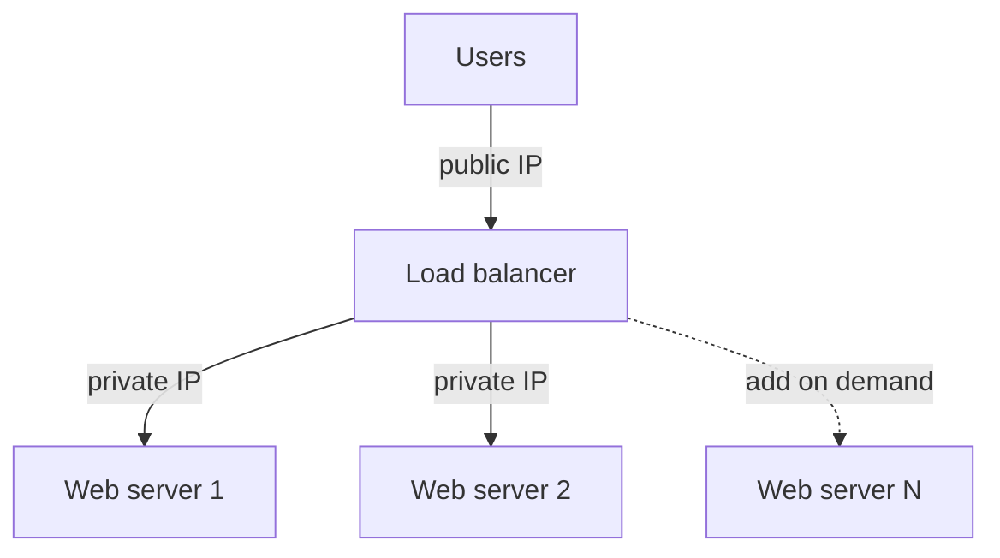

- Clients connect to the LB's **public IP**; web servers are no longer reachable directly.
- LB ↔ web server traffic uses **private IPs** (reachable only within the network, not the internet) — better security.
- **Failover:** if server 1 dies, all traffic routes to server 2; a new healthy server is added to the pool.
- **Elastic capacity:** when traffic spikes, just add servers to the pool; the LB automatically starts routing to them.

This fixes the web-tier SPOF. But the **data tier still has one database** → next problem.

### 5. Database replication

Classic **master/slave** (a.k.a. primary/replica) model:

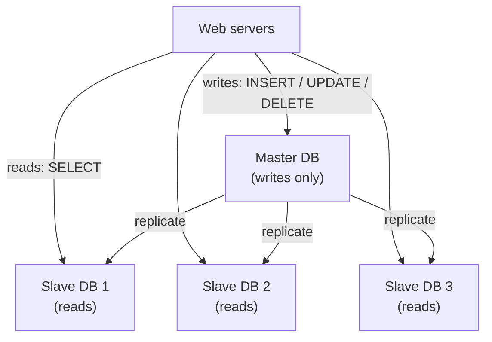

- **Master** handles all writes (insert/update/delete). **Slaves** get copies and serve **reads**.
- Most apps are **read-heavy**, so there are usually **many more slaves than masters**.

**Advantages:**

| Benefit | Why |
| --- | --- |
| **Better performance** | Reads spread across many slaves → more queries in parallel |
| **Reliability** | Data survives if a server is lost to disaster (replicated across locations) |
| **High availability** | Site keeps running even if one DB is offline |

**Failure handling:**

- **Slave goes offline:** reads redirect to other healthy slaves (or temporarily to the master if it was the only slave). A new slave replaces the old one.
- **Master goes offline:** a slave is **promoted** to master; a new slave is spun up. In production this is *harder* than it sounds — the promoted slave's data may be stale, so **data-recovery scripts** fill the gap. Multi-master and circular replication exist but are more complex (out of scope here).

Combined design so far:

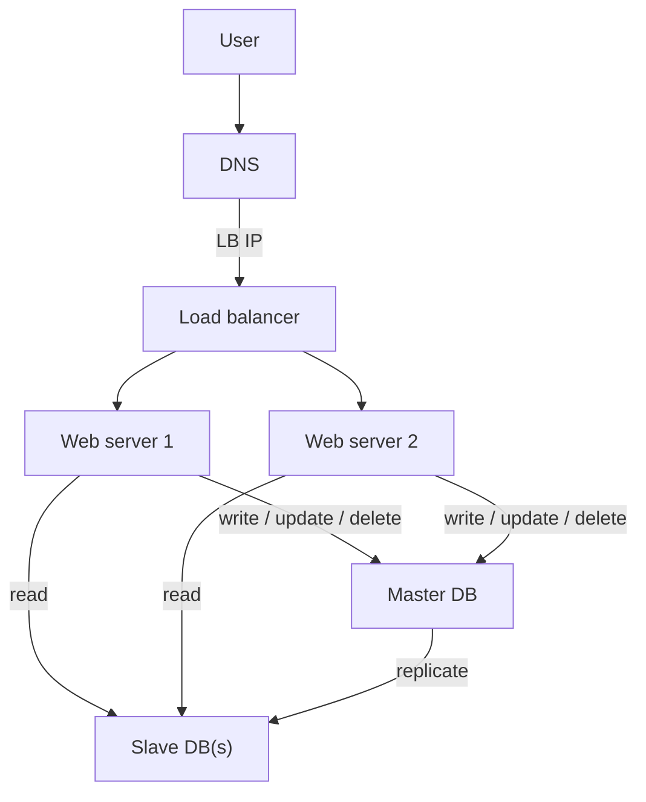

### 6. Cache

A **cache** is a fast, temporary in-memory store for expensive or frequently accessed results, so repeat requests skip the database.

**Cache tier** — a separate layer, much faster than the DB. Benefits: better performance, reduced DB load, independently scalable.

**Read-through cache** (the pattern shown in the book):

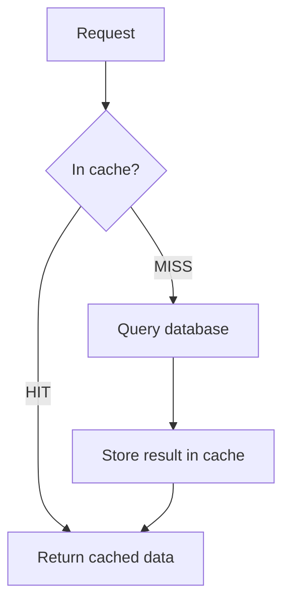

**Considerations when using a cache:**

| Consideration | Guidance |
| --- | --- |
| **When to use** | Read-frequently, write-infrequently data. Cache memory is volatile — a restart wipes it, so persist important data in a durable store. |
| **Expiration (TTL) policy** | Always set one. Too short → hammers the DB reloading; too long → stale data. |
| **Consistency** | Keeping store and cache in sync is hard because the two writes aren't a single transaction; harder still across regions. (See "Scaling Memcache at Facebook".) |
| **Mitigating failures** | A single cache node is a **SPOF**. Use multiple cache servers across data centers; **overprovision memory** by a buffer %. |
| **Eviction policy** | When full, evict to make room. **LRU** (Least Recently Used) is most popular; also **LFU** (Least Frequently Used), **FIFO**. |

### 7. Content Delivery Network (CDN)

A **CDN** is a network of geographically dispersed edge servers that cache **static content** (images, video, CSS, JS). The closer the edge server is to the user, the faster the load.

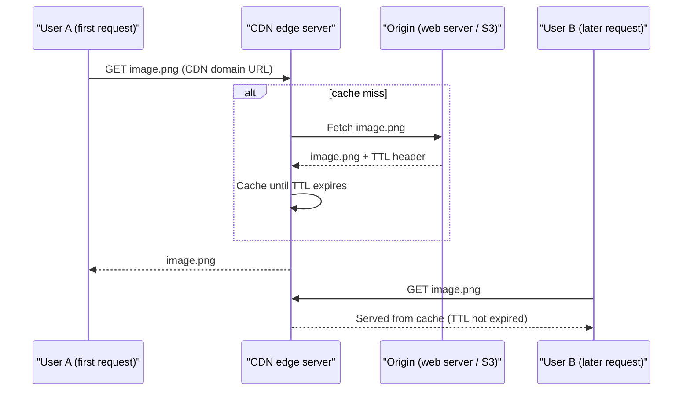

Example CDN URLs: `https://mysite.cloudfront.net/logo.jpg`, `https://mysite.akamai.com/image-manager/img/logo.jpg`.

**Considerations:**

| Consideration | Guidance |
| --- | --- |
| **Cost** | 3rd-party, charged per data transfer. Don't CDN rarely-used assets. |
| **Cache expiry** | Not too long (stale) nor too short (repeat origin reloads). |
| **CDN fallback** | On CDN outage, clients should detect failure and fetch from origin. |
| **Invalidating files** | Use the CDN's **invalidation API**, or **object versioning** via a URL param (`image.png?v=2`). |

After adding cache + CDN: static assets come from the CDN (not web servers), and the DB load is lightened by the cache.

### 8. Stateless web tier

To scale the web tier horizontally, **move state (e.g., user session data) out of the web servers** into a shared data store.

**Stateful vs. stateless:**

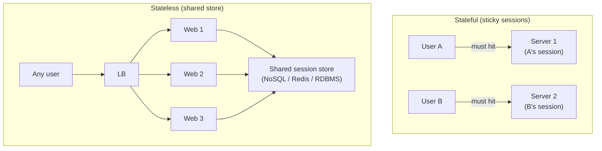

| | Stateful | Stateless |
| --- | --- | --- |
| Session location | On a specific server | Shared external store |
| Routing | Must pin client → same server (**sticky sessions**) | Any request → any server |
| Adding/removing servers | Hard; failures are painful | Easy |
| Autoscaling | Difficult | Simple (add/remove on demand) |
| Verdict | Adds overhead | **Simpler, more robust, more scalable** |

With state externalized (NoSQL is preferred for easy scaling), **autoscaling** — automatically adding/removing web servers based on load — becomes trivial.

### 9. Data centers

Serve users internationally with **multiple data centers**. Users are **geoDNS-routed** to the nearest one (e.g. x% to US-East, (100−x)% to US-West).

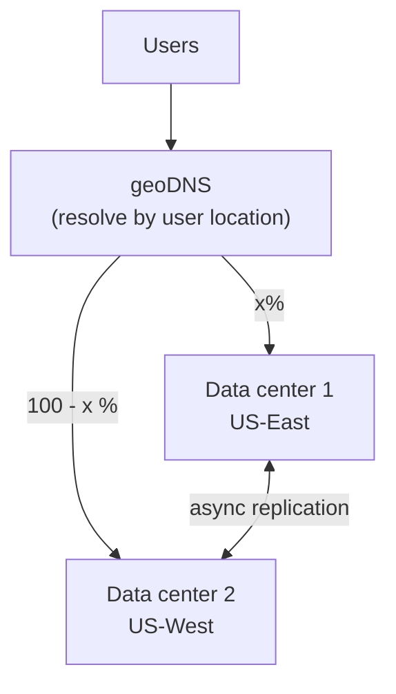

**On outage:** if DC2 goes down, geoDNS sends **100% of traffic to the healthy DC1**.

**Technical challenges of multi-DC:**

| Challenge | Solution |
| --- | --- |
| **Traffic redirection** | geoDNS routes to the nearest/healthy DC. |
| **Data synchronization** | Replicate data **across data centers** (Netflix uses async multi-DC replication) so failover DCs have the data. |
| **Test & deployment** | Test at multiple locations; use **automated deployment** for consistency across DCs. |

### 10. Message queue

A **message queue** is a durable buffer supporting **asynchronous** communication. **Producers/publishers** post messages; **consumers/subscribers** read and act on them.

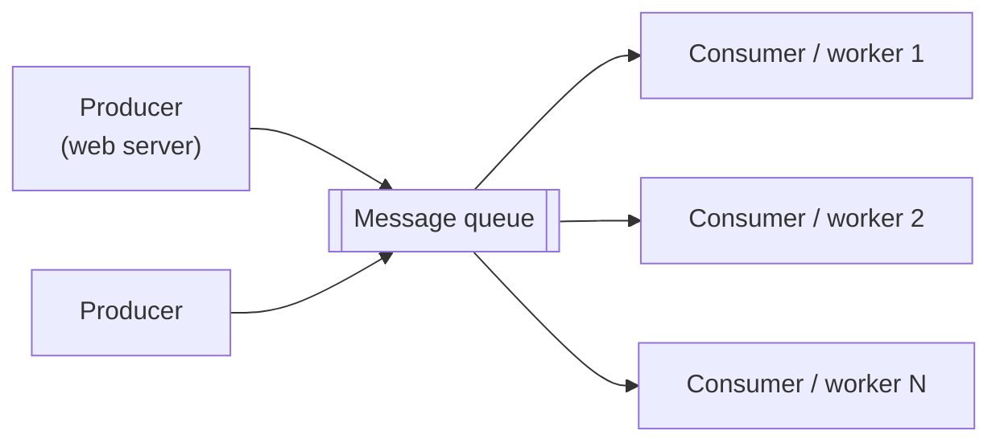

**Why:** **decoupling**. The producer can enqueue even when consumers are down; consumers can drain the queue even when producers are down. Producer and consumer **scale independently**.

**Example — photo processing** (crop/sharpen/blur are slow):

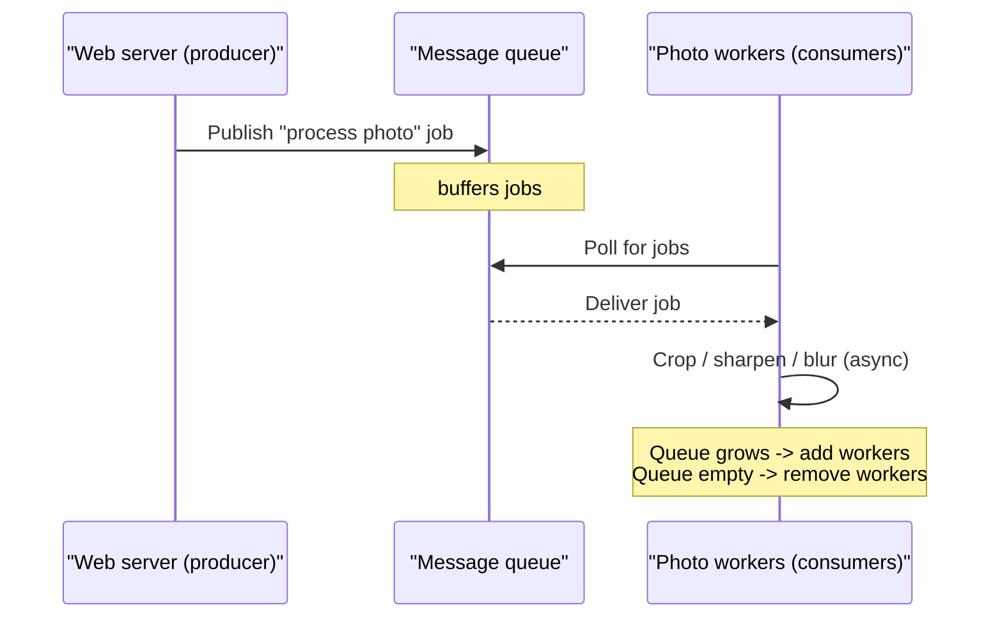

### 11. Logging, metrics, automation

Optional for a few servers; **essential** at scale.

| Pillar | What & why |
| --- | --- |
| **Logging** | Monitor **error logs** to find problems. Aggregate to a **centralized service** for easy search. |
| **Metrics** | *Host-level* (CPU, memory, disk I/O); *aggregated* (whole DB/cache tier performance); *business* (DAU, retention, revenue). |
| **Automation** | **CI** verifies each check-in; automate build/test/deploy to boost productivity and catch problems early. |

### 12. Database scaling — vertical vs. horizontal (sharding)

**Vertical (scale up):** bigger machine — AWS RDS offers up to **24 TB RAM**; Stack Overflow in 2013 served **10M+ monthly uniques on a single master DB**. Drawbacks: hardware limits, greater SPOF risk, high cost.

**Horizontal (sharding):** split one large DB into smaller **shards**. Each shard shares the **same schema** but holds a **unique subset** of the data.

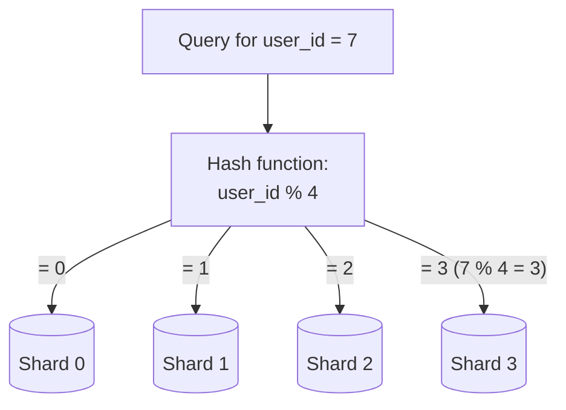

- **Sharding key (partition key):** one or more columns that decide data distribution (e.g. `user_id`). Routes queries to the right shard. **Choose a key that distributes data evenly.**

**Sharding challenges:**

| Challenge | Description | Mitigation |
| --- | --- | --- |
| **Resharding** | A shard fills up, or uneven growth causes **shard exhaustion**. Requires updating the hash function and moving data. | **Consistent hashing** (Ch. 5). |
| **Celebrity / hotspot key** | Excessive access to one shard (e.g. Katy Perry, Bieber, Lady Gaga all on one shard) overloads it. | Give a **dedicated shard per celebrity**, partition further if needed. |
| **Join & de-normalization** | Cross-shard JOINs are hard/impossible. | **De-normalize** so queries hit a single table. |

Often paired with moving some non-relational functionality to a **NoSQL store** to reduce DB load.

### 13. Millions of users and beyond

Scaling is **iterative**. The chapter's closing checklist:

- Keep the **web tier stateless**
- Build **redundancy at every tier**
- **Cache** as much as possible
- Support **multiple data centers**
- Host **static assets in a CDN**
- Scale the **data tier by sharding**
- **Split tiers into individual services** (microservices)
- **Monitor** and use **automation** tools

---

## 🔬 Deep Dive

### The full evolved architecture

Putting the pieces together (one data center shown for clarity):

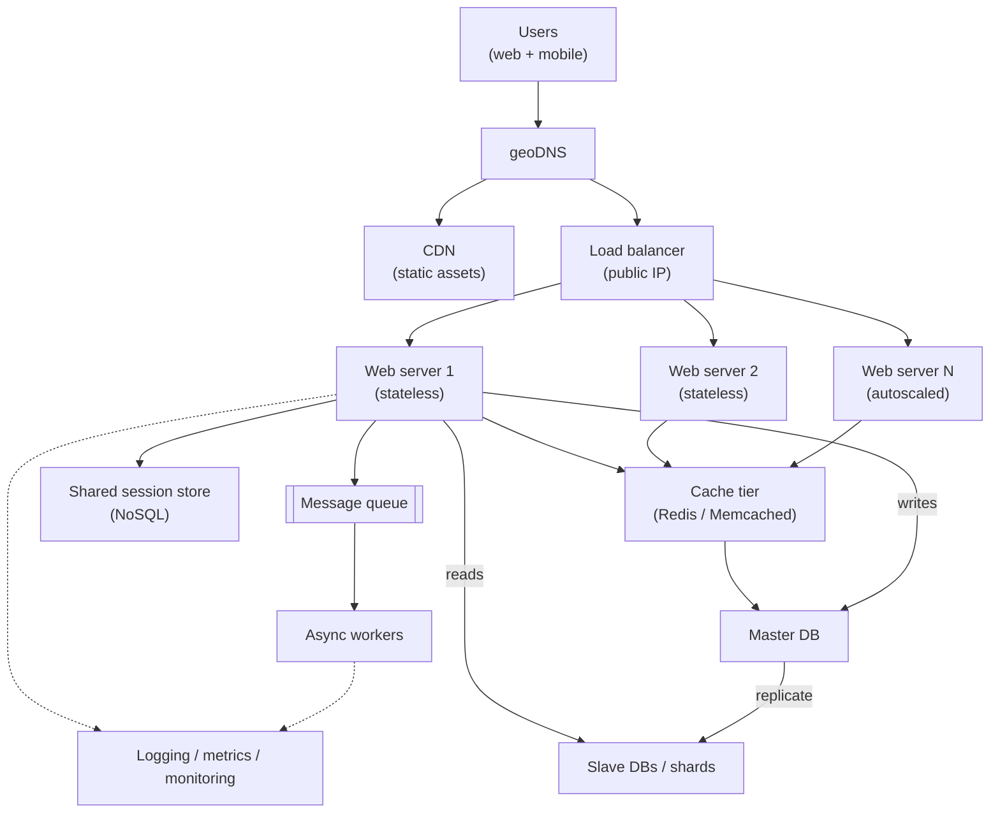

### Design decision 1 — Vertical vs. horizontal scaling

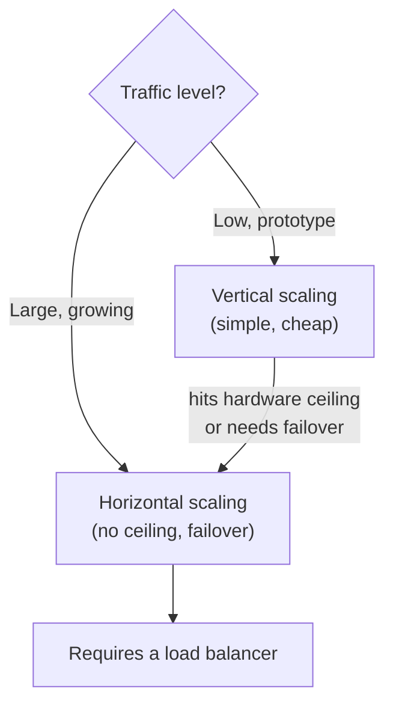

Worked reasoning: a single machine caps out at some max CPU/RAM (AWS RDS tops out around **24 TB RAM** — huge, but finite) and, more importantly, *is* a SPOF. Horizontal scaling trades simplicity for an unbounded ceiling **and** redundancy — the deciding factor for "millions of users."

### Design decision 2 — SQL vs. NoSQL

Default to relational (mature, JOINs, transactions). Switch to NoSQL only when you hit one of: ultra-low latency, unstructured/non-relational data, pure serialize/deserialize needs, or massive volume. In this chapter NoSQL shows up twice: as the **session store** (easy to scale) and as a **relief valve** for sharded DBs (offload non-relational features).

### Design decision 3 — Caching strategy & eviction

The book uses **read-through** caching. Comparison of common eviction policies:

| Policy | Evicts | Best when |
| --- | --- | --- |
| **LRU** | Least recently used entry | General purpose; recency predicts reuse (most popular) |
| **LFU** | Least frequently used entry | Popularity is stable over time |
| **FIFO** | Oldest inserted entry | Simple; access pattern is uniform |

Worked example — cache math intuition: if a page needs 5 DB calls and the DB call is ~10 ms while a cache read is ~1 ms, a cache **hit** serves the page ~50× faster on the data path and removes 5 queries of load from the DB per request. At high read volume this is the difference between a DB that copes and one that melts.

### Design decision 4 — Sharding key & the hash function

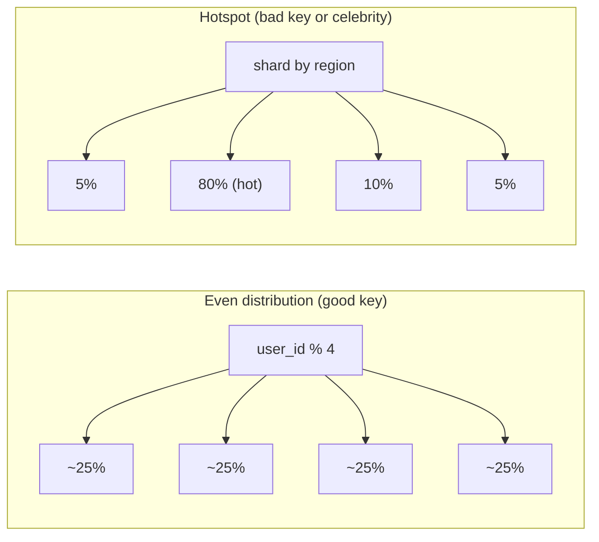

Worked example: with `user_id % 4`, `user_id = 7 → 7 % 4 = 3 → Shard 3`. Simple and even *until* you need to add a 5th shard — then `% 4` becomes `% 5` and **almost every row moves**. That pain is exactly why **consistent hashing** (Ch. 5) exists: it minimizes data movement on resharding.

### State: stateful → stateless transition

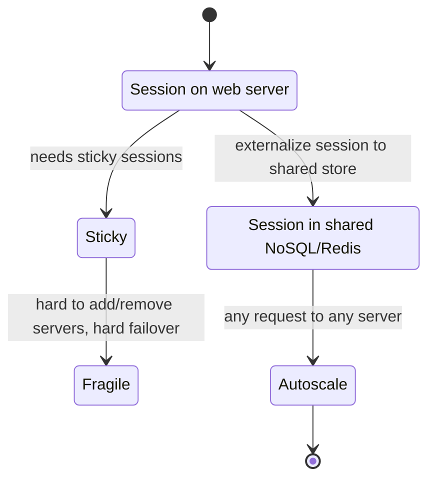

---

## ⚠️ Edge Cases, Bottlenecks & Scaling

| Component | Bottleneck / failure | Handling |
| --- | --- | --- |
| **Single server** | SPOF; caps at one box | Split tiers, scale out |
| **Web tier** | Server offline → users can't connect; overload → slow/failed requests | Load balancer + multiple servers + autoscaling |
| **Load balancer** | Itself a potential SPOF | Run redundant LBs (active/passive or active/active) |
| **Master DB** | Write bottleneck; SPOF | Promote a slave on failure (mind stale data → recovery scripts); shard for write scale |
| **Slave DB** | Read capacity; replication lag | Add slaves; redirect reads on failure; temporarily read from master |
| **Cache** | Volatile (restart = data loss); SPOF; stale data; full | Persist important data elsewhere; multiple cache nodes across DCs; overprovision memory; TTL + eviction (LRU) |
| **CDN** | Cost; outage; stale/invalid content | Fallback to origin; tune expiry; invalidation API or versioned URLs |
| **Session state on server** | Blocks horizontal scaling | Externalize to shared store (stateless tier) |
| **Single data center** | Regional outage takes everything down | Multiple DCs + geoDNS + cross-DC replication |
| **Synchronous slow tasks** | Web request blocked on slow work | Offload to message queue + async workers |
| **Growing data volume** | DB overloaded; vertical ceiling | Shard horizontally; offload to NoSQL |
| **Shard** | Exhaustion / uneven fill; **celebrity hotspot**; cross-shard JOINs | Consistent hashing (resharding); dedicated shard per hot key; de-normalize |

**Cross-cutting trade-offs the chapter raises:**

- **Consistency vs. availability/performance** — replication and caching improve reads and availability but introduce **staleness** and sync complexity.
- **Simplicity vs. scalability** — sticky sessions and single machines are simple but don't scale; stateless + sharded designs scale but add operational complexity.
- **Cost vs. resilience** — redundancy at every tier, multi-DC, and CDN all cost money; the payoff is availability.

---

## 🔑 Key Takeaways & Interview Tips

- **Narrate incrementally.** Start simple (single server) and add each block only when you can name the bottleneck it removes. Interviewers reward this reasoning far more than dumping a giant diagram.
- **Prefer horizontal scaling** for large systems — vertical scaling has a ceiling and is a SPOF.
- **Keep the web tier stateless** so you can autoscale; put sessions in a shared store.
- **Build redundancy at every tier** and hunt for **SPOFs** — LB, DB, cache, and DC all need a backup story.
- **Read-heavy?** Use replication (read replicas) + a cache tier. **Write-heavy / huge data?** Shard.
- **Static content → CDN. Slow tasks → message queue.**
- Know the **cache considerations** (TTL, consistency, eviction/LRU, SPOF) and **sharding pitfalls** (resharding, celebrity/hotspot, cross-shard JOINs) — these are frequent follow-ups.
- Mention **logging/metrics/automation** to show operational maturity.
- Memorize the closing **8-point checklist** — it's a ready-made summary for the end of an interview.

---

## 🛠️ Open-Source Implementations (GitHub)

| Project | GitHub | How it relates | Approx. stars |
| --- | --- | --- | --- |
| **HAProxy** | https://github.com/haproxy/haproxy | Canonical open-source L4/L7 **load balancer** & reverse proxy | ~5k |
| **Envoy** | https://github.com/envoyproxy/envoy | Modern L7 proxy / **load balancer**, cloud-native service mesh data plane | ~26k |
| **Traefik** | https://github.com/traefik/traefik | Cloud-native **reverse proxy & load balancer** with auto service discovery | ~55k |
| **Redis** | https://github.com/redis/redis | In-memory **cache** / data-structure server; the go-to **cache tier** & session store | ~68k |
| **Memcached** | https://github.com/memcached/memcached | Classic high-performance distributed **memory cache** (APIs referenced in the chapter) | ~14k |
| **Valkey** | https://github.com/valkey-io/valkey | Community fork of Redis; drop-in **cache**/data store | ~22k |
| **RabbitMQ** | https://github.com/rabbitmq/rabbitmq-server | Durable **message queue** / broker for async producer-consumer decoupling | ~13k |
| **Apache Kafka** | https://github.com/apache/kafka | Distributed event-streaming platform used as a scalable **message queue** | ~30k |
| **Vitess** | https://github.com/vitessio/vitess | **Database sharding** & horizontal scaling system for MySQL (powers YouTube) | ~19k |
| **ProxySQL** | https://github.com/sysown/proxysql | High-performance MySQL proxy for **read/write split & replication** routing | ~6k |

*(Star counts are approximate and drift over time.)*

---

## 🔗 References & Further Reading

- Hypertext Transfer Protocol — https://en.wikipedia.org/wiki/Hypertext_Transfer_Protocol
- Should you go Beyond Relational Databases? — https://blog.teamtreehouse.com/should-you-go-beyond-relational-databases
- Replication (computing) — https://en.wikipedia.org/wiki/Replication_(computing)
- Multi-master replication — https://en.wikipedia.org/wiki/Multi-master_replication
- MySQL NDB Cluster Replication (multi-master & circular) — https://dev.mysql.com/doc/refman/en/mysql-cluster-replication-multi-master.html
- Caching Strategies and How to Choose the Right One — https://codeahoy.com/2017/08/11/caching-strategies-and-how-to-choose-the-right-one/
- Nishtala et al., "Scaling Memcache at Facebook" (NSDI '13) — https://www.usenix.org/system/files/conference/nsdi13/nsdi13-final170_update.pdf
- Single point of failure — https://en.wikipedia.org/wiki/Single_point_of_failure
- Amazon CloudFront Dynamic Content Delivery — https://aws.amazon.com/cloudfront/dynamic-content/
- Configure Sticky Sessions for Classic Load Balancer — https://docs.aws.amazon.com/elasticloadbalancing/latest/classic/elb-sticky-sessions.html
- Netflix — Active-Active for Multi-Regional Resiliency — https://netflixtechblog.com/active-active-for-multi-regional-resiliency-c47719f6685b
- Amazon EC2 High Memory Instances — https://aws.amazon.com/ec2/instance-types/high-memory/
- Nick Craver — What it takes to run Stack Overflow — https://nickcraver.com/blog/2013/11/22/what-it-takes-to-run-stack-overflow/
- What The Heck Are You Actually Using NoSQL For — http://highscalability.com/blog/2010/12/6/what-the-heck-are-you-actually-using-nosql-for.html

---

## ❓ Mock Interview / Self-Check Questions

**Q1. Why can't we just keep scaling a single powerful server vertically?**
A: Two hard reasons. (1) **Hardware ceiling** — you can't add unlimited CPU/RAM to one box. (2) **No failover/redundancy** — that single box is a SPOF, so if it dies the whole app dies. Vertical scaling is also disproportionately expensive at the top end. Horizontal scaling removes the ceiling and enables redundancy, at the cost of coordination complexity (needing a load balancer, stateless design, etc.).

**Q2. What problem does a load balancer solve, and why do web servers use private IPs behind it?**
A: It distributes incoming traffic across a pool of web servers, providing **failover** (reroute if a server dies) and **elastic capacity** (add servers and it starts routing to them). Clients hit only the LB's **public IP**; the web servers sit on **private IPs** reachable only inside the network — improving security by making backends unreachable from the internet.

**Q3. In master/slave replication, why are there usually more slaves than masters, and what happens if the master fails?**
A: Most workloads are **read-heavy**, and slaves serve reads, so you add many slaves to spread read load. If the **master fails**, a slave is **promoted** to master and a new slave is created. In practice this is tricky because the promoted slave may have **stale data** (replication lag), so **recovery scripts** reconcile the missing writes.

**Q4. Name four things you must think about when adding a cache.**
A: (1) **When to use it** — read-often/write-rarely data; don't rely on it for durability (memory is volatile). (2) **Expiration/TTL** — not too short (DB hammering) or too long (staleness). (3) **Consistency** — store and cache can drift because updates aren't a single transaction, worse across regions. (4) **Failure mitigation & eviction** — a single node is a SPOF, so use multiple nodes/overprovision memory, and pick an eviction policy (LRU is the default) for when the cache fills.

**Q5. What belongs in a CDN, and how do you push out an updated file before its TTL expires?**
A: Static content — images, video, CSS, JS. To force-refresh before TTL: either call the **CDN provider's invalidation API**, or use **object versioning** by changing the URL (e.g. `image.png?v=2`) so clients fetch a new object.

**Q6. Why is a stateless web tier important for scaling?**
A: If session state lives on a specific server, every request from that user must be pinned to it (**sticky sessions**), which makes adding/removing servers and handling failures painful and blocks autoscaling. Moving state to a **shared store** (NoSQL/Redis/RDBMS) lets any request go to any server, so the tier is simpler, more robust, and easy to **autoscale**.

**Q7. How do multiple data centers improve resilience, and what are the main challenges?**
A: Users are **geoDNS-routed** to the nearest DC for latency; if one DC fails, traffic shifts entirely to a healthy DC for availability. Challenges: **traffic redirection** (geoDNS), **data synchronization** (replicate across DCs so failover targets have the data — e.g. Netflix's async multi-region replication), and **test/deployment consistency** across all DCs via automation.

**Q8. Give a concrete use case for a message queue and explain what it decouples.**
A: **Photo processing** (crop/sharpen/blur is slow): web servers publish jobs to the queue; worker consumers process them asynchronously. It decouples **producers from consumers** — producers enqueue even if workers are down; workers drain even if producers are down — and lets each scale independently (add workers when the queue grows, remove them when it's empty).

**Q9. What is a sharding key and what makes a good one? What is the celebrity problem?**
A: The **sharding/partition key** is the column(s) that determine which shard a row lives on (e.g. `user_id`, with a hash like `user_id % N`). A good key **distributes data evenly** to avoid hotspots. The **celebrity (hotspot) problem** is when disproportionate access lands on one shard (e.g. several megastars on the same shard), overwhelming it — mitigated by giving hot keys **dedicated shards** (and partitioning further if needed).

**Q10. Why is resharding painful, and what technique reduces the pain?**
A: With a modulo hash like `% 4`, adding a shard changes it to `% 5`, so **almost every row must move** — expensive and disruptive. **Consistent hashing** (Ch. 5) minimizes the fraction of keys that relocate when shards are added/removed, making resharding far cheaper.
