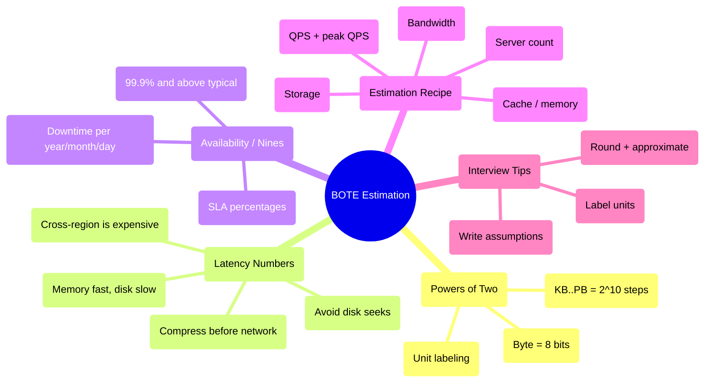
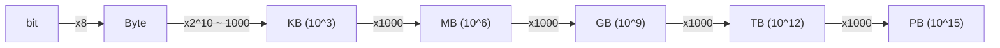
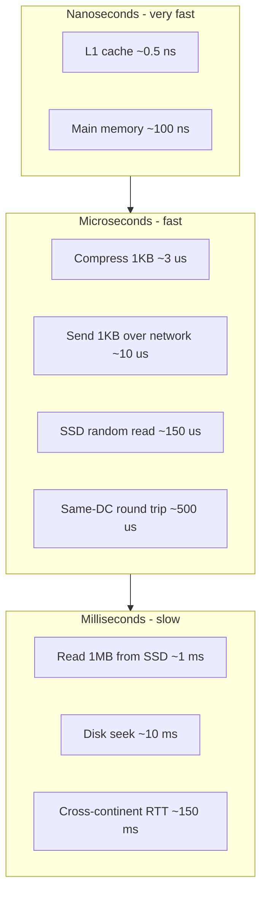
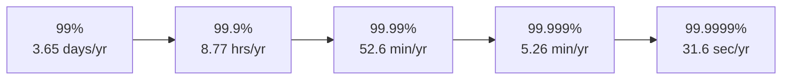
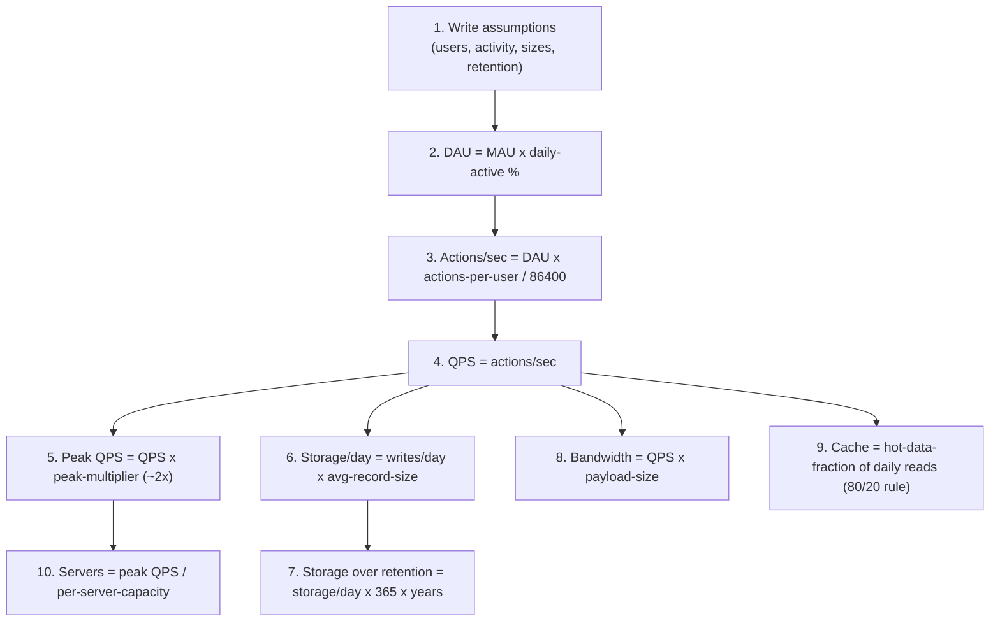
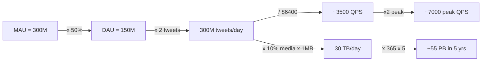
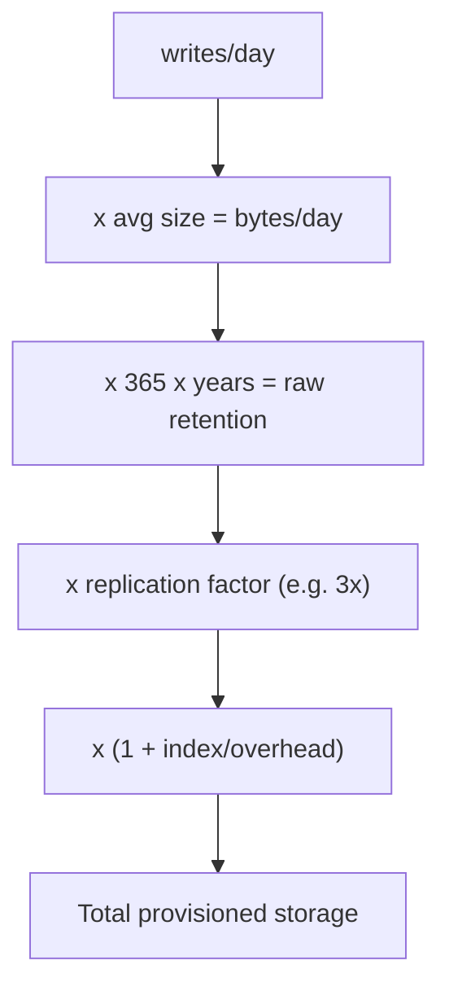
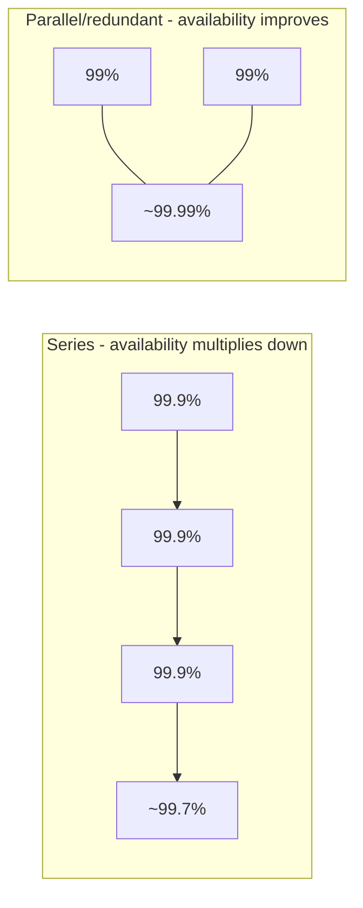

# Alex Xu — Ch 2: Back-of-the-Envelope Estimation

> Fast, approximate capacity math (QPS, storage, bandwidth, memory) to sanity-check designs before building them. | Maps to: Ch 1 (Scale From Zero To Millions) for scaling primitives; every design chapter (Ch 5+) reuses these estimation habits.

---

## 🎯 Overview

A **back-of-the-envelope (BOTE) estimation** is a rough calculation you do — literally on the back of an envelope — to figure out whether a proposed design can meet its performance and capacity requirements. The term is popularized in engineering circles by **Jeff Dean** (Google Senior Fellow): estimates built from *thought experiments* + *common performance numbers* to get a "good feel" for which designs are viable.

In a system design interview you will frequently be asked to estimate **system capacity** or **performance requirements**. The interviewer usually cares far more about your **process and assumptions** than about a precise final number. BOTE math tells you things like:

- How many servers do I need?
- Will this fit in memory / cache, or must it hit disk?
- How much storage will I consume in a year? In 5 years?
- What network bandwidth do I need between regions?
- Is a single database enough, or must I shard?

To do this well you must internalize three pillars:

1. **Powers of two** — the units of data volume (KB → PB) and how to convert.
2. **Latency numbers every programmer should know** — the relative cost of memory vs. disk vs. network operations (Jeff Dean's numbers).
3. **Availability numbers ("nines")** — how SLA percentages map to real downtime.



> **The mental model:** BOTE isn't about being right to 3 decimal places. It's about being right to the correct *order of magnitude* fast, so you can make architecture decisions (cache vs. no cache, one DB vs. sharded, one region vs. multi-region) with confidence.

---

## 🧠 Key Concepts & Vocabulary

### 1. Powers of two — data volume units

All storage math reduces to powers of 2. A **byte** is 8 **bits**. A single ASCII character = 1 byte. Each unit step multiplies by **2¹⁰ = 1,024** (often approximated as 1,000 for BOTE speed).

| Unit | Power (base 2) | Approx (base 10) | Value (bytes) |
|------|----------------|------------------|---------------|
| 1 Byte (B) | 2⁰ · 8 bits | — | 8 bits |
| 1 Kilobyte (KB) | 2¹⁰ | ~1 thousand | 1,024 |
| 1 Megabyte (MB) | 2²⁰ | ~1 million | 1,048,576 |
| 1 Gigabyte (GB) | 2³⁰ | ~1 billion | 1,073,741,824 |
| 1 Terabyte (TB) | 2⁴⁰ | ~1 trillion | 1,099,511,627,776 |
| 1 Petabyte (PB) | 2⁵⁰ | ~1 quadrillion | 1,125,899,906,842,624 |

**BOTE shortcut:** In interviews treat each step as **×1,000** (10³). So `1 KB ≈ 10³ B`, `1 MB ≈ 10⁶ B`, `1 GB ≈ 10⁹ B`, `1 TB ≈ 10¹² B`, `1 PB ≈ 10¹⁵ B`. This "thousands ladder" makes exponent arithmetic trivial.



> ⚠️ **Base-2 vs. base-10 gotcha:** Strictly, 1 KB = 1,024 bytes (KiB), but disk vendors and BOTE math use 1 KB ≈ 1,000. The ~2.4% error per step is irrelevant for order-of-magnitude estimates, and it makes the arithmetic fast. Just be consistent.

### 2. Latency numbers every programmer should know

Jeff Dean published typical operation latencies (circa 2010). Hardware has gotten faster since, but the **relative ratios** remain the essential intuition. A Google engineer's tool (Colin Scott's interactive visualization) keeps these updated over time.

| Operation | Approx latency | Human-scale intuition |
|-----------|---------------|-----------------------|
| L1 cache reference | ~0.5 ns | — |
| Branch mispredict | ~5 ns | — |
| L2 cache reference | ~7 ns | — |
| Mutex lock/unlock | ~25–100 ns | — |
| Main memory (RAM) reference | ~100 ns | Baseline "fast" |
| Compress 1 KB (Snappy/Zippy) | ~2,000–3,000 ns (2–3 µs) | Cheap compression |
| Send 1 KB over 1 Gbps network | ~10 µs | — |
| Read 4 KB randomly from SSD | ~150 µs | — |
| Read 1 MB sequentially from memory | ~250 µs | — |
| Round trip within same datacenter | ~500 µs | — |
| Read 1 MB sequentially from SSD | ~1 ms (1,000 µs) | ~4× slower than RAM for 1 MB |
| Disk (HDD) seek | ~10 ms | Very slow — avoid! |
| Read 1 MB sequentially from disk (HDD) | ~20–30 ms | — |
| Send packet CA → Netherlands → CA (round trip) | ~150 ms | Cross-continent |

**Unit reminders:** `1 ns = 10⁻⁹ s`, `1 µs = 10⁻⁶ s = 1,000 ns`, `1 ms = 10⁻³ s = 1,000 µs = 1,000,000 ns`.



**Five takeaways (the ones interviewers want to hear):**

1. **Memory is fast; disk is slow.** RAM reference (~100 ns) is ~5 orders of magnitude faster than an HDD seek (~10 ms). → Cache aggressively.
2. **Avoid disk seeks** if you can — random disk access is the enemy of latency.
3. **Simple compression is fast** (compressing 1 KB is a few microseconds).
4. **Compress data before sending over the network** — the CPU cost of compression is tiny vs. the network transfer cost.
5. **Cross-region/cross-continent traffic is expensive** (~150 ms round trip). Data centers in different regions incur real transfer latency — minimize chatty cross-region calls.

> **Rule of thumb ladder:** ns (CPU/RAM) → µs (SSD, local network) → ms (spinning disk, WAN). Each tier is roughly 1,000× the previous. If your hot path touches a millisecond-tier operation per request, that's your bottleneck.

### 3. Availability numbers ("the nines")

**High availability (HA)** = a system's ability to stay continuously operational for a long period. Measured as a **percentage of uptime**; 100% means zero downtime. Real services live between 99% and 100%.

An **SLA (Service Level Agreement)** is the formal contract between a service provider and its customers defining the guaranteed uptime. Major cloud providers (AWS, Google Cloud, Azure) set SLAs at **99.9% or above**. Uptime is quoted in **"nines"** — the more nines, the less downtime.

| Availability % | Name | Downtime / day | Downtime / year |
|----------------|------|----------------|-----------------|
| 99% | "two nines" | 14.40 min | 3.65 days |
| 99.9% | "three nines" | 1.44 min | 8.77 hours |
| 99.99% | "four nines" | 8.64 sec | 52.60 min |
| 99.999% | "five nines" | 864 ms | 5.26 min |
| 99.9999% | "six nines" | 86.4 ms | 31.56 sec |



> **How to remember it:** each extra nine cuts downtime by **10×**. 99% ≈ 3.65 days/yr; strip a nine and you divide by 10 (8.77 hrs), and so on. Chasing more nines is expensive — each nine typically requires redundancy, failover, multi-region, and rigorous operational discipline.

---

## 🧮 Estimation Cheat-Sheet

This is the reusable recipe. Memorize the constants and the order of operations.

### Constants worth memorizing

| Quantity | Value | Notes |
|----------|-------|-------|
| Seconds in a day | 86,400 (≈ 10⁵) | 24 × 3,600 |
| Seconds in a day (round) | ~100,000 | BOTE approximation |
| Days in a year | 365 (≈ 400 for round math) | Use 365 for storage |
| Peak-to-average QPS multiplier | 2× (common default) | Depends on workload |
| Read:write ratio (read-heavy apps) | ~100:1 or more | e.g. social feeds |
| Char size (ASCII) | 1 byte | Unicode/UTF-8: 1–4 bytes |
| Typical availability target | 99.9%+ | Cloud SLA baseline |

### The estimation pipeline



### Worked example: Estimate Twitter QPS & storage

> These numbers are illustrative for the exercise — **not** real Twitter figures.

**Assumptions (state them explicitly):**

| Assumption | Value |
|------------|-------|
| Monthly active users (MAU) | 300 million |
| Daily-active fraction | 50% |
| Tweets per user per day | 2 |
| Tweets containing media | 10% |
| Data retention | 5 years |
| Average tweet size | tweet_id 64 B + text 140 B + media 1 MB (if present) |

**QPS estimate (write path — posting tweets):**

```
DAU        = 300M × 50%                                = 150 million
Tweets/day = 150M × 2                                  = 300 million tweets/day
Tweet QPS  = 300M / 86,400 s  (≈ 150M × 2 / 24 / 3600) = ~3,500 QPS
Peak QPS   = 2 × 3,500                                 = ~7,000 QPS
```

**Media storage estimate:**

```
Media tweets/day  = 150M × 2 × 10%                     = 30 million media/day
Media storage/day = 30M × 1 MB                         = 30 TB / day
5-year storage    = 30 TB × 365 × 5                    ≈ 54,750 TB ≈ 55 PB
```



**Bonus derivations (not in the book, shown as method):**

- **Text storage/day:** `300M × (64 + 140) B ≈ 300M × 204 B ≈ 61 GB/day` → ~112 TB over 5 years (tiny vs. media — media dominates).
- **Cache sizing (80/20 rule):** if reads are ~100× writes and 20% of tweets drive 80% of reads, cache the hot 20% of a day's tweets → cheap RAM footprint compared to total storage.
- **Server count:** if one app server handles ~1,000 QPS, `7,000 peak QPS / 1,000 ≈ 7 servers` (plus headroom + redundancy → round up, e.g. 10).

> **Key insight this example teaches:** media (1 MB) dwarfs metadata (204 B) by ~5,000×. Always find the term that dominates the sum — that's where your storage/bandwidth architecture decisions actually matter.

---

## 🔬 Deep Dive — Techniques, alternatives & decisions

### A. Deriving QPS correctly

QPS (queries per second) = total operations in a period ÷ seconds in that period.

```mermaid
sequenceDiagram
  participant You
  participant Board as "Whiteboard"
  You->>Board: Write MAU (e.g., 300M)
  You->>Board: Apply daily-active % -> DAU
  You->>Board: Multiply by actions/user/day
  You->>Board: Divide by 86400 s -> average QPS
  You->>Board: Multiply by peak factor -> peak QPS
  Note over You,Board: Round at each step; keep units visible
```

**Average vs. peak QPS.** Average QPS assumes traffic is evenly spread across 24 hours — it never is. Real traffic has diurnal peaks. A common default is **peak = 2× average**, but justify it: a global consumer app may spike 3–5× in prime-time hours; a batch/enterprise system may be flatter. Size your infrastructure for **peak**, not average.

| Metric | What it tells you | How to get it |
|--------|-------------------|---------------|
| Average QPS | Steady-state load | ops/day ÷ 86,400 |
| Peak QPS | Capacity you must provision | avg QPS × peak factor (2–5×) |
| Read QPS | Cache/replica sizing | write QPS × read:write ratio |

### B. Storage estimation & the retention multiplier

Storage compounds over time. The formula:

```
Total storage = (writes/day) × (avg record size) × 365 × (years of retention) × (replication factor)
```

Don't forget **replication** (e.g., 3× for durability) and **indexes/overhead** (often +10–30%). The book's example omits replication for simplicity — call that out in an interview.



### C. Rounding strategy — the alternatives

You have three ways to handle messy arithmetic. Interviews reward the fastest *defensible* one.

| Approach | Example: 99987 / 9.1 | Speed | Accuracy | When to use |
|----------|----------------------|-------|----------|-------------|
| Exact math | 10,987.6… | ❌ slow | ✅ perfect | Almost never in interview |
| Round then compute | 100,000 / 10 = 10,000 | ✅ fast | ✅ good enough | **Default** |
| Powers-of-ten only | 10⁵ / 10¹ = 10⁴ | ✅✅ fastest | ⚠️ coarse | Order-of-magnitude sanity checks |

The book's guidance: simplify `99987 / 9.1` to `100,000 / 10 = 10,000`. Precision is **not** expected; speed and correctness of *method* are.

### D. Availability: how nines compose across dependencies

If your service depends on N independent components in series, overall availability is the **product** of their availabilities — so it can only get *worse*:

```
A_system = A_1 × A_2 × ... × A_N
```

Example: three services each at 99.9% in series → `0.999³ ≈ 0.997 = 99.7%` (worse than any single one). **Redundancy** (parallel paths) improves it: two parallel 99% components → `1 − (0.01 × 0.01) = 99.99%`.



> This is why chasing five/six nines demands redundancy at every layer — a single-region, single-DB design is capped by its weakest, non-redundant link.

---

## ⚠️ Edge Cases, Bottlenecks & Scaling

- **Peak traffic is the real constraint.** Provisioning for average QPS guarantees outages during daily peaks, launches, or viral events. Always multiply by a peak factor and add headroom.
- **The dominant term hides the truth.** In the Twitter example, media (1 MB) is ~5,000× larger than metadata. If you estimate only metadata you'll under-provision storage by orders of magnitude. Identify and estimate the dominant contributor first.
- **Replication & overhead are easy to forget.** Raw data × 3 (replicas) + index overhead can double or triple your storage bill vs. the naive figure. Mention it even if you don't compute it fully.
- **Base-2 vs. base-10 drift.** Consistently mixing 1,024 and 1,000 across many steps can compound. For BOTE it's fine, but state which you're using.
- **Cross-region latency dominates chatty designs.** ~150 ms per cross-continent round trip means a request making several sequential cross-region calls can blow past a 1-second budget. Batch, cache locally, or co-locate.
- **Disk seeks kill tail latency.** A design that hits random HDD reads on the hot path (~10 ms each) can't compete with an in-memory/SSD design. Cache or move to SSD.
- **Availability math is multiplicative.** Adding more serial dependencies lowers total availability. Scaling out (more nines) requires *parallel redundancy*, failover, and multi-region — each expensive.
- **Assumptions drive everything.** If MAU, daily-active %, or record size are wrong by 10×, every downstream number is wrong by 10×. Write assumptions down so they can be challenged and adjusted.

**Scaling levers implied by the numbers:**

| Bottleneck the math reveals | Scaling response |
|-----------------------------|------------------|
| QPS > single-server capacity | Horizontal scale + load balancer |
| Read QPS ≫ write QPS | Read replicas + cache (CDN for media) |
| Storage > single-disk/DB | Sharding / partitioning + object store for blobs |
| Cross-region latency | Multi-region deployment, edge caching |
| Availability target rising | Redundancy, failover, remove single points of failure |

---

## 🔑 Key Takeaways & Interview Tips

- **The process beats the answer.** Interviewers test problem-solving, not arithmetic. Narrate your reasoning.
- **Round and approximate.** Turn `99987 / 9.1` into `100,000 / 10`. Precision is not expected.
- **Write down your assumptions.** MAU, daily-active %, actions/user, record sizes, retention — write them so you (and the interviewer) can reference and revise them.
- **Label your units.** "5" is ambiguous; "5 MB" is not. Unit errors are the #1 way BOTE goes wrong.
- **Know the three pillars cold:** powers of two (KB→PB, ×1,000 ladder), latency numbers (ns→µs→ms tiers), and the nines table (each nine = 10× less downtime).
- **Practice the common estimates:** QPS, peak QPS, storage, cache size, bandwidth, number of servers. These recur in nearly every design question.
- **Find the dominant term** in any sum (media vs. metadata) and estimate it first.
- **Provision for peak, add replication and headroom**, and don't forget the peak-to-average multiplier.
- **Sanity-check the order of magnitude.** If your answer is a picosecond or a yottabyte, you slipped an exponent — recheck units.

**A crisp script you can reuse in an interview:**
> "Let me state my assumptions… DAU is X. Each user does Y actions/day, so that's Z ops/day. Dividing by ~100k seconds/day gives ~QPS average; I'll assume 2× peak → peak QPS. For storage, the dominant term is media at 1 MB, so it's writes/day × 1 MB × 365 × years, times replication. Roughly, that's an order of magnitude of P petabytes."

---

## 🛠️ Open-Source Implementations (GitHub)

These aren't a "product" for this chapter (it's foundational), but these repos and tools directly embody the chapter's estimation numbers and methodology.

| Project | GitHub | How it relates | Approx stars |
|---------|--------|----------------|--------------|
| System Design Primer | https://github.com/donnemartin/system-design-primer | The canonical open reference the book cites [2]; includes powers-of-two tables, latency numbers, and BOTE "calculate usage" sections for Twitter/Mint/etc. | ~290k+ |
| Interactive Latencies (Colin Scott) | https://github.com/colin-scott/interactive_latencies | Source for the interactive visualization the book uses [3]; plots Jeff Dean's latency numbers over time. Live: https://colin-scott.github.io/personal_website/research/interactive_latency.html | ~1k+ |
| Latency Numbers gist (Jeff Dean / jboner) | https://gist.github.com/jboner/2841832 | The widely-referenced "Latency Numbers Every Programmer Should Know" table. | ~15k+ (gist stars) |
| Awesome Scalability | https://github.com/binhnguyennus/awesome-scalability | Curated engineering blogs/papers on real-world scale, capacity planning, and the numbers behind large systems. | ~62k+ |
| Awesome System Design Resources | https://github.com/ashishps1/awesome-system-design-resources | Collates BOTE cheat-sheets, latency/availability tables, and worked estimation examples. | ~28k+ |

> Star counts are approximate and grow over time; verify on the repo pages.

---

## 🔗 References & Further Reading

1. Jeff Dean — "Google Pro Tip: Use Back-Of-The-Envelope Calculations To Choose The Best Design" (High Scalability): http://highscalability.com/blog/2011/1/26/google-pro-tip-use-back-of-the-envelope-calculations-to-choo.html
2. Donne Martin — System Design Primer: https://github.com/donnemartin/system-design-primer
3. Colin Scott — Latency Numbers Every Programmer Should Know (interactive, updated by year): https://colin-scott.github.io/personal_website/research/interactive_latency.html
4. Amazon EC2 / Compute Service Level Agreement: https://aws.amazon.com/compute/sla/
5. Google Compute Engine Service Level Agreement (SLA): https://cloud.google.com/compute/sla
6. Microsoft Azure — SLA summary for Azure services: https://azure.microsoft.com/en-us/support/legal/sla/summary/
7. Jeff Dean & Luiz Barroso — "The Tail at Scale" (CACM, 2013): https://research.google/pubs/pub40801/ (why latency tails and cross-service composition matter at scale)

---

## ❓ Mock Interview / Self-Check Questions

**Q1. What is a back-of-the-envelope estimation and why do interviewers ask for one?**
It's a quick, approximate calculation combining reasonable assumptions with known performance numbers to gauge whether a design can meet its capacity/performance needs. Interviewers use it to see your problem-solving process, your assumptions, and your ability to reason about scale — not to get a precise number.

**Q2. Convert: how many bytes are in 1 TB, using both base-2 and BOTE approximation?**
Base-2: 1 TB = 2⁴⁰ = 1,099,511,627,776 bytes. BOTE: ≈ 10¹² bytes (one trillion). The ~10% drift is fine for estimation.

**Q3. Give the three key latency tiers and one operation in each.**
Nanoseconds (RAM reference ~100 ns), microseconds (SSD random read ~150 µs, same-DC round trip ~500 µs), milliseconds (HDD seek ~10 ms, cross-continent RTT ~150 ms). Each tier is roughly 1,000× the previous.

**Q4. Why compress data before sending it over the network?**
Compressing ~1 KB costs only a few microseconds of CPU, while network transfer — especially cross-region (~150 ms RTT) — is far more expensive. Trading cheap CPU for reduced bytes-on-wire almost always wins on the network path.

**Q5. What does 99.99% availability translate to in downtime per year?**
About 52.6 minutes per year (~8.6 seconds per day). Each additional nine reduces downtime by ~10×.

**Q6. Estimate the write QPS for a service with 200M DAU where each user performs 5 writes/day. What's a reasonable peak QPS?**
`200M × 5 = 1B writes/day`. `1B / 86,400 ≈ 11,574 ≈ ~11,600 QPS` average. Peak ≈ 2× → **~23,000 QPS** (justify the 2× based on diurnal traffic).

**Q7. In the Twitter example, why is media storage ~55 PB while text is negligible?**
Media is 1 MB per media-tweet vs. ~204 B for id+text — roughly 5,000× larger. With 30M media/day × 1 MB = 30 TB/day, over 5 years (×365×5) ≈ 55 PB. The dominant term (media) determines the storage architecture.

**Q8. Three services each at 99.9% availability are called in series. What's the combined availability, and how do you improve it?**
`0.999³ ≈ 0.997 = 99.7%` — worse than any single component, because serial availabilities multiply. Improve it with redundancy/parallel paths, failover, and removing single points of failure so the effective availability of each dependency rises.

**Q9. Your BOTE gives a storage answer in the exabytes for a small app. What likely went wrong?**
An order-of-magnitude slip — usually a units error (KB vs. MB vs. GB) or a mislabeled exponent. Re-derive with explicit unit labels at each step; the fix is almost always relabeling and re-checking the power of ten.

**Q10. List the four estimation tips and one commonly-asked estimation type.**
Tips: (1) round & approximate, (2) write down assumptions, (3) label units, (4) practice common calcs. Commonly asked: QPS, peak QPS, storage, cache size, and number of servers.
