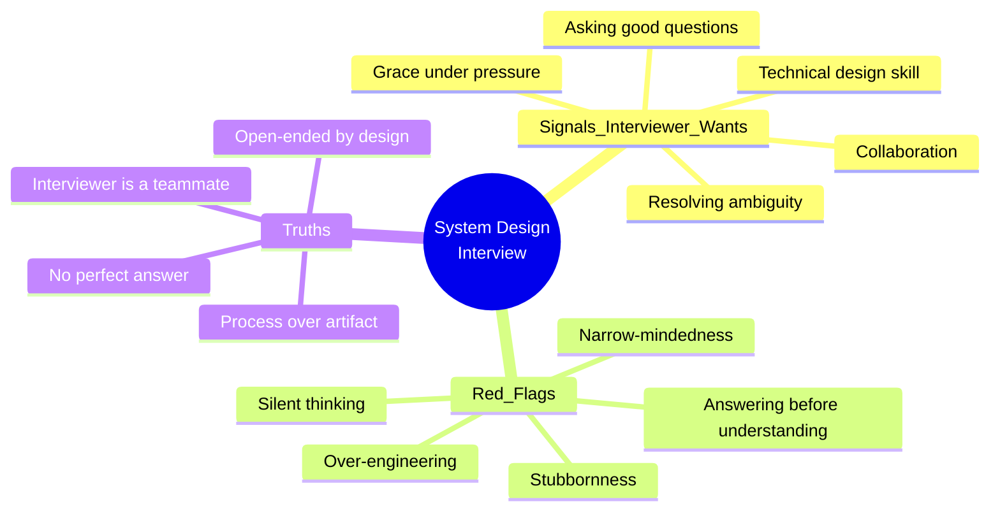
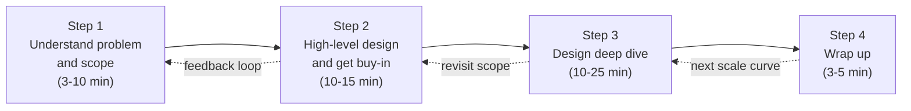
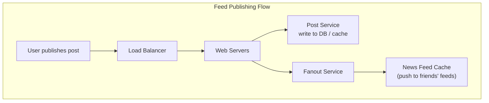
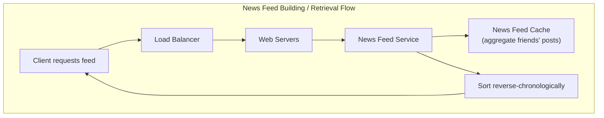
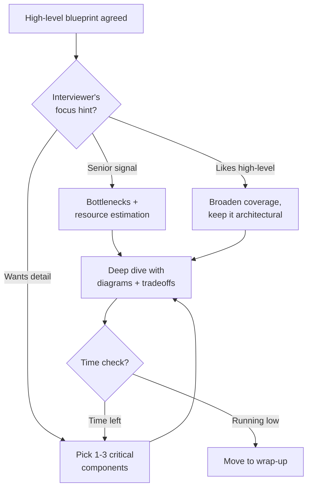
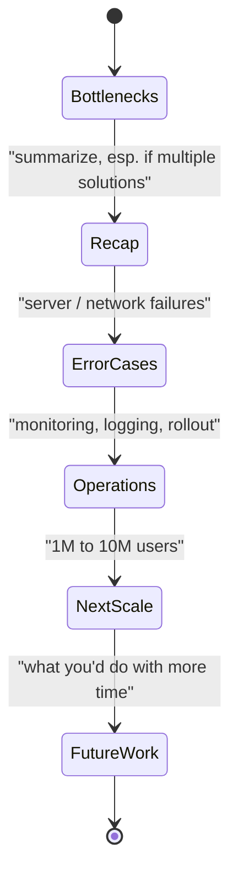
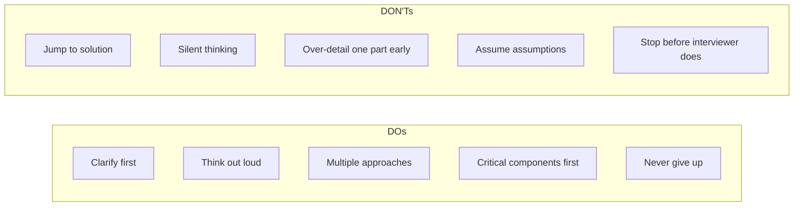

# Alex Xu — Ch 3: A Framework For System Design Interviews

> A repeatable 4-step process (scope → high-level design → deep dive → wrap-up) that turns vague, open-ended system-design prompts into a structured, collaborative conversation. | Maps to: Ch 2 (Back-of-the-Envelope Estimation), Ch 4+ (every design problem applies this framework — Rate Limiter, Unique ID, URL Shortener, Web Crawler, Chat, Autocomplete, YouTube, Google Drive).

---

## 🎯 Overview

A system design interview is **not a trivia contest** and there is **no single correct answer**. It simulates real-world collaboration: two engineers work together on an ambiguous, open-ended problem and converge on a solution that meets agreed goals. The **process matters more than the final artifact** — the interviewer is reading signals about how you think, not grading a blueprint.

**Why companies run these interviews.** Nobody expects you to design Google Search in an hour — hundreds of engineers built the real thing. The interview instead surfaces signals about:

- **Technical design ability** — can you architect a scalable system?
- **Collaboration** — do you treat the interviewer as a teammate?
- **Working under pressure** — do you stay composed when the problem is fuzzy?
- **Constructively resolving ambiguity** — do you ask good questions instead of guessing?
- **Communication** — do you think out loud and defend/revise choices gracefully?

**Red flags interviewers actively hunt for:**

- **Over-engineering** — chasing "design purity," ignoring tradeoffs, and ignoring the compounding operational cost of complexity. This is described in the chapter as a genuine "disease" of many engineers.
- **Narrow-mindedness** — fixating on one solution.
- **Stubbornness** — refusing feedback.
- **Jumping to a solution** ("being like Jimmy") before understanding requirements.
- **Thinking in silence** — not communicating your reasoning.



The heart of the chapter is a **4-step framework** that works across almost any prompt.

---

## 🧠 Key Concepts & Vocabulary

| Term | Meaning in the interview context |
|------|----------------------------------|
| **Design scope** | The explicitly-agreed set of features, scale, and constraints you will actually design for. Established in Step 1. |
| **Buy-in** | Explicit agreement from the interviewer on your high-level blueprint before you go deep. |
| **Back-of-the-envelope estimation** | Quick order-of-magnitude math (QPS, storage, bandwidth, memory) to sanity-check whether a design fits the scale. |
| **Box diagram** | A simple component sketch: clients (mobile/web), API gateway, web servers, data stores, cache, CDN, message queue, etc. |
| **Deep dive** | Focused exploration of the 1–3 most critical / interesting components after buy-in. |
| **Bottleneck** | The component that limits overall throughput/latency; the wrap-up loves discussing these. |
| **DAU** | Daily Active Users — a standard traffic anchor for estimation. |
| **The "next scale curve"** | The question "what changes when we go from 1M → 10M users?" — a classic wrap-up prompt. |
| **Over-engineering** | Adding complexity beyond requirements; the archetypal red flag. |

---

## 🧭 The 4-Step Framework (Deep Dive)

The framework is the core deliverable of the chapter. Every interview is different, but these four steps are the common ground to cover.



### Step 1 — Understand the problem & establish design scope (3–10 min)

**The Jimmy parable.** Jimmy is the kid who blurts the answer fastest, right or wrong. **Don't be like Jimmy.** Answering quickly earns zero bonus points and is a huge red flag. Slow down, think deeply, and ask clarifying questions before proposing anything.

When you ask a question, the interviewer either answers directly **or** tells you to make an assumption. If you're told to assume, **write the assumption down** (whiteboard/paper) — you'll likely need it later.

**Generic clarifying questions to open with:**

- What specific features are we building?
- How many users does the product have?
- How fast will it scale? (anticipated scale at 3 months / 6 months / 1 year)
- What is the company's existing tech stack? Which existing services can we reuse to simplify the design?

```mermaid
sequenceDiagram
    participant C as Candidate
    participant I as Interviewer
    Note over C,I: Example — "Design a news feed system"
    C->>I: Mobile app, web app, or both?
    I-->>C: Both.
    C->>I: Most important features?
    I-->>C: Make a post; see friends' news feed.
    C->>I: Sort order — reverse chronological or weighted?
    I-->>C: Keep it simple — reverse chronological.
    C->>I: Max friends per user?
    I-->>C: 5000.
    C->>I: Traffic volume?
    I-->>C: 10 million DAU.
    C->>I: Text only, or media (images/videos)?
    I-->>C: Media included — images and videos.
    Note over C,I: Scope is now concrete and agreed.
```

**Output of Step 1:** a crisp, agreed statement of features + scale + constraints. Everything downstream is designed against *this* scope, not the maximal imaginable system.

### Step 2 — Propose high-level design & get buy-in (10–15 min)

Goal: an initial blueprint the interviewer explicitly agrees with. **Collaborate** — treat the interviewer as a teammate; many good interviewers love to get involved.

**How to run this step:**

- Sketch an initial blueprint and **ask for feedback**.
- Draw **box diagrams** with key components: clients (mobile/web), APIs, web servers, data stores, cache, CDN, message queue, etc.
- Do **back-of-the-envelope calculations** to check the blueprint fits the scale — **think out loud**, and confirm with the interviewer whether the math is worth doing before diving in.
- Walk through a few **concrete use cases** — this frames the design and often surfaces edge cases you hadn't considered.

**Should you include API endpoints and DB schema here?** *It depends on the problem.* For a huge prompt ("Design Google Search") that's too low-level for this step. For a bounded prompt ("backend for a multiplayer poker game") it's fair game. **Communicate** and decide with the interviewer.

**Worked example — News feed, split into two flows** (details deferred to Ch 11):





**Output of Step 2:** a blueprint with interviewer buy-in and an early sense of which areas the interviewer wants to explore in the deep dive.

### Step 3 — Design deep dive (10–25 min)

By now you should have: agreed goals/scope, a high-level blueprint, interviewer feedback, and some hints about where to focus.

**Work with the interviewer to identify and prioritize components.** Every interview differs:

- Some interviewers prefer to stay at high level.
- **Senior candidates** often get pushed toward performance characteristics — bottlenecks and resource estimation.
- Most commonly, the interviewer wants you to dig into specific components.

**Problem-specific "interesting" deep-dive targets (from the chapter):**

| Problem | Interesting deep-dive |
|---------|----------------------|
| URL shortener | The hash function that maps a long URL → short URL |
| Chat system | Reducing latency; supporting online/offline presence |
| News feed | Feed publishing + feed retrieval use cases |

**Time management is critical.** It's easy to burn minutes on details that don't demonstrate ability. Example: dissecting Facebook's *EdgeRank* feed-ranking algorithm wastes precious time and doesn't prove you can design a **scalable** system. Stay armed with signals; skip unnecessary minutiae.



**Output of Step 3:** detailed design of the highest-value components (e.g., feed publishing + news-feed retrieval), with tradeoffs surfaced.

### Step 4 — Wrap up (3–5 min)

Final step: follow-up questions and free discussion. Productive directions:

- **Identify bottlenecks & improvements.** *Never* claim your design is perfect — there is always something to improve. This showcases critical thinking and leaves a strong final impression.
- **Recap the design** — especially valuable if you proposed multiple solutions; refresh the interviewer's memory after a long session.
- **Error cases** — server failure, network loss, etc.
- **Operational concerns** — how do you monitor metrics and error logs? How do you roll out the system?
- **Next scale curve** — if the current design supports 1M users, what changes are needed for 10M?
- **Future refinements** — what you'd do with more time.



---

## ⚠️ Dos, Don'ts, Bottlenecks & Time Allocation

### Dos ✅

- **Always ask for clarification** — never assume your assumption is correct.
- **Understand the requirements** thoroughly.
- Accept there is **no right / best answer** — a young-startup solution differs from a millions-of-users solution. Design to the *agreed* requirements.
- **Think out loud** — keep the interviewer in the loop.
- **Suggest multiple approaches** when possible.
- Once the blueprint is agreed, **go deep on components — most critical first**.
- **Bounce ideas off** the interviewer; treat them as a teammate.
- **Never give up.**

### Don'ts ❌

- Don't be **unprepared** for typical interview questions.
- Don't **jump to a solution** before clarifying requirements/assumptions.
- Don't over-detail a **single component early** — high-level first, then drill down.
- If stuck, **don't hesitate to ask for hints**.
- Don't **think in silence** — communicate.
- Don't assume you're done when you give a design — **you're done only when the interviewer says so**. Ask for feedback early and often.



### Time allocation (rough guide, 45-minute session)

| Step | Activity | Time |
|------|----------|------|
| 1 | Understand problem & establish scope | 3–10 min |
| 2 | Propose high-level design & get buy-in | 10–15 min |
| 3 | Design deep dive | 10–25 min |
| 4 | Wrap up | 3–5 min |

> These are estimates — actual distribution depends on problem scope and the interviewer's priorities. The deep dive (Step 3) is where the most time and the strongest signals live.

### Bottleneck / anti-pattern watch-list

| Anti-pattern | Why it hurts | Antidote |
|--------------|-------------|----------|
| Being "Jimmy" (answer first) | Signals you skip requirements | Slow down, clarify |
| Over-engineering | Ignores tradeoffs + operational cost | Design to agreed scope only |
| Silent thinking | Interviewer gets no signal | Narrate reasoning continuously |
| Rat-holing on one component early | Burns time, no scalability signal | High-level first, prioritize |
| Claiming a "perfect" design | Shows no critical thinking | Always name a bottleneck/improvement |
| Ignoring feedback (stubbornness) | Signals poor collaboration | Bounce ideas, revise gladly |

---

## 🔑 Key Takeaways & Interview Tips

1. **Clarify before you compute.** The first few minutes on requirements prevent designing the wrong system.
2. **Get buy-in before going deep.** A blueprint the interviewer disagrees with wastes the whole deep dive.
3. **Communicate relentlessly.** The interview measures collaboration and reasoning, not just the diagram.
4. **Prioritize.** Design the most critical components first; manage time so you reach the wrap-up.
5. **Design to scale, not to purity.** Avoid over-engineering; call out tradeoffs explicitly.
6. **Never claim perfection.** Proactively name bottlenecks and the next-scale-curve plan.
7. **Write down assumptions** when told to assume — you'll reference them later.
8. **You're done when the interviewer says so** — keep soliciting feedback.
9. **Match depth to the prompt** — include APIs/schema when the problem is bounded, skip them when it's huge.
10. **Anchor on numbers** — DAU, QPS, storage, and latency figures make the design concrete.

---

## 🛠️ Open-Source Implementations & Study Resources (GitHub)

This is a foundational (process) chapter rather than a build problem, so the most relevant "implementations" are the canonical open-source prep resources, worked-solution repos, and reference cheat-sheets that operationalize the framework.

| Project | GitHub | How it relates | Approx. stars |
|---------|--------|----------------|---------------|
| **system-design-primer** (donnemartin) | https://github.com/donnemartin/system-design-primer | The de-facto open-source companion; encodes the same "gather requirements → high-level → scale/bottlenecks → iterate" loop, with worked solutions (Pastebin, Twitter timeline, scaling AWS) and Anki flashcards | ~290k+ |
| **awesome-system-design-resources** (ashishps1) | https://github.com/ashishps1/awesome-system-design-resources | Curated concepts, case studies, and interview-framework material mirroring Xu's structure | ~30k+ |
| **system-design** (karanpratapsingh) | https://github.com/karanpratapsingh/system-design | Free course covering the process, estimation, and component deep-dives | ~35k+ |
| **latency.txt** (jboner gist) | https://gist.github.com/jboner/2841832 | "Latency Numbers Every Programmer Should Know" — the canonical table for the back-of-the-envelope math in Step 2 | ~2k+ forks |
| **awesome-scalability** (binhnguyennus) | https://github.com/binhnguyennus/awesome-scalability | Real-world architectures + eng-blog links for grounding deep-dive and scaling discussions | ~63k+ |
| **system-design-interview** (checkcheckzz) | https://github.com/checkcheckzz/system-design-interview | Collection of company engineering blogs and design write-ups useful for deep-dive prep | ~11k+ |

> Star counts are approximate and grow over time — treat them as order-of-magnitude signals of adoption, not exact figures.

---

## 🔗 References & Further Reading

- Alex Xu, *System Design Interview: An Insider's Guide* (2020), Ch. 3 — the source chapter. Ch. 2 covers back-of-the-envelope estimation; Ch. 11 covers the full News Feed design used as this chapter's running example.
- donnemartin — System Design Primer: https://github.com/donnemartin/system-design-primer
- Jeff Dean / Peter Norvig — "Latency Numbers Every Programmer Should Know" (jboner gist): https://gist.github.com/jboner/2841832
- Peter Norvig — "Teach Yourself Programming in Ten Years" (origin of the latency table): https://norvig.com/21-days.html#answers
- AWS Well-Architected Framework (operational excellence, reliability, performance — mirrors the wrap-up concerns): https://aws.amazon.com/architecture/well-architected/
- ashishps1 — System Design 101: https://github.com/ashishps1/awesome-system-design-resources
- High Scalability blog (real-world architecture case studies): http://highscalability.com/

---

## ❓ Mock Interview / Self-Check Questions

**Q1. What is the single biggest mistake to avoid in the first 5 minutes, and why?**
Jumping straight to a solution ("being like Jimmy"). It signals you'll build the wrong system because you skipped requirements. The correct move is to slow down and ask clarifying questions about features, users, scale, and existing tech stack — the interview is not a trivia contest and has no single right answer.

**Q2. Name the four steps of the framework and their rough time budgets in a 45-minute interview.**
(1) Understand problem & establish scope — 3–10 min; (2) Propose high-level design & get buy-in — 10–15 min; (3) Design deep dive — 10–25 min; (4) Wrap up — 3–5 min. These are rough; the deep dive typically carries the strongest signals.

**Q3. When should you include API endpoints and a database schema in the high-level design?**
It depends on the problem's scope. For a very broad prompt (e.g., "Design Google Search") APIs/schema are too low-level for Step 2. For a bounded prompt (e.g., a multiplayer-poker backend) they're appropriate. Confirm with the interviewer rather than assuming.

**Q4. What does "get buy-in" mean and why is it important before the deep dive?**
It means securing the interviewer's explicit agreement on your high-level blueprint. Without it, you risk spending the entire deep dive elaborating a design the interviewer already disagrees with — wasted time and a weak signal. Collaboration also earns positive signals.

**Q5. Give three examples of good deep-dive targets tied to specific problems.**
URL shortener → the hash function converting long URL to short; chat system → reducing latency and supporting online/offline presence; news feed → the feed-publishing and feed-retrieval use cases.

**Q6. Why is over-engineering considered a red flag, and how do you avoid it?**
Over-engineering ignores tradeoffs and the compounding operational cost of complexity — companies pay dearly for it. Avoid it by designing strictly to the agreed requirements and scale, explicitly calling out tradeoffs, and resisting "design purity" for its own sake.

**Q7. In the wrap-up, why should you never say your design is perfect?**
There is always something to improve. Proactively naming bottlenecks and improvements demonstrates critical thinking and leaves a strong final impression; claiming perfection signals the opposite.

**Q8. What is the "next scale curve" question and how would you approach it?**
It asks: if the design supports 1M users, what must change to support 10M? Approach it by identifying bottlenecks (DB, cache, single points of failure), then discussing horizontal scaling, sharding, caching layers, CDNs, queues, and load balancing — grounded in updated back-of-the-envelope numbers.

**Q9. The interviewer asks you to "make an assumption" instead of answering. What do you do?**
State a reasonable assumption out loud and write it down (whiteboard/paper), because you'll likely reference it later when justifying design decisions. Keep it consistent with the agreed scope.

**Q10. Beyond technical design, what signals is the interviewer assessing?**
Collaboration (teammate mindset), working under pressure, constructively resolving ambiguity, asking good questions, and clear communication (thinking out loud) — plus the absence of red flags like narrow-mindedness and stubbornness.
