# Alex Xu — Ch 4: Design A Rate Limiter

> How to throttle client traffic accurately, cheaply, and at scale — the five canonical algorithms and a Redis-backed distributed design. | Maps to: [../../system-design/01-easy/rate-limiting.md](../../system-design/01-easy/rate-limiting.md)

---

## 🎯 The Problem

A **rate limiter** controls the rate of traffic sent by a client or service. In an HTTP context it caps how many requests a client may send within a time window; excess requests are blocked (typically with `HTTP 429 Too Many Requests`).

Real-world limit examples:
- A user may post no more than **2 posts per second**.
- No more than **10 accounts per day** may be created from the same IP.
- A device may claim rewards no more than **5 times per week**.

**Why rate limit?**
- **Prevent resource starvation from DoS attacks** (intentional or accidental). Twitter historically limited ~300 tweets / 3 hours; Google Docs API defaults to ~300 reads/user/60s.
- **Reduce cost** — fewer servers, and critical when you pay per-call for third-party APIs (credit checks, payments, health records).
- **Prevent server overload** from bots or misbehaving clients.

**Interview prompt:** *"Design a server-side API rate limiter that is accurate, low-latency, memory-efficient, works in a distributed environment, is fault-tolerant, and clearly informs throttled clients."*

---

## 📋 Requirements

### Clarifying questions to ask first

| Question | Answer taken in this chapter |
|---|---|
| Client-side or server-side limiter? | **Server-side API limiter** |
| Throttle by IP, user ID, or other properties? | Must be **flexible** — support different rule sets |
| What scale? | **Large** — must handle a high request volume |
| Distributed environment? | **Yes** |
| Separate service or in application code? | **Design decision left to you** |
| Should throttled users be informed? | **Yes** |

### Functional requirements

| # | Requirement |
|---|---|
| F1 | Accurately limit excessive requests |
| F2 | Support flexible throttle rules (per IP, per user, per endpoint, global) |
| F3 | Clearly signal throttling to clients (status code + headers) |
| F4 | Work across multiple servers / processes (distributed) |

### Non-functional requirements

| # | Requirement | Notes |
|---|---|---|
| N1 | **Low latency** | Must not slow HTTP responses |
| N2 | **Memory efficient** | Use as little memory as possible |
| N3 | **Distributed** | Shared state across many servers |
| N4 | **High fault tolerance** | If the limiter's cache goes down, the whole system must not fail |
| N5 | **Exception handling** | Clean, informative throttling responses |

---

## 🧮 Back-of-the-Envelope Estimation

The chapter is algorithm-focused and gives few raw numbers, so the following are **my reasonable estimates** to size the design.

Assume a large service:
- **1,000,000 active users**, peak **10,000 requests/sec (QPS)** hitting the limiter.
- Limiter adds a Redis round-trip per request.

**Latency budget**
- A single Redis `INCR`/`EXPIRE` or Lua script call ≈ **0.2–1 ms** in-datacenter.
- Target added latency **< 1 ms p99** so the limiter is effectively invisible (N1).

**Redis throughput**
- A single Redis node handles ~**100k ops/sec** of simple commands.
- At 10k QPS with ~2 ops/request (INCR + EXPIRE) ≈ **20k ops/sec** → comfortably one node, but shard/replicate for headroom and fault tolerance.

**Memory per counter**
- Fixed/sliding-window **counter** ≈ one integer + key ≈ **~50–100 bytes** per (user, window) key.
- 1M users × 1 active window ≈ **~50–100 MB** — trivial. Fits easily in RAM (N2).

**Memory for sliding window log (worst case)**
- Stores a timestamp per request. If limit = 100 req/min and 1M users are all near their cap:
  `1,000,000 users × 100 timestamps × ~20 bytes ≈ 2 GB`.
- This is why the **log** algorithm is memory-hungry vs. counter approaches.

**Takeaway:** Counters cost bytes; logs cost kilobytes per user. Choose accordingly.

---

## 🏗️ High-Level Design

### Where to place the limiter?

- **Client-side** — unreliable; requests can be forged and you may not control the client. ❌
- **Server-side** — enforce inside API servers, or as a dedicated **middleware / API gateway** in front of them. ✅

An **API gateway** is a managed middleware that commonly bundles rate limiting with SSL termination, authentication, IP allowlisting, and static content. Whether to build your own limiter or use a gateway depends on your stack, engineering resources, and whether you already run microservices with a gateway.

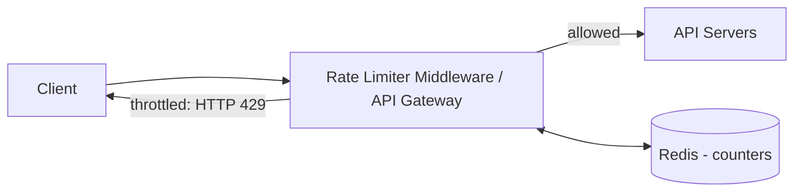

**Worked example (2 requests/sec):** a client fires 3 requests inside one second → first two reach the API servers; the third is throttled with `HTTP 429 Too Many Requests`.

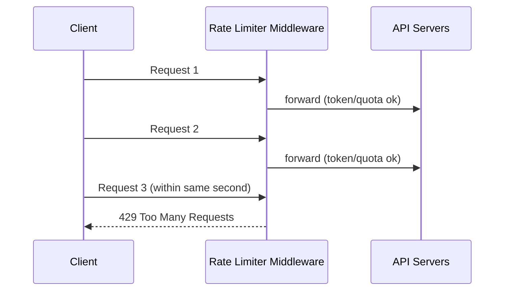

### API / response contract

Clients learn their state from **HTTP response headers**:

| Header | Meaning |
|---|---|
| `X-Ratelimit-Limit` | Max calls allowed per window |
| `X-Ratelimit-Remaining` | Remaining allowed requests in the current window |
| `X-Ratelimit-Retry-After` | Seconds to wait before retrying without being throttled |

On limit exceeded → return **`429 Too Many Requests`** plus `X-Ratelimit-Retry-After`. Optionally **enqueue** rate-limited requests for later processing (e.g., orders throttled during overload).

### Rule / data model

Rules are typically written in config files on disk (this is the shape used by Lyft's open-source limiter):

```yaml
domain: messaging
descriptors:
  - key: message_type
    value: marketing
    rate_limit:
      unit: day
      requests_per_unit: 5   # max 5 marketing messages per day
```
```yaml
domain: auth
descriptors:
  - key: auth_type
    value: login
    rate_limit:
      unit: minute
      requests_per_unit: 5   # max 5 logins per minute
```

**Counter storage:** a database is too slow (disk). Use an **in-memory cache** — **Redis** is the standard choice because it is fast and supports TTL-based expiration via two commands:
- `INCR` — increment the counter by 1.
- `EXPIRE` — set a timeout; the counter auto-deletes when it expires.

---

## 🔬 Deep Dive

The core question is *which algorithm counts the requests*. Five canonical algorithms follow, each with trade-offs.

### Summary comparison

| Algorithm | Memory | Bursts allowed? | Accuracy | Notes |
|---|---|---|---|---|
| **Token bucket** | Low | ✅ Yes (up to bucket size) | Good | Used by Amazon & Stripe; 2 params |
| **Leaking bucket** | Low | ❌ Smooths to fixed rate | Good | FIFO queue; used by Shopify |
| **Fixed window counter** | Low | ⚠️ Edge-of-window spikes | Approximate | Simplest |
| **Sliding window log** | **High** | ❌ | **Exact** | Stores every timestamp |
| **Sliding window counter** | Low | Smoothed | Approximate (~0.003% error, Cloudflare) | Hybrid of the two |

---

### 1) Token bucket

A bucket of fixed **capacity** is refilled with tokens at a preset **refill rate**. Overflow tokens are discarded. Each request consumes one token; if the bucket is empty, the request is dropped.

- **Params:** bucket size (max tokens), refill rate (tokens/sec).
- **How many buckets?** Depends on rules — one per endpoint, one per IP, one per user, or a single global bucket for a system-wide cap.

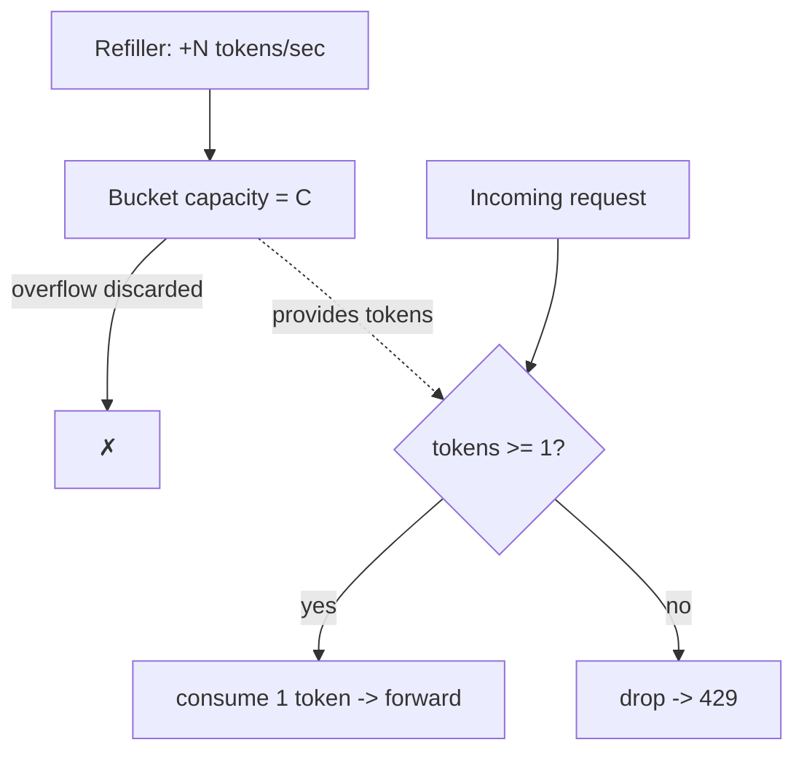

**Pros:** easy, memory-efficient, **allows short bursts**. **Cons:** two params (size & refill) can be hard to tune.

---

### 2) Leaking bucket

Requests enter a **FIFO queue** (the "bucket"); if the queue is full, the request is dropped. Requests **leak out** (are processed) at a fixed rate.

- **Params:** bucket size (= queue size), outflow rate (requests processed/sec).

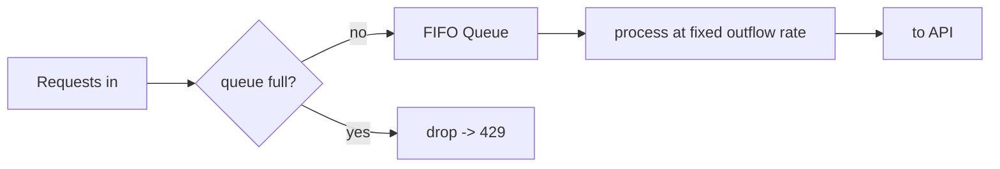

**Pros:** memory-efficient; **stable, smooth outflow**. **Cons:** a burst of old requests fills the queue and can starve fresh ones; two params to tune. (Shopify uses leaky buckets.)

---

### 3) Fixed window counter

Time is divided into fixed windows (e.g., 1 second / 1 minute). Each window has a counter; each request increments it; once the threshold is hit, further requests in that window are dropped until the next window starts.

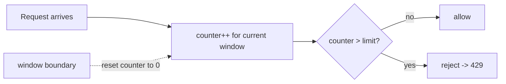

**The edge-spike flaw:** because windows reset on round boundaries, a burst straddling a boundary can pass **up to 2× the limit**.

```mermaid
gantt
    title "Fixed window edge burst (limit = 5/min)"
    dateFormat  HH:mm:ss
    axisFormat  %H:%M:%S
    section Window 2:00-2:01
    5 requests near 2:00:30 :a1, 2000-01-01 02:00:30, 30s
    section Window 2:01-2:02
    5 requests near 2:01:00 :a2, 2000-01-01 02:01:00, 30s
```
In the rolling minute **2:00:30 → 2:01:30**, ten requests slip through — double the allowed five.

**Pros:** memory-efficient, easy to understand, clean quota reset. **Cons:** edge-of-window bursts exceed the quota.

---

### 4) Sliding window log

Fixes the fixed-window edge problem by tracking **individual request timestamps**, usually in a **Redis sorted set**.

Algorithm on each request:
1. Remove all timestamps **older than** the current window start (outdated entries).
2. Add the new request's timestamp to the log.
3. If the log size ≤ allowed count → **accept**; otherwise **reject** (the timestamp may still remain in the log).

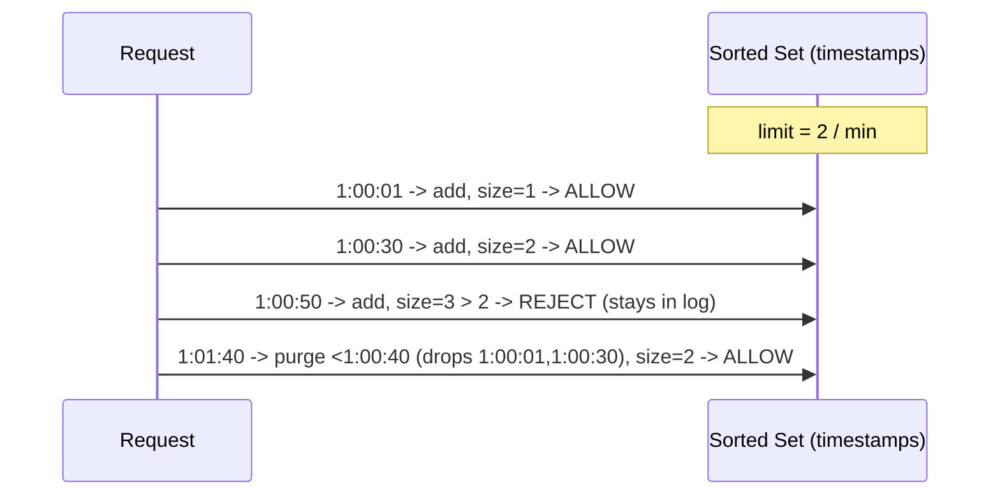

**Pros:** **very accurate** — no rolling window ever exceeds the limit. **Cons:** **memory-heavy** — timestamps are stored even for rejected requests.

---

### 5) Sliding window counter (hybrid)

Combines fixed-window counters with sliding-window smoothing. For a new request, estimate the count in the rolling window as:

```
count = requests_in_current_window
      + requests_in_previous_window * overlap_fraction_of_previous_window
```

**Worked example:** limit = 7/min. Previous minute = 5 requests, current minute = 3 requests. A request arrives 30% into the current minute, so the rolling window overlaps the previous window by 70%:

```
count = 3 + 5 * 0.70 = 6.5  ->  rounded down to 6
6 < 7  ->  ALLOW  (one more request would hit the limit)
```

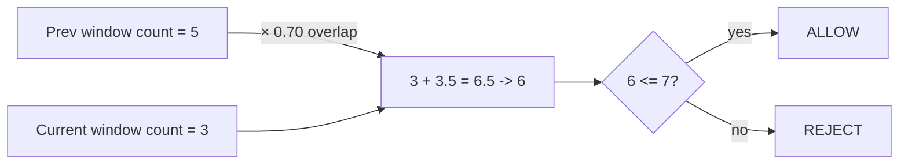

**Pros:** smooths spikes (uses previous-window average), memory-efficient. **Cons:** an **approximation** — assumes even distribution in the previous window. Per Cloudflare, only **~0.003% of 400M requests** were wrongly handled — negligible for non-strict limits.

---

### Detailed architecture

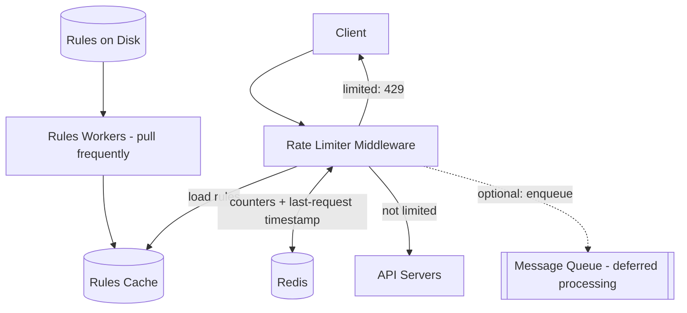

Flow: workers periodically pull rules from disk into a cache → each request hits the middleware → it loads rules from cache, reads counters/timestamps from Redis → **forward** if under limit, else return **429** (and optionally enqueue the request).

---

## ⚠️ Edge Cases, Bottlenecks & Scaling

### Race conditions (concurrency)

The naive read → check → write sequence is not atomic. If Redis counter = 3 and two requests read it concurrently before either writes back, both compute 4 and store 4 — but the correct value is **5**. Lost updates let clients exceed the limit.

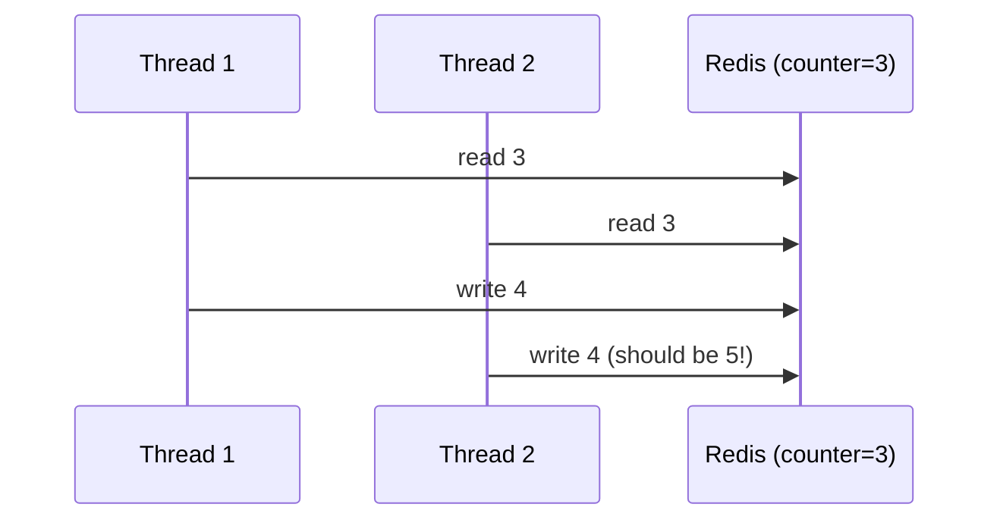

**Fixes:**
- **Locks** — correct but **slow** (serializes hot keys). Avoid.
- **Redis Lua scripts** — run read-check-increment **atomically** server-side. ✅ Preferred.
- **Sorted sets** — atomic add/remove/count operations for sliding-window log. ✅

### Synchronization across many limiter servers

With multiple stateless limiter servers, client 2's requests may hit limiter 1, which has no data about client 2 → limits break.

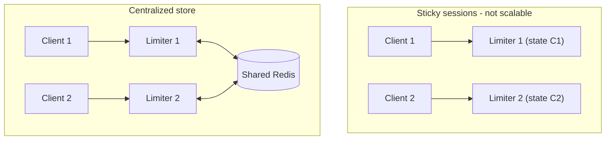

- **Sticky sessions** pin a client to one limiter — **not** scalable or flexible. ❌
- **Centralized data store (Redis)** shared by all limiters — the recommended solution. ✅

### Fault tolerance (N4)

If Redis goes offline, the limiter must **not** take down the whole system. Common strategies (fail-open vs fail-closed) trade availability against protection — often **fail-open** (allow traffic) for user-facing APIs so a cache outage doesn't cause an outage.

### Performance optimization

- **Multi-datacenter / edge:** route clients to the nearest edge server to cut latency (e.g., Cloudflare operated ~194 edge locations as of 2020).
- **Eventual consistency:** synchronize counters across regions with an eventual-consistency model rather than strict global locking (see Chapter 6, "Consistency").

### Monitoring

Gather analytics to confirm the **algorithm** and **rules** are effective:
- Rules too strict → valid requests dropped → relax them.
- Limiter ineffective during a **flash sale / traffic spike** → switch to an algorithm that tolerates bursts (**token bucket**).

### Hot spots & scaling

- **Hot keys** (a viral user/IP, or a global bucket) concentrate load on one Redis shard → mitigate with local pre-checks, key sharding, or per-instance token buckets that sync periodically.
- Scale Redis with **replication + sharding**; keep limiter middleware **stateless** and horizontally scalable.

---

## 🔑 Key Takeaways & Interview Tips

- **Clarify scope first:** server-side, distributed, flexible rules, must inform clients. State these before designing.
- **Know all five algorithms cold** and their trade-offs — the interviewer wants the *comparison*, not one answer:
  - **Token bucket** → bursts allowed; the default many companies use (Amazon, Stripe).
  - **Leaking bucket** → smooth fixed outflow (Shopify).
  - **Fixed window** → simplest, but 2× edge-burst flaw.
  - **Sliding window log** → exact but memory-hungry.
  - **Sliding window counter** → memory-efficient approximation (~0.003% error).
- **Storage:** Redis in-memory with `INCR` + `EXPIRE`; never a disk DB for counters.
- **Distributed correctness:** call out **race conditions** (fix with **Lua scripts** or **sorted sets**, not locks) and **synchronization** (use **centralized Redis**, not sticky sessions).
- **Client contract:** return `429` + `X-Ratelimit-*` headers; optionally enqueue.
- **Extra talking points if time allows:**
  - **Hard vs soft** limiting (never exceed vs. brief overshoot allowed).
  - **Layer of enforcement:** L7 application (HTTP) vs L3 network (e.g., `iptables` per IP).
  - **Good client behavior:** cache, respect limits, catch errors, exponential back-off on retry.

---

## 🛠️ Open-Source Implementations (GitHub)

| Project | GitHub | How it relates | Approx stars |
|---|---|---|---|
| **envoyproxy/ratelimit** (formerly lyft/ratelimit) | https://github.com/envoyproxy/ratelimit | The Go/gRPC domain+descriptor limiter referenced in the chapter; reads YAML rules, talks to Redis | ~2.3k |
| **brandur/redis-cell** | https://github.com/brandur/redis-cell | Redis module implementing **GCRA** (token-bucket-like) rate limiting as one atomic `CL.THROTTLE` command; Rust | ~1.4k |
| **bucket4j/bucket4j** | https://github.com/bucket4j/bucket4j | Java **token-bucket** library; distributed via JCache (Hazelcast, Ignite, Infinispan, Redis) | ~2.4k |
| **throttled/throttled** | https://github.com/throttled/throttled | Go library implementing **GCRA** rate limiting for HTTP endpoints | ~1.1k |
| **resilience4j** | https://github.com/resilience4j/resilience4j | JVM fault-tolerance library with a `RateLimiter` module alongside circuit breakers/bulkheads | ~13k |
| **rwz/redis-gcra** | https://github.com/rwz/redis-gcra | Ruby, Redis-backed GCRA rate limiter (Lua, atomic) | ~0.2k |
| **projectdiscovery/ratelimit** | https://github.com/projectdiscovery/ratelimit | Go blocking token-bucket limiter used across ProjectDiscovery scanners | ~0.1k |

*(Star counts are approximate and change over time; treat as ballpark.)*

---

## 🔗 References & Further Reading

- Google Cloud — Rate-limiting strategies and techniques: https://cloud.google.com/architecture/rate-limiting-strategies-techniques
- Stripe — Scaling your API with rate limiters: https://stripe.com/blog/rate-limiters
- Stripe / ptarjan — Rate limiter Lua reference (gist): https://gist.github.com/ptarjan/e38f45f2dfe601419ca3af937fff574d#request-rate-limiter
- AWS API Gateway — Throttle API requests: https://docs.aws.amazon.com/apigateway/latest/developerguide/api-gateway-request-throttling.html
- Cloudflare — How we built rate limiting to millions of domains (sliding window counter, ~0.003% error): https://blog.cloudflare.com/counting-things-a-lot-of-different-things/
- ClassDojo Engineering — Better rate limiting with Redis sorted sets: https://engineering.classdojo.com/blog/2015/02/06/rolling-rate-limiter/
- Redis — INCR / EXPIRE and rate limiting patterns: https://redis.io/
- redis-cell blog (GCRA in Redis): https://redis.io/blog/redis-cell-rate-limiting-redis-module/
- Wikipedia — GCRA (Generic Cell Rate Algorithm): https://en.wikipedia.org/wiki/Generic_cell_rate_algorithm
- Wikipedia — OSI model (for L3 vs L7 discussion): https://en.wikipedia.org/wiki/OSI_model
- iptables rate limiting: https://blog.programster.org/rate-limit-requests-with-iptables

---

## ❓ Mock Interview / Self-Check Questions

**Q1. Why not enforce rate limiting on the client side?**
Clients are untrusted — requests can be forged and you often don't control the client. Enforce server-side (in the API layer, a middleware, or an API gateway).

**Q2. When would you pick token bucket over leaking bucket?**
Token bucket **allows short bursts** (any request passes while tokens remain), which suits spiky but bounded traffic like flash sales. Leaking bucket enforces a **smooth, constant outflow** via a FIFO queue — better when downstream needs a stable, predictable processing rate. Downside of leaking bucket: a burst of old requests can starve fresh ones.

**Q3. What's the flaw in the fixed window counter, and how do sliding approaches fix it?**
Windows reset on fixed boundaries, so a burst straddling the boundary can pass up to **2× the limit** in a rolling window. **Sliding window log** fixes it exactly by tracking timestamps; **sliding window counter** approximates it by weighting the previous window's count by the overlap fraction.

**Q4. Sliding window log is the most accurate — why not always use it?**
It stores a timestamp per request (even rejected ones), so memory grows with request volume — potentially gigabytes for many high-limit users. Counter-based methods cost only a few bytes per key.

**Q5. Compute the sliding-window-counter decision: limit 7/min, previous minute had 5 requests, current minute has 3, request arrives 30% into the current minute.**
Overlap with previous window = 70%. `count = 3 + 5 × 0.70 = 6.5 → 6`. Since `6 ≤ 7`, **allow**; the next request would hit the limit.

**Q6. How do you prevent race conditions on the counter in a concurrent, distributed setup?**
The read→check→increment sequence must be atomic. Avoid locks (too slow). Use **Redis Lua scripts** to run the whole operation atomically server-side, or **sorted sets** for the sliding-window-log approach.

**Q7. Two limiter servers, one client — why can limits break, and what's the fix?**
A stateless web tier can route the same client to different limiters; each limiter only sees part of the traffic, so the aggregate limit isn't enforced. Fix with a **centralized shared store (Redis)** rather than **sticky sessions** (which don't scale).

**Q8. What happens when the Redis backing store fails?**
Design for fault tolerance: the limiter must not take down the system. Typically **fail-open** (allow traffic) for user-facing APIs so a cache outage doesn't cause an outage, accepting temporary loss of protection. Add replication/sharding to reduce the chance of total failure.

**Q9. What does the client receive when throttled, and how does it self-correct?**
`HTTP 429 Too Many Requests` plus headers `X-Ratelimit-Limit`, `X-Ratelimit-Remaining`, and `X-Ratelimit-Retry-After`. A well-behaved client caches responses, respects the limit, catches errors, and retries with sufficient (exponential) back-off.

**Q10. What's the difference between hard and soft rate limiting, and at which OSI layers can you limit?**
**Hard**: requests can never exceed the threshold. **Soft**: brief overshoot is tolerated. Limiting can be applied at **L7 (application/HTTP)** — the focus of this chapter — or lower, e.g., **L3 (network/IP)** using `iptables`.
