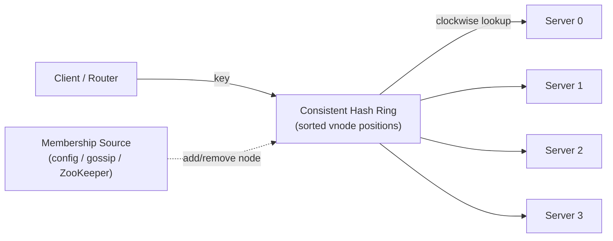
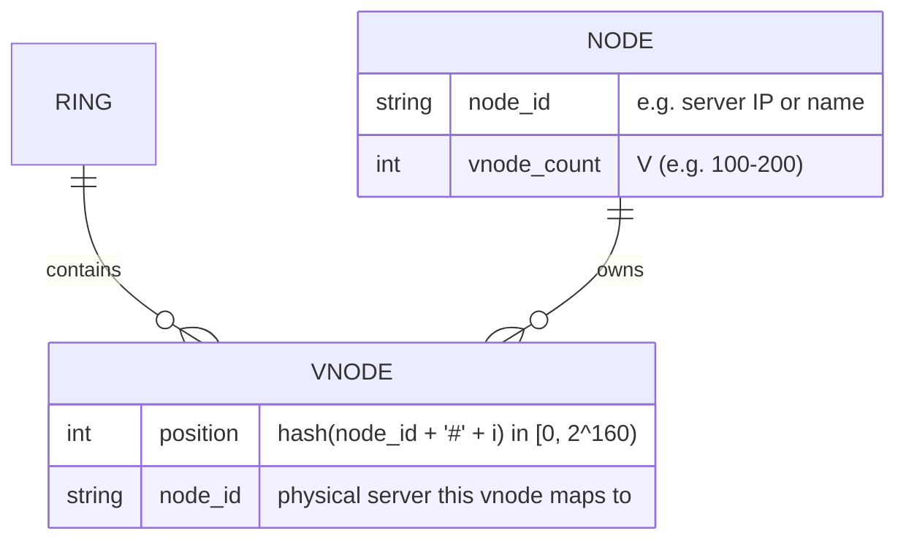
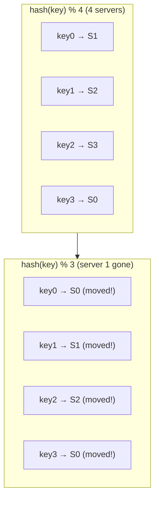
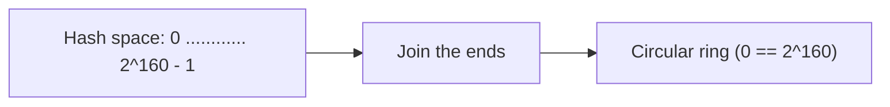
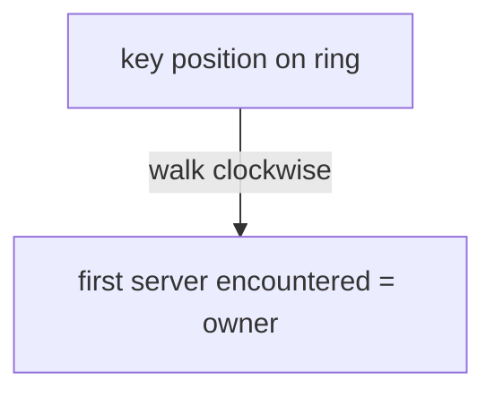
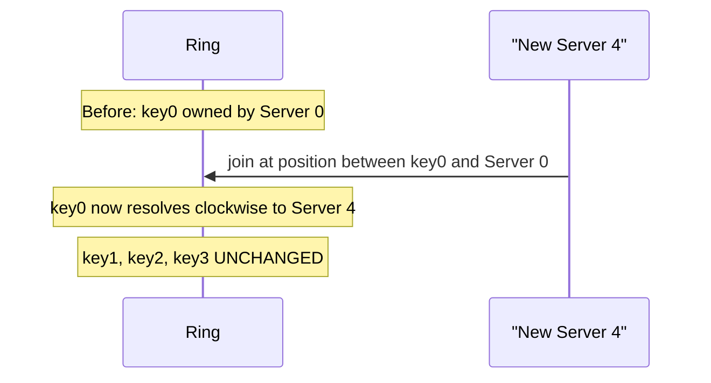
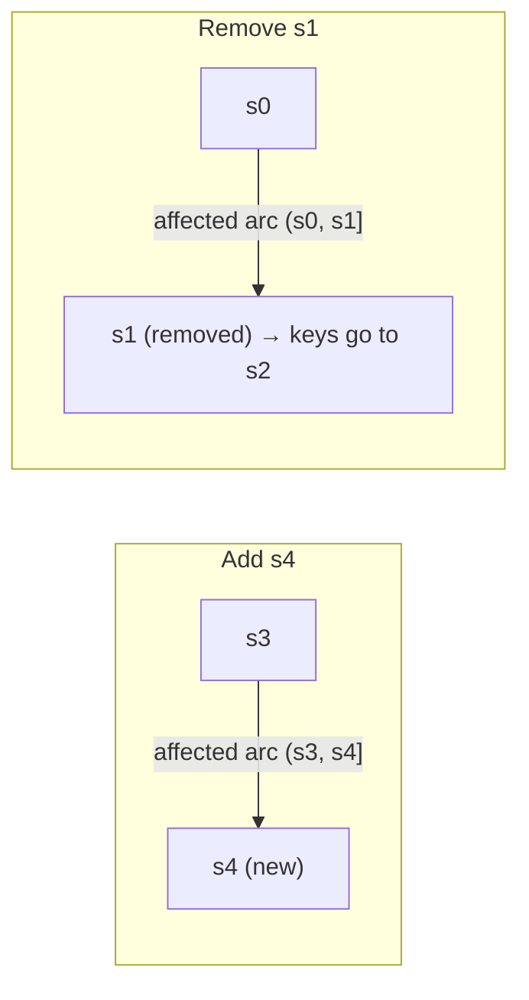
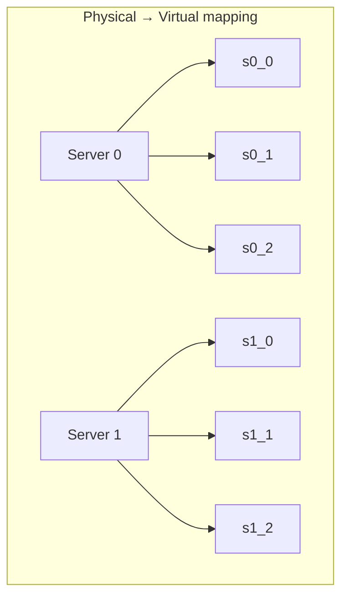

# Alex Xu — Ch 5: Design Consistent Hashing

> The technique that lets you add/remove servers while remapping only ~k/n keys instead of nearly all of them. | Maps to: [../../system-design/02-moderate/consistent-hashing.md](../../system-design/02-moderate/consistent-hashing.md)

---

## 🎯 The Problem

**Interview prompt:** *"You run a fleet of `N` cache (or shard) servers and distribute keys across them using `hash(key) % N`. This works fine until a server dies or you add capacity. What happens then, and how do you design a scheme that minimizes disruption when the server count changes?"*

The naïve approach — modulo hashing — has a fatal flaw during **rescaling**. When `N` changes, the divisor in `hash(key) % N` changes, so *almost every* key maps to a *different* server. For a cache, this means a mass **cache-miss storm**: clients suddenly query servers that don't hold their data, and every miss hits the origin database. For a sharded database, it means a massive, coordinated data-migration event.

We need a distribution scheme where **adding or removing one node only moves the keys that node is responsible for**, not the entire keyspace. That scheme is **consistent hashing**, introduced by Karger et al. at MIT (1997).

**What we are "designing":** not a product with a UI, but a *distributed data-placement algorithm* — the partitioning layer that sits underneath caches, databases, load balancers, and CDNs.

---

## 📋 Requirements

### Functional Requirements

| # | Requirement |
|---|-------------|
| F1 | Given a key, deterministically map it to exactly one server (the "owner"). |
| F2 | Support adding a server at runtime with minimal key movement. |
| F3 | Support removing a server (planned or crash) with minimal key movement. |
| F4 | Distribute keys as evenly as possible across servers (avoid hotspots). |
| F5 | Efficiently identify *which* keys must be redistributed when membership changes. |

### Non-Functional Requirements

| # | Requirement | Target / Note |
|---|-------------|---------------|
| N1 | **Minimal remap** on membership change | Only ~`k/n` keys move on average (`k`=#keys, `n`=#nodes) |
| N2 | **Balanced load** | Standard deviation of per-node load small (≈5–10% of mean with 100–200 vnodes) |
| N3 | **Fast lookup** | O(log V) where V = number of virtual nodes (binary search on sorted ring) |
| N4 | **Horizontal scalability** | Adding nodes should smoothly increase capacity |
| N5 | **No global coordinator required** for the lookup itself (ring is derivable from membership) |
| N6 | **Tunable** memory-vs-balance tradeoff (number of virtual nodes) |

### Clarifying Questions to Ask the Interviewer

- Is this for a **cache** (miss = extra DB load) or a **database shard** (miss = data unavailable)? Determines cost of remapping.
- How often does membership change, and are removals mostly **planned** (scale-down) or **failures** (crash)?
- Do we need **replication** (each key on R nodes) on top of partitioning? (Dynamo/Cassandra do.)
- Is **hotspot mitigation** a first-class concern (celebrity keys)?
- What is the acceptable **imbalance** between the busiest and least-busy node?
- Do we need **bounded loads** (a hard cap so no node exceeds `c × average`)?

---

## 🧮 Back-of-the-Envelope Estimation

> The book presents this as an *algorithmic* chapter, so it gives few hard numbers. The estimates below are my own reasonable framing to make the tradeoffs concrete.

**Ring / hash space.** Using SHA-1, the hash space is `0 … 2^160 − 1` (≈ 1.46 × 10⁴⁸ slots). This space is astronomically larger than any real node/key count, so collisions are negligible and the ring can be treated as effectively continuous.

**Memory for virtual nodes.** Suppose `n = 100` physical servers and `V = 200` virtual nodes each ⇒ **20,000** ring entries. Each entry ≈ (8-byte hash position + pointer to node) ≈ 16–32 bytes ⇒ **~320 KB–640 KB** for the whole ring. Cheap. Even 1,000 servers × 200 vnodes = 200K entries ≈ a few MB. **Memory is not the bottleneck; the vnode count is a balance knob, not a scaling limit.**

**Lookup cost.** Ring stored as a **sorted array of vnode positions**. A lookup = one hash + one binary search = **O(log V)**. With V = 20,000 ⇒ ~15 comparisons per lookup. At, say, 1M lookups/sec that's ~15M comparisons/sec — trivial for a modern CPU; typically done client-side.

**Keys moved on membership change.** With `n` nodes and `k` keys uniformly distributed, adding/removing 1 node moves ≈ `k/n` keys.
- Example: `k = 1,000,000,000` keys, `n = 100` nodes ⇒ each node owns ≈ 10M keys ⇒ removing one node remaps **≈ 10M keys (1%)**, versus **~99% remapped** under `hash % N`. That's a ~100× reduction in churn.

**Balance vs. vnode count (from the book's cited experiment [2]):**

| Virtual nodes per server | Std dev of load (as % of mean) |
|--------------------------|-------------------------------|
| 100 | ~10% |
| 200 | ~5% |
| More | Continues to shrink (∝ 1/√V) |

Tradeoff: more vnodes ⇒ tighter balance but more ring metadata to store/rebuild.

---

## 🏗️ High-Level Design

The "system" is a placement layer used by clients (or a routing tier) to map keys → servers. Membership is tracked (via config, gossip, or a coordination service), and every participant can build an identical **hash ring** from that membership list.

### "API" (Interface Design)

Consistent hashing is a library/data structure, so its "API" is a set of operations:

| Operation | Signature | Description |
|-----------|-----------|-------------|
| `add(node)` | `add(node_id)` | Insert a node; creates its V virtual nodes on the ring. |
| `remove(node)` | `remove(node_id)` | Remove a node and all its virtual nodes. |
| `get(key)` | `get(key) -> node_id` | Return the owning node by clockwise lookup. |
| `get_replicas(key, R)` | `get_replicas(key, R) -> [node_id]` | Next R *distinct* physical nodes clockwise (for replication). |

### Data Model

The ring itself is best stored as a **sorted structure keyed by position** (sorted array + binary search, or a balanced BST / TreeMap) so lookups are O(log V).

---

## 🔬 Deep Dive

### 1. Why modulo hashing breaks — the rehashing problem

With 4 servers, keys are placed via `hash(key) % 4`. Remove server 1 → now `% 3`. Because the divisor changed, the remainder changes for *most* keys — not just those that lived on server 1.

**Result:** nearly every key is remapped ⇒ a cache-miss storm. Consistent hashing exists to make this *localized*.

### 2. The hash ring

Pick a hash function `f` (e.g., SHA-1) with output range `0 … 2^160 − 1`. Lay that range out on a line, then **join the two ends into a ring**. Both keys and servers are hashed onto this same ring.

### 3. Placing servers and keys; the lookup rule

Servers are hashed by IP/name onto the ring. Keys are hashed with the **same** function (note: *no modulo*, unlike the broken approach).

**Lookup rule:** from a key's position, walk **clockwise** until you hit the first server — that server owns the key.

Worked example (book's Figure 5-7): key0→server0, key1→server1, key2→server2, key3→server3.

### 4. Adding a server moves only a fraction of keys

Add `server 4`. Only keys in the arc *immediately counter-clockwise* of server 4 (previously owned by the next server clockwise) move to server 4. Everything else stays put.

### 5. Removing a server moves only its keys

Remove `server 1`. Its keys are reassigned to the **next server clockwise** (server 2). All other keys are untouched.

### 6. Finding the affected key range

- **On add(s4):** affected range = from `s4` position moving **counter-clockwise** to the previous node (`s3`). Keys in `(s3, s4]` migrate to `s4`.
- **On remove(s1):** affected range = from `s1` position moving **counter-clockwise** to the previous node (`s0`). Keys in `(s0, s1]` migrate to the next node clockwise (`s2`).

### 7. Two problems with the *basic* ring — and the fix

The basic algorithm has two weaknesses:

1. **Unequal partitions.** Nodes land at arbitrary positions, so the arc ("partition") each node owns can be tiny or huge. If a neighbor is removed, one node can inherit a partition **2× (or more)** the size of others.
2. **Non-uniform key distribution.** Keys can clump into one arc, overloading a single server while others sit idle.

**Fix: Virtual Nodes (a.k.a. replicas).** Each physical server is represented by **many** points on the ring (`s0_0, s0_1, s0_2, …`). Because each server now owns *many small scattered arcs*, the law of large numbers smooths out the distribution.

**Lookup with vnodes:** from a key, go clockwise to the first **virtual** node, then map that vnode back to its physical server. As V grows, load balance tightens (std dev ∝ 1/√V) at the cost of more ring metadata. This is a **tunable tradeoff**.

### 8. Key design decisions & alternatives

| Decision | Option A | Option B | Notes |
|----------|----------|----------|-------|
| Placement scheme | `hash % N` (modulo) | Consistent hashing (ring) | Modulo is simpler but remaps ~all keys on resize. |
| Balance mechanism | 1 point per node (basic ring) | Virtual nodes (100–200/node) | Vnodes fix uneven partitions & clumping. |
| Ring storage | Linked list (O(n) scan) | **Sorted array / TreeMap (O(log V))** | Binary search for the clockwise successor. |
| Hash function | SHA-1 / MD5 (uniform, slow) | MurmurHash / xxHash (fast, uniform) | Cryptographic strength unnecessary; uniformity matters. |
| Load capping | Plain consistent hashing | **Consistent hashing with bounded loads** | Google's variant caps any node at `c × avg`. |
| Alternative algorithm | Ring-based | **Jump consistent hash / Rendezvous (HRW)** | No ring storage; great when nodes are numbered 0..n-1. |

**Alternative algorithms worth naming in an interview:**
- **Rendezvous / Highest-Random-Weight (HRW) hashing:** for each key compute `hash(key, node)` for all nodes; pick the max. No ring; handles weights naturally; O(n) per lookup.
- **Jump consistent hash (Lamping & Veach, Google):** maps a key to a bucket in `[0, n)` using O(1) memory and no ring — but assumes nodes are numbered contiguously (poor for arbitrary add/remove of a *specific* node).

---

## ⚠️ Edge Cases, Bottlenecks & Scaling

**Membership / failure handling**
- **Crash vs. planned removal:** for crashes, the ring must be rebuilt from updated membership (gossip/heartbeat detects the dead node); its keys shift to the next node clockwise. For caches this is a soft miss; for databases, **replication (R>1)** is required so data survives.
- **Flapping nodes:** a node repeatedly joining/leaving causes repeated remapping. Mitigate with failure-detector hysteresis and by treating short outages as temporary (hinted handoff in Dynamo).
- **Concurrent membership changes:** two nodes joining at once should each get a disjoint set of affected arcs; process membership deltas through a consistent, ordered source.

**Hotspots**
- **Celebrity keys** (the book's Katy Perry / Justin Bieber example): a single extremely hot *key* still lands on one node regardless of vnodes — consistent hashing spreads *many* keys evenly but cannot split one key. Mitigations: key-level replication for read-heavy keys, request coalescing, or salting the hot key across sub-keys.
- **Uneven partitions** in the basic ring: solved by virtual nodes; more vnodes ⇒ smaller std dev.
- **Load imbalance under skew:** even with vnodes, random assignment yields Θ(log n / log log n) overload in the worst case ⇒ use **consistent hashing with bounded loads** to enforce a hard cap.

**Scaling the design**
- **More nodes:** ring metadata grows linearly with `n × V` but stays small (MBs). Lookups stay O(log V).
- **Heterogeneous nodes:** give powerful servers *more* virtual nodes (weighting) so they own proportionally more of the ring.
- **Data migration cost:** although only `k/n` keys *logically* move, physically streaming them takes time and bandwidth; throttle migration and serve from old owner until copy completes.

**Trade-offs summary**
- More virtual nodes → better balance, more memory + slower ring rebuilds.
- Larger hash space → fewer collisions, negligible extra cost.
- Bounded loads → guaranteed cap but occasional cache misses / redirects when a preferred node is "full".

---

## 🔑 Key Takeaways & Interview Tips

- **Lead with the pain:** explain the `hash % N` cache-miss storm *first* — it motivates everything.
- **State the guarantee crisply:** consistent hashing remaps only **~k/n keys** on average when membership changes (vs. ~all for modulo).
- **Always mention virtual nodes** — without them the ring is unbalanced. Cite the ~5% (200 vnodes) / ~10% (100 vnodes) std-dev numbers to show depth.
- **Know the lookup cost:** O(log V) via binary search on a sorted ring; usually done client-side, no coordinator needed for lookup.
- **Distinguish partitioning from replication:** consistent hashing places the *primary*; production systems add R replicas (next R distinct physical nodes clockwise).
- **Name real users:** Amazon Dynamo, Apache Cassandra, Discord, Akamai CDN, Google Maglev — signals you know it's battle-tested.
- **Acknowledge limits:** it balances *many keys*, not a *single hot key*; mention bounded-loads and HRW/jump hashing as advanced alternatives.

---

## 🛠️ Open-Source Implementations (GitHub)

| Project | GitHub | How it relates | Approx stars |
|---------|--------|----------------|--------------|
| serialx/hashring | https://github.com/serialx/hashring | Go consistent hashing using the libketama algorithm; classic memcached-style ring. | ~700 |
| buraksezer/consistent | https://github.com/buraksezer/consistent | Go implementation of **consistent hashing with bounded loads** (uniformity + consistency). | ~1.1k |
| golang/groupcache | https://github.com/golang/groupcache | Distributed cache that shards keys across peers (consistent-hash style) as a memcached replacement. | ~13k |
| hit9/ketama | https://github.com/hit9/ketama | Minimal ketama consistent-hashing ring (MD5-based) in Go. | ~150 |
| mncaudill/ketama | https://github.com/mncaudill/ketama | libketama-style consistent hashing in Go, demonstrating cache-node add/remove behavior. | ~50 |
| ArchishmanSengupta/consistent-hashing | https://github.com/ArchishmanSengupta/consistent-hashing | Thread-safe Go library, consistent hashing with bounded loads for load balancing. | ~40 |

> Star counts are approximate and drift over time — check the repo for current numbers.

---

## 🔗 References & Further Reading

- Consistent hashing — Wikipedia: https://en.wikipedia.org/wiki/Consistent_hashing
- Tom White, "Consistent Hashing" (the std-dev vs. vnode experiment [2]): https://tom-e-white.com/2007/11/consistent-hashing.html
- Karger et al. / consistent hashing origins, Stanford CS168 Lecture #1: http://theory.stanford.edu/~tim/s16/l/l1.pdf
- Amazon Dynamo — "Dynamo: Amazon's Highly Available Key-value Store" (SOSP 2007): https://www.allthingsdistributed.com/files/amazon-dynamo-sosp2007.pdf
- Cassandra — "A Decentralized Structured Storage System": http://www.cs.cornell.edu/Projects/ladis2009/papers/Lakshman-ladis2009.PDF
- How Discord Scaled Elixir to 5,000,000 Concurrent Users: https://discord.com/blog/how-discord-scaled-elixir-to-5-000-000-concurrent-users
- Maglev: A Fast and Reliable Software Network Load Balancer (Google): https://static.googleusercontent.com/media/research.google.com/en//pubs/archive/44824.pdf
- Google Research — "Consistent Hashing with Bounded Loads": https://research.google/blog/consistent-hashing-with-bounded-loads/

---

## ❓ Mock Interview / Self-Check Questions

**Q1. Why does `hash(key) % N` cause problems when a server is added or removed?**
A: Changing `N` changes the divisor, so the remainder changes for *almost every* key, not just keys on the affected server. In a cache this triggers a mass cache-miss storm (every miss hits the DB); in a sharded DB it forces near-total data migration.

**Q2. State the core guarantee of consistent hashing.**
A: When the number of slots/nodes changes, only about `k/n` keys need to be remapped on average (`k` = number of keys, `n` = number of nodes), versus nearly all keys under modulo hashing.

**Q3. Walk me through the lookup rule.**
A: Hash both servers and keys onto a ring (hash space `0…2^160−1` for SHA-1, ends joined). To find a key's owner, start at the key's position and move **clockwise** to the first server (or virtual node) you hit. That's the owner. Implemented as a binary search for the successor in a sorted ring → O(log V).

**Q4. What are the two problems with the basic ring, and how are they solved?**
A: (1) *Unequal partition sizes* — nodes at arbitrary positions own arcs of very different sizes. (2) *Non-uniform key distribution* — keys clump into one arc. Both are solved by **virtual nodes**: each physical server gets many scattered ring points, so its owned arcs and key share average out.

**Q5. How do virtual nodes affect balance and cost?**
A: Load standard deviation shrinks roughly ∝ 1/√V — about 10% of the mean at 100 vnodes and 5% at 200. The cost is more ring metadata to store and rebuild. It's a tunable tradeoff.

**Q6. When a new server is added, which keys move, and how do you find them?**
A: Only keys in the arc from the new node's position moving counter-clockwise to the previous node migrate to the new node — i.e., a slice of the successor's former range. You locate this by finding the new vnode's position and its counter-clockwise neighbor on the sorted ring.

**Q7. Does consistent hashing solve the hot-key problem?**
A: Partially. It spreads *many keys* evenly and mitigates hotspots caused by clumping. But a *single* extremely hot key still lands on one node. For that you need key-level replication, request coalescing, or salting the key into sub-keys.

**Q8. Name real systems that use consistent hashing and one advanced variant.**
A: Amazon Dynamo, Apache Cassandra, Discord, Akamai CDN, and Google Maglev. Advanced variant: **consistent hashing with bounded loads** (Google), which caps any node at `c × average` to prevent overload; also **Rendezvous/HRW** and **jump consistent hash** as ring-free alternatives.

**Q9. How would you support replication on top of consistent hashing?**
A: After finding the primary (first node clockwise), continue clockwise and select the next R−1 **distinct physical** nodes (skipping additional vnodes of the same server) to hold replicas — this is essentially Dynamo's preference list.

**Q10. How do you handle heterogeneous server capacities?**
A: Assign more virtual nodes to more powerful servers (weighting). Since ring ownership is proportional to the number/size of a node's arcs, a server with 2× the vnodes owns ~2× the keyspace and thus ~2× the load.
