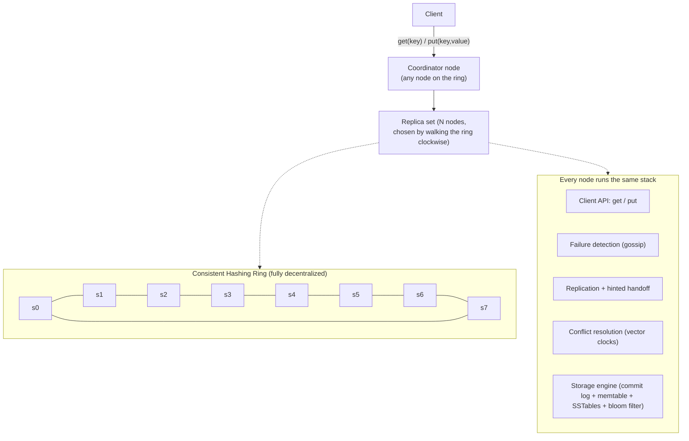
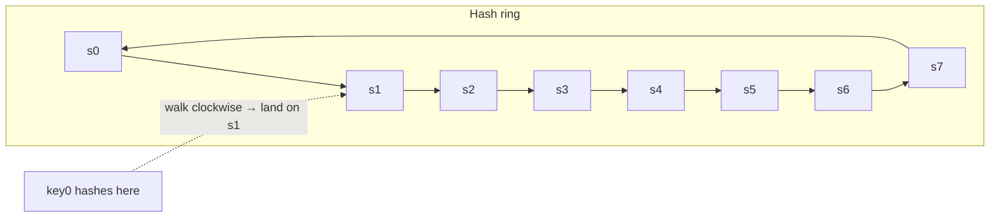
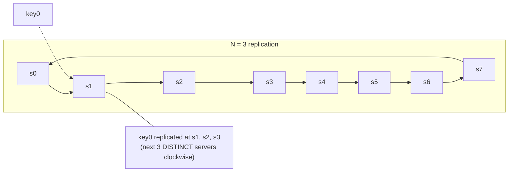
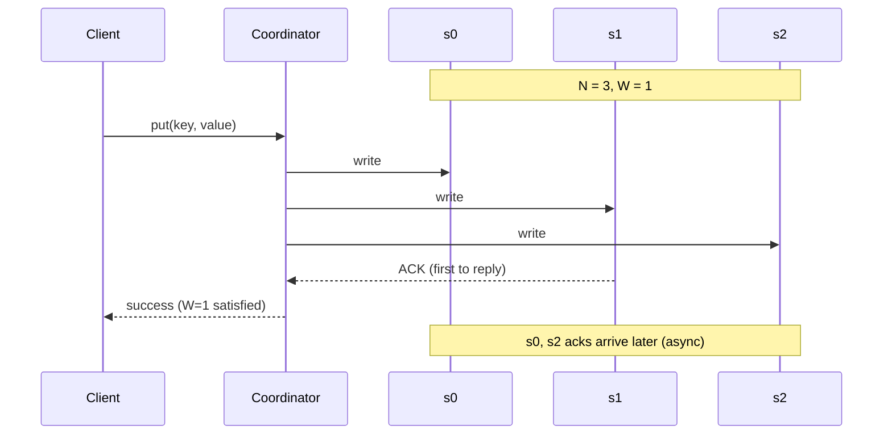
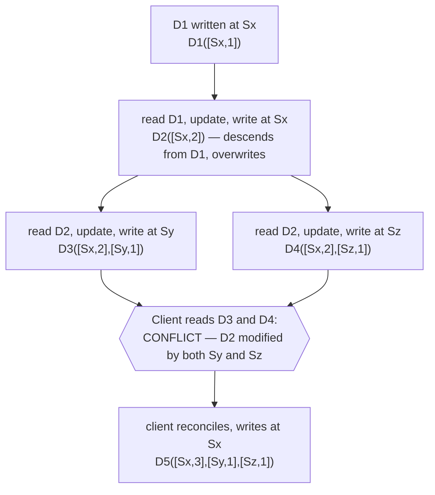
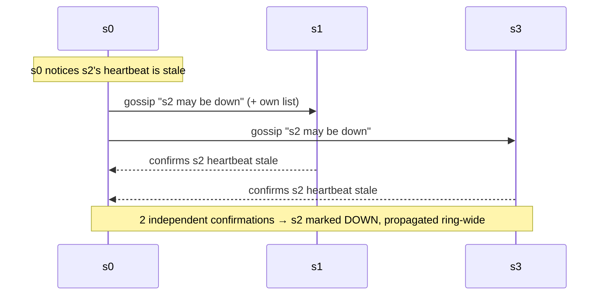
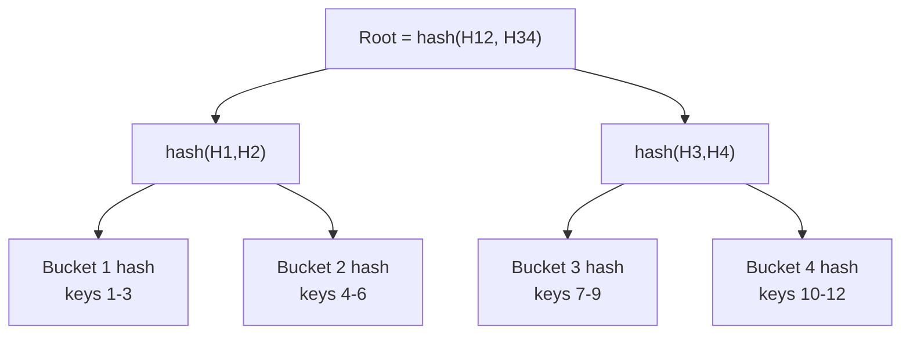
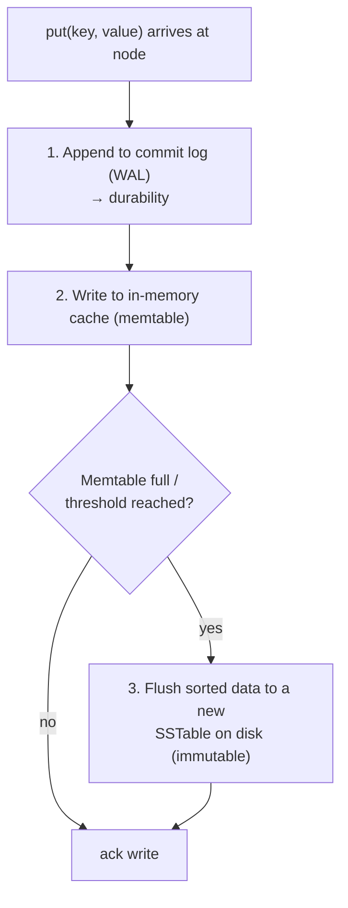
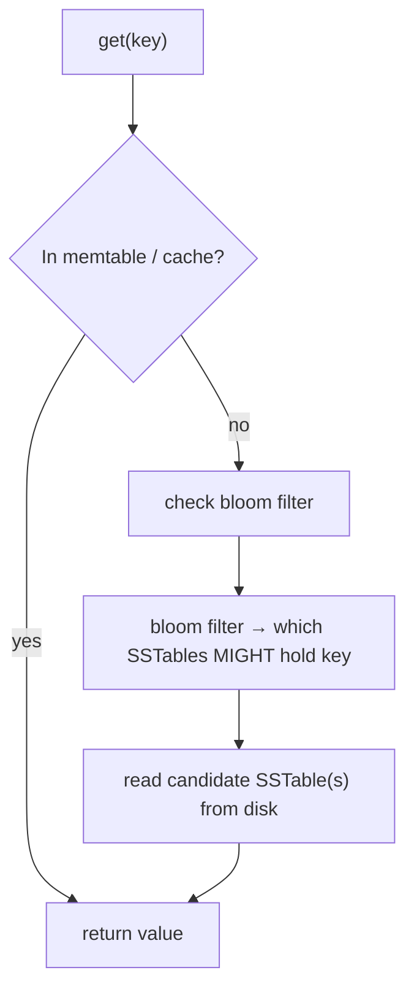
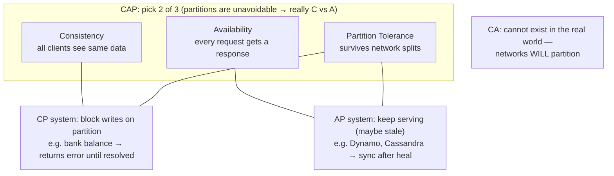

# Alex Xu — Ch 6: Design A Key-Value Store

> Building a distributed hash table à la Dynamo/Cassandra/Bigtable: partitioning, replication, tunable consistency, quorums, vector clocks, Merkle trees, gossip, and LSM/SSTable storage. | Maps to: [replication](../../system-design/02-moderate/replication.md), [database-sharding](../../system-design/02-moderate/database-sharding.md), [consistent-hashing](../../system-design/02-moderate/consistent-hashing.md), [DDIA Ch5 — Replication](../ddia/ch05-replication.md)

---

## 🎯 The Problem

A **key-value (KV) store** is a non-relational database that maps a **unique key** to an **opaque value**. The key can be plain text (`"last_logged_in_at"`) or a hash (`253DDEC4`); shorter keys perform better. The value is a byte blob — string, list, JSON, serialized object — that the store does not interpret. Real-world examples: Amazon Dynamo/DynamoDB, Memcached, Redis, Cassandra, Bigtable.

**Interview prompt:** *"Design a distributed key-value store that supports `put(key, value)` and `get(key)`, stores big data, is highly available and scalable, scales automatically, offers tunable consistency, and has low latency."*

The interesting part is not the API (it's two calls). It's the **distributed systems machinery** underneath: how do you spread data across hundreds of machines, keep replicas in sync, survive node and data-center failures, and let the operator dial the consistency/latency/availability trade-off? There is **no single perfect design** — every design balances read cost, write cost, memory usage, and the consistency-vs-availability trade-off.

---

## 📋 Requirements

### Functional Requirements

| # | Requirement | Notes |
|---|-------------|-------|
| F1 | `put(key, value)` | Insert/update the value associated with a key |
| F2 | `get(key)` | Return the value associated with a key |
| F3 | Keys are unique | Plain text or hashed; short keys preferred |
| F4 | Values are opaque | Strings, lists, objects — store treats as blobs |

### Non-Functional Requirements

| # | Requirement | Target / Meaning |
|---|-------------|------------------|
| N1 | Small pairs | Each key-value pair < **10 KB** |
| N2 | Big data | Store far more than fits on one machine |
| N3 | High availability | Responds quickly **even during failures** |
| N4 | High scalability | Scale out to support very large datasets |
| N5 | Automatic scaling | Add/remove servers automatically based on traffic |
| N6 | Tunable consistency | Operator can dial strong ↔ eventual |
| N7 | Low latency | Fast reads and writes |

### Clarifying Questions to Ask

- What is the **max value size**? (Here: < 10 KB — no large-object/blob path needed.)
- **Read-heavy, write-heavy, or balanced?** Drives N/W/R tuning and storage engine choice.
- **Consistency needs** — strong (like a bank balance) or eventual (like a shopping cart)?
- **Single region or multi-region / multi-DC?** Affects replica placement and failure model.
- **Durability** — is losing the last few milliseconds of writes acceptable, or must every ack be durable?
- Expected **QPS and total dataset size**? Drives node count and estimation.
- Do we need **range scans** or only point lookups? (Point lookups here; but sorted SSTables enable ranges cheaply.)

---

## 🧮 Back-of-the-Envelope Estimation

The chapter is light on numbers, so the following is a **reasoned illustrative estimate** (clearly marked as such) to make capacity planning concrete.

**Assumptions**

- 100 M daily active users, each doing ~10 KV operations/day → 1 B ops/day.
- Read:Write ratio = 9:1.
- Avg pair size = 1 KB (well under the 10 KB cap).
- Total distinct keys = 5 B.

**QPS**

```
ops/day       = 1,000,000,000
avg QPS        = 1e9 / 86,400 ≈ 11,600 ops/s
peak QPS (~3x) ≈ 35,000 ops/s
  reads  ≈ 0.9 * 35,000 ≈ 31,500 QPS
  writes ≈ 0.1 * 35,000 ≈  3,500 QPS
```

**Storage (primary copy)**

```
5e9 keys * 1 KB = 5 TB of primary data
```

**Storage with replication (N = 3)**

```
5 TB * 3 = 15 TB raw
+ compaction / SSTable overhead (~1.5x) ≈ ~22 TB provisioned
```

**Node count** — if a commodity node holds ~2 TB of hot+cold KV data comfortably:

```
22 TB / 2 TB ≈ 11 nodes minimum; round up to ~15–20 for headroom + rebalancing
```

**Memory (memtable + cache)** — if we keep ~1% of data hot in RAM:

```
5 TB * 1% = 50 GB hot set → spread across nodes, a few GB of cache per node
```

**Bandwidth (writes cross-replica)** — each write fans out to N replicas:

```
3,500 writes/s * 1 KB * 3 replicas ≈ 10.5 MB/s replication traffic (trivial on modern networks)
```

**Takeaway:** even at 100 M users the raw footprint is modest (tens of TB, tens of nodes). The engineering challenge is **availability and consistency during failures**, not raw throughput.

---

## 🏗️ High-Level Design

### From single server to distributed

A **single-server** KV store is just an in-memory hash table. Optimizations to fit more data:

1. **Data compression.**
2. **Tiered storage** — keep hot data in memory, cold data on disk.

But a single machine hits a capacity wall fast. To store big data with high availability we need a **distributed key-value store** — essentially a **distributed hash table (DHT)** that spreads pairs across many servers.

### Architecture (decentralized, ring-based)

Every node is identical (no leader, no single point of failure). Clients talk to any node; that node becomes the **coordinator** proxying to the replicas. Nodes are placed on a **consistent-hashing ring**.



**Key architectural properties**

- Clients use only `get(key)` / `put(key, value)`.
- A **coordinator** proxies between client and the replica nodes.
- Nodes sit on a **consistent-hashing ring**; add/remove is automatic.
- **Fully decentralized** — every node has the same responsibilities, so there is **no single point of failure**.
- Data is **replicated to N nodes**.

### API design

| Operation | Signature | Semantics |
|-----------|-----------|-----------|
| Write | `put(key, value)` | Persist `value` under `key`; coordinator waits for **W** acks |
| Read | `get(key)` | Return `value` for `key`; coordinator waits for **R** responses, reconciles versions |

### Data model

The store keeps `<key, value>` pairs. Internally each value carries a **vector clock** for conflict detection, and on disk pairs are held in **sorted-string tables (SSTables)** — sorted lists of `<key, value>` — plus a **commit log** for durability and a **bloom filter** per SSTable for fast negative lookups.

---

## 🔬 Deep Dive

The design borrows from three canonical systems: **Dynamo**, **Cassandra**, and **Bigtable**. Core components: data partition, data replication, consistency & quorum, versioning (vector clocks), failure handling (gossip, sloppy quorum, hinted handoff, Merkle-tree anti-entropy), and the write/read storage paths.

### 6.1 Data partition — consistent hashing

Two challenges when splitting data across servers: (1) **distribute evenly**, (2) **minimize data movement** when nodes join/leave. **Consistent hashing** (Ch 5) solves both.

- Servers are placed on a hash ring (`s0..s7`).
- A key is hashed onto the same ring and stored on the **first server clockwise** from its position.



Advantages:

- **Automatic scaling** — nodes added/removed with the load; only keys between the new node and its predecessor move.
- **Heterogeneity** — a powerful server gets **more virtual nodes**, so it owns a proportionally larger slice of the ring.

### 6.2 Data replication

For availability & durability, replicate each pair **asynchronously to N servers** (N is configurable). Replica selection: after the key maps to a ring position, **walk clockwise and pick the first N distinct servers**.



**Gotcha with virtual nodes:** the first N ring positions may belong to **fewer than N physical servers**. Fix: skip duplicates and only count **unique physical servers** during the clockwise walk.

**Correlated failure:** nodes in the same data center fail together (power, network, disaster). For real reliability, place replicas in **distinct data centers** connected by high-speed links.

### 6.3 Consistency — quorum consensus

Because data lives on multiple replicas, reads/writes must be coordinated. Define:

| Symbol | Meaning |
|--------|---------|
| **N** | Number of replicas |
| **W** | Write quorum — a write succeeds after **W** replicas ack |
| **R** | Read quorum — a read succeeds after **R** replicas respond |

`W = 1` does **not** mean data lives on one server. It means the **coordinator waits for 1 ack** before declaring success — data is still replicated to all N asynchronously.



**Trade-off:** `W` or `R` = 1 → fast (wait for any one replica). `W` or `R` > 1 → stronger consistency but latency bound by the **slowest** required replica.

**The key inequality — `W + R > N` guarantees strong consistency**, because the read and write quorums must **overlap in at least one node** that holds the latest value.

| Configuration | Optimized for | Consistency |
|---------------|---------------|-------------|
| `R = 1, W = N` | **Fast reads** | Strong (write hit all) |
| `W = 1, R = N` | **Fast writes** | Strong (read hit all) |
| `W + R > N` (e.g. N=3, W=R=2) | **Balanced** | **Strong guaranteed** |
| `W + R ≤ N` | Low latency both | Strong **not** guaranteed |

#### Consistency models

- **Strong consistency** — every read returns the most recent write; clients never see stale data. Usually enforced by blocking new reads/writes until all replicas agree → bad for availability.
- **Weak consistency** — subsequent reads may miss the latest value.
- **Eventual consistency** — a form of weak consistency; given enough time, all replicas converge. **Dynamo and Cassandra use this**, and it is the recommended model here. It lets inconsistent values enter during concurrent writes and pushes reconciliation to the client on read.

### 6.4 Inconsistency resolution — versioning with vector clocks

Replication buys availability but creates conflicts. **Versioning** treats each modification as a new immutable version. A **vector clock** is a set of `[server, version]` pairs attached to a data item, written `D([S1, v1], [S2, v2], …])`.

**Update rule** — when data `D` is written at server `Si`:
- If `[Si, vi]` exists → **increment** `vi`.
- Else → create `[Si, 1]`.



**Ancestor vs sibling (conflict) test:**

- Version **X is an ancestor of Y (no conflict)** if **every** counter in X ≤ its counterpart in Y. Example: `D([s0,1],[s1,1])` is an ancestor of `D([s0,1],[s1,2])`.
- Version **X is a sibling of Y (conflict)** if **any** counter in Y is less than its counterpart in X. Example: `D([s0,1],[s1,2])` vs `D([s0,2],[s1,1])` → conflict; the client must merge.

**Two downsides of vector clocks:**

1. **Client complexity** — clients must implement conflict-resolution/merge logic.
2. **Unbounded growth** — the `[server:version]` list can grow large. Fix: cap the length and **evict the oldest pairs**; this can make descendant detection inaccurate, but Amazon reported never hitting this in Dynamo production, so it's acceptable for most.

### 6.5 Handling failures

#### Failure detection — gossip protocol

One server's word isn't enough; require **≥ 2 independent sources** to mark a node down. **All-to-all multicast** works but is O(n²) and inefficient. Use a **decentralized gossip protocol**:

- Each node keeps a **membership list**: `member ID → heartbeat counter`.
- Each node periodically **increments its own heartbeat**.
- Each node periodically **sends heartbeats to random nodes**, which re-propagate.
- On receipt, nodes update their membership lists.
- If a member's heartbeat hasn't advanced beyond a threshold → mark it **offline** and gossip that fact.



#### Handling temporary failures — sloppy quorum + hinted handoff

A **strict quorum** can block reads/writes when nodes are down. **Sloppy quorum** relaxes this: instead of requiring the *designated* replicas, pick the **first W healthy servers for writes** and **first R healthy servers for reads** on the ring, **ignoring offline nodes** — preserving availability.

**Hinted handoff:** if `s2` is down, another node (say `s3`) temporarily accepts its reads/writes and holds a "hint." When `s2` returns, `s3` **hands the data back** to restore consistency.


#### Handling permanent failures — anti-entropy with Merkle trees

If a replica is **permanently** lost, use an **anti-entropy protocol**: compare each replica's data and update to the newest version. Naively comparing everything is expensive; a **Merkle tree** (hash tree) detects differences and minimizes data transferred. In a Merkle tree, every non-leaf node holds the **hash of its children's hashes**.

**Building it (key space 1–12):**

1. **Divide** the key space into buckets (say 4) — buckets bound the tree depth.
2. **Hash each key** in a bucket with a uniform hash.
3. **Create one hash node per bucket** (hash of that bucket's key hashes).
4. **Build upward** to the root, each parent = hash of its children.



**Comparison:** compare **root hashes** — if equal, replicas are identical. If not, recurse into left then right children, drilling down only into **mismatched subtrees** until you find the differing **buckets**, and sync only those. Data synced is proportional to the **difference**, not the total size. Real config example: **1 M buckets per 1 B keys** → ~1000 keys/bucket.

#### Handling data-center outage

Power loss, network loss, disaster can take a whole DC offline. **Replicate across multiple data centers** so users still read from surviving DCs.

### 6.6 Storage engine — write path & read path

The write/read paths follow **Cassandra's** LSM-tree design.

#### Write path



1. Persist the write to a **commit log** (write-ahead log) → survives crashes.
2. Write into the **in-memory memtable**.
3. When the memtable is full, **flush** it to an **SSTable** (sorted `<key,value>` list) on disk. SSTables are immutable; background **compaction** merges them.

#### Read path

If the key is in memory, return immediately. Otherwise consult a **bloom filter** to decide **which SSTable(s) might contain the key**, avoiding scanning every SSTable.



A **bloom filter** is a probabilistic set membership structure: **no false negatives** (if it says "not present," it truly isn't) but possible **false positives** (occasionally reads an SSTable that lacks the key). This keeps reads from touching every SSTable.

---

## ⚠️ Edge Cases, Bottlenecks & Scaling

| Concern | Failure / issue | Mitigation in this design |
|---------|-----------------|---------------------------|
| **Node down (temporary)** | Strict quorum would block writes | **Sloppy quorum** + **hinted handoff** |
| **Node down (permanent)** | Replica diverges forever | **Anti-entropy** with **Merkle trees** |
| **Whole DC outage** | All local replicas lost | **Cross-DC replication** |
| **Correlated failures** | Same-rack/DC nodes die together | Spread replicas across **distinct DCs** |
| **False "node down"** | One node lies/partitions | Require **≥ 2 independent** gossip confirmations |
| **Concurrent writes** | Conflicting sibling versions | **Vector clocks** detect; client reconciles |
| **Vector clock bloat** | `[server,version]` list grows unbounded | Cap length, **evict oldest** pairs |
| **Hot keys / uneven load** | One server overloaded | Consistent hashing + **virtual nodes** (more vnodes for bigger servers) |
| **Read amplification** | Many SSTables to scan | **Bloom filters** + background **compaction** |
| **Write durability** | Crash before flush | **Commit log (WAL)** replay on restart |
| **Rebalancing cost** | Adding nodes moves data | Consistent hashing minimizes movement to neighbor ranges |

**CAP framing — the central trade-off**



- **CP** (consistency + partition tolerance) sacrifices availability — block writes on `n1`/`n2` if `n3` is unreachable to avoid divergence. Suits **banks** (must show correct balance; return error rather than stale data).
- **AP** (availability + partition tolerance) sacrifices consistency — keep accepting reads/writes (possibly stale), sync when the partition heals. Suits **shopping carts, social feeds** (Dynamo, Cassandra).
- **CA** cannot exist: since partitions are inevitable, a distributed system **must** tolerate them.

**Scaling levers:** add nodes (consistent hashing rebalances automatically); tune `N/W/R` per workload (read-heavy → low R; write-heavy → low W); add virtual nodes for capacity heterogeneity; add DCs for geo-availability.

---

## 🔑 Key Takeaways & Interview Tips

- **Lead with CAP.** Ask the interviewer whether the use case is CP or AP — it steers every later decision. Say "partitions are unavoidable, so it's really consistency vs availability."
- **Map each requirement to a technique** (the chapter's summary table): big data → **consistent-hashing partitioning**; high availability of reads/writes → **replication + sloppy quorum + hinted handoff**; tunable consistency → **quorum `N/W/R`**; conflict handling → **vector clocks**; temporary failures → **hinted handoff**; permanent failures → **Merkle-tree anti-entropy**; failure detection → **gossip**; DC outage → **cross-DC replication**; fast writes → **commit log + memtable + SSTable**; fast reads → **bloom filter**.
- **Memorize `W + R > N` ⇒ strong consistency** (overlapping quorum). Cite the classic `N=3, W=2, R=2`.
- **Explain vector clocks with the ancestor vs sibling rule** — this is a frequent follow-up. Know their two downsides (client complexity, unbounded growth).
- **Know the storage engine (LSM tree):** WAL → memtable → flush to immutable SSTable → compaction; bloom filter to skip SSTables on reads.
- **Emphasize decentralization:** identical nodes, no single point of failure, coordinator is just any node acting as proxy.
- Name-drop the **three source systems**: Dynamo (AP, vector clocks, sloppy quorum), Cassandra (write/read path, gossip), Bigtable (SSTable/LSM lineage).

---

## 🛠️ Open-Source Implementations (GitHub)

| Project | GitHub | How it relates | Approx stars |
|---------|--------|----------------|--------------|
| Apache Cassandra | https://github.com/apache/cassandra | The archetypal AP wide-column KV store: gossip, tunable quorum consistency, LSM write/read paths, Merkle-tree repair | ~9k |
| ScyllaDB | https://github.com/scylladb/scylladb | C++ Cassandra-compatible rewrite (Seastar), also DynamoDB-compatible; same partitioning/replication/quorum model | ~14k |
| etcd | https://github.com/etcd-io/etcd | Distributed reliable KV store (Raft, **CP** side of CAP) — contrast to the AP design here; backs Kubernetes | ~50k |
| TiKV | https://github.com/tikv/tikv | Distributed transactional KV store (Raft + RocksDB); shows the strongly-consistent alternative | ~16k |
| RocksDB | https://github.com/facebook/rocksdb | The canonical embeddable **LSM-tree/SSTable** storage engine — exactly the write/read path in this chapter | ~30k |
| LevelDB | https://github.com/google/leveldb | Google's LSM key-value library; origin of the SSTable + memtable + bloom filter design | ~37k |
| CockroachDB Pebble | https://github.com/cockroachdb/pebble | RocksDB-inspired LSM engine in Go (range tombstones, table-level bloom filters) | ~5k |
| Redis | https://github.com/redis/redis | In-memory KV store (the "single server" starting point + replication) | ~68k |

*Star counts are approximate and drift over time.*

---

## 🔗 References & Further Reading

- Dynamo: Amazon's Highly Available Key-value Store (SOSP 2007) — https://www.allthingsdistributed.com/files/amazon-dynamo-sosp2007.pdf
- Bigtable: A Distributed Storage System for Structured Data (OSDI 2006) — https://static.googleusercontent.com/media/research.google.com/en//archive/bigtable-osdi06.pdf
- Apache Cassandra architecture docs — https://cassandra.apache.org/doc/latest/architecture/
- Amazon DynamoDB — https://aws.amazon.com/dynamodb/
- Memcached — https://memcached.org/  ·  Redis — https://redis.io/
- Merkle tree (Wikipedia) — https://en.wikipedia.org/wiki/Merkle_tree
- Bloom filter (Wikipedia) — https://en.wikipedia.org/wiki/Bloom_filter
- SSTable and Log-Structured Storage: LevelDB — https://www.igvita.com/2012/02/06/sstable-and-log-structured-storage-leveldb/
- Gilbert & Lynch, "Brewer's Conjecture and the Feasibility of Consistent, Available, Partition-Tolerant Web Services" (CAP proof)

---

## ❓ Mock Interview / Self-Check Questions

**Q1. State the CAP theorem and explain why "CA" systems don't exist in practice.**
CAP says a distributed system can guarantee at most two of Consistency, Availability, and Partition tolerance simultaneously. Since network partitions are inevitable in real distributed systems, partition tolerance is non-negotiable — so the real choice is between C and A. A CA system would assume no partitions, which is unrealistic, hence CA is a theoretical curiosity, not a deployable design.

**Q2. What does `W + R > N` guarantee and why?**
It guarantees strong consistency. Because the write quorum (W replicas) and the read quorum (R replicas) must overlap in at least one node when W + R > N, every read is guaranteed to touch at least one replica that saw the latest write. Classic setting: N=3, W=2, R=2.

**Q3. How would you tune N/W/R for a read-heavy vs write-heavy workload?**
Read-heavy → `R = 1` (fast reads), push cost to writes with larger W. Write-heavy → `W = 1` (fast writes), read from more replicas (larger R). If you still need strong consistency, keep `W + R > N`; if you can tolerate staleness, `W + R ≤ N` gives lower latency on both.

**Q4. Given `D([s0,1],[s1,2])` and `D([s0,2],[s1,1])`, is there a conflict?**
Yes. Neither is an ancestor of the other: the first has a higher `s1` counter, the second a higher `s0` counter. Because some counter in each is smaller than its counterpart in the other, they are siblings → conflict; the client must reconcile them.

**Q5. Difference between sloppy quorum + hinted handoff vs Merkle-tree anti-entropy?**
Sloppy quorum + hinted handoff handle *temporary* failures: writes go to the first W *healthy* nodes, a stand-in node holds a hint, and hands the data back when the original recovers. Merkle-tree anti-entropy handles *permanent* failures/long-term divergence: replicas compare hash trees top-down and sync only the mismatched buckets, minimizing data transfer.

**Q6. Walk through the write path and read path.**
Write: append to the commit log (WAL) for durability → write to the in-memory memtable → when the memtable fills, flush it to an immutable, sorted SSTable on disk (compaction merges SSTables later). Read: check memtable/cache first; if missed, consult the bloom filter to identify which SSTables might contain the key, read those SSTables, and return the value.

**Q7. Why a bloom filter on the read path, and what's its key limitation?**
It tells the node which SSTables *might* contain a key so reads avoid scanning every SSTable on disk. Limitation: it can produce false positives (occasionally pointing at an SSTable that lacks the key) but never false negatives, so a "not present" answer is always trustworthy.

**Q8. How does gossip failure detection avoid falsely marking a node down?**
Each node keeps a membership list of heartbeat counters, increments its own, and periodically sends heartbeats to random nodes that re-propagate them. A node is marked down only when its heartbeat hasn't advanced past a threshold and multiple (≥2) independent nodes confirm it — avoiding acting on a single, possibly-partitioned, informant.

**Q9. Why place replicas in different data centers, and what does it cost?**
Because nodes in the same DC share failure domains (power, network, disaster) and tend to fail together. Spreading replicas across DCs survives a full DC outage. The cost is higher write latency and cross-DC bandwidth, since replication traffic must traverse the WAN.

**Q10. Why is eventual consistency the recommended model here, and what burden does it place on clients?**
Strong consistency blocks operations until all replicas agree, hurting availability — the opposite of our high-availability goal. Eventual consistency (Dynamo/Cassandra style) keeps the system available and lets replicas converge over time. The burden: concurrent writes can create conflicting versions, so clients must detect (via vector clocks) and reconcile conflicts on read.
