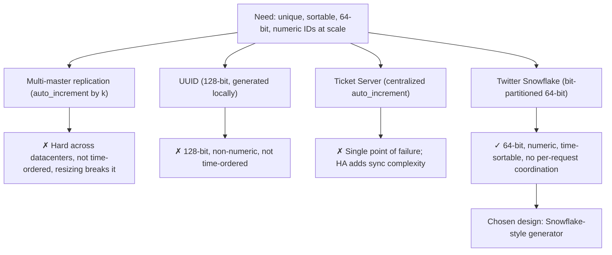
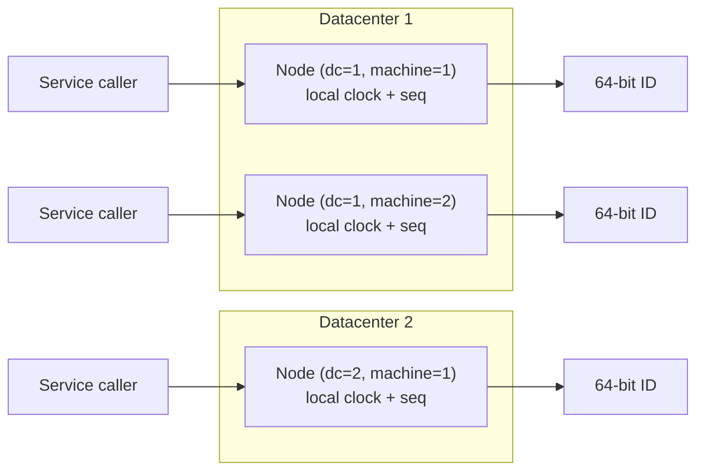
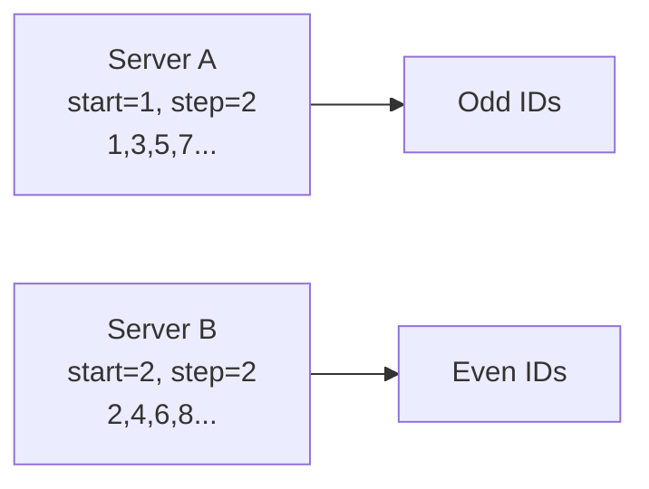
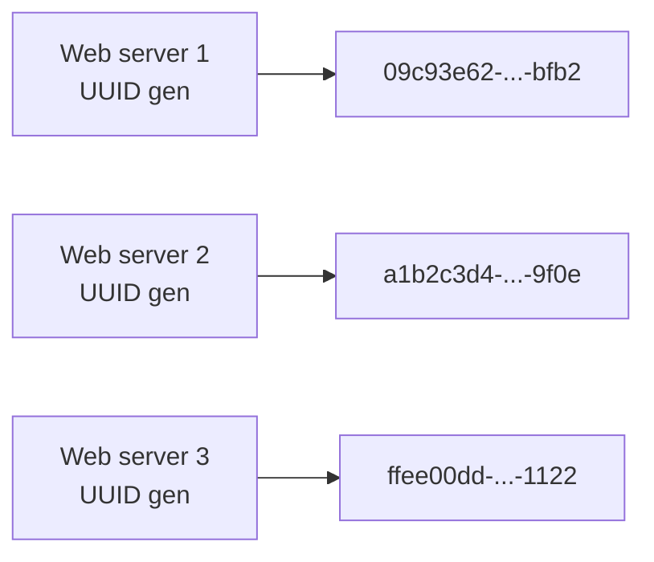
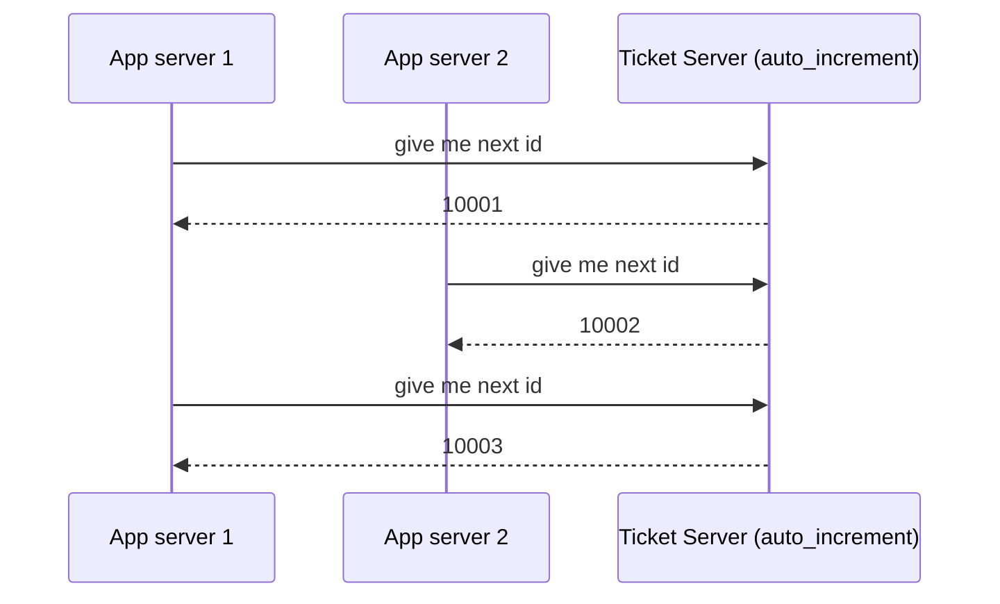
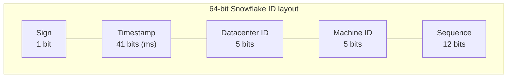
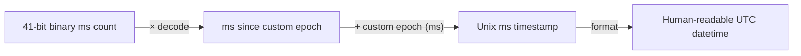
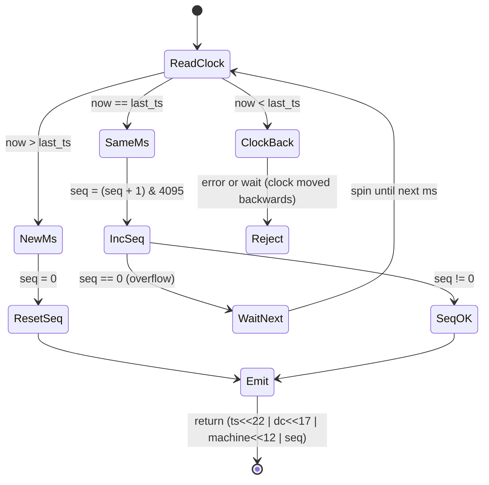
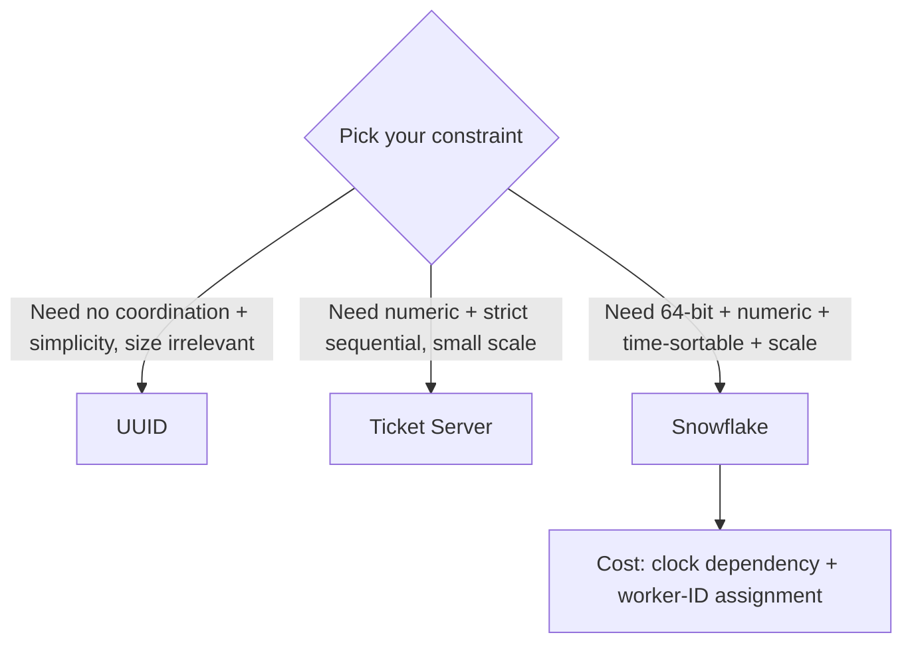

# Alex Xu — Ch 7: Design A Unique ID Generator In Distributed Systems

> Generating globally-unique, time-sortable, 64-bit numeric IDs at scale — culminating in a Twitter-Snowflake design. | Maps to: Ch 1 (Scale), Ch 5 (Consistent Hashing), Ch 6 (Key-Value Store), Ch 8 (URL Shortener uses IDs), Ch 11 (News Feed IDs).

---

## 🎯 The Problem

**Interview prompt:** *"Design a service that generates unique IDs in a distributed system."*

The naive instinct is to lean on a relational database primary key with `AUTO_INCREMENT`. That works beautifully on a single server, but it collapses in a distributed environment for two reasons:

1. **A single DB server can't hold everything** — you need to shard/scale across many machines.
2. **Coordinating a single counter across many machines with low latency is hard** — a global lock/counter becomes a bottleneck and a single point of failure.

So the real challenge is: *how do multiple, independent machines mint IDs that never collide, ideally without talking to each other on every request, while keeping the IDs small and roughly time-ordered?*

Example IDs the system might produce:
- Numeric: `1387263843000123456`
- (For contrast, a UUID: `09c93e62-50b4-468d-bf8a-c07e1040bfb2`)

---

## 📋 Requirements

### Clarifying questions to ask the interviewer

| Question | Typical answer in this problem |
|---|---|
| What characteristics must IDs have? | Unique **and** sortable. |
| Does each new ID increment by exactly 1? | No. IDs increase **with time**, but not strictly by 1. An ID made in the evening must be larger than one made that morning. |
| Are IDs numeric only? | Yes. |
| What is the ID size/length? | Must fit in **64 bits**. |
| What throughput / scale? | ≥ **10,000 IDs per second**. |
| Multi-datacenter? | Assume yes — design should tolerate multiple datacenters/machines. |

### Functional requirements

| # | Requirement |
|---|---|
| F1 | IDs must be **globally unique**. |
| F2 | IDs are **numeric values only**. |
| F3 | IDs **fit into 64 bits**. |
| F4 | IDs are **ordered by date/time** (roughly sortable, time increasing). |
| F5 | System can generate **> 10,000 unique IDs per second**. |

### Non-functional requirements

| # | Requirement | Why it matters |
|---|---|---|
| N1 | **High availability** | ID generation is mission-critical; if it stops, writes across the platform stop. |
| N2 | **Low latency** | ID minting sits on the hot path of every write. |
| N3 | **Horizontal scalability** | Add machines to add capacity, without coordination overhead. |
| N4 | **No (or minimal) inter-node coordination** | Coordination per request kills latency and availability. |
| N5 | **Compact IDs** | 64-bit fits in a `BIGINT` / `long`, indexes efficiently. |

---

## 🧮 Back-of-the-Envelope Estimation

The book states a modest target; let's make the numbers explicit and pressure-test them.

**Throughput target**
- Stated requirement: `10,000 IDs/sec`.
- Snowflake per-machine ceiling: `4096 IDs/ms` (12-bit sequence) → `4096 × 1000 = 4,096,000 IDs/sec` **per machine**.
- So a **single** Snowflake node already exceeds the 10k/s target by ~400×. Headroom is enormous.

**Capacity across the cluster**
- Machine ID space: `5 bits datacenter × 5 bits machine = 2^5 × 2^5 = 32 × 32 = 1024` distinct nodes.
- Theoretical max cluster throughput: `1024 nodes × 4.096M IDs/s ≈ 4.19 billion IDs/sec`. (Far beyond any realistic need.)

**Lifetime of the ID space (timestamp bits)**
- Timestamp field = 41 bits of milliseconds.
- Max value: `2^41 − 1 = 2,199,023,255,551 ms`.
- In years: `2,199,023,255,551 ms ÷ 1000 ÷ 3600 ÷ 24 ÷ 365 ≈ 69.7 years`.
- With a **custom epoch** near the app launch date, the clock effectively "starts at 0 today," so you get the full ~69 years from launch rather than from 1970.

**Storage**
- Each ID = 8 bytes (64-bit). At even 1M IDs/sec sustained: `1M × 8 B = 8 MB/s` of raw ID bytes — negligible; IDs are cheap. The IDs are usually stored inside rows you were already going to store.

> **Takeaway:** This design is **not** throughput-bound at the stated scale. The interesting constraints are *uniqueness under concurrency*, *time-sortability*, *clock behavior*, and *the 69-year timestamp horizon* — not QPS.

---

## 🏗️ High-Level Design

Multiple approaches can generate distributed unique IDs. The chapter evaluates four:

1. **Multi-master replication**
2. **UUID**
3. **Ticket server**
4. **Twitter Snowflake**



### Chosen architecture (Snowflake style)

Each application/ID-generation node mints IDs **locally** from its own clock + a preassigned datacenter/machine ID + a per-millisecond counter. No network call per ID.



### API design

There is no strict schema — IDs are computed, not stored in a dedicated table. If exposed as a service:

| Endpoint | Method | Returns | Notes |
|---|---|---|---|
| `/id` | `GET` | `{ "id": 1387263843000123456 }` | Single 64-bit ID from the calling node. |
| `/ids?count=n` | `GET` | `{ "ids": [ ... ] }` | Batch; server increments sequence per ID. |

Most often, Snowflake is embedded as a **library** inside each service (no network hop at all), which is what makes it fast and highly available.

### Data model

Snowflake stores no per-ID state. The only "state" is:
- `datacenter_id` and `machine_id` — assigned at **startup**, then fixed.
- `last_timestamp` and `sequence` — kept in memory, per node.

---

## 🔬 Deep Dive

### The four options in detail

#### 1) Multi-master replication

Use each database's `AUTO_INCREMENT`, but instead of stepping by 1, step by **k**, where **k** = number of DB servers. Server *i* is offset so servers never collide (e.g., with k=2: server A → 1, 3, 5, 7…; server B → 2, 4, 6, 8…).



**Drawbacks:**
- Hard to scale across **multiple datacenters**.
- IDs **do not increase with time** across servers (server A's #5 may be minted long after server B's #6).
- Adding/removing a server changes **k** → you must re-plan every offset. Doesn't scale elastically.

#### 2) UUID

A **128-bit** value with an astronomically low collision probability. Wikipedia's oft-quoted figure: generating **1 billion UUIDs/sec for ~100 years** yields only a ~50% chance of a *single* collision. Each web server can generate UUIDs entirely **independently**.



| Pros | Cons |
|---|---|
| Dead simple; no server coordination → no sync issues. | 128-bit — **violates the 64-bit requirement**. |
| Scales trivially with web servers. | **Not time-ordered** (v4 is random). |
| | Can be **non-numeric** (contains hex + hyphens). |

#### 3) Ticket Server

A **centralized** `AUTO_INCREMENT` on one dedicated DB (the "ticket server"). Pioneered by **Flickr** for distributed primary keys. Clients ask the ticket server for the next number.



| Pros | Cons |
|---|---|
| IDs are **numeric**. | **Single point of failure** — if it dies, every dependent system stalls. |
| Easy to implement; fine for small/medium scale. | HA requires **multiple ticket servers**, which reintroduces **data-synchronization** problems. |

> Flickr's trick to avoid a true SPOF: run **two** ticket servers, one issuing **odd** numbers, the other **even** — but this is essentially multi-master again with its own tradeoffs.

#### 4) Twitter Snowflake — the chosen design

**Divide and conquer.** Rather than generating a number wholesale, **partition the 64 bits into fields** so uniqueness comes from combining independent sources: time + machine identity + a per-ms counter.



| Field | Bits | Range | Purpose |
|---|---|---|---|
| Sign bit | 1 | always `0` | Reserved; keeps the number positive (distinguishes signed/unsigned). |
| Timestamp | 41 | ~69.7 years | Milliseconds since a **custom epoch**. Gives time-sortability. |
| Datacenter ID | 5 | `2^5 = 32` datacenters | Assigned at startup. |
| Machine ID | 5 | `2^5 = 32` machines/DC | Assigned at startup. |
| Sequence | 12 | `2^12 = 4096` / ms | Counter reset to 0 each new millisecond. |

- **Datacenter ID + Machine ID** are chosen at **startup** and then fixed. An accidental change risks ID collisions, so changes need careful review.
- **Timestamp + Sequence** are computed live while the generator runs.

**Twitter's default epoch:** `1288834974657` ms = **Nov 04, 2010, 01:42:54 UTC**. A custom epoch near your launch date maximizes usable lifetime.

##### Worked example: assembling an ID

Suppose:
- `timestamp` (ms since custom epoch) = `1_500_000_000`
- `datacenter_id` = `3`
- `machine_id` = `12`
- `sequence` = `5`

The ID is built by shifting each field into place and OR-ing:

```
id = (timestamp << 22)          // 41-bit ts occupies bits 63..22 (above 5+5+12=22 bits)
   | (datacenter_id << 17)      // 5-bit dc occupies bits 21..17
   | (machine_id    << 12)      // 5-bit machine occupies bits 16..12
   | sequence                   // 12-bit seq occupies bits 11..0
```

Numerically:
```
1_500_000_000 << 22 = 6291456000000000
3 << 17             =           393216
12 << 12            =            49152
5                   =                5
--------------------------------------
id (OR of above)    = 6291456000442373
```

##### Timestamp: how bits become a date


Because timestamp occupies the **high bits**, sorting IDs numerically ≈ sorting by creation time. That's what delivers requirement F4.

##### Sequence: concurrency within one millisecond

12 bits → 4096 combinations. The field stays `0` unless a node mints **more than one ID in the same millisecond**; then it increments. If a node exhausts all 4096 in a single ms, it **waits for the next millisecond**.



### Design decisions & alternatives — comparison

| Approach | 64-bit? | Numeric? | Time-sortable? | Coordination? | HA / SPOF | Verdict |
|---|---|---|---|---|---|---|
| Multi-master replication | ✔ | ✔ | ✖ (not across servers) | Offsets planned | OK-ish | Poor elasticity |
| UUID | ✖ (128-bit) | ✖ | ✖ (v4) | **None** | Excellent | Fails size/order/numeric |
| Ticket server | ✔ | ✔ | ✔ (single counter) | Per-request DB call | **SPOF** | Simple, doesn't scale/HA |
| **Snowflake** | ✔ | ✔ | ✔ | **None per request** | Excellent | ✅ Chosen |

### Section-length tuning

The 1/41/5/5/12 split is not sacred. Rebalance the fields to fit your workload:

| Scenario | Suggested tweak | Effect |
|---|---|---|
| Low concurrency, very long lifetime | More timestamp bits, fewer sequence bits | Extends the >69-year horizon; fewer IDs/ms per node. |
| Very high per-node concurrency | More sequence bits | >4096 IDs/ms/node; shorter time horizon. |
| Many machines / dynamic fleet | More machine bits (e.g., 10 combined) | Support >1024 nodes; fewer bits elsewhere. |

---

## ⚠️ Edge Cases, Bottlenecks & Scaling

### Clock synchronization (the #1 real-world gotcha)
The design **assumes every node's clock is accurate and monotonic**. In reality:
- Clocks drift; **NTP** corrections can jump the clock **backward**.
- Multi-core / multi-machine setups may disagree on "now."

**Consequences & mitigations:**
- If the clock moves **backward**, a node could regenerate a timestamp it already used → risk of collision or out-of-order IDs. Common mitigations: **reject/wait** until the clock catches up to `last_timestamp` (Sonyflake, many libs do this), or refuse to emit while clock is behind.
- Use **NTP** (Network Time Protocol) to keep clocks tight. NTP is the standard solution; deeper clock-sync theory is out of scope for the book.
- **Sonyflake's** approach: coarser time unit (10 ms) + more machine bits + longer lifetime, trading per-ms throughput for resilience.

### Sequence overflow
- >4096 IDs in a single millisecond on one node → sequence wraps to 0. The node must **busy-wait for the next millisecond** before emitting more. At 10k/s target this never happens; at extreme burst rates it throttles gracefully.

### Machine/Datacenter ID assignment
- IDs must be **unique per node**. Two nodes with the same `(dc, machine)` pair **will collide**. Assigning these safely at scale (especially with containers/autoscaling) is the hard operational problem:
  - Static config / config service.
  - **ZooKeeper/etcd** to lease a unique worker ID at boot (Baidu's `uid-generator` uses a DB; many Snowflake ports use ZooKeeper).
  - Derive from host identity (IP, MAC, k8s pod ordinal).
- Only 1024 node slots exist by default — a large ephemeral container fleet can exhaust them; widen the machine bits or recycle IDs.

### 69-year horizon
- After the 41-bit timestamp overflows (~69.7 years from the custom epoch), you must roll to a **new epoch** or migrate to a wider layout. Choosing a custom epoch near launch delays this maximally.

### Hot spots & bottlenecks
- **Snowflake/UUID:** no central bottleneck — scales linearly with nodes.
- **Ticket server:** the single DB is the bottleneck and SPOF; HA replication adds sync complexity.
- **Multi-master:** rebalancing offsets when the server count changes is disruptive.

### High availability
- Because Snowflake generation is **local and coordination-free**, each node is independently available. Embed it as a **library** so there's no separate service to fail. If exposed as a service, run **multiple stateless replicas** behind a load balancer; the only shared concern is unique worker-ID assignment.

### Trade-offs summary



---

## 🔑 Key Takeaways & Interview Tips

- **Lead with clarifying questions**: uniqueness, sortability, numeric-only, 64-bit, throughput. These constraints *eliminate* UUID (128-bit, non-numeric, unsorted) and expose the SPOF in ticket servers — narrating that elimination shows structured thinking.
- **Name all four options** (multi-master, UUID, ticket server, Snowflake) with crisp pros/cons, then converge on **Snowflake** because it satisfies *every* stated requirement.
- **Explain the bit layout from memory**: 1 sign + 41 timestamp + 5 datacenter + 5 machine + 12 sequence = 64. Be ready to compute `2^41-1 ms ≈ 69 years`, `2^5 = 32`, `2^12 = 4096`.
- **Emphasize "no per-request coordination"** — that's *why* Snowflake is fast and highly available.
- **Volunteer the follow-ups** the book flags: **clock synchronization (NTP)**, **section-length tuning**, and **high availability**. Mentioning clock-skew handling (clock moving backward) signals real-world maturity.
- **Discuss worker-ID assignment** (ZooKeeper/etcd/DB lease) — interviewers love probing how nodes get unique IDs without collisions.
- Note the **time-sortability property**: because timestamp is in the high bits, numeric sort ≈ chronological sort, which is valuable for DB indexes and pagination.

---

## 🛠️ Open-Source Implementations (GitHub)

| Project | GitHub | How it relates | ★ (approx) |
|---|---|---|---|
| Sonyflake | https://github.com/sony/sonyflake | Snowflake-inspired Go generator; 39-bit time (10 ms unit) + 8-bit seq + 16-bit machine → longer lifetime, more machines. Handles clock-backward by waiting. | ~4.4k |
| Baidu uid-generator | https://github.com/baidu/uid-generator | Java, Snowflake-based; supports overriding worker-ID bits and DB-backed worker assignment; tuned for virtualization/Docker. | ~5.5k |
| bwmarrin/snowflake | https://github.com/bwmarrin/snowflake | Small, popular Go port of Twitter Snowflake with the classic 41/10/12 layout. | ~3.3k |
| segmentio/ksuid | https://github.com/segmentio/ksuid | K-sortable, time-prefixed unique IDs (alternative to UUID) — same "time-sortable ID" goal, larger 20-byte format. | ~5.3k |
| oklog/ulid | https://github.com/oklog/ulid | ULID: 128-bit, lexicographically sortable, time-prefixed — the "sortable UUID" alternative discussed as a contrast. | ~5.0k |
| rs/xid | https://github.com/rs/xid | Compact 12-byte, MongoDB-ObjectId-style globally unique, sortable IDs — coordination-free like Snowflake/UUID. | ~4.3k |

---

## 🔗 References & Further Reading

- Twitter Engineering — *Announcing Snowflake* (2010): https://blog.twitter.com/engineering/en_us/a/2010/announcing-snowflake
- Twitter's original Snowflake source (archived): https://github.com/twitter-archive/snowflake/tree/snowflake-2010
- Flickr Engineering — *Ticket Servers: Distributed Unique Primary Keys on the Cheap*: https://code.flickr.net/2010/02/08/ticket-servers-distributed-unique-primary-keys-on-the-cheap/
- Instagram Engineering — *Sharding & IDs at Instagram*: https://instagram-engineering.com/sharding-ids-at-instagram-1cf5a71e5a5c
- Wikipedia — *Universally Unique Identifier (UUID)*: https://en.wikipedia.org/wiki/Universally_unique_identifier
- Wikipedia — *Network Time Protocol (NTP)*: https://en.wikipedia.org/wiki/Network_Time_Protocol
- Sonyflake docs (design rationale for time/machine tradeoffs): https://github.com/sony/sonyflake

---

## ❓ Mock Interview / Self-Check Questions

**Q1. Why doesn't a single-DB `AUTO_INCREMENT` primary key work in a distributed system?**
A single server can't hold all the data (you must shard), and forcing every node through one central counter creates a latency bottleneck and a single point of failure. You need IDs generated across many machines with minimal coordination.

**Q2. Why is UUID rejected here despite being trivially unique and coordination-free?**
It's 128 bits (requirement is 64), it can contain non-numeric hex/hyphens (requirement is numeric), and standard v4 UUIDs are random so they're **not time-sortable** (requirement F4).

**Q3. Break down the 64 bits of a Snowflake ID.**
1 sign bit (always 0) + 41 timestamp bits (ms since a custom epoch) + 5 datacenter bits (32) + 5 machine bits (32) + 12 sequence bits (4096 per ms) = 64 bits.

**Q4. How does Snowflake guarantee uniqueness across machines without coordination?**
Uniqueness is compositional: the `(datacenter_id, machine_id)` pair is unique per node (assigned at startup), the timestamp advances over time, and the per-ms sequence counter disambiguates IDs minted in the same millisecond on the same node. No two nodes ever share the same machine bits, so their IDs can't collide.

**Q5. How long will the ID space last, and how do you extend it?**
41 timestamp bits → `2^41-1 ms ≈ 69.7 years` from the custom epoch. Choosing a custom epoch near launch maximizes remaining lifetime. When it overflows, migrate to a new epoch or a wider bit layout.

**Q6. What happens if a node needs more than 4096 IDs in one millisecond?**
The 12-bit sequence overflows (wraps to 0). The generator then **waits until the next millisecond** before issuing more IDs, throttling itself to preserve uniqueness.

**Q7. What's the biggest real-world risk with Snowflake and how do you mitigate it?**
**Clock skew.** If a node's clock jumps backward (e.g., NTP correction), it could reuse a timestamp and risk collisions or out-of-order IDs. Mitigate by keeping clocks tight with NTP and by having the generator **refuse/wait** while the current time is behind `last_timestamp` (Sonyflake does this).

**Q8. How do nodes get their unique datacenter/machine IDs safely at scale?**
Static config, a coordination service like **ZooKeeper/etcd** that leases a unique worker ID at boot, a DB-backed assignment (Baidu uid-generator), or deriving from host identity (pod ordinal, IP). The default layout only allows 1024 nodes, so large ephemeral fleets may need wider machine bits or ID recycling.

**Q9. Why are Snowflake IDs "sortable by time," and why does that matter?**
The timestamp sits in the most-significant bits, so ordering IDs numerically approximates ordering them by creation time. This is valuable for time-range queries, cursor pagination, and keeping B-tree indexes append-friendly (less page fragmentation than random UUIDs).

**Q10. When would a ticket server actually be the right choice?**
For small-to-medium applications that need simple, strictly increasing numeric IDs and can tolerate a single logical counter. It's easy to implement; the cost is a SPOF (mitigated only by adding servers, which reintroduces synchronization complexity).
