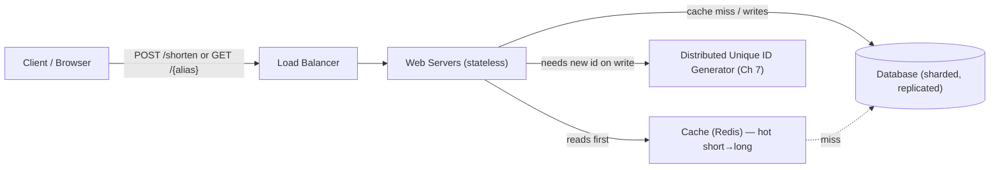
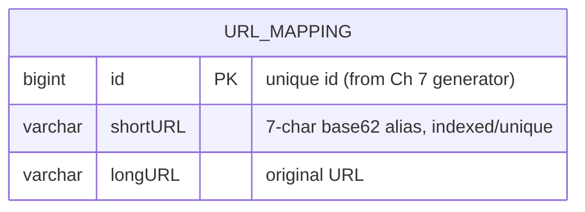
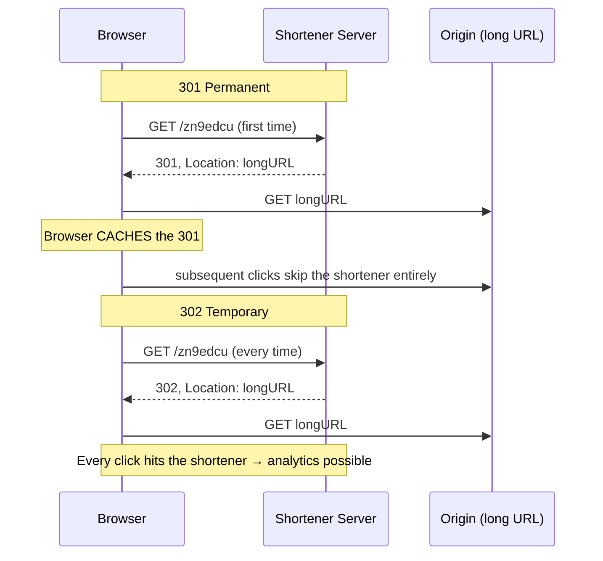
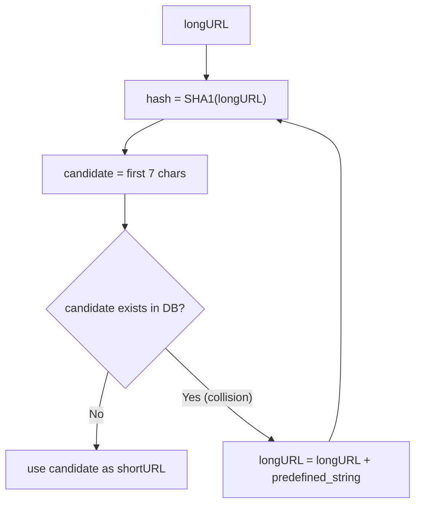
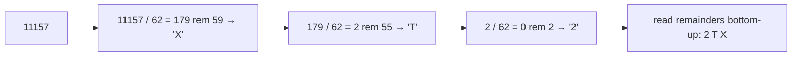
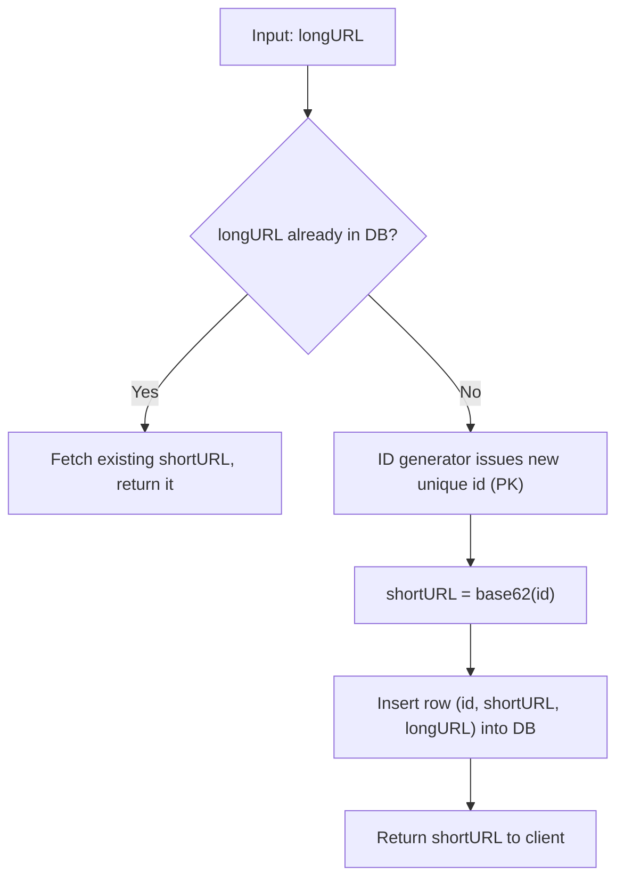
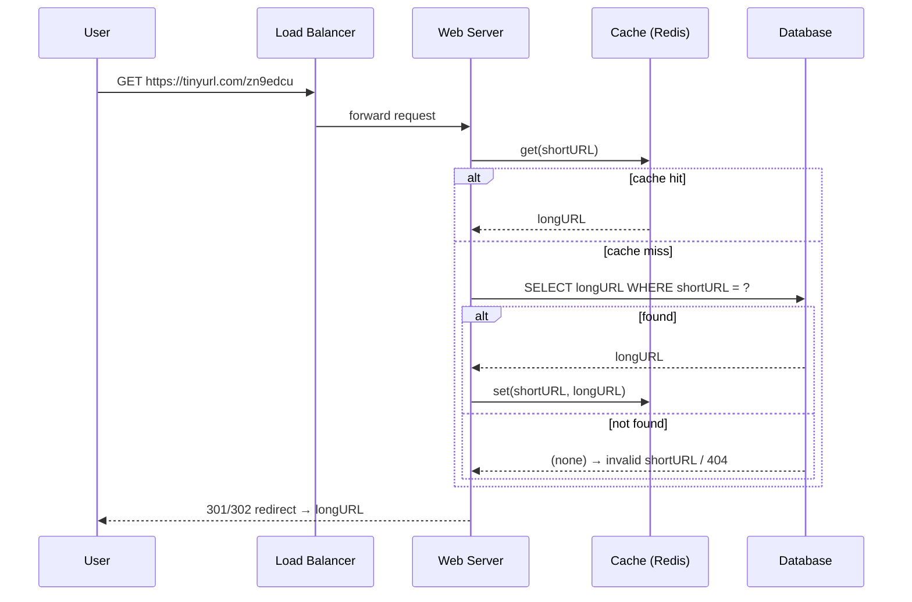
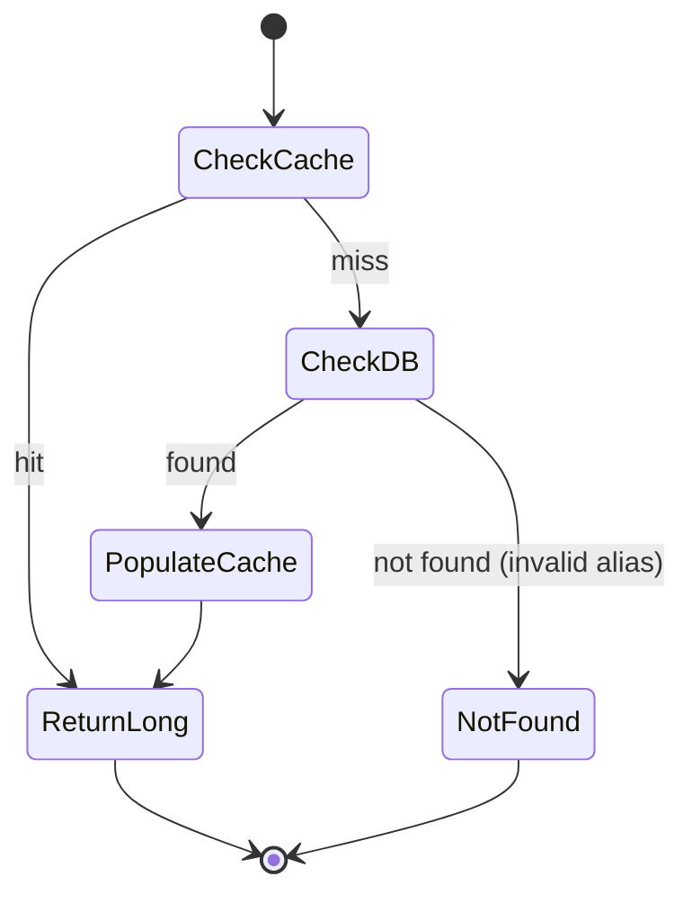

# Alex Xu — Ch 8: Design A URL Shortener

> Turn a long URL into a tiny alias that redirects back — the classic "TinyURL" interview. | Maps to: Ch 7 (Distributed Unique ID Generator — the ID source), Ch 4 (Rate Limiter — abuse protection), Ch 1 (Scale/Availability), Ch 6 (Key-Value store / caching patterns).

<!-- axu_ch08 -->

---

## 🎯 The Problem

Design a URL shortening service like **TinyURL** or **bit.ly**.

Interview framing:
> "Given a long URL such as `https://www.systeminterview.com/q=chatsystem&c=loggedin&v=v3&l=long`, produce a short alias like `https://tinyurl.com/y7keocwj`. When a user clicks the alias, redirect them to the original long URL."

Two core operations drive the whole design:

1. **Shorten** — `long URL` ➜ `short URL` (a write).
2. **Redirect** — `short URL` ➜ `long URL`, then issue an HTTP redirect (a read).

Everything else (data model, hash function, caching, scaling) exists to make those two operations fast, unique, and highly available. This is a *read-heavy* system: people click links far more often than they create them.

---

## 📋 Requirements

### Clarifying questions to ask first

- Can you show a concrete example of the input/output?
- What's the traffic volume? (Drives all estimation.)
- How short must the short URL be? *(Answer: as short as possible.)*
- What character set is allowed in the alias?
- Can short URLs be **deleted** or **updated**? *(Answer here: no, for simplicity.)*
- Do we need custom aliases (vanity URLs), expiration, or analytics? *(Out of scope for the core; talking points at the end.)*

### Functional requirements

| # | Requirement | Notes |
|---|-------------|-------|
| F1 | Shorten a long URL | `POST` returns a short URL |
| F2 | Redirect a short URL to its long URL | `GET` returns an HTTP redirect |
| F3 | Alias character set | `[0-9, a-z, A-Z]` → **62** characters |
| F4 | Alias as short as possible | length target = 7 characters |
| F5 | No delete / no update | simplifies data model & consistency |

### Non-functional requirements

| # | Requirement | Why it matters |
|---|-------------|----------------|
| N1 | **High availability** | A dead shortener breaks every link ever created |
| N2 | **Scalability** | Must handle high read QPS and 10 years of growth |
| N3 | **Fault tolerance** | No single point of failure |
| N4 | **Low latency redirects** | Redirect sits in the critical path of every click |
| N5 | **Uniqueness of aliases** | Two long URLs must not collide onto one alias |

---

## 🧮 Back-of-the-Envelope Estimation

Given: **100 million** new URLs generated per day, read:write ratio **10:1**, service life **10 years**, average URL length **100 bytes**.

**Write QPS**
```
100,000,000 writes/day ÷ 86,400 s/day ≈ 1,160 writes/sec
```

**Read QPS** (10:1 read:write)
```
1,160 × 10 ≈ 11,600 reads/sec
```

**Total records over 10 years**
```
100,000,000/day × 365 days × 10 years = 365,000,000,000 ≈ 365 billion records
```

**Storage over 10 years**
```
365 billion × 100 bytes ≈ 36.5 TB  (book rounds to ~365 TB using 100 bytes/URL × extra fields)
```
> The book states ~365 TB. Using 100 bytes/record you get ~36.5 TB; the higher figure assumes larger average records (long URL + short URL + id + overhead). Either way: **tens to hundreds of TB** — too big for memory, needs a database + sharding.

**Alias length math (the key result)**

The alphabet has `10 + 26 + 26 = 62` symbols. Find the smallest `n` with `62^n ≥ 365 billion`:

| n | 62^n | Enough for 365B? |
|---|------|------------------|
| 5 | ~916 million | ❌ |
| 6 | ~56.8 billion | ❌ |
| **7** | **~3.5 trillion** | ✅ (huge headroom) |
| 8 | ~218 trillion | ✅ (overkill) |

**Conclusion: 7 characters** gives ~3.5 trillion possible aliases — comfortably more than the 365 billion we need.

---

## 🏗️ High-Level Design

### Architecture



### API design (REST)

**1. Shorten** — create a new short URL:
```
POST /api/v1/data/shorten
Request body: { "longUrl": "https://example.com/very/long/path?x=1" }
Response:     { "shortUrl": "https://tinyurl.com/zn9edcu" }
```

**2. Redirect** — resolve a short URL:
```
GET /api/v1/shortUrl        (in practice: GET https://tinyurl.com/{alias})
Response: HTTP 301/302 redirect with Location: <longUrl>
```

### Data model

Storing everything in an in-memory hash table (`<shortURL, longURL>`) is a fine *conceptual* starting point, but memory is limited and expensive at 365B records. Use a **relational table** instead:



| Column | Type | Purpose |
|--------|------|---------|
| `id` | BIGINT (PK) | Globally unique numeric id; base62-encoded into the alias |
| `shortURL` | VARCHAR, unique index | The 7-char alias users see |
| `longURL` | VARCHAR | Where to redirect |

---

## 🔬 Deep Dive

### 301 vs 302 redirect — the classic trade-off



| | **301 (Permanent)** | **302 (Temporary)** |
|---|---|---|
| Browser caches redirect? | Yes | No |
| Later clicks hit shortener? | No (goes straight to origin) | Yes (always) |
| Server load | Lower | Higher |
| Analytics (click count, source) | Hard (misses cached clicks) | Easy (sees every click) |
| Best when | Reducing load is the priority | Tracking/analytics is the priority |

**Rule of thumb:** choose **301** to minimize traffic to your servers; choose **302** if click analytics matter.

### Hash function — length requirement

The alias must be 7 characters from the 62-symbol alphabet. Two competing approaches:

#### Approach A: Hash + collision resolution

Run a well-known hash (CRC32, MD5, SHA-1) on the long URL, then **take the first 7 characters**.

| Hash function | Example output length (for a sample URL) |
|---------------|------------------------------------------|
| CRC32 | ~8 hex chars — still > 7, shortest of the three |
| MD5 | 32 hex chars |
| SHA-1 | 40 hex chars |

Even CRC32 is longer than 7, so we truncate. Truncation causes **collisions** (two long URLs → same 7 chars). Resolve by appending a predefined string and re-hashing until the alias is unique.



Problem: a DB lookup **on every attempt** is expensive. Optimization: a **Bloom filter** — a space-efficient probabilistic structure that answers "is this alias definitely NOT used / possibly used?" cheaply, cutting most DB checks.

#### Approach B: Base 62 conversion

Generate a unique numeric **id** (from the Ch 7 distributed ID generator), then convert that integer to base 62. Each digit maps to a character:

```
0→'0' … 9→'9', 10→'a' … 35→'z', 36→'A' … 61→'Z'
```

**Worked example — convert 11157 (base 10) to base 62:**
```
11157 = 2×62² + 55×62¹ + 59×62⁰
      = [2, 55, 59]
      = [ '2', 'T', 'X' ]
short URL = https://tinyurl.com/2TX
```



**Full-scale example (from the book):**
```
longURL = https://en.wikipedia.org/wiki/Systems_design
id (from generator) = 2009215674938
base62(2009215674938) = "zn9edcu"
short URL = https://tinyurl.com/zn9edcu
```

#### Comparison of the two approaches

| Aspect | Hash + collision resolution | Base 62 conversion |
|--------|-----------------------------|--------------------|
| Fixed short-URL length | Yes (7 chars) | No — length grows as ids grow |
| Needs a unique ID generator | No | Yes (Ch 7 generator) |
| Collisions | Possible → needs resolution loop | Impossible (id is unique) |
| Predictable / guessable next URL | No (looks random) | Yes (ids are sequential → next alias is enumerable) |
| DB lookup on generation | Yes (to detect collisions) | No |
| Complexity | Higher (collision loop, Bloom filter) | Lower / simpler |

The book **chooses base 62** for the main design because it is simple and collision-free.

### URL shortening flow (base 62 path)



Steps:
1. `longURL` is the input.
2. Check whether `longURL` already exists in the DB.
3. If yes → it was shortened before; return the stored `shortURL`.
4. If no → generate a new unique `id` (primary key) from the distributed generator.
5. `shortURL = base62(id)`.
6. Insert `(id, shortURL, longURL)` and return the `shortURL`.

> The distributed unique ID generator is the crux here — in a multi-server environment you cannot use a single auto-increment counter. Use a **Snowflake-style** generator (see Ch 7).

### URL redirecting flow (read path, cache-first)

Because reads dominate (10:1), the `<shortURL, longURL>` mapping is cached.



State diagram for a single lookup:



---

## ⚠️ Edge Cases, Bottlenecks & Scaling

**Duplicate long URLs.** Two policies: (a) return the *same* short URL for an already-seen long URL (dedup on `longURL` — requires an index/lookup on `longURL`), or (b) always mint a new alias (simpler writes, more rows). Book's flow does dedup.

**Collisions.**
- Base 62 path: impossible as long as ids are globally unique — push correctness into the ID generator.
- Hash path: mitigate with the append-and-rehash loop + a Bloom filter to avoid a DB round-trip per attempt.

**Invalid / non-existent alias.** Cache miss → DB miss → return `404`. Optionally use a Bloom filter to short-circuit obviously-absent aliases before touching the DB.

**Hot keys / read hotspots.** A viral link can concentrate traffic. Mitigate with the cache (Redis), CDN edge caching of 301 responses, and read replicas.

**Guessable URLs (base 62 downside).** Sequential ids produce enumerable aliases → scrapers can walk the keyspace and harvest private links. Mitigations: seed the ID generator with a large offset, XOR/permute ids before encoding, or use Hashids/Sqids-style reversible obfuscation.

**Write bottleneck & the ID generator.** ~1,160 writes/sec is modest, but the generator must be highly available and never repeat. A single auto-increment column is a SPOF and doesn't shard well; use a distributed generator (Snowflake/sonyflake) or DB ticket/segment allocation.

**Scaling the tiers:**

| Tier | Technique |
|------|-----------|
| Web tier | **Stateless** → add/remove servers freely behind the LB |
| Cache | Redis cluster; LRU eviction; cache-aside pattern |
| Database | **Replication** (read replicas for the 10× read load) + **sharding** (by `shortURL` hash or `id` range) |
| Global reach | CDN / edge to serve cached redirects near users |

**Rate limiting / abuse.** Malicious users can flood `POST /shorten`. Add a rate limiter keyed by IP or API key (Ch 4). Also validate/normalize input URLs to avoid open-redirect and malicious-payload abuse.

**Availability & consistency.** Since no updates/deletes exist, the mapping is effectively immutable → strong reads are easy and caches never go stale. Replicate the DB across AZs; the immutability makes eventual consistency between replicas harmless for reads.

**Analytics.** If required, prefer 302 (or log at the redirect service) to capture click count, timestamp, referrer, geo. Stream events to a pipeline (Kafka → warehouse) rather than doing it inline.

---

## 🔑 Key Takeaways & Interview Tips

- **Lead with clarifying questions** (traffic, alias length, char set, delete/update) — the interviewer expects it, and answers drive the numbers.
- **Do the alias-length math out loud:** 62 chars, `62^7 ≈ 3.5T ≥ 365B` → **7 characters**. This is the single most-expected calculation.
- **Know 301 vs 302 cold:** 301 = permanent + browser-cached + lower load; 302 = temporary + always hits you + easy analytics.
- **Compare the two generation strategies:** hash+collision (fixed length, needs collision handling + Bloom filter) vs base62 (needs unique id generator, collision-free, but guessable). State the trade-offs.
- **Emphasize it's read-heavy** → cache the mapping, add read replicas, consider CDN.
- **Connect to Ch 7** — the unique ID generator is the backbone of the base62 approach; don't hand-wave it.
- **Keep the web tier stateless** so scaling is trivial.
- **Wrap-up talking points** (if time remains): rate limiter, DB replication + sharding, analytics, availability/consistency.

---

## 🛠️ Open-Source Implementations (GitHub)

| Project | GitHub | How it relates | Approx stars |
|---------|--------|----------------|--------------|
| Shlink | https://github.com/shlinkio/shlink | Full self-hosted URL shortener (PHP): short-code generation, custom domains, REST API, analytics — mirrors this chapter end-to-end | ~4k |
| YOURLS | https://github.com/YOURLS/YOURLS | De-facto self-hosted shortener (PHP); sequential id + base conversion, plugin analytics — direct real-world analog | ~9k |
| Kutt | https://github.com/thedevs-network/kutt | Modern shortener (Node/TS): custom domains, stats, API — shows caching + DB layering | ~13k |
| Hashids | https://github.com/hashids | Reversible obfuscation of numeric ids into short YouTube-like strings — solves the "base62 ids are guessable" problem | ~large (org, many ports) |
| Sqids | https://github.com/sqids/sqids-spec | Successor to Hashids; base-61 encode/decode of numbers into URL-safe ids — exactly the base-conversion technique | ~1k+ |
| Base62 (Alex Xu-inspired) | https://github.com/amsem/url-shortner | Small shortener explicitly built with base-62 encoding, citing Alex Xu's book — teaching reference for this chapter | small |
| Twitter Snowflake | https://github.com/twitter-archive/snowflake | The distributed unique ID generator (Ch 7) that feeds the base62 approach here | ~7k |

---

## 🔗 References & Further Reading

- RESTful API tutorial — https://www.restapitutorial.com/index.html
- Bloom filter (Wikipedia) — https://en.wikipedia.org/wiki/Bloom_filter
- HTTP 301 (Moved Permanently), MDN — https://developer.mozilla.org/en-US/docs/Web/HTTP/Status/301
- HTTP 302 (Found), MDN — https://developer.mozilla.org/en-US/docs/Web/HTTP/Status/302
- Hashids — https://hashids.org/ · Sqids — https://sqids.org/
- Twitter Snowflake announcement — https://blog.twitter.com/engineering/en_us/a/2010/announcing-snowflake
- *System Design Interview: An Insider's Guide*, Alex Xu (2020) — Chapter 8, and Chapter 7 (Unique ID Generator), Chapter 4 (Rate Limiter).

---

## ❓ Mock Interview / Self-Check Questions

**Q1. Why is the alias 7 characters long?**
A. The alphabet is `[0-9, a-z, A-Z]` = 62 symbols. We need enough combinations for 365 billion records over 10 years. `62^6 ≈ 56.8B` (too small), `62^7 ≈ 3.5T` (enough with headroom). So 7.

**Q2. 301 vs 302 — which do you pick and why?**
A. 301 (permanent) if minimizing server load matters: browsers cache it and later clicks bypass the shortener. 302 (temporary) if analytics matter: every click returns to the shortener so you can count clicks and sources. It's a load-vs-analytics trade-off.

**Q3. What are the two ways to generate the short URL, and their trade-offs?**
A. (1) *Hash + collision resolution*: hash the long URL (CRC32/MD5/SHA-1), take the first 7 chars, re-hash with an appended string on collision, and use a Bloom filter to avoid DB checks — fixed length but needs collision handling. (2) *Base 62 conversion*: take a globally unique numeric id and convert to base 62 — collision-free and simple, but the id generator is required and aliases become guessable/enumerable.

**Q4. Why not just store everything in a hash table in memory?**
A. It's a fine conceptual model, but 365B records × ~100 bytes is tens–hundreds of TB — memory is too small and too expensive. Use a relational DB (with a cache in front) instead.

**Q5. Why is this system read-heavy, and how do you exploit that?**
A. Read:write is ~10:1 (clicks ≫ creations). Exploit with a cache (Redis) holding `short→long`, read replicas, and CDN/edge caching of redirects — the redirect path stays low-latency.

**Q6. How do you generate globally unique ids across many servers for the base62 approach?**
A. Not with a single auto-increment column (SPOF, hard to shard). Use a distributed generator like Snowflake/sonyflake (timestamp + machine id + sequence) — see Chapter 7. This guarantees uniqueness, which makes base62 collision-free.

**Q7. What's the security downside of base62 over sequential ids, and how do you fix it?**
A. Sequential ids → sequential aliases → attackers can enumerate the keyspace and discover others' links. Fix by seeding with a large offset, permuting/XOR-ing the id before encoding, or using Hashids/Sqids-style reversible obfuscation.

**Q8. How do you handle an invalid short URL?**
A. Cache miss → DB miss → return 404. Optionally a Bloom filter rejects definitely-absent aliases before the DB lookup, saving load.

**Q9. How do you scale the database at 365B rows?**
A. Replication (read replicas absorb the 10× read load) plus sharding (by hash of `shortURL` or by `id` range). Since rows are immutable (no update/delete), consistency is simple and caching is safe.

**Q10. What extra features would you mention if time remains?**
A. Rate limiting to stop abusive shortening (Ch 4), DB replication + sharding, analytics integration (click counts, timing, source), and availability/consistency/reliability considerations (Ch 1).
