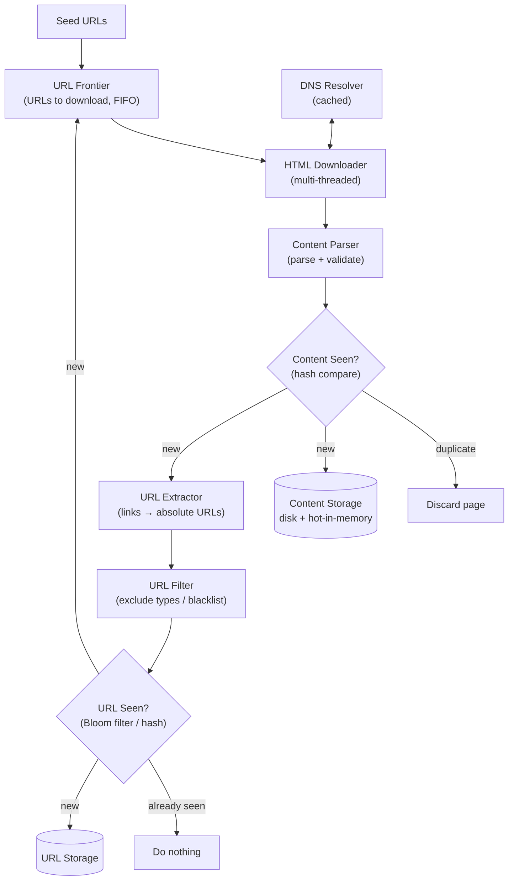
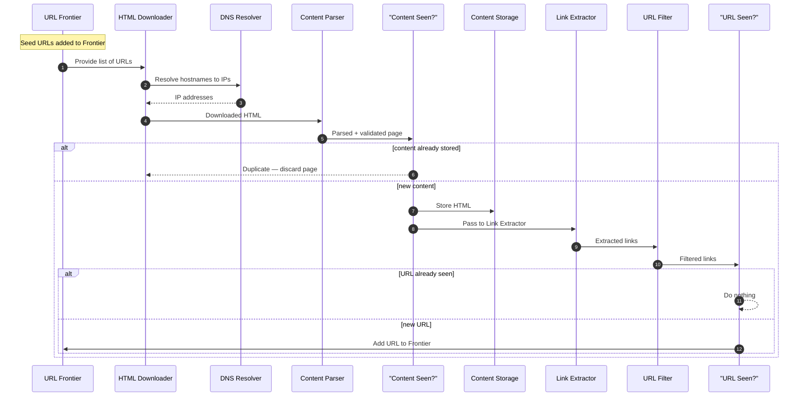
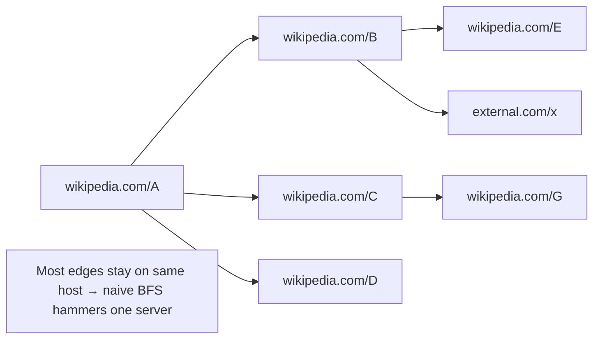
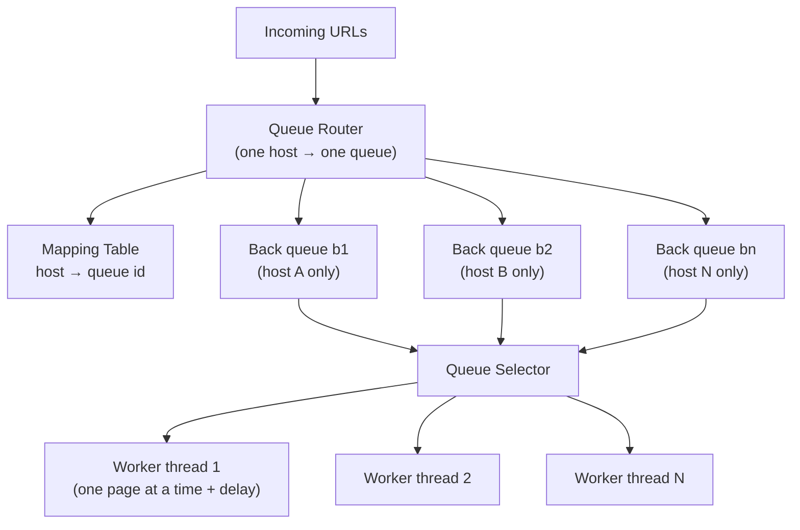
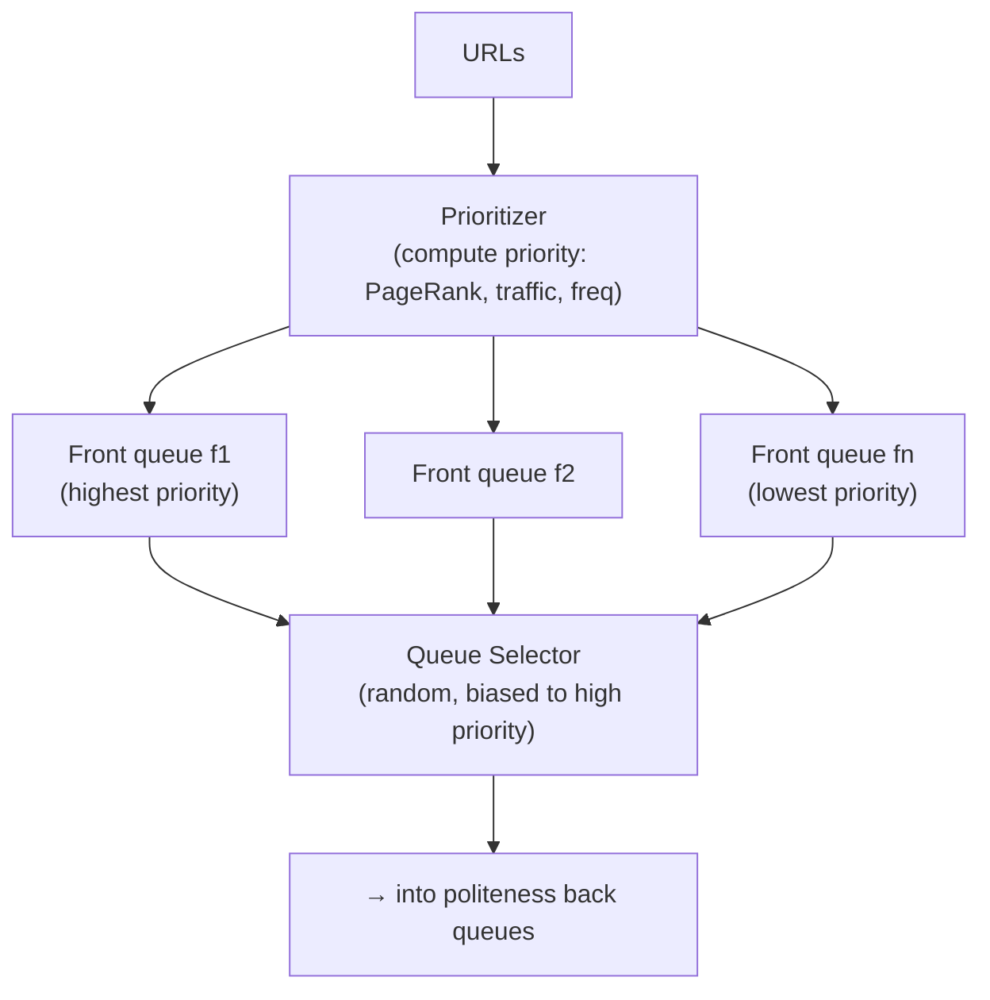
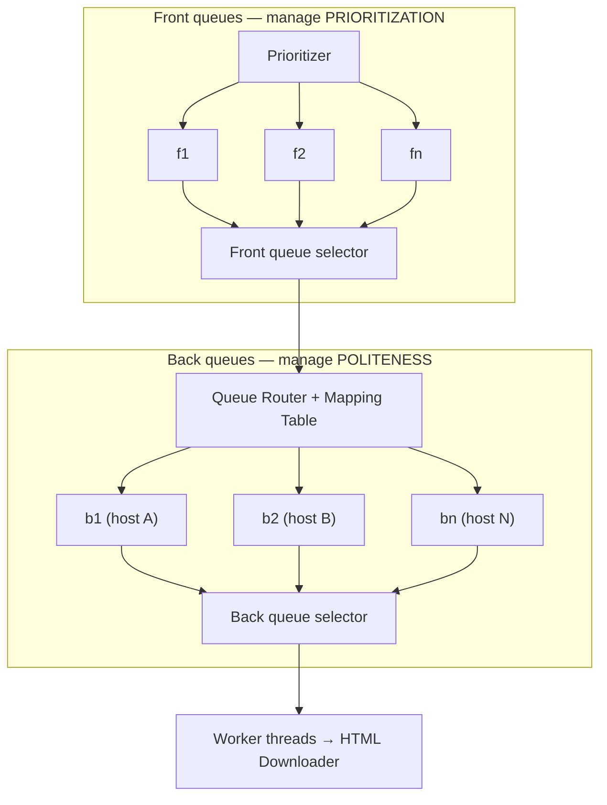
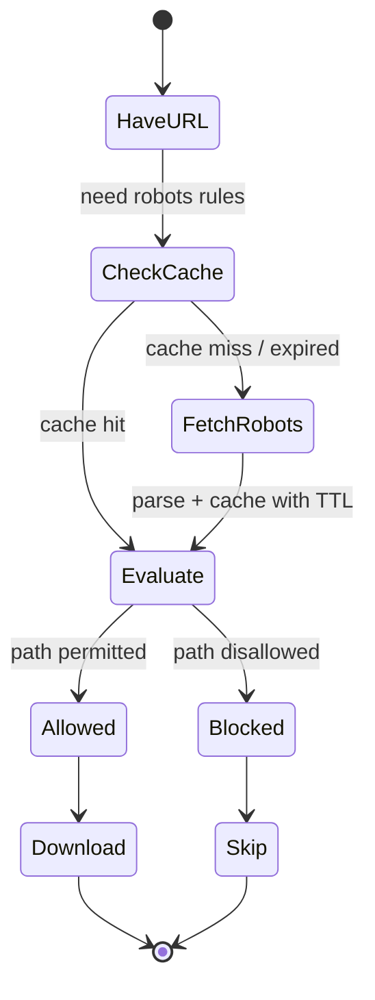
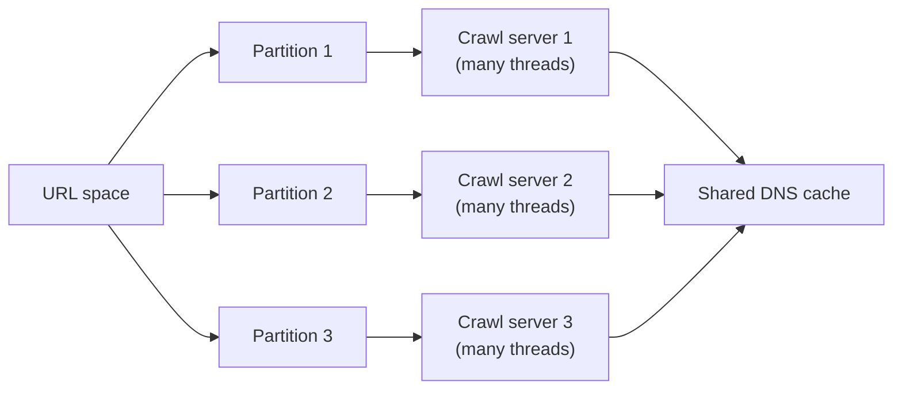
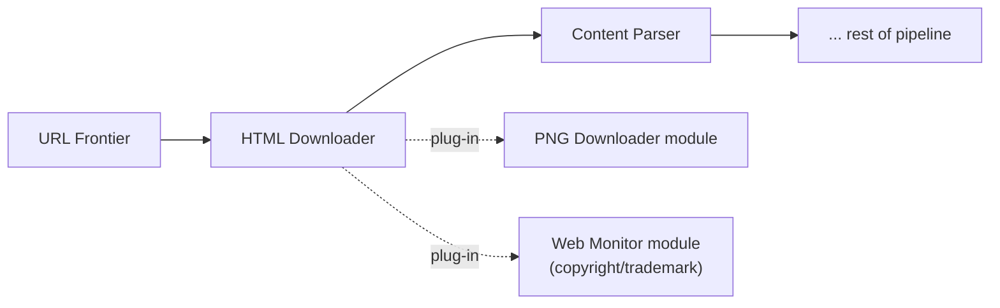

# Alex Xu — Ch 9: Design A Web Crawler

> Build a search-engine-scale crawler that discovers, downloads, dedups and stores 1B pages/month — politely, robustly, and extensibly. | Maps to: Ch 5 (Consistent Hashing), Ch 6 (Key-Value Store), Ch 1 (Availability/Consistency/Reliability), Ch 2 (Back-of-envelope / Power of 2).

---

## 🎯 The Problem

A **web crawler** (a.k.a. *robot* or *spider*) is the program search engines use to discover new and updated content across the web. It starts from a small set of **seed URLs**, downloads the pages they point to, extracts the hyperlinks on those pages, and follows them — repeating recursively to traverse the web as a graph.

The naive algorithm is deceptively simple:

1. Given a set of URLs, download every page they address.
2. Extract the URLs (links) from those pages.
3. Add the newly-found URLs to the list of URLs to download. **Repeat.**

The interview twist: *"Design a crawler that collects 1 billion pages per month for search-engine indexing."* At that scale the simple loop collapses under real-world realities — impolite request storms, duplicate content, spider traps, DNS bottlenecks, malformed HTML, unresponsive servers, and the need for prioritization and freshness. The design problem is really about **scalability, politeness, robustness, and extensibility**.

**Crawlers are used for:**
- **Search engine indexing** — the classic case (e.g., Googlebot builds Google's index). *This is our target use case.*
- **Web archiving** — preserving content (US Library of Congress, EU Web Archive).
- **Web mining** — extracting knowledge (e.g., financial firms mining annual reports / shareholder meetings).
- **Web monitoring** — detecting copyright / trademark infringement (e.g., Digimarc).

---

## 📋 Requirements

### Clarifying questions to ask the interviewer

| Question | Answer used in this design |
|---|---|
| Main purpose of the crawler? | Search engine indexing |
| How many pages per month? | 1 billion |
| Which content types? HTML only or PDF/images too? | **HTML only** |
| Consider newly added / edited pages? | Yes — support freshness/recrawl |
| Store the crawled HTML? For how long? | Yes, up to **5 years** |
| How to handle duplicate content? | Ignore duplicates |

Even for a "simple" product, you and the interviewer may hold different assumptions — always align first.

### Functional Requirements

| # | Requirement |
|---|---|
| F1 | Given seed URLs, download the addressed HTML pages |
| F2 | Extract hyperlinks from downloaded pages and enqueue new ones |
| F3 | Detect and skip **duplicate content** |
| F4 | Detect and skip **already-seen URLs** |
| F5 | Store HTML content (retention ~5 years) |
| F6 | Periodically **recrawl** to keep the index fresh |
| F7 | Respect `robots.txt` (Robots Exclusion Protocol) |

### Non-Functional Requirements (traits of a *good* crawler)

| Trait | Meaning |
|---|---|
| **Scalability** | The web has billions of pages; crawl efficiently via parallelization/distribution |
| **Robustness** | Survive bad HTML, unresponsive servers, crashes, malicious links, spider traps |
| **Politeness** | Never flood a single host with requests in a short window |
| **Extensibility** | Support new content types (images, PDFs) with minimal changes — plug-in modules |

---

## 🧮 Back-of-the-Envelope Estimation

> All numbers rest on stated assumptions — communicate them explicitly in the interview.

**Assumptions:** 1B pages downloaded/month; average page size ≈ 500 KB; retain 5 years.

**Throughput (QPS):**
```
QPS      = 1,000,000,000 pages / 30 days / 24 h / 3600 s
         ≈ 1e9 / 2,592,000
         ≈ 386  ≈ ~400 pages/second
Peak QPS = 2 × QPS ≈ 800 pages/second
```

**Storage:**
```
Monthly = 1e9 pages × 500 KB = 500,000,000,000 KB
        = 500 TB / month
5-year  = 500 TB × 12 months × 5 years
        = 30,000 TB = 30 PB
```
So we need **~30 PB** to hold five years of HTML content. (See Ch 2 "Power of 2" for units: 1 PB = 10^15 bytes.)

**Derived / reasonable extra estimates (my own, to round out the picture):**

| Quantity | Estimate | Reasoning |
|---|---|---|
| Concurrent worker threads | ~thousands | To sustain 400–800 pages/s given 10–200 ms DNS + fetch latency each |
| URL Frontier size | 100s of millions of URLs | Real search crawls report this; too big for pure RAM → hybrid disk+buffer |
| "URL Seen?" set | 10s of billions of URLs over time | Use a **Bloom filter** (bits, not full strings) to fit in memory |
| Egress bandwidth | 400 pages/s × 500 KB ≈ **200 MB/s** ≈ 1.6 Gbps average; ~3.2 Gbps peak | Drives locality/distributed-crawl decisions |
| Duplicate content | ~29–30% of pages | Justifies the "Content Seen?" component |

---

## 🏗️ High-Level Design

### Architecture



### Component responsibilities

| Component | Responsibility |
|---|---|
| **Seed URLs** | Starting points. Pick to maximize reachable links; split URL space by *locality* (country) and/or *topic* (shopping, sports, health). Open-ended — "think out loud." |
| **URL Frontier** | Stores URLs *to be downloaded*. Conceptually FIFO, but enriched for politeness, priority, freshness (see deep dive). |
| **HTML Downloader** | Fetches pages over HTTP for URLs handed out by the Frontier. |
| **DNS Resolver** | Translates hostname → IP (e.g., `www.wikipedia.org → 198.35.26.96`). Cached to avoid the DNS bottleneck. |
| **Content Parser** | Parses + validates HTML; runs as a **separate service** so slow parsing doesn't stall crawl (fetch) servers. |
| **Content Seen?** | Detects duplicate *content* via **hash/checksum comparison** (character-by-character is too slow at billions of pages). |
| **Content Storage** | Stores HTML. Bulk on **disk** (dataset too big for RAM); hot/popular content cached in **memory** for latency. |
| **URL Extractor** | Parses out links; converts relative paths → absolute URLs (e.g., prepend `https://en.wikipedia.org`). |
| **URL Filter** | Excludes unwanted content types, file extensions, error links, blacklisted sites. |
| **URL Seen?** | Tracks URLs already visited or already queued — prevents re-adding, cutting server load and infinite loops. **Bloom filter / hash table.** |
| **URL Storage** | Persists already-visited URLs. |

### Workflow (numbered steps)



### "API" / data model

A crawler isn't a request/response service, so it has no public REST API. Its "interfaces" are internal contracts and its persisted state:

**Internal interfaces (conceptual):**
```
frontier.enqueue(url, priority)      -> void
frontier.dequeue()                   -> url            # politeness/priority-aware
downloader.fetch(url)                -> (html, status) # honors robots.txt + timeout
contentSeen.check(hash)              -> bool           # true = duplicate
urlSeen.check(url)                   -> bool           # true = already known
storage.put(url, html)               -> docId
```

**Data model (conceptual schema):**

| Store | Key | Value / Fields |
|---|---|---|
| Content Storage | `content_hash` (or `doc_id`) | raw HTML, url, fetch_time, content_type, size |
| URL Storage | `url_hash` | url, host, last_crawled, next_recrawl, priority, status |
| URL Seen? | Bloom filter over `url_hash` | membership bits only |
| Content Seen? | hash set over `content_hash` | membership |
| robots cache | `host` | parsed rules, fetched_at, ttl |
| DNS cache | `host` | ip, ttl |

---

## 🔬 Deep Dive

### 1) DFS vs BFS

Model the web as a **directed graph**: pages = nodes, hyperlinks = edges. Crawling = graph traversal.

| Strategy | Behavior | Verdict for crawling |
|---|---|---|
| **DFS** | Follows one path as deep as possible before backtracking | ❌ Bad — depth can be extremely (unboundedly) deep |
| **BFS** | Explores level by level using a **FIFO queue** | ✅ Standard choice |

But **plain BFS has two problems** the URL Frontier must fix:

1. **Politeness violation** — Most links on a page point back to the *same host*. A page from `wikipedia.com` is full of `wikipedia.com` links, so naive parallel BFS floods one host → looks like a DoS attack.
2. **No prioritization** — Not all pages are equally important; plain FIFO ignores PageRank, traffic, and update frequency.



### 2) URL Frontier — the heart of the design

The Frontier stores URLs-to-download while enforcing **politeness**, **priority**, and **freshness**.

#### Politeness — back queues

Rule: **download one page at a time from a given host, with a delay between requests.** Implemented by mapping each **hostname → one dedicated FIFO queue → one worker thread**.



- **Queue router** — routes each URL so a given back queue holds URLs from only one host.
- **Mapping table** — host → queue id.
- **Back queues b1..bn** — each holds one host's URLs.
- **Queue selector** — binds each worker thread to a queue; the thread only pulls from *its* queue.
- **Worker threads 1..N** — download sequentially per host, inserting a **delay** between fetches.

#### Priority — front queues

Prioritize URLs by *usefulness* — measured by **PageRank**, site traffic, update frequency, etc. A link from the Apple home page outweighs a random forum post mentioning "Apple."



- **Prioritizer** — computes a priority per URL.
- **Front queues f1..fn** — one per priority level; higher-priority queues are picked with higher probability.
- **Queue selector** — randomly picks a queue, **biased toward higher priority**.

#### Full Frontier = Front (priority) + Back (politeness)



#### Freshness

Pages are constantly added/edited/deleted, so **recrawl periodically**. Recrawling *everything* is wasteful; optimize by:
- Recrawling based on each page's **historical update frequency**.
- Recrawling **important pages** first and more often (priority-driven).

#### Storage for the Frontier — hybrid

Frontier can hold **hundreds of millions** of URLs.
- Pure RAM → not durable, not scalable.
- Pure disk → too slow, becomes the bottleneck.
- ✅ **Hybrid:** most URLs on **disk**; maintain **in-memory buffers** for enqueue/dequeue; flush buffers to disk periodically. Best of both worlds.

### 3) HTML Downloader

#### robots.txt (Robots Exclusion Protocol)

Websites publish `robots.txt` to tell crawlers which paths are off-limits. **Check it before crawling a site**, and **cache** the parsed rules (re-download periodically) to avoid refetching per request.

Example (from `amazon.com/robots.txt`):
```
User-agent: Googlebot
Disallow: /creatorhub/*
Disallow: /rss/people/*/reviews
Disallow: /gp/pdp/rss/*/reviews
Disallow: /gp/cdp/member-reviews/
Disallow: /gp/aw/cr/
```



#### Performance optimizations

| # | Technique | Why it helps |
|---|---|---|
| 1 | **Distributed crawl** | Partition URL space across many servers × many threads → parallel throughput |
| 2 | **Cache DNS Resolver** | DNS is 10–200 ms and often *synchronous* (one request blocks other threads). Keep a host→IP cache refreshed by cron |
| 3 | **Locality** | Place crawl servers (and cache/queue/storage) geographically near target hosts → faster downloads |
| 4 | **Short timeout** | Cap the max wait; if a host doesn't respond in time, abandon and move on |



### 4) Robustness

| Approach | Benefit |
|---|---|
| **Consistent hashing** | Distribute load across downloaders; add/remove servers without full remap (see Ch 5) |
| **Save crawl state + data** | Persist state so a disrupted crawl can resume from checkpoint |
| **Exception handling** | Errors are inevitable at scale — handle gracefully, never crash the system |
| **Data validation** | Validate parsed content to prevent downstream system errors |

### 5) Extensibility — plug-in modules

The pipeline is built so new content types slot in as modules without redesign.



### 6) Detecting & avoiding problematic content

| Problem | Description | Mitigation |
|---|---|---|
| **Redundant content** | ~30% of pages are duplicates | **Hashes / checksums** to detect and skip |
| **Spider traps** | Pages that trap the crawler in an infinite loop, e.g. `.../foo/bar/foo/bar/...` | Cap max URL length; note traps produce *unusually many* pages on a site; no universal auto-detector — **manual review + custom URL filters / exclusions** |
| **Data noise** | Ads, code snippets, spam URLs — low/no value | Exclude where possible |

---

## ⚠️ Edge Cases, Bottlenecks & Scaling

**Bottlenecks & how the design attacks them**

| Bottleneck | Symptom | Mitigation |
|---|---|---|
| Same-host flooding | DoS-like load on one server | Politeness back queues: 1 host → 1 queue → 1 worker + delay |
| DNS resolution | 10–200 ms synchronous blocking | Local DNS cache, refreshed by cron |
| Disk I/O for Frontier | Slow enqueue/dequeue | Hybrid: disk storage + in-memory buffers flushed periodically |
| Content parsing | Slows fetch servers | Run Content Parser as a *separate* service |
| Duplicate content | Wasted storage + processing (~30%) | Content Seen? via hashes |
| Storage volume | 30 PB over 5 years | Bulk on disk; hot content in memory; **sharding + replication** at data layer |

**Failure handling**
- Unresponsive/slow servers → **short timeout**, move on.
- Crashes/disruptions → **checkpointed crawl state** to resume.
- Malformed/bad HTML → parser **validation**, discard.
- Malicious links / traps → URL filters, max URL length, blacklists, manual exclusion.
- Node loss → **consistent hashing** rebalances with minimal remap.

**Scaling levers**
- **Horizontal scaling** — hundreds/thousands of download servers; *keep servers stateless* so they scale freely.
- **Distributed crawl** — partition the URL space per server.
- **Locality** — geo-distribute all components.
- **Database replication & sharding** — availability, scalability, reliability of the data layer.

**Trade-offs raised**
- Memory vs disk for Frontier (durability/scale vs speed) → hybrid.
- Priority (freshness/quality) vs politeness (rate limits) → front + back queues.
- Character-by-character dup detection (exact, slow) vs hash comparison (fast, tiny false-positive risk) → hashing.
- Exact URL-seen set (hash table, large memory) vs **Bloom filter** (space-efficient, small false-positive rate).

**Explicitly out of scope (mention as "what's missing")**
- **Server-side / dynamic rendering** for JS/AJAX-generated links (render before parsing).
- **Anti-spam** component to drop low-quality/spam pages under finite resources.
- Deeper DB replication/sharding, horizontal scaling with stateless servers.
- Availability/consistency/reliability (Ch 1).
- **Analytics** for fine-tuning the crawl.

---

## 🔑 Key Takeaways & Interview Tips

- **Start by clarifying scope** (purpose, volume, content types, freshness, retention, dedup). Nail down assumptions before designing.
- **State the four traits early**: scalability, politeness, robustness, extensibility — then let them drive every component.
- **BFS, not DFS** — and explain *why* (unbounded depth), then immediately name BFS's two flaws (host flooding, no priority) to motivate the URL Frontier.
- **The URL Frontier is the centerpiece.** Explain **front queues (priority)** + **back queues (politeness)** + **hybrid storage** + **freshness/recrawl**.
- Show the **"Content Seen?"** (dedup via hashing, ~30% dupes) and **"URL Seen?"** (Bloom filter) components — they prevent redundant work and infinite loops.
- Bring up **robots.txt** and cache it.
- Name the four downloader optimizations: **distributed crawl, DNS cache, locality, short timeout.**
- For robustness cite **consistent hashing, checkpointing, exception handling, validation.**
- For extensibility, describe **plug-in modules** (PNG downloader, web monitor).
- Discuss **spider traps** honestly: no silver bullet — max URL length + manual review + custom filters.
- Close with **what's missing** (dynamic rendering, anti-spam, sharding/replication, stateless horizontal scaling, analytics) to show breadth.
- Do the math out loud: **~400 QPS (800 peak), 500 TB/month, 30 PB/5 years.**

---

## 🛠️ Open-Source Implementations (GitHub)

| Project | GitHub | Approx ⭐ | How it relates |
|---|---|---|---|
| **Scrapy** | https://github.com/scrapy/scrapy | ~59k | Python crawling/scraping framework: scheduler (frontier), dupefilter (URL Seen?), autothrottle & per-domain delay (politeness), pluggable pipelines (extensibility) |
| **Apache Nutch** | https://github.com/apache/nutch | ~3k | Classic distributed, extensible web crawler (Hadoop-backed); textbook front/back-queue + robots.txt + dedup at scale |
| **Apache StormCrawler** | https://github.com/apache/stormcrawler | ~900 | Low-latency, scalable crawler on Apache Storm — distributed crawl, URL frontier, politeness for enterprise real-time crawling |
| **Heritrix 3** | https://github.com/internetarchive/heritrix3 | ~3k | Internet Archive's web-scale *archival* crawler — strong robots.txt, politeness, and frontier design |
| **Colly** | https://github.com/gocolly/colly | ~25k | Fast concurrent Go crawler with built-in rate limiting / parallelism per domain (politeness) and URL dedup |
| **Crawlee** | https://github.com/apify/crawlee | ~20k | Node/Python crawler library with request queue (frontier), dedup, autoscaling, and JS-rendering (dynamic rendering) |

*(Star counts are approximate as of the chapter's writing/verification and change over time.)*

---

## 🔗 References & Further Reading

1. Heydon, A. & Najork, M. — *Mercator: A Scalable, Extensible Web Crawler* (WWW, 1999): https://marc.najork.org/papers/wwwmerc.pdf
2. Olston, C. & Najork, M. — *Web Crawling* (Foundations and Trends in Information Retrieval, 2010): http://infolab.stanford.edu/~olston/publications/crawling_survey.pdf
3. Page, L., Brin, S., Motwani, R., Winograd, T. — *The PageRank Citation Ranking* (Stanford, 1998): http://ilpubs.stanford.edu:8090/422/
4. Bloom, B. H. — *Space/time trade-offs in hash coding with allowable errors* (CACM, 1970): https://dl.acm.org/doi/10.1145/362686.362692
5. Lee, Leonard, Wang, Loguinov — *IRLbot: Scaling to 6 Billion Pages and Beyond* (WWW, 2008): https://irl.cse.tamu.edu/people/hsin-tsang/papers/www2008.pdf
6. Google — *Dynamic Rendering* docs: https://developers.google.com/search/docs/crawling-indexing/javascript/dynamic-rendering
7. US Library of Congress web archive: https://www.loc.gov/websites/ · EU Web Archive: http://data.europa.eu/webarchive
8. `robots.txt` / Robots Exclusion Protocol (RFC 9309): https://www.rfc-editor.org/rfc/rfc9309.html

---

## ❓ Mock Interview / Self-Check Questions

**Q1. Why is BFS preferred over DFS for web crawling, and what problems does plain BFS still have?**
DFS is poor because path depth on the web can be effectively unbounded. BFS (a FIFO queue) explores level-by-level and is standard. But plain BFS (1) hammers a single host because most links are internal to the same host — impolite/DoS-like — and (2) ignores URL priority. The URL Frontier fixes both.

**Q2. How does the URL Frontier enforce politeness?**
Map each hostname to exactly one back FIFO queue, and bind each worker thread to one queue. A worker downloads that host's pages one at a time with a delay between fetches, so no host is flooded. A queue router + mapping table maintain the host→queue invariant.

**Q3. How is prioritization implemented, and how does it coexist with politeness?**
A Prioritizer scores URLs (PageRank, traffic, update frequency) and routes them into **front queues** (one per priority). A biased-random selector favors high-priority queues. Output feeds the **back queues** that handle politeness. So the Frontier = front (priority) + back (politeness).

**Q4. How do you avoid storing duplicate content, and why not compare pages directly?**
~30% of the web is duplicate content. Comparing HTML character-by-character across billions of pages is far too slow. Instead compute a **hash/checksum** per page and check membership in the "Content Seen?" set; matching hash → discard.

**Q5. What is "URL Seen?" and which data structures implement it?**
It tracks URLs already visited or already queued, preventing re-adds that raise server load and cause infinite loops. Implemented with a **Bloom filter** (space-efficient, tiny false-positive rate) or a hash table.

**Q6. Why is DNS a bottleneck and how do you fix it?**
DNS lookups take 10–200 ms and many DNS interfaces are synchronous, so one thread's lookup can block others. Maintain a **local host→IP DNS cache** refreshed by cron to avoid frequent external calls.

**Q7. What is a spider trap and how do you handle it?**
A page (or generated structure like `.../foo/bar/foo/bar/...`) that traps the crawler in an infinite loop. There's no universal auto-detector, but you can cap **max URL length**, notice sites yielding abnormally many pages, and apply **custom URL filters / manual exclusions/blacklists**.

**Q8. How do you keep the crawled dataset fresh without recrawling everything?**
Recrawl selectively: use each page's **historical update frequency** and recrawl **important/high-priority pages** first and more often, rather than recrawling all URLs uniformly.

**Q9. Where do you store the URL Frontier and why the hybrid approach?**
The Frontier can hold hundreds of millions of URLs. Pure RAM isn't durable/scalable; pure disk is too slow and becomes a bottleneck. Use a **hybrid**: most URLs on disk, with in-memory enqueue/dequeue **buffers** flushed to disk periodically.

**Q10. What techniques make the crawler robust and horizontally scalable?**
Robustness: **consistent hashing** for load distribution and easy add/remove of nodes, **checkpointing** crawl state for resume, graceful **exception handling**, and **data validation**. Scale: **distributed crawl** partitioning the URL space, **locality**, **stateless** servers for horizontal scaling, plus DB **replication/sharding**.
