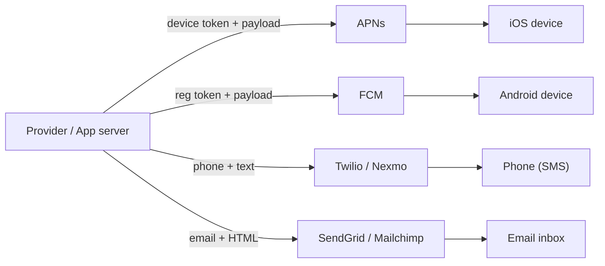
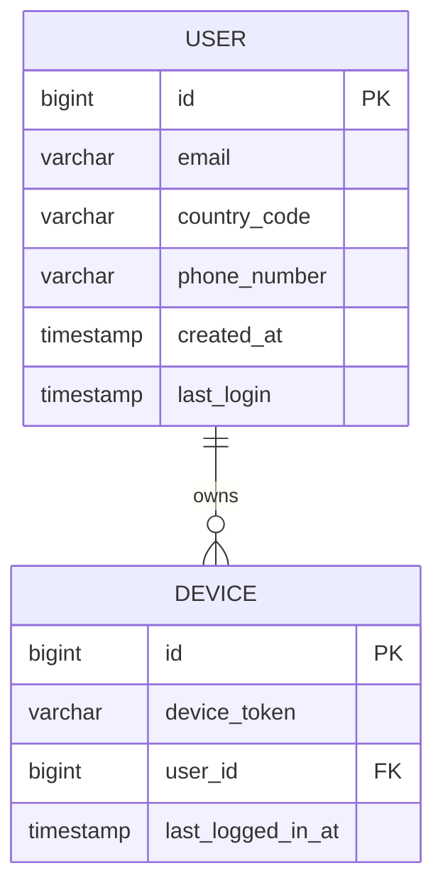
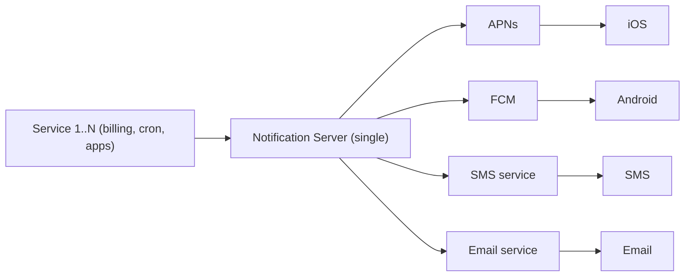
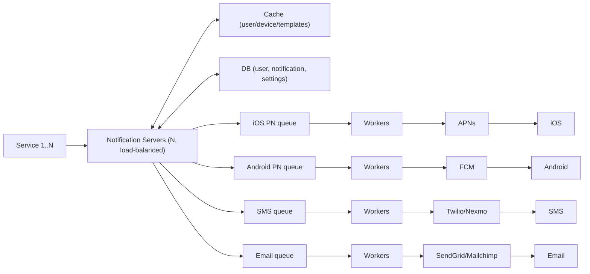
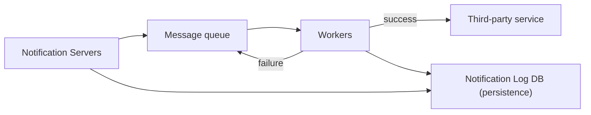
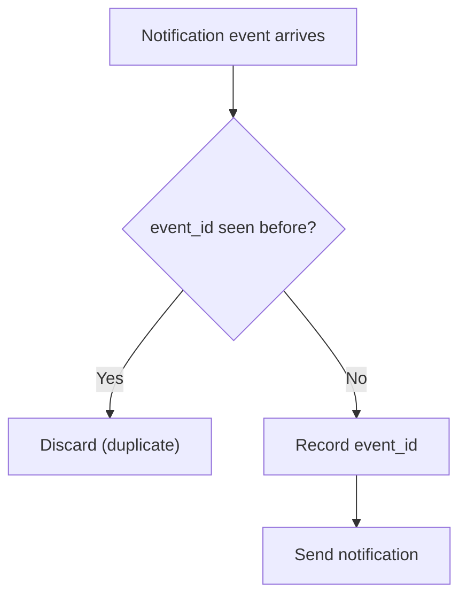
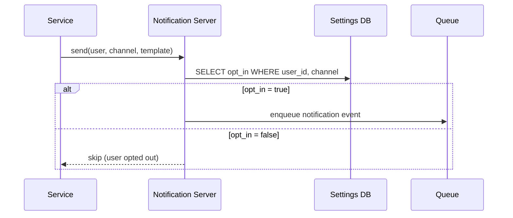
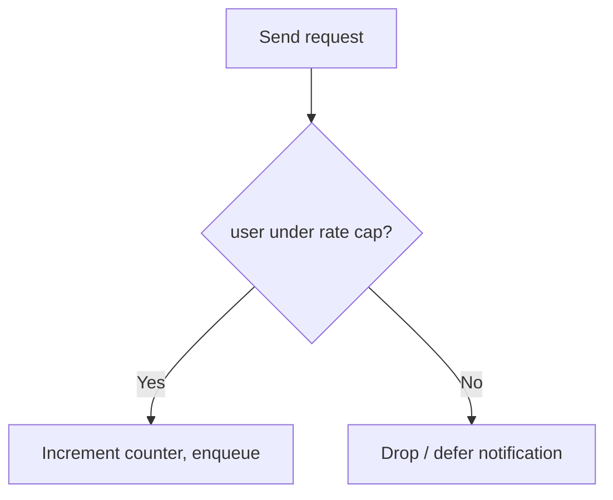
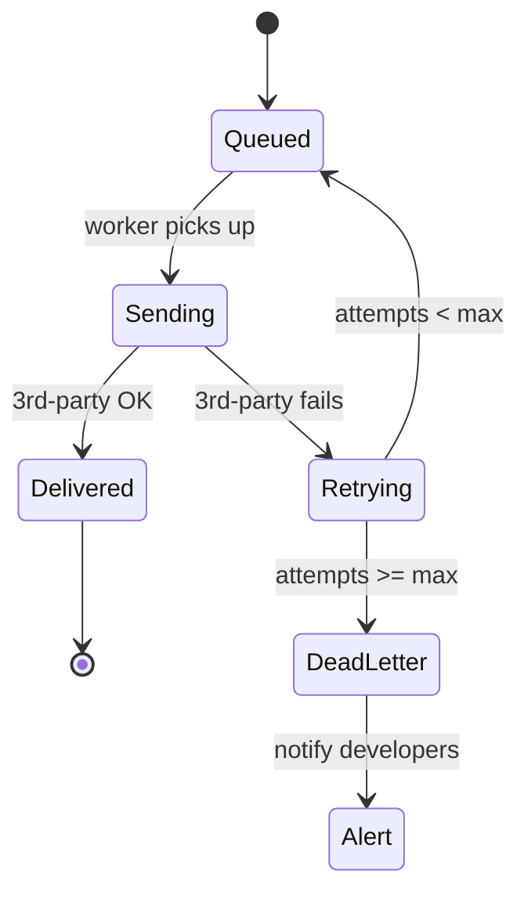
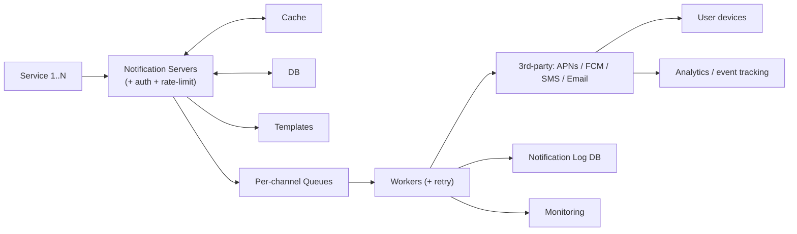

# Alex Xu — Ch 10: Design A Notification System

> A scalable, multi-channel (push / SMS / email) delivery pipeline built on message queues, retries, dedup, and rate limiting. | Maps to: [../../system-design/02-moderate/message-queues.md](../../system-design/02-moderate/message-queues.md)

---

## 🎯 The Problem

**Interview prompt:** *"Design a notification system that can send millions of notifications per day across multiple channels — mobile push notifications (iOS + Android), SMS, and email — reliably and at scale."*

A notification is any message that alerts a user with important information: breaking news, a payment confirmation, a package-delivery ETA, a product discount, a security alert. Crucially, **a notification is more than a mobile push** — the three canonical formats are:

1. **Mobile push notification** (iOS via APNs, Android via FCM)
2. **SMS message** (via a third-party aggregator like Twilio/Nexmo)
3. **Email** (via a transactional email provider like SendGrid/Mailchimp)

The design must be triggerable both by **client applications** and by **server-side scheduled jobs** (cron / billing services). It must be **extensible** (easy to plug/unplug third-party providers), **reliable** (never lose a notification), and **respectful** (honor user opt-outs and rate limits).

The interviewer deliberately keeps this open-ended — your job is to ask clarifying questions, propose a high-level design, get buy-in, then deep-dive into reliability, templates, settings, rate limiting, retries, security, monitoring, and analytics.

---

## 📋 Requirements

### Clarifying questions to ask first

| # | Question | Assumed answer (from the chapter) |
|---|----------|-----------------------------------|
| 1 | What notification types are supported? | Push, SMS, email |
| 2 | Is it real-time? | **Soft real-time** — deliver ASAP, but slight delay is OK under load |
| 3 | Which devices? | iOS, Android, laptop/desktop |
| 4 | What triggers notifications? | Client apps **and** server-side scheduled jobs |
| 5 | Can users opt out? | Yes — opted-out users receive nothing of that type |
| 6 | Daily volume? | **10M push + 1M SMS + 5M email = 16M/day** |

### Functional requirements

| Requirement | Description |
|-------------|-------------|
| Multi-channel send | Deliver push (iOS/Android), SMS, and email |
| Triggering | Support both client-initiated and server-scheduled notifications |
| Contact-info gathering | Collect & store device tokens, phone numbers, email addresses |
| Templates | Reusable, preformatted notification templates with parameters |
| User settings / opt-out | Per-channel opt-in/opt-out honored before sending |
| Analytics / tracking | Track open rate, click rate, engagement |

### Non-functional requirements

| Attribute | Target / Note |
|-----------|---------------|
| **Reliability** | Never lose data — notifications may be delayed/re-ordered but never dropped |
| **Scalability** | Horizontally scale servers, queues, workers, DB, cache independently |
| **Availability** | No single point of failure (SPOF) |
| **Extensibility** | Plug/unplug third-party providers easily (e.g. FCM alternatives in China: Jpush, PushY) |
| **Latency** | Soft real-time — buffering acceptable under peak load |
| **Security** | Only authenticated/verified clients may call send APIs (appKey/appSecret) |
| **Dedup** | Reduce duplicate deliveries (exactly-once is *not* achievable) |

---

## 🧮 Back-of-the-Envelope Estimation

The book gives volumes but no math — the estimates below are **derived reasonably** from the stated daily figures.

**Given daily volume:**
- Push: 10,000,000/day
- SMS: 1,000,000/day
- Email: 5,000,000/day
- **Total: 16,000,000 notifications/day**

**Average QPS (÷ 86,400 s/day):**

```
16,000,000 / 86,400 ≈ 185 notifications/sec (average)
```

**Peak QPS** (assume peak ≈ 5× average, since notifications cluster around business hours / campaigns):

```
185 × 5 ≈ ~925 notifications/sec (peak)
```

This is a **modest QPS** — the hard part is not raw throughput but **reliability, fan-out to N devices per user, third-party latency/failure, and dedup**, which is why message queues + workers dominate the design rather than sharding.

**Storage (notification log for persistence / retries):**
- Assume ~500 bytes per notification log row (ids, channel, payload metadata, status, timestamps).

```
16M/day × 500 B ≈ 8 GB/day ≈ 240 GB/month ≈ 2.9 TB/year
```

Retain ~90 days hot → ~720 GB hot storage; archive the rest to cold storage/object store.

**Message-queue buffering:**
- Under a campaign burst, if 5M emails queue up at once and workers drain at ~925/s, backlog clears in `5,000,000 / 925 ≈ 90 minutes`. **This is the key signal to monitor** (queued-message depth) and to autoscale workers.

**Fan-out multiplier:** one user can have multiple devices. If avg 1.5 devices/user, a single "push to user" event can produce ~1.5 device-level sends — worth noting for capacity.

---

## 🏗️ High-Level Design

### Different notification types — how each channel works

| Channel | Provider chain | Key inputs |
|---------|----------------|-----------|
| **iOS push** | Provider → **APNs** → iOS device | Device token + payload (JSON) |
| **Android push** | Provider → **FCM** → Android device | Registration token + payload |
| **SMS** | App → **Twilio / Nexmo** → phone | Phone number + text |
| **Email** | App → **SendGrid / Mailchimp** → inbox | Email address + HTML/text |

A **Provider** builds a notification request and hands it to APNs; APNs propagates it to the iOS device. Android is analogous but uses **FCM**. SMS and email use commercial third-party services that offer better deliverability and analytics than self-hosting.



### Contact-info gathering flow

When a user installs the app or signs up, API servers collect and store contact info: device tokens, phone numbers, and email addresses. A user can own **multiple devices**, so a single push can fan out to all of them.



### Initial high-level design (and why it fails)



**Three problems with the single-server design:**
1. **SPOF** — one notification server = single point of failure.
2. **Hard to scale** — DB, cache, and per-channel processing are all coupled in one box; can't scale independently.
3. **Performance bottleneck** — rendering HTML and waiting on slow third-party responses can overload one system at peak.

### Improved high-level design

Fixes: (a) move DB/cache out of the server, (b) add many notification servers + auto horizontal scaling, (c) introduce **per-channel message queues** to decouple components.



**Component responsibilities:**

| Component | Responsibility |
|-----------|----------------|
| **Service 1..N** | Different services (billing, shopping, cron jobs) that call notification-server APIs |
| **Notification servers** | Provide internal-only/verified send APIs; validate emails/phones; fetch render data from cache/DB; enqueue events |
| **Cache** | User info, device info, notification templates |
| **DB** | User, notification, settings data |
| **Message queues** | Decouple components; **buffer** bursts; **one queue per channel** so a third-party outage in one channel doesn't stall others |
| **Workers** | Pull events from queues and hand off to the matching third-party service |
| **Third-party services** | APNs, FCM, Twilio/Nexmo, SendGrid/Mailchimp — deliver to devices |

**End-to-end flow:**
1. A service calls the notification server API.
2. Server fetches metadata (user info, device token, settings) from cache/DB.
3. A notification event is enqueued to the **channel-specific** queue (e.g. iOS PN queue).
4. Workers pull events off the queue.
5. Workers send to the third-party service.
6. Third-party service delivers to the device.

### API design

```
POST https://api.example.com/v1/sms/send
POST https://api.example.com/v1/push/send
POST https://api.example.com/v1/email/send
```

Example request body (paraphrased):

```json
{
  "to": { "user_id": 12345 },
  "channel": "email",
  "template_id": "order_confirmation_v2",
  "params": { "item_name": "Air Zoom", "date": "2020-11-01" },
  "event_id": "evt_9f8c...unique",
  "app_key": "AK...",
  "app_secret": "AS..."
}
```

APIs are **only accessible internally or by verified clients** to prevent spam.

### Data model / schema

```sql
-- user contact info
CREATE TABLE user (
  id            BIGINT PRIMARY KEY,
  email         VARCHAR(255),
  country_code  VARCHAR(8),
  phone_number  VARCHAR(32),
  created_at    TIMESTAMP,
  last_login    TIMESTAMP
);

-- device tokens (one user -> many devices)
CREATE TABLE device (
  id                 BIGINT PRIMARY KEY,
  user_id            BIGINT REFERENCES user(id),
  device_token       VARCHAR(255),
  last_logged_in_at  TIMESTAMP
);

-- per-channel opt-in
CREATE TABLE notification_setting (
  user_id  BIGINT,
  channel  VARCHAR(16),   -- 'push' | 'email' | 'sms'
  opt_in   BOOLEAN,
  PRIMARY KEY (user_id, channel)
);
```

---

## 🔬 Deep Dive

The deep dive covers **reliability**, then **additional components**: templates, settings, rate limiting, retries, push security, queue monitoring, and event tracking — and finally the **updated design**.

### 1. Reliability — preventing data loss

**Requirement:** notifications may be delayed or re-ordered, but **never lost**. Two mechanisms:
- **Persist** every notification in a **notification log DB** for durability.
- Implement a **retry mechanism** for failed sends.



### 2. Exactly-once? No — dedup instead

Because of the distributed nature, **exactly-once delivery is impossible** (see reference [5]). We can only reduce duplicates. Approach: attach a unique **event ID** to each notification; when an event arrives, check whether that ID has been seen. If yes → discard; if no → send and record the ID.



> **Why not exactly-once?** At-least-once (retries → possible dupes) or at-most-once (no retries → possible loss) are the only real guarantees in a distributed queue. We choose **at-least-once + dedup** to satisfy "never lose data" while minimizing duplicates.

### 3. Notification templates

Millions of notifications share a similar format. A **template** is a preformatted notification whose parameters, styling, and tracking links are customized per send. Benefits: consistent formatting, fewer errors, faster authoring.

Example push template:

```
BODY: You dreamed of it. We dared it. [ITEM_NAME] is back — only until [DATE].
CTA:  Order Now.  |  Save My [ITEM_NAME]
```

### 4. Notification settings (opt-out)

Users can get overwhelmed, so give **fine-grained per-channel control**. Before sending, check the setting table:



### 5. Rate limiting (frequency capping)

Limit how many notifications a user can receive to avoid overwhelming them — otherwise they disable notifications entirely. Typically a **per-user, per-channel counter over a time window** (token bucket / sliding window in Redis).



### 6. Retry mechanism

When a third-party service fails, re-enqueue the notification for retry. If failures persist beyond a threshold, **alert developers**.



### 7. Security in push notifications

For mobile apps, use an **appKey / appSecret** pair to secure the push APIs. Only authenticated/verified clients may send via our APIs (reference [6]).

### 8. Monitoring queued notifications

The **key metric is total queued (backlog) messages**. A large backlog means workers aren't draining fast enough → add more workers to avoid delivery delay. This is the primary autoscaling signal.

### 9. Event tracking / analytics

Track **open rate, click rate, engagement**. The notification system integrates with an **analytics service** that records events (delivered, opened, clicked, bounced) for understanding customer behavior.

### Updated design (everything together)



New features vs. the earlier design: **auth + rate limiting** on servers, a **retry mechanism**, **templates**, and **monitoring + tracking**.

### Key design decisions & alternatives

| Decision | Chosen | Alternative | Why chosen |
|----------|--------|-------------|-----------|
| Coupling | Message queues between server & workers | Synchronous direct calls | Decouples slow third-parties, buffers bursts, enables independent scaling |
| Queue topology | **One queue per channel** | Single shared queue | Outage in one channel doesn't stall others |
| Delivery guarantee | At-least-once + dedup by event_id | Exactly-once (impossible) / at-most-once | Meets "never lose data" while limiting dupes |
| Third-party push/SMS/email | Commercial providers | Self-host mail/SMS/push infra | Better deliverability, analytics, less ops |
| Provider binding | Pluggable adapters | Hard-coded provider | Extensibility (FCM unavailable in China → Jpush/PushY) |
| Data location | DB + cache external to servers | In-server storage | Scale servers statelessly; scale DB/cache independently |

---

## ⚠️ Edge Cases, Bottlenecks & Scaling

| Concern | Handling |
|---------|----------|
| **SPOF** | Multiple stateless notification servers behind a load balancer + auto horizontal scaling |
| **Third-party outage** | Per-channel queues isolate blast radius; retries + dead-letter + developer alerts |
| **FCM/provider unavailable in a region** | Pluggable adapter pattern → swap to Jpush / PushY (China), regional providers |
| **Duplicate delivery** | event_id dedup store (Redis/DB); careful per-failure handling; accept at-least-once |
| **Data loss** | Notification log DB persistence + retry re-enqueue |
| **Worker backlog / slow drain** | Monitor queue depth (key metric); autoscale workers on backlog threshold |
| **Peak/campaign bursts** | Queues absorb bursts as buffers; soft real-time tolerance allows slight delay |
| **Spam / abuse** | Internal-only or verified-client APIs; appKey/appSecret; per-user rate limiting |
| **User annoyance** | Frequency capping (rate limit) + honor opt-out settings before send |
| **Stale device tokens** | Prune tokens on provider "unregistered" responses; update on login |
| **Fan-out to multiple devices** | One user event → one send per active device token |
| **HTML rendering cost** | Offloaded to workers, not the API path; templates reduce per-message work |
| **Ordering** | Re-ordering explicitly acceptable (soft real-time) — don't over-engineer strict ordering |

**Scaling summary:** the design scales by (1) statelessly scaling notification servers, (2) scaling workers per channel based on queue depth, (3) scaling DB/cache independently, and (4) partitioning traffic per channel via dedicated queues. Raw QPS (~185 avg / ~925 peak) is small; the engineering effort goes into reliability and third-party integration, not sharding.

---

## 🔑 Key Takeaways & Interview Tips

- **Lead with clarifying questions** — types, real-time-ness, devices, triggers, opt-out, volume. This chapter is explicitly open-ended.
- **Start simple, then improve.** Present the single-server design, name its 3 flaws (SPOF, hard to scale, bottleneck), then introduce queues + workers + external DB/cache.
- **Message queues are the centerpiece** — they decouple slow third-parties, buffer bursts, and give you per-channel isolation. (Cross-link: [message queues notes](../../system-design/02-moderate/message-queues.md).)
- **"Never lose data" ⇒ persist + retry.** Say this explicitly: notifications can be delayed/re-ordered but never dropped.
- **Exactly-once is impossible** — say "at-least-once + dedup by event_id" and cite the distributed-systems reasoning.
- **Don't forget the non-send features:** templates, per-channel opt-out settings, rate limiting/frequency capping, security (appKey/appSecret), monitoring (queue depth), analytics (open/click).
- **Extensibility matters:** pluggable providers because FCM is unavailable in China (Jpush/PushY) — a great concrete point to mention.
- **Know the provider names:** APNs (iOS), FCM (Android), Twilio/Nexmo (SMS), SendGrid/Mailchimp (email).

---

## 🛠️ Open-Source Implementations (GitHub)

| Project | GitHub | How it relates | Approx stars |
|---------|--------|----------------|--------------|
| **Novu** | https://github.com/novuhq/novu | Full open-source notification infrastructure: multi-channel (in-app, push, email, SMS, chat), templates, workflows, provider integrations — a real-world version of this chapter | ~37k+ |
| **gorush** | https://github.com/appleboy/gorush | Push notification microserver in Go supporting APNs, FCM, HMS; HTTP + gRPC; queue-backed — mirrors the "workers → third-party" layer | ~9k+ |
| **Apprise** | https://github.com/caronc/apprise | Python library/CLI that sends to ~100 services (Telegram, Slack, SNS, email, etc.) — the pluggable-provider adapter pattern | ~13k+ |
| **topfreegames/pusher** | https://github.com/topfreegames/pusher | Fast, massive push platform for APNs and FCM built for scale — worker/queue design | ~500+ |
| **shove** | https://github.com/pennersr/shove | Asynchronous & persistent push service (APNS, FCM, Web Push, Telegram, Email) in Go — persistence + retry themes | ~200+ |
| **PushSharp** | https://github.com/Redth/PushSharp | Server-side .NET library for APNS/GCM-FCM/ADM push — historical reference for provider protocols | ~2k+ |

> Star counts are approximate and change over time; treat as order-of-magnitude.

---

## 🔗 References & Further Reading

- Twilio SMS — https://www.twilio.com/sms
- Vonage (formerly Nexmo) SMS — https://www.vonage.com/communications-apis/sms/
- SendGrid — https://sendgrid.com/
- Mailchimp — https://mailchimp.com/
- "You Cannot Have Exactly-Once Delivery" (Tyler Treat) — https://bravenewgeek.com/you-cannot-have-exactly-once-delivery/
- Apple Push Notification service (APNs) docs — https://developer.apple.com/documentation/usernotifications/setting_up_a_remote_notification_server
- Firebase Cloud Messaging (FCM) docs — https://firebase.google.com/docs/cloud-messaging
- RabbitMQ (message queue) — https://www.rabbitmq.com/
- Cross-reference in this repo: [Message Queues](../../system-design/02-moderate/message-queues.md)

---

## ❓ Mock Interview / Self-Check Questions

**Q1. Why introduce message queues instead of the notification server calling third-party services directly?**
Queues decouple the fast API path from slow/unreliable third-party calls, absorb burst traffic as buffers, let workers scale independently, and — with one queue per channel — isolate failures so an APNs outage doesn't stall SMS/email.

**Q2. Can we guarantee exactly-once delivery? How do we handle duplicates?**
No. In a distributed system with retries you get at-least-once (possible dupes) or at-most-once (possible loss). We pick at-least-once + a **dedup step**: each event carries a unique `event_id`; on arrival we check a seen-set and discard repeats before sending.

**Q3. How do you ensure a notification is never lost?**
Persist every notification to a **notification log DB** and use a **retry mechanism** — failed sends are re-enqueued. Delays/re-ordering are acceptable; loss is not.

**Q4. What are the three flaws of the single-server initial design?**
SPOF (one server), hard to scale (DB/cache/processing coupled), and performance bottleneck (HTML rendering + waiting on third-parties overloads one box at peak).

**Q5. How do you keep from overwhelming/annoying users?**
**Rate limiting** (frequency capping per user/channel) and honoring **opt-out settings** — check `notification_setting.opt_in` before enqueuing. Over-notifying causes users to disable notifications entirely.

**Q6. How is the send API secured against spam?**
APIs are internal-only or restricted to verified clients; mobile push uses an **appKey/appSecret** pair so only authenticated clients can send.

**Q7. What single metric best tells you the system is falling behind, and what do you do?**
**Queued (backlog) message count.** A growing backlog means workers can't drain fast enough → autoscale/add more workers.

**Q8. How do you make the system extensible across regions/providers?**
Use a **pluggable adapter** per provider so you can add/remove services without touching core logic — e.g., FCM is unavailable in China, so swap in Jpush or PushY.

**Q9. Why one queue per channel rather than a single shared queue?**
Fault isolation: an outage or slowdown in one channel's third-party service (or a backlog) won't block the others; each channel scales its worker pool independently.

**Q10. Walk through the end-to-end path of a push notification.**
Service → notification server (fetch user/device/settings from cache/DB, validate, rate-limit, dedup) → enqueue to iOS PN queue → worker pulls event → worker calls APNs → APNs delivers to device; log persisted, analytics event emitted, failures re-enqueued for retry.
