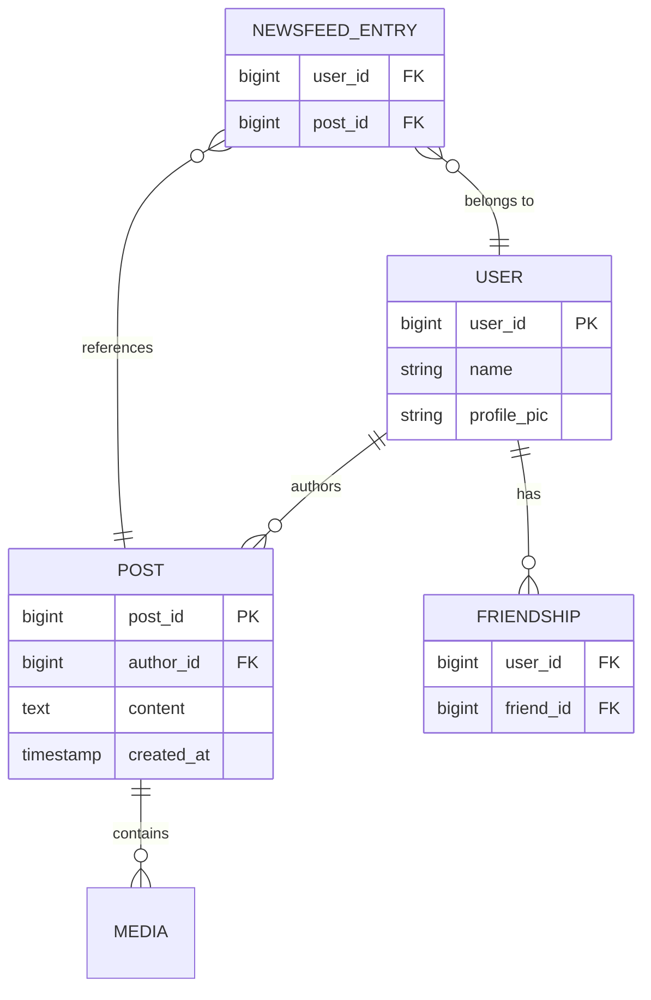
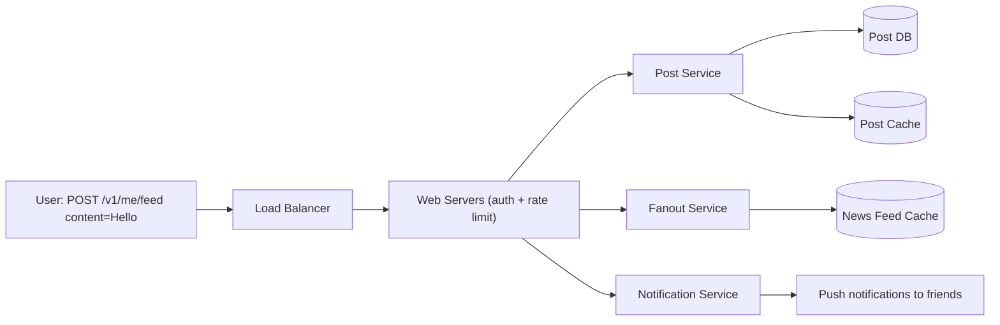
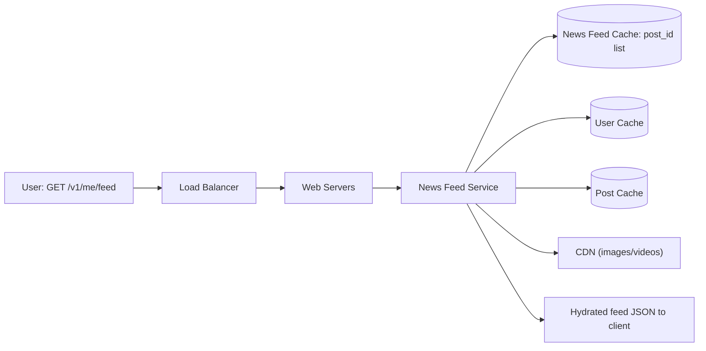
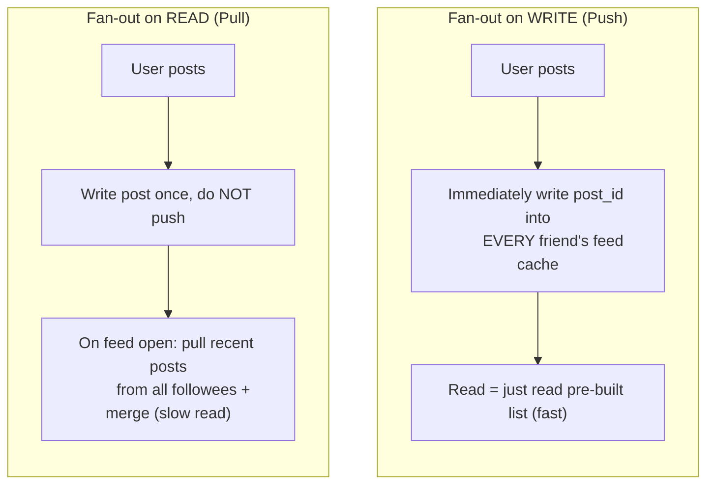
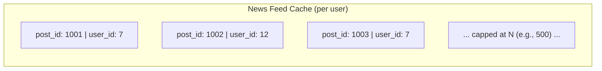
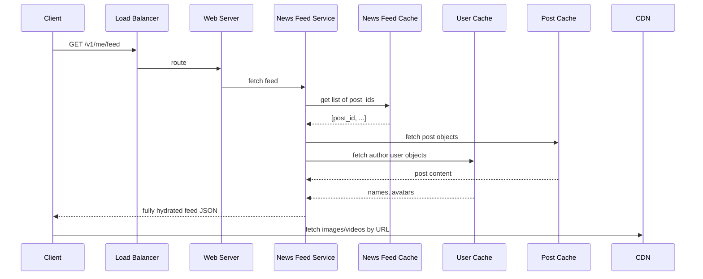
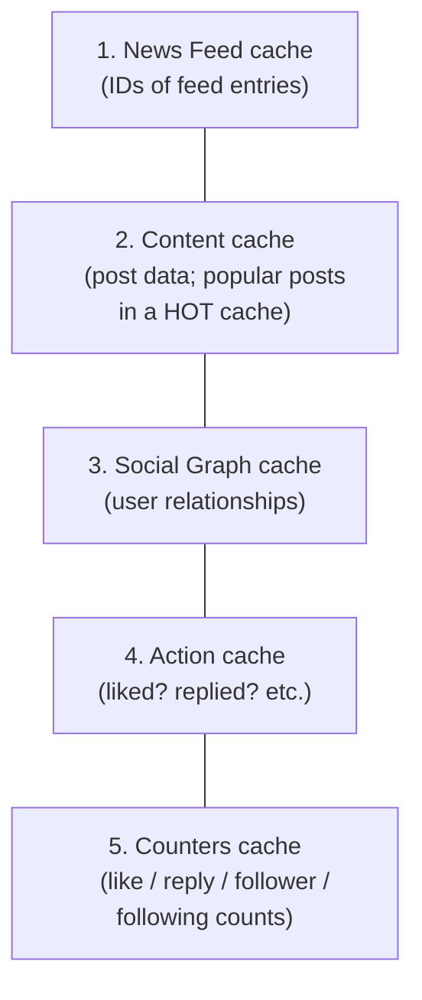

# Alex Xu — Ch 11: Design A News Feed System

> Fan-out on write vs read, feed cache layers, and taming the celebrity "hot key" problem. | Maps to: [../../system-design/01-easy/caching.md](../../system-design/01-easy/caching.md)

---

## 🎯 The Problem

You are asked to design a **news feed system** — the constantly updating list of stories a user sees on their home page. Think Facebook News Feed, Instagram feed, or Twitter timeline. Each entry ("story"/"post") can be a status update, photo, video, or link from people the user follows.

Framed as an interview prompt:

> "Design a news feed system where a user can publish a post and see her friends' posts, aggregated in reverse chronological order, at scale."

The design naturally splits into **two flows**:

1. **Feed publishing** — a user creates a post; it is persisted and *delivered* to friends' feeds.
2. **News feed building/retrieval** — a user opens the app; their feed is assembled and returned quickly.

The central design tension is **when** we do the expensive work of delivering a post to many followers: at **write time** (fan-out on write / push) or at **read time** (fan-out on read / pull).

---

## 📋 Requirements

### Clarifying questions to ask first

| Question | Assumed answer (this design) |
|---|---|
| Mobile app, web app, or both? | Both |
| What are the core features? | Publish a post; view friends' posts on the feed page |
| Feed ordering? | Reverse chronological (newest first). *Not* ML-ranked, to keep it simple |
| Max friends per user? | ~5,000 |
| Traffic volume? | 10 million DAU |
| Media supported? | Yes — text, images, and videos |

### Functional requirements

| # | Requirement |
|---|---|
| F1 | A user can publish a post (text + media) |
| F2 | A user sees friends' posts aggregated on their news feed |
| F3 | Feed is sorted in reverse chronological order |
| F4 | Feed supports images and videos, not just text |
| F5 | Friend/follow relationships drive whose posts appear |
| F6 | Respect user settings (mute, selective sharing/hiding) |

### Non-functional requirements

| # | Requirement | Why it matters |
|---|---|---|
| N1 | **Low latency** feed retrieval | Users refresh constantly; feed must feel instant |
| N2 | **High availability** | Feed is the app's front door |
| N3 | **Scalable** to 10M+ DAU and fan-out spikes | Celebrities have millions of followers |
| N4 | Handle the **hot key** (celebrity) problem gracefully | Avoids write amplification meltdowns |
| N5 | Reasonable **consistency** (eventual is acceptable) | A post appearing a few seconds late is fine |

---

## 🧮 Back-of-the-Envelope Estimation

The book gives DAU and friend count; the rest below are reasonable derived estimates (labeled as such).

**Given**
- DAU = 10,000,000
- Max friends/followers ≈ 5,000

**Write (publish) QPS — estimated**
- Assume each user publishes on average **2 posts/day**.
- Posts/day = 10M × 2 = **20M posts/day**
- Average write QPS = 20M / 86,400 s ≈ **~230 posts/sec**
- Peak ≈ 2× average ≈ **~460 posts/sec**

**Read (feed view) QPS — estimated**
- Assume each user opens/refreshes the feed **5 times/day**.
- Reads/day = 10M × 5 = **50M reads/day**
- Average read QPS = 50M / 86,400 ≈ **~580 reads/sec**
- Peak ≈ 2× ≈ **~1,160 reads/sec**
- Reads dominate writes → optimize the **read path** (favors precompute/push).

**Fan-out amplification (the scary number)**
- A single post by an average user with, say, 300 friends → **300 cache writes** on publish.
- A post by a user near the 5,000-friend cap → **5,000 cache writes**.
- A celebrity with 10M followers → **10M cache writes** for one post ⇒ this is the **hot key problem** that push-only cannot survive.

**News feed cache memory — estimated**
- Store only IDs: a `<post_id, user_id>` pair ≈ **~16 bytes** (2 × 8-byte IDs).
- Cap feed at, say, **N = 500** entries per user → 500 × 16 B = **~8 KB/user**.
- For 10M users cached: 10M × 8 KB = **~80 GB** — comfortably shardable across a Redis fleet.
- *Key insight:* storing IDs (not full objects) is what keeps the cache small; full user/post objects are hydrated at read time from other caches.

---

## 🏗️ High-Level Design

### API design

Simple, HTTP/REST, auth via token.

**Publish a post**
```
POST /v1/me/feed
Params:
  content    : text of the post
  auth_token : authenticate the request
(media uploaded separately / referenced by ID)
```

**Retrieve the news feed**
```
GET /v1/me/feed
Params:
  auth_token : authenticate the request
Returns: fully hydrated feed (usernames, pictures, content, media URLs) as JSON
```

Other implied APIs: add friend/follow, like, comment.

### Data model (logical)



- Friend/follow graph → **graph database** (well suited for relationships & friend-of-friend recommendations).
- Posts → durable store (SQL or NoSQL) **and** post cache.
- News feed → a per-user list of `<post_id, user_id>` in the **news feed cache**.

### Feed publishing — high-level flow



- **Load balancer** spreads traffic across web servers.
- **Web servers** enforce authentication and **rate limiting** (anti-spam) before anything else.
- **Post service** persists the post to DB + cache.
- **Fanout service** pushes the new post into friends' news feed cache.
- **Notification service** tells friends new content is available.

### News feed building/retrieval — high-level flow



The feed service reads a **list of post IDs** from the news feed cache, then **hydrates** them (usernames, avatars, post bodies, media URLs) from the user/post caches and CDN.

---

## 🔬 Deep Dive

### 1. Fan-out models: the core decision

**Fan-out** = the act of delivering a new post to all of the author's friends/followers. There are two strategies, and choosing between them is the heart of this design.



#### Comparison

| Dimension | Fan-out on write (push) | Fan-out on read (pull) |
|---|---|---|
| When work happens | At **write** (publish) time | At **read** (feed open) time |
| Feed freshness | Real-time, pushed instantly | Computed on demand |
| **Read latency** | ✅ Fast (pre-computed list) | ❌ Slow (must gather + merge) |
| **Write cost** | ❌ High; O(#followers) writes | ✅ Low; one write |
| Inactive users | ❌ Wastes compute precomputing feeds they never read | ✅ No wasted work |
| Celebrity / many followers | ❌ **Hot key** — millions of writes per post | ✅ No hot key |
| Storage | Higher (feed lists per user) | Lower |

#### Chosen approach: **Hybrid**

Because fast reads are crucial and reads dominate writes, use **push for the majority of users**. For **celebrities / users with huge follower counts**, switch to **pull** so their followers fetch that content on demand at read time — this avoids overwhelming the system with a fan-out storm.

- **Consistent hashing** is used to distribute requests/data more evenly and further **mitigate hot keys**.
- Net effect: a normal user's feed is mostly pre-built (fast), and celebrity posts are merged in at read time.

> Mnemonic: *push for the many, pull for the famous.*

### 2. Fan-out service internals (push path)

```mermaid
sequenceDiagram
    participant WS as Web Server
    participant FO as Fanout Service
    participant GDB as Graph DB
    participant UC as User Cache
    participant MQ as Message Queue
    participant FW as Fanout Workers
    participant NFC as News Feed Cache

    WS->>FO: new post_id, author_id
    FO->>GDB: fetch friend IDs
    GDB-->>FO: [friend_id, ...]
    FO->>UC: get friend info + settings
    UC-->>FO: settings (muted? hidden? selective share?)
    FO->>FO: filter friends by settings
    FO->>MQ: enqueue (friends_list, post_id)
    FW->>MQ: consume messages
    FW->>NFC: append <post_id, user_id> to each friend's feed
    Note over NFC: only IDs stored; feed capped at N entries
```

Step-by-step:
1. **Fetch friend IDs** from the graph DB.
2. **Get friend info** from the user cache and **filter** by settings (e.g., a muted person's posts are dropped; selectively-shared/hidden posts are excluded).
3. **Send** the filtered friend list + post ID to a **message queue** (decouples publish from delivery, absorbs spikes).
4. **Fanout workers** consume from the queue and **append** `<post_id, user_id>` to each friend's news feed cache.
5. The news feed cache is effectively a **`<post_id, user_id>` mapping table**.

**Why store only IDs?** Storing whole user/post objects would blow up memory. IDs keep it tiny; a **configurable cap (N)** bounds each feed since users rarely scroll thousands of posts, so cache miss rate stays low.



### 3. News feed retrieval (read path) with hydration



- The feed is **more than IDs** — the service hydrates username, profile picture, post content, post image, etc.
- **Media (images/videos) served from CDN** for fast, geographically-close delivery.
- For a hybrid design, this is also where **celebrity posts are pulled** and merged into the pre-built list.

### 4. Cache architecture — 5 tiers

Cache is *extremely* important here. The cache tier is split into five specialized layers so each can be sized/scaled independently.



| Layer | Stores | Notes |
|---|---|---|
| News Feed | IDs of news feed entries | Tiny; the per-user post_id list |
| Content | Every post's data | Popular content promoted to a **hot cache** |
| Social Graph | User relationship data | Who follows/friends whom |
| Action | Whether a user liked/replied/etc. | Per-user, per-post interactions |
| Counters | like/reply/follower/following counts | High-write-rate counters isolated here |

See also the broader caching patterns (cache-aside, TTL, eviction, hot keys) in [../../system-design/01-easy/caching.md](../../system-design/01-easy/caching.md).

---

## ⚠️ Edge Cases, Bottlenecks & Scaling

### The hot key / celebrity problem (the big one)
- **Cause:** push model does O(#followers) writes per post. A 10M-follower celebrity ⇒ 10M writes per post.
- **Mitigations:**
  - **Hybrid fan-out** — pull celebrity posts at read time instead of pushing.
  - **Consistent hashing** to spread the load and avoid a single hot shard.
  - Rate limit / batch fan-out work through the **message queue**.
  - Cache hot content in a dedicated **hot cache** tier.

### Inactive users
- Push wastes compute pre-building feeds users never read. Options: skip fan-out to long-inactive users and lazily build their feed on first login (a pull for them).

### Failure handling & availability
- **Message queue decoupling** means a slow/failed fanout worker doesn't block publishing; work retries from the queue.
- **Stateless web tier** → any server can handle any request; easy to add/remove and survive node loss.
- **Multiple data centers** for geo-redundancy and lower latency.
- **Read replicas** absorb read-heavy feed traffic.

### Consistency / ordering
- Eventual consistency is acceptable — a post may appear a second or two late.
- Reverse-chronological ordering must be preserved when **merging** pushed feed entries with pulled celebrity posts.

### Bottlenecks & how to scale each

| Bottleneck | Scaling technique |
|---|---|
| Database throughput | Vertical vs horizontal scaling; **sharding**; SQL vs NoSQL choice |
| Read load | **Master–slave replication**, **read replicas**, aggressive caching |
| Fan-out spikes | Message queue buffering + more fanout workers |
| Hot shards | Consistent hashing, hot cache |
| Media delivery | CDN offload |
| Coupling/back-pressure | Decouple components via message queues |

### General scaling talking points (from the wrap-up)
- Keep the **web tier stateless**.
- **Cache as much as possible** (5-tier cache).
- Support **multiple data centers**.
- **Loosely couple** components with message queues.
- **Monitor key metrics**: QPS at peak, and feed-refresh latency.

---

## 🔑 Key Takeaways & Interview Tips

- **Split the problem into two flows** immediately: *feed publishing* and *feed retrieval*. This structure earns points fast.
- **Name the two fan-out models** (write/push vs read/pull), list pros/cons, then **propose the hybrid** — push for normal users, pull for celebrities. This is the answer the interviewer wants.
- Call out the **hot key problem** explicitly and offer **consistent hashing + hybrid fan-out** as mitigations.
- Emphasize **"store only IDs"** in the feed cache and **hydrate at read time** — shows you think about memory.
- Use a **message queue** between fan-out and workers for decoupling, spike absorption, and retries.
- Describe the **5-tier cache** (news feed / content / social graph / action / counters) — it signals depth.
- Put **media on a CDN**; keep the web tier **stateless**.
- End with **scaling talking points** (sharding, replicas, multi-DC, monitoring) if time remains.
- There is **no single perfect design** — articulate trade-offs; that's what's being graded.

---

## 🛠️ Open-Source Implementations (GitHub)

| Project | GitHub | How it relates | Approx stars |
|---|---|---|---|
| Stream-Framework (formerly Feedly) | https://github.com/tschellenbach/Stream-Framework | Python library to build activity streams / news feeds using **Cassandra and/or Redis**; supports Facebook/Twitter/Pinterest-style feeds. Directly implements fan-out feed patterns. | ~4.7k |
| GetStream Python client | https://github.com/GetStream/stream-python | Official client for Stream's hosted scalable feed/activity-stream service (the commercial successor to Stream-Framework). | ~300+ |
| GetStream Java client | https://github.com/GetStream/stream-java | Official Java client for building scalable news feeds & activity streams. | ~100+ |
| GetStream JS/feeds | https://github.com/GetStream/stream-js | JavaScript client for Stream feeds; useful reference for feed API shape. | ~250+ |
| Apache Cassandra | https://github.com/apache/cassandra | Wide-column store commonly used as the durable feed/timeline store (write-optimized, ideal for append-heavy feeds). | ~9k |
| Redis | https://github.com/redis/redis | In-memory store used for the news feed cache and hot-content cache tiers described in the chapter. | ~68k |
| sajal48/fanout_hybrid_system | https://github.com/sajal48/fanout_hybrid_system | Spring Boot + PostgreSQL + Cassandra + Redis demo of a **hybrid fan-out** feed handling regular users and celebrities — mirrors this chapter's design. | small/demo |

*(Star counts are approximate and change over time; treat as rough magnitude.)*

---

## 🔗 References & Further Reading

- How News Feed Works (Facebook Help): https://www.facebook.com/help/327131014036297/
- Friend-of-Friend recommendations with Neo4j (graph DB for social graph): https://neo4j.com/developer/graph-data-science/ (topic reference)
- Stream Framework docs: https://stream-framework.readthedocs.io/
- GetStream engineering blog on feed architecture / fan-out: https://getstream.io/blog/
- Twitter Engineering — "Timelines at Scale" (classic fan-out on write vs read discussion): https://www.infoq.com/presentations/Twitter-Timeline/
- Instagram Engineering blog (Cassandra-backed feeds): https://instagram-engineering.com/
- Redis documentation (caching & data structures for feeds): https://redis.io/docs/

---

## ❓ Mock Interview / Self-Check Questions

**Q1. What are the two main flows in a news feed system, and why separate them?**
A: *Feed publishing* (write a post, deliver to friends) and *feed retrieval/building* (assemble and return a user's feed). Separating them clarifies where the expensive fan-out work happens and lets you optimize the read and write paths independently.

**Q2. Contrast fan-out on write vs fan-out on read.**
A: **On write (push)** pre-computes each friend's feed at publish time → fast reads but O(#followers) writes and a hot-key problem for celebrities, plus wasted work for inactive users. **On read (pull)** stores the post once and gathers/merges posts at feed-open time → cheap writes and no hot key, but slow reads. Real systems use a **hybrid**.

**Q3. What is the hot key / celebrity problem and how do you mitigate it?**
A: A single celebrity post triggers millions of feed-cache writes (write amplification), overloading shards. Mitigate with **hybrid fan-out** (pull celebrity posts at read time), **consistent hashing** to spread load, message-queue-buffered/batched fan-out, and a dedicated hot cache.

**Q4. Why store only IDs in the news feed cache?**
A: Full user/post objects would consume huge memory. Storing `<post_id, user_id>` keeps each feed ~kilobytes, so millions of feeds fit in cache. Full objects are hydrated at read time from the user/post caches, and a configurable cap bounds feed length.

**Q5. Walk through the fan-out service steps.**
A: (1) Fetch friend IDs from the graph DB; (2) fetch friend info from user cache and filter by settings (mute/hide/selective share); (3) push friend list + post ID to a message queue; (4) fanout workers consume and append `<post_id, user_id>` to each friend's feed cache; (5) feed cache is capped per user.

**Q6. How is the feed hydrated on retrieval?**
A: The news feed service reads the list of post IDs from the news feed cache, then fetches full post objects (post cache) and author objects (user cache), assembles JSON with names/avatars/content, and serves media via CDN.

**Q7. Describe the 5-tier cache and why it's split.**
A: News Feed (feed IDs), Content (post data, with a hot cache for popular posts), Social Graph (relationships), Action (likes/replies/etc.), and Counters (like/follower counts). Splitting lets each tier be sized, evicted, and scaled to its own access pattern (e.g., counters are write-heavy, content has hot keys).

**Q8. Why use a message queue between the web servers and fanout workers?**
A: It **decouples** publishing from delivery, absorbs traffic **spikes**, enables **retries** on worker failure, and lets you scale fanout workers independently without back-pressuring the publish path.

**Q9. Why does read-path optimization matter more than write-path here?**
A: With rough estimates (~5 feed views vs ~2 posts per user per day), reads outnumber writes, and users refresh constantly expecting instant feeds. So we bias toward pre-computing feeds (push) to make reads fast, accepting higher write cost for most users.

**Q10. What scaling talking points would you raise at the end?**
A: Database scaling (vertical vs horizontal, SQL vs NoSQL, sharding, master-slave replication, read replicas, consistency models), keeping the web tier stateless, caching aggressively, multi-data-center support, loose coupling via message queues, and monitoring peak QPS and feed-refresh latency.
