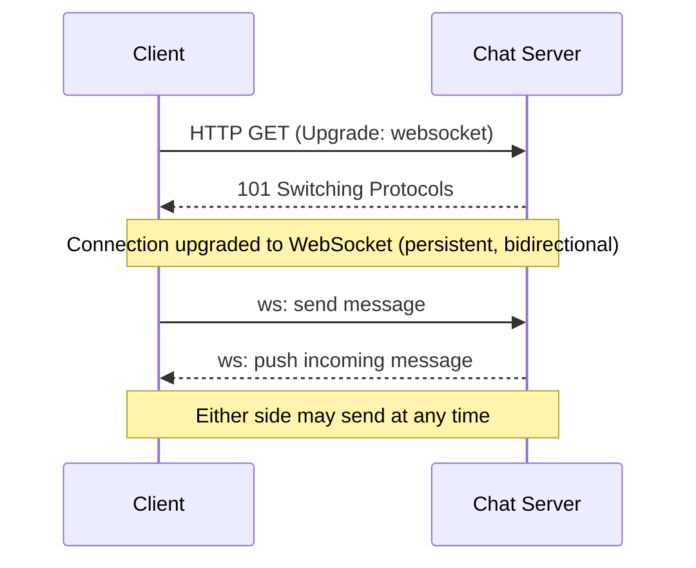
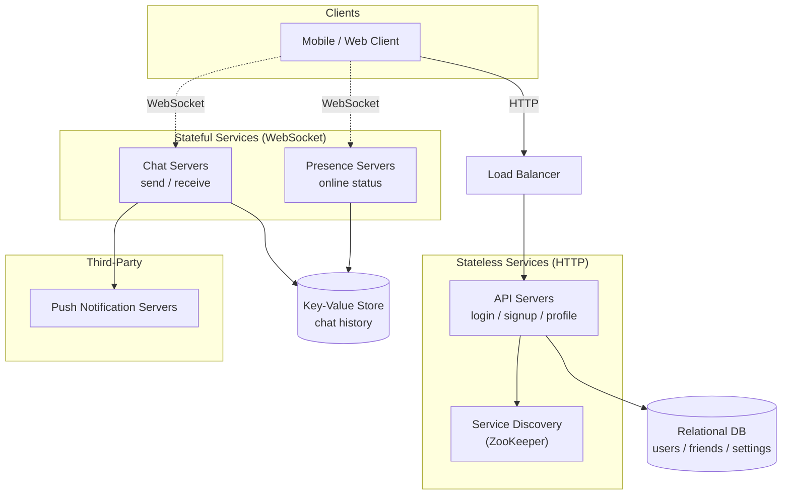
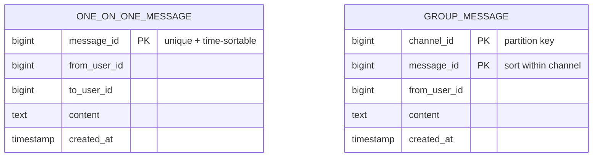
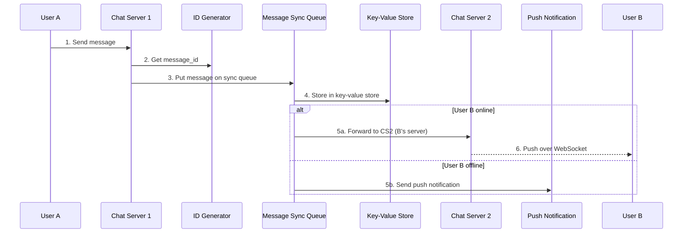
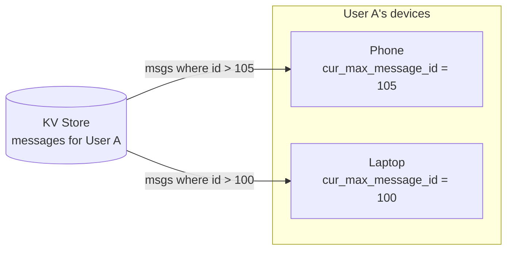
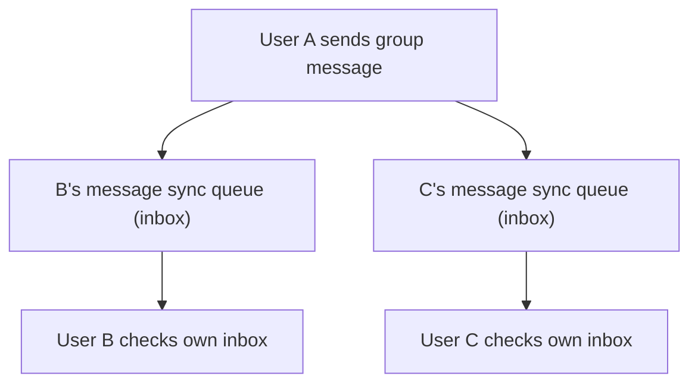
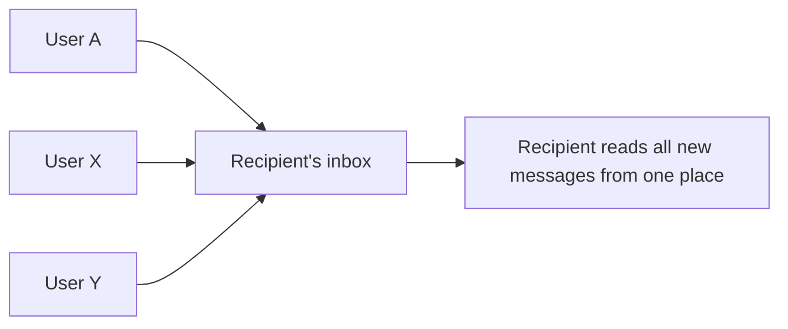
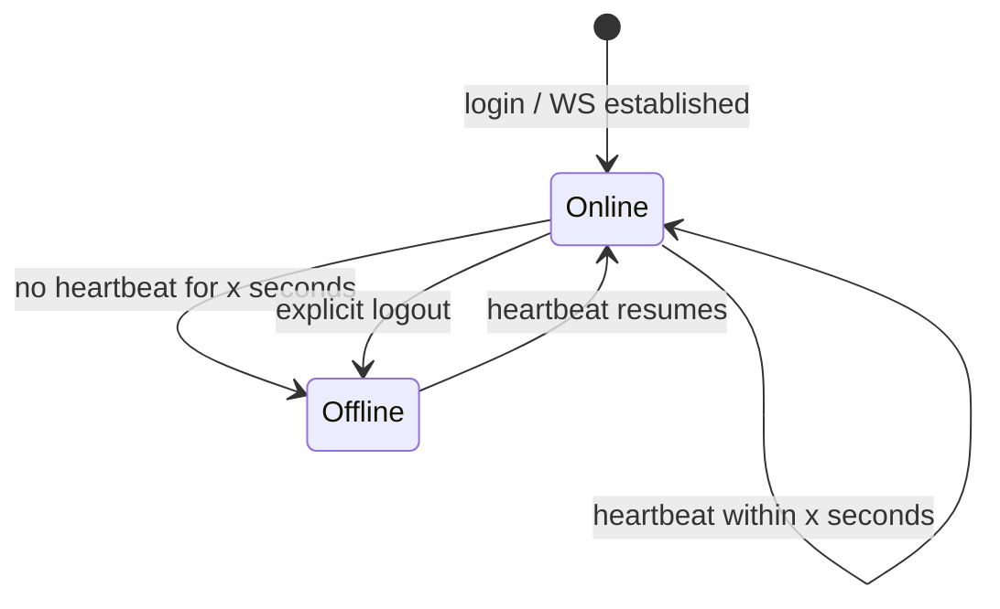
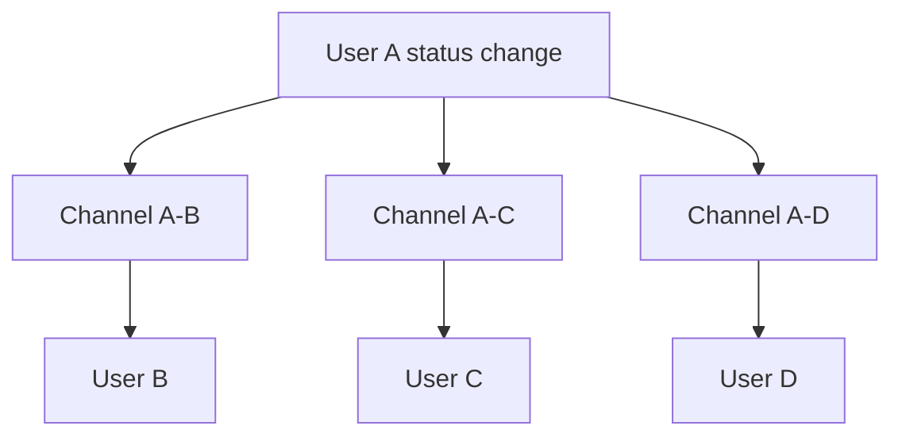

# Alex Xu — Ch 12: Design A Chat System

> Real-time messaging over WebSocket — 1-on-1 + small group chat, online presence, multi-device sync, and message ordering at 50M DAU. | Maps to: Ch 7 (Unique ID / Snowflake), Ch 10 (Notification System), Ch 6 (Key-Value Store)

---

## 🎯 The Problem

Design a chat application similar to Facebook Messenger / WhatsApp. Users exchange text messages in real time with low delivery latency. Messages must be delivered to online recipients instantly and held for offline recipients until they reconnect. Clients never talk to each other directly — every client connects to a **chat service** that receives, routes, and (when necessary) stores messages.

The tricky part is that a chat system inverts the normal web request/response model: most of the time the **server** needs to push data to the **client** (an incoming message), but HTTP is client-initiated. The core design challenge is choosing a communication protocol that supports server-initiated delivery, then building presence, sync, ordering, and storage around it.

Interview framing: *"Design a chat system that supports both 1-on-1 and small group chat for 50 million daily active users, with online presence and multi-device support, text messages only."*

---

## 📋 Requirements

### Clarifying Questions to Ask First

Nailing scope matters enormously here — a group-chat-first design (Slack) looks very different from a 1-on-1-first design (Messenger). Ask:

| Question | Answer used in this design |
|---|---|
| 1-on-1, group, or both? | Both |
| Mobile, web, or both? | Both |
| Scale? | 50 million DAU |
| Group member cap? | Max 100 people (small group) |
| Which features matter? | 1-on-1 chat, group chat, online indicator; **text only** |
| Message size limit? | < 100,000 characters |
| End-to-end encryption? | Not required now (discuss if time allows) |
| How long to store history? | **Forever** |

### Functional Requirements

| # | Requirement |
|---|---|
| F1 | 1-on-1 chat with low delivery latency |
| F2 | Small group chat (≤ 100 members) |
| F3 | Online presence indicator (green dot) |
| F4 | Multi-device support (same account logged in on many devices simultaneously) |
| F5 | Push notifications when the app is not running |
| F6 | Persist chat history forever; offline users see history on return |
| F7 | Text messages only (≤ 100K chars) |

### Non-Functional Requirements

| # | Requirement | Why |
|---|---|---|
| N1 | Low latency real-time delivery | Chat UX demands near-instant delivery |
| N2 | High availability / no single point of failure | 50M DAU, always-on expectation |
| N3 | Message ordering consistency | Messages must appear in send order within a channel |
| N4 | Scalability of persistent connections | Millions of concurrent WebSocket connections |
| N5 | Durability | History stored forever; no message loss |
| N6 | Reliable delivery to offline users | Hold-and-forward + push notifications |

---

## 🧮 Back-of-the-Envelope Estimation

The book gives limited numbers, so several figures below are reasonable estimates labeled as such.

**Concurrent connections & memory (from the book):**
- Assume 1M concurrent users.
- Each persistent WebSocket connection costs ~**10 KB** of server memory (rough, language-dependent).
- Memory to hold all connections on one box: `1,000,000 × 10 KB = 10 GB`.
- So a single modern server *could* in theory hold ~1M connections — but a single server is a **deal-breaker** (single point of failure). Use it only as a starting narrative.

**Connection server fan-out (estimated):**
- 50M DAU; assume ~10% online concurrently at peak ≈ **5M concurrent connections**.
- At ~1M connections/box → need ~**5 chat servers** minimum just for connection capacity (add headroom + redundancy → ~10–20 boxes).

**Message volume (industry number cited in book):**
- Facebook Messenger + WhatsApp process ~**60 billion messages/day**.
- For our 50M DAU app, estimate ~20 messages/user/day → `50M × 20 = 1 billion messages/day`.
- Write QPS ≈ `1e9 / 86,400 ≈ 11,600 msg/s` average; peak (×3–5) ≈ **35K–60K writes/s**.
- Read:write ratio ≈ **1:1** for 1-on-1 chat (book), so read QPS is similar.

**Storage (estimated):**
- Average text message ~100 bytes of payload + metadata (say ~200 bytes/row).
- `1e9 msg/day × 200 B = 200 GB/day ≈ 73 TB/year`. "Forever" retention → petabyte-scale over years → strongly favors a horizontally scalable key-value store (HBase / Cassandra).

**Presence fan-out (worst case, discussed in book):**
- Small friend groups → cheap pub/sub.
- A 100,000-member group → one status change generates **100,000 events** → do NOT eagerly fan out; fetch on demand instead.

---

## 🏗️ High-Level Design

Clients (mobile/web) connect to a **chat service** that receives messages, finds recipients, relays to online users, and holds messages for offline users. WebSocket is the main protocol; everything non-real-time (signup, login, profile) uses ordinary HTTP request/response.

### Why WebSocket (protocol comparison)

The receiver side is the hard part: HTTP is client-initiated, so the server can't naturally push. Techniques to simulate server push:

| Technique | How it works | Drawbacks |
|---|---|---|
| **Polling** | Client periodically asks "any new messages?" | Wasteful — most responses are "no"; burns server resources; latency = poll interval |
| **Long polling** | Client holds request open until a message arrives or timeout; then re-requests | Sender/receiver may hit different stateless servers (round-robin); server can't easily tell if client disconnected; still periodic when idle |
| **WebSocket** ✅ | Client-initiated, then HTTP `Upgrade` handshake → **bidirectional, persistent** connection | Persistent connections require careful server-side connection management; stateful servers |

WebSocket works through firewalls because it rides on ports 80/443 (HTTP/HTTPS). Since it's bidirectional, we use it for **both** send and receive — simplifying client and server code.



### System Architecture



**Three categories of service:**
- **Stateless services** — login, signup, profile, service discovery. Sit behind a load balancer routing by path. Can be monolith or microservices; many are off-the-shelf.
- **Stateful service** — the **chat service**. Stateful because each client holds a persistent connection to a specific chat server and stays on it while it's healthy.
- **Third-party integration** — **push notifications** (see Ch 10). Informs users of new messages even when the app is closed.

### Storage Choice: Key-Value Store

Two data types:
1. **Generic data** (user profile, settings, friends list) → **relational DB** with replication + sharding. Low volume, structured, needs relations.
2. **Chat history** → **key-value store**.

Why KV store for chat history:
- Easy horizontal scaling.
- Very low latency access.
- Relational DBs handle the **long tail** poorly — as indexes grow huge, random access becomes expensive.
- Battle-tested precedent: **Facebook Messenger uses HBase**, **Discord uses Cassandra**.

Read/write patterns that shaped this:
- Enormous volume.
- Only **recent** chats accessed frequently.
- But random-access features (search, jump-to-message, view mentions) must still work.
- Read:write ≈ **1:1** for 1-on-1.

### Data Models

**1-on-1 message table** — primary key is `message_id` (decides sequence). Do NOT use `created_at` for ordering — two messages can share a timestamp.



**Group message table** — composite primary key `(channel_id, message_id)`. `channel_id` is the **partition key** because all group queries operate within a channel. (Channel = group.)

### API Design (illustrative)

| Concern | Method | Endpoint / Frame | Notes |
|---|---|---|---|
| Signup | POST | `/v1/users` | Stateless HTTP |
| Login | POST | `/v1/login` | Returns token + chat server host from service discovery |
| Get history | GET | `/v1/channels/{channelId}/messages?after={msgId}` | Cursor by `message_id` |
| Send (1-1) | ws | `{type:"msg", to, content}` | Over WebSocket |
| Send (group) | ws | `{type:"msg", channelId, content}` | Over WebSocket |
| Presence sub | ws | `{type:"presence_sub", friendIds:[...]}` | Subscribe to friends' status |
| Heartbeat | ws | `{type:"heartbeat"}` | Every ~5s to presence server |

### Message ID requirements

`message_id` must be (1) **unique** and (2) **sortable by time** (newer > older). Options:

| Approach | Pros | Cons |
|---|---|---|
| MySQL `auto_increment` | Simple, ordered | NoSQL stores usually lack it |
| **Global 64-bit generator (Snowflake)** | Globally unique + time-sortable (see Ch 7) | Extra service/complexity |
| **Local sequence generator** | Only unique *within a channel* — sufficient since ordering only needs to hold per channel; easiest to implement | Not globally unique (fine here) |

---

## 🔬 Deep Dive

### Service Discovery

Recommends the best chat server for a client based on geography, server capacity, etc. **Apache ZooKeeper** is a common solution: it registers available chat servers and picks the best one per client.

```mermaid
sequenceDiagram
    participant A as User A
    participant LB as Load Balancer
    participant API as API Servers
    participant SD as Service Discovery (ZooKeeper)
    participant CS2 as Chat Server 2

    A->>LB: 1. Login
    LB->>API: 2. Route login request
    API->>SD: 3. Authenticated; find best chat server
    SD-->>A: Return "Chat Server 2" host info
    A-->>CS2: 4. Open WebSocket connection
```

### 1-on-1 Message Flow



Key idea: the message is **durably stored first** (step 4), then delivered. If B is offline, KV store + push notification guarantee B eventually gets it.

### Multi-Device Message Synchronization

User A has a phone and a laptop, each holding its **own** WebSocket connection to a chat server. Each device tracks `cur_max_message_id` = the latest message ID it has seen.

A message is **new for a device** if BOTH hold:
1. Its recipient ID equals the currently logged-in user.
2. Its `message_id` in the KV store is **greater than** that device's `cur_max_message_id`.

Because each device has its own cursor, each independently pulls messages `> cur_max_message_id` from the KV store — sync becomes trivial and devices stay independent.



### Small Group Chat Flow

**Write side (fan-out on write / "copy to inbox"):** When User A sends to a group of {A, B, C}, A's message is **copied into each recipient's message sync queue (inbox)** — one for B, one for C. Think of the sync queue as a personal inbox.



**Read side:** Each recipient has one inbox aggregating messages from *all* senders in *all* their groups.



**Why fan-out-on-write for small groups?**
- Simplifies sync: each client only checks its **own** inbox for new messages.
- Cheap when group is small: storing a copy per member is affordable.
- **Precedent:** WeChat uses this approach and caps groups at **500 members**.

**Trade-off:** For very large groups, storing a copy per member is **not acceptable** (write amplification explodes). Large groups need a different model (fan-out on read / shared channel log).

| Model | Best for | Trade-off |
|---|---|---|
| Fan-out on write (copy to each inbox) | Small groups (≤ 100–500) | Simple reads; write amplification grows with member count |
| Fan-out on read (shared channel log, pull) | Large groups / broadcast | Cheap writes; heavier reads, more complex sync |

### Online Presence

Presence servers manage online/offline status and talk to clients over WebSocket. Several flows change status:

**Login:** After the WebSocket is established, User A's status + `last_active_at` are saved to the KV store; indicator shows online.

**Logout:** Status set to offline in KV store; indicator shows offline.

**Disconnection (the hard case):** Connections drop constantly (e.g., driving through a tunnel). A naive "offline on disconnect, online on reconnect" flickers badly. Solution: a **heartbeat** mechanism.



Heartbeat example (numbers arbitrary for illustration): client sends a heartbeat every **5 seconds**. If the presence server receives one within **x = 30 seconds**, the user stays online. After the client goes silent past 30s, status flips to offline. This absorbs brief blips without flickering.

**Online status fan-out** uses a **publish-subscribe** model — one channel per friend pair. When A's status changes, A publishes to channels A-B, A-C, A-D; B, C, D are subscribed and get updates over WebSocket.



This is fine for small friend sets (WeChat-style, capped ~500). For a **100,000-member** group each change would emit 100,000 events — a bottleneck. Fix: **fetch presence on demand** only when a user enters the group or manually refreshes the list, instead of eagerly pushing.

---

## ⚠️ Edge Cases, Bottlenecks & Scaling

**Single-server design is a trap.** Even though ~1M connections (~10 GB RAM) fit on one box, a single server is a single point of failure. Acceptable only as an explicit *starting point* in the interview; then scale out.

**Connection management at scale.** Persistent WebSocket connections are stateful and long-lived. A single chat server may hold hundreds of thousands of connections. This makes graceful deploys, autoscaling, and failover harder than for stateless services.

**Chat server failure.** If a chat server dies, all its connections drop. Clients reconnect; service discovery (ZooKeeper) hands out a **new** healthy chat server to reconnect to.

**Message reliability.** Store-first-then-deliver ensures durability. For delivery failures, use **retry + queueing** to resend messages. Deduplicate on the client using `message_id` so retries don't produce duplicates.

**Ordering.** Rely on `message_id` (monotonic within a channel), never `created_at` — clock collisions produce ties. Local per-channel sequence numbers are sufficient because ordering only needs to hold within a channel.

**Offline delivery.** Hold messages in the KV store; push-notify offline users. On reconnect the device pulls everything `> cur_max_message_id`.

**Presence hot spots.** Large groups make eager fan-out explode (N events per change). Switch to on-demand/pull presence for big groups.

**Group write amplification.** Fan-out-on-write is great for ≤100–500 members but breaks for huge groups — switch models.

**Storage growth.** "Forever" retention → petabyte scale. KV store (HBase/Cassandra) with horizontal scaling and time-based partitioning; only recent data is hot, so tiered storage/caching helps.

**Wrap-up talking points (extensions):**
- **Media files** (photos/videos): far larger than text — discuss compression, cloud object storage, thumbnails.
- **End-to-end encryption** (WhatsApp-style): only sender + recipient can read.
- **Client-side caching** of messages reduces data transfer.
- **Faster load time**: Slack built a geo-distributed edge cache (**Flannel**) for users/channels.
- **Error handling**: chat server failure recovery + message resend.

---

## 🔑 Key Takeaways & Interview Tips

1. **Scope first.** Explicitly separate 1-on-1 vs group and agree on scale (50M DAU). The whole design pivots on this.
2. **Lead with the protocol discussion.** Walk polling → long polling → WebSocket and justify WebSocket (bidirectional, persistent, firewall-friendly on 80/443). Use it for both send and receive.
3. **Separate stateless from stateful.** Login/signup/profile = stateless HTTP behind an LB. The chat service is the one stateful piece (persistent connections).
4. **Justify the KV store** with the read/write pattern (huge volume, recent-hot, 1:1 read/write, long-tail random access) and cite HBase (Messenger) / Cassandra (Discord).
5. **`message_id` guarantees ordering** — unique + time-sortable. Prefer Snowflake (Ch 7) or a local per-channel sequence; never order by `created_at`.
6. **Multi-device = per-device `cur_max_message_id` cursor** pulling from the KV store. Clean and simple.
7. **Group chat = fan-out-on-write to per-user inboxes** for small groups; call out that huge groups need a different model.
8. **Presence = heartbeat + pub/sub per friend-pair**; heartbeat prevents flicker; for huge groups fetch presence on demand.
9. **Store first, then deliver.** Durability before delivery; retry/queue for resend; dedupe by `message_id`.
10. **Never propose a single server as the final answer** — name the SPOF explicitly.

---

## 🛠️ Open-Source Implementations (GitHub)

| Project | GitHub | How it relates | Approx ★ |
|---|---|---|---|
| ejabberd | https://github.com/processone/ejabberd | Erlang XMPP/MQTT/SIP server; massively scalable persistent-connection messaging — the classic reference for chat-server scale | ~6k |
| Matrix Synapse | https://github.com/matrix-org/synapse | Reference homeserver for the federated Matrix protocol; rooms, presence, sync, history | ~11k |
| Rocket.Chat | https://github.com/RocketChat/Rocket.Chat | Full Slack-like team chat (channels, groups, presence) built on Meteor/WebSocket | ~42k |
| Centrifugo | https://github.com/centrifugal/centrifugo | Language-agnostic real-time messaging server; persistent WebSocket/SSE, pub/sub, presence — mirrors this chapter's chat/presence servers | ~9k |
| Centrifuge (Go lib) | https://github.com/centrifugal/centrifuge | Go library (core of Centrifugo) for scalable WebSocket with channels + presence | ~1.5k |
| Socket.IO | https://github.com/socketio/socket.io | Widely used WebSocket abstraction with fallbacks, rooms, and broadcast — practical building block for the transport layer | ~61k |
| Apache ZooKeeper | https://github.com/apache/zookeeper | Coordination service used for the chapter's service discovery (best chat server selection) | ~12k |
| Apache Cassandra | https://github.com/apache/cassandra | Wide-column KV store; the datastore Discord uses for billions of messages | ~9k |
| Apache HBase | https://github.com/apache/hbase | Distributed KV/wide-column store used by Facebook Messenger for message storage | ~5k |

*Star counts are approximate and change over time.*

---

## 🔗 References & Further Reading

- Erlang at Facebook (chat backend): https://www.erlang-factory.com/upload/presentations/31/EugeneLetuchy-ErlangatFacebook.pdf
- Messenger + WhatsApp process 60B messages/day: https://www.theverge.com/2016/4/12/11415198/facebook-messenger-whatsapp-number-messages-vs-sms-f8-2016
- Long tail (Wikipedia): https://en.wikipedia.org/wiki/Long_tail
- The Underlying Technology of Messages (Facebook / HBase): https://engineering.fb.com/2010/11/15/core-infra/the-underlying-technology-of-messages/
- How Discord Stores Billions of Messages (Cassandra): https://discord.com/blog/how-discord-stores-billions-of-messages
- Announcing Snowflake (Twitter unique IDs): https://blog.twitter.com/engineering/en_us/a/2010/announcing-snowflake
- Apache ZooKeeper: https://zookeeper.apache.org/
- The evolution of WeChat background system (Chinese): https://www.infoq.cn/article/the-road-of-the-growth-weixin-background
- WhatsApp end-to-end encryption: https://faq.whatsapp.com/
- Flannel — application-level edge cache to make Slack scale: https://slack.engineering/flannel-an-application-level-edge-cache-to-make-slack-scale/

---

## ❓ Mock Interview / Self-Check Questions

**Q1. Why is WebSocket preferred over long polling for a chat system?**
WebSocket gives a single persistent, bidirectional connection after an HTTP `Upgrade` handshake, so the server can push incoming messages immediately without the client asking. Long polling wastes cycles when idle, can't reliably detect disconnects, and — because HTTP servers are typically stateless with round-robin LBs — the message-receiving server may not be the one holding the recipient's open connection. WebSocket also traverses firewalls via ports 80/443.

**Q2. Why not use `created_at` to order messages?**
Two messages can be created at the exact same timestamp, producing ambiguous ordering. Instead use `message_id`, which must be unique **and** time-sortable (newer > older). Ordering only needs to hold within a channel.

**Q3. What are the options for generating `message_id`, and which would you pick?**
(1) MySQL `auto_increment` — simple but usually unavailable in NoSQL. (2) A global 64-bit generator like **Snowflake** — globally unique + time-sortable. (3) A **local** per-channel sequence — sufficient because ordering only needs to hold within one channel, and easiest to implement. Pick Snowflake for a global guarantee, or local sequences to minimize complexity.

**Q4. Why a key-value store for chat history instead of a relational DB?**
Chat volume is enormous, recent data is hot, and features like search need random access. KV stores scale horizontally, offer low latency, and handle the long tail better than relational indexes, which get expensive as they grow huge. Proven in practice: Messenger uses HBase, Discord uses Cassandra.

**Q5. How do you sync messages across a user's multiple devices?**
Each device keeps its own `cur_max_message_id` cursor. A message is new for a device if the recipient ID matches the logged-in user AND its stored `message_id` exceeds that device's cursor. Each device independently pulls messages greater than its cursor from the KV store, so devices sync without coordinating with each other.

**Q6. How does small-group chat delivery work, and when does it break?**
Fan-out-on-write: the sender's message is copied into each recipient's personal message sync queue (inbox). Reads are simple — each client checks only its own inbox. It's cheap for small groups (WeChat caps at 500). It breaks for very large groups because storing a copy per member causes write amplification; those need fan-out-on-read against a shared channel log.

**Q7. How does the presence system avoid flickering when a user's connection is flaky?**
It uses a heartbeat: the client sends a heartbeat (e.g., every 5s). The presence server keeps the user online as long as a heartbeat arrives within a window (e.g., 30s). Only after silence past the window does status flip to offline — absorbing brief drops like driving through a tunnel.

**Q8. How is online status propagated to friends, and how does it scale?**
A pub/sub model with one channel per friend pair: on a status change, the user publishes to each pair channel and subscribed friends receive updates over WebSocket. This is fine for small friend sets, but a 100,000-member group would emit 100,000 events per change — so for large groups, fetch presence on demand (on group entry or manual refresh) instead of eager fan-out.

**Q9. What happens when a chat server crashes with hundreds of thousands of live connections?**
All its connections drop. Clients detect the loss and reconnect; service discovery (ZooKeeper) hands out a new healthy chat server. Messages in flight are protected by store-first-then-deliver plus retry/queue resend, and clients dedupe by `message_id`.

**Q10. Which services are stateless vs stateful, and why does it matter?**
Stateless: login, signup, profile, service discovery — they sit behind a load balancer and scale trivially. Stateful: the chat (and presence) service, because each client holds a persistent connection pinned to a specific server. Statefulness complicates load balancing, deploys, and failover, which is why the rest of the system is kept stateless and the stateful part is isolated and coordinated via service discovery.
