# Alex Xu — Ch 13: Design A Search Autocomplete System

> Serve the top‑k most popular queries for a typed prefix in <100 ms using a frequency‑annotated trie, offline data aggregation, and aggressive caching. | Maps to: Ch 6 (Key‑Value Store, for Trie DB), Ch 4 (Rate Limiter / QPS thinking), Ch 5 (Consistent Hashing / sharding), Ch 3 (Estimation framework).

<!-- tag: axu_ch13 -->

---

## 🎯 The Problem

You are asked to **design a search autocomplete system** — the feature that shows suggestions as a user types into a search box. It is also called **typeahead**, **search‑as‑you‑type**, **incremental search**, or in interview shorthand **"design top‑k"** / **"design top‑k most searched queries"**.

Concretely: while the user types the prefix `din`, the backend returns the 5 most popular full queries that begin with `din` (e.g., `dinner`, `dinner ideas`, `dinner recipes`, …), ranked by historical search popularity. Every keystroke fires a request, so the system must respond almost instantly.

Interview framing: this is a classic *read‑heavy, latency‑critical* design where the interesting tension is **precomputation vs. freshness** and **space vs. time** — you trade memory (caching top‑k at every node) to hit sub‑100 ms latency.

---

## 📋 Requirements

### Clarifying questions to ask first

| Question | Answer assumed in this design |
|---|---|
| Match only at the **start** of the query, or anywhere (substring)? | Only at the **beginning** (prefix match). |
| How many suggestions to return? | **5**. |
| How is "top 5" decided? | By **popularity** = historical query frequency. |
| Spell check / autocorrect? | **No.** |
| Language(s)? | **English** only for the core design (multi‑language discussed as a follow‑up). |
| Capitalization / special characters? | **No** — assume lowercase alphabetic only. |
| Scale? | **10 million DAU.** |

### Functional requirements

| # | Requirement |
|---|---|
| F1 | Given a prefix, return the top **5** matching full queries. |
| F2 | Matches are **prefix** matches (query must *start with* the typed text). |
| F3 | Results are **sorted by popularity** (historical frequency). |
| F4 | Support **filtering/removal** of unwanted (hateful, violent, explicit, dangerous) suggestions. |

### Non‑functional requirements

| # | Requirement | Target / note |
|---|---|---|
| N1 | **Fast response time** | < **100 ms** per keystroke (Facebook typeahead article cites this; slower causes "stuttering"). |
| N2 | **Relevant** | Suggestions must relate to the typed prefix. |
| N3 | **Sorted** | Ranked by popularity or another ranking model. |
| N4 | **Scalable** | Handle high, spiky traffic (tens of thousands of QPS). |
| N5 | **Highly available** | Stay usable when parts of the system are offline/slow/erroring. |

---

## 🧮 Back‑of‑the‑Envelope Estimation

Assumptions:
- **10M DAU**.
- Average person does **10 searches/day**.
- **20 bytes per query string** (ASCII → 1 char = 1 byte; ~4 words × 5 chars = 20 chars).
- **Every keystroke** triggers a backend request → ~**20 requests per completed query** (one per character).

**Example** — typing `dinner` sends 6 requests:

```
search?q=d
search?q=di
search?q=din
search?q=dinn
search?q=dinne
search?q=dinner
```

### QPS

```
requests/day = 10,000,000 users × 10 queries/day × 20 chars/query
             = 2,000,000,000 requests/day

QPS = 2,000,000,000 / (24 × 3600)
    = 2,000,000,000 / 86,400
    ≈ 23,148  ≈ 24,000 QPS

Peak QPS ≈ QPS × 2 ≈ 48,000 QPS
```

### New‑data storage per day

Assume **20% of daily queries are new** (not yet in the trie):

```
new data/day = 10,000,000 × 10 × 20 bytes × 0.20
             = 2,000,000,000 × 20 × 0.20 bytes
             = 0.4 GB/day
```

So ~**0.4 GB of new query data per day** flows into storage. (Over a year ≈ 146 GB of *new* raw query text — modest, which is why a trie can stay largely in memory and be rebuilt periodically.)

**Takeaways from the math:** the workload is **extremely read‑heavy** and **latency‑bound**, not storage‑bound. That justifies precomputing/caching top‑k and rebuilding the index offline rather than updating on every write.

---

## 🏗️ High-Level Design

At the top level the system splits into **two services**:

- **Data gathering service** — collects user queries and aggregates their frequencies. (Naïve real‑time version first; realistic offline version in the deep dive.)
- **Query service** — given a prefix, returns the 5 most frequent queries.

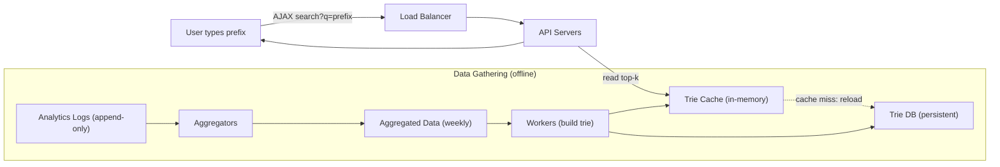

### Naïve v0: a relational frequency table

The simplest possible backing store is a table:

| Column | Meaning |
|---|---|
| `query` | The full query string. |
| `frequency` | Number of times it has been searched. |

Get top 5 for a prefix with SQL like:

```sql
SELECT query, frequency
FROM frequency_table
WHERE query LIKE 'tw%'      -- prefix match
ORDER BY frequency DESC
LIMIT 5;
```

This is **fine for a small dataset** but the DB becomes the bottleneck at scale: a `LIKE 'prefix%'` + sort scan per keystroke at ~48K peak QPS is untenable. The deep dive replaces this with a **trie**.

### API design

| Endpoint | Method | Params | Returns |
|---|---|---|---|
| `/v1/search` | `GET` | `q` = prefix string (lowercase), optional `limit` (default 5) | JSON list of top‑k suggestions with (optional) frequency/score |

Example:

```
GET /v1/search?q=tr&limit=5
→ 200 OK
{
  "prefix": "tr",
  "suggestions": [
    {"query": "true", "score": 35},
    {"query": "try",  "score": 29},
    {"query": "tree", "score": 10}
  ]
}
```

Response is served over **AJAX** (no full page reload) and is **browser‑cacheable** (see deep dive).

---

## 🔬 Deep Dive

The core of the system is a **customized trie**. We optimize the basic trie to hit O(1) reads, then design the offline pipeline that builds it, the query path that serves it, how to store/scale it, and how updates/deletes work.

### 1. The trie (prefix tree)

Basics:
- Tree‑like structure; **root = empty string**.
- Each node stores **one character**; conceptually up to **26 children** (one per lowercase letter). Empty links aren't drawn.
- A node marks a **word/prefix**; a path from root to a marked node spells a stored query.

Trie holding `tree, try, true, toy, wish, win` (thick‑bordered nodes = end of a stored query):

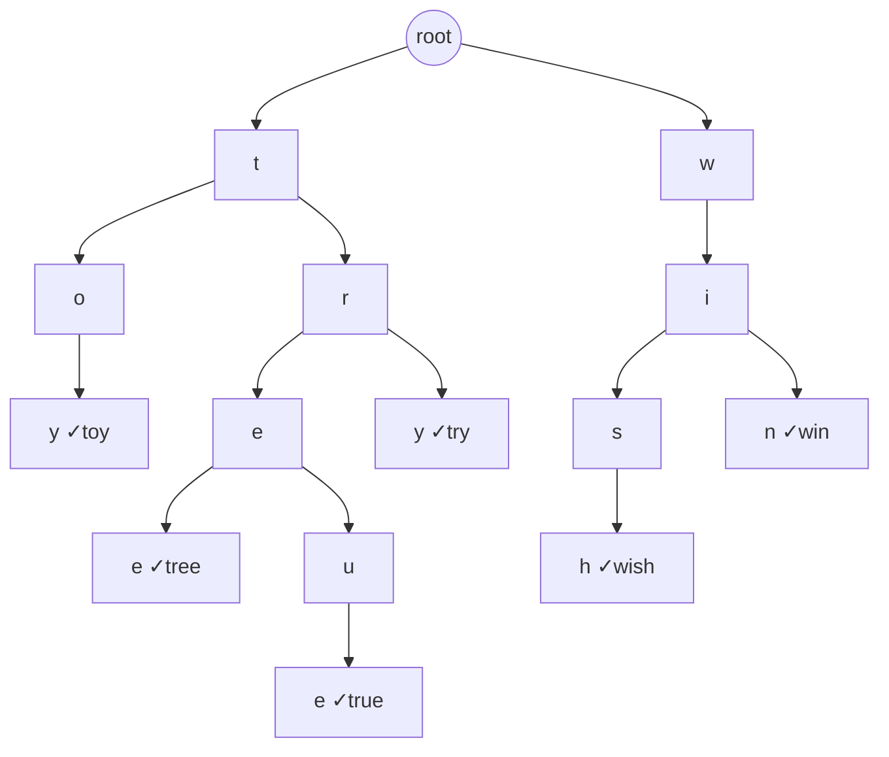

**Add frequency to nodes.** To rank by popularity, each terminal node also stores the query's frequency. Given a frequency table `{tree:10, try:29, true:35, toy:14, wish:25, win:50}`, the trie carries those counts at the corresponding leaves.

### 2. Naïve query algorithm & its cost

Definitions: `p` = prefix length, `n` = total nodes, `c` = children in the prefix's subtree.

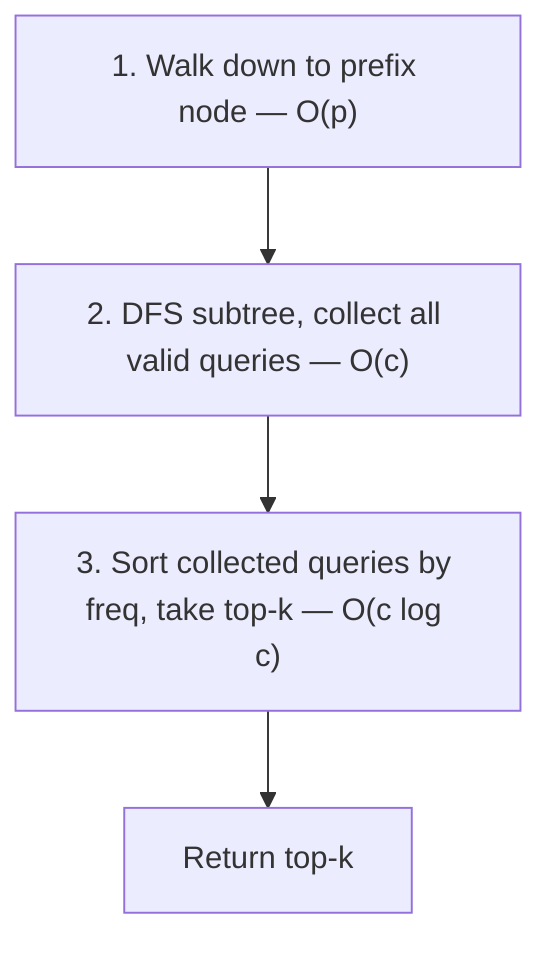

**Worked example** (`k = 2`, user types `tr`, frequencies `tree:10, true:35, try:29`):
1. Find node `tr` → O(p).
2. Traverse subtree → candidates `[tree:10, true:35, try:29]`.
3. Sort desc, take 2 → **`[true:35, try:29]`**.

Total: **O(p) + O(c) + O(c·log c)**. Problem: in the worst case (short/common prefix) `c` is huge — you may traverse most of the trie per keystroke. Too slow for 100 ms at scale.

### 3. Two optimizations → O(1) reads

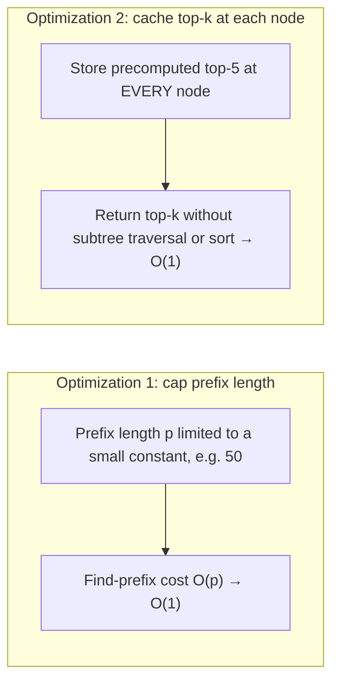

**Optimization 1 — limit max prefix length.** Users rarely type very long queries, so cap `p` (say 50). "Find the prefix" becomes O(small constant) ≈ **O(1)**.

**Optimization 2 — cache top‑k at each node.** Store the precomputed **top‑5** queries directly on *every* node. Then answering a prefix is just: jump to the node, read its cached list. No subtree DFS, no sort.

> Example: node with prefix `be` stores `[best:35, bet:29, bee:20, be:15, beer:10]`.

**Result:** step 1 is O(1) (capped prefix) and step 2 is O(1) (cached list) → overall **O(1)** to fetch top‑k. Cost is **extra space** (top‑k stored at every node). Trading space for time is worth it because latency is paramount.

| Approach | Find prefix | Get top‑k | Overall read | Space |
|---|---|---|---|---|
| Naïve trie | O(p) | O(c) + O(c log c) | O(p + c log c) | Low |
| + cap prefix | O(1) | O(c) + O(c log c) | O(c log c) | Low |
| + cache top‑k at nodes | O(1) | O(1) | **O(1)** | High (k entries/node) |

### 4. Data gathering service (offline, scalable)

Updating the trie on **every** query is impractical: (a) billions of writes/day would starve the read path, and (b) top suggestions barely change hour‑to‑hour, so frequent rebuilds are wasteful. Instead, build from **analytics/logging** data on a schedule.

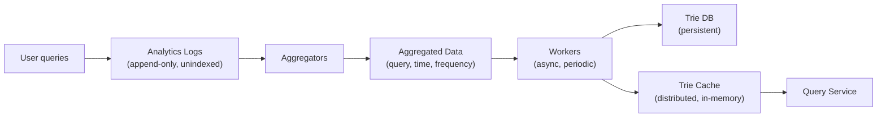

| Component | Role |
|---|---|
| **Analytics Logs** | Raw, **append‑only**, unindexed record of every (sampled) search query with timestamp. |
| **Aggregators** | Roll up the huge raw log into usable frequency counts. Interval depends on freshness needs: short (e.g. minutes) for real‑time apps like Twitter; **weekly** is fine for Google‑style keyword lists. |
| **Aggregated Data** | Table of `query, time (week start), frequency (sum over that week)`. |
| **Workers** | Set of servers running periodic async jobs that build the trie from aggregated data and write it to Trie DB. |
| **Trie Cache** | Distributed in‑memory cache holding the trie for fast reads; refreshed from a **weekly snapshot** of the DB. |
| **Trie DB** | Persistent storage for the serialized trie. |

Example aggregated row: `("dinner", 2020-06-01, 12345)` — 12,345 occurrences in the week starting June 1.

**Trie DB storage options:**

| Option | How it maps | Good when |
|---|---|---|
| **Document store** (e.g., MongoDB) | Serialize the whole weekly trie snapshot and store the blob. | Trie is rebuilt wholesale weekly; simple. |
| **Key‑value store** | Each **prefix → key**; each node's data (its cached top‑k) → **value**. | Need per‑prefix lookups / distributed KV (see Ch 6). |

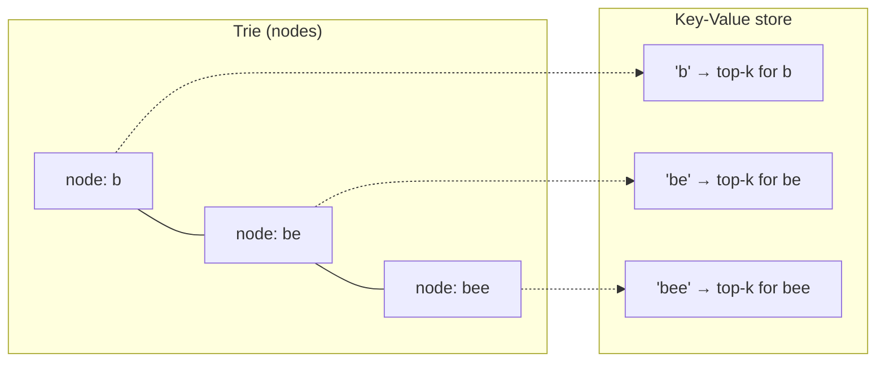

### 5. Query service (the read path)

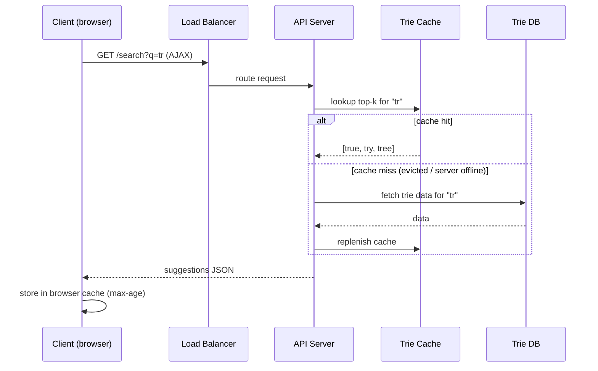

Steps:
1. Query hits the **load balancer**.
2. LB routes to **API servers**.
3. API servers read the trie from **Trie Cache** and build the suggestion list.
4. On **cache miss** (cache OOM or server offline), reload from **Trie DB** and repopulate the cache so subsequent hits are fast.

**Speed optimizations on the query path:**

| Technique | Benefit |
|---|---|
| **AJAX requests** | Fetch suggestions without reloading the page. |
| **Browser caching** | Suggestions change slowly; cache them client‑side. Google uses `cache-control: private, max-age=3600` (private = single user only, valid 1 hour). |
| **Data sampling** | Don't log every query — log **1 in N** to cut processing/storage cost on huge volumes. |

### 6. Trie operations — create / update / delete

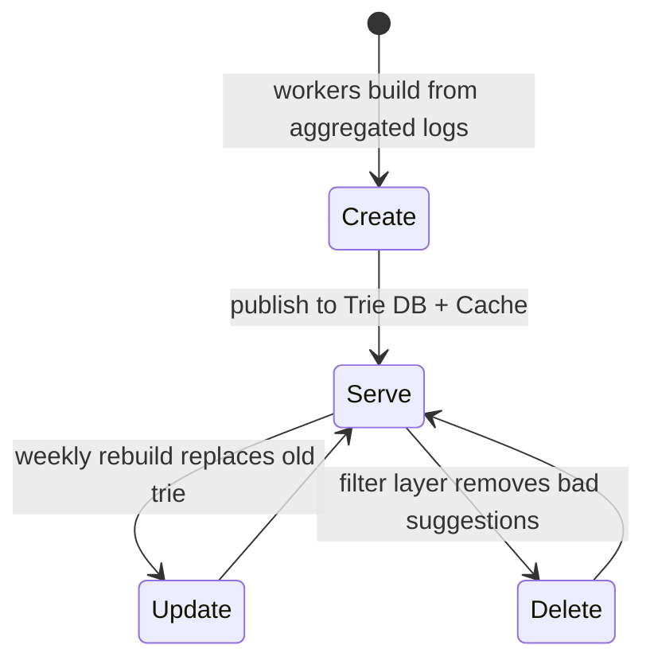

**Create** — Workers build the trie from Analytics Log/DB (aggregated data).

**Update** — two options:
- **Option 1 (preferred): weekly full rebuild.** Build a fresh trie and atomically **replace** the old one.
- **Option 2: update individual nodes in place.** Slow and generally avoided, but acceptable for a *small* trie. Because each node caches its children's top‑k, updating one leaf means updating **all its ancestors up to the root**.

Ancestor propagation example: if `beer`'s frequency changes 10 → 30, then `beer` and every ancestor node on the path (`bee`, `be`, `b`, root) must have their cached top‑k re‑evaluated to reflect the new value.

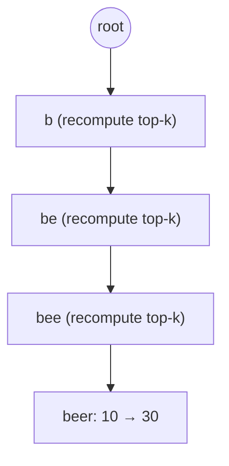

**Delete** — We must remove hateful/violent/explicit/dangerous suggestions. Put a **filter layer** in front of the Trie Cache so results can be filtered by rule at read time; the offending entries are then **physically removed asynchronously** from the DB so the next rebuild uses a clean dataset.

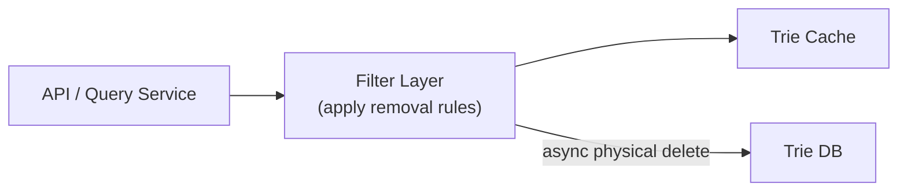

### 7. Scale the storage (sharding the trie)

When the trie outgrows one server, shard it.

- **First‑level sharding by first character.** 2 servers: `a–m` / `n–z`. 3 servers: `a–i` / `j–r` / `s–z`. Up to 26 shards (one per letter).
- **Deeper sharding** for >26 servers: split on the 2nd/3rd character, e.g. queries under `a` → `aa–ag`, `ah–an`, `ao–au`, `av–az`.

**Problem:** letter frequency is skewed — far more words start with `c` than `x`, causing **uneven load/data**. 

**Fix:** a **Shard Map Manager** — a lookup service backed by historical distribution data that decides which shard a prefix belongs to. E.g., if `s` alone gets as many queries as `u,v,w,x,y,z` combined, keep two balanced shards: `{s}` and `{u–z}`.

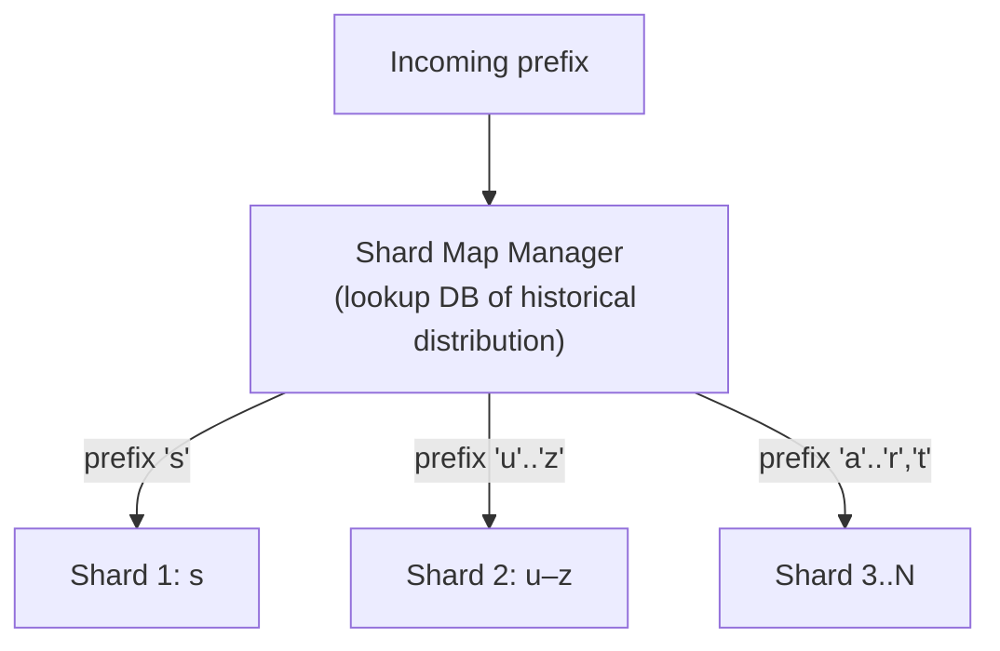

---

## ⚠️ Edge Cases, Bottlenecks & Scaling

| Concern | Handling |
|---|---|
| **Latency budget (<100 ms)** | Precompute top‑k per node (O(1) reads), cap prefix length, serve from in‑memory Trie Cache + browser cache. |
| **Write amplification** | Never update trie per keystroke; aggregate offline and rebuild weekly. |
| **Cache miss / cache server down** | Query service falls back to Trie DB and **replenishes** the cache; subsequent requests hit cache. |
| **Hot shards (uneven letters)** | Shard Map Manager based on historical distribution instead of naïve first‑letter splits. |
| **Storage growth** | ~0.4 GB new data/day; trie rebuilt weekly, old snapshot replaced. Sampling reduces log volume. |
| **Bad/abusive suggestions** | Filter layer at read time + async physical deletion before next rebuild. |
| **Freshness vs. cost** | Choose aggregation interval by use case: minutes (Twitter‑like) vs. weekly (Google‑keyword‑like). |
| **Update in place is slow** | Requires ancestor propagation to root; only acceptable for small tries. |
| **High availability** | Distributed Trie Cache + persistent Trie DB; LB spreads across API servers; snapshots enable rebuilds. |

### Follow‑up questions (from the chapter's wrap‑up)

- **Multi‑language support?** Store **Unicode** characters in trie nodes instead of 26 ASCII letters ("an encoding standard covering all writing systems"). Note the fan‑out per node explodes beyond 26.
- **Different top queries per country?** Build **separate tries per country/region**; push them to **CDNs** to cut latency.
- **Real‑time / trending queries?** The weekly‑rebuild design *can't* surface a query that suddenly spikes on a breaking‑news event (workers aren't scheduled yet and full rebuilds are slow). Ideas (full solution is out of scope): (1) **shard** to shrink the working set; (2) change the **ranking model** to weight *recent* queries more; (3) treat data as **streams** and use stream processors — Hadoop MapReduce, Spark Streaming, Storm, Kafka.

---

## 🔑 Key Takeaways & Interview Tips

- **Lead with clarifying questions**: prefix‑only match, k=5, popularity ranking, no spellcheck, English/lowercase, 10M DAU. These pin the scope.
- **State the workload shape**: read‑heavy + latency‑critical (<100 ms), ~24K QPS, ~48K peak. That motivates precomputation + caching.
- **The star of the answer is the trie** — but say explicitly that basic trie is a *data‑structure* question; spend your time on the **two optimizations**: cap prefix length and **cache top‑k at every node** to reach **O(1)** reads. Name the space/time trade‑off out loud.
- **Separate write and read paths**: offline data‑gathering pipeline (logs → aggregators → workers → Trie DB/Cache) vs. online query service. Don't update the trie on every keystroke.
- **Rebuild weekly, replace atomically**; avoid in‑place node updates (ancestor propagation to root).
- **Caching layers**: distributed Trie Cache (in‑memory) + browser cache (`cache-control: private, max-age=3600`) + data sampling for logs.
- **Sharding**: naïve first‑letter split is skewed; introduce a **Shard Map Manager** driven by historical distribution.
- **Deletion/safety**: filter layer + async physical delete.
- **Have crisp follow‑up answers ready**: Unicode for multi‑language, per‑country tries on CDNs, streaming for trending.

---

## 🛠️ Open-Source Implementations (GitHub)

| Project | GitHub | How it relates | Approx stars |
|---|---|---|---|
| Elasticsearch (Completion Suggester) | https://github.com/elastic/elasticsearch | Production **completion suggester** built on Lucene **FST**; "early‑terminates" collecting suggestions in weight order — a real‑world trie/FST‑backed typeahead. | ~70k |
| RediSearch | https://github.com/RediSearch/RediSearch | Redis module with a built‑in **auto‑complete/suggestion** API (with fuzzy prefix suggestions) — mirrors the in‑memory Trie Cache idea. | ~5k |
| pytries/marisa-trie | https://github.com/pytries/marisa-trie | Memory‑efficient static **MARISA trie** for Python; 50–100× smaller than a dict with fast prefix search — the compact‑trie storage angle. | ~1k |
| seperman/fast-autocomplete | https://github.com/seperman/fast-autocomplete | Pure‑Python trie‑based autocomplete positioned as faster/more flexible than ES suggestions — direct analogue of the query service. | ~1k |
| RedisLabs/redis-completion | https://github.com/RedisLabs/redis-completion | Stores many phrases in Redis and quickly searches them for prefix matches — the "prefix search in a cache" pattern. | <1k |
| twofatmonkeys / digitalfortress-tech typeahead-standalone | https://github.com/digitalfortress-tech/typeahead-standalone | Zero‑dependency browser autocomplete library — the client/AJAX + browser‑cache side of the design. | ~500 |
| subpath/weighted_trie | https://github.com/subpath/weighted_trie | Rust crate for **weighted prefix trees** for autocomplete — exactly the frequency‑annotated trie from this chapter. | <1k |

*(Star counts are approximate at time of writing; treat as ballpark.)*

---

## 🔗 References & Further Reading

- [1] The Life of a Typeahead Query (Facebook Engineering) — https://www.facebook.com/notes/facebook-engineering/the-life-of-a-typeahead-query/389105248919/
- [2] How We Built Prefixy: A Scalable Prefix Search Service for Powering Autocomplete — https://medium.com/@prefixyteam/how-we-built-prefixy-a-scalable-prefix-search-service-for-powering-autocomplete-c20f98e2eff1
- [3] Prefix Hash Tree: An Indexing Data Structure over Distributed Hash Tables (UC Berkeley) — https://people.eecs.berkeley.edu/~sylvia/papers/pht.pdf
- [4] MongoDB (Wikipedia) — https://en.wikipedia.org/wiki/MongoDB
- [5] Unicode FAQ (basic questions) — https://www.unicode.org/faq/basic_q.html
- [6] Apache Hadoop — https://hadoop.apache.org/
- [7] Spark Streaming — https://spark.apache.org/streaming/
- [8] Apache Storm — https://storm.apache.org/
- [9] Apache Kafka — https://kafka.apache.org/documentation/
- Elastic blog, "You Complete Me" (completion suggester) — https://www.elastic.co/blog/you-complete-me/

---

## ❓ Mock Interview / Self-Check Questions

**Q1. Why is a trie preferred over a relational `LIKE 'prefix%'` query at scale?**
A `LIKE 'prefix%' ORDER BY frequency DESC LIMIT 5` requires a range scan plus sort per keystroke; at ~48K peak QPS the DB becomes the bottleneck. A trie navigates directly to the prefix node, and with cached top‑k it returns results in O(1) with no scan or sort.

**Q2. Walk through the top‑k algorithm on a basic trie and give its complexity.**
(1) Walk to the prefix node — O(p). (2) DFS the subtree to collect all valid queries — O(c). (3) Sort by frequency and take top‑k — O(c log c). Total O(p + c + c log c). Worst case c is huge for short/common prefixes, so it's too slow unoptimized.

**Q3. What two optimizations get reads to O(1), and what's the cost?**
(1) **Cap the max prefix length** (e.g., 50) → find‑prefix becomes O(1). (2) **Cache the precomputed top‑k at every node** → returning results is O(1) (no traversal/sort). Cost: extra memory to store k entries at every node — a deliberate space‑for‑time trade.

**Q4. Why not update the trie on every search?**
Billions of writes/day would starve the latency‑critical read path, and top suggestions change slowly, so per‑query updates are wasteful. Instead, aggregate queries offline from logs and rebuild the trie on a schedule (weekly), replacing it atomically.

**Q5. Describe the data‑gathering pipeline.**
Analytics Logs (append‑only raw queries, with sampling) → Aggregators (roll up into per‑period frequencies) → Aggregated Data (`query, week, frequency`) → Workers (build the trie asynchronously) → write to Trie DB (persistent) and Trie Cache (in‑memory). Aggregation interval is tuned to freshness needs.

**Q6. How do you store the trie persistently?**
Two options: a **document store** (serialize the whole weekly snapshot, e.g., MongoDB) or a **key‑value store** (map each prefix → key and each node's data → value). KV integrates with a distributed store (Ch 6); document store is simplest for wholesale weekly rebuilds.

**Q7. What happens on a cache miss in the query path?**
A miss (cache OOM or server offline) causes the API server to fetch the data from Trie DB and repopulate the Trie Cache, so subsequent requests for that prefix are served from cache. Combined with an LB across API servers this keeps the system highly available.

**Q8. How do you remove abusive/unwanted suggestions?**
Add a **filter layer** in front of the Trie Cache that removes results per rule at read time (flexible, immediate), and **asynchronously delete** the offending entries from the DB so the next scheduled rebuild produces a clean trie.

**Q9. How do you shard the trie, and how do you avoid hot spots?**
Start with first‑character sharding (up to 26 shards), going deeper (2nd/3rd char) for more servers. Since letter frequencies are skewed (`c` ≫ `x`), use a **Shard Map Manager** backed by historical distribution to group prefixes into balanced shards (e.g., `{s}` vs `{u–z}`).

**Q10. How would you support multi‑language, per‑country results, and trending queries?**
Multi‑language: store **Unicode** in nodes (larger fan‑out). Per‑country: build **separate tries per region** and serve from **CDNs**. Trending/real‑time: shard to shrink the working set, weight recent queries more heavily in ranking, and process query **streams** with Kafka/Spark Streaming/Storm rather than weekly batch rebuilds.
