# Alex Xu — Ch 14: Design YouTube

> Video upload, DAG-based transcoding, CDN delivery, adaptive streaming, and cost optimization at planet scale. | Maps to: [CDN notes](../../system-design/01-easy/cdn.md)

<!-- tag: axu_ch14 -->

These notes are self-contained: read them and you can reason about a YouTube/Netflix/Hulu-style design from first principles without the book. Figures from the book are redrawn as original Mermaid diagrams. All numbers are the book's (2020) unless flagged as my estimate.

---

## 🎯 The Problem

> "Design YouTube." — the same skeleton answers "design Netflix / Hulu / a video-sharing platform."

YouTube *looks* trivial — creators upload, viewers press play — but underneath sits a huge distributed system: blob storage for petabytes of raw + transcoded video, a compute-heavy transcoding pipeline, a global CDN, adaptive bitrate streaming, and a metadata plane. Some 2020-era scale facts that motivate the design:

- ~2 billion monthly active users; ~5 billion videos watched per day.
- Responsible for ~37% of all mobile internet traffic.
- Available in 80 languages; ~50 million creators.

The interview task is **not** to build blob storage or a CDN from scratch — it is to *compose* existing cloud building blocks (blob storage, CDN, queues) into an upload flow and a streaming flow, then optimize for **speed, safety, and cost**.

**Scope we commit to (after clarifying):**
- Upload a video *fast*.
- Stream a video *smoothly*.
- Change video quality (adaptive bitrate).
- Low infrastructure cost.
- High availability, scalability, reliability.
- Clients: mobile apps, web browser, smart TV.

Out of scope: comments, likes, subscriptions, playlists, recommendations, live streaming (touched briefly in wrap-up).

---

## 📋 Requirements

### Clarifying questions to ask first

| Question | Book's answer | Why it matters |
|---|---|---|
| Which features matter most? | Upload + watch | Narrows scope to two flows |
| Which clients? | Mobile, web, smart TV | Drives transcoding formats & protocols |
| Daily active users? | 5 million DAU | Sizing input |
| Avg time on product/day? | 30 minutes | Engagement / bandwidth |
| International users? | Yes, large % | Multi-region upload + CDN |
| Supported resolutions/formats? | Most formats | Need a flexible transcoding pipeline |
| Encryption required? | Yes | DRM / AES in design |
| Max video size? | 1 GB (small/medium focus) | Chunking & storage sizing |
| Can we use AWS/GCP/Azure? | Yes — leverage cloud | Use blob storage + managed CDN |

### Functional requirements

| # | Requirement |
|---|---|
| F1 | Users can upload videos of most formats/resolutions (≤ 1 GB) |
| F2 | Users can stream (not download) videos smoothly on mobile/web/TV |
| F3 | Adaptive video quality — auto/manual switch based on bandwidth |
| F4 | Videos transcoded into multiple formats/bitrates/resolutions |
| F5 | Metadata (title, size, resolution, format, owner, URL) stored & queryable |
| F6 | Copyright protection (DRM/encryption/watermark) |

### Non-functional requirements

| Attribute | Target / Note |
|---|---|
| High availability | Prefer availability; graceful degradation over hard failure |
| Scalability | Handle 5M DAU and grow horizontally |
| Reliability | No lost uploads; resumable; fault-tolerant transcoding |
| Low latency | Stream starts immediately from nearest CDN edge |
| Low cost | CDN egress dominates cost — must be optimized |
| Security | Pre-signed upload URLs, encrypted playback |

---

## 🧮 Back-of-the-Envelope Estimation

All assumptions should be spoken aloud to the interviewer. The book's numbers:

**Assumptions**
- DAU = 5,000,000
- Each user watches 5 videos/day
- 10% of users upload 1 video/day
- Average video size = 300 MB
- CDN egress price ≈ **$0.02 / GB** (AWS CloudFront, US, 2020)

**Daily upload storage**
```
uploaders/day      = 5,000,000 * 10%      = 500,000 videos
new storage/day    = 500,000 * 300 MB     = 150,000,000 MB
                   = 150 TB / day
```
> Note: 150 TB/day is *raw upload only*. Transcoding creates several encoded copies (240p…4K + audio), so real storage is a multiple of this. That is exactly why cost-saving optimizations matter.

**CDN egress cost (streaming only)**
```
video views/day    = 5,000,000 users * 5  = 25,000,000 views/day
bytes served/day   = 25,000,000 * 0.3 GB  = 7,500,000 GB
cost/day           = 7,500,000 GB * $0.02 = $150,000 / day
                   ≈ $54.75 million / year
```
The headline takeaway: **serving video from the CDN is the dominant cost**, so a large part of the deep dive is about *not* serving everything from the CDN.

**My supplementary estimates (not in book, flagged)**
- Peak upload QPS ≈ 500,000 / 86,400 ≈ **6 uploads/sec** average; with 5–10× peak factor ≈ **30–60/sec**.
- Streaming request QPS ≈ 25M / 86,400 ≈ **~290 stream-starts/sec** average, more at peak — but each start triggers many chunk GETs against the CDN, not the origin.

---

## 🏗️ High-Level Design

At the top level there are just three actors: **Client**, **CDN**, **API servers**.

- **Client** — web / mobile / smart TV; watches and uploads.
- **CDN** — stores/caches transcoded videos; serves the actual video bytes on play (edge closest to viewer → low latency).
- **API servers** — *everything except the video bytes*: generate upload URLs, write metadata, feed/recommendation, signup, etc.

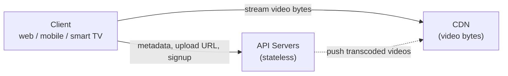

### Upload flow (two parallel processes)

Uploading is split into **(a) upload the actual video bytes** and **(b) update metadata** — they run in parallel.

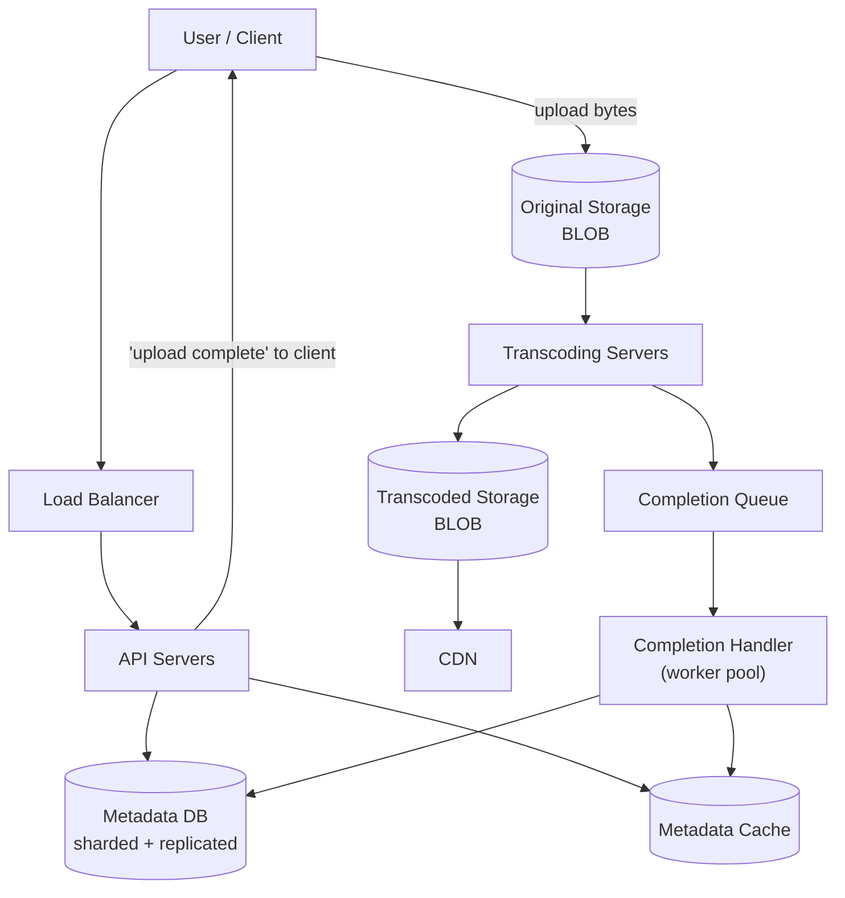

**Flow (a) — actual video, step by step**
1. Raw video lands in **Original Storage** (blob).
2. **Transcoding servers** pull the raw video and start encoding.
3. On completion, two things happen in parallel:
   - 3a. Transcoded outputs → **Transcoded Storage** → then distributed to **CDN**.
   - 3b. A completion event → **Completion Queue**; **Completion Handler** workers pull it and update **Metadata DB + Cache**.
4. API servers tell the client the video is ready to stream.

**Flow (b) — metadata** runs concurrently: while bytes upload, the client also calls API servers with file name/size/format, which update the metadata cache + DB.

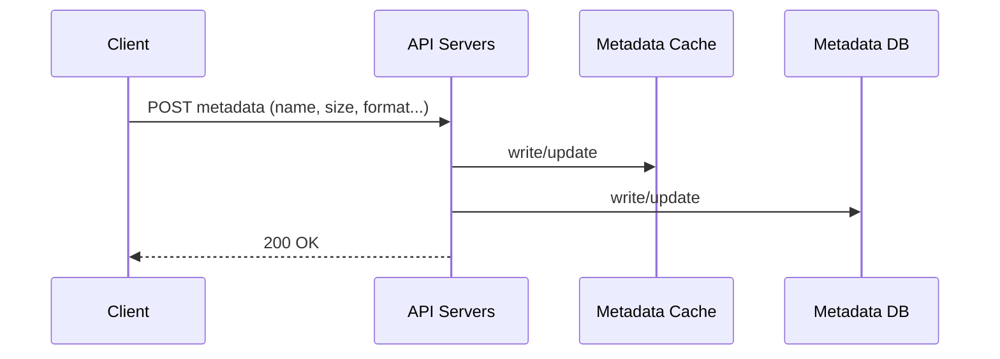

### Streaming flow

Streaming ≠ downloading. Download = copy the whole file first. **Stream** = client continuously pulls small pieces and plays immediately. Video bytes come **directly from the nearest CDN edge**, giving low latency.

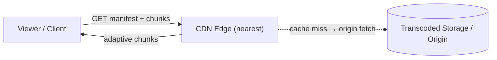

**Streaming protocols** (choose one; they define supported encodings + player behavior):

| Protocol | Owner | Notes |
|---|---|---|
| MPEG-DASH | MPEG | "Dynamic Adaptive Streaming over HTTP"; codec-agnostic |
| HLS | Apple | "HTTP Live Streaming"; ubiquitous on iOS/Safari |
| Smooth Streaming | Microsoft | Older Silverlight-era |
| HDS | Adobe | "HTTP Dynamic Streaming"; legacy |

You don't need to memorize them — the point in an interview is: *pick a protocol appropriate to your clients; all are adaptive-bitrate over HTTP so they ride the CDN well.*

### API design (illustrative)

| Endpoint | Method | Purpose |
|---|---|---|
| `/api/v1/videos/upload-url` | `POST` | Get a pre-signed URL for direct blob upload |
| `PUT {presigned_url}` | `PUT` | Client uploads bytes directly to blob storage |
| `/api/v1/videos` | `POST` | Create/update metadata (title, size, format...) |
| `/api/v1/videos/{id}` | `GET` | Fetch metadata + manifest URL |
| `/api/v1/videos/{id}/manifest` | `GET` | Served from CDN; DASH/HLS manifest |
| `/api/v1/videos/{id}` | `DELETE` | Takedown / delete |

### Data model (metadata)

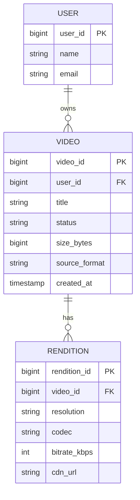

---

## 🔬 Deep Dive

### Why transcode at all?

The camera writes one format at one bitrate. To play everywhere and stream smoothly we must re-encode ("transcode"):

- **Storage** — raw HD video is huge (an hour of 60 fps HD can be hundreds of GB). Codecs shrink it.
- **Compatibility** — devices/browsers support only certain formats.
- **Adaptive quality** — deliver high resolution to fast connections, low to slow ones.
- **Changing conditions** — mobile networks fluctuate; the player must switch bitrate on the fly for continuous playback.

**Encoding anatomy**
- **Container** — the "basket" holding video + audio + metadata; identified by extension: `.mp4`, `.mov`, `.avi`.
- **Codec** — the compression algorithm: **H.264**, **VP9**, **HEVC** (H.265).

### DAG transcoding model

Different creators need different processing (watermark, self-supplied thumbnail, HD vs not). Hard-coding one pipeline is inflexible. Instead, model the pipeline as a **Directed Acyclic Graph (DAG)** — inspired by Facebook's SVE (Streaming Video Engine). Client programmers *declare* tasks in stages; stages run sequentially or in parallel.

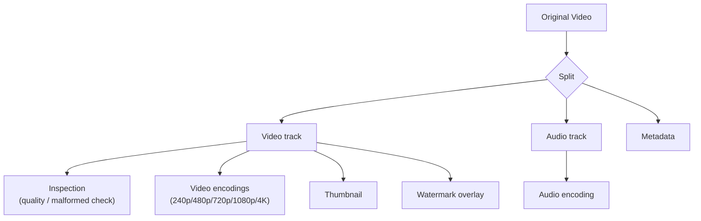

**Task types on a video file**
- **Inspection** — reject malformed / low-quality input.
- **Video encodings** — many resolutions/codecs/bitrates (e.g. `funny_720p.mp4`).
- **Thumbnail** — user-supplied or auto-generated.
- **Watermark** — identifying image overlay.

### Video transcoding architecture

Six components: **preprocessor → DAG scheduler → resource manager → task workers → temporary storage → encoded output.**

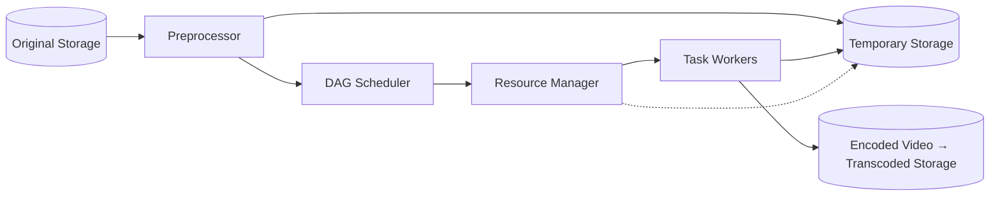

**Preprocessor — 4 jobs**
1. **Video splitting** into GOP (Group of Pictures) chunks — a GOP is a short, independently-playable run of frames (a few seconds).
2. **GOP alignment for old clients** — some old devices/browsers can't split, so the preprocessor does it.
3. **DAG generation** — reads the client's config files and builds the DAG (e.g. a simple 2-node/1-edge graph: download → encode).
4. **Caching** — stores GOPs + metadata in temporary storage for reliability; on failure the system retries from persisted data.

**DAG scheduler** — splits the DAG into stages of tasks and enqueues them in the resource manager.

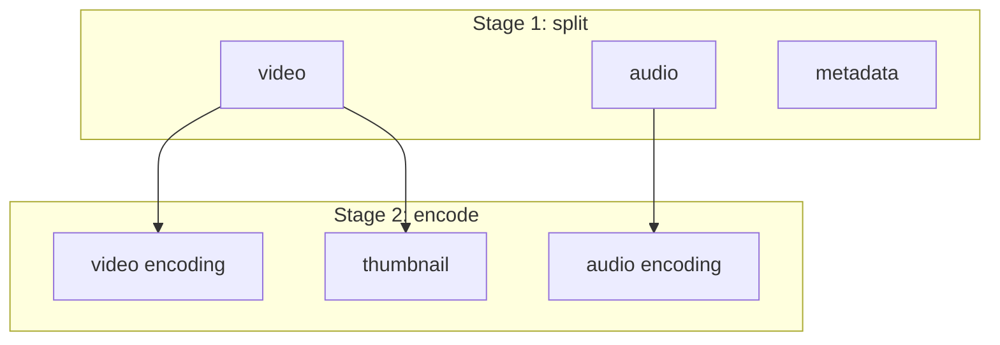

**Resource manager** — maximizes resource efficiency with 3 queues + a scheduler:

| Queue | Contents |
|---|---|
| Task queue | Priority queue of tasks to run |
| Worker queue | Priority queue of worker utilization info |
| Running queue | Currently-running tasks + their workers |

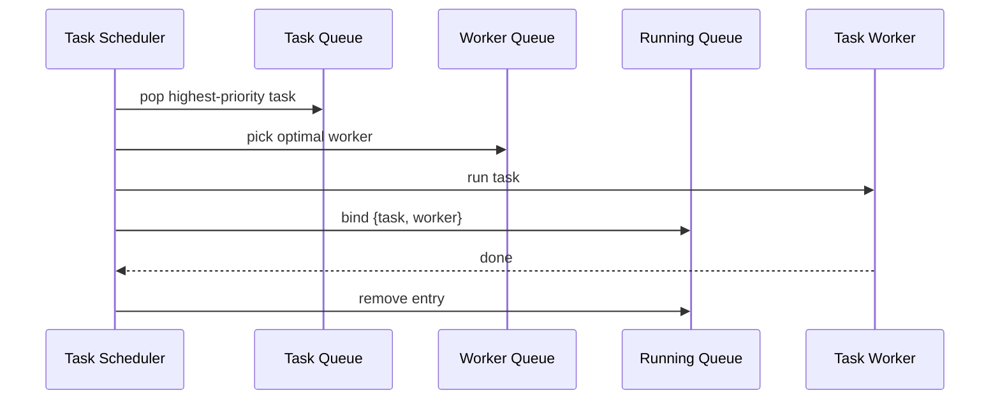

**Task workers** — execute the concrete DAG tasks (encode, watermark, thumbnail…). Different workers run different task types.

**Temporary storage** — polyglot: metadata is small + hot → in-memory cache; video/audio → blob storage. Everything is freed once processing completes.

**Encoded video** — the pipeline's output, e.g. `funny_720p.mp4`, pushed to transcoded storage → CDN.

### Key design decisions & alternatives

| Decision | Chosen approach | Alternative | Why chosen |
|---|---|---|---|
| Build vs buy storage/CDN | Use cloud blob + managed CDN | Build own | Time-boxed; even Netflix/FB buy (Netflix→AWS, FB→Akamai) |
| Pipeline model | DAG (declarative stages) | Fixed hardcoded pipeline | Flexibility + parallelism per creator |
| Coupling | Message queues between stages | Direct synchronous calls | Loose coupling, independent scaling, parallelism |
| Upload unit | GOP chunks | Whole-file upload | Resumable, parallel, faster |
| Upload location | CDN as regional upload centers | Single origin | Lower upload latency for international users |
| Delivery | Popular→CDN, cold→origin servers | All→CDN | Cost — long-tail viewing distribution |

### Speed optimizations

**1. Parallelize upload via GOP chunking.** Split the file into GOP-aligned chunks (ideally client-side). Enables *resumable* uploads (retry only the failed chunk) and parallel transfer.

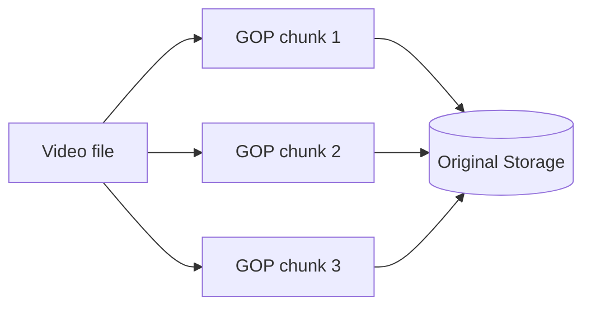

**2. Upload centers close to users.** Multiple upload centers worldwide (US uploads → North America center, China → Asia center). Use CDN PoPs as upload ingress.

**3. Parallelism everywhere via message queues.** The naive chain "download → encode → …" forces each step to wait for the previous. Insert a queue so the encoding module isn't blocked on the download module — consumers pull events and work in parallel.

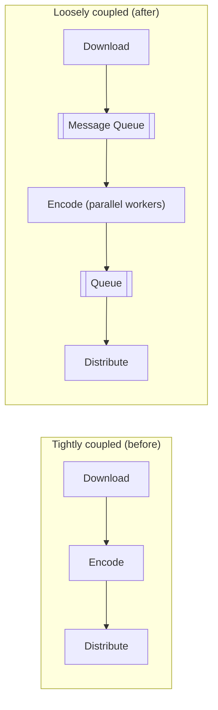

### Safety optimizations

**Pre-signed upload URLs** — client asks API for a pre-signed URL (S3 term; Azure calls it *Shared Access Signature*), which grants scoped write access to a specific object. Client then uploads bytes *directly* to blob storage with that URL — API servers never touch the bytes.

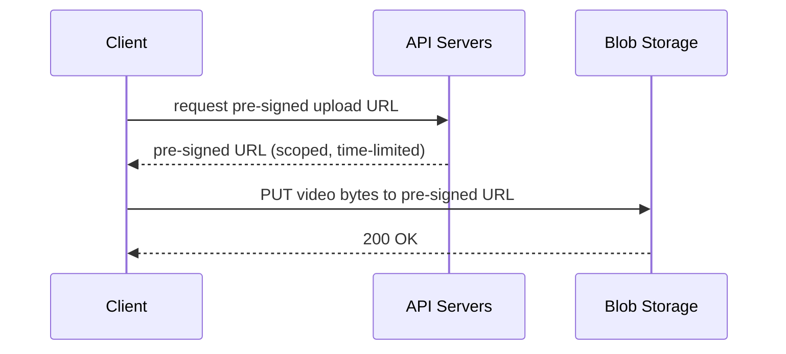

**Protect copyrighted videos** — three options:
- **DRM** — Apple FairPlay, Google Widevine, Microsoft PlayReady.
- **AES encryption** — encrypt the video; decrypt on playback for authorized users only.
- **Visual watermarking** — logo/company-name overlay identifying ownership.

### Cost-saving optimization (the big one)

YouTube viewing follows a **long-tail distribution**: a few videos are watched constantly; most get few/zero views. Exploit it:

1. **Serve only popular videos from the CDN**; serve cold/long-tail videos from your own high-capacity origin video servers.
2. **Fewer renditions for unpopular content** — don't pre-encode every resolution; short videos can be **encoded on-demand**.
3. **Region-aware distribution** — a video popular only in one region need not be pushed to all regions.
4. **Build your own CDN + partner with ISPs** (Comcast, AT&T, Verizon) — like Netflix Open Connect. Huge project, only worthwhile at massive scale, but cuts bandwidth charges and improves QoE.

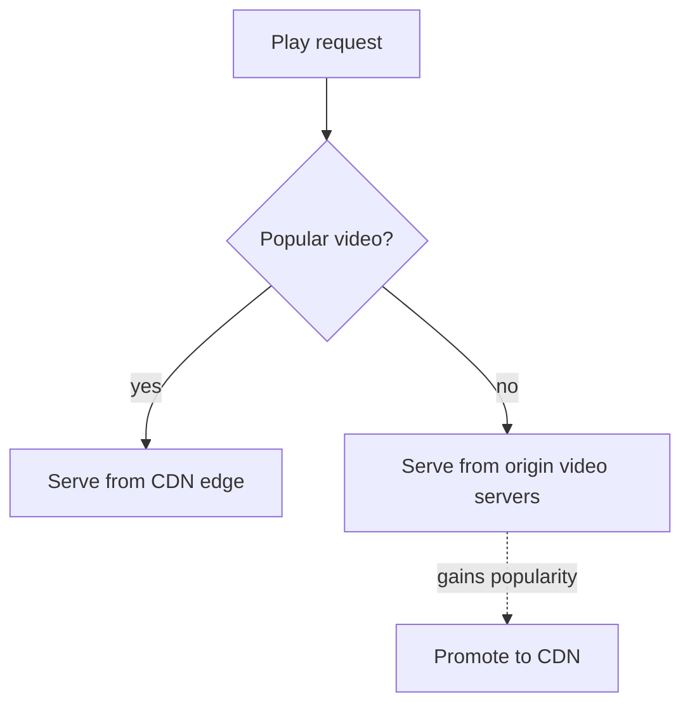

> Base every optimization on **measured** viewing patterns/popularity/size — analyze history first.

---

## ⚠️ Edge Cases, Bottlenecks & Scaling

### Error taxonomy

- **Recoverable** (e.g. a video segment fails to transcode): retry a few times; if still failing and deemed unrecoverable, return an error code to the client.
- **Non-recoverable** (e.g. malformed video): stop all tasks for that video, return an error code.

### Per-component failure playbook

| Component | Failure | Handling |
|---|---|---|
| Upload | Upload error | Retry a few times |
| Split video | Old client can't GOP-split | Send whole file; server does the splitting |
| Transcoding | Task fails | Retry |
| Preprocessor | Error | Regenerate the DAG |
| DAG scheduler | Error | Reschedule the task |
| Resource manager | Queue down | Fail over to a replica |
| Task worker | Worker down | Retry task on a new worker |
| API server | Server down | Stateless → route to another server |
| Metadata cache | Node down | Replicated → read other nodes; spin up replacement |
| Metadata DB master | Master down | Promote a slave to master |
| Metadata DB slave | Slave down | Read from another slave; spin up replacement |

### Bottlenecks & hot spots

- **CDN egress cost** — the #1 economic bottleneck; mitigated by long-tail-aware serving, on-demand encoding, regional distribution, own-CDN/ISP peering.
- **Transcoding compute** — CPU/GPU-heavy; mitigated by DAG parallelism, chunk-level (GOP) parallelism, autoscaling worker pools, priority queues.
- **Hot videos** — a viral video is a read hot spot; the CDN naturally absorbs this via edge caching + replication across PoPs.
- **Metadata DB** — scale with **sharding** (by video_id/user_id) + **replication** (read replicas).
- **Upload latency for international users** — regional upload centers.

### Scaling levers

- **API tier** — stateless ⇒ scale horizontally behind a load balancer.
- **Database** — replication (read scale + HA) and sharding (write scale).
- **Storage** — cloud blob storage scales elastically; tier hot vs cold.
- **Delivery** — multi-CDN / own CDN + ISP peering.

### Trade-offs raised

- **All-CDN (simple, low latency, expensive)** vs **hot-in-CDN/cold-in-origin (cheaper, slower cold starts).**
- **Pre-encode all renditions (fast playback, storage cost)** vs **on-demand encode (cheap storage, first-view latency).**
- **Managed CDN (fast to build)** vs **own CDN + ISP (cheaper at scale, massive build effort).**

### Wrap-up extras (mention if time remains)
- **Scale API tier** (stateless, horizontal).
- **Scale DB** (replication + sharding).
- **Live streaming** — same skeleton (upload→encode→stream) but higher latency sensitivity, lower parallelism need (already real-time chunks), and error handling must be fast (no slow retries).
- **Video takedowns** — remove content that violates copyright/law; detect at upload and via user flagging.

---

## 🔑 Key Takeaways & Interview Tips

- **Don't build blob storage or a CDN from scratch** — say you'll use cloud services. Composition > reinvention in a 45-min interview.
- **Two flows drive the whole answer:** upload (bytes + metadata in parallel) and stream (bytes from nearest CDN edge).
- **Lead with the cost estimate** — computing ~$150k/day of CDN egress signals seniority and sets up the cost-optimization deep dive.
- **Name the DAG transcoding model** and cite Facebook's SVE; explain preprocessor → scheduler → resource manager → workers.
- **GOP chunking** is the unifying trick for fast resumable uploads *and* transcoding parallelism.
- **Message queues** decouple pipeline stages → parallelism + fault isolation.
- **Pre-signed URLs** keep bytes off your API servers (safety + scale).
- **Long-tail distribution** is the justification for every cost optimization — always tie optimizations to measured access patterns.
- Have a crisp **error playbook** per component; stateless API + replicated/sharded DB give HA.
- Streaming ≠ downloading; know at least **HLS** and **MPEG-DASH** and that they're adaptive-bitrate over HTTP.

---

## 🛠️ Open-Source Implementations (GitHub)

| Project | GitHub | How it relates | Approx stars |
|---|---|---|---|
| FFmpeg | https://github.com/FFmpeg/FFmpeg | The de-facto transcoding engine — decode/encode/mux/transcode; what task workers would run | ~48k |
| Shaka Player | https://github.com/shaka-project/shaka-player | Browser adaptive-media player: DASH + HLS via MSE/EME, DRM support | ~7k |
| hls.js | https://github.com/video-dev/hls.js | JS library to play Apple HLS in browsers via MSE — the streaming client side | ~15k |
| dash.js | https://github.com/Dash-Industry-Forum/dash.js | Reference MPEG-DASH player from the DASH Industry Forum | ~5k |
| Bento4 | https://github.com/axiomatic-systems/Bento4 | MP4/DASH/HLS/CMAF packaging + fragmentation + encryption (mp4dash, mp4fragment) | ~1.7k |
| PeerTube | https://github.com/Chocobozzz/PeerTube | Full federated video platform: upload, transcode (FFmpeg), HLS streaming, P2P delivery | ~13k |
| Jellyfin | https://github.com/jellyfin/jellyfin | Self-hosted media server: on-the-fly transcoding + adaptive streaming to many clients | ~37k |
| CloudTranscode | https://github.com/bfansports/CloudTranscode | Distributed FFmpeg transcoding orchestrated on AWS Step Functions — mirrors the DAG/worker model | ~330 |

> Star counts are approximate as of writing; check the repos for current values.

---

## 🔗 References & Further Reading

- YouTube statistics (Omnicore): https://www.omnicoreagency.com/youtube-statistics/
- YouTube demographics (HubSpot): https://blog.hubspot.com/marketing/youtube-demographics
- AWS CloudFront pricing: https://aws.amazon.com/cloudfront/pricing/
- Netflix on AWS (case study): https://aws.amazon.com/solutions/case-studies/netflix/
- Akamai: https://www.akamai.com/
- Binary Large Object (Wikipedia): https://en.wikipedia.org/wiki/Binary_large_object
- Streaming protocols explained (Dacast): https://www.dacast.com/blog/streaming-protocols/
- **SVE: Distributed Video Processing at Facebook Scale (SOSP '17)**: https://www.cs.princeton.edu/~wlloyd/papers/sve-sosp17.pdf
- Azure Shared Access Signature (SAS): https://docs.microsoft.com/en-us/rest/api/storageservices/delegate-access-with-shared-access-signature
- YouTube short-video measurement study (arXiv): https://arxiv.org/pdf/0707.3670.pdf
- Netflix — Content Popularity for Open Connect: https://netflixtechblog.com/content-popularity-for-open-connect-b86d56f613b
- Local cross-reference: [CDN notes](../../system-design/01-easy/cdn.md)

---

## ❓ Mock Interview / Self-Check Questions

**Q1. Why not build your own blob storage and CDN?**
Time and cost. In a 45–60 min interview, composing proven cloud primitives (blob storage + managed CDN + queues) demonstrates the right judgment. Even Netflix uses AWS and Facebook uses Akamai; building scalable storage/CDN is a multi-year effort with little interview value. You'd only build your own CDN at extreme scale (Netflix Open Connect) for cost/QoE.

**Q2. Walk through the upload flow.**
Two parallel processes. (a) Bytes: client gets a pre-signed URL and PUTs GOP chunks directly to *original storage*; transcoding servers pull it, run the DAG pipeline, write outputs to *transcoded storage* → CDN, and emit a completion event to a queue; completion-handler workers update metadata DB + cache. (b) Metadata: in parallel the client posts title/size/format to API servers, which update cache + DB. Finally the API tells the client it's ready.

**Q3. What is the DAG model and why use it?**
A Directed Acyclic Graph of transcoding tasks declared in stages (split → inspect/encode/thumbnail/watermark → …). It gives per-creator flexibility (some want watermarks, custom thumbnails, HD) and high parallelism (independent tasks run concurrently). Inspired by Facebook's SVE.

**Q4. What is a GOP and why chunk by it?**
A Group of Pictures is a short, independently-playable run of frames (a few seconds). Splitting on GOP boundaries yields self-contained chunks, enabling resumable + parallel uploads and parallel transcoding. Ideally the client does the split; if it can't (old client), the server splits.

**Q5. How do message queues help the pipeline?**
They decouple stages. Without a queue, "encode" waits for "download". With a queue between them, encode workers pull ready events and process in parallel, and a failure in one stage doesn't stall others. This yields loose coupling, independent scaling, and fault isolation.

**Q6. Why are pre-signed URLs used, and how do they work?**
To keep large uploads off (and authorize writes into) blob storage without routing bytes through API servers. The client requests a URL from the API; the API returns a scoped, time-limited pre-signed URL (Azure: SAS); the client PUTs bytes straight to storage. This improves security (scoped access) and scalability (API servers don't proxy bytes).

**Q7. CDN cost is huge (~$150k/day). How do you cut it?**
Exploit the long-tail distribution: serve only popular videos from CDN and cold ones from cheaper origin video servers; store fewer renditions for unpopular videos and encode short/cold videos on-demand; do region-aware distribution (don't push a region-local hit everywhere); at large scale, build your own CDN and peer with ISPs (Open Connect model). Base all of this on measured popularity/access patterns.

**Q8. How does the resource manager schedule transcoding work?**
It maintains a task queue (priority), a worker queue (utilization), and a running queue. The scheduler pops the highest-priority task, picks the optimal worker, dispatches the job, records {task, worker} in the running queue, and removes it on completion — maximizing utilization and honoring priority.

**Q9. What happens when the metadata DB master fails? A slave?**
Master down → promote a slave to master. Slave down → serve reads from another slave and spin up a replacement. The DB is sharded + replicated for scale and HA.

**Q10. How would you extend this to live streaming?**
Reuse upload→encode→stream, but: use a low-latency protocol (higher latency sensitivity), require less parallelism (chunks are already produced in real time), and use fast error handling (no slow multi-retry — anything time-consuming is unacceptable live).
