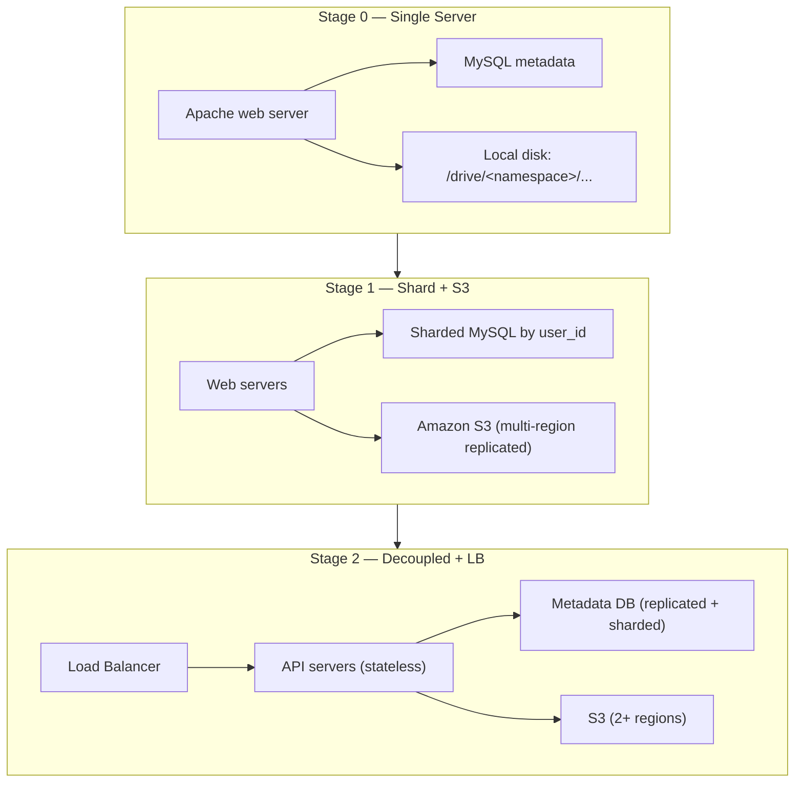
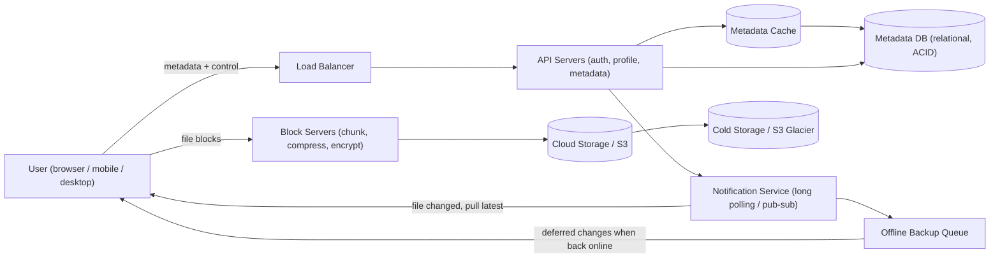
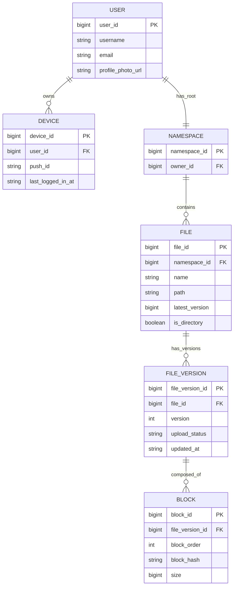
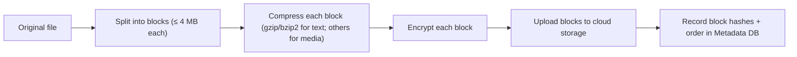
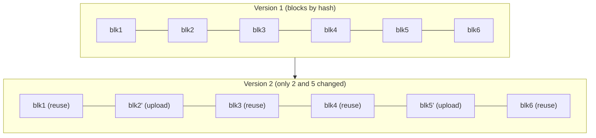
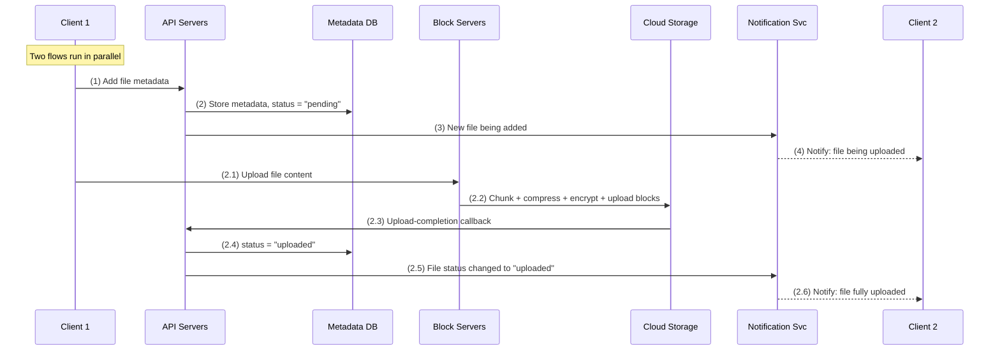
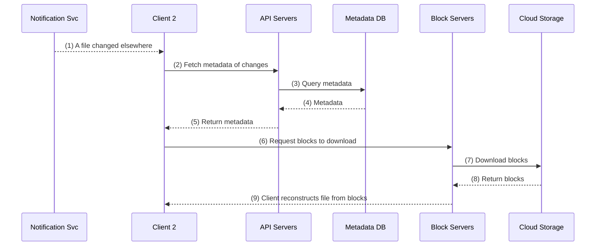
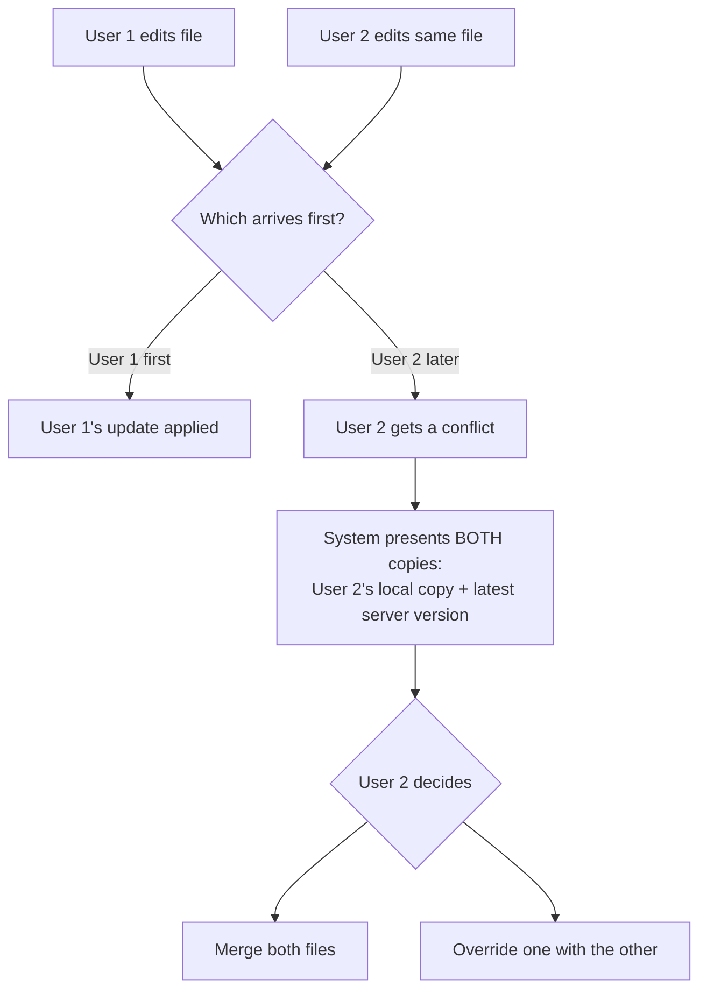
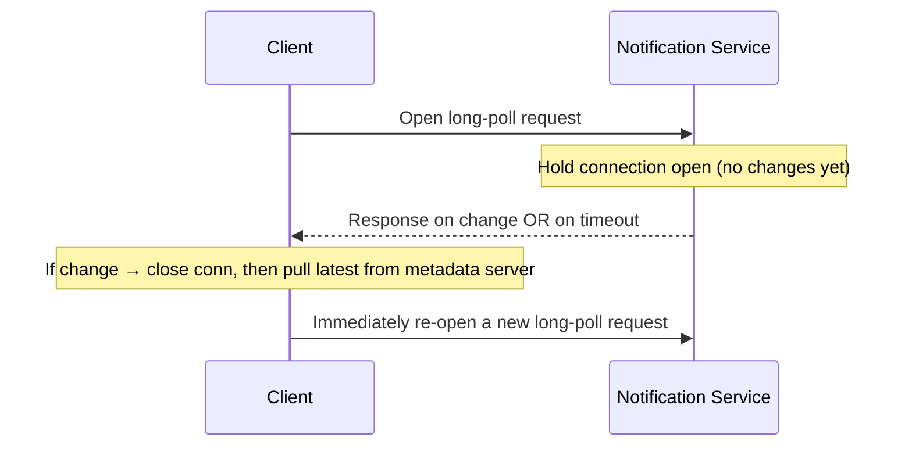
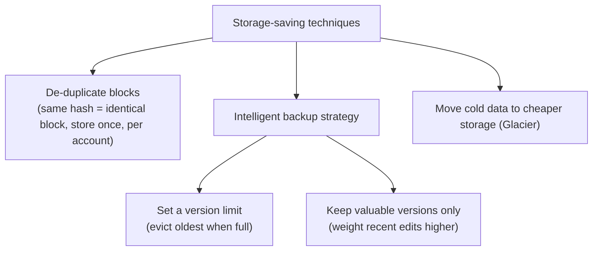

# Alex Xu — Ch 15: Design Google Drive

> Cloud file storage + multi-device sync built on block storage, delta sync, dedup, versioning, and long-polling notifications. | Maps to: Ch1 (scaling from single server), Ch5 (consistent hashing / sharding), Ch6 (KV store consistency), Ch11 (Notification/pub-sub), Ch14 (YouTube blob/CDN patterns).

---

## 🎯 The Problem

Design a **file storage and synchronization service** like Google Drive (or Dropbox, OneDrive, iCloud). Users store documents, photos, videos, and any file type in the cloud and access them from any device (web, desktop, mobile). Changes made on one device automatically propagate to every other device. Files can be shared, and users are notified when files are added, edited, deleted, or shared with them.

The interview framing follows Alex Xu's 4-step process:
1. **Understand the problem & scope** — clarify features, users, constraints.
2. **High-level design** — start with a single server, then evolve it (a deliberate teaching device that revisits sharding, S3, load balancing).
3. **Deep dive** — block servers, metadata DB, upload/download flows, notification service, storage savings, failure handling.
4. **Wrap up** — trade-offs and alternative designs.

The intellectually interesting part is combining **three competing goals**: *strong consistency* (all clients see the same file), *low bandwidth* (don't re-upload whole files), and *fast sync* — while never losing data.

---

## 📋 Requirements

### Clarifying questions to ask the interviewer

| Question | Answer given in the chapter |
|---|---|
| What are the most important features? | Upload/download, file sync, notifications |
| Mobile app, web app, or both? | Both |
| Supported file formats? | Any file type |
| Do files need encryption? | Yes — files at rest must be encrypted |
| Is there a file size limit? | Yes — files ≤ 10 GB |
| How many users? | 10M DAU |

### Functional requirements

| # | Requirement |
|---|---|
| F1 | **Add files** (drag-and-drop upload) |
| F2 | **Download files** |
| F3 | **Sync files across multiple devices** — a change on one device appears on the others automatically |
| F4 | **See file revisions** (version history) |
| F5 | **Share files** with friends, family, coworkers |
| F6 | **Notifications** when a file is edited, deleted, or shared with you |

**Explicitly out of scope:** Google-Docs-style real-time collaborative editing (multiple people editing the same document simultaneously). That is a separate, harder problem (operational transforms / CRDTs).

### Non-functional requirements

| # | Requirement | Why it matters |
|---|---|---|
| N1 | **Reliability** | Data loss is unacceptable for a storage system |
| N2 | **Fast sync speed** | Slow sync frustrates users and drives abandonment |
| N3 | **Low bandwidth usage** | Wasting bandwidth hurts mobile-data users |
| N4 | **Scalability** | Must handle high traffic volumes |
| N5 | **High availability** | System stays usable when some servers are down or slow |

---

## 🧮 Back-of-the-Envelope Estimation

Assumptions from the chapter:

- 50 million signed-up users, **10 million DAU**.
- Each user gets **10 GB** free space.
- Each user uploads **2 files/day**, average file size **500 KB**.
- **1:1 read-to-write ratio**.

**Total storage allocated**
```
50M users × 10 GB = 500 PB (petabytes)
```
(This is *allocated* capacity, not actual usage — most users won't fill their quota.)

**Upload QPS**
```
10M DAU × 2 uploads/day
--------------------------------  = 20M uploads / 86,400 s ≈ 240 QPS
24 h × 3600 s
```

**Peak QPS**
```
Peak ≈ average × 2 = 480 QPS
```

**Ingress bandwidth (uploads, rough add-on estimate — not in book)**
```
240 uploads/s × 500 KB ≈ 120 MB/s ≈ 0.96 Gbps average
Peak ≈ ~1.9 Gbps
```
With a 1:1 read:write ratio, download bandwidth is similar. These are modest per-request numbers; the challenge is **total durable capacity (500 PB)** and **sync latency**, not raw QPS.

> Takeaway for the interview: this system is **storage-bound and consistency-bound, not QPS-bound**. 480 peak QPS is trivial; managing 500 PB durably with fast, low-bandwidth sync is the hard part.

---

## 🏗️ High-Level Design

The chapter deliberately **starts with a single server** and evolves it. That evolution is worth memorizing because it re-derives the standard scaling toolkit.

### Evolution: single server → scaled system



**Single-server layout.** A `drive/` root directory holds one **namespace** per user (their root directory). Files keep their original names; any file is uniquely identified by joining `namespace + relative path`.

**Problems hit and fixes applied:**
- Disk fills up → **shard** file data across storage servers by `user_id`.
- Fear of storage outage / data loss → move files to **Amazon S3** with **same-region + cross-region replication** (buckets = folders; store in ≥2 regions).
- Single points of failure → add a **load balancer**, add **stateless web/API servers**, move the **metadata DB off the box** and give it **replication + sharding**.

### Full high-level architecture



### Component roles

| Component | Responsibility |
|---|---|
| **User client** | Web/mobile/desktop app; talks to API servers (metadata) and block servers (blocks) |
| **Load balancer** | Distributes traffic across API servers; reroutes on failure |
| **API servers** | Everything *except* the upload data path: auth, user profiles, updating file metadata |
| **Block servers** | The upload heavy-lifting: split file into blocks, compress, encrypt, upload to storage |
| **Cloud storage (S3)** | Stores file **blocks** as independent objects |
| **Cold storage (Glacier)** | Inactive data untouched for months/years — much cheaper |
| **Metadata DB** | Metadata of users, files, blocks, versions (NOT file contents) |
| **Metadata cache** | Caches hot metadata for fast reads |
| **Notification service** | Pub/sub — tells clients when a file changed elsewhere so they pull |
| **Offline backup queue** | Holds change info for offline clients; drains when they reconnect |

### API design

All APIs require **user authentication** and run over **HTTPS/SSL**.

**1. Upload a file** — two modes:
- **Simple upload** — small files.
- **Resumable upload** — large files with high risk of network interruption.

```
POST https://api.example.com/files/upload?uploadType=resumable
params:
  uploadType = resumable
  data       = <local file bytes>
```
Resumable upload is a 3-step protocol:
1. Send an initial request to get a **resumable URL**.
2. Upload data and monitor upload state.
3. If interrupted, **resume** from where it stopped.

**2. Download a file**
```
GET https://api.example.com/files/download
{ "path": "/recipes/soup/best_soup.txt" }
```

**3. Get file revisions**
```
GET https://api.example.com/files/list_revisions
{ "path": "/recipes/soup/best_soup.txt", "limit": 20 }
```

### Data model / schema (simplified)



| Table | Purpose | Notes |
|---|---|---|
| `User` | Basic user info | username, email, profile photo |
| `Device` | Devices per user | `push_id` for mobile push; one user → many devices |
| `Namespace` | The user's root directory | |
| `File` | Everything about the **latest** file | |
| `File_version` | Version history | rows are **read-only** to preserve revision integrity |
| `Block` | One block of a file version | reconstruct a file by joining its blocks in order |

---

## 🔬 Deep Dive

### 1. Block servers — split, compress, encrypt, dedup

A file is split into fixed-size **blocks**. Each block gets a **unique hash** (its content fingerprint) recorded in the metadata DB. Each block is stored as an **independent object** in S3. To rebuild a file, join its blocks **in order**. Following Dropbox, the **maximum block size is 4 MB**.

**Upload processing pipeline (new file):**



Two bandwidth optimizations live here:

- **Delta sync** — when a file is modified, **only the changed blocks** are transmitted, not the whole file. Uses an rsync-style diff algorithm.
- **Compression** — compress blocks before upload; algorithm chosen by file type (gzip/bzip2 for text, media-specific codecs for images/video).

**Delta sync example:** a file has blocks `[1,2,3,4,5,6]`. The user edits it, changing only blocks **2** and **5**. Only blocks 2 and 5 are re-uploaded; a new file version references the new hashes for 2 and 5 and reuses the existing hashes for 1,3,4,6.



**Why route uploads through block servers instead of client → S3 directly?**

| Approach | Pros | Cons |
|---|---|---|
| **Client → Block servers → S3** (chosen) | Chunk/compress/encrypt logic lives in **one place**; encryption not exposed to a hackable client | File transferred **twice** (client→BS, BS→S3) — slower |
| **Client → S3 directly** | File transferred **once** → faster upload | Must reimplement chunk/compress/encrypt on **every platform** (iOS/Android/Web) — error-prone; client-side encryption is insecure (clients can be manipulated) |

### 2. Strong consistency

The system requires **strong consistency by default**: a file must never appear differently on two clients at the same moment. But caches default to **eventual consistency**. To get strong consistency across the metadata cache + DB:

- Keep **cache replicas and the master consistent**.
- **Invalidate the cache on every DB write** so cache and DB agree.

Relational databases give **ACID** natively, which makes strong consistency easy. NoSQL stores don't guarantee ACID by default — you'd have to bolt consistency onto your sync logic. **Therefore the design chooses a relational (ACID) metadata database.**

### 3. Upload flow (two parallel requests)

Two requests fire in parallel from client 1: **(a)** add file metadata, and **(b)** upload file content.



Editing a file follows a similar flow. The **"pending" → "uploaded"** status transition is important: metadata is registered first, content lands second, and only then does the file become authoritative.

### 4. Download flow

A download is triggered when a file changed **elsewhere**. The client learns of the change two ways:
- **Online:** the notification service tells it to pull the latest.
- **Offline:** the change is saved (offline backup queue / cache); the client pulls when it reconnects.



### 5. Sync conflict resolution

When two users modify the same file/folder simultaneously, a conflict occurs. Strategy: **first-write-wins** — the version processed first succeeds; the later one gets a **conflict**.



The system does **not** silently overwrite — it surfaces both versions and lets the user merge or override. (True concurrent multi-editor merging, like Google Docs, is out of scope; see Differential Synchronization references.)

### 6. Notification service — long polling vs WebSocket

Any local mutation must be broadcast to other clients to reduce conflicts and keep files consistent.

| Option | Fit for Drive? | Reasoning |
|---|---|---|
| **Long polling** (chosen) | ✅ | Communication is **one-directional** (server → client); notifications are **infrequent, no bursts** |
| **WebSocket** | ❌ (overkill) | Best for **bi-directional real-time** apps (chat); unnecessary complexity here |

Dropbox uses long polling.



**Mechanics:** each client holds an open long-poll connection. On a detected change, the client **closes** the connection and goes to the metadata server to download the latest. After any response or a timeout, it **immediately re-opens** a new request to keep listening.

### 7. Save storage space

Storing every version across multiple data centers fills disks fast. Three techniques:



- **De-duplicate data blocks** — two blocks with the **same hash** are identical → store once (at the account level). This is the payoff of hashing every block.
- **Intelligent backup strategy** — (a) cap the **number of versions** kept (evict oldest); (b) keep only **valuable versions** (a heavily edited doc could produce 1000+ saves; weight recent versions more). Tune the optimal count experimentally.
- **Cold storage** — data untouched for months/years moves to **S3 Glacier**, far cheaper than standard S3.

---

## ⚠️ Edge Cases, Bottlenecks & Scaling

### Failure handling (the interviewer will probe this)

| Failure | Mitigation |
|---|---|
| **Load balancer** | Secondary LB takes over; LBs monitor each other via **heartbeat**; declared dead if no heartbeat for a threshold |
| **Block server** | Other block servers pick up unfinished/pending jobs |
| **Cloud storage (S3)** | Buckets replicated across regions; if one region is unavailable, fetch from another |
| **API server** | Stateless → LB redirects traffic to other API servers |
| **Metadata cache** | Cache nodes replicated; on node loss, read from others and spin up a replacement |
| **Metadata DB — master down** | Promote a slave to master; bring up a new slave |
| **Metadata DB — slave down** | Serve reads from another slave; provision a replacement |
| **Notification service** | Each server holds many long-poll connections (**Dropbox: >1M connections/machine, 2012**). On failure all connections drop; clients reconnect to another server — **reconnecting everyone is slow** (thundering herd) |
| **Offline backup queue** | Queues replicated; if one fails, consumers re-subscribe to the backup queue |

### Bottlenecks & hot spots

- **Notification reconnect storm** — losing a notification server drops potentially >1M connections; mass reconnection is a known slow point. Mitigate with staggered/back-off reconnects and spare capacity.
- **Metadata DB write path** — strong consistency requires cache invalidation on every write; heavy write bursts stress the master. Mitigate with sharding by `user_id` and read replicas.
- **Double-hop upload** — client→block server→S3 doubles ingress; block servers must scale horizontally and be stateless so jobs are re-assignable.
- **Storage growth (500 PB allocated)** — dedup + version limits + cold-tiering are essential to keep cost sane.

### Scaling levers

- **Shard metadata DB** by `user_id` (natural partition key; a user's data stays co-located).
- **Stateless API + block servers** behind the LB → scale out/in with traffic.
- **Multi-region S3 replication** for durability and availability.
- **Cache hot metadata**; invalidate on write for strong consistency.
- **Cold tiering** to Glacier for inactive data.

### Trade-offs raised

- **Strong consistency vs performance/availability** — chose relational ACID + cache invalidation over faster eventually-consistent NoSQL.
- **Bandwidth vs upload latency** — block servers double the transfer but centralize logic and enable delta sync + secure encryption.
- **Storage cost vs version richness** — cap and weight versions instead of keeping everything.

### Alternative evolutions mentioned

- **Client uploads directly to S3** — faster (single transfer) but forces per-platform chunk/compress/encrypt and insecure client-side encryption (rejected).
- **Presence service** — split online/offline detection out of the notification servers into a reusable **presence service** so other services can consume it.

---

## 🔑 Key Takeaways & Interview Tips

- **Lead with the 4-step framework** and *start from a single server*, then evolve — it naturally lets you re-derive sharding, S3, load balancers, and DB replication.
- **Two decoupled flows**: (1) **file metadata management** via API servers + relational DB, and (2) **file sync / data path** via block servers + S3. Say this sentence out loud in the interview.
- **Block storage is the core idea**: split into ≤4 MB blocks, hash each block, store as independent S3 objects, reconstruct in order.
- **Delta sync + compression** are the bandwidth wins; **block-hash dedup** is the storage win. All three fall out of "hash every block."
- **Justify relational DB** by the strong-consistency requirement (native ACID) vs NoSQL.
- **Notification = long polling**, not WebSocket, because traffic is one-directional and infrequent. Know *why*.
- **Conflict policy = first-write-wins**, then present both versions for merge/override — do not silently overwrite.
- Be ready to enumerate **failure handling for every component** — the chapter explicitly says interviewers love this.
- Mention the **>1M long-poll connections per machine** and the **reconnect-storm** problem — a strong signal of depth.
- Close with **trade-offs and alternatives** (direct-to-S3, presence service) if time remains.

---

## 🛠️ Open-Source Implementations (GitHub)

| Project | GitHub | How it relates | Approx stars |
|---|---|---|---|
| **rclone** | https://github.com/rclone/rclone | "rsync for cloud storage" — syncs to 70+ backends (S3, Drive, Dropbox); mirrors the sync/backend abstraction | ~47k |
| **Seafile** | https://github.com/haiwen/seafile | Self-hosted cloud storage with **block-level dedup**, versioning, and per-library encryption — closest to this design | ~13k |
| **Nextcloud Server** | https://github.com/nextcloud/server | Full self-hosted Drive/Dropbox alternative: sync, sharing, versioning, notifications | ~29k |
| **Syncthing** | https://github.com/syncthing/syncthing | Continuous P2P file sync with **block exchange protocol** + conflict handling — great model for delta sync & conflicts | ~68k |
| **restic** | https://github.com/restic/restic | Backup tool using **content-defined chunking + SHA-256 dedup** — canonical dedup implementation | ~28k |
| **librsync** | https://github.com/librsync/librsync | Library implementing the **rsync delta algorithm** — the delta-sync primitive (referenced by the chapter) | ~1.1k |

> Star counts are approximate and change over time; check the repos for current numbers.

---

## 🔗 References & Further Reading

- Google Drive — https://www.google.com/drive/
- Google Drive API — resumable uploads — https://developers.google.com/drive/api/guides/manage-uploads
- Amazon S3 — https://aws.amazon.com/s3/
- Amazon S3 Glacier FAQs — https://aws.amazon.com/glacier/faqs/
- Differential Synchronization (Neil Fraser) — https://neil.fraser.name/writing/sync/
- Differential Synchronization (talk) — https://www.youtube.com/watch?v=S2Hp_1jqpY8
- How We've Scaled Dropbox (talk) — https://youtu.be/PE4gwstWhmc
- The rsync algorithm (Tridgell & Mackerras, 1996) — https://rsync.samba.org/tech_report/
- librsync — https://github.com/librsync/librsync
- ACID — https://en.wikipedia.org/wiki/ACID
- Dropbox Security Whitepaper — https://www.dropbox.com/static/business/resources/Security_Whitepaper.pdf
- restic — Content Defined Chunking (CDC) — https://restic.net/blog/2015-09-12/restic-foundation1-cdc/

---

## ❓ Mock Interview / Self-Check Questions

**Q1. Why split files into blocks instead of storing them whole?**
Blocks enable three things at once: **delta sync** (re-upload only changed blocks), **dedup** (identical blocks — same hash — stored once), and **parallel/resumable upload**. With a 4 MB max block size, editing a byte in a 1 GB file transfers ~4 MB, not 1 GB.

**Q2. How do you decide which blocks changed during an edit?**
Split the new file into blocks, hash each, and compare hashes against the previous version's block list (rsync-style delta algorithm, e.g. librsync). Only blocks whose hashes differ are uploaded; unchanged blocks are referenced by their existing hash in the new version.

**Q3. Why a relational DB for metadata rather than NoSQL?**
The system needs **strong consistency** — a file must not appear differently on two clients. Relational DBs provide **ACID natively**. NoSQL would require bolting consistency onto the sync logic manually. Metadata volume is modest, so relational scaling (shard by `user_id` + read replicas) is sufficient.

**Q4. Long polling vs WebSocket for notifications — which and why?**
**Long polling.** Notification traffic is **one-directional** (server → client) and **infrequent with no bursts**. WebSocket's bi-directional persistent channel is designed for real-time chat and adds needless complexity here. (Dropbox uses long polling.)

**Q5. Two users edit the same file at the same time. What happens?**
**First-write-wins.** The version processed first is applied; the later one receives a **conflict**. The system then shows the losing user **both** copies — their local version and the current server version — and lets them **merge or override**. It never silently discards data.

**Q6. Why route uploads through block servers instead of client → S3 directly?**
To **centralize** chunking, compression, and encryption in one place instead of reimplementing them on iOS/Android/Web (error-prone), and because **client-side encryption is insecure** (clients can be manipulated). The cost is that the file is transferred twice (client→block server→S3), which is slower — an accepted trade-off.

**Q7. How do you keep 500 PB of storage affordable?**
(1) **Block-level dedup** — identical blocks stored once via hash matching. (2) **Version limits** — cap versions per file, evict oldest, weight recent edits. (3) **Cold tiering** — move data untouched for months/years to **S3 Glacier**, far cheaper than standard S3.

**Q8. What happens to sync when a client is offline?**
Changes destined for it are recorded in the **offline backup queue** / cache. When the client reconnects, it **pulls the latest changes** and reconciles. Online clients instead get a long-poll notification and pull immediately.

**Q9. A notification server crashes holding 1M+ long-poll connections. What's the impact and fix?**
All those connections drop and every affected client must **reconnect to another server**. Because a single server can't re-accept a million connections instantly, mass reconnection is **slow** (thundering-herd). Mitigate with **staggered/back-off reconnection**, spare capacity, and spreading clients across many servers.

**Q10. How is strong consistency maintained between the cache and the DB?**
Ensure cache replicas agree with the master, and **invalidate the cache on every DB write** so reads never serve stale metadata. Combined with the ACID relational DB, clients always observe the same authoritative file state.

**Q11. How does the metadata `upload_status` field matter in the upload flow?**
Metadata is written first with status **"pending"**, then file blocks upload to S3, and a completion callback flips status to **"uploaded"**. This ordering means a file only becomes authoritative after its content is durably stored — avoiding references to blocks that don't exist yet.
