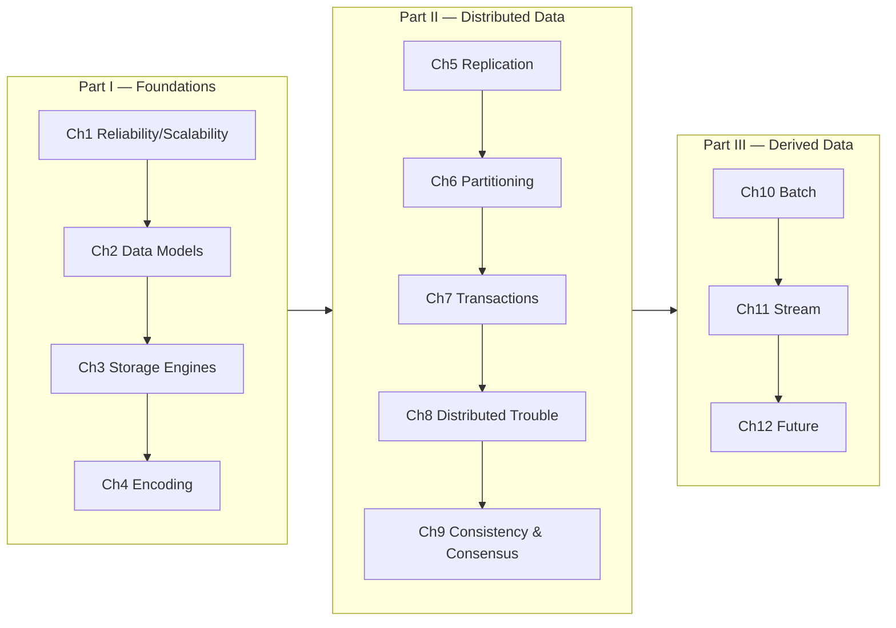

# 📘 Designing Data-Intensive Applications — Study Notes

Comprehensive, self-contained study notes for **_Designing Data-Intensive Applications_** by **Martin Kleppmann** (O'Reilly, 2017). One deep-dive Markdown file per chapter — written as **original paraphrased notes** (not a reproduction of the book), packed with Mermaid diagrams, edge cases, worked examples, real open-source implementations, and self-check questions.

> These notes are meant to help you learn the concepts. They are a transformative study companion — to support the book, not replace owning a legal copy. If DDIA is useful to you, [buy it](https://dataintensive.net/).

---

## 🗂️ Chapters

### Part I — Foundations of Data Systems
| Ch | Title | Notes |
|----|-------|-------|
| 1 | Reliable, Scalable & Maintainable Applications | [ch01](ch01-reliable-scalable-maintainable.md) |
| 2 | Data Models & Query Languages | [ch02](ch02-data-models-and-query-languages.md) |
| 3 | Storage & Retrieval | [ch03](ch03-storage-and-retrieval.md) |
| 4 | Encoding & Evolution | [ch04](ch04-encoding-and-evolution.md) |

### Part II — Distributed Data
| Ch | Title | Notes |
|----|-------|-------|
| 5 | Replication | [ch05](ch05-replication.md) |
| 6 | Partitioning | [ch06](ch06-partitioning.md) |
| 7 | Transactions | [ch07](ch07-transactions.md) |
| 8 | The Trouble with Distributed Systems | [ch08](ch08-trouble-with-distributed-systems.md) |
| 9 | Consistency & Consensus | [ch09](ch09-consistency-and-consensus.md) |

### Part III — Derived Data
| Ch | Title | Notes |
|----|-------|-------|
| 10 | Batch Processing | [ch10](ch10-batch-processing.md) |
| 11 | Stream Processing | [ch11](ch11-stream-processing.md) |
| 12 | The Future of Data Systems | [ch12](ch12-future-of-data-systems.md) |

---

## 🔗 How These Map to Your System-Design Guides

DDIA is the theory; the [`system-design/`](../../system-design/README.md) guides are the practical building blocks. Read them together.

| DDIA Chapter | Related System-Design Guide(s) |
|--------------|-------------------------------|
| Ch 5 — Replication | [Replication](../../system-design/02-moderate/replication.md) |
| Ch 6 — Partitioning | [Database Sharding](../../system-design/02-moderate/database-sharding.md), [Consistent Hashing](../../system-design/02-moderate/consistent-hashing.md) |
| Ch 7 — Transactions | [Distributed Transactions](../../system-design/03-hard/distributed-transactions.md) |
| Ch 8 — Trouble with Distributed Systems | [Distributed Systems](../../system-design/04-very-hard/distributed-systems.md), [Fault Tolerant Systems](../../system-design/04-very-hard/fault-tolerant-systems.md) |
| Ch 9 — Consistency & Consensus | [Consensus Algorithms](../../system-design/04-very-hard/consensus-algorithms.md), [Leader Election](../../system-design/04-very-hard/leader-election.md), [Distributed Consensus](../../system-design/04-very-hard/distributed-consensus.md) |
| Ch 11 — Stream Processing | [Event Driven Architecture](../../system-design/03-hard/event-driven-architecture.md), [Message Queues](../../system-design/02-moderate/message-queues.md) |

---

## 🧭 Suggested Reading Paths

- **Full journey:** Ch 1 → 12 in order (the book is designed this way).
- **Distributed-systems focus (maps to your guides):** Ch 5 → 6 → 7 → 8 → 9.
- **Interview crunch:** Ch 1 (scalability/percentiles), Ch 3 (LSM vs B-tree), Ch 5–7, Ch 9.
- **Data-engineering focus:** Ch 3, 4, 10, 11, 12.

---

## 🧩 What's In Each Chapter File

Every file follows the same structure:
1. **Chapter in One Paragraph** — the big picture
2. **Key Concepts & Vocabulary** — every important term defined
3. **Deep Dive** — full walkthrough with Mermaid diagrams, tables, worked examples
4. **Edge Cases, Failure Modes & Gotchas** — the tricky stuff, exhaustively
5. **Key Takeaways**
6. **Real-World Applications & Examples**
7. **Open-Source Implementations (GitHub)** — real repos that implement the ideas
8. **References & Further Reading** — the papers/docs the chapter cites
9. **Self-Check Questions** — with model answers

**Coverage stats:** 12 chapters · ~68,000 words · 100+ Mermaid diagrams · 120+ referenced OSS repos · hundreds of cited papers/docs.

---

## 📎 External Resources
- Book site & references: [dataintensive.net](https://dataintensive.net/)
- Author: [martin.kleppmann.com](https://martin.kleppmann.com/)
- Companion reading list (per-chapter references) is on the book's site.
