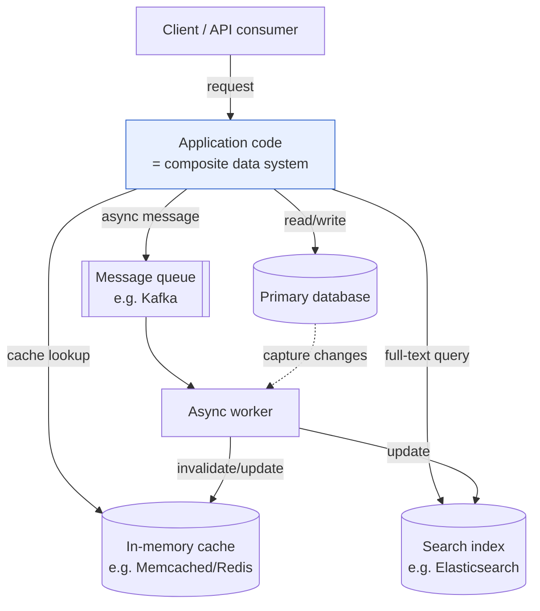
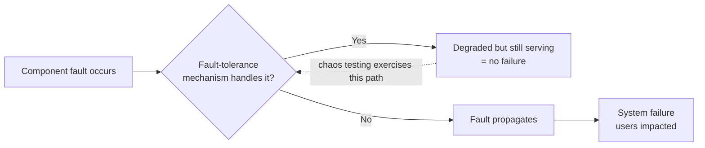
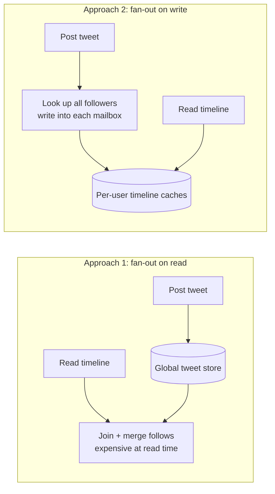
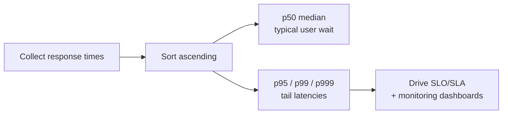
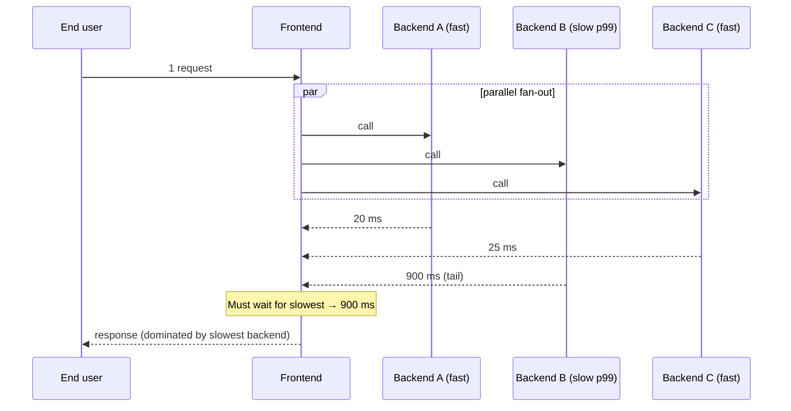
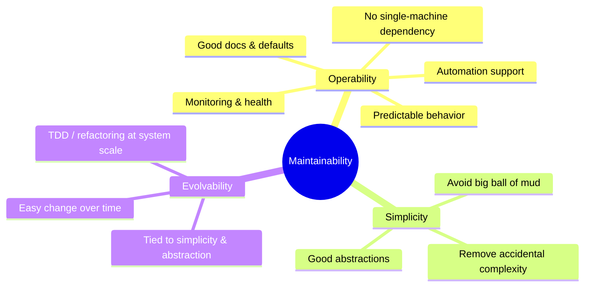

# DDIA Chapter 1: Reliable, Scalable, and Maintainable Applications

> Part I: Foundations of Data Systems | Maps to: system-design fundamentals (reliability engineering, capacity planning / load modeling, operability & maintainability). This chapter sets the vocabulary used across the entire book.

## 🎯 Chapter in One Paragraph

Modern applications are **data-intensive** rather than compute-intensive: the hard problems are the *amount* of data, its *complexity*, and the *speed at which it changes*, not raw CPU. We build such apps by stitching together standard building blocks — databases, caches, search indexes, stream processors, and batch processors — but the boundaries between these categories are blurring (Redis is used as a queue, Kafka has database-like durability), so it's useful to reason about all of them together as **data systems**. When you compose several tools behind one API, you become a *data system designer*, and three cross-cutting concerns dominate every design decision: **Reliability** (keep working correctly despite hardware faults, software bugs, and human error), **Scalability** (have sensible strategies for coping with growth in data, traffic, or complexity), and **Maintainability** (let many people work productively on the system over its long life via operability, simplicity, and evolvability). The chapter's job is to define these three words precisely and give you the mental tools — fault vs. failure, load parameters, response-time percentiles, scale-up vs. scale-out, accidental complexity, abstraction — that the rest of the book builds on.

## 🧠 Key Concepts & Vocabulary

- **Data-intensive application**: An app whose primary challenges are data volume, data complexity, and rate of change, as opposed to a compute-intensive one bottlenecked on CPU cycles.
- **Data system**: An umbrella term for databases, caches, message queues, search indexes, stream/batch processors, etc. Grouped together because their categories increasingly overlap and because real apps combine several of them.
- **Reliability**: The system continues to *work correctly* (right function, at the desired performance) even in the face of adversity — hardware faults, software faults, and human mistakes. Informally, "continuing to work correctly even when things go wrong."
- **Fault**: One *component* of the system deviating from its specification (a disk dies, a process crashes). Faults are inevitable; probability can't be driven to zero.
- **Failure**: The *system as a whole* stops providing the required service to the user. The goal of fault tolerance is to stop faults from cascading into failures.
- **Fault-tolerant / resilient**: A system designed to anticipate and cope with *certain kinds* of faults. You can never tolerate *every* fault (e.g., Earth being swallowed by a black hole), so you always scope which faults you handle.
- **Hardware fault**: A physical component failing (disk crash, RAM error, power blackout, unplugged cable). Usually **random and independent** across machines; mitigated with redundancy (RAID, dual power supplies, generators) and increasingly with software fault tolerance.
- **MTTF (Mean Time To Failure)**: Statistical expected lifetime of a component. Example: disks quoted at 10–50 years MTTF → in a 10,000-disk cluster you expect ~1 disk death per day.
- **Software error / systematic fault**: A bug that is **correlated across nodes** (e.g., a bad input crashing every server instance; the 2012 leap-second Linux kernel bug). Harder to anticipate; can cause many more failures than hardware faults.
- **Cascading failure**: A small fault in one component triggers a fault in another, propagating through the system.
- **Human error**: Operator/config mistakes — historically the *leading* cause of outages (hardware only 10–25% in one study).
- **Chaos engineering**: Deliberately injecting faults (e.g., randomly killing processes) so that fault-tolerance machinery is continuously exercised and trusted. Netflix's **Chaos Monkey** is the canonical example.
- **Scalability**: A system's ability to cope with increased load. Not a binary label ("X is scalable"); it's a set of questions about *how* the system copes if load grows in a specific way.
- **Load parameter**: A number that succinctly describes current load and whose growth you reason about — requests/sec, read/write ratio, active users, cache hit rate, fan-out, etc. The right parameter is architecture-specific.
- **Fan-out**: (Borrowed from electronics.) The number of downstream requests one incoming request generates. Twitter's scaling challenge is fan-out of tweet delivery, not raw tweet volume.
- **Throughput**: Records processed per second, or total job runtime — the key metric for **batch** systems (e.g., Hadoop).
- **Response time**: What the *client* sees for an online request = service time + network delays + queueing delays.
- **Latency**: The duration a request spends *waiting* to be handled (latent, awaiting service). Often confused with response time — they are not the same.
- **Percentile (p50/p95/p99/p999)**: Sort response times; the pXX is the threshold below which XX% of requests fall. **p50 = median**.
- **Tail latency**: High-percentile response times (p99, p999). They directly shape the experience of your most valuable/heaviest users.
- **Head-of-line blocking**: A few slow requests occupy limited server capacity (CPU cores), delaying subsequent fast requests behind them in the queue.
- **Tail latency amplification**: When one user request fans out to many backend calls, the slowest single call determines the overall latency, so a higher fraction of end-user requests become slow.
- **SLO / SLA**: Service Level Objective / Agreement — contracts defining expected performance/availability, usually expressed with percentiles (e.g., median < 200 ms, p99 < 1 s, uptime ≥ 99.9%).
- **Coordinated omission**: The load-testing pitfall where a client waits for a response before sending the next request, artificially shortening queues and hiding real tail latency.
- **Scaling up (vertical scaling)**: Move to a bigger, more powerful machine.
- **Scaling out (horizontal scaling)**: Distribute load across many smaller machines — a **shared-nothing** architecture.
- **Shared-nothing architecture**: Nodes share no memory or disk; they coordinate only over the network.
- **Elastic system**: Automatically adds/removes resources in response to detected load. Contrast with manually scaled systems (simpler, fewer surprises).
- **Magic scaling sauce**: (Tongue-in-cheek.) The myth of a generic one-size-fits-all scalable architecture. Real scalable architectures are highly application-specific.
- **Maintainability**: Making it easy for engineering and operations to keep working on the system productively over time. Decomposed into three design principles below.
- **Operability**: Making it easy for ops teams to keep the system running smoothly (monitoring, automation, no single-machine dependencies, good defaults, predictable behavior).
- **Simplicity**: Making it easy for new engineers to understand the system by removing complexity (not the same as UI simplicity).
- **Accidental complexity**: Complexity that is *not* inherent to the problem the software solves, arising only from the implementation (Moseley & Marks). Removable via good **abstraction**.
- **Abstraction**: Hiding implementation detail behind a clean façade (high-level languages hide machine code; SQL hides on-disk structures, concurrency, and crash recovery). The main weapon against accidental complexity.
- **Evolvability (extensibility / modifiability / plasticity)**: Making it easy to change the system as requirements change. Agility applied at the *data-system* level, closely tied to simplicity and good abstractions.
- **Functional vs. nonfunctional requirements**: *Functional* = what it does (store, retrieve, search, process). *Nonfunctional* = general properties (security, reliability, compliance, scalability, compatibility, maintainability).

## 📚 Deep Dive

### Thinking About Data Systems

We usually treat databases, queues, and caches as distinct tool categories with distinct access patterns and implementations. The chapter argues for a unifying view — **data systems** — for two reasons:

1. **Categories are blurring.** New tools are optimized for specific use cases and no longer fit clean buckets. Redis (a datastore) is used as a message queue; Kafka (a message queue) offers database-grade durability.
2. **One tool rarely suffices.** Demanding apps decompose work across specialized tools stitched together with **application code**. If you run Memcached alongside Elasticsearch alongside your primary DB, it's *your* application's job to keep caches and search indexes in sync with the source of truth.

Once you compose components behind a single API, you've built a *new special-purpose data system* out of general-purpose parts, and you inherit hard questions: How do you keep data correct and complete when something breaks internally? How do you stay fast when a component is degraded? How do you scale? What's a good API?



The book then commits to three concerns that matter in most systems: **Reliability, Scalability, Maintainability**. The rest of the chapter defines each.

### Reliability

Intuitive expectations of "reliable software": it does what the user expects, tolerates user mistakes/misuse, performs well enough under expected load, and prevents unauthorized access. Bundle these as "working correctly," and **reliability = continuing to work correctly even when things go wrong.**

Crucial distinction:

| Term | Definition | Example |
|------|-----------|---------|
| **Fault** | A component deviates from its spec | A single disk fails |
| **Failure** | The whole system stops serving users | The website returns errors to everyone |

You cannot reduce fault probability to zero, so design **fault-tolerance mechanisms that prevent faults from becoming failures** — building reliable systems from unreliable parts. Counterintuitively, it can be wise to *increase* the fault rate deliberately (chaos engineering) so the recovery machinery is constantly tested; many severe bugs are actually in the rarely-exercised error-handling paths. Prevention beats cure only where no cure exists (e.g., security — a data breach can't be undone).



#### Hardware Faults

Disks crash, RAM goes bad, power fails, cables get unplugged. At scale these are constant. With a 10,000-disk cluster and 10–50 year MTTF, expect roughly **one disk death per day**. Classic mitigation is **hardware redundancy**: RAID arrays, dual power supplies, hot-swappable CPUs, datacenter batteries + diesel generators. This keeps single machines running for years but doesn't fully prevent failures.

Two trends push beyond pure hardware redundancy toward **software fault tolerance**:
- More machines per app → proportionally more hardware faults.
- Cloud VMs (e.g., AWS) can vanish without warning because platforms prioritize elasticity over single-machine reliability.

Software fault tolerance also enables **rolling upgrades**: patch one node at a time with zero whole-system downtime, versus a single-server system that needs planned downtime to reboot.

#### Software Errors (Systematic Faults)

Unlike hardware faults, software bugs are **correlated across nodes** — one bad input can crash every instance simultaneously — so they cause disproportionately many failures. Examples:
- A bug crashing every app server on a specific bad input (the **June 30, 2012 leap-second** Linux kernel bug hung many apps at once).
- A runaway process hogging CPU/memory/disk/bandwidth.
- A dependency that slows, hangs, or returns corrupt responses.
- **Cascading failures**, where one small fault triggers others.

These bugs lie dormant until an assumption about the environment stops being true. No silver bullet, but many partial defenses: scrutinize assumptions and interactions, test thoroughly, isolate processes, allow crash-and-restart, and continuously monitor. A system that promises an invariant (e.g., "messages in = messages out" in a queue) can self-check at runtime and alert on discrepancies.

#### Human Errors

Operators are human and unreliable; **configuration errors are the leading cause of outages**, with hardware faults implicated in only 10–25%. Best systems combine several defenses:

- **Minimize error opportunities**: well-designed abstractions, APIs, and admin interfaces that make the right thing easy and the wrong thing hard (but not so restrictive people route around them).
- **Decouple where mistakes happen from where they cause damage**: fully featured **sandbox** environments with real data but no real users.
- **Test at all levels**: unit → integration → whole-system → manual, especially for rare corner cases.
- **Enable fast recovery**: quick config rollback, gradual code rollout (blast radius limited to a few users), tools to recompute bad data.
- **Detailed monitoring / telemetry**: performance metrics and error rates for early warning and diagnosis.
- **Good management and training.**

#### How Important Is Reliability?

Not just for nuclear plants and air-traffic control. Bugs in business apps cause lost productivity and legal risk; ecommerce outages cost revenue and reputation. Even "noncritical" apps carry responsibility (imagine corrupting a parent's only copies of their children's photos). You *may* consciously trade reliability for lower cost (unproven-market prototype, razor-thin-margin service) — but do it *knowingly*.

### Scalability

Reliable-today ≠ reliable-tomorrow; a common degradation cause is **load growth** (10k → 100k users, or vastly more data). Scalability is the ability to cope with that growth. It's **not a one-dimensional label** — never say "X is scalable." Instead ask: *if load grows this specific way, what are our options, and how do we add resources?*

#### Describing Load — the Twitter Worked Example

You must quantify current load with **load parameters** before reasoning about growth. Twitter (Nov 2012 data) has two key operations:

| Operation | Rate |
|-----------|------|
| Post tweet | 4.6k req/s avg, >12k req/s peak |
| Home timeline read | 300k req/s |

12k writes/s is easy. The real challenge is **fan-out**: each user follows many and is followed by many. Two implementation approaches:

**Approach 1 — read-time merge (pull).** Store tweets in one global collection. On timeline read, join followers→followees→tweets and merge by time:
```sql
SELECT tweets.*, users.* FROM tweets
  JOIN users   ON tweets.sender_id    = users.id
  JOIN follows ON follows.followee_id = users.id
  WHERE follows.follower_id = current_user
```

**Approach 2 — write-time fan-out (push).** Maintain a per-user home-timeline cache ("mailbox"). On post, insert the tweet into every follower's cache. Reads become cheap because results are precomputed.



Twitter moved from 1 → 2 because reads (300k/s) hugely outnumber writes (4.6k/s), so it pays to do more work at write time. Cost of approach 2: average tweet hits ~75 followers → 4.6k posts/s becomes **~345k writes/s** to caches, and a celebrity with 30M+ followers means **one tweet → 30M+ cache writes**, all ideally delivered within ~5 seconds. The key load parameter here is the **distribution of followers per user** (weighted by tweet rate). Final twist: Twitter uses a **hybrid** — fan-out on write for normal users, fan-out on read for celebrities, merged at read time — to get consistently good performance.

#### Describing Performance

Two ways to look at load increase:
- Hold resources fixed, increase load → how does performance change?
- Increase load, hold performance fixed → how much extra resource is needed?

Both need performance numbers. **Batch** systems care about **throughput**; **online** systems care about **response time**.

**Latency ≠ response time.** Response time is the client-visible total (service + network + queueing). Latency is time spent waiting to be handled.

Response time is a **distribution**, not a single number. Even identical requests vary due to context switches, TCP retransmission after packet loss, GC pauses, page faults, rack vibration, etc. The **mean is a poor "typical" metric** because it hides how many users actually experienced a given delay — use **percentiles** instead:



- **p50 (median)**: half of requests are faster. Good "typical" measure. Note: over a session of several requests, the chance that *at least one* exceeds the median is far above 50%.
- **p95 / p99 / p999 (tail latencies)**: characterize the worst outliers. Amazon specs internal services at **p999** even though it's 1 in 1,000 requests — because the slowest requests often belong to the *most valuable* customers (most data on their accounts). Amazon found **+100 ms response time → −1% sales**; a 1 s slowdown dropped a customer-satisfaction metric by 16%.
- Optimizing beyond a point (e.g., p9999) is often too expensive for too little benefit, since extreme tails are dominated by uncontrollable random events.

**SLOs/SLAs** encode these (e.g., "up = median < 200 ms and p99 < 1 s, ≥ 99.9% of the time; else refund").

**Queueing delay dominates the tail.** With limited CPU cores, a few slow requests cause **head-of-line blocking** — fast requests wait behind slow ones — so **measure response time on the client side**. When load-testing, the client must **keep sending independently of responses**, or it will artificially shorten queues (**coordinated omission**) and understate the tail.

##### Percentiles in Practice — Tail Latency Amplification



If one request fans out to many backends, the **slowest** determines the whole request's latency. Even a small fraction of slow backend calls means a large fraction of *end-user* requests are slow — **tail latency amplification**. To monitor percentiles cheaply on a rolling window, use approximate structures like **HdrHistogram**, **t-digest**, or **forward decay** — and note you cannot simply average percentiles across machines (you must aggregate histograms).

#### Approaches for Coping with Load

An architecture fit for one load level rarely survives 10×; expect to rethink it roughly every order of magnitude.

| | Scaling up (vertical) | Scaling out (horizontal / shared-nothing) |
|---|---|---|
| Idea | Bigger machine | Many smaller machines |
| Simplicity | Simpler (single node) | More complex, esp. for stateful data |
| Cost | High-end hardware gets very expensive | Commodity, but operational complexity |
| Limit | Hardware ceiling | Network coordination overhead |
| Best practice | — | Pragmatic **mixture**: a few fairly powerful machines often beats swarms of tiny VMs |

- **Elastic** systems auto-scale on detected load (useful for unpredictable load); **manually scaled** systems are simpler with fewer surprises.
- Distributing **stateless** services is straightforward; making **stateful** data systems distributed adds a lot of complexity — hence the old wisdom "keep the DB on one node (scale up) until cost or HA forces distribution." As distributed tooling improves, this may change.
- **No magic scaling sauce**: architectures are highly application-specific. A system for 100k×1 kB requests/s looks nothing like one for 3×2 GB requests/min even at equal throughput. Scalable architectures are built around assumptions about which operations are common/rare (the load parameters). In early-stage products, **iterating fast usually matters more than scaling** to hypothetical future load.

### Maintainability

Most software cost is **ongoing maintenance**, not initial build: fixing bugs, keeping systems running, investigating failures, porting platforms, adapting to new use cases, repaying tech debt, adding features. Design to minimize maintenance pain so you don't create legacy systems. Three principles:



#### Operability — Make Life Easy for Operations

"Good operations can work around bad software, but good software can't run reliably with bad operations." Ops responsibilities include: monitoring + rapid recovery, root-causing failures/degradation, keeping software & platforms patched, watching cross-system effects, capacity planning, deployment/config tooling, complex migrations, security under change, predictable processes, and preserving organizational knowledge as people come and go.

Systems make ops easier by providing: runtime visibility/monitoring; automation and standard-tool integration; **no dependency on individual machines** (take nodes down for maintenance without downtime); good docs and an understandable operational model ("if I do X, Y happens"); good defaults with override freedom; self-healing plus manual control; and **predictable behavior** (minimize surprises).

#### Simplicity — Managing Complexity

Small projects can be elegant; big ones drift into a **big ball of mud**. Symptoms of complexity: state-space explosion, tight coupling, tangled dependencies, inconsistent naming, performance hacks, special-casing. Complexity blows budgets/schedules and raises bug risk because hidden assumptions and unexpected interactions get overlooked.

Simplicity ≠ less functionality — it means removing **accidental complexity** (complexity from the *implementation*, not from the problem itself). The best tool for this is **abstraction**: hide implementation behind a clean façade that's reusable and quality-improving (high-level languages hide machine code; SQL hides on-disk structures, concurrency, and crash recovery). Finding good abstractions is hard, especially in distributed systems.

#### Evolvability — Make Change Easy

Requirements are in constant flux (new facts, new use cases, shifting priorities, new features, platform swaps, regulation, growth-driven re-architecture). **Agile** (with TDD and refactoring) helps at the small code scale; the book seeks agility at the **data-system** scale (e.g., "refactoring" Twitter from approach 1 to approach 2). Evolvability is closely linked to simplicity and good abstractions — simple systems are easier to change.

### Summary (Chapter's own wrap-up)

Applications have **functional** requirements (what they do) and **nonfunctional** ones (security, reliability, compliance, scalability, compatibility, maintainability). This chapter drilled into three:
- **Reliability** = work correctly despite faults (hardware: random/uncorrelated; software: systematic/hard; humans: inevitable). Fault tolerance hides certain faults from users.
- **Scalability** = strategies to keep performance good under growing load; requires quantifying load and performance (Twitter timelines; response-time percentiles).
- **Maintainability** = making life better for engineering/ops via operability, simplicity (good abstractions), and evolvability.
There's no easy fix, but recurring patterns and techniques exist — the subject of the rest of the book.

## ⚠️ Edge Cases, Failure Modes & Gotchas

- **Fault vs. failure confusion**: Tolerating faults means stopping them *before* they become system failures. You can't tolerate *all* faults — always scope which ones (no budget for post-black-hole hosting).
- **Correlated software faults are worse than hardware faults**: One bad input or a shared bug (leap-second kernel hang) takes down *every* node at once — no independent redundancy saves you.
- **Dormant bugs in error-handling paths**: Many critical failures live in rarely-run recovery code. If you never exercise it (via chaos testing), it will fail exactly when you need it.
- **Cascading failures**: A tiny fault triggers another, then another. Overload-shedding, circuit breakers, and isolation matter.
- **Cloud VMs vanish without warning**: Don't assume single-machine reliability on elastic platforms; design for node loss.
- **Rolling upgrades require machine-independence**: If any single machine is a hard dependency, you cannot patch without downtime.
- **Human/config errors dominate outages** (leading cause): guard with sandboxes, gradual rollout, fast rollback, and guardrail abstractions — but overly restrictive interfaces get bypassed, negating the benefit.
- **Mean response time misleads**: It hides how many users hit the slow path. Always use percentiles.
- **Latency vs. response time**: Mixing them up leads to wrong measurements; response time includes queueing and network.
- **Head-of-line blocking**: A handful of slow requests stall fast ones behind them on limited cores — the *client* sees slowness even for cheap requests.
- **Measure on the client, not the server**: Server-side numbers miss queueing/network delay seen by users.
- **Coordinated omission in load tests**: If the load generator waits for each response before firing the next, queues stay artificially short and you *underestimate* tail latency. Send requests independently of responses.
- **Percentiles don't average**: You cannot average p95s across servers or time windows; aggregate the underlying histograms (HdrHistogram/t-digest).
- **Tail latency amplification**: More backend fan-out ⇒ higher chance the slowest call dominates ⇒ more end-user requests are slow, even if each backend's slow rate is small.
- **Fan-out write storms (celebrity problem)**: Push-model timelines explode when a user has tens of millions of followers (one write → millions of writes). Hybrid push/pull is the fix.
- **`hash mod N`-style assumptions (choosing wrong load parameters)**: Architect around the wrong common operations and scaling effort is wasted or counterproductive.
- **Premature scaling**: For early-stage products, over-investing in scale before product-market fit wastes effort; iteration speed usually matters more.
- **Accidental vs. inherent complexity**: Attacking inherent complexity by cutting features is wrong; the removable part is accidental complexity from implementation.
- **Restrictive abstractions get worked around**: Guardrails that are too tight push people to bypass them, reintroducing the very errors they aimed to prevent.
- **Over-optimizing extreme tails (p9999)**: Diminishing returns; dominated by uncontrollable randomness — often not worth the cost (Amazon deliberately stopped at p999).

## 🔑 Key Takeaways

- Reason about databases, caches, queues, search, and stream/batch processors together as **data systems**; real apps compose them and *you* become the system designer responsible for their guarantees.
- The three pillars are **Reliability, Scalability, Maintainability** — this vocabulary underpins the whole book.
- **Reliability = working correctly even when things go wrong.** Distinguish **fault** (component) from **failure** (system); build reliable systems from unreliable parts and stop faults from cascading into failures.
- Faults come in three flavors: **hardware** (random, uncorrelated), **software** (systematic, correlated, worse), and **human** (leading cause of outages). Combat with redundancy, chaos testing, thorough testing, monitoring, sandboxes, gradual rollout, and fast rollback.
- **Scalability isn't a label** — it's a set of "if load grows this way, then…" questions. Quantify load with the *right* **load parameters** (Twitter's is follower-fan-out, not tweet volume).
- Measure performance as a **distribution**: use **percentiles (p50/p95/p99/p999)**, not the mean. **Tail latencies** matter most and are dominated by **queueing**.
- Beware **head-of-line blocking**, **tail latency amplification**, and **coordinated omission**; measure client-side and load-test correctly.
- **Scale up vs. scale out** is usually a pragmatic mix; distributing *stateful* systems is hard; there is **no magic scaling sauce** — architectures are application-specific.
- **Maintainability = Operability + Simplicity + Evolvability.** Attack **accidental complexity** with good **abstractions**; make change easy at the data-system level.

## 💡 Real-World Applications & Examples

- **Netflix Chaos Monkey / Simian Army**: Randomly terminates production instances during business hours to force resilience and continuously test fault-tolerance machinery — the textbook chaos-engineering practice.
- **Twitter home timelines**: Evolution from fan-out-on-read (SQL join) → fan-out-on-write (per-user mailbox caches) → hybrid for celebrities — the canonical load-parameter and evolvability case study.
- **Amazon retail**: Specs internal services at **p999** and quantifies that +100 ms hurts sales by 1%; a real-world illustration of why tail latency and valuable-customer experience matter.
- **The 2012 leap second**: A Linux kernel bug hung many applications simultaneously worldwide — a correlated software fault demonstrating why systematic errors exceed hardware faults in impact.
- **Cloud elasticity (AWS)**: VM instances can disappear without warning; teams design software fault tolerance and rolling upgrades rather than relying on single-machine reliability.
- **RAID / dual power / generators**: Classic hardware redundancy still used in datacenters as the first layer of reliability.
- **SRE monitoring stacks (e.g., Prometheus + histograms)**: Operability in practice — rolling-window percentile dashboards, error-rate alerts, and telemetry for diagnosis.
- **Kubernetes chaos tooling (Chaos Mesh / LitmusChaos)**: Modern, cloud-native descendants of Chaos Monkey for injecting faults into containerized/distributed data systems.

## 🛠️ Open-Source Implementations (GitHub)

| Project | GitHub | How it relates to this chapter | Approx. stars |
|---------|--------|--------------------------------|---------------|
| Netflix Simian Army (Chaos Monkey) | https://github.com/Netflix/SimianArmy | Original chaos-engineering toolset — deliberately induces faults to exercise fault tolerance (Reliability) | ~7.9k |
| Netflix Chaos Monkey (v2) | https://github.com/Netflix/chaosmonkey | Standalone, Spinnaker-integrated instance-termination tool; the canonical reliability-testing example cited in the chapter | ~14k |
| HdrHistogram | https://github.com/HdrHistogram/HdrHistogram | High-dynamic-range histogram for accurate latency **percentile** recording — the practical tool behind "Percentiles in Practice" | ~2.3k |
| t-digest | https://github.com/tdunning/t-digest | Streaming quantile sketch (Dunning & Ertl, ref [26]) for computing extreme percentiles online with low memory | ~2.1k |
| Prometheus | https://github.com/prometheus/prometheus | Monitoring/telemetry system with histogram metrics and percentile queries — operability and reliability early-warning signals | ~57k |
| Chaos Mesh | https://github.com/chaos-mesh/chaos-mesh | Cloud-native (Kubernetes) chaos-engineering platform; modern realization of deliberate fault injection | ~7k |
| LitmusChaos | https://github.com/litmuschaos/litmus | Kubernetes-native chaos engineering framework, integrates with Prometheus for chaos metrics | ~4.7k |
| k6 (Grafana) | https://github.com/grafana/k6 | Load-testing tool that sends requests independently of responses, avoiding **coordinated omission** when measuring scalability | ~28k |
| Apache Kafka | https://github.com/apache/kafka | Message queue with database-like durability — the chapter's example of blurring data-system category boundaries | ~30k |

(Star counts are approximate and change over time.)

## 🔗 References & Further Reading

- Stonebraker & Çetintemel, ["One Size Fits All": An Idea Whose Time Has Come and Gone](https://cs.brown.edu/~ugur/fits_all.pdf), ICDE 2005 — motivates the diversity of data systems (ref [1]).
- Heimerdinger & Weinstock, [A Conceptual Framework for System Fault Tolerance](https://resources.sei.cmu.edu/library/asset-view.cfm?assetid=11750), CMU/SEI-92-TR-033 — the fault vs. failure distinction (ref [2]).
- Yuan et al., [Simple Testing Can Prevent Most Critical Failures](https://www.usenix.org/conference/osdi14/technical-sessions/presentation/yuan), OSDI 2014 — many critical failures are in error-handling code (ref [3]).
- Izrailevsky & Tseitlin, [The Netflix Simian Army](https://netflixtechblog.com/the-netflix-simian-army-16e57fbab116), 2011 — chaos engineering origin (ref [4]).
- DeCandia et al., [Dynamo: Amazon's Highly Available Key-Value Store](https://www.allthingsdistributed.com/files/amazon-dynamo-sosp2007.pdf), SOSP 2007 — availability & p999 thinking (ref [19]).
- Dean & Barroso, [The Tail at Scale](https://research.google/pubs/pub40801/), CACM 2013 — tail latency amplification (ref [24]).
- Oppenheimer, Ganapathi & Patterson, [Why Do Internet Services Fail, and What Can Be Done About It?](https://www.usenix.org/legacy/events/usits03/tech/oppenheimer.html), USITS 2003 — config/human error as leading outage cause (ref [13]).
- Moseley & Marks, [Out of the Tar Pit](https://curtclifton.net/papers/MoseleyMarks06a.pdf), 2006 — accidental vs. essential complexity (ref [32]).
- Brooks, [No Silver Bullet — Essence and Accident in Software Engineering](https://en.wikipedia.org/wiki/No_Silver_Bullet), in *The Mythical Man-Month* (ref [31]).
- Foote & Yoder, [Big Ball of Mud](http://www.laputan.org/mud/), PLoP 1997 (ref [30]).
- Hickey, [Simple Made Easy](https://www.infoq.com/presentations/Simple-Made-Easy/), Strange Loop 2011 — simplicity vs. ease (ref [33]).
- Cook, [How Complex Systems Fail](https://how.complexsystems.fail/), 2000 (ref [11]).
- Tene, [HdrHistogram](http://hdrhistogram.org/) & talks on coordinated omission (ref [27]).
- Book site: [Designing Data-Intensive Applications](https://dataintensive.net/) by Martin Kleppmann.

## ❓ Self-Check Questions

1. **What is the difference between a fault and a failure, and why does it matter?**
   A *fault* is a single component deviating from spec; a *failure* is the whole system no longer serving users. It matters because you can't eliminate faults, so the design goal is fault *tolerance* — preventing faults from escalating into failures.

2. **Why are software (systematic) faults often more dangerous than hardware faults?**
   Hardware faults are typically random and independent across machines, so redundancy helps. Software bugs are correlated across nodes (same bug everywhere) and can take down every instance at once — e.g., the 2012 leap-second kernel bug.

3. **Why deliberately inject faults (chaos engineering)?**
   Fault-tolerance and error-handling code is rarely exercised in normal operation, so it's where critical bugs hide. Continuously triggering faults (Chaos Monkey) verifies the recovery machinery actually works before a real fault hits.

4. **Why prefer percentiles over the mean for response times, and what do p50/p99/p999 mean?**
   The mean hides how many users hit slow paths and is skewed by outliers. Percentiles describe the distribution: p50 (median) = half of requests are faster; p99/p999 = tail latencies affecting the slowest 1-in-100 / 1-in-1000 requests, which often belong to your most valuable users.

5. **What is tail latency amplification and how do you mitigate it?**
   When one user request fans out to many backend calls, the slowest call dictates overall latency, so a small per-backend slow rate yields a large fraction of slow end-user requests. Mitigate by reducing fan-out, hedged/backup requests, tightening backend tails, and monitoring client-side percentiles.

6. **What was Twitter's scaling challenge, and how did the architecture evolve?**
   The challenge was fan-out (followers per user), not tweet volume. It evolved from fan-out-on-read (SQL join at read time) to fan-out-on-write (per-user timeline caches) to a hybrid: push for normal users, pull-and-merge for celebrities with huge follower counts.

7. **What is coordinated omission and why does it corrupt load tests?**
   If the load generator waits for each response before sending the next request, queues stay artificially short during slow periods, so measured tail latency is far better than reality. Fix by sending requests on a fixed schedule independent of responses.

8. **Distinguish scaling up from scaling out. When is each preferred?**
   Scaling up = one bigger machine (simpler, but expensive and capped). Scaling out = many machines in a shared-nothing setup (cheaper hardware, but complex, especially for stateful systems). Real systems use a pragmatic mix; keep stateful DBs single-node until cost/HA forces distribution.

9. **What is accidental complexity, and what's the main tool against it?**
   Complexity not inherent to the problem but introduced by the implementation. The main tool is abstraction — hiding implementation behind a clean, reusable façade (e.g., SQL hiding storage, concurrency, and crash recovery).

10. **What do Operability, Simplicity, and Evolvability each mean?**
    Operability = making it easy for ops to run the system smoothly (monitoring, automation, predictability, no single-machine dependence). Simplicity = removing accidental complexity so engineers can understand it. Evolvability = making the system easy to change as requirements shift, tightly linked to simplicity and good abstractions.
