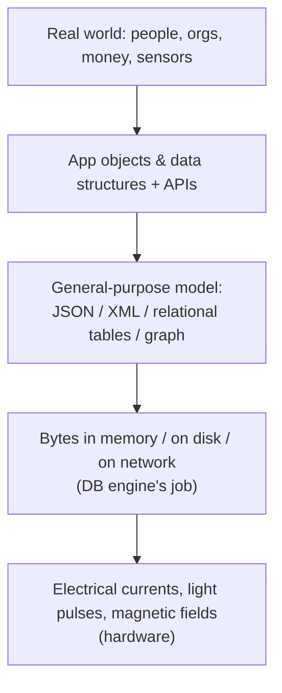
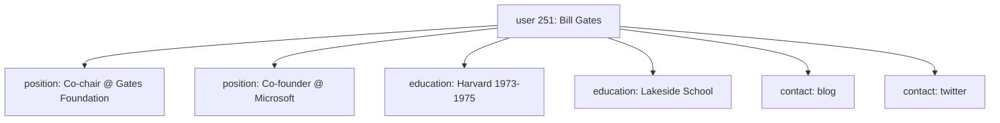
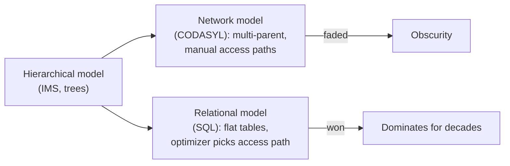
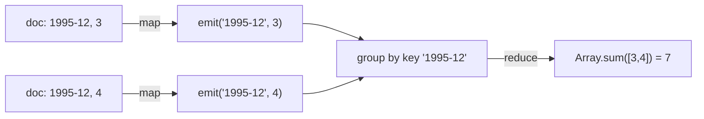
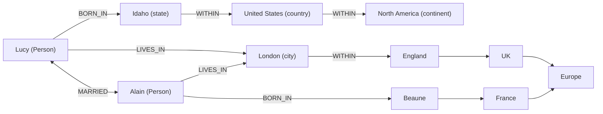
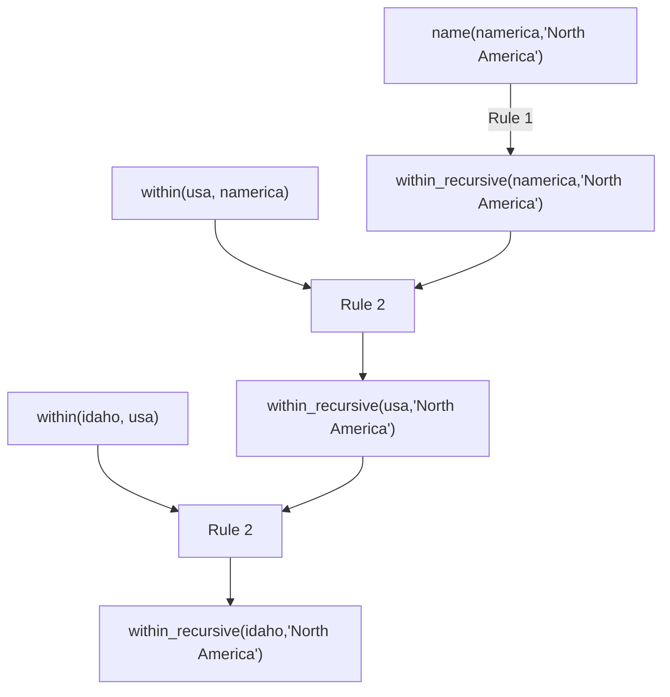

# DDIA Chapter 2: Data Models and Query Languages

> Part I: Foundations of Data Systems | Maps to: system-design topics on *data modeling*, *relational vs. NoSQL*, *graph databases*, and *query language design*.

## 🎯 Chapter in One Paragraph

Software is built by stacking data models on top of one another — an application object model on top of a general-purpose storage model (JSON documents, relational tables, or a graph) on top of bytes on disk. The model you pick at the storage layer profoundly shapes what your software can and cannot do, which operations are cheap or expensive, and how easily the application evolves. This chapter surveys the three dominant general-purpose models — **relational**, **document**, and **graph** — explaining where each shines: relational for many-to-many relationships and ad-hoc queries via joins; document for self-contained tree-shaped data with good read locality; and graph for highly interconnected data where "anything relates to everything." It reframes the modern NoSQL debate as a rerun of the 1970s "great debate" between the hierarchical/network (CODASYL) models and the relational model, and it contrasts **declarative** query languages (SQL, Cypher, SPARQL, Datalog, even CSS) — which say *what* you want and let an optimizer decide *how* — against **imperative** query APIs that dictate step-by-step execution. The core lesson: there is no one-size-fits-all model; choose the one whose shape matches your data's relationships.

## 🧠 Key Concepts & Vocabulary

- **Data model** — An abstraction describing how data is structured and manipulated; each layer hides the complexity of the layer beneath it.
- **Relational model** — Data as *relations* (tables), each an unordered collection of *tuples* (rows). Proposed by Edgar Codd (1970); realized in SQL/RDBMSes by the mid-1980s.
- **Document model** — Data stored as self-contained documents (usually JSON/XML/BSON), where one-to-many nesting is represented inline as a tree. Examples: MongoDB, CouchDB, RethinkDB, Espresso.
- **NoSQL** — An originally-a-hashtag umbrella term (retroactively "Not Only SQL") for open-source, distributed, non-relational datastores; driven by needs for scalability, high write throughput, open source, specialized queries, and schema flexibility.
- **Polyglot persistence** — Using multiple different datastores side-by-side, each suited to a particular use case.
- **Impedance mismatch** — The awkward translation layer between object-oriented application code and the relational (tables/rows/columns) storage model; ORMs (ActiveRecord, Hibernate) reduce but don't eliminate it.
- **Object-Relational Mapping (ORM)** — Frameworks that automate the object↔table translation.
- **Normalization** — Storing human-meaningful information in exactly one place and referencing it elsewhere by an ID (a *many-to-one* relationship), avoiding duplication and update anomalies.
- **Denormalization** — Deliberately duplicating data (e.g., to avoid joins) at the cost of having to keep copies consistent.
- **Foreign key / document reference** — Two names for the same idea: a unique identifier stored in one record that points at another record, resolved at read time via a join or follow-up query.
- **One-to-many / many-to-one / many-to-many relationships** — The cardinality patterns whose prevalence determines which model fits best.
- **Hierarchical model** — Early (IMS, 1968) model representing everything as a tree of nested records; good for one-to-many, poor for many-to-many; conceptually similar to the document model.
- **Network model (CODASYL)** — A generalization of the hierarchical model where a record can have multiple parents; navigation via explicit *access paths* (pointer chains) chosen manually by the programmer.
- **Access path** — The route (chain of pointers/links) a program must follow to reach a record in the hierarchical/network models; the relational query optimizer's chosen plan is the automatic analog.
- **Query optimizer** — The database component that automatically decides join order, indexes, and execution strategy for a declarative query — built once, benefits all applications.
- **Schema-on-write** — The schema is explicit and enforced when data is written (relational default); analogous to static type checking.
- **Schema-on-read** — Structure is implicit and interpreted only when data is read (document default); analogous to dynamic type checking. "Schemaless" is a misleading term for this.
- **Data locality** — Storing related data physically together so it can be read in one operation; documents provide locality, and so do features like Spanner's interleaved tables, Oracle multi-table index clusters, and Bigtable column families.
- **Shredding** — Splitting a document-like structure into many relational tables.
- **Declarative query language** — You specify the *pattern* of desired results, not the algorithm (SQL, relational algebra, CSS, XPath/XSL, Cypher, SPARQL). Enables optimization and parallelism.
- **Imperative query language/API** — You specify step-by-step operations in a fixed order (JS DOM manipulation, IMS/CODASYL COBOL loops).
- **Relational algebra** — Formal foundation of SQL; e.g., selection operator σ (sigma).
- **MapReduce** — A programming model (Google) using pure `map` and `reduce` functions to process data across a cluster; sits between declarative and imperative. Supported in a limited form by MongoDB/CouchDB.
- **Aggregation pipeline** — MongoDB's later declarative, JSON-syntax query language (a rediscovery of SQL-like expressiveness).
- **Graph model** — Data as *vertices* (nodes/entities) and *edges* (relationships/arcs); natural for many-to-many and heterogeneous, highly-connected data.
- **Property graph** — Model (Neo4j, JanusGraph/Titan) where vertices and edges each have a unique ID, a label, and a set of key-value *properties*; any vertex can link to any other.
- **Triple-store** — Model where all data is `(subject, predicate, object)` triples; mostly equivalent to the property graph. Serializations include Turtle/N3 and RDF/XML.
- **RDF (Resource Description Framework)** — A W3C standard for publishing machine-readable data across the web (the "semantic web"); uses URIs for subjects/predicates/objects to avoid naming conflicts.
- **Cypher** — Neo4j's declarative property-graph query language (ASCII-art arrow syntax, e.g. `(a)-[:KNOWS]->(b)`).
- **SPARQL** — Declarative query language for RDF triple-stores (predates Cypher; Cypher borrowed its pattern matching).
- **Datalog** — Older (1980s) declarative logic language (a subset of Prolog); rules of the form `head :- body` build up derived predicates; foundation for later languages. Used by Datomic and Cascalog.
- **Gremlin / Pregel** — Imperative graph query language and a graph-processing framework, respectively (mentioned as alternatives).

## 📚 Deep Dive

### The layered nature of data models

Every application is a tower of models. Developers model the real world as objects and data structures; those are stored via a general-purpose model (JSON, XML, relational tables, or graph); database engineers map that to bytes on disk/memory/network; hardware engineers map bytes to physical signals. Each layer exposes a clean interface hiding the layer below, letting independent teams (DB vendors vs. app developers) collaborate. Because the storage model dictates what the software above can do easily, choosing the right one matters enormously.



### Relational Model vs. Document Model

The relational model (Codd, 1970) organizes data into tables of rows. Doubted at first, it became dominant by the mid-1980s and has ruled ~25–30 years. Its roots are in 1960s–70s business data processing (transaction processing + batch reporting). Its goal was to *hide implementation details* behind a clean interface, unlike the network and hierarchical models it displaced. It generalized far beyond business use into the web (publishing, social, ecommerce, games, SaaS).

**The Birth of NoSQL.** In the 2010s, "NoSQL" (originally a 2009 meetup hashtag) gathered non-relational, distributed, open-source datastores. Driving forces: (1) greater scalability / write throughput, (2) preference for open source, (3) specialized queries relational models handle poorly, and (4) desire to escape rigid schemas. The likely long-term outcome is *polyglot persistence* — relational and non-relational coexisting.

#### The Object-Relational Mismatch

OO code and relational tables don't line up; the translation layer is the **impedance mismatch**. ORMs reduce boilerplate but can't fully hide it. Consider a LinkedIn résumé: `first_name`/`last_name` occur once (columns), but `positions`, `education`, and `contact_info` are one-to-many. Three representations:

| Representation | How multi-valued data is stored | Trade-off |
|---|---|---|
| Normalized multi-table (classic SQL) | Separate tables with foreign keys to `users` | Clean, but needs joins/multiple queries to reassemble |
| Structured types / XML / JSON column | Multi-valued data within one row, queryable/indexable | Supported unevenly (Oracle, DB2, MSSQL, PostgreSQL, MySQL) |
| Encoded JSON/XML in a text column | One opaque blob | App must parse it; DB can't query inside |

For a mostly-self-contained document like a résumé, a single JSON document is natural: it has **locality** (one read fetches everything) and makes the tree structure of one-to-many relationships explicit — no messy multi-way join needed.



#### Many-to-One and Many-to-Many Relationships

Storing `region_id`/`industry_id` as IDs (not free text like "Greater Seattle Area") gives: consistent spelling, disambiguation, easy global updates, localization, and better search. Using an ID means the human-meaningful value lives in exactly one place and never has to change — the essence of **normalization**. But normalization needs **many-to-one** relationships (many people → one region), which don't fit the document model well: document databases have weak join support, so you either emulate joins in application code (more work, usually slower) or denormalize (and then must keep copies consistent).

Data tends to grow *more* interconnected over time. Turning `organization`/`school` from strings into entities (each with its own page), or adding *recommendations* (which must reference the recommender's live profile/photo), introduces **many-to-many** relationships — the document model's weak spot.

#### Are Document Databases Repeating History? — the 1970s debate

IMS (1968, hierarchical model) nested records in a tree — strikingly like JSON. It handled one-to-many well but made many-to-many hard and had no joins, forcing developers to denormalize or resolve references by hand — exactly today's document-DB pain. Two solutions emerged:



- **Network model (CODASYL):** a record could have multiple parents; access was by manually following *access paths* (pointer chains). Efficient on 1970s hardware (slow tape seeks) but code was complex, inflexible, and hard to change — programmers had to track many paths "in their head" like navigating an n-dimensional space.
- **Relational model:** lays all data in the open — a table is just a collection of rows. No labyrinthine access paths. The **query optimizer** picks the access path automatically; you add a new index and existing queries just use it. Build the optimizer *once*, and every application benefits.

**Comparison to document databases today:** Document DBs reverted to the hierarchical idea for nested one-to-many data. But for many-to-one/many-to-many, relational and document DBs are *not* fundamentally different — both reference related items by a unique ID (foreign key vs. document reference), resolved at read time. Document DBs did *not* repeat CODASYL's manual-access-path mistake.

#### Relational vs. Document Databases Today (data-model differences only)

| Dimension | Document model favored | Relational model favored |
|---|---|---|
| Data shape | Tree of one-to-many, whole tree loaded at once | Highly interconnected, many-to-many |
| Application code | Simpler when data is document-like | Simpler when joins are needed |
| Joins | Weak / emulated in app | Native, optimized |
| Locality | Strong (single document read) | Requires multiple index lookups |
| Schema | Flexible (schema-on-read) | Enforced (schema-on-write) |
| Referencing a nested item | Awkward ("2nd item in positions of user 251") | Direct |

For highly interconnected data: document = awkward, relational = acceptable, **graph = most natural**.

#### Schema flexibility: schema-on-read vs. schema-on-write

Document DBs (and JSON columns) usually don't enforce a schema. "Schemaless" is misleading — there's an *implicit* schema the reading code assumes; the accurate term is **schema-on-read** (structure interpreted at read time) vs. **schema-on-write** (enforced at write time). Analogy: dynamic vs. static type checking.

Worked example — splitting a `name` field into `first_name`/`last_name`:

```javascript
// Schema-on-read (document DB): handle old docs at read time
if (user && user.name && !user.first_name) {
    user.first_name = user.name.split(" ")[0];
}
```

```sql
-- Schema-on-write (relational): migrate the schema
ALTER TABLE users ADD COLUMN first_name text;
UPDATE users SET first_name = split_part(name, ' ', 1);   -- PostgreSQL
```

`ALTER TABLE` is usually milliseconds (MySQL is the notorious exception — it may copy the whole table; tools like `pt-online-schema-change`, LHM, and gh-ost work around this). A big `UPDATE` is slow on any DB, so the app can fill defaults at read time instead. Schema-on-read shines when data is **heterogeneous** (many object types, or structure controlled by external systems). Enforced schemas help when records are expected to be uniform.

#### Data locality for queries

A document is stored as one contiguous string (JSON/XML/BSON). If you need most of it at once (e.g., to render a page), locality is a win — no multiple index lookups/seeks. But the DB usually must load the *whole* document even to read a small part, which is wasteful for large documents, and updates typically rewrite the entire document. Guidance: keep documents small and avoid size-increasing writes. Locality isn't unique to documents — Google **Spanner** interleaves child rows within a parent table, Oracle has *multi-table index cluster tables*, and Bigtable's **column-family** concept (used in Cassandra, HBase) manages locality too.

#### Convergence

Relational DBs added XML (mid-2000s) and JSON support (PostgreSQL 9.3+, MySQL 5.7+, DB2 10.5+) with in-document indexing/querying. Document DBs added relational-like joins (RethinkDB) or client-side reference resolution (MongoDB drivers). Codd's original relational model even allowed *nonsimple domains* (nested relations) — essentially JSON, 30 years early. The models are converging; a **hybrid** relational+document engine is a good future direction.

### Query Languages for Data

SQL is **declarative**; IMS/CODASYL were **imperative**. Finding sharks:

```javascript
// Imperative: how to do it, step by step, order matters
function getSharks() {
  var sharks = [];
  for (var i = 0; i < animals.length; i++)
    if (animals[i].family === "Sharks") sharks.push(animals[i]);
  return sharks;
}
```

```sql
-- Declarative: what you want; optimizer decides how
SELECT * FROM animals WHERE family = 'Sharks';   -- ≈ σ_family='Sharks'(animals)
```

Why declarative wins:
- **Concise** and easier to write.
- **Hides implementation** — the engine can change storage layout / add optimizations without breaking queries (SQL guarantees no particular row order, so the DB may reorder rows to reclaim disk space).
- **Parallelizable** — since CPUs scale by adding cores, declarative languages (which specify only the result pattern) can be run in parallel, while imperative code with fixed instruction order cannot.

**Declarative on the web (CSS/XSL analogy).** Highlighting the selected nav item declaratively:

```css
li.selected > p { background-color: blue; }
```
```xpath
li[@class='selected']/p    <!-- equivalent XPath used by XSL -->
```

The imperative JavaScript DOM equivalent is long, brittle (won't un-highlight when the `selected` class is removed unless you write more code), and can't transparently benefit from faster browser APIs. Same moral as databases: declarative > imperative.

#### MapReduce Querying

MapReduce (Google) is a bulk-processing model that sits *between* declarative and imperative: you supply `map` and `reduce` snippets that the framework calls repeatedly. They must be **pure functions** (no side effects, no extra DB queries) so the system can run them anywhere, in any order, and re-run on failure.

Count sharks per month — SQL vs. MongoDB MapReduce vs. aggregation pipeline:

```sql
SELECT date_trunc('month', observation_timestamp) AS observation_month,
       sum(num_animals) AS total_animals
FROM observations
WHERE family = 'Sharks'
GROUP BY observation_month;
```

```javascript
// MongoDB MapReduce (two coordinated functions)
db.observations.mapReduce(
  function map()   { var y=this.observationTimestamp.getFullYear();
                     var m=this.observationTimestamp.getMonth()+1;
                     emit(y+"-"+m, this.numAnimals); },
  function reduce(k, vals) { return Array.sum(vals); },
  { query: { family: "Sharks" }, out: "monthlySharkReport" }
);
// two docs (both 1995-12) -> emit("1995-12",3), emit("1995-12",4)
// -> reduce("1995-12",[3,4]) = 7
```

```javascript
// MongoDB aggregation pipeline (declarative; added in 2.2)
db.observations.aggregate([
  { $match: { family: "Sharks" } },
  { $group: { _id: { year:{$year:"$observationTimestamp"},
                      month:{$month:"$observationTimestamp"} },
              totalAnimals: { $sum: "$numAnimals" } } }
]);
```

MapReduce is low-level and forces two carefully coordinated functions; a declarative language gives the optimizer more room. The wry moral: *a NoSQL system may accidentally reinvent SQL in disguise* (the aggregation pipeline).



### Graph-Like Data Models

When many-to-many relationships dominate and data grows highly interconnected, model it as a **graph** of *vertices* and *edges*. Examples: social graphs (people/knows), the web graph (pages/links), road networks (junctions/roads). Algorithms like shortest-path and PageRank operate on them. Graphs also unify *heterogeneous* data — Facebook keeps one graph with vertices for people, locations, events, check-ins, comments, and many edge types. Graphs are highly *evolvable* — add a feature, extend the graph.

Running example (Fig 2-5): Lucy (born in Idaho, USA, North America) and Alain (born in Beaune, France, Europe), married and living in London — with varying regional granularity per country.

#### Property Graphs

Each **vertex** has: a unique ID, incoming edges, outgoing edges, and a property bag (key-value). Each **edge** has: a unique ID, a tail (start) vertex, a head (end) vertex, a label, and a property bag. Modeled relationally:

```sql
CREATE TABLE vertices ( vertex_id integer PRIMARY KEY, properties json );
CREATE TABLE edges (
  edge_id integer PRIMARY KEY,
  tail_vertex integer REFERENCES vertices (vertex_id),
  head_vertex integer REFERENCES vertices (vertex_id),
  label text, properties json );
CREATE INDEX edges_tails ON edges (tail_vertex);
CREATE INDEX edges_heads ON edges (head_vertex);
```

Key properties: (1) any vertex can connect to any other (no schema restriction); (2) indexes on both `tail_vertex` and `head_vertex` let you traverse forward *and* backward efficiently; (3) different edge labels store many relationship kinds in one clean graph.



#### The Cypher Query Language (Neo4j)

Insert with arrow notation; `(Idaho)-[:WITHIN]->(USA)` creates a labeled edge.

```cypher
CREATE
  (NAmerica:Location {name:'North America', type:'continent'}),
  (USA:Location      {name:'United States', type:'country'}),
  (Idaho:Location    {name:'Idaho',         type:'state'}),
  (Lucy:Person       {name:'Lucy'}),
  (Idaho)-[:WITHIN]->(USA)-[:WITHIN]->(NAmerica),
  (Lucy)-[:BORN_IN]->(Idaho)
```

Find people who emigrated from the US to Europe — note `WITHIN*0..` = "follow WITHIN zero or more times" (like regex `*`), which handles the *variable-length* path:

```cypher
MATCH
  (person)-[:BORN_IN]->()-[:WITHIN*0..]->(us:Location {name:'United States'}),
  (person)-[:LIVES_IN]->()-[:WITHIN*0..]->(eu:Location {name:'Europe'})
RETURN person.name
```

The optimizer may start from people, or start from the US/Europe vertices (via a name index) and work backward — you don't specify which.

#### Graph Queries in SQL

Relational DBs can store graphs, but querying variable-length paths needs **recursive common table expressions** (`WITH RECURSIVE`, since SQL:1999; in PostgreSQL, DB2, Oracle, SQL Server). The same query that took 4 lines in Cypher takes ~29 clumsy lines in SQL:

```sql
WITH RECURSIVE
  in_usa(vertex_id) AS (
      SELECT vertex_id FROM vertices WHERE properties->>'name' = 'United States'
    UNION
      SELECT edges.tail_vertex FROM edges
        JOIN in_usa ON edges.head_vertex = in_usa.vertex_id
        WHERE edges.label = 'within' ),
  in_europe(vertex_id) AS (
      SELECT vertex_id FROM vertices WHERE properties->>'name' = 'Europe'
    UNION
      SELECT edges.tail_vertex FROM edges
        JOIN in_europe ON edges.head_vertex = in_europe.vertex_id
        WHERE edges.label = 'within' ),
  born_in_usa(vertex_id) AS (
      SELECT edges.tail_vertex FROM edges
        JOIN in_usa ON edges.head_vertex = in_usa.vertex_id
        WHERE edges.label = 'born_in' ),
  lives_in_europe(vertex_id) AS (
      SELECT edges.tail_vertex FROM edges
        JOIN in_europe ON edges.head_vertex = in_europe.vertex_id
        WHERE edges.label = 'lives_in' )
SELECT vertices.properties->>'name' FROM vertices
JOIN born_in_usa     ON vertices.vertex_id = born_in_usa.vertex_id
JOIN lives_in_europe ON vertices.vertex_id = lives_in_europe.vertex_id;
```

Moral: 4 lines vs. 29 lines shows models are built for different use cases — pick the right one.

#### Triple-Stores and SPARQL

A triple-store stores everything as `(subject, predicate, object)`. The subject is a vertex. The object is either (a) a primitive value → predicate+object act as a property key+value, or (b) another vertex → predicate is an edge label, subject=tail, object=head. Turtle serialization (concise form):

```turtle
@prefix : <urn:example:>.
_:lucy     a :Person;   :name "Lucy";          :bornIn _:idaho.
_:idaho    a :Location; :name "Idaho";         :type "state";   :within _:usa.
_:usa      a :Location; :name "United States"; :type "country"; :within _:namerica.
_:namerica a :Location; :name "North America"; :type "continent".
```

**Semantic web & RDF.** RDF was meant to let websites publish machine-readable data that combines into a web-wide "database of everything." Overhyped in the early 2000s and largely unrealized, but triples remain a useful *internal* app data model. RDF quirk: subjects/predicates/objects are often **URIs** (e.g. `<http://my-company.com/namespace#within>`) so data from different sources doesn't collide on meaning; the URI is just a namespace and needn't resolve. RDF can also be written verbosely as RDF/XML (tools like Apache Jena convert between formats).

**SPARQL** (RDF query language; predates Cypher, which borrowed its pattern matching) — even more concise:

```sparql
PREFIX : <urn:example:>
SELECT ?personName WHERE {
  ?person :name ?personName.
  ?person :bornIn  / :within* / :name "United States".
  ?person :livesIn / :within* / :name "Europe".
}
```

Equivalence: Cypher `(person)-[:BORN_IN]->()-[:WITHIN*0..]->(loc)` ≡ SPARQL `?person :bornIn / :within* ?location.` Because RDF doesn't distinguish properties from edges, the same syntax matches both.

#### Graph Databases vs. the Network Model — not CODASYL reborn

| Aspect | CODASYL (network model) | Graph databases |
|---|---|---|
| Schema | Restricts which record type nests in which | Any vertex → any vertex, no restriction |
| Access | Only by traversing predefined access paths | Direct by unique ID or via an index |
| Ordering | Children are an ordered set the DB must maintain | Vertices/edges unordered (sort only in queries) |
| Query style | Imperative, brittle to schema changes | Declarative (Cypher/SPARQL) or optional imperative |

#### The Foundation: Datalog

Datalog (1980s, a subset of Prolog) writes triples as `predicate(subject, object)` and builds queries from **rules** (`head :- body`) that define *derived* predicates, which can be recursive and reused.

```prolog
name(namerica, 'North America').  type(namerica, continent).
name(usa, 'United States').       type(usa, country).   within(usa, namerica).
name(idaho, 'Idaho').             type(idaho, state).    within(idaho, usa).
name(lucy, 'Lucy').               born_in(lucy, idaho).

within_recursive(Loc, Name) :- name(Loc, Name).                      /* Rule 1 */
within_recursive(Loc, Name) :- within(Loc, Via),                     /* Rule 2 */
                               within_recursive(Via, Name).
migrated(Name, BornIn, LivingIn) :- name(Person, Name),              /* Rule 3 */
    born_in(Person, BornLoc),  within_recursive(BornLoc, BornIn),
    lives_in(Person, LivingLoc), within_recursive(LivingLoc, LivingIn).

?- migrated(Who, 'United States', 'Europe').   /* Who = 'Lucy'. */
```

A rule fires when all right-hand predicates match; the head is then "added" to the database (with variables bound). Repeatedly applying Rules 1–2 derives every location transitively within North America:



Datalog needs a different mindset and is less convenient for one-off queries, but rules **compose and reuse**, so it scales well to complex data.

## ⚠️ Edge Cases, Failure Modes & Gotchas

- **Denormalization consistency bug:** duplicating human-meaningful text (e.g., a region name) across records creates *update anomalies* — change it in one place, and other copies silently go stale, producing inconsistent data. Normalization + IDs avoids this; IDs never need to change because they carry no human meaning.
- **Data becomes interconnected over time:** an app that starts as a clean join-free document model often accretes many-to-many relationships (org entities, recommendations referencing live author profiles), at which point the document model turns awkward and forces app-side joins or denormalization.
- **App-side join emulation is slow:** resolving document references with multiple round-trips (or MongoDB client-side reference resolution) shifts work from the optimized DB into the application and adds network latency.
- **Large-document penalties:** the DB typically loads the *entire* document even to read one field (wasteful), and most updates rewrite the whole document; only edits that don't change the encoded size can be done in place. Keep documents small; avoid size-growing writes.
- **Nested-item addressing is clumsy:** you can't point directly at a nested element — you must say "the 2nd item in `positions` of user 251," reminiscent of hierarchical access paths. Fine only if nesting isn't deep.
- **MySQL `ALTER TABLE` gotcha:** unlike most RDBMSes (millisecond DDL), MySQL historically copies the whole table, risking minutes/hours of downtime on large tables — hence tools like `pt-online-schema-change`, Large Hadron Migrator, and gh-ost.
- **Big `UPDATE` on migration:** rewriting every row (e.g., backfilling `first_name`) is slow on any DB; the workaround is to leave the column NULL and compute at read time (i.e., act like schema-on-read).
- **Schema-on-read heterogeneity:** enforcing a schema *hurts* when objects are genuinely heterogeneous or externally controlled; but the *implicit* schema still exists in the reading code — forget to handle an old document shape and you get runtime errors.
- **Imperative web code doesn't self-heal:** the JS DOM highlight example won't remove the blue background when the `selected` class is dropped (unlike CSS, which re-evaluates automatically), and can't transparently adopt faster browser APIs — a general hazard of imperative approaches.
- **Ordering assumptions:** imperative queries may implicitly depend on row/element order, so the engine can't safely reorder records; SQL's unordered semantics free the engine to reclaim space and parallelize. Relying on incidental ordering is a latent bug.
- **MapReduce purity constraints:** `map`/`reduce` must be side-effect-free and may not issue extra queries; violating purity breaks the framework's ability to re-run on failure or run in arbitrary order. MapReduce also forces *two coordinated functions*, which is error-prone versus one declarative query.
- **Variable-length graph traversals in SQL:** you cannot know the number of joins in advance; without `WITH RECURSIVE` you cannot express "follow WITHIN zero-or-more times," and even with it the query is far more verbose and error-prone than Cypher/SPARQL.
- **RDF/global naming collisions:** two datasets can attach different meanings to the same word (`within`); RDF's URI-based predicates prevent conflicts when merging web data — using bare local names would silently conflate distinct concepts.
- **CODASYL rigidity (historical cautionary tale):** if there was no access path to the data you wanted, you had to rewrite large amounts of handwritten navigation code; changing the data model was very hard. Graph DBs avoid this by allowing direct ID/index access and declarative queries.
- **Model emulation is awkward:** any model can be emulated in another (graph in relational, etc.), but the result is usually clumsy — which is why specialized systems exist rather than one universal database.

## 🔑 Key Takeaways

- Data models are the most consequential design choice: they shape what software can do, what's fast, and how it evolves.
- History rhymes: hierarchical (tree) → couldn't do many-to-many → relational solved it; document DBs revive the hierarchical idea and hit the same many-to-many wall.
- Two divergent NoSQL directions: **document** (self-contained, relationships rare) vs. **graph** (anything relates to everything). Relational sits in between and handles simple many-to-many well.
- For many-to-one/many-to-many, relational and document DBs are alike — both use IDs (foreign key ≈ document reference) resolved at read time.
- Choose by relationship shape: tree-like → document; interconnected → graph; general ad-hoc joins → relational.
- **Schema-on-read** (implicit, flexible) vs. **schema-on-write** (explicit, enforced) is a fundamental trade-off; a schema still exists either way, just in different places.
- **Locality** is a document win but has a cost (load/rewrite the whole document); relational systems can get locality too (Spanner interleaving, Bigtable column families).
- **Declarative** query languages (SQL, Cypher, SPARQL, Datalog, CSS) beat imperative APIs: concise, optimizer-friendly, parallelizable, and future-proof.
- Property graphs and triple-stores/RDF are two vocabularies for the same idea; Cypher, SPARQL, and Datalog are their (declarative) query languages, with Datalog as the older, composable foundation.
- Relational and document databases are **converging** (JSON/XML in SQL; joins in document DBs) — a hybrid is the likely future.
- There is no one-size-fits-all model; polyglot persistence is expected.

## 💡 Real-World Applications & Examples

- **LinkedIn** — résumé/profile data (positions, education, contact) as a one-to-many tree; the running example for document vs. relational. LinkedIn's own Espresso is a document store.
- **MongoDB / CouchDB / RethinkDB** — document databases used for self-contained, tree-shaped data (e.g., time-series analytics recording which events happened when, where many-to-many is rarely needed).
- **Facebook (TAO)** — a single heterogeneous social graph: vertices for people, places, events, check-ins, comments; many edge types — the archetypal property-graph use case at scale.
- **Google Spanner** — brings document-style locality to a *relational* model via interleaved (nested) tables; Oracle's multi-table index clusters and Bigtable/Cassandra/HBase column families serve the same locality goal.
- **Navigation & search** — road networks as graphs for shortest-path routing; the web graph + PageRank for ranking search results.
- **Neo4j / JanusGraph** — property-graph databases for recommendation engines, fraud detection, network/IT topology, and identity/knowledge graphs.
- **Datomic / Cascalog** — Datalog in practice: Datomic as a triple/5-tuple store; Cascalog for querying large Hadoop datasets.
- **Specialized models beyond the big three** — GenBank for genome sequence-similarity search; LHC particle-physics pipelines processing hundreds of petabytes; full-text/search indexes alongside primary databases.
- **PostgreSQL** — a practical "hybrid": relational core plus rich JSON/JSONB and XML support and recursive CTEs, so one engine covers relational, document-ish, and graph-ish workloads.

## 🛠️ Open-Source Implementations (GitHub)

| Project | GitHub | How it relates to this chapter | Approx. Stars |
|---|---|---|---|
| PostgreSQL (mirror) | https://github.com/postgres/postgres | Canonical relational DB; JSON/JSONB + XML support, recursive CTEs (`WITH RECURSIVE`) for graph-in-SQL — embodies relational/document convergence | ~17k |
| MongoDB | https://github.com/mongodb/mongo | Flagship document database; MapReduce and the aggregation pipeline discussed in the chapter | ~27k |
| Apache CouchDB | https://github.com/apache/couchdb | Document database with JavaScript MapReduce views | ~6.5k |
| RethinkDB | https://github.com/rethinkdb/rethinkdb | Document database that added relational-style joins in its query language | ~27k |
| Neo4j | https://github.com/neo4j/neo4j | Reference property-graph database; home of the Cypher query language | ~14k |
| JanusGraph (Titan successor) | https://github.com/JanusGraph/janusgraph | Distributed property-graph database for billions of vertices/edges | ~5.5k |
| Apache Jena | https://github.com/apache/jena | RDF/triple-store framework; SPARQL engine; converts between RDF formats (Turtle, RDF/XML) | ~1.2k |
| Apache TinkerPop (Gremlin) | https://github.com/apache/tinkerpop | Graph computing framework; Gremlin, the imperative graph traversal language mentioned | ~2k |

(Star counts are approximate and drift over time; treat as ballpark.)

## 🔗 References & Further Reading

- Edgar F. Codd, "A Relational Model of Data for Large Shared Data Banks," *CACM* 13(6), 1970 — https://doi.org/10.1145/362384.362685
- Michael Stonebraker & Joseph M. Hellerstein, "What Goes Around Comes Around," in *Readings in Database Systems* (4th ed.), MIT Press, 2005 — https://people.cs.umass.edu/~yanlei/courses/CS691LL-f06/papers/SH05.pdf
- Charles W. Bachman, "The Programmer as Navigator" (Turing Award lecture on the network model), *CACM* 16(11), 1973 — https://doi.org/10.1145/355611.362534
- Jeffrey Dean & Sanjay Ghemawat, "MapReduce: Simplified Data Processing on Large Clusters," OSDI 2004 — https://research.google/pubs/pub62/
- James C. Corbett et al., "Spanner: Google's Globally-Distributed Database," OSDI 2012 — https://research.google/pubs/pub39966/
- Fay Chang et al., "Bigtable: A Distributed Storage System for Structured Data," OSDI 2006 — https://research.google/pubs/pub27898/
- Nathan Bronson et al., "TAO: Facebook's Distributed Data Store for the Social Graph," USENIX ATC 2013 — https://www.usenix.org/conference/atc13/technical-sessions/presentation/bronson
- Martin Fowler, "Schemaless Data Structures" — https://martinfowler.com/articles/schemaless/
- Sarah Mei, "Why You Should Never Use MongoDB" — https://www.sarahmei.com/blog/2013/11/11/why-you-should-never-use-mongodb/
- Shlomi Noach, "gh-ost: GitHub's Online Schema Migration Tool for MySQL" — https://github.blog/2016-08-01-gh-ost-github-s-online-migration-tool-for-mysql/
- W3C, "Turtle – Terse RDF Triple Language" — https://www.w3.org/TR/turtle/
- W3C, "SPARQL 1.1 Query Language" — https://www.w3.org/TR/sparql11-query/
- W3C RDF Working Group, "Resource Description Framework (RDF)" — https://www.w3.org/RDF/
- Ceri, Gottlob & Tanca, "What You Always Wanted to Know About Datalog (And Never Dared to Ask)," *IEEE TKDE* 1(1), 1989 — https://doi.org/10.1109/69.43410
- Abiteboul, Hull & Vianu, *Foundations of Databases*, Addison-Wesley 1995 — http://webdam.inria.fr/Alice/
- The Neo4j Cypher Manual — https://neo4j.com/docs/cypher-manual/current/
- MongoDB Aggregation Pipeline docs — https://www.mongodb.com/docs/manual/core/aggregation-pipeline/

## ❓ Self-Check Questions

1. **What is the impedance mismatch, and how does the document model address it?**
   The awkward translation between object-oriented application code and relational tables/rows/columns. A JSON document can mirror an application's tree-shaped object directly, reducing the mismatch — though ORMs (for relational) also mitigate it, and JSON has its own encoding problems.

2. **When is a document model a good fit, and when does it become awkward?**
   Good for self-contained, tree-shaped one-to-many data loaded as a whole (locality, one query). Awkward when many-to-many relationships appear (weak joins → app-side joins or denormalization with consistency risk) and for large documents (whole-document load/rewrite).

3. **Explain schema-on-read vs. schema-on-write with an analogy.**
   Schema-on-read interprets structure at read time (implicit, flexible) ≈ dynamic type checking; schema-on-write enforces structure at write time (explicit) ≈ static type checking. A schema exists either way — the difference is where and when it's enforced.

4. **Why did the relational model beat the CODASYL network model?**
   CODASYL required programmers to manually follow *access paths*, making code complex and brittle to schema changes. The relational model lays data out openly and lets a *query optimizer* choose access paths automatically — build it once, all apps benefit; adding an index doesn't require rewriting queries.

5. **Why are declarative query languages generally preferable to imperative ones?**
   They specify *what* not *how*, so they're more concise, let the engine optimize and change storage without breaking queries, and are far easier to parallelize across cores/machines. (CSS vs. imperative DOM manipulation illustrates the same point outside databases.)

6. **How is a property graph represented, and why index both edge endpoints?**
   Vertices and edges each have a unique ID, label(s), and key-value properties; any vertex can link to any other. Indexing both `tail_vertex` and `head_vertex` lets you find a vertex's incoming *and* outgoing edges efficiently, enabling forward and backward traversal.

7. **What do triple-stores/RDF and property graphs have in common, and how do their query languages relate?**
   They're largely equivalent — a triple `(subject, predicate, object)` maps to vertex/edge/property. SPARQL (for RDF) predates Cypher (for property graphs), and Cypher borrowed SPARQL's pattern matching, so they look similar.

8. **What makes Datalog different, and what's its main advantage?**
   Instead of one monolithic query, you define *rules* (`head :- body`) for derived predicates that can be recursive and reused across queries. It needs a different mindset and is less handy for one-offs, but rules **compose**, so it handles complex data well; it's the foundation later languages build on.

9. **Why can't you express variable-length graph traversals easily in plain SQL, and what's the workaround?**
   In relational queries you normally fix the joins in advance, but graph traversals may follow an unknown number of edges. SQL:1999 recursive CTEs (`WITH RECURSIVE`) allow it, but the query becomes long and clumsy (e.g., ~29 lines vs. ~4 in Cypher).

10. **Give two ways relational and document databases are converging.**
    Relational DBs added JSON/XML datatypes with in-document indexing/querying (PostgreSQL, MySQL, DB2); document DBs added join-like features (RethinkDB joins, MongoDB client-side reference resolution). The trend points toward hybrid engines.
