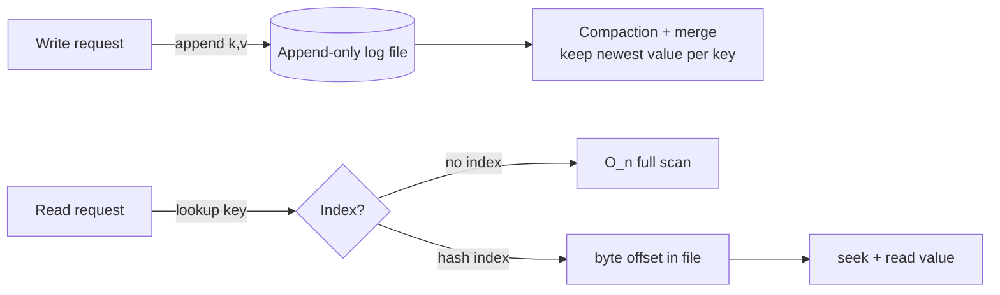
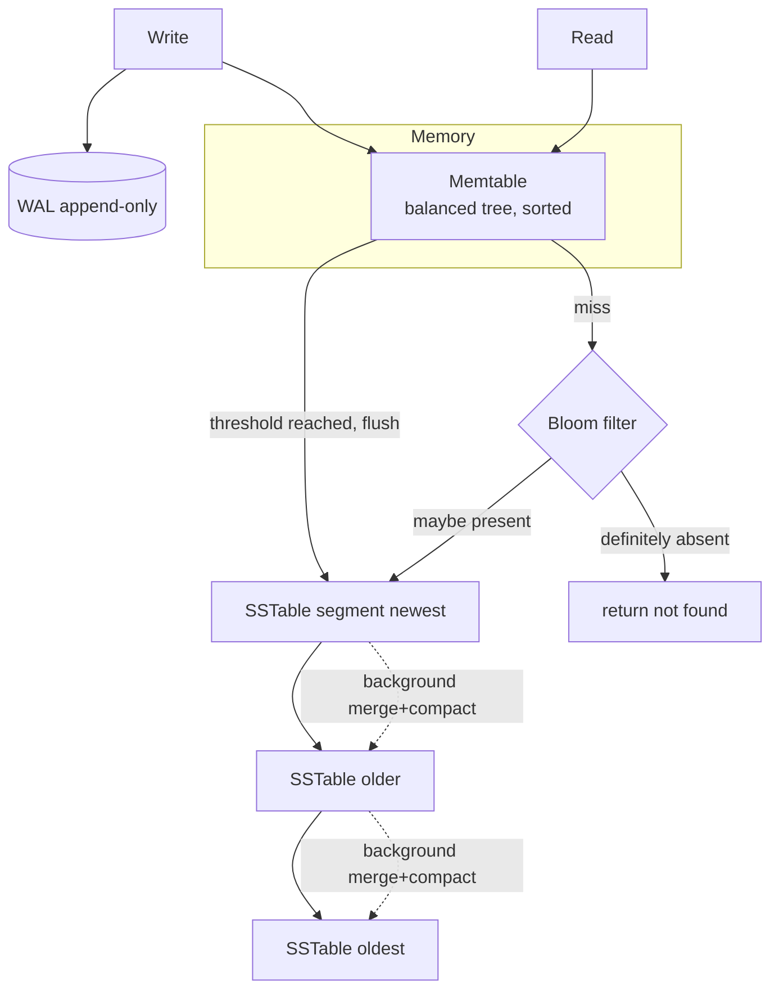
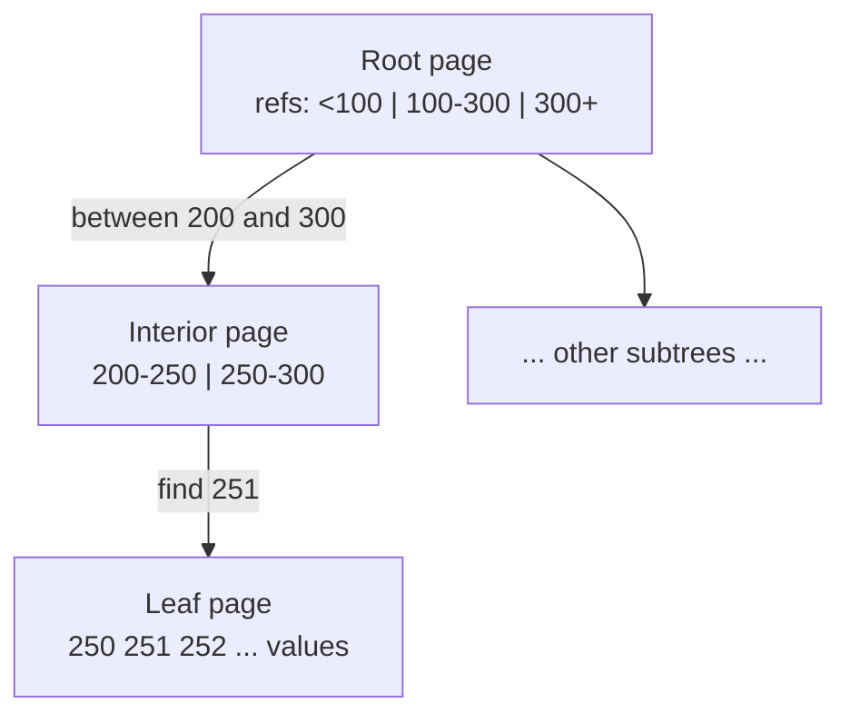
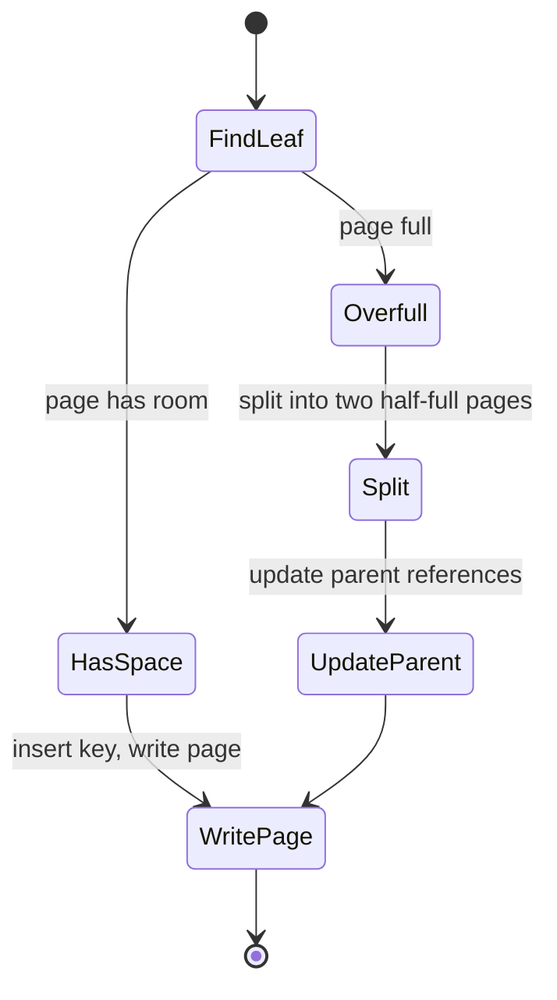
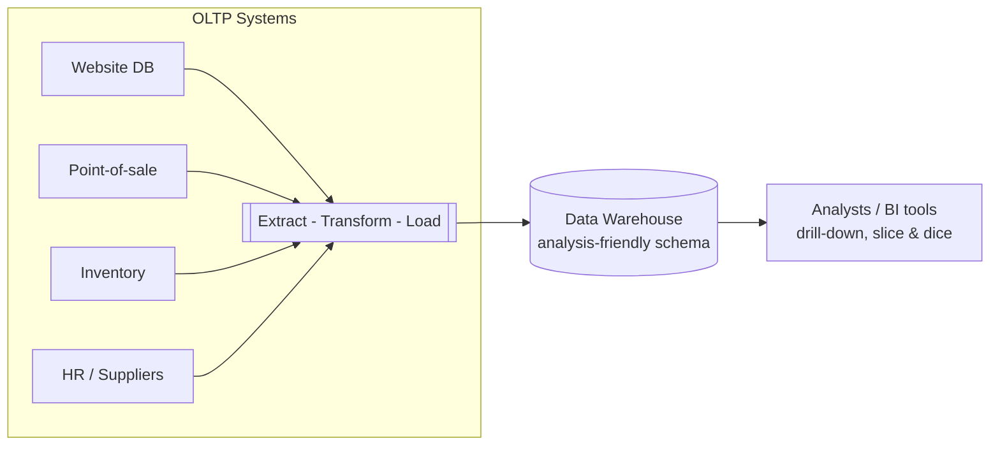
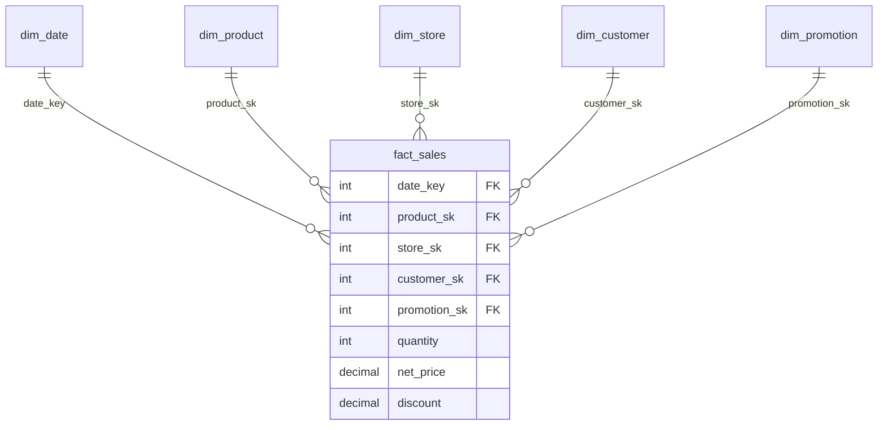
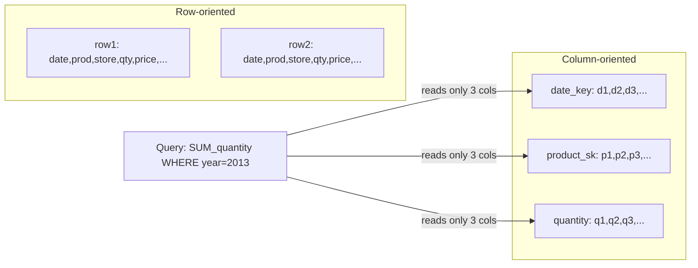
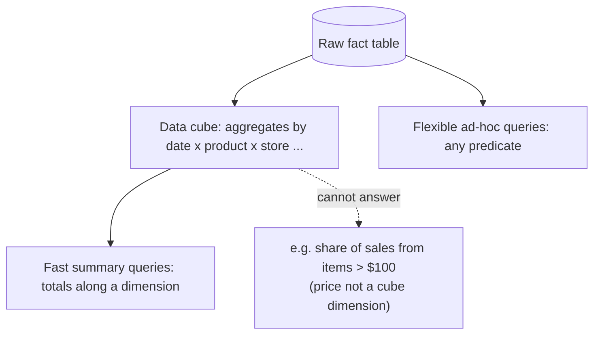

# DDIA Chapter 3: Storage and Retrieval

> Part I: Foundations of Data Systems | Maps to: system-design topics — *Database Internals*, *Storage Engines (LSM vs B-Tree)*, *OLTP vs OLAP*, *Data Warehousing & Columnar Storage*

## 🎯 Chapter in One Paragraph

At the most basic level a database does two things: it stores the data you hand it, and it gives that data back when you ask. This chapter opens the hood on *how* it does that. It walks through the two dominant families of storage engines used for transactional (OLTP) workloads — **log-structured** engines (append-only files, hash indexes, SSTables, LSM-trees) and **page-oriented** engines (B-trees) — then compares their write/read trade-offs (write amplification, compaction, fragmentation, latency percentiles). It surveys other index shapes (secondary, clustered, covering, multi-column, multi-dimensional, full-text/fuzzy) and in-memory databases. The second half pivots to a fundamentally different access pattern — **analytics (OLAP)** — explaining why analysts get their own **data warehouse**, how **star/snowflake schemas** model facts and dimensions, and why **column-oriented storage** (with bitmap encoding, run-length compression, sort orders, vectorized processing, and materialized views/data cubes) crushes analytic queries. The payoff: as an application developer you rarely build a storage engine, but understanding these internals lets you *choose* and *tune* the right one for your workload.

## 🧠 Key Concepts & Vocabulary

- **Storage engine** — the component of a database responsible for physically writing data to and reading it from disk/memory. The chapter's central object of study.
- **Log** — an append-only sequence of records (not to be confused with application/text logs). The foundational primitive for many engines.
- **Index** — an auxiliary data structure *derived from* the primary data that speeds reads at the cost of slower writes and extra storage. Adding/removing indexes never changes the data itself, only performance.
- **Storage/read/write trade-off** — well-chosen indexes speed reads but every index slows writes, so databases don't index everything by default.
- **Hash index** — an in-memory hash map from key → byte offset in an on-disk data file (e.g., **Bitcask**, Riak's default engine). Fast, but all keys must fit in RAM and range queries are inefficient.
- **Segment** — a chunk of the append-only log; when a file reaches a size threshold it is closed and a new one started.
- **Compaction** — background process that discards duplicate/overwritten keys in a segment, keeping only the most recent value per key.
- **Merging** — combining several segments into one (often done alongside compaction). Segments are immutable, so the result is written to a new file.
- **Tombstone** — a special deletion record appended to the log; during merge it instructs the process to drop all prior values of that key.
- **Write-ahead log (WAL) / redo log** — an append-only file that records every modification *before* it's applied, used to recover to a consistent state after a crash.
- **SSTable (Sorted String Table)** — a segment whose key-value pairs are *sorted by key* and where each key appears once per segment. Enables efficient merge (mergesort-style), a *sparse* in-memory index, and block compression.
- **Memtable** — an in-memory balanced tree (e.g., red-black/AVL) that buffers writes in sorted order before being flushed to an SSTable.
- **LSM-tree (Log-Structured Merge-Tree)** — a cascade of SSTables merged/compacted in the background (memtable + on-disk sorted segments). Used by LevelDB, RocksDB, Cassandra, HBase, Lucene.
- **Bloom filter** — a memory-efficient probabilistic structure that can tell you a key is *definitely not* in a set, saving useless disk reads for missing keys in LSM lookups.
- **Size-tiered vs leveled compaction** — two strategies for scheduling SSTable merges. Size-tiered merges smaller SSTables into bigger ones; leveled splits the key range into small SSTables organized into "levels".
- **B-tree** — the most widely used index. Breaks the DB into fixed-size **pages/blocks** (traditionally 4 KB) forming a balanced tree; supports in-place page overwrites.
- **Branching factor** — number of child references per B-tree page (typically several hundred).
- **Leaf page** — the bottom-level B-tree page holding individual keys with either inline values or references to values.
- **Page split** — when a full page can't hold a new key, it splits into two half-full pages and the parent is updated. Keeps depth O(log n).
- **Latch** — a lightweight lock protecting B-tree structures during concurrent access (in-place updates need careful concurrency control).
- **Copy-on-write** — an alternative to WAL (e.g., LMDB): modified pages are written to a new location and a new version of parent pages points to them.
- **Write amplification** — one logical write causing multiple physical disk writes over the DB's lifetime (WAL + page + splits for B-trees; repeated compaction for LSM). Especially costly on SSDs (limited erase cycles).
- **Secondary index** — an index whose keys are *not* unique; there may be many rows per key. Solved with a postings-list value or by appending a row id to the key.
- **Heap file** — an unordered store of the actual rows; indexes reference locations in it, avoiding data duplication across multiple secondary indexes.
- **Clustered index** — stores the actual row data *inside* the index (e.g., MySQL InnoDB primary key). Fast reads, more storage/write overhead.
- **Covering index / index with included columns** — stores *some* columns in the index so certain queries can be answered from the index alone.
- **Concatenated / multi-column index** — combines several fields into one key by appending them; useful for prefix lookups (like a phone book on `(lastname, firstname)`).
- **Multi-dimensional index** — supports querying multiple dimensions simultaneously (e.g., geospatial). Implemented via space-filling curves + B-tree, or specialized structures like **R-trees** (PostGIS uses GiST).
- **Fuzzy index / full-text search** — supports similarity/typo-tolerant search (e.g., Lucene uses a term dictionary as an SSTable-like structure plus a **Levenshtein automaton** for edit-distance search).
- **In-memory database** — keeps the working dataset in RAM (e.g., Redis, Memcached, VoltDB, MemSQL, Oracle TimesTen, RAMCloud). Durability via logging, snapshots, replication, or battery-backed RAM.
- **Anti-caching** — an in-memory architecture that evicts least-recently-used records to disk and reloads on access, at record granularity (finer than OS paging).
- **OLTP (Online Transaction Processing)** — user-facing, high-volume, low-latency reads/writes touching few records by key. Bottleneck: disk seek time.
- **OLAP (Online Analytic Processing)** — analyst-facing, low query volume but each query scans millions of rows and aggregates. Bottleneck: disk bandwidth.
- **Data warehouse** — a separate read-only analytic database populated from OLTP systems, so analytics don't harm production OLTP performance.
- **ETL (Extract–Transform–Load)** — the pipeline that pulls data out of OLTP systems, reshapes it, cleans it, and loads it into the warehouse.
- **Star schema / dimensional modeling** — a central **fact table** (one row per event) surrounded by **dimension tables** (the who/what/where/when/how/why).
- **Snowflake schema** — a more normalized star schema where dimensions are split into sub-dimensions.
- **Column-oriented storage** — store all values of a *column* together (in separate files) rather than all values of a *row* together. Reads only the needed columns.
- **Bitmap encoding** — represent a column with n distinct values as n bitmaps (one bit per row); enables fast bitwise `AND`/`OR` for `WHERE ... IN` predicates.
- **Run-length encoding (RLE)** — compresses long runs of repeated values (great for sparse bitmaps and sorted columns).
- **Vectorized processing** — operating on compressed chunks that fit in the CPU L1 cache in tight loops, exploiting SIMD and minimizing branch mispredictions.
- **Materialized view** — a precomputed, on-disk copy of a query's results (vs a virtual view which is just a query shortcut). Speeds reads, costs write updates.
- **Data cube / OLAP cube** — a grid of aggregates grouped by several dimensions, precomputed for fast summary queries; less flexible than raw data.

## 📚 Deep Dive

### 3.1 The World's Simplest Database & the Idea of a Log

The chapter starts with a two-line Bash "database": `db_set` appends `key,value` to a file; `db_get` greps for the key and takes the last match. Writes are O(1) and blazingly fast (appending is cheap). Reads are O(n) — a full scan — which is disastrous at scale. This tiny example establishes two truths that echo through the whole chapter:

1. **Appending to a log is the cheapest possible write.** Many real databases use an append-only log internally.
2. **To read efficiently you need an *index*** — extra derived metadata that acts as a signpost. Every index you add speeds some reads but slows every write.

### 3.2 Hash Indexes (Bitcask)

Keep an in-memory hash map: `key → byte offset` in the data file. On write, append the pair and update the map. On read, look up the offset, seek, read. This is essentially **Bitcask** (Riak's default engine).

- **Great when:** the value per key changes often and the number of *distinct* keys is small enough to fit in RAM (classic example: a counter of plays per video URL — many writes, few keys).
- **Reclaiming space:** break the log into fixed-size **segments**; **compact** (drop overwritten keys) and **merge** adjacent segments in a background thread. Because segments are immutable, the merge writes a fresh file, then reads switch over and old files are deleted.
- **Real-world engineering details:** binary length-prefixed record format (not CSV); **tombstones** for deletes; crash recovery via on-disk snapshots of each segment's hash map (rebuilding from scratch is slow); **checksums** to detect/ignore partially written records; single writer thread with concurrent readers.
- **Why append-only wins:** sequential writes ≫ random writes (especially on spinning disks, and helpful on SSDs); crash recovery is simpler (no half-overwritten values); merging fights fragmentation.
- **Limitations:** (1) the hash map must fit in memory — on-disk hash maps perform poorly (random I/O, expensive growth, collision logic); (2) **range queries are inefficient** — you'd have to probe every key individually.

### 3.3 SSTables and LSM-Trees

Make one change to the segment format: **require key-value pairs be sorted by key** (and each key appears once per merged segment). This "Sorted String Table" unlocks three big wins:

1. **Efficient merge of huge files** via a mergesort-style pass — read inputs side by side, copy the lowest key, repeat. When a key appears in multiple segments, keep the one from the newer segment.
2. **Sparse in-memory index** — you no longer need every key in memory. Knowing the offsets of `handbag` and `handsome` lets you binary-jump and scan for `handiwork` between them. One index entry per few KB suffices.
3. **Block compression** — since reads scan a range anyway, group records into a compressed block; the sparse index points at block starts. Saves disk space and I/O bandwidth.

**How writes stay sorted despite arriving in any order:** maintain an in-memory balanced tree (the **memtable**). When it exceeds a threshold (a few MB), flush it to disk as a new SSTable (the newest segment). Serve reads from memtable → newest SSTable → older SSTables. Periodically merge/compact in the background. To survive crashes (memtable is volatile), append every write to an unsorted **WAL**; discard the WAL each time the memtable is flushed.

This is the **Log-Structured Merge-Tree (LSM-Tree)**, from O'Neil et al. (1996), built on log-structured filesystem ideas. It powers **LevelDB**, **RocksDB**, **Cassandra**, **HBase** (the latter two inspired by Google's **Bigtable**, which coined *SSTable* and *memtable*). **Lucene** (Elasticsearch/Solr) stores its term→postings-list dictionary in SSTable-like sorted files.

**Performance optimizations:**
- **Bloom filters** short-circuit lookups for nonexistent keys (avoiding a walk through every SSTable down to the oldest).
- **Compaction strategies:** *size-tiered* (LevelDB name aside, HBase uses this; newer/smaller SSTables merge into older/larger ones) vs *leveled* (LevelDB, RocksDB; key range split into small SSTables across levels, more incremental, less disk). Cassandra supports both.

Because data is sorted, LSM-trees give efficient **range scans** and, thanks to sequential disk writes, **very high write throughput**, even when the dataset far exceeds memory.

### 3.4 B-Trees

The most widely used index (introduced 1970, called "ubiquitous" by 1979). Like SSTables it keeps keys sorted (good for lookups and range queries), but its philosophy is opposite.

- Break the DB into fixed-size **pages** (traditionally 4 KB), read/written one at a time, matching disk block layout.
- Each page holds keys and child-page references; one page is the **root**. Follow references down to a **leaf page** with the value (inline or a reference).
- **Branching factor** (child refs per page) is typically several hundred. A four-level tree of 4 KB pages with branching factor 500 can hold ~256 TB. Depth stays O(log n).

- **Updates:** find the leaf, change the value, write the page back (references stay valid). **Inserts:** find the page whose range covers the key; if full, **split** into two half-full pages and update the parent (see below).

**Making B-trees reliable:** the core operation *overwrites a page in place* (assumes the page location is unchanged). A split may require overwriting several pages (both children + parent) — dangerous, because a crash mid-way can corrupt the index (e.g., an orphan page). Two defenses:
- **WAL (redo log):** every modification is appended to the WAL before touching the tree; on restart the WAL restores consistency.
- **Copy-on-write (e.g., LMDB):** write the modified page to a new location and create new parent versions pointing to it — no WAL needed, and it doubles as concurrency control (snapshot isolation).

**Concurrency:** in-place updates need **latches** to prevent readers seeing an inconsistent tree. (LSM engines avoid this since merges happen off to the side and atomically swap segments.)

**Optimizations:** abbreviated keys in interior pages (higher branching factor, fewer levels — the B+ tree variant); laying out leaf pages sequentially on disk for faster scans (hard to maintain as the tree grows); sibling pointers between leaves for in-order scans; fractal trees (borrowing log-structured ideas to cut seeks).

### 3.5 Comparing B-Trees and LSM-Trees

Rule of thumb: **LSM-trees are typically faster for writes; B-trees are typically faster for reads.** But benchmarks are workload-sensitive — always test with *your* workload.

| Dimension | B-Tree | LSM-Tree |
|---|---|---|
| Write path | Overwrite page(s) in place; WAL + page write (+ splits) | Append to WAL + memtable; sequential SSTable flush + compaction |
| Write amplification | ≥2× (WAL + page), whole-page writes, sometimes double-write | Repeated rewrites during compaction (but often sequential + lower overall) |
| Write throughput | Lower (random-ish page writes) | Higher (sequential writes, esp. on HDD) |
| Read path | One place per key; predictable | Check memtable + several SSTables (Bloom filters help) |
| Read latency tails | More predictable | Compaction can spike high percentiles |
| Disk footprint | Fragmentation leaves unused space in pages | More compact; RLE/compression; leveled compaction reduces overhead |
| Key uniqueness | Each key in exactly one place → easy range locks for txn isolation | Key may exist in multiple segments |
| Maturity | Very mature; default in relational DBs | Newer but rapidly popular in new datastores |

**LSM upsides:** lower write amplification (workload-dependent), better compression / smaller files (no page fragmentation), sequential writes suit HDDs and reduce SSD wear.

**LSM downsides:** compaction competes with foreground I/O → occasional high-percentile latency spikes; at high write throughput compaction can *fall behind*, causing unmerged segments to pile up (disk fills, reads slow because more segments to check). SSTable engines usually don't throttle incoming writes, so **you must monitor** for compaction falling behind. B-trees' single-location-per-key makes range locks for transaction isolation straightforward.

### 3.6 Other Indexing Structures

- **Secondary indexes** — keys aren't unique. Store a postings list of row ids per key, or make the key unique by appending a row id. Both B-trees and LSM-trees work.
- **What the index value stores:** the actual row, or a *reference* to it. References point into a **heap file** (unordered row store) — avoids duplicating data across multiple secondary indexes. Updating a value in place works if the new value fits; if larger, move it and either update all indexes or leave a forwarding pointer.
- **Clustered index** — store the row *in* the index (InnoDB primary key; secondary indexes then point to the primary key). SQL Server allows one clustered index per table.
- **Covering index** — store *some* columns in the index so a query can be answered from the index alone ("the index covers the query").
- **Multi-column / concatenated index** — append fields into one key (`(lastname, firstname)`); good for prefix queries, useless for a suffix-only lookup (e.g., first name alone).
- **Multi-dimensional index** — for querying several dimensions at once (geospatial `lat/long` range queries). Options: space-filling curve → B-tree, or **R-trees** (PostGIS via PostgreSQL's GiST). Also useful beyond geography — e.g., `(date, temperature)` or `(red, green, blue)`.
- **Full-text / fuzzy search** — similarity search, synonyms, edit-distance (typos). **Lucene** stores its term dictionary SSTable-style with an in-memory **finite-state automaton** (trie-like) transformable into a **Levenshtein automaton** for efficient edit-distance search.

### 3.7 Keeping Everything in Memory

Disk is awkward but durable and cheap per GB. As RAM cheapens, many datasets fit entirely in memory → **in-memory databases**.

- **Caching-only** (data loss acceptable on restart): Memcached.
- **Durable in-memory:** achieve durability via battery-backed RAM, a change log to disk, periodic snapshots, or replication — but *reads still served from memory*. Examples: VoltDB, MemSQL, Oracle TimesTen (relational); RAMCloud (log-structured KV with durability); Redis & Couchbase (weak/async durability).
- **Counterintuitive insight:** the speedup isn't mainly from avoiding disk reads (the OS caches hot blocks anyway) — it's from **avoiding the overhead of encoding in-memory structures into a disk-writable form.**
- In-memory engines also enable **rich data models** hard to do on disk (Redis priority queues, sets).
- **Anti-caching** research extends in-memory architectures beyond RAM size by evicting LRU records to disk (finer-grained than OS virtual memory), though indexes must still fit in memory. **NVM** (non-volatile memory) may reshape engine design in future.

### 3.8 Transaction Processing vs Analytics (OLTP vs OLAP)

*Transaction* historically meant a commercial transaction, but now just means a group of reads/writes forming a logical unit (not necessarily ACID). Two very different access patterns emerged:

| Property | OLTP (transaction processing) | OLAP (analytics) |
|---|---|---|
| Main read pattern | Few records per query, fetched by key | Aggregate over huge number of records |
| Main write pattern | Random-access, low-latency from user input | Bulk import (ETL) or event stream |
| Primarily used by | End user / customer via web app | Internal analyst for decision support |
| What data represents | Latest state (current point in time) | History of events over time |
| Dataset size | GBs to TBs | TBs to PBs |
| Bottleneck | Disk **seek** time | Disk **bandwidth** |

Running heavy analytic scans on OLTP databases harms production performance, so from the late 1980s companies moved analytics to a separate **data warehouse**.

### 3.9 Data Warehousing

A read-only copy of data from all the company's OLTP systems, loaded via **ETL** (periodic dump or continuous stream), transformed into an analysis-friendly schema, and cleaned. Analysts query it freely without touching production. Warehouses can be optimized specifically for analytic access — the OLTP indexing structures from the first half of the chapter are poor for scan-heavy analytics.

Commercial warehouses: Teradata, Vertica, SAP HANA, ParAccel (Amazon Redshift is hosted ParAccel). Open-source SQL-on-Hadoop: Apache Hive, Spark SQL, Cloudera Impala, Presto, Apache Tajo, Apache Drill (several inspired by Google's **Dremel**). Some products (SQL Server, SAP HANA) support both OLTP and OLAP but increasingly as *separate* engines behind a common SQL interface.

### 3.10 Stars and Snowflakes: Schemas for Analytics

Analytics uses far fewer data models than OLTP — most warehouses follow a **star schema** (dimensional modeling):

- **Fact table** at the center — one row per *event* (a purchase, a page view, a click). Captured as individual events for maximum analysis flexibility → these tables are enormous (tens of petabytes at Apple/Walmart/eBay). Columns are either **attributes** (price, cost) or **foreign keys** to dimension tables.
- **Dimension tables** — the who/what/where/when/how/why. `dim_product` (SKU, brand, category…), `dim_date` (even dates get a table so you can encode holidays), `dim_store`, `dim_customer`, `dim_promotion`. Often *very wide* (100+ columns).
- **Snowflake schema** — a normalized variant where dimensions are split into sub-dimensions (e.g., separate brand/category tables). More normalized, but star schemas are usually preferred for analyst simplicity.

### 3.11 Column-Oriented Storage

A typical warehouse query touches only 4–5 of a fact table's 100+ columns but scans huge numbers of rows. Row-oriented storage forces loading whole rows (all 100+ attributes) into memory just to read a few columns. **Column-oriented storage** stores all values of each *column* together (often each column in its own file), so a query reads/parses only the columns it needs. Reconstructing a row means taking the *k*-th entry from each column file — which requires all column files to store rows in the **same order**.

**Column compression** — columns are repetitive, so they compress well. **Bitmap encoding**: for a column with *n* distinct values, make *n* bitmaps (one bit per row, 1 = row has that value). `WHERE product_sk IN (30,68,69)` = bitwise OR of three bitmaps; `WHERE product_sk=31 AND store_sk=3` = bitwise AND (valid because columns share row order). Sparse bitmaps are further **run-length encoded** → remarkably compact.

> ⚠️ Cassandra/HBase "column families" are *not* true column-oriented storage — within a family they store all of a row's columns together (row key + columns) with no column compression; the Bigtable model is mostly row-oriented.

**Vectorized processing** — beyond disk→memory bandwidth, analytic engines optimize memory→CPU-cache bandwidth: load a compressed column chunk into L1 cache and iterate in a tight loop with no per-record function calls, using SIMD and bitwise operators directly on compressed chunks.

**Sort order in column storage** — you can impose a row-wise sort order (chosen by the admin based on common queries, e.g., `date_key` first). Benefits: query optimizer scans only relevant rows; the *first* sort column compresses extremely well via RLE (long runs). Second/third sort keys compress less; deeper columns are essentially random. **C-Store/Vertica** stores the *same data in several different sort orders* on different replicas (data is replicated anyway for fault tolerance) so each query can use the best-fitting copy — analogous to multiple secondary indexes, but with no pointers, just values.

**Writing to column stores** — compression + sorting make in-place updates (B-tree style) impractical: inserting a row mid-sort could require rewriting *all* column files. Solution: **LSM-trees again** — buffer writes in an in-memory (row- or column-oriented) sorted store, then merge in bulk with on-disk column files. Queries combine on-disk columns with recent in-memory writes; the optimizer hides this so writes appear immediately in subsequent queries (this is essentially what Vertica does).

### 3.12 Aggregation: Data Cubes and Materialized Views

- **Materialized view** — an actual on-disk copy of a query's results (vs a *virtual* view, which is just an on-the-fly query expansion). Speeds repeated aggregate queries but must be updated when underlying data changes → extra write cost. Rare in OLTP, more useful in read-heavy warehouses.
- **Data cube / OLAP cube** — a special materialized view: a grid of aggregates grouped by several dimensions. Precomputed cells (e.g., SUM of net_price per date×product) make certain summary queries (total sales per store yesterday) instant.

**Trade-off:** cubes are fast but rigid — you can only slice along precomputed dimensions (can't ask about attributes not in the cube, like "share of sales from items over $100" if price isn't a dimension). So warehouses keep as much raw data as possible and use cubes only as a targeted performance boost.

## ⚠️ Edge Cases, Failure Modes & Gotchas

- **Crash during append (partial write):** a record may be half-written when the DB crashes. Engines add **checksums** (Bitcask) so corrupted trailing bytes are detected and ignored.
- **Lost in-memory state on restart (LSM):** the memtable is volatile — a crash loses the most recent writes not yet flushed. Mitigation: a separate **WAL** replayed on restart; discard the WAL after each memtable flush.
- **Slow crash recovery (hash index):** rebuilding an in-memory hash map by scanning huge segment files is painful; Bitcask persists on-disk snapshots of each segment's map to speed restart.
- **LSM lookups for nonexistent keys are expensive:** you must check the memtable and every SSTable back to the oldest (possibly disk reads each). **Bloom filters** cut this by answering "definitely absent" cheaply.
- **Compaction falling behind at high write throughput:** disk write bandwidth is shared between memtable flushes and compaction. If misconfigured, unmerged segments accumulate → disk fills up *and* reads slow (more segments to check). SSTable engines usually **don't throttle writes**, so you must monitor explicitly.
- **Compaction latency spikes:** even incremental compaction competes for limited disk I/O, so a request can stall waiting for an expensive compaction. High-percentile (tail) latencies on LSM stores can be worse and less predictable than B-trees.
- **B-tree partial-split corruption:** a split writes two child pages *and* the parent; a crash after writing only some pages leaves a corrupted tree (orphan pages). Defended by **WAL/redo log** or **copy-on-write**.
- **B-tree concurrency:** in-place updates require **latches**; without them a reader can observe an inconsistent tree mid-modification.
- **Write amplification & SSD wear:** both engines rewrite data multiple times (B-tree: WAL + page + splits, sometimes double-write to avoid torn pages; LSM: compaction). On SSDs with limited erase cycles this shortens device life and consumes I/O bandwidth that caps writes/second.
- **B-tree page fragmentation:** splits and rows that don't fit leave unused space in pages, wasting disk (LSM avoids this by periodically rewriting SSTables).
- **Range queries on hash indexes:** impossible to do efficiently — must probe every key. Choose a sorted structure (SSTable/B-tree) if you need ranges.
- **Hash index memory ceiling:** all keys must fit in RAM; on-disk hash maps perform poorly (random I/O, costly growth, collision handling).
- **Secondary index with growing values in a heap file:** updating a value that no longer fits in place forces relocation → either update *all* indexes or leave a forwarding pointer (extra hop).
- **Clustered/covering index consistency:** duplicating row data speeds reads but requires the DB to do extra work so applications never see inconsistencies from the duplication; also raises write cost.
- **Concatenated index misuse:** an index on `(lastname, firstname)` is useless for finding by first name alone — order matters.
- **"Column family" ≠ columnar:** assuming Cassandra/HBase column families give columnar-storage benefits is a trap — they're mostly row-oriented and don't do column compression.
- **Independent per-column sorting is wrong:** you must sort *whole rows* (by chosen sort keys); sorting each column independently destroys the positional correspondence that lets you reconstruct rows.
- **Column-store writes:** naive mid-table inserts could rewrite all column files; you *must* buffer writes (LSM-style) and merge in bulk.
- **In-memory DB restart cost:** must reload state from disk log/snapshot or from a replica over the network before serving.
- **Data cube rigidity:** cannot answer queries whose predicate isn't a precomputed dimension — always retain raw data as a fallback.
- **Materialized view staleness/write cost:** must be refreshed on underlying data change — cheap reads bought with more expensive writes; usually a bad trade in OLTP.

## 🔑 Key Takeaways

- Two storage philosophies dominate OLTP: **log-structured** (append-only, never modify in place — Bitcask, SSTables, LSM-trees, LevelDB, RocksDB, Cassandra, HBase, Lucene) and **update-in-place** (fixed-size pages — B-trees, used by nearly all relational DBs).
- **Indexes are a read-vs-write trade-off**: they speed reads but slow writes and cost storage. Don't index everything blindly.
- **Sequential writes beat random writes.** The whole appeal of log-structured storage is turning random writes into sequential ones for high write throughput.
- **Sorting on disk (SSTables) buys you cheap merges, sparse indexes, block compression, and efficient range scans** — at the cost of background compaction.
- **LSM = writes fast, B-tree = reads fast** as a rule of thumb, but the honest answer is *benchmark your workload*.
- **Write amplification matters**, especially on SSDs — it's both a durability (wear) and a throughput (bandwidth) concern.
- **OLTP and OLAP are fundamentally different**: seek-bound point lookups vs bandwidth-bound scans. That difference justifies separate systems — a **data warehouse** fed by **ETL**.
- **Column-oriented storage** is the key OLAP optimization: read only needed columns, compress heavily (bitmap + RLE), sort for compression + scan pruning, and process vectorized in CPU cache.
- **Materialized views/data cubes** trade write cost and flexibility for precomputed read speed — a boost, not a replacement for raw data.
- Even column stores use **LSM-trees** under the hood to make writes tractable — the log-structured idea is everywhere.
- You won't build a storage engine, but knowing these internals lets you **pick and tune** the right engine for your workload.

## 💡 Real-World Applications & Examples

- **Riak** uses **Bitcask** (hash index) as its default engine and can swap in **LevelDB** (LSM) for larger key sets and range queries.
- **Cassandra** and **HBase** are LSM-based, both descendants of Google's **Bigtable**; Cassandra supports both size-tiered and leveled compaction.
- **RocksDB** (Facebook, forked from Google's LevelDB) is embedded in countless systems — MySQL (MyRocks), CockroachDB, TiKV, Kafka Streams state stores, and more.
- **Elasticsearch / Solr** build on **Lucene**, whose SSTable-like term dictionaries and Levenshtein automata power fuzzy full-text search.
- **MySQL InnoDB** uses a **B-tree** with the primary key as a **clustered index**; **SQL Server** supports clustered and covering indexes.
- **LMDB** (used by OpenLDAP and others) uses **copy-on-write** B-trees instead of a WAL.
- **PostGIS** implements geospatial **R-tree** indexes on top of PostgreSQL's GiST framework.
- **Redis / Memcached** are the canonical **in-memory** stores; VoltDB, MemSQL (SingleStore), Oracle TimesTen are in-memory relational systems.
- **Amazon Redshift** (hosted ParAccel), **Vertica** (C-Store lineage), **SAP HANA**, **Teradata**, and open-source **ClickHouse**, **DuckDB**, **Apache Druid**, and **Apache Pinot** exemplify **column-oriented** analytic storage.
- **Apache Parquet** and **Apache ORC** are columnar *file formats* widely used in data lakes; Parquet derives from Google's **Dremel**, as do query engines like **Presto/Trino**, **Impala**, and **Apache Drill**.
- Giants like **Apple, Walmart, and eBay** run multi-petabyte fact tables in their warehouses — mostly append-only event history.

## 🛠️ Open-Source Implementations (GitHub)

| Project | GitHub | How it relates to this chapter | Approx. stars |
|---|---|---|---|
| RocksDB | https://github.com/facebook/rocksdb | Embeddable **LSM-tree** KV engine (memtable + SSTables + compaction, Bloom filters); the modern reference implementation of §3.3 | ~29k |
| LevelDB | https://github.com/google/leveldb | Original **LSM/leveled-compaction** library (LevelDB → the "Level" in the chapter); basis for RocksDB | ~37k |
| Apache Cassandra | https://github.com/apache/cassandra | Distributed **LSM** store (SSTables, tombstones, size-tiered & leveled compaction) — a Bigtable descendant | ~9k |
| Apache HBase | https://github.com/apache/hbase | Bigtable-style **LSM** store on HDFS (HFiles = SSTables, size-tiered compaction) | ~5.4k |
| Apache Lucene | https://github.com/apache/lucene | **SSTable-like term dictionaries** + Levenshtein automata for full-text/**fuzzy** indexes (§3.6) | ~3.2k |
| LMDB | https://github.com/LMDB/lmdb | **Copy-on-write B-tree** engine — the §3.4 alternative to WAL-based B-trees | ~3k |
| ClickHouse | https://github.com/ClickHouse/ClickHouse | **Column-oriented** OLAP DB: compression, vectorized execution, sort keys — the §3.11 ideas at scale | ~40k |
| DuckDB | https://github.com/duckdb/duckdb | In-process **columnar** analytic DB; reads/writes Parquet; vectorized query engine | ~30k |
| Apache Parquet (format) | https://github.com/apache/parquet-format | Columnar **file format** (Dremel-derived) embodying column storage + per-column compression | ~2k |
| Apache Arrow / Parquet C++ | https://github.com/apache/arrow | In-memory columnar layout + Parquet implementation; vectorized/SIMD processing | ~15k |
| Redis | https://github.com/redis/redis | Canonical **in-memory** store (§3.7) with rich data structures and optional disk persistence | ~67k |
| TiKV | https://github.com/tikv/tikv | Distributed transactional KV built on **RocksDB** (LSM) — LSM in production at scale | ~15k |
| Apache Druid | https://github.com/apache/druid | Columnar, bitmap-indexed real-time **OLAP** store — §3.9–3.11 in practice | ~13k |

(Star counts are approximate and drift over time; treat as order-of-magnitude.)

## 🔗 References & Further Reading

- Patrick O'Neil, Edward Cheng, Dieter Gawlick, Elizabeth O'Neil: *"The Log-Structured Merge-Tree (LSM-Tree)"*, Acta Informatica, 1996. doi:10.1007/s002360050048 — the founding LSM paper.
- Mendel Rosenblum, John K. Ousterhout: *"The Design and Implementation of a Log-Structured File System"*, ACM TOCS, 1992. doi:10.1145/146941.146943 — the log-structured filesystem roots.
- Justin Sheehy, David Smith: *"Bitcask: A Log-Structured Hash Table for Fast Key/Value Data"*, Basho, 2010.
- Rudolf Bayer, Edward M. McCreight: *"Organization and Maintenance of Large Ordered Indices"*, 1970 — the original B-tree paper. Also Douglas Comer: *"The Ubiquitous B-Tree"*, ACM Computing Surveys, 1979.
- Goetz Graefe: *"Modern B-Tree Techniques"*, Foundations and Trends in Databases, 2011. doi:10.1561/1900000028.
- Burton H. Bloom: *"Space/Time Trade-offs in Hash Coding with Allowable Errors"*, CACM, 1970. doi:10.1145/362686.362692 — Bloom filters.
- Fay Chang et al. (Google): *"Bigtable: A Distributed Storage System for Structured Data"*, OSDI 2006 — origin of SSTable/memtable terms.
- Sergey Melnik et al. (Google): *"Dremel: Interactive Analysis of Web-Scale Datasets"*, VLDB 2010 — basis for Parquet and SQL-on-Hadoop engines.
- Michael Stonebraker, Daniel J. Abadi et al.: *"C-Store: A Column-oriented DBMS"*, VLDB 2005; and Lamb et al.: *"The Vertica Analytic Database: C-Store 7 Years Later"*, VLDB 2012 — foundational columnar storage.
- Daniel J. Abadi, Peter Boncz, Stavros Harizopoulos et al.: *"The Design and Implementation of Modern Column-Oriented Database Systems"*, Foundations and Trends in Databases, 2013. doi:10.1561/1900000024.
- Jim Gray et al.: *"Data Cube: A Relational Aggregation Operator Generalizing Group-By, Cross-Tab, and Sub-Totals"*, 1997. doi:10.1023/A:1009726021843.
- Ralph Kimball, Margy Ross: *The Data Warehouse Toolkit* (3rd ed.), Wiley, 2013 — dimensional (star/snowflake) modeling.
- Docs & posts: [RocksDB Wiki](https://github.com/facebook/rocksdb/wiki), [LevelDB Implementation Notes](https://github.com/google/leveldb/blob/main/doc/impl.md), [Cassandra Compaction docs](https://cassandra.apache.org/doc/latest/cassandra/managing/operating/compaction/), [Apache Parquet](https://parquet.apache.org/), Mark Callaghan: ["The Advantages of an LSM vs a B-Tree"](http://smalldatum.blogspot.com/2016/01/summary-of-advantages-and-disadvantages.html).

## ❓ Self-Check Questions

1. **Why is appending to a log a good write strategy, and what problem does it create for reads?**
   Appends are sequential writes — the cheapest, fastest write operation, and simple for crash recovery/concurrency. But naive reads become O(n) scans, which is why you need an index (a signpost derived from the data).

2. **What are the three big advantages SSTables have over unsorted log segments with hash indexes?**
   (1) Efficient mergesort-style merging even for files bigger than memory; (2) a *sparse* in-memory index suffices (jump-and-scan between known keys); (3) records can be grouped into compressed blocks, saving disk and I/O.

3. **Trace a write through an LSM-tree engine and explain how a crash is survived.**
   Write goes to the WAL (append-only, for durability) and to the in-memory memtable (sorted tree). When the memtable exceeds a threshold it's flushed to a new SSTable; background compaction merges SSTables. On crash, the WAL is replayed to rebuild the memtable; the WAL is discarded after each flush.

4. **Why can looking up a nonexistent key be slow in an LSM-tree, and what fixes it?**
   You may have to check the memtable and every SSTable down to the oldest (disk reads each). A **Bloom filter** cheaply reports "definitely not present," skipping those reads.

5. **How do B-trees stay consistent across a page split, and what two techniques protect against crashes mid-split?**
   A split writes two child pages and updates the parent; a crash between writes can corrupt the tree. Protection: a **write-ahead (redo) log** replayed on restart, or a **copy-on-write** scheme (write new pages elsewhere and repoint parents).

6. **State the LSM-vs-B-tree rule of thumb and one important caveat.**
   LSM is generally faster for writes (sequential, lower amplification), B-trees for reads (one location per key, predictable). Caveat: benchmarks are workload-sensitive — you must test with your own workload; also LSM compaction can spike tail latencies.

7. **Why do analytic workloads justify a separate data warehouse, and how is it loaded?**
   OLAP scans (bandwidth-bound, huge row counts, few columns) differ from OLTP (seek-bound point lookups) and would harm production OLTP performance. A read-only warehouse is populated via **ETL** and can be optimized (columnar storage) for scans.

8. **Explain column-oriented storage and one compression technique it enables.**
   Store each column's values contiguously (often per-file) so queries read only needed columns. **Bitmap encoding**: for n distinct values make n bitmaps (1 bit/row); `IN` queries become bitwise OR and multi-column predicates become bitwise AND. Sparse bitmaps are run-length encoded for compactness.

9. **Why can't you sort each column in a column store independently, and why sort at all?**
   Rows are reconstructed by positional correspondence (k-th entry of each column = k-th row); independent sorting destroys that. You sort whole rows by chosen keys to prune scans and to get long RLE-compressible runs (strongest on the first sort key). Vertica/C-Store even keep multiple sort orders across replicas.

10. **What's the difference between a materialized view and a data cube, and their key limitation?**
    A materialized view is an on-disk copy of any query's results (vs a virtual view computed on the fly). A data cube is a special materialized view: a grid of aggregates over several dimensions, making summary queries instant. Limitation: both cost extra on writes to keep fresh, and cubes are rigid — they can't answer queries on attributes that aren't precomputed dimensions, so raw data must be retained.
