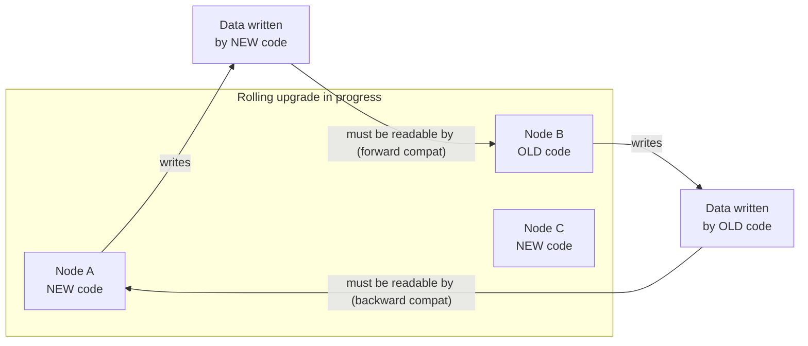
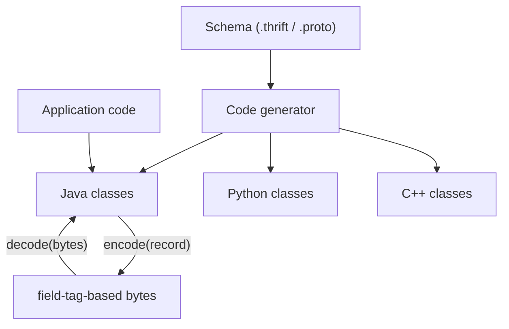
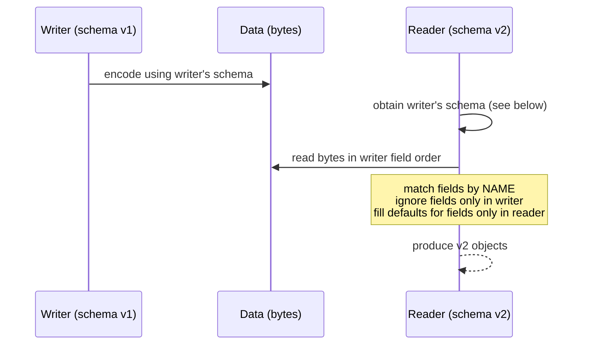
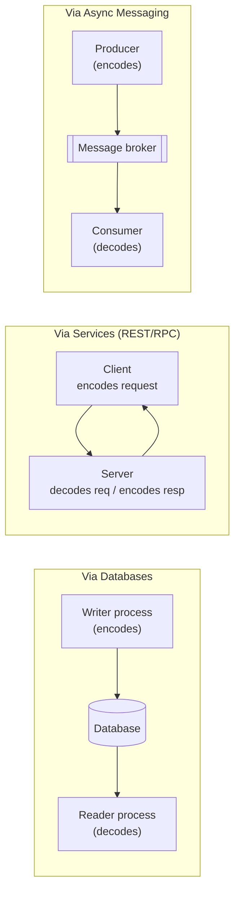
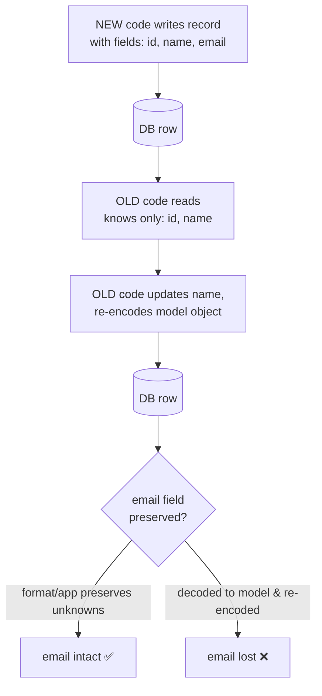
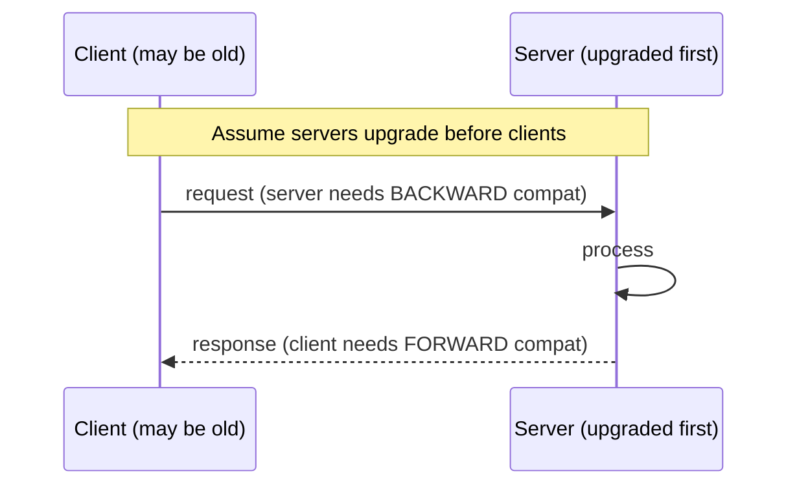

# DDIA Chapter 4: Encoding and Evolution

> Part I: Foundations of Data Systems | Maps to: data serialization, schema management, API design, and service-to-service communication in system design.

## 🎯 Chapter in One Paragraph

Applications change constantly, and every meaningful feature change tends to change the shape of the data an application stores or sends. Because large systems cannot be upgraded atomically — server fleets do rolling upgrades and client apps update on the user's whim — **old and new code, and old and new data formats, coexist**. To keep the system running smoothly during these overlaps you must preserve compatibility in **both directions**: *backward compatibility* (new code reads old data) and *forward compatibility* (old code reads new data). This chapter surveys how data is turned into bytes for storage or transmission (**encoding / serialization**) and back again (**decoding / deserialization**), comparing language-specific formats, textual formats (JSON, XML, CSV), and schema-driven binary formats (Thrift, Protocol Buffers, Avro). It then examines how those encodings behave in the three main *modes of dataflow* — through databases, through service calls (REST and RPC), and through asynchronous message passing (brokers and actors) — showing that with careful attention to schema evolution, painless rolling upgrades and long-lived evolvable systems are achievable.

## 🧠 Key Concepts & Vocabulary

- **Encoding (serialization / marshalling):** Translating an in-memory representation (objects, structs, lists, hash tables, pointers) into a self-contained byte sequence for storage or network transmission.
- **Decoding (parsing / deserialization / unmarshalling):** The reverse — reconstructing in-memory structures from a byte sequence.
- **Evolvability:** The property of being able to change a system easily over time; enabled by careful encoding choices and compatibility guarantees.
- **Backward compatibility:** Newer code can read data written by older code. Usually easy — you know the old format and can handle it explicitly.
- **Forward compatibility:** Older code can read (and importantly, *ignore*) data written by newer code. Trickier — old code must gracefully skip additions it doesn't understand.
- **Rolling upgrade (staged rollout):** Deploying a new version to a subset of nodes at a time, verifying, then continuing. Enables zero-downtime deploys but forces multiple versions to run simultaneously.
- **Schema-on-write (schema-on-read):** Relational DBs enforce one schema at a time (write-time). Schemaless/document DBs allow mixed old and new formats to coexist (read-time interpretation).
- **Field tag:** A small integer that identifies a field in Thrift/Protocol Buffers encoded data (a compact alias for the field name). Critical to the meaning of encoded bytes.
- **Writer's schema / Reader's schema (Avro):** The schema version used when data was written vs. the version the reading code expects. Avro resolves differences between them at read time.
- **Schema evolution:** The set of rules governing which schema changes preserve compatibility.
- **Variable-length integer (varint):** Encoding where small numbers use fewer bytes; the top bit of each byte signals whether more bytes follow.
- **Location transparency:** RPC's goal of making a remote call look like a local function call — an abstraction the chapter argues is fundamentally leaky.
- **Idempotence:** A property where performing an operation multiple times has the same effect as once; needed for safe retries of network requests.
- **Dataflow modes:** The channels through which encoded data moves between processes — databases, services (REST/RPC), and asynchronous message passing.
- **Message broker (message queue / message-oriented middleware):** An intermediary that stores messages temporarily and delivers them to consumers.
- **Actor model:** A concurrency model where logic is encapsulated in independent actors that communicate solely via asynchronous messages.

## 📚 Deep Dive

### Why compatibility matters: coexisting versions

When you change an application feature, you usually change its data. In a large system, the code change can't happen instantaneously:

- **Server side:** rolling upgrades deploy new code to a few nodes at a time.
- **Client side:** users may delay installing updates for a long time.

The consequence is illustrated below: at any instant multiple code versions and data-format versions are live at once.



- **Backward compatibility** = new code reads old data → usually easy (you know the old format).
- **Forward compatibility** = old code reads new data → harder (old code must ignore unknown additions).

### Formats for Encoding Data

Programs hold data in two representations that must be translated between: (1) in-memory structures optimized for CPU access (using pointers), and (2) a self-contained byte sequence for files/network (pointers make no sense to another process). *Encoding has nothing to do with encryption.*

#### Language-specific formats

Built-in serializers — Java's `java.io.Serializable`, Ruby's `Marshal`, Python's `pickle`, Kryo for Java — are convenient but carry deep problems:

- **Language lock-in:** Data is hard to read from another language; you commit to one language for a long time.
- **Security:** Decoding must instantiate arbitrary classes; an attacker who can feed you bytes may achieve remote code execution (see CWE-502).
- **Versioning is an afterthought:** Forward/backward compatibility is usually neglected.
- **Poor efficiency:** Java's built-in serialization is notorious for slow, bloated output.

**Verdict:** Fine only for transient purposes; a bad idea for anything persistent or cross-system.

#### JSON, XML, CSV (textual formats)

Widely known, widely supported, widely disliked. Subtle problems:

| Problem | JSON | XML | CSV |
|---|---|---|---|
| Number vs. string ambiguity | Distinguishes them | Cannot without schema | Cannot without schema |
| Integer vs. float | No distinction, no precision spec | — | — |
| Large integers (> 2⁵³) | Break in JS (IEEE 754 double) — Twitter sends tweet IDs twice (number + string) | — | — |
| Binary strings | Not supported → Base64 hack (+33% size) | Same | Same |
| Schema | Optional (rarely used) | Optional (fairly common) | None |
| Escaping edge cases | — | — | Commas/newlines ambiguous; parsers vary |

Despite flaws, they're "good enough" especially as **interchange formats between organizations**, where agreement matters more than efficiency.

#### Binary encodings

For internal data, you can drop the lowest-common-denominator format. Binary JSON variants (MessagePack, BSON, BJSON, UBJSON, BISON, Smile) and binary XML (WBXML, Fast Infoset) exist. Crucially, since they keep the JSON/XML model and *don't prescribe a schema*, they must still embed all field names inside the encoded data.

**Worked example (the running record):**
```json
{ "userName": "Martin", "favoriteNumber": 1337, "interests": ["daydreaming", "hacking"] }
```
- Textual JSON (whitespace removed): **81 bytes**
- MessagePack: **66 bytes** (marginal win; still embeds field names) — e.g. first byte `0x83` = object with 3 fields; `0xa8` = 8-byte string; then `userName` in ASCII, etc.

The real gains come from **schema-driven** formats, which encode the same record in ~32 bytes.

### Thrift and Protocol Buffers

Both are schema-required binary libraries built on the same principle (Protobuf from Google, Thrift from Facebook; both open-sourced 2007–08). You declare a schema in an IDL:

```
// Thrift IDL
struct Person {
  1: required string       userName,
  2: optional i64          favoriteNumber,
  3: optional list<string> interests
}
```
```
// Protocol Buffers
message Person {
  required string user_name       = 1;
  optional int64  favorite_number = 2;
  repeated string interests       = 3;
}
```

A code-generation tool produces classes in your language. The key trick: **field names are replaced by numeric field tags**. Encoded sizes for the example record:

| Encoding | Size | How |
|---|---|---|
| Textual JSON | 81 bytes | full field names |
| MessagePack | 66 bytes | binary JSON, still has field names |
| Thrift BinaryProtocol | 59 bytes | field tags + type annotations, full-width ints |
| Thrift CompactProtocol | 34 bytes | packs type+tag into one byte, varints |
| Protocol Buffers | 33 bytes | similar bit-packing, varints |
| Avro | 32 bytes | no tags at all |

`required` vs `optional` does **not** change the bytes; `required` only adds a runtime presence check (handy for catching bugs).



#### Field tags and schema evolution (Thrift / Protobuf)

An encoded record is just the concatenation of its encoded fields; each field = tag number + datatype annotation. Unset fields are omitted. Rules:

- **Change a field's name:** ✅ safe (names aren't in the bytes).
- **Change a field's tag:** ❌ breaks all existing data.
- **Add a field:** give it a **new** tag. Old code sees an unknown tag and skips it using the datatype annotation → **forward compatible**. New code reading old data works because tags keep meaning → **backward compatible** — but the new field must be `optional` or have a default (a new `required` field would fail when new code reads old data lacking it).
- **Remove a field:** only `optional` fields can be removed (never a `required` one); and **never reuse the old tag number** (old data may still carry it).

#### Datatypes and schema evolution

- Changing a datatype (e.g. `int32` → `int64`): possible but risky — reading a 64-bit value into 32-bit old code truncates it.
- **Protobuf `repeated`:** there's no list type; a repeated field is the same tag appearing multiple times. Nice side effect: you can turn an `optional` (single) field into `repeated` (multi). New code reading old data sees a list of 0 or 1 elements; old code reading new data sees only the last element.
- **Thrift `list<T>`:** a dedicated, parameterized type — supports nested lists, but does *not* allow the optional→repeated evolution Protobuf permits.

### Avro

Apache Avro (2009, a Hadoop subproject) is designed differently. Two schema languages: Avro IDL (human-editable) and a JSON-based one (machine-readable).

```
record Person {
    string               userName;
    union { null, long } favoriteNumber = null;
    array<string>        interests;
}
```

**No tag numbers, no field-type markers in the bytes.** The encoding is just values concatenated: a string is a length prefix + UTF-8 bytes; an integer is a varint. There is *nothing* in the data identifying which field or type a value is — so the bytes can only be decoded by code that knows the exact schema used to write them.

#### Writer's schema vs. Reader's schema

- **Writer's schema:** the schema the encoder used.
- **Reader's schema:** the schema the decoding code expects.
- The two need only be **compatible, not identical**. At read time the Avro library places both side by side and translates.



Resolution rules:
- Fields matched by **name**; different field order is fine.
- A field in writer but not reader → **ignored**.
- A field in reader but not writer → **filled with the reader's declared default**.

#### Avro schema evolution rules

- **Forward compat** = new-schema writer, old-schema reader.
- **Backward compat** = new-schema reader, old-schema writer.
- To keep both, you may **only add or remove a field that has a default value**.
  - Add a field *without* a default → breaks backward compatibility.
  - Remove a field *without* a default → breaks forward compatibility.
- Nulls aren't implicitly allowed: to make a field nullable you must use a **union type**, e.g. `union { null, long, string }`, and `null` can only be a default if it's a branch of the union (and must be the first branch).
- No `required`/`optional` markers — Avro uses union types + defaults instead.
- Changing a datatype is possible if Avro can convert it.
- Renaming a field: use **aliases** in the reader's schema → backward compatible but **not** forward compatible.
- Adding a branch to a union → backward but not forward compatible.

#### How does the reader learn the writer's schema?

You can't embed the whole schema per record (it'd dwarf the data). Solutions by context:

| Context | Mechanism |
|---|---|
| Large file, many records (Hadoop) | Include the writer's schema **once** at the file's start — Avro *object container files*. |
| Database, per-record writes | Store a **version number** with each record; keep a schema-version registry in the DB. Reader extracts version, fetches matching schema. (LinkedIn's Espresso works this way.) |
| Two processes over a network connection | **Negotiate** the schema version on connection setup (Avro RPC). |

A schema-version database is valuable anyway: it's documentation and lets you check compatibility. Version key can be an incrementing integer or a hash of the schema.

#### Dynamically generated schemas

Avro's lack of tag numbers makes it **friendly to dynamically generated schemas**. Example: dumping a relational DB to a file — generate an Avro schema from the table (column → field, mapped by name). If the DB schema later changes (add/remove a column), just regenerate the Avro schema; readers match old/new by field name automatically. With Thrift/Protobuf you'd have to carefully hand-assign field tags each time and never reuse an old one.

#### Code generation and dynamic languages

- Thrift/Protobuf rely on **code generation** — valuable in statically typed languages (Java, C++, C#) for efficient structs, type checking, IDE autocompletion.
- In dynamically typed languages (JS, Ruby, Python) code gen adds little value and is often unwanted.
- Avro provides **optional** code gen and works fine without it: an object container file is self-describing (embeds the writer's schema), so you can open it like a JSON file — great with tools like Apache Pig.

### The Merits of Schemas

Schema-driven binary formats descend from ideas as old as **ASN.1 (standardized 1984)** — whose DER binary encoding still encodes X.509 SSL certificates and which supports evolution via tag numbers, but is complex and poorly documented. Many databases also implement proprietary binary wire protocols (decoded by ODBC/JDBC drivers). Advantages of schema-based binary encodings:

- More compact than "binary JSON" (field names omitted).
- Schema doubles as **always-up-to-date documentation** (it's required to decode).
- A schema registry lets you **check compatibility before deployment**.
- Enables **compile-time type checking** via code generation in statically typed languages.

Net effect: the flexibility of schema-on-read, plus better guarantees and tooling.

### Modes of Dataflow

Compatibility is a relationship between an *encoder* and a *decoder*. Who plays each role depends on the dataflow mode.



#### Dataflow through databases

The writer encodes, the reader decodes. Even a single process reading its own past writes needs **backward compatibility** ("sending a message to your future self"). Because rolling upgrades mean newer and older code hit the DB simultaneously, **forward compatibility is also required**.

**The read-modify-write hazard:** newer code writes a new field; older code (unaware of it) reads the record, updates it, and writes it back — potentially **dropping the unknown field**. Encoding formats can preserve unknown fields, but if your app decodes into model objects and re-encodes, the unknown field may be lost. Be aware of this.



- **Data outlives code:** you may replace all app instances in minutes, but five-year-old data stays in its original encoding unless explicitly rewritten. Migrating data is possible but expensive on large datasets, so most DBs avoid it. Relational DBs typically allow adding a nullable column without rewriting rows (MySQL being an exception that often rewrites the whole table). LinkedIn's Espresso uses Avro storage to leverage Avro's evolution rules — the DB *appears* uniformly encoded even though rows on disk span many schema eras.
- **Archival storage:** snapshots/backups are written in one go, so encode them consistently in the latest schema — Avro object container files fit well, as does a column-oriented analytics format like **Parquet**.

#### Dataflow through services: REST and RPC

Client/server: servers expose an API (a *service*); clients call it. A server can itself be a client to another service — this decomposition is **service-oriented architecture (SOA)**, rebranded **microservices**. Unlike databases (arbitrary queries), services expose an application-specific API constrained by business logic, giving encapsulation. The design goal is **independent deployability and evolvability** — so old/new clients and servers coexist and their encodings must be cross-version compatible.

**Web services** = services using HTTP. Three contexts: client app → service over the public internet; service → service within a datacenter (middleware); org → org across the internet (public APIs, e.g. payment, OAuth).

Two philosophies:

| Aspect | REST | SOAP |
|---|---|---|
| Nature | Design philosophy over HTTP | XML-based protocol |
| Uses HTTP features? | Yes (URLs, caching, auth, content negotiation) | Aims to be HTTP-independent; avoids most HTTP features |
| Description format | OpenAPI / Swagger (optional) | WSDL (XML, not human-readable) |
| Tooling | Lightweight; curl/browser friendly | Heavy reliance on code gen & IDEs |
| Interoperability | Broad | Cross-vendor issues common |
| Trend | Predominant, esp. public/cross-org APIs | Declining; still in large enterprises |

**Why RPC's core abstraction is flawed.** RPC (since the 1970s; EJB, RMI — Java only; DCOM — Microsoft; CORBA — complex, no compat) tries to make a remote call look local (*location transparency*). But a network request differs from a local call:

- A local call is predictable (succeeds/fails on your inputs); a network request can be lost, slow, or hit an unavailable machine — outside your control; you must anticipate and retry.
- A local call returns, throws, or hangs; a network request adds **timeout with unknown outcome** — you can't tell if it executed.
- Retrying may duplicate the action if only the *response* was lost → you need **idempotence / deduplication**. Local calls never have this.
- Latency is roughly constant for local calls but **wildly variable** over a network.
- Parameters must be **encoded to bytes** (can't pass pointers) — awkward for large objects.
- Client and server may use **different languages** → the framework must translate datatypes (e.g. JS's > 2⁵³ integer problem).

**Current RPC frameworks** embrace the difference rather than hiding it: Thrift and Avro include RPC; **gRPC** uses Protobuf and supports **streams**; Finagle uses Thrift and **futures/promises**; Rest.li uses JSON over HTTP with futures. Many add **service discovery**. Custom binary RPC can outperform JSON-over-REST, but REST wins on experimentation, ubiquity, and tooling (servers, caches, load balancers, proxies, firewalls, monitoring) — hence REST dominates public APIs while RPC targets intra-org, intra-datacenter calls.

**Compatibility for RPC.** Reasonable simplifying assumption: **servers upgrade first, clients second**. So you need **backward compatibility on requests** and **forward compatibility on responses**. Compatibility properties are inherited from the encoding (Thrift/gRPC/Avro follow their rules; SOAP evolves XML schemas with pitfalls; RESTful JSON adds optional params/fields compatibly). Because RPC often crosses org boundaries and the provider can't force client upgrades, compatibility may need to be maintained **indefinitely**, often by running **multiple API versions side by side**. API versioning has no standard — common approaches: version in the URL, in the HTTP `Accept` header, or stored server-side per API key.



#### Message-passing dataflow

Asynchronous message passing sits between RPC and databases: like RPC, a message reaches another process with low latency; like databases, it goes via an intermediary (**message broker**) that stores it temporarily. Advantages over direct RPC:

- Buffers when the recipient is down/overloaded → improves reliability.
- Can **redeliver** to a crashed process → prevents message loss.
- Sender needn't know the recipient's IP/port (great for cloud VMs that come and go).
- One message can fan out to **several recipients**.
- **Decouples** sender from recipient (publisher doesn't care who consumes).

Messaging is usually **one-way** (fire-and-forget); a reply, if any, goes on a separate channel. **Message brokers** (historically TIBCO, IBM WebSphere, webMethods; now RabbitMQ, ActiveMQ, HornetQ, NATS, Apache Kafka) route a message sent to a named **queue/topic** to one or more consumers/subscribers; many producers and consumers can share a topic.

Brokers don't enforce a data model — a message is just bytes + metadata, so **any encoding works**. If the encoding is backward and forward compatible you can change publishers and consumers independently, in any deploy order. Watch the same **preserve-unknown-fields** hazard if a consumer republishes a message to another topic.

**Distributed actor frameworks.** The actor model handles concurrency by encapsulating logic in *actors* — each holds private local state and communicates only via async messages; message delivery is *not* guaranteed. Distributed actor frameworks reuse the same message-passing across nodes, transparently encoding to bytes when crossing the network. Location transparency works *better* here than in RPC because the model already assumes messages can be lost. But rolling upgrades still require forward/backward compatibility:

| Framework | Default encoding | Rolling-upgrade support |
|---|---|---|
| Akka | Java built-in serialization (no compat) | Replace with Protobuf to gain it |
| Orleans | Custom format (no rolling-upgrade support) | Need new cluster + traffic move, or custom serialization plug-ins |
| Erlang OTP | Record schemas hard to change | Possible but must be carefully planned; experimental `maps` type may help |

## ⚠️ Edge Cases, Failure Modes & Gotchas

- **Forward compatibility is the hard direction.** Old code must *ignore* fields it doesn't understand rather than crash or drop them.
- **Read-modify-write drops unknown fields.** If old code reads a record with a new field, decodes it into a model object, and re-encodes, the new field can silently vanish. Preserve unknown fields at the application level (Figure 4-7 hazard).
- **Language-specific serialization = RCE risk.** Decoding untrusted bytes can instantiate arbitrary classes → remote code execution (CWE-502; historical WebLogic/WebSphere/JBoss/Jenkins vulnerabilities).
- **JSON large-integer corruption.** Integers > 2⁵³ lose precision as IEEE 754 doubles (JavaScript). Twitter sends tweet IDs both as a number *and* a decimal string to dodge this.
- **JSON/XML have no binary type.** Base64 works but bloats size ~33% and relies on schema to know it's Base64.
- **CSV ambiguity.** No schema; values with commas/newlines are error-prone and parsers implement escaping inconsistently.
- **Changing a Thrift/Protobuf field *tag*** invalidates all existing encoded data. Change names freely, never tags.
- **Reusing a removed tag number** corrupts meaning — old data carrying the old tag would be misread. Never reuse.
- **New `required` field breaks backward compatibility** — new code reading old data finds it missing and the presence check fails. New fields must be optional/defaulted.
- **Datatype widening (int32→int64) can truncate** when old 32-bit code reads a large value written by new 64-bit code.
- **Protobuf optional→repeated quirk:** old code reading a multi-valued new record sees only the *last* element; new code reading old single-valued data sees a 0-or-1-element list. Usually acceptable, occasionally surprising.
- **Avro reader/writer schema mismatch = garbage.** Because Avro bytes carry no field/type markers, decoding with the wrong schema silently produces wrong data. The writer's schema *must* be discoverable.
- **Avro add/remove without a default breaks compatibility** (no-default add breaks backward; no-default remove breaks forward).
- **Avro null handling:** a field isn't nullable unless `null` is a branch of a union, and `null` can only be the default if it's the *first* branch.
- **Avro aliases / union-branch additions** are backward- but not forward-compatible — asymmetric, easy to get wrong.
- **RPC timeout ambiguity:** a lost response leaves you unsure whether the operation ran; blind retries duplicate side effects unless the operation is idempotent.
- **Cross-org RPC compatibility is effectively permanent** — you can't force clients to upgrade, so you may run many API versions side by side indefinitely.
- **Message reordering / loss:** brokers and actor frameworks don't universally guarantee delivery or order; actor models explicitly assume messages can be lost.
- **Consumer republishing** re-triggers the unknown-field-preservation hazard across topics.
- **Data outlives code:** old rows retain old encodings for years; schema evolution — not one-time migration — is what makes the DB *appear* uniformly encoded.
- **MySQL rewrites whole tables** on some schema changes that other DBs handle without a rewrite — expensive on big tables.

## 🔑 Key Takeaways

- Systems must run **multiple code and data versions at once** during rolling upgrades and slow client updates.
- Aim for both **backward** (new reads old) and **forward** (old reads new) compatibility; forward is the trickier one.
- **Language-specific serializers** are convenient but insecure, language-locked, inefficient, and version-hostile — use only for transient data.
- **JSON/XML/CSV** are ubiquitous and great for cross-org interchange, but vague on datatypes and weak on compatibility guarantees.
- **Thrift/Protobuf** use numeric field tags: change names freely, never tags; add fields as optional/defaulted, remove only optional fields, never reuse tags.
- **Avro** uses writer's/reader's schema resolution with no tags — ideal for dynamically generated schemas and self-describing files; add/remove only defaulted fields.
- A **schema doubles as documentation and a compatibility-checking tool**, and enables compile-time safety via code generation.
- Match compatibility direction to the **dataflow mode**: DBs need both directions; RPC needs backward-on-requests + forward-on-responses (servers upgrade first); messaging needs both for order-independent deploys.
- **RPC's location transparency is a leaky abstraction** — network calls fail, time out, vary in latency, and require idempotent retries.
- With modest care, **evolvability, zero-downtime rolling upgrades, and frequent deploys are all achievable.**

## 💡 Real-World Applications & Examples

- **Google** built Protocol Buffers for internal service communication and storage; gRPC (Protobuf-based) powers vast internal and external microservice fleets.
- **Facebook** built Thrift for cross-language RPC across its services.
- **LinkedIn's Espresso** distributed document store uses **Avro** for on-disk storage, exploiting Avro schema evolution so the database appears uniformly encoded while rows span many schema versions. LinkedIn also drove Kafka + Avro schema management (Confluent Schema Registry).
- **Confluent Schema Registry** stores versioned Avro/JSON-Schema/Protobuf schemas for Kafka, enforcing compatibility on schema changes before producers can publish — the "database of schemas" the chapter recommends, in production.
- **Hadoop / Apache Pig / Apache Spark** consume Avro object container files (self-describing, one schema per file) for large record collections.
- **Data warehousing / analytics** pipelines snapshot operational DBs into **Parquet** (column-oriented) for efficient analytical scans.
- **Twitter's public API** returns tweet IDs as both number and string to survive JavaScript's 2⁵³ integer limit — a live example of JSON number ambiguity.
- **X.509 / SSL certificates** are still encoded with ASN.1 DER, the 1984 ancestor of tag-based schema evolution.
- **Public web APIs** (Stripe, OAuth providers) maintain many API versions simultaneously — Stripe pins each client's API version server-side and lets it be upgraded via an admin interface.
- **Akka / Orleans / Erlang OTP** actor systems illustrate that even message-driven frameworks must plan encoding to allow rolling upgrades.

## 🛠️ Open-Source Implementations (GitHub)

| Project | GitHub | How it relates to this chapter | Approx ⭐ |
|---|---|---|---|
| Protocol Buffers | https://github.com/protocolbuffers/protobuf | Canonical schema-driven binary encoding with field tags; the chapter's core Protobuf example | ~66k |
| Apache Thrift | https://github.com/apache/thrift | Cross-language schema + IDL + RPC; Binary/Compact protocols compared in the chapter | ~10k |
| Apache Avro | https://github.com/apache/avro | Tagless binary encoding with writer's/reader's schema resolution and dynamic schemas | ~3k |
| gRPC | https://github.com/grpc/grpc | Modern RPC framework on Protobuf with streaming — the chapter's "current directions for RPC" | ~45k |
| Confluent Schema Registry | https://github.com/confluentinc/schema-registry | Production "database of schemas" enforcing forward/backward compatibility for Kafka (Avro/JSON/Protobuf) | ~2k |
| Apache Parquet (Java) | https://github.com/apache/parquet-java | Column-oriented, analytics-friendly archival format referenced for data dumps | ~2.7k |
| Cap'n Proto | https://github.com/capnproto/capnproto | "Insanely fast" binary interchange + capability RPC; a modern schema-driven alternative | ~11k |
| FlatBuffers | https://github.com/google/flatbuffers | Zero-copy schema-driven serialization (Google); complements the Protobuf/Thrift/Avro family | ~24k |
| MessagePack | https://github.com/msgpack/msgpack | The "binary JSON" variant the chapter dissects byte-by-byte (Figure 4-1) | ~7k |

(Star counts are approximate and change over time.)

## 🔗 References & Further Reading

- Martin Kleppmann, *"Schema Evolution in Avro, Protocol Buffers and Thrift"* — https://martin.kleppmann.com/2012/12/05/schema-evolution-in-avro-protocol-buffers-thrift.html (the author's own deep dive, ref [19]).
- *Protocol Buffers Developer Guide*, Google — https://protobuf.dev/
- *Apache Avro Documentation* (schema resolution spec) — https://avro.apache.org/docs/
- *Apache Thrift* — https://thrift.apache.org/
- Jim Waldo, Geoff Wyant, Ann Wollrath, Sam Kendall, *"A Note on Distributed Computing"* (Sun Labs TR-94-29, 1994) — the classic critique of location transparency (ref [43]).
- Andrew D. Birrell & Bruce Jay Nelson, *"Implementing Remote Procedure Calls"*, ACM TOCS 1984 — foundational RPC paper (ref [42]).
- Roy T. Fielding, *"Architectural Styles and the Design of Network-Based Software Architectures"* (PhD thesis, 2000) — origin of REST (ref [34]).
- CWE-502: *Deserialization of Untrusted Data* — https://cwe.mitre.org/data/definitions/502.html (ref [5]).
- Pat Helland, *"Data on the Outside Versus Data on the Inside"* (CIDR 2005) — services vs. databases (ref [33]).
- Michi Henning, *"The Rise and Fall of CORBA"*, ACM Queue 2006 — why old RPC systems failed (ref [41]).
- *OpenAPI (Swagger) Specification* — https://swagger.io/specification/
- Jay Kreps, *"Putting Apache Kafka to Use: Building a Stream Data Platform (Part 2)"*, Confluent blog (ref [24]).

## ❓ Self-Check Questions

1. **Q: Define backward vs. forward compatibility and say which is usually harder.**
   A: Backward = new code reads old data (usually easy — you know the old format). Forward = old code reads new data (harder — old code must gracefully ignore unknown additions).

2. **Q: Why are language-specific serializers (pickle, Java Serializable) discouraged beyond transient use?**
   A: They lock you into one language, pose serious security risks (arbitrary class instantiation → RCE), treat versioning/compatibility as an afterthought, and are often inefficient/bloated.

3. **Q: In Thrift/Protobuf, which schema changes are safe and which break compatibility?**
   A: Safe: rename fields (names aren't in bytes); add fields with new optional/defaulted tags; remove optional fields. Unsafe: changing a field's tag; adding a `required` field; reusing a removed tag number; some datatype changes that truncate.

4. **Q: How does Avro decode data without embedding field tags or type markers in the bytes?**
   A: It uses the *writer's schema* (which must be discoverable) alongside the *reader's schema*, matching fields by name, ignoring writer-only fields, and filling reader-only fields with declared defaults. The bytes are just concatenated values interpreted in writer-schema order.

5. **Q: Give three ways a reader obtains the writer's schema in Avro.**
   A: (1) Object container file embeds the schema once at the file start; (2) per-record version number + a schema-version registry (as in Espresso); (3) schema negotiation at connection setup (Avro RPC).

6. **Q: Why is Avro friendlier than Thrift/Protobuf to dynamically generated schemas?**
   A: No tag numbers to hand-assign. You can regenerate the schema from, say, a changed DB table and match fields by name automatically, without manually managing (and never reusing) tag numbers.

7. **Q: What compatibility directions does RPC need, and why the asymmetry?**
   A: Backward compatibility on requests and forward compatibility on responses, because you can assume servers are upgraded before clients — so newer servers must handle old requests and older clients must handle new responses.

8. **Q: List three ways a network RPC call differs from a local function call.**
   A: It can be lost/timed-out with unknown outcome; retries may duplicate side effects (needs idempotence); latency is highly variable; parameters must be serialized (no pointers); languages may differ requiring datatype translation. (Any three.)

9. **Q: What is the read-modify-write hazard with schema evolution in databases?**
   A: Old code reads a record containing a field it doesn't know, updates it, and re-encodes — potentially dropping the unknown field. You must preserve unknown fields, especially when decoding into and re-encoding from model objects.

10. **Q: Why does "data outlives code," and how does schema evolution address it?**
    A: You can replace all running app instances in minutes, but old data stays in its original encoding for years unless rewritten (expensive). Schema evolution lets readers interpret many historical encodings so the store appears uniformly encoded without costly migrations.
