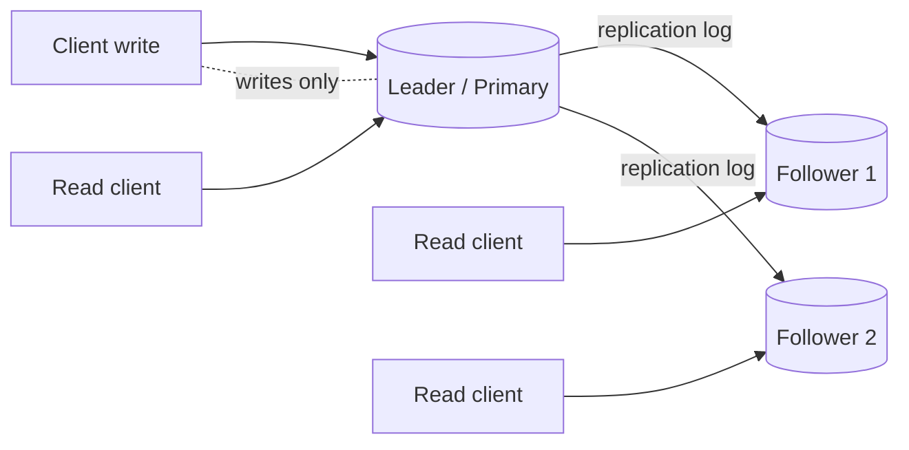
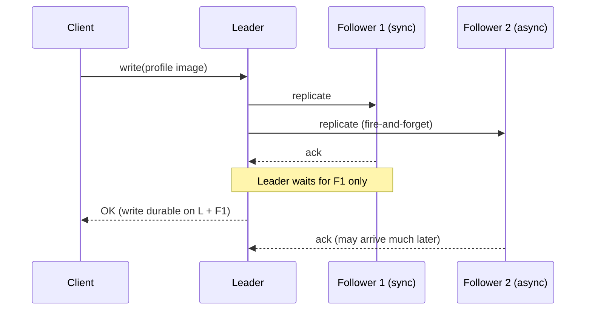
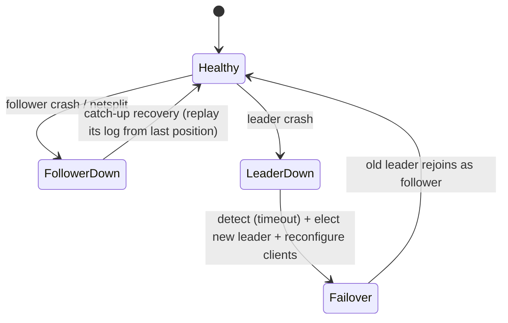
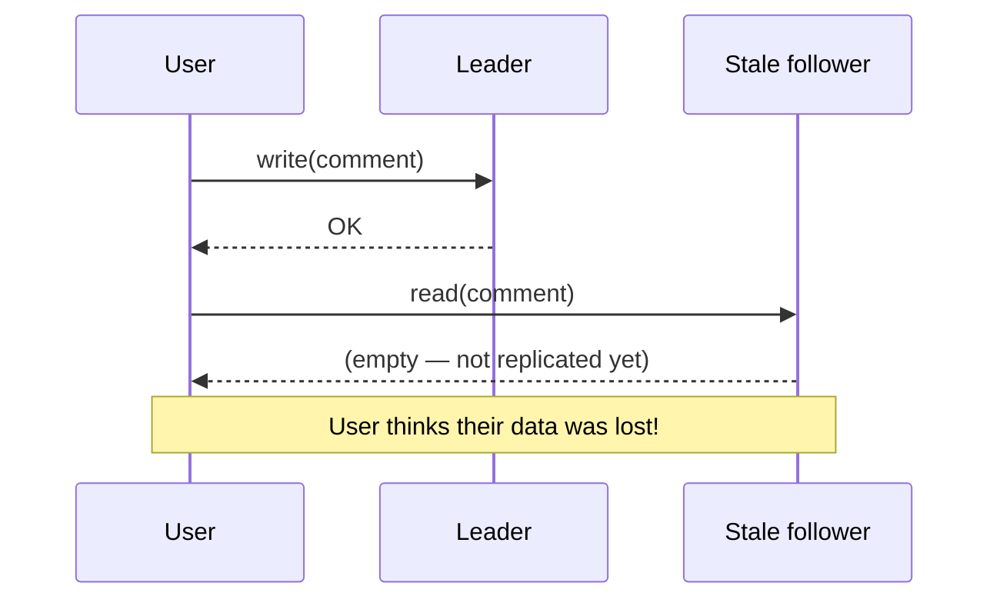
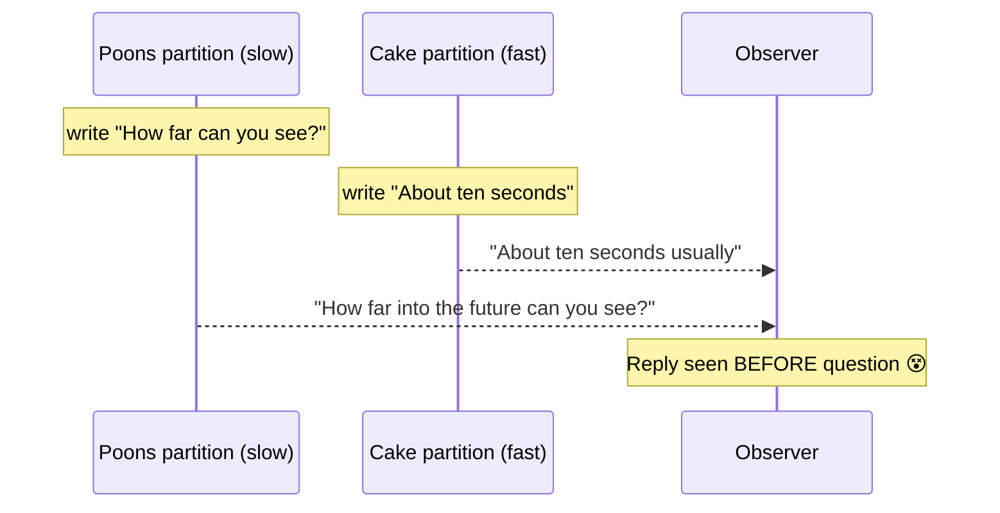
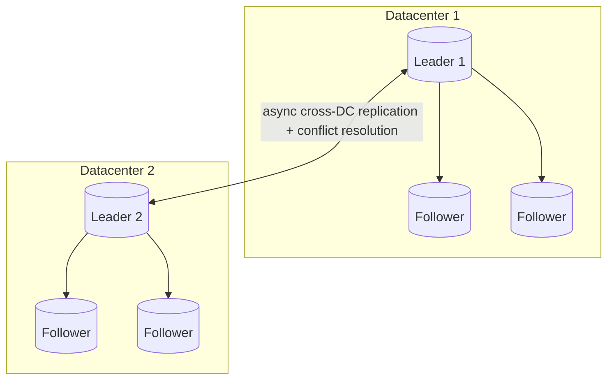
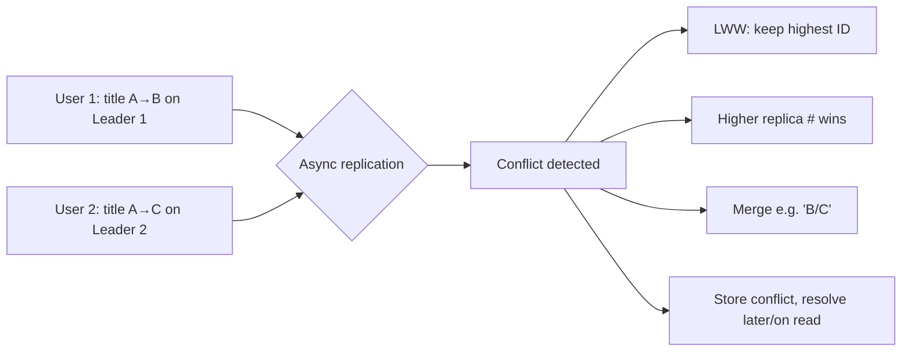
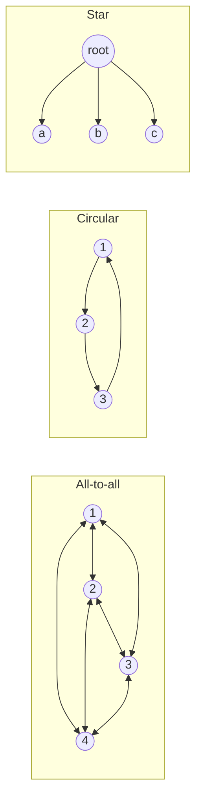
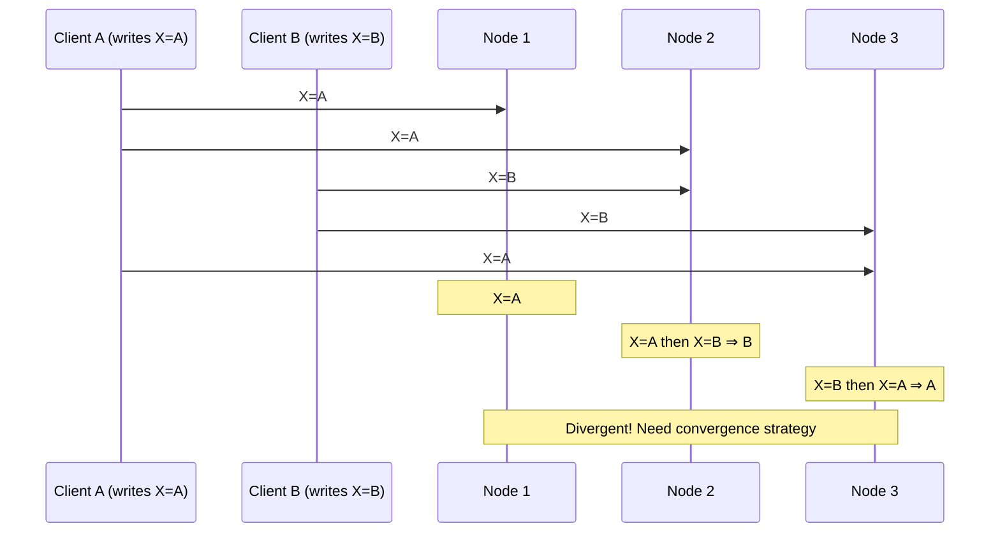
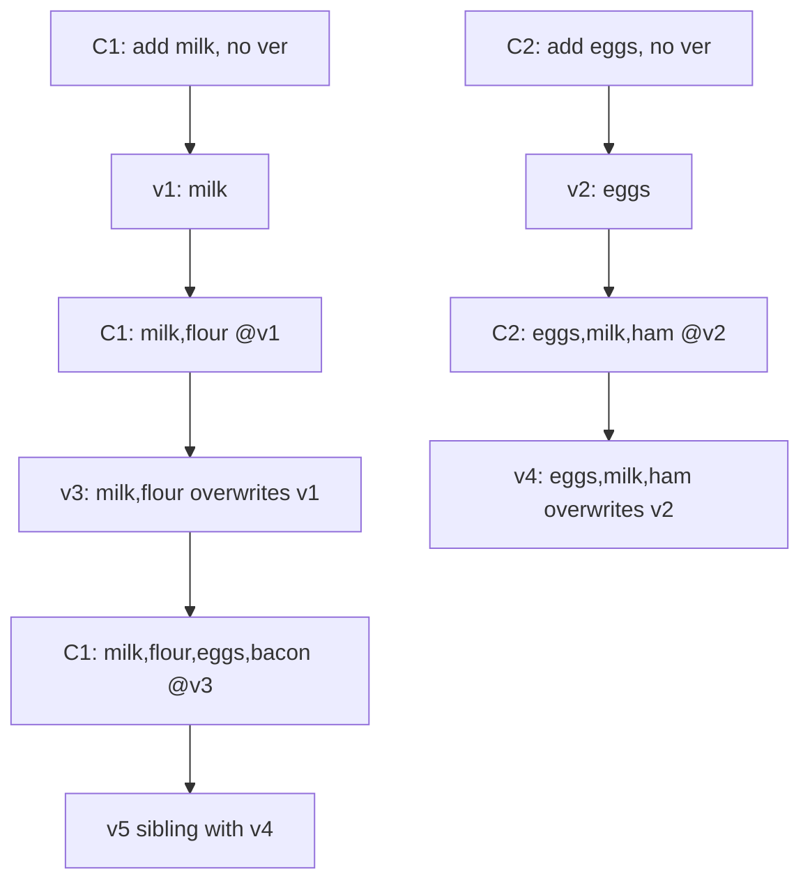

# DDIA Chapter 5: Replication

> Part II: Distributed Data | Maps to: [system-design/02-moderate/replication.md](../../system-design/02-moderate/replication.md)

## 🎯 Chapter in One Paragraph

Replication means keeping a copy of the same data on several machines connected by a network. We do it to reduce read latency (put data near users), to stay available when nodes fail, and to scale read throughput across many machines. Copying static data is trivial; the entire difficulty is propagating **changes**. This chapter dissects the three replication strategies that essentially every distributed database uses — **single-leader**, **multi-leader**, and **leaderless** — and the fundamental trade-offs each makes between consistency, durability, availability, and latency. The recurring villain is **replication lag**: because replication is usually asynchronous, replicas temporarily disagree ("eventual consistency"), which produces subtle, hard-to-test anomalies such as not being able to read your own writes, seeing time move backward, or seeing effects before causes. When more than one node can accept writes (multi-leader and leaderless), you additionally face **concurrent write conflicts**, which forces you to reason about causality (the *happens-before* relationship), version numbers, and version vectors to converge replicas without silently losing data.

## 🧠 Key Concepts & Vocabulary

- **Replica** — a node that stores a copy of the database.
- **Leader (master / primary)** — the one replica that accepts writes in leader-based replication.
- **Follower (read replica / slave / secondary / hot standby)** — a replica that receives the leader's change stream and serves reads only.
- **Replication log / change stream** — the ordered sequence of data changes the leader ships to followers.
- **Synchronous replication** — leader waits for a follower to confirm before reporting success; guarantees an up-to-date copy but blocks if the follower is unreachable.
- **Asynchronous replication** — leader reports success without waiting; fast and resilient, but confirmed writes can be lost if the leader dies before propagating.
- **Semi-synchronous** — one follower synchronous, the rest asynchronous (a practical middle ground).
- **Failover** — promoting a follower to leader after the leader fails; can be manual or automatic.
- **Split brain** — two nodes both believe they are leader; can corrupt or lose data.
- **Fencing / STONITH** ("Shoot The Other Node In The Head") — mechanism that forcibly disables a deposed/duplicate leader.
- **Statement-based replication** — ship the executed SQL statements; breaks on nondeterminism (`NOW()`, `RAND()`, autoincrement, triggers).
- **WAL shipping** — ship the physical write-ahead log; tightly coupled to storage engine/version.
- **Logical (row-based) log replication** — ship a storage-engine-independent row-change log (e.g., MySQL binlog); enables CDC and cross-version upgrades.
- **Trigger-based replication** — application-level replication via DB triggers/stored procedures; flexible but heavier and bug-prone.
- **Change Data Capture (CDC)** — using the logical log to feed external systems (warehouses, search indexes, caches).
- **Replication lag** — delay between a write on the leader and its visibility on a follower.
- **Eventual consistency (convergence)** — replicas converge to the same value if writes stop; says nothing about *when*.
- **Read-after-write (read-your-writes) consistency** — you always see your own submissions.
- **Monotonic reads** — you never see time go backward across successive reads.
- **Consistent prefix reads** — writes are seen in an order that respects causality (question before answer).
- **Multi-leader (master–master / active/active)** — multiple nodes accept writes and replicate to one another.
- **Write conflict** — the same datum concurrently modified on two leaders.
- **Conflict avoidance / convergent resolution / LWW / custom resolution** — strategies for resolving conflicts.
- **Last Write Wins (LWW)** — pick the write with the highest timestamp/ID; converges but silently loses data.
- **Replication topology** — the communication graph between leaders: all-to-all, circular, or star/tree.
- **Leaderless (Dynamo-style)** — clients write to and read from several replicas directly; no leader ordering.
- **Quorum** — write to `w` nodes, read from `r` nodes, out of `n`; if `w + r > n` the read and write sets overlap.
- **Read repair** — a reader detects a stale replica and writes the fresh value back.
- **Anti-entropy** — background process that copies missing data between replicas.
- **Sloppy quorum / hinted handoff** — accept writes on non-home nodes during a partition, then forward them home later.
- **Happens-before relationship** — A happens-before B if B knows about/depends on A; if neither knows the other, they are **concurrent**.
- **Sibling** — a concurrently-written value that must be kept and later merged (Riak's term).
- **Tombstone** — a deletion marker kept so a removed item does not reappear when merging siblings.
- **Version vector** — a set of per-replica version numbers used to detect concurrency across replicas (vs. a single **version number** per key on one replica).
- **CRDT (Conflict-free Replicated Data Type)** — data structures that merge concurrent edits automatically.

## 📚 Deep Dive

### 5.1 Leaders and Followers (Single-Leader Replication)

The dominant scheme is **leader-based replication**. One replica is the leader; all writes go to it, it applies them locally, then streams the changes to followers, which apply them **in the same order**. Reads may hit the leader or any follower, but writes are leader-only. This is built into PostgreSQL, MySQL, Oracle Data Guard, SQL Server Always On, MongoDB, RethinkDB, Espresso — and even message brokers like Kafka and RabbitMQ.



#### Synchronous vs. Asynchronous



| Mode | Durability of confirmed writes | Availability of writes | Latency | Practical use |
|------|-------------------------------|------------------------|---------|---------------|
| Fully synchronous (all followers) | Very strong | Terrible — any one node outage halts all writes | High | Impractical |
| Semi-synchronous (1 sync + rest async) | At least 2 nodes have the data | Good; promote another follower to sync if the sync one stalls | Moderate | Common |
| Fully asynchronous | Confirmed writes can be lost on leader failure | Best — leader never blocks | Lowest | Very common, esp. many/geo followers |

**Chain replication** is a synchronous variant that keeps performance high (used in Microsoft Azure Storage). There is a deep link between replication consistency and **consensus** (Chapter 9).

#### Setting Up New Followers (without downtime)
1. Take a consistent **snapshot** of the leader (no full-DB lock ideally; also needed for backups).
2. Copy the snapshot to the new follower.
3. Follower requests **all changes since the snapshot's exact log position** (PostgreSQL: *log sequence number*; MySQL: *binlog coordinates*).
4. Once the backlog is applied, the follower has **caught up** and streams live changes.

#### Handling Node Outages



- **Follower failure → catch-up recovery.** Easy: the follower knows its last applied transaction and requests everything since.
- **Leader failure → failover.** Hard. Automatic failover: (1) *detect* failure, usually by timeout; (2) *choose* a new leader (election / controller-appointed; prefer the most up-to-date replica — a consensus problem); (3) *reconfigure* so clients and followers use the new leader and the old leader steps down.

**Failover is fraught** (see Failure Modes below): lost writes with async replication, primary-key reuse (the real GitHub MySQL+Redis incident), split brain, and choosing the right timeout.

#### Implementation of Replication Logs

| Method | What ships | Pros | Cons |
|--------|-----------|------|------|
| **Statement-based** | The SQL statements | Compact | Nondeterminism (`NOW()`, `RAND()`, autoincrement, triggers, ordering) breaks it. MySQL pre-5.1; VoltDB makes it safe by requiring deterministic txns. |
| **WAL shipping** | Physical byte-level log of disk blocks | Reuses existing storage log | Tightly coupled to storage format → usually no leader/follower version mismatch → upgrades need downtime. PostgreSQL, Oracle. |
| **Logical (row-based)** | Row-level change records + commit markers | Decoupled from storage internals → cross-version/cross-engine upgrades; parseable by external tools → enables **CDC**. MySQL binlog. | Slightly larger than statement-based |
| **Trigger-based** | App code fires on writes, logs changes | Flexible: subsets, cross-DB, custom conflict logic. Databus, Bucardo, Oracle GoldenGate. | Higher overhead, more bugs |

### 5.2 Problems with Replication Lag

Read scaling ("read from many followers") only works with **async** replication — synchronous read-scaling would make one node's failure halt all writes. But async followers can lag, producing anomalies. Three canonical ones:

#### Reading Your Own Writes



**Fix — read-after-write consistency techniques:** read possibly-modified data from the leader (e.g., always read *your own* profile from the leader); or route reads to the leader for N seconds after a write; or have the client remember the write's timestamp/LSN and require a replica at least that fresh. Add complications for **cross-device** (metadata must be centralized) and **multi-datacenter** (route the user's devices to the same DC).

#### Monotonic Reads
A user reads a fresh replica, then a lagging one, and sees a comment *disappear* — time appears to go backward. **Fix:** make each user always read from the same replica (e.g., hashed by user ID). A guarantee stronger than eventual, weaker than strong consistency.

#### Consistent Prefix Reads
Mr. Poons asks a question; Mrs. Cake answers. An observer whose partitions replicate at different speeds may see the **answer before the question** — a causality violation.



**Fix:** ensure causally-related writes go to the same partition, or explicitly track causal dependencies.

**Ultimately**, coping with lag in application code is error-prone; **transactions** exist so the database can offer stronger guarantees and keep the app simple.

### 5.3 Multi-Leader Replication

Extend the model so **more than one node accepts writes**; each leader is simultaneously a follower of the others.



**Use cases:** multi-datacenter operation (lower write latency, per-DC availability, tolerance of flaky inter-DC links); **offline clients** (each device is a "datacenter", e.g., calendar apps, CouchDB); **collaborative editing** (Google Docs, Etherpad — small change units, no locking).

| Concern | Single-leader (multi-DC) | Multi-leader (multi-DC) |
|---------|--------------------------|-------------------------|
| Write performance | Every write crosses to the leader's DC | Local write, async cross-DC |
| DC outage tolerance | Failover to another DC | Each DC runs independently |
| Inter-DC network problems | Very sensitive (sync writes) | Tolerant (async) |
| Complexity | Lower | Higher — **conflicts** |

Tools: Tungsten Replicator (MySQL), BDR (PostgreSQL), GoldenGate (Oracle). Multi-leader is a retrofitted feature in many DBs → subtle pitfalls (autoincrement keys, triggers, constraints) → **often considered dangerous, avoid if possible**.

#### Handling Write Conflicts
In single-leader the second writer blocks or aborts. In multi-leader **both succeed** and the conflict is detected **asynchronously later** — often too late to ask the user.



- **Conflict avoidance** (best when possible): route all writes for a record to the same "home" leader. Breaks down on DC failover / user relocation.
- **Convergent resolution:** LWW (data-loss-prone), highest-replica-ID (also lossy), merge values, or record the conflict explicitly.
- **Custom logic** *on write* (Bucardo/Perl handler, runs in background, can't prompt user) or *on read* (store all siblings, resolve on next read — CouchDB). Resolution is **per row/document**, not per transaction.
- **Automatic resolution research:** **CRDTs** (Riak 2.0), **mergeable persistent data structures** (Git-like 3-way merge), **operational transformation** (Google Docs/Etherpad). The Amazon shopping-cart bug (removed items reappearing) is the canonical warning.

#### Topologies



- **Circular/star:** writes hop through nodes; each write is tagged with the node IDs it passed to **prevent infinite loops**. Fragile: one node failure interrupts the flow (needs manual reconfiguration).
- **All-to-all:** more fault tolerant (multiple paths), but messages can **overtake** each other → a row `UPDATE` can arrive before its `INSERT` (a causality problem). Timestamps aren't enough (clocks disagree); use **version vectors**. Beware: many systems implement this poorly (PostgreSQL BDR historically no causal ordering; Tungsten doesn't even try to detect conflicts).

### 5.4 Leaderless Replication (Dynamo-style)

Abandon the leader: clients (or a coordinator that does not impose ordering) send each write to **several replicas**, and read from **several replicas in parallel**. Inspired by Amazon Dynamo → Riak, Cassandra, Voldemort. (Note: AWS **DynamoDB** is *single-leader*, unlike in-house Dynamo.)

```mermaid
sequenceDiagram
    participant Cl as Client
    participant R1 as Replica 1
    participant R2 as Replica 2
    participant R3 as Replica 3 (down)
    Cl->>R1: write v7
    Cl->>R2: write v7
    Cl->>R3: write v7 (missed — node down)
    R1-->>Cl: ok
    R2-->>Cl: ok
    Note over Cl: 2/3 acks ⇒ write succeeds
    R3->>R3: comes back online (still has v6)
    Cl->>R1: read
    Cl->>R2: read
    Cl->>R3: read
    R1-->>Cl: v7
    R2-->>Cl: v7
    R3-->>Cl: v6 (stale)
    Note over Cl,R3: Version numbers pick v7; read repair pushes v7 back to R3
```

**No failover** exists; a down node is simply outvoted. Catch-up mechanisms:
- **Read repair:** reader detects the stale replica and writes the newer value back. Great for frequently-read data.
- **Anti-entropy:** background diff-and-copy process; no ordering guarantee, can lag. (Voldemort lacks it → rarely-read values may go missing → reduced durability.)

#### Quorums for Reading and Writing
With `n` replicas, a write needs `w` acks and a read queries `r` nodes. **If `w + r > n`, the read and write sets overlap**, so a read sees at least one up-to-date node.

```mermaid
flowchart LR
    subgraph n=5, w=3, r=3
        W[Write to 3 nodes] --> O{Overlap guaranteed}
        R[Read from 3 nodes] --> O
        O --> Fresh[At least 1 read node has latest]
    end
```

- Common: odd `n` (3 or 5), `w = r = (n+1)/2`.
- Tolerance: `n=3,w=2,r=2` tolerates 1 down node; `n=5,w=3,r=3` tolerates 2.
- Read-heavy tweak: `w=n, r=1` (fast reads, but any single failed node blocks all writes).
- If fewer than `w`/`r` respond, the operation errors.

#### Limitations of Quorum Consistency
Even `w + r > n` is **not an absolute guarantee**. Stale reads can still occur:
- **Sloppy quorum** — read/write sets may not overlap.
- **Concurrent writes** — ordering undefined; LWW loses data on clock skew.
- **Write concurrent with read** — read may see old or new.
- **Partial write failure** (succeeded on < `w` nodes) — not rolled back; later reads may or may not see it.
- **Node with new value fails and is restored from an old replica** — count of fresh replicas drops below `w`.
- **Unlucky timing** — see "Linearizability and quorums" (Ch. 9).

Dynamo-style DBs are tuned for eventual consistency; `w`/`r` adjust the *probability* of stale reads. You generally **do not** get read-your-writes, monotonic, or consistent-prefix guarantees — those need transactions/consensus.

**Monitoring staleness:** easy for leader-based (measure log-position lag); hard for leaderless (no fixed write order). Quantifying "eventual" is important for operability.

#### Sloppy Quorums and Hinted Handoff
During a network partition a client may reach *some* nodes but not the `w`/`r` "home" nodes. A **sloppy quorum** accepts the write on other reachable nodes (like sleeping on a neighbor's couch); once healed, **hinted handoff** forwards those writes home. This boosts **write availability** but means even `w + r > n` cannot guarantee reading the latest value until handoff completes — so it "isn't really a quorum." Defaults: on in Riak, off in Cassandra/Voldemort. Leaderless also suits **multi-datacenter** operation (Cassandra/Voldemort count all DCs in `n` but wait only for local quorum; Riak keeps `n` within one DC and replicates cross-DC async).

### 5.5 Detecting Concurrent Writes

Because clients write concurrently to the same key and messages arrive in different orders at different nodes, replicas can permanently diverge unless they converge deliberately.



- **Last Write Wins (LWW):** attach a timestamp, keep the biggest, discard the rest. Converges but **loses data** (Cassandra's only method; optional in Riak). Safe only if keys are written once and treated immutable (e.g., use a UUID per write).
- **Happens-before & concurrency:** A *happens-before* B if B builds on A (e.g., an `increment` that reads a prior `insert`). Two ops are **concurrent** if neither knows of the other — regardless of wall-clock time (an analogy to relativity; slow/interrupted networks make wall-clock overlap irrelevant).

#### Capturing happens-before with version numbers (single replica)
Shopping-cart algorithm:
1. Server keeps a **version number per key**, incremented on each write, stored with the value.
2. On read, server returns **all non-overwritten values (siblings)** plus the latest version. A client must read before writing.
3. On write, the client sends the version number from its prior read and **merges** all values it saw.
4. The server **overwrites** values at or below that version (they were merged in) but **keeps** higher-version values (concurrent).



#### Merging siblings & tombstones
Merging concurrent values (Riak calls them **siblings**) is the same problem as multi-leader conflict resolution. Union works for adds (`[milk,flour,eggs,bacon] ∪ [eggs,milk,ham]`), but naive union makes **removed items reappear** — so deletions leave a **tombstone** (a deletion marker with a version). **CRDTs** (Riak datatypes) automate correct merges including deletions.

#### Version Vectors (multiple replicas)
A single version number is insufficient with multiple leaderless replicas. Use a **version number per replica per key**; each replica increments its own and tracks the numbers it has seen from others. The full collection is a **version vector** (Riak's *dotted version vector*, encoded as a *causal context* string sent to and from clients). It safely allows read-from-one-replica / write-to-another without data loss (siblings may be created but nothing is lost if merged correctly).

> **Version vector ≠ vector clock** — subtly different; for comparing replica states, version vectors are the right tool.

## ⚠️ Edge Cases, Failure Modes & Gotchas

- **Async failover loses committed writes.** A promoted follower may lack the old leader's latest writes; the standard "solution" is to discard them — violating clients' durability expectations.
- **Primary-key reuse after failover (real GitHub incident).** A lagging MySQL follower was promoted; its autoincrement counter reused keys the old leader had assigned. Those keys were also referenced in Redis → cross-store inconsistency → **private data disclosed to wrong users**. Discarding writes is especially dangerous when external systems must stay coordinated.
- **Split brain.** Two nodes both think they're leader; if both accept writes with no conflict resolution, data is lost/corrupted. Fencing/STONITH shuts one down — but a badly designed mechanism can shut down **both** nodes.
- **Failover timeout tuning.** Too long → slow recovery; too short → spurious failovers on load spikes / network glitches, which pile more load onto an already struggling system and make things worse. (Many teams do failover manually for this reason.)
- **Statement-based replication nondeterminism.** `NOW()`, `RAND()`, autoincrement, `UPDATE ... WHERE`, triggers/stored procedures/UDFs with side effects diverge across replicas.
- **WAL version coupling.** Physical WAL ties leader and follower to the same storage format/version → zero-downtime rolling upgrades are usually impossible.
- **Reading your own writes fails** on a stale follower right after a write.
- **Monotonic-read violation:** hitting a fresh then a lagging replica makes data appear then vanish (time goes backward).
- **Consistent-prefix violation:** partitions replicating at different speeds can surface an answer before its question (causality broken).
- **Cross-device / cross-DC read-after-write:** timestamp tricks fail because devices don't share metadata and may route to different DCs.
- **Multi-leader conflicts are detected late** (asynchronously), often after it's too late to ask the user.
- **LWW silently drops data**, and may even drop **non-concurrent** writes due to clock skew ("timestamps for ordering events").
- **Circular/star topology single point of failure:** one dead node interrupts replication until manually reconfigured; requires loop-prevention tagging.
- **All-to-all message overtaking:** an `UPDATE` may arrive before its `INSERT`; timestamps can't fix it because clocks aren't synchronized.
- **Quorum staleness even with `w + r > n`:** sloppy quorums, concurrent read/write, partial write failures not rolled back, node restored from stale replica, and unlucky timing all break the "latest value" assumption.
- **Sloppy quorum isn't a quorum:** guarantees durability (data on *some* `w` nodes) but not that a subsequent `r`-read sees it until hinted handoff completes.
- **Read-repair-only stores** can return *ancient* values for rarely-read keys (no anti-entropy → reduced durability).
- **Amazon shopping-cart bug:** buggy conflict handler kept added items but dropped removals → items reappeared in carts. Union-merging siblings without tombstones reintroduces deleted items.
- **Per-row conflict resolution:** a multi-write transaction has each write resolved separately, not atomically.

## 🔑 Key Takeaways

- Replication exists for **availability, latency, disconnected operation, and read scalability**; all the hard parts are in propagating **changes**.
- **Single-leader** is the default: simplest, no write conflicts, but a single write bottleneck and a tricky failover story.
- **Sync vs. async** is the central durability/availability trade-off; **semi-synchronous** is the pragmatic compromise; fully-async can lose confirmed writes.
- **Replication lag ⇒ eventual consistency**, which breaks intuitive guarantees. Layer **read-after-write, monotonic reads, and consistent-prefix reads** where users would otherwise be confused.
- **Multi-leader and leaderless** buy availability/geo-locality but force you to handle **write conflicts** and reason about **causality**.
- **Quorums (`w + r > n`)** make stale reads *unlikely*, not impossible; treat `w`/`r` as probabilistic dials, not guarantees.
- Detecting concurrency needs **version numbers / version vectors**; **LWW converges but loses data**.
- Prefer **conflict avoidance**; when unavoidable, prefer principled merges (**CRDTs**, tombstones) over naive LWW.
- Prefer **logical/row-based logs** — they decouple replication from storage, enable **CDC** and rolling upgrades.
- Strong guarantees ultimately require **transactions (Ch. 7)** and **consensus (Ch. 9)**.

## 💡 Real-World Applications & Examples

- **PostgreSQL / MySQL / Oracle / SQL Server:** single-leader with sync/async knobs; PostgreSQL WAL streaming, MySQL binlog (row-based). Read replicas offload analytics/reporting.
- **Web read-scaling:** many async followers serve reads; leader handles writes — but read-your-writes must be handled (read own profile from leader).
- **GitHub (cautionary tale):** MySQL + Redis inconsistency from failover primary-key reuse — a real production data-leak incident.
- **Cassandra / Riak / Voldemort:** leaderless Dynamo-style, tunable `n`/`w`/`r`, read repair + anti-entropy, LWW (Cassandra) or siblings/CRDTs (Riak). Used for high-availability, low-latency, multi-DC workloads.
- **Kafka & RabbitMQ:** leader-based replication for partitions/queues.
- **CouchDB:** multi-leader sync built for offline-first apps and mobile.
- **Google Docs / Etherpad:** collaborative editing via operational transformation (multi-leader in spirit).
- **Debezium + Kafka:** CDC on top of logical logs to feed warehouses, search indexes, and caches.
- **Vitess (YouTube/PlanetScale):** MySQL clustering/sharding with VReplication for online resharding and change streams.
- **Azure Storage:** chain replication (synchronous variant) for durability without sacrificing throughput.

## 🛠️ Open-Source Implementations (GitHub)

| Project | GitHub | How it relates to this chapter | Approx. stars |
|---------|--------|-------------------------------|---------------|
| PostgreSQL (mirror) | https://github.com/postgres/postgres | WAL-shipping + logical single-leader replication, sync/async followers | ~17k |
| Vitess | https://github.com/vitessio/vitess | MySQL clustering; VReplication streams changes for resharding/failover | ~19k |
| Debezium | https://github.com/debezium/debezium | Change Data Capture from logical logs (MySQL binlog, Postgres WAL) into event streams | ~11k |
| Apache Cassandra | https://github.com/apache/cassandra | Leaderless Dynamo-style: tunable quorums, read repair, anti-entropy, LWW | ~9k |
| Riak KV | https://github.com/basho/riak | Leaderless with siblings, dotted version vectors, CRDT datatypes, sloppy quorum/hinted handoff | ~4k |
| Apache CouchDB | https://github.com/apache/couchdb | Multi-leader sync for offline/replicated apps; on-read conflict resolution | ~6k |
| MongoDB | https://github.com/mongodb/mongo | Single-leader (primary/secondary) replica sets with automatic failover | ~27k |
| YugabyteDB | https://github.com/yugabyte/yugabyte-db | Raft-based replication (consensus-backed strong consistency), a modern take on the Ch.5/Ch.9 link | ~9k |
| etcd | https://github.com/etcd-io/etcd | Raft consensus used for leader election / linearizable coordination (referenced re: failover & consensus) | ~48k |

(Star counts are approximate and change over time; check each repo for the current figure.)

## 🔗 References & Further Reading

- Werner Vogels, "Eventually Consistent," *ACM Queue*, 2008 — https://queue.acm.org/detail.cfm?id=1466448
- Douglas B. Terry et al., "Session Guarantees for Weakly Consistent Replicated Data" (PDIS 1994) — origin of read-your-writes / monotonic reads / consistent-prefix guarantees. doi:10.1109/PDIS.1994.331722
- Douglas B. Terry, "Replicated Data Consistency Explained Through Baseball," Microsoft Research MSR-TR-2011-137, 2011.
- DeCandia et al., "Dynamo: Amazon's Highly Available Key-value Store" (SOSP 2007) — the leaderless/quorum/sloppy-quorum model. https://www.allthingsdistributed.com/files/amazon-dynamo-sosp2007.pdf
- Shapiro et al., "Conflict-free Replicated Data Types (CRDTs)," 2011 — https://hal.inria.fr/inria-00609399
- van Renesse & Schneider, "Chain Replication for Supporting High Throughput and Availability" (OSDI 2004).
- Martin Kleppmann & Alastair Beresford, "A Conflict-Free Replicated JSON Datatype," arXiv:1608.03960 — https://arxiv.org/abs/1608.03960
- John Daily, "Clocks Are Bad, or, Welcome to the Wonderful World of Distributed Systems," Basho, 2013.
- Bruce Lindsay et al., "Notes on Distributed Databases," IBM Research RJ2571, 1979 — the classical foundations.
- PostgreSQL streaming/logical replication docs — https://www.postgresql.org/docs/current/high-availability.html
- Debezium documentation — https://debezium.io/documentation/
- Cross-link (this repo): [system-design/02-moderate/replication.md](../../system-design/02-moderate/replication.md)

## ❓ Self-Check Questions

1. **Why can't all followers be synchronous?**
   Any single unreachable follower would block *all* writes on the leader. In practice one follower is synchronous (semi-synchronous) so at least two nodes hold each write, while the rest are asynchronous for availability.

2. **What are the three failover steps, and name two ways they go wrong.**
   Detect the leader failure (usually by timeout), choose a new leader (a consensus problem — prefer the most up-to-date replica), reconfigure clients/followers. Failure modes: async replication loses unreplicated writes; split brain (two leaders); primary-key reuse causing cross-system inconsistency; bad timeout causing spurious failovers.

3. **Why is logical (row-based) replication preferred over WAL shipping?**
   It decouples the replication log from storage-engine internals, so leader and follower can run different versions/engines (enabling rolling zero-downtime upgrades), and external tools can parse it for Change Data Capture.

4. **Distinguish read-after-write, monotonic reads, and consistent-prefix reads.**
   Read-after-write: you see your own writes. Monotonic reads: successive reads never move backward in time. Consistent-prefix: writes are observed in a causally sensible order (question before answer).

5. **When does multi-leader replication make sense, and what's its core risk?**
   Multi-DC operation, offline clients, and collaborative editing. Core risk: concurrent write conflicts detected asynchronously, requiring convergent conflict resolution.

6. **State the quorum condition and explain why it still permits stale reads.**
   `w + r > n` forces the read and write node sets to overlap. It can still return stale data with sloppy quorums, concurrent writes, partial write failures not rolled back, a fresh node restored from a stale replica, or unlucky timing.

7. **What's the difference between a sloppy quorum and a strict quorum?**
   A strict quorum uses the `n` designated home nodes so read/write sets overlap. A sloppy quorum accepts writes on other reachable nodes during a partition (with hinted handoff to forward them later); it assures durability but not that a later read sees the value until handoff completes.

8. **Why is Last Write Wins dangerous, and when is it acceptable?**
   Among concurrent writes only the highest-timestamp one survives; the rest are silently dropped, and clock skew can even drop non-concurrent writes. Acceptable only when keys are written once and treated as immutable (e.g., a UUID per write) or when losing data is fine (some caches).

9. **How do version vectors differ from a single version number, and why are they needed?**
   A single version number per key works on one replica. With multiple leaderless replicas you need a version number *per replica* per key (the version vector) so the system can correctly distinguish overwrites from concurrent writes and safely read from one replica and write to another.

10. **What is a tombstone and what problem does it solve?**
    A deletion marker with a version number. When merging siblings, naive union would resurrect deleted items; the tombstone records that an item was removed so the merge preserves the deletion.
