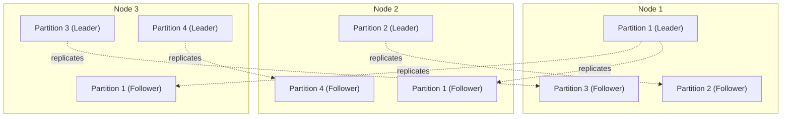
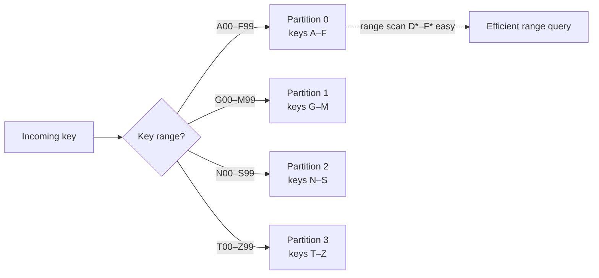
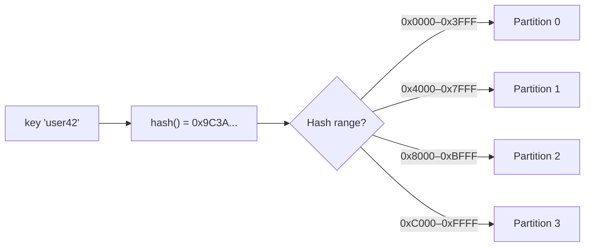
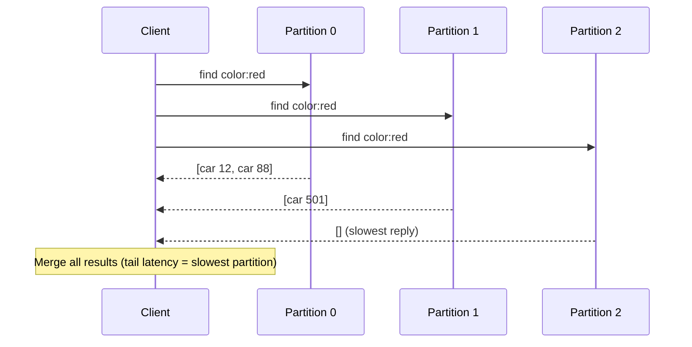
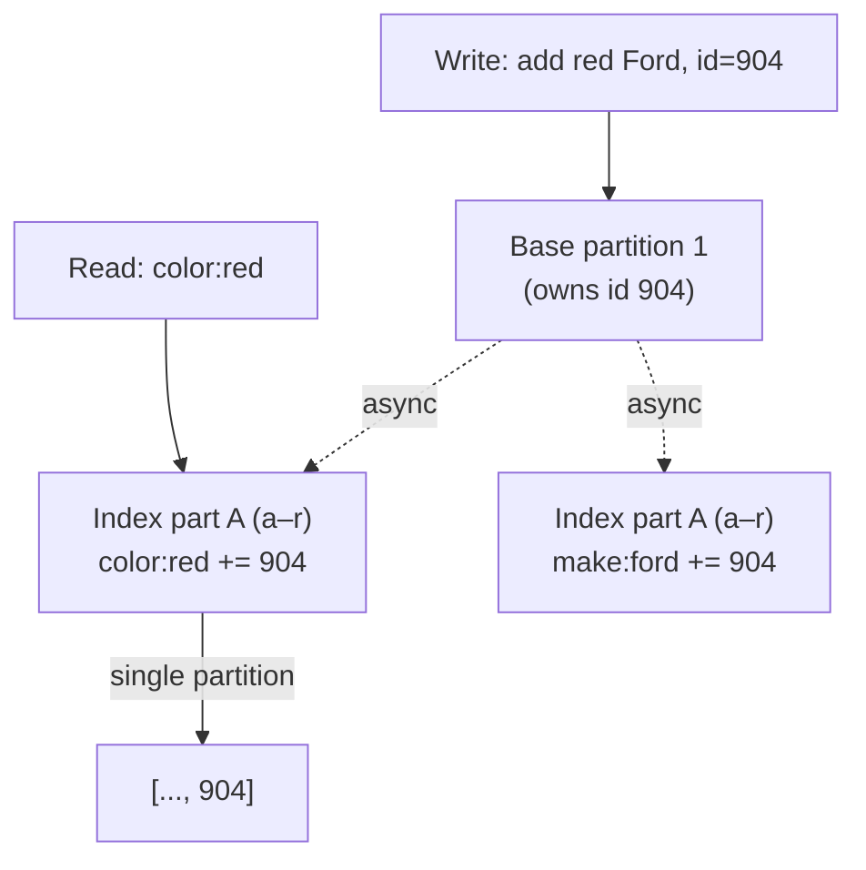
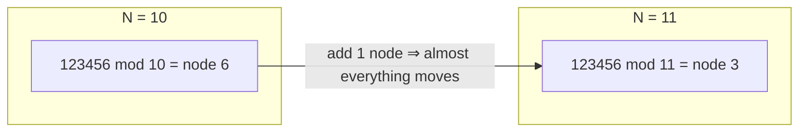
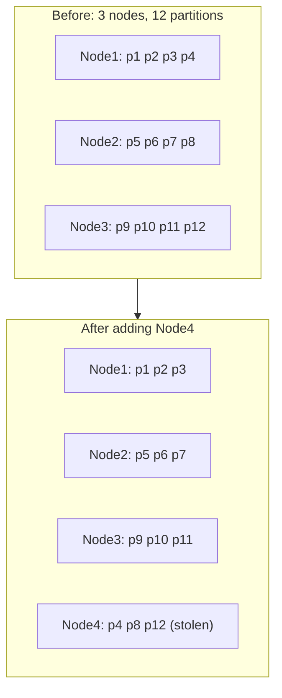
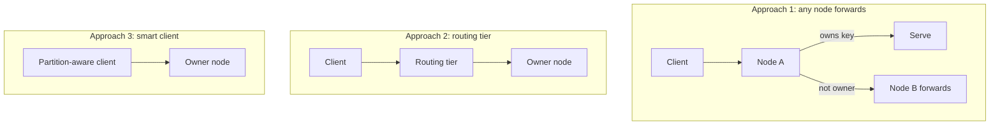
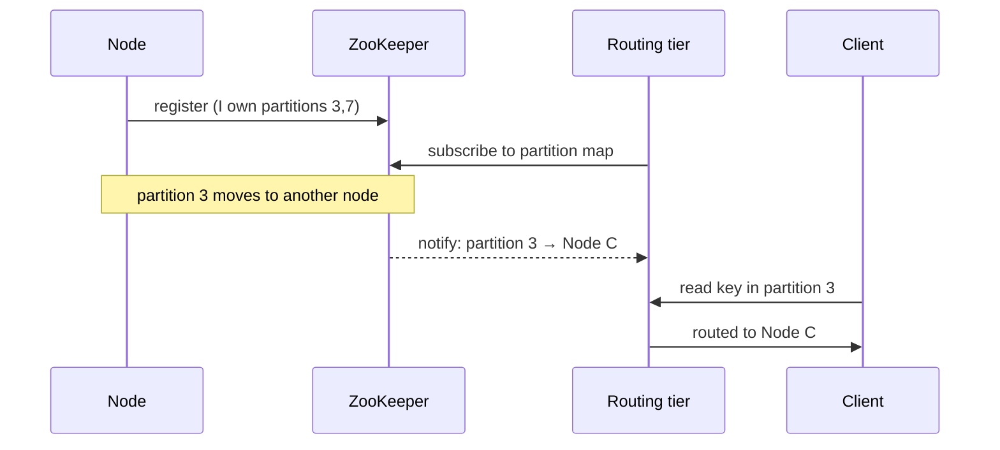

# DDIA Chapter 6: Partitioning

> Part II: Distributed Data | Maps to: [Database Sharding](../../system-design/02-moderate/database-sharding.md) · [Consistent Hashing](../../system-design/02-moderate/consistent-hashing.md)

## 🎯 Chapter in One Paragraph

Replication (Chapter 5) keeps multiple copies of the *same* data so the system survives node failure and serves more reads. But when a dataset is too large to fit—or too write-heavy to serve—on a single machine, copying it everywhere doesn't help. **Partitioning** (a.k.a. *sharding*) solves the other half of the problem: it splits the dataset into independent pieces, each of which lives on a subset of nodes, so that storage capacity, write throughput, and query load all scale roughly linearly with the number of machines. The chapter explains how to decide which record goes to which partition (by key range vs. by hash of key), how to keep the distribution even and avoid **hot spots** and **skew**, how secondary indexes complicate the picture (local/document-partitioned vs. global/term-partitioned), how to **rebalance** partitions as nodes come and go without moving more data than necessary, and finally how clients **route** requests to the node that actually owns a given key. Partitioning is almost always combined with replication, so in practice each partition has a leader and followers spread across nodes.

## 🧠 Key Concepts & Vocabulary

- **Partition (shard):** A subset of a dataset such that every record belongs to exactly one partition. Called *shard* (MongoDB, Elasticsearch, SolrCloud), *region* (HBase), *tablet* (Bigtable), *vnode* (Cassandra, Riak), and *vBucket* (Couchbase). DDIA standardizes on "partition."
- **Sharding:** Synonym for partitioning; horizontal splitting of data across nodes.
- **Shared-nothing architecture:** Each node has its own CPU, RAM, and disk; nodes coordinate only over the network. The dominant model for scaling internet services cheaply.
- **Skew:** Uneven distribution of data or load so that some partitions carry disproportionately more than others; makes partitioning far less effective.
- **Hot spot:** A single partition (or key) that receives a disproportionately high share of load—the extreme failure of even distribution.
- **Key-range partitioning:** Assign a contiguous, sorted range of keys `[min, max)` to each partition (like volumes of an encyclopedia). Enables efficient range scans; risks hot spots on sequential keys.
- **Hash partitioning:** Apply a hash function to the key and assign each partition a range of *hash* values. Distributes load evenly but destroys key ordering (range scans become expensive).
- **Consistent hashing:** Karger et al.'s technique of randomly chosen partition boundaries over a hash ring, originally for CDN caches. *Unrelated* to replica consistency or ACID consistency. DDIA notes it works poorly for databases and advises calling it "hash partitioning."
- **Compound / concatenated key:** A multi-column key where only the first column determines the partition and the rest provide sort order within the partition (Cassandra's approach; a hybrid of range and hash).
- **Secondary index:** An index that finds records by a non-primary attribute (e.g., "all red cars"); does not identify records uniquely.
- **Document-partitioned index (local index):** Each partition indexes only its own documents. Cheap writes; reads need scatter/gather across all partitions.
- **Term-partitioned index (global index):** The index itself is partitioned by the indexed term/value, spanning documents from all partitions. Efficient reads; slower, multi-partition writes.
- **Scatter/gather:** Send a query to all partitions and merge results; prone to tail-latency amplification.
- **Rebalancing:** Moving partitions (and their load) between nodes when nodes are added, removed, or fail.
- **`hash mod N`:** A naive partition assignment that reshuffles most keys whenever `N` (node count) changes—an anti-pattern.
- **Fixed number of partitions:** Create many more partitions than nodes up front; move whole partitions on rebalance.
- **Dynamic partitioning:** Split a partition when it grows past a threshold, merge when it shrinks—number of partitions tracks data volume.
- **Pre-splitting:** Configuring an initial set of partitions on an empty database to avoid a single-partition bottleneck early on.
- **Request routing / service discovery:** Determining which node currently owns a given key.
- **Gossip protocol:** Nodes exchange cluster-state changes peer-to-peer (Cassandra, Riak), avoiding an external coordinator.
- **Massively parallel processing (MPP):** Analytics databases that split complex queries into parallel stages across partitions.

## 📚 Deep Dive

### Partitioning and Replication

Partitioning almost never stands alone—it is layered on top of replication. Each record belongs to exactly one partition, but that partition is replicated to several nodes for fault tolerance. Under a leader–follower scheme, each partition has a leader on one node and followers on others; a single physical node is simultaneously the leader for some partitions and a follower for others. Critically, **the choice of partitioning scheme is independent of the replication scheme**, so the chapter reasons about partitioning while mostly ignoring replication.

### Partitioning of Key-Value Data

The goal is to **spread data and query load evenly** so that N nodes handle roughly N× the data and throughput of one node. If distribution is skewed, one hot partition becomes the bottleneck while other nodes idle.

Assigning records to nodes **randomly** would distribute evenly, but then a read has no idea which node holds a key and must query *all* nodes—unacceptable. So we need a scheme where the key deterministically maps to a partition. Two main strategies follow.

#### Partitioning by Key Range

Give each partition a continuous, sorted range of keys. Knowing the boundaries lets you route a request directly to the right node. Ranges need not be evenly spaced—boundaries must adapt to the actual key distribution (a paper encyclopedia devotes one thin volume to `A–B` but crams `T–Z` into another). Within a partition, keys stay sorted (think SSTables/LSM-trees), so **range scans are cheap** and you can treat the key as a concatenated index.

Used by Bigtable, HBase, RethinkDB, and MongoDB before v2.4.

**The trap: sequential keys.** If the key is a timestamp, then "today's" partition receives *all* writes while historical partitions sit idle—a classic write hot spot.

**Worked example — sensor data:** With key = `timestamp`, every current write hits one partition. Fix it by making the key `(sensor_name, timestamp)`: writes spread across all active sensors. The cost: fetching a time window across many sensors now requires one range query per sensor.

#### Partitioning by Hash of Key

To defeat skew, apply a hash function that turns skewed inputs into a uniform spread (e.g., a 32-bit hash producing values in `[0, 2^32)`). Assign each partition a **range of hash values**; a key lands in whichever partition owns `hash(key)`.

Notes on hash functions:
- Need not be cryptographic. Cassandra and MongoDB use MD5; Voldemort uses Fowler–Noll–Vo (FNV).
- Language built-in hashes can be unsafe: Java's `Object.hashCode()` and Ruby's `Object#hash` may return *different* values in different processes—useless for durable partitioning.

**Trade-off:** hashing distributes load well but **destroys key ordering**, so range queries must scatter to all partitions. In MongoDB's hash-sharding mode, a range query hits every partition; Riak, Couchbase, and Voldemort don't support primary-key range queries at all.

**Consistent hashing (aside):** Karger et al.'s scheme picks partition boundaries randomly around a hash ring so that adding/removing nodes reshuffles minimal data, with no central coordinator—great for CDN caches. DDIA cautions that "consistent" here has nothing to do with consistency guarantees, that the technique works poorly for databases, and that documentation calling database hash partitioning "consistent hashing" is often inaccurate. See the companion note: [Consistent Hashing](../../system-design/02-moderate/consistent-hashing.md).

**Hybrid (Cassandra's compromise):** A *compound* primary key hashes only its first column to choose the partition; remaining columns sort data within the partition. So you can't range-scan the first column, but with a fixed first column you get efficient range scans over the rest. This elegantly models one-to-many relationships—e.g., `(user_id, update_timestamp)` stores all of one user's updates sorted by time on a single partition, while different users spread across partitions.

#### Skewed Workloads and Relieving Hot Spots

Hashing kills skew from *key distribution* but not from a single ultra-hot key. If nearly all reads/writes target one key—a celebrity's user ID during a viral event—hashing doesn't help, because identical IDs hash identically.

Most systems can't auto-compensate today, so the **application** must intervene. A common trick: append a small random suffix (e.g., a 2-digit number → 100 sub-keys) to spread writes for the known-hot key across 100 partitions. Costs:
- Reads must now query all 100 sub-keys and merge.
- You must track *which* keys are split (only worthwhile for the few hot keys).

### Partitioning and Secondary Indexes

Primary-key partitioning is clean because access is by key. Secondary indexes ("find all red cars") don't map cleanly to a single partition. Two approaches exist.

#### Partitioning Secondary Indexes by Document (Local Index)

Each partition maintains a secondary index over *only its own* documents. Writing a document touches just one partition (the one that owns its ID)—cheap and local.

But reads are expensive: red cars can appear in *any* partition, so a `color:red` query must **scatter/gather** across all partitions and merge. This risks tail-latency amplification (the slowest partition dominates). Widely used anyway: MongoDB, Riak, Cassandra, Elasticsearch, SolrCloud, VoltDB.

#### Partitioning Secondary Indexes by Term (Global Index)

Build one global index but partition *it* by the indexed term. E.g., `color:red` gathers matching document IDs from all partitions; the index is split so terms `a–r` live in index-partition 0 and `s–z` in index-partition 1. Partition the index either by the term itself (good for range scans on numeric terms like price) or by a hash of the term (more even load).

Reads are efficient—hit only the partition owning the term, no scatter/gather. But writes become slower and more complex: a single document write may touch *multiple* index partitions (each term could live on a different node). Keeping the index perfectly in sync would need a distributed transaction across index partitions, which many databases lack, so **updates are usually asynchronous**. DynamoDB's global secondary indexes, for example, normally update within a fraction of a second but can lag under infrastructure faults.

| Aspect | Document-partitioned (local) | Term-partitioned (global) |
|---|---|---|
| Index location | Same partition as the data | Partitioned by term, separate from data |
| Write cost | Cheap — one partition | Higher — may touch many index partitions |
| Read cost | Scatter/gather over all partitions | Read one partition per term |
| Consistency | Naturally consistent per write | Often asynchronous / eventually consistent |
| Examples | MongoDB, Riak, Cassandra, ES, SolrCloud, VoltDB | DynamoDB GSI, Riak search, Oracle DW |

### Rebalancing Partitions

Over time throughput grows, datasets grow, and machines fail—so load must move between nodes. **Rebalancing** should satisfy:
1. Load ends up fairly shared afterward.
2. The database keeps serving reads/writes *during* rebalancing.
3. No more data than necessary is moved (to limit network/disk I/O).

#### How NOT to do it: `hash mod N`

`hash(key) mod N` seems tempting but is catastrophic on node-count change. For `hash(key)=123456`: with 10 nodes it's on node 6, with 11 nodes it moves to node 3, with 12 nodes to node 0. Almost every key relocates whenever `N` changes—wildly expensive.

#### Fixed number of partitions

Create far more partitions than nodes up front (e.g., 1,000 partitions on 10 nodes ≈ 100 each). Adding a node lets it **steal whole partitions** from existing nodes until balanced; removing a node reverses this. The number of partitions and the key→partition mapping never change—only the partition→node assignment does. Transfers take time, so the *old* assignment serves requests until a transfer completes.

You can even weight assignment by hardware (more partitions to beefier nodes). Used by Riak, Elasticsearch, Couchbase, Voldemort.

**Caveat:** the partition count is fixed at setup and bounds your maximum node count, so pick it high enough for growth—but not so high that per-partition overhead dominates. If total data volume is highly variable, choosing "just right" is hard: each partition holds a fixed *fraction* of data, so partitions grow with the dataset; too-large partitions make rebalancing/recovery slow, too-small ones add overhead.

#### Dynamic partitioning

For key-range databases, fixed boundaries are dangerous—guess wrong and one partition holds everything. Instead, **split** a partition when it exceeds a size threshold (HBase default 10 GB) into two ~equal halves, and **merge** partitions that shrink below a threshold—mirroring B-tree splits/merges. After a split, one half can move to another node to balance load (in HBase via the HDFS filesystem underneath).

Advantage: partition count adapts to data volume—small data ⇒ few partitions ⇒ low overhead; large data ⇒ each partition capped at a max size.

**Caveat — the cold-start bottleneck:** an empty database starts with a *single* partition (no prior knowledge of key distribution), so until the first split, all writes hit one node while others idle. Mitigation: **pre-splitting**, i.e., configuring an initial set of partitions on the empty DB (HBase, MongoDB). For key-range pre-splitting you must know the key distribution in advance. Dynamic partitioning works for hash-partitioned data too—MongoDB (≥2.4) splits dynamically in both range and hash modes.

#### Partitioning proportionally to nodes

A third scheme (Cassandra, Ketama) fixes the number of partitions **per node**. As data grows with a fixed node count, partitions grow; adding nodes shrinks them again—keeping partition size fairly stable since larger data usually means more nodes anyway. A new node randomly picks a fixed number of existing partitions to split, taking one half of each. Random splits can be unfair, but averaged over many partitions (Cassandra default: 256 per node) the newcomer takes a fair share. Cassandra 3.0 added an algorithm that avoids unfair splits. Random boundary selection requires hash partitioning and corresponds most closely to the *original* definition of consistent hashing.

| Strategy | # partitions vs. data | # partitions vs. nodes | Range scans | Used by |
|---|---|---|---|---|
| Fixed count | Grows (size ∝ data) | Independent | OK (with range keys) | Riak, Elasticsearch, Couchbase, Voldemort |
| Dynamic | # grows (size capped) | Independent | Native fit for range keys | HBase, RethinkDB, MongoDB ≥2.4 |
| Proportional to nodes | Size stable | Fixed per node | Requires hashing | Cassandra, Ketama |

#### Operations: Automatic vs. Manual Rebalancing

There's a spectrum from fully automatic (system decides when to move partitions) to fully manual (admin configures assignments). Many systems sit in between—Couchbase, Riak, and Voldemort *generate* a suggested assignment automatically but require an admin to **commit** it.

Fully automatic rebalancing reduces ops toil but is unpredictable and expensive (reroutes requests, moves lots of data). The nasty interaction: combine auto-rebalancing with **automatic failure detection** and a temporarily slow (overloaded) node may be declared dead; the cluster shifts its load elsewhere, piling *more* load onto the already-struggling node and network → **cascading failure**. Hence a **human in the loop** is often prudent—slower, but it prevents operational surprises.

### Request Routing

Once data is partitioned, a client must learn *which node* owns key "foo" right now, especially as rebalancing changes assignments. This is a form of **service discovery**. Three architectures:

1. **Contact any node** (round-robin LB). If it owns the key it answers; otherwise it forwards to the owner and relays the reply. (Cassandra, Riak.)
2. **Routing tier** — a partition-aware load balancer that forwards to the right node but handles no data itself. (MongoDB's `mongos`, LinkedIn Espresso.)
3. **Partition-aware client** — the client knows the assignment and connects directly, no intermediary.

The core challenge in all three: how does the routing decision-maker learn about assignment changes? All participants must agree, or requests go to wrong nodes.

Many systems delegate the authoritative partition→node map to a **coordination service like ZooKeeper**. Each node registers in ZooKeeper; the routing tier / smart client subscribes and gets notified on any ownership change, add, or removal.

- ZooKeeper-based: HBase, SolrCloud, Kafka; LinkedIn Espresso via **Helix** (which uses ZooKeeper); MongoDB uses its own config servers + `mongos`.
- Gossip-based (no external coordinator): Cassandra and Riak spread cluster-state changes peer-to-peer (approach 1). More complexity in the DB nodes, but no ZooKeeper dependency.
- Couchbase doesn't auto-rebalance; its `moxi` routing tier learns changes from nodes.
- IP addresses change slowly compared to partition assignments, so **DNS** often suffices for locating nodes.

### Parallel Query Execution

Most NoSQL stores support only single-key reads/writes plus scatter/gather. **MPP** analytical databases go far further: a query optimizer decomposes a complex query (joins, filters, grouping, aggregation) into stages and partitions that run **in parallel** across nodes—huge wins for scans over large data. Details are deferred to Chapter 10 (batch processing).

## ⚠️ Edge Cases, Failure Modes & Gotchas

- **Sequential-key write hot spot:** Timestamp (or monotonically increasing) keys funnel all writes into one partition. Prefix with another dimension (sensor name, user ID) to spread load.
- **Range-query loss under hashing:** Hash partitioning scatters adjacent keys; primary-key range scans then need every partition (or aren't supported at all in Riak/Couchbase/Voldemort).
- **Celebrity / single-key hot spot:** Hashing can't fix a genuinely hot single key. Requires app-level key-splitting (random suffix) plus read fan-out and bookkeeping.
- **`hash mod N` reshuffle storm:** Changing node count relocates nearly all keys. Never partition with `mod N`; use hash *ranges* or fixed partitions instead.
- **Choosing fixed partition count wrong:** Too few caps your max nodes and yields huge partitions (slow rebalance/recovery); too many wastes overhead. Hard to size when dataset growth is unpredictable.
- **Empty-database single-partition bottleneck (dynamic partitioning):** Before the first split, one node does all writes. Mitigate with pre-splitting—but range pre-splitting needs a known key distribution.
- **Unsafe language hash functions:** Java `Object.hashCode()` / Ruby `Object#hash` vary per process—never use for durable partition assignment.
- **Scatter/gather tail-latency amplification:** A local-index read is only as fast as its slowest partition; one slow node drags down every multi-partition query.
- **Global-index write fan-out & async lag:** A single document write may update several index partitions; without distributed transactions, the index is updated asynchronously, so a read right after a write may miss the change (e.g., DynamoDB GSI propagation delay under faults).
- **Auto-rebalance + auto-failure-detection cascade:** A slow-but-alive node gets declared dead; rebalancing shifts load onto it and the network, worsening overload → cascading failure. Prefer a human-in-the-loop commit step.
- **Rebalancing I/O storms:** Moving data competes with live traffic; if uncontrolled it degrades request performance during the move. Throttle and move only whole/necessary partitions.
- **Routing disagreement:** If routers/clients disagree on the current partition map, requests hit wrong nodes. Requires a consistent source of truth (ZooKeeper/gossip) and careful propagation.
- **Terminology confusion:** "Partition" (a shard) vs. "network partition" (a netsplit fault, Chapter 8); "consistent hashing" vs. consistency guarantees. Same words, different meanings.
- **Cross-partition writes:** A write spanning multiple partitions can partially succeed (one partition commits, another fails). Reasoning about this needs transactions/consensus (Chapters 7 & 9).

## 🔑 Key Takeaways

- Partitioning scales **capacity and throughput**; replication scales **availability**. Real systems combine both—each partition is itself replicated.
- The whole game is **even distribution**: avoid skew and hot spots, or your slowest partition becomes the ceiling.
- **Key-range** partitioning gives cheap range scans but risks sequential-write hot spots. **Hash** partitioning spreads load but kills range scans. **Compound keys** blend the two.
- **`hash mod N` is an anti-pattern**; use a fixed number of partitions, dynamic splitting, or per-node proportional partitioning so rebalancing moves minimal data.
- Secondary indexes force a choice: **local/document-partitioned** (cheap writes, scatter/gather reads) vs. **global/term-partitioned** (efficient reads, expensive async writes).
- **Rebalancing** must keep the DB online and move only what's necessary; automating it alongside failure detection can trigger cascading failures—keep a human in the loop.
- **Request routing** is service discovery; solve it with a coordination service (ZooKeeper/Helix), a gossip protocol, or a partition-aware client.
- Every partition operates independently—that independence is exactly what enables scaling, and exactly what makes multi-partition writes hard.

## 💡 Real-World Applications & Examples

- **YouTube / PlanetScale (Vitess):** Shards MySQL horizontally with transparent shard routing and online resharding (split/merge with fast cutover)—a production realization of hash/range partitioning + rebalancing over MySQL.
- **Apache Cassandra:** Hash (token-ring) partitioning with vnodes (256/node default), gossip-based routing, per-node proportional partitioning, and compound keys for local ordering.
- **Apache HBase / Google Bigtable:** Key-range partitioning with dynamic region splitting (default 10 GB) and ZooKeeper-tracked region assignment; region files move via HDFS.
- **MongoDB:** Range or hash sharding, dynamic chunk splitting, config servers plus `mongos` routing tier; pre-splitting on empty collections.
- **Elasticsearch / SolrCloud:** Fixed shard count set at index creation, document-partitioned (local) secondary indexes, scatter/gather search.
- **Amazon DynamoDB:** Hash-partitioned tables; global secondary indexes updated asynchronously (typically sub-second, longer under faults).
- **Twitter's "Justin Bieber problem":** A tiny fraction of servers dedicated to a celebrity account—the canonical single-key hot-spot scenario the chapter cites.
- **LinkedIn Espresso:** Uses Apache Helix (on ZooKeeper) for cluster management and a routing tier.
- **CDNs / memcached (Ketama):** Consistent hashing in its original habitat—distributing cache load with minimal reshuffling on node changes.

See also the companion guides: [Database Sharding](../../system-design/02-moderate/database-sharding.md) and [Consistent Hashing](../../system-design/02-moderate/consistent-hashing.md).

## 🛠️ Open-Source Implementations (GitHub)

| Project | GitHub | How it relates to this chapter | Approx ⭐ |
|---|---|---|---|
| Vitess | https://github.com/vitessio/vitess | Horizontal sharding of MySQL with transparent routing and online resharding (fixed/dynamic partitioning + rebalancing) | ~19k |
| Apache Cassandra | https://github.com/apache/cassandra | Hash (token-ring) partitioning, vnodes, per-node proportional partitioning, gossip routing, compound keys | ~9k |
| Apache HBase | https://github.com/apache/hbase | Key-range partitioning with dynamic region splitting; ZooKeeper-tracked region assignment (Bigtable-style) | ~5.4k |
| Citus (distributed PostgreSQL) | https://github.com/citusdata/citus | Transparent sharding of Postgres via distribution column; hash/range distribution and rebalancing | ~11k |
| Elasticsearch | https://github.com/elastic/elasticsearch | Fixed shard count, document-partitioned (local) secondary indexes, scatter/gather search | ~72k |
| Apache ShardingSphere | https://github.com/apache/shardingsphere | Sharding middleware/proxy for SQL databases; configurable sharding & routing strategies | ~20k |
| Apache ZooKeeper | https://github.com/apache/zookeeper | Coordination service used to store the authoritative partition→node map for request routing | ~12k |
| Apache Helix | https://github.com/apache/helix | Cluster management (on ZooKeeper) implementing routing tiers, as used by LinkedIn Espresso | ~0.5k |

*(Star counts are approximate and drift over time; check the repos for current numbers.)*

## 🔗 References & Further Reading

- Karger, Lehman, Leighton, et al., "Consistent Hashing and Random Trees: Distributed Caching Protocols for Relieving Hot Spots on the World Wide Web," STOC 1997 — https://doi.org/10.1145/258533.258660
- Lamping & Veach, "A Fast, Minimal Memory, Consistent Hash Algorithm" (Jump Consistent Hash), 2014 — https://arxiv.org/abs/1406.2294
- Lakshman & Malik, "Cassandra – A Decentralized Structured Storage System," LADIS 2009 — https://www.cs.cornell.edu/projects/ladis2009/papers/lakshman-ladis2009.pdf
- DeWitt & Gray, "Parallel Database Systems: The Future of High Performance Database Systems," CACM 1992 — https://doi.org/10.1145/129888.129894
- Martin Kleppmann, "Java's hashCode Is Not Safe for Distributed Systems," 2012 — https://martin.kleppmann.com/2012/06/18/java-hashcode-unsafe-for-distributed-systems.html
- Apache HBase Reference Guide (region splitting/merging) — https://hbase.apache.org/book.html
- "New Hash-Based Sharding Feature in MongoDB 2.4" — https://www.mongodb.com/blog/post/new-hash-based-sharding-feature-in-mongodb-24
- Amazon DynamoDB Developer Guide — Global Secondary Indexes — https://docs.aws.amazon.com/amazondynamodb/latest/developerguide/GSI.html
- Gopalakrishna, Lu, Zhang, et al., "Untangling Cluster Management with Helix," SoCC 2012 — https://doi.org/10.1145/2391229.2391248
- Jason Wilder, "Open-Source Service Discovery," 2014 — https://jasonwilder.com/blog/2014/02/04/service-discovery-in-the-cloud/

## ❓ Self-Check Questions

1. **Why partition at all if you already replicate?**
   Replication copies the *same* data for availability and read scaling, but every copy still holds the entire dataset. Partitioning splits the data so no single node stores or serves it all—scaling write throughput and storage capacity.

2. **When would you choose key-range over hash partitioning?**
   When range scans on the primary key matter (e.g., time-series windows). You accept the risk of hot spots on sequential keys, often mitigating with a compound key whose first component spreads writes.

3. **What's wrong with `hash(key) mod N`?**
   Changing `N` (adding/removing nodes) changes almost every key's assignment, forcing a massive data reshuffle. Use hash-value ranges or a fixed partition count instead.

4. **Contrast document-partitioned and term-partitioned secondary indexes.**
   Document-partitioned (local): each partition indexes its own docs → cheap writes, scatter/gather reads. Term-partitioned (global): index partitioned by term → single-partition reads, but writes fan out to multiple index partitions and are usually asynchronous.

5. **How can a hot spot survive hash partitioning, and how do you fix it?**
   If one *key* is extremely hot, hashing doesn't help (same key hashes identically). Split it at the application layer by appending a random suffix to spread writes, then fan out reads and track which keys are split.

6. **Why can combining automatic rebalancing with automatic failure detection be dangerous?**
   A slow-but-alive node may be misjudged as dead; rebalancing shifts its load away, adding more load to it and the network, worsening the overload and potentially cascading. A human-in-the-loop commit step avoids this.

7. **Name three request-routing architectures and one system for each.**
   (1) Any node forwards — Cassandra/Riak (gossip). (2) Routing tier — MongoDB `mongos` / LinkedIn Espresso. (3) Partition-aware client connecting directly. ZooKeeper/Helix commonly stores the authoritative map.

8. **What is the empty-database bottleneck in dynamic partitioning, and its fix?**
   A fresh DB starts with one partition, so all writes hit one node until the first split. Pre-splitting configures an initial partition set (needs known key distribution for range partitioning).

9. **Why is "consistent hashing" a confusing term here?**
   It refers to Karger et al.'s random-boundary rebalancing for caches, not to replica or ACID consistency; and DDIA notes it's rarely used well in databases, recommending the term "hash partitioning."

10. **What makes multi-partition writes hard?**
    Partitions operate independently, so a write spanning several can partially succeed (one commits, another fails). Guaranteeing atomicity across partitions needs transactions/consensus (Chapters 7 & 9).
