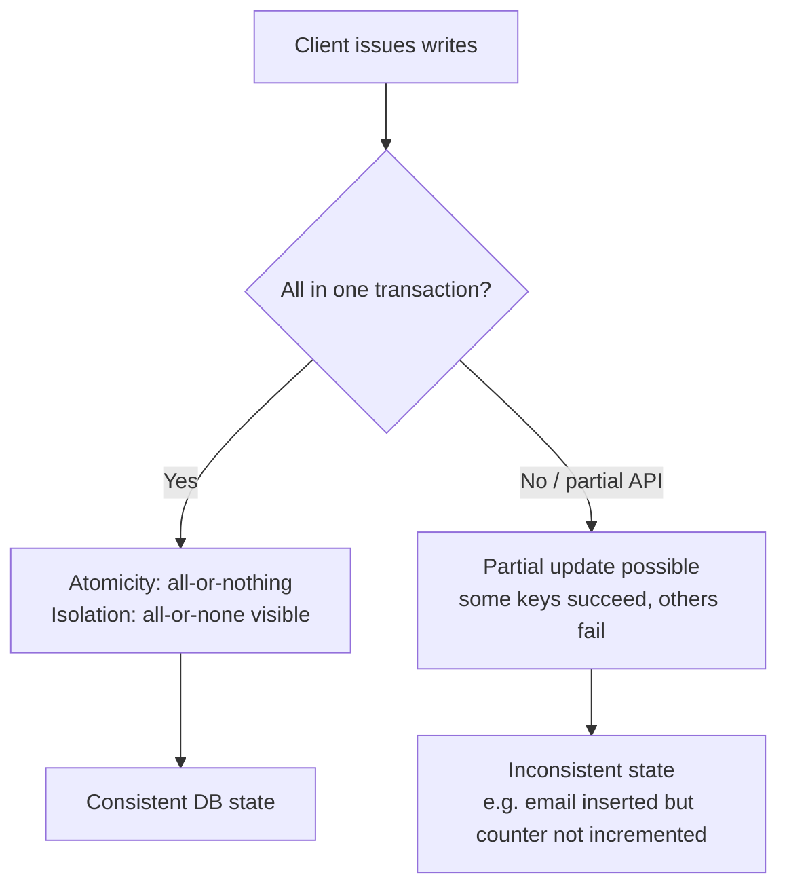
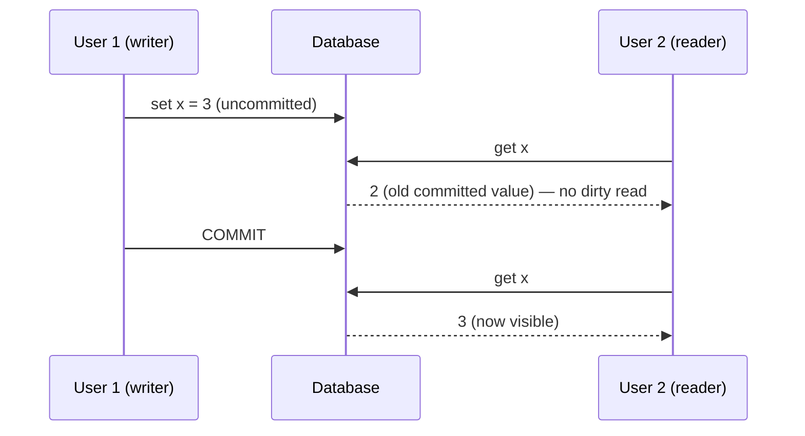
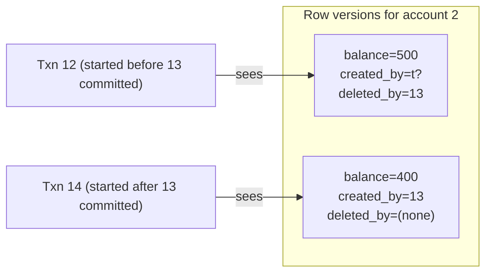
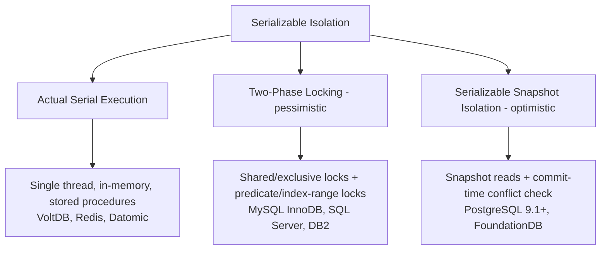
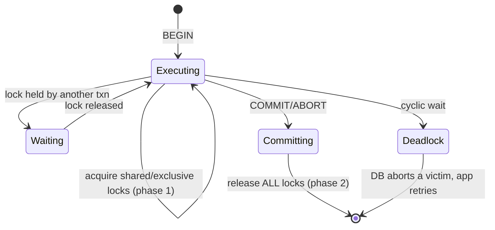
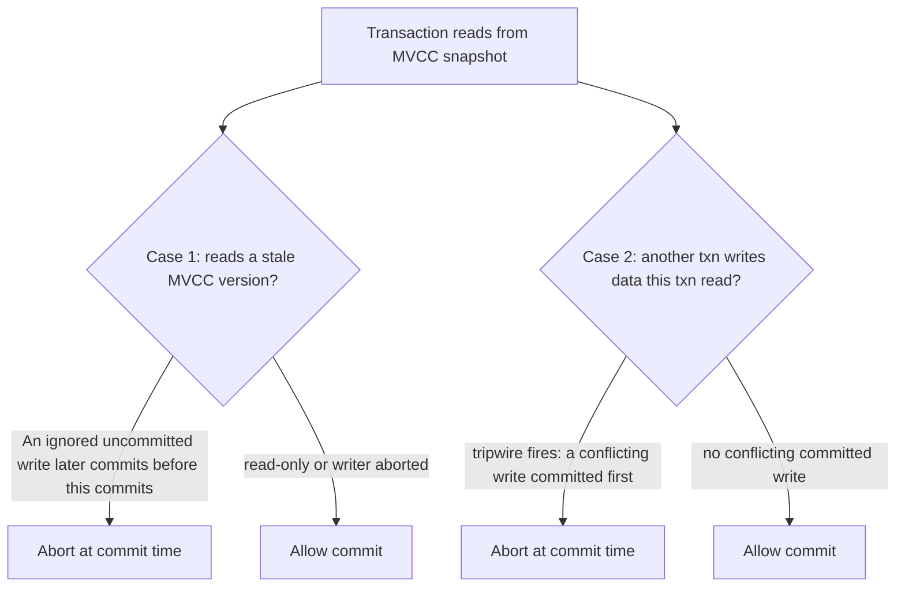

# DDIA Chapter 7: Transactions

> Part II: Distributed Data | Maps to: [../../system-design/03-hard/distributed-transactions.md](../../system-design/03-hard/distributed-transactions.md)

## 🎯 Chapter in One Paragraph

A **transaction** groups several reads and writes into one logical unit that either fully succeeds (**commit**) or fully fails (**abort/rollback**) — an abstraction whose entire purpose is to *simplify the programming model* by letting applications ignore a large class of concurrency problems and partial-failure scenarios. The chapter unpacks the famous **ACID** acronym (and shows that "ACID compliant" is nearly a marketing term because implementations differ wildly, especially on isolation), then goes deep on **concurrency control**: the race conditions that arise when transactions run concurrently (dirty reads/writes, read skew, lost updates, write skew, phantoms), the **weak isolation levels** (read committed, snapshot isolation / repeatable read) that prevent *some but not all* of them, and finally the three ways to achieve true **serializable** isolation — literal serial execution, two-phase locking (2PL), and serializable snapshot isolation (SSI). It matters because weak isolation bugs are real, non-deterministic, hard to test, and have caused financial losses and data corruption in production systems that were nominally "ACID." This chapter is deliberately scoped to single-node databases (though most ideas generalize); Chapters 8 and 9 extend the discussion to distributed systems.

## 🧠 Key Concepts & Vocabulary

- **Transaction** — a way to group multiple reads/writes into one logical unit executed conceptually as a single all-or-nothing operation.
- **Commit / Abort (Rollback)** — a transaction either commits (all writes persist) or aborts (all writes are discarded and can be safely retried).
- **ACID** — Atomicity, Consistency, Isolation, Durability. Coined 1983 by Härder & Reuter; precise in theory, ambiguous in practice.
- **BASE** — "Basically Available, Soft state, Eventual consistency"; effectively defined as "not ACID," even vaguer.
- **Atomicity (ACID sense)** — if a fault occurs partway through a group of writes, the transaction is aborted and all its writes are undone. Better named **abortability**; *not* about concurrency.
- **Consistency (ACID sense)** — application-defined **invariants** (e.g., credits = debits) stay true. This is a property of the *application*, not the database — arguably the "C" doesn't belong in ACID.
- **Isolation** — concurrently executing transactions don't step on each other; formalized as **serializability**.
- **Durability** — once committed, data is not lost (write to nonvolatile storage + write-ahead log, and/or replication to N nodes).
- **Single-object vs multi-object operations** — storage engines universally give atomicity/isolation for a single object; multi-object transactions coordinate writes across many rows/documents/indexes.
- **Write-ahead log (WAL)** — on-disk log used to implement single-object atomicity and crash recovery.
- **Compare-and-set (CAS)** — write only if the value hasn't changed since read; a single-object primitive, *not* a general transaction ("lightweight transaction" is misleading marketing).
- **Isolation level** — a defined guarantee about which concurrency anomalies are prevented: read uncommitted < read committed < snapshot isolation (repeatable read) < serializable.
- **Dirty read** — reading another transaction's uncommitted writes.
- **Dirty write** — overwriting another transaction's uncommitted write.
- **Read skew / nonrepeatable read** — seeing different parts of the DB at different points in time (e.g., money appears to vanish during a transfer).
- **Snapshot isolation (SI)** — each transaction reads from a **consistent snapshot** frozen at its start time.
- **MVCC (multi-version concurrency control)** — keep multiple committed versions of each object side-by-side to serve consistent snapshots; readers never block writers and vice versa.
- **Lost update** — two read-modify-write cycles run concurrently; one clobbers the other.
- **Write skew** — two transactions read overlapping data, make decisions on a premise, and write to *different* objects, together violating an invariant.
- **Phantom** — a write in one transaction changes the *result set* of a search query in another transaction.
- **Materializing conflicts** — artificially creating lock rows so a phantom becomes a concrete lock conflict (last resort).
- **Serializability** — the strongest level: the outcome is equivalent to *some* serial (one-at-a-time) execution.
- **Actual serial execution** — run one transaction at a time on a single thread (VoltDB, Redis, Datomic); enabled by cheap RAM + short OLTP transactions + stored procedures.
- **Stored procedure** — the entire transaction submitted to the DB ahead of time so it runs without app round-trips; must be deterministic for replication (VoltDB).
- **Two-phase locking (2PL)** — pessimistic: shared (read) and exclusive (write) locks; writers block readers and readers block writers; locks held until commit/abort. *Not* the same as 2PC.
- **Predicate lock** — a lock on all objects matching a search condition, including objects that don't exist yet (prevents phantoms).
- **Index-range / next-key lock** — a cheaper approximation of a predicate lock attached to an index range.
- **Deadlock** — two transactions each wait for the other's lock; DB detects and aborts one.
- **Serializable snapshot isolation (SSI)** — optimistic serializability built on SI: transactions proceed, then are validated at commit and aborted if an isolation violation is detected (PostgreSQL ≥ 9.1, FoundationDB).
- **Pessimistic vs optimistic concurrency control** — block-if-risky (2PL, serial) vs proceed-and-check-at-commit (SSI).
- **Outdated premise** — an SSI concept: a decision made on data that was later modified by a committed transaction.

## 📚 Deep Dive

### The Slippery Concept of a Transaction

Nearly all relational databases and some non-relational ones support transactions, following the style introduced by IBM's **System R (1975)**. The core idea has been stable for ~40 years — MySQL, PostgreSQL, Oracle, and SQL Server all resemble System R. The late-2000s NoSQL wave often abandoned transactions or redefined the word to mean something much weaker, spawning a myth that transactions are inherently anti-scalability. Both "transactions kill scalability" and "you must have ACID for serious data" are **hyperbole** — transactions are a design trade-off with real costs and real benefits.

#### The Meaning of ACID

| Letter | What it *actually* means | Whose responsibility | Notes |
|--------|--------------------------|----------------------|-------|
| **Atomicity** | On a fault mid-transaction, abort and undo all writes so far | Database | About all-or-nothing, *not* concurrency. "Abortability" would be a clearer name. |
| **Consistency** | Application invariants stay valid | **Application** (DB only enforces some, e.g., FK/unique constraints) | Härder & Reuter's "C" was reportedly "tossed in to make the acronym work." |
| **Isolation** | Concurrent transactions don't interfere; ideally serializable | Database | The most ambiguous letter in practice. |
| **Durability** | Committed data survives crashes | Database | Disk + WAL (single node) and/or replication (distributed). |

Because implementations differ, "ACID compliant" tells you little. **BASE** ("not ACID") is even vaguer.

**Durability is never absolute.** The book lists many ways "durable" data still dies:
- Disk survives but the machine dies → data inaccessible until repaired (replication helps availability).
- Correlated faults (power outage, crash-on-input bug) can kill all replicas → in-memory data lost (disk still matters for in-memory DBs).
- Async replication can lose recent writes on leader failover.
- SSDs can violate `fsync` guarantees on sudden power loss; firmware has bugs.
- Storage-engine/filesystem interactions can corrupt files after a crash.
- Silent bit-rot can corrupt data (and its replicas/backups) undetected.
- 30–80% of SSDs develop a bad block within four years; disconnected SSDs can lose data in weeks.

Conclusion: no single technique is perfect. Combine disk writes + replication + backups, and treat "guarantees" skeptically.

#### Single-Object and Multi-Object Operations



**Worked example (email app):** To avoid a slow `SELECT COUNT(*)`, you denormalize an `unread` counter. A new message must (1) insert the email and (2) increment the counter. Without **isolation**, another user may see the new email but a stale counter (a *dirty read*). Without **atomicity**, a crash between the two writes leaves the counter permanently out of sync.

- **Single-object writes:** storage engines almost universally guarantee atomicity (via a log) and isolation (via a per-object lock) for one object — so a half-written 20 KB JSON document, a torn write on power loss, or a partial read never happens. Some engines add atomic **increment** and **compare-and-set**, but these are *not* general transactions.
- **The need for multi-object transactions:** foreign-key references across tables, denormalized document fields kept in sync, and secondary indexes (which are separate objects) all need coordinated multi-object writes.
- **Multi-object grouping** in relational DBs is tied to the TCP connection (`BEGIN`…`COMMIT`). Many NoSQL stores lack this grouping even when they offer a "multi-put."

#### Handling Errors and Aborts

The whole point of abort is **safe retry**, yet many ORMs (Rails ActiveRecord, Django) just bubble an exception and throw away user input. Retrying is simple but imperfect:

- If the transaction **actually committed** but the ack was lost, retrying performs it **twice** (needs app-level dedup / idempotency).
- If the error is **overload**, retrying makes it worse → use exponential backoff and retry limits.
- Only retry **transient** errors (deadlock, isolation violation, transient network); **permanent** errors (constraint violation) shouldn't be retried.
- **Side effects outside the DB** (sending email) may fire even on abort → use two-phase commit (Ch. 9) to coordinate multiple systems.
- If the client crashes mid-retry, unsaved data is lost.

### Weak Isolation Levels

Race conditions arise only when transactions touch the *same* data and at least one writes. They are hard to find by testing (non-deterministic, timing-dependent) and hard to reason about. Serializable isolation would make them vanish, but it costs performance, so most systems default to weaker levels. **Weak-isolation bugs are not theoretical** — they've caused money loss, auditor investigations, and customer-data corruption, even in "ACID" relational databases.

#### Read Committed

Two guarantees: **no dirty reads** and **no dirty writes**.



- **No dirty reads** prevent seeing partially updated state and seeing writes that later roll back.
- **No dirty writes** prevent interleaving two transactions' writes (e.g., the used-car sale: listing awarded to Bob, invoice sent to Alice).
- **Does NOT prevent:** the counter lost-update race (the second write happens *after* the first commits, so it's not dirty), read skew, or write skew.
- **Implementation:** row-level **write locks** held to commit/abort prevent dirty writes. Dirty reads are prevented *without* read locks by remembering both the old committed value and the new uncommitted value, serving the old value to readers until commit. (Read locks would let one long writer stall all readers.) Default in Oracle 11g, PostgreSQL, SQL Server 2012, MemSQL.

#### Snapshot Isolation and Repeatable Read

**Read skew** worked example: Alice has \$500 + \$500. A transfer of \$100 is in flight. Alice's balance query reads account 1 *before* the incoming \$100 (\$500) and account 2 *after* the outgoing \$100 (\$400) → total appears to be \$900. Acceptable under read committed (both reads saw committed values), but disastrous for **backups** (permanent inconsistency baked in) and **long analytic/integrity scans**.

**Snapshot isolation** fixes this: every transaction reads from a consistent snapshot as of its start time. Key principle: **readers never block writers, writers never block readers.** Implemented with **MVCC**.



- Each transaction gets a monotonically increasing **txid**. Writes are tagged with the writer's txid.
- Each row has `created_by` and `deleted_by`. An **update = delete + create**. Garbage collection removes rows no live transaction can see.
- **Visibility rules** — an object is visible iff:
  1. The creating transaction had already committed when the reader started, **and**
  2. The object is not marked deleted, or its deleting transaction had not committed when the reader started.
  - Writes by in-progress transactions at snapshot time are ignored (even if they later commit); writes by aborted transactions ignored; writes by later txids ignored.
- **Indexes:** either point to all versions and filter by visibility, or use append-only/copy-on-write B-trees (CouchDB, Datomic, LMDB) where each write creates a new immutable root = a consistent snapshot.
- **Naming confusion:** Oracle calls SI "serializable"; PostgreSQL & MySQL call it **repeatable read**. The SQL standard's "repeatable read" predates SI, is ambiguous, and different DBs give different guarantees. DB2's "repeatable read" actually means serializable. *Nobody really knows what "repeatable read" means.*

#### Preventing Lost Updates

A **lost update** happens in a read-modify-write cycle: increment a counter, edit a JSON blob, or two users saving a whole wiki page. Solutions:

| Technique | How it works | Caveats |
|-----------|--------------|---------|
| **Atomic write operations** | `UPDATE counters SET value = value + 1 WHERE key='foo'` (cursor stability / single-thread execution) | Best when expressible; ORMs make it easy to accidentally write unsafe read-modify-write instead. |
| **Explicit locking** (`SELECT … FOR UPDATE`) | App locks the rows it will update, forcing serial read-modify-write | Easy to forget a lock somewhere → reintroduces the race. |
| **Automatic lost-update detection** | DB detects the conflict and aborts+retries | PostgreSQL repeatable read, Oracle serializable, SQL Server snapshot detect it; **MySQL/InnoDB repeatable read does NOT**. |
| **Compare-and-set** | `UPDATE … WHERE id=1234 AND content='old'` | Unsafe if the `WHERE` may read a stale snapshot — verify your DB's CAS semantics. |

**In replicated (multi-leader/leaderless) databases**, there's no single up-to-date copy, so locks/CAS don't apply. Options: allow **conflicting siblings** and merge later, use **commutative** atomic ops (Riak 2.0 CRDT-style datatypes merge without losing updates), or **LWW** (last write wins) — but LWW is *lossy* and unfortunately a common default.

#### Write Skew and Phantoms

**Doctors-on-call worked example:** invariant = at least one doctor on call. Alice and Bob are both on call, both feel sick, both click "go off call" concurrently.

```mermaid
sequenceDiagram
    participant A as Alice's txn
    participant DB as DB (Snapshot Isolation)
    participant B as Bob's txn
    A->>DB: SELECT count(on_call) WHERE shift=1234
    DB-->>A: 2 (>=2, safe to leave)
    B->>DB: SELECT count(on_call) WHERE shift=1234
    DB-->>B: 2 (>=2, safe to leave)
    A->>DB: UPDATE Alice.on_call = false; COMMIT
    B->>DB: UPDATE Bob.on_call = false; COMMIT
    Note over DB: 0 doctors on call — invariant violated!
```

- **Write skew** = generalization of lost update: two transactions read the same objects and update *different* objects; when they update the *same* object you instead get a dirty write or lost update.
- **Mitigations are limited:** atomic single-object ops don't help (multiple objects); automatic lost-update detection doesn't catch write skew; multi-object constraints are usually unsupported (may need triggers/materialized views). The practical fallback (when a row exists to lock) is `SELECT … FOR UPDATE`. **Only true serializable isolation prevents all write skew.**
- **More write-skew examples:** meeting-room double-booking, moving two game pieces to the same square, two users claiming the same username (a unique constraint fixes *this* one), and double-spending (two tentative charges that together overdraw).

**Phantoms:** In several of these, step 1 checks for the **absence** of matching rows and step 3 **inserts** a matching row. Since there's no existing row, `SELECT FOR UPDATE` has nothing to lock — this is a **phantom**. SI prevents phantoms in read-only queries, but read-write phantoms cause write skew.

**Materializing conflicts:** pre-create lock rows (e.g., every room × 15-min slot for six months) so a phantom becomes a concrete lock conflict. It's ugly and error-prone — a last resort; prefer serializable isolation.

### Serializability

Serializable isolation guarantees the result equals *some* serial execution, preventing **all** race conditions. Three implementation families:



#### Actual Serial Execution

Run one transaction at a time on a single thread — isolation is serializable *by definition*. Feasible only recently (~2007) because:
- **RAM is cheap** → keep the active dataset in memory (no disk waits).
- **OLTP transactions are short** with few reads/writes; long analytic reads run separately on a snapshot.

Constraints and design:
- Throughput limited to **one CPU core**.
- No interactive multi-statement transactions (network round-trips would stall the single thread). Instead, submit the whole transaction as a **stored procedure**.
- Stored procedures historically had a bad rep (vendor-specific ugly languages, hard to debug/version/deploy, DB is performance-sensitive). Modern systems use general-purpose languages: VoltDB (Java/Groovy), Datomic (Java/Clojure), Redis (Lua).
- VoltDB replicates by **re-executing the same deterministic stored procedure** on each replica (so `now()` etc. must use deterministic APIs).
- **Partitioning** scales beyond one core: give each core/partition its own thread. Single-partition transactions scale linearly; **cross-partition** transactions need coordination (VoltDB ~1,000/s — orders of magnitude slower). Data with many secondary indexes tends to force cross-partition coordination.

Summary of constraints: every transaction small & fast, active data fits in RAM, write throughput fits on one core (or partition cleanly), cross-partition use is bounded.

#### Two-Phase Locking (2PL)

The dominant serializability algorithm for ~30 years. **2PL ≠ 2PC** (two-phase commit, Ch. 9). Stronger than the read-committed locks:

- Read → acquire **shared** lock; write → acquire **exclusive** lock; read-then-write → upgrade shared to exclusive.
- **Writers block readers AND readers block writers** (the opposite of SI's mantra).
- **Two phases:** phase 1 = acquire locks while executing; phase 2 = release *all* locks at commit/abort.
- Used by serializable isolation in MySQL (InnoDB) and SQL Server, and repeatable read in DB2.



- **Deadlocks** happen easily; the DB detects cycles and aborts a victim, which the app must retry.
- **Performance is the downside:** lock overhead + drastically reduced concurrency; unbounded waits (traditional DBs don't cap transaction duration); unstable, high tail latencies under contention; one slow/lock-heavy transaction can stall everything; frequent deadlocks waste work on retries.
- **Predicate locks** lock *all objects matching a condition*, including future (phantom) rows → prevents write skew and makes isolation serializable. But they're **slow** (checking many active locks).
- **Index-range (next-key) locks** approximate predicate locks by locking an index entry/range (e.g., all bookings for room 123, or the noon–1pm range). Coarser but far cheaper. Falls back to a whole-table shared lock if no suitable index exists.

#### Serializable Snapshot Isolation (SSI)

First described 2008 (Michael Cahill's thesis). Provides **full serializability with a small penalty over SI**. Used in PostgreSQL ≥ 9.1 and (a similar algorithm) FoundationDB.

- **Optimistic:** transactions read from a consistent snapshot and proceed without blocking; at commit the DB checks whether isolation was violated and aborts if so. Performs well with spare capacity/low contention; badly under high contention (many aborts + retry load).
- The core problem SSI solves: a transaction acts on a **premise** (a query result true at start) that may become false by commit time. SSI detects two cases:



1. **Detecting stale MVCC reads:** track when a transaction *ignored* another transaction's write due to snapshot visibility. At commit, if any ignored write has since committed, abort. Deferring the check to commit avoids aborting read-only transactions (which can't cause write skew) and avoids aborting when the other transaction ends up aborting — preserving long read-only queries.
2. **Detecting writes that affect prior reads:** like index-range locks, but SSI locks **don't block** — they act as a **tripwire**. When a transaction writes, it checks the index for other transactions that recently read that data and notifies them their read is now outdated. The first to commit wins; a later transaction whose read was invalidated by an already-committed write must abort.

**Performance of SSI:**
- Trade-off in **tracking granularity**: fine-grained = precise aborts but heavy bookkeeping; coarse = cheaper but more unnecessary aborts. PostgreSQL uses theory to skip some unnecessary aborts.
- vs **2PL**: no blocking on locks → predictable, low-variance latency; read-only queries run lock-free on a snapshot.
- vs **serial execution**: not limited to one core — FoundationDB distributes conflict detection across machines and supports multi-partition serializable transactions.
- **Abort rate dominates performance** → read-write transactions should be short (long read-only ones are fine). SSI is less sensitive to slow transactions than 2PL or serial execution.

### Isolation Levels Compared

| Anomaly | Read Committed | Snapshot Isolation (Repeatable Read) | Serializable |
|---------|:--------------:|:------------------------------------:|:------------:|
| Dirty read | ✅ prevented | ✅ | ✅ |
| Dirty write | ✅ prevented | ✅ | ✅ |
| Read skew (nonrepeatable read) | ❌ allowed | ✅ prevented | ✅ |
| Lost update | ❌ (needs CAS/lock/detection) | ⚠️ some impls detect, some don't | ✅ |
| Write skew | ❌ | ❌ | ✅ prevented |
| Phantom | ❌ | ⚠️ prevented for reads; write-skew phantoms need index-range locks | ✅ |

## ⚠️ Edge Cases, Failure Modes & Gotchas

- **Retry after a lost ack** → double execution. If the DB committed but the network dropped the ack, the client's retry runs the transaction twice unless there's application-level idempotency/deduplication.
- **Retrying overload errors** amplifies the overload. Use exponential backoff, cap retries, and distinguish overload from transient errors.
- **Permanent errors shouldn't be retried** (constraint violations won't succeed on retry).
- **Non-DB side effects on abort** — emails/charges triggered inside an aborted transaction still fire. Needs 2PC or an outbox/idempotency pattern.
- **Best-effort (leaderless) stores don't roll back** — "the DB does what it can and won't undo prior work"; error recovery is the app's job.
- **"ACID compliant" is unreliable** — implementations vary; many "ACID" relational DBs default to *weak* isolation, so being ACID would not have prevented famous weak-isolation bugs.
- **`fsync`/durability lies** — SSDs can violate flush guarantees on power loss; firmware bugs, silent bit-rot, and storage/filesystem interaction bugs all defeat naive durability.
- **Async-replication durability gap** — recent writes can be lost on leader failover.
- **Read committed still allows read skew** — money can appear to vanish during a transfer; catastrophic if captured in a backup or a long analytic scan.
- **MVCC txid overflow** — txids are 32-bit and wrap (~4B transactions); PostgreSQL's `vacuum` handles this.
- **MVCC garbage & bloat** — old versions must be GC'd; long-running transactions hold snapshots open, blocking cleanup and bloating tables/indexes.
- **Lost update NOT auto-detected everywhere** — MySQL/InnoDB repeatable read does *not* detect lost updates (arguably it isn't true snapshot isolation).
- **Unsafe compare-and-set** — if the `WHERE` clause reads from an old snapshot, CAS can silently permit a lost update. Verify DB semantics.
- **ORM foot-guns** — ActiveRecord/Django don't auto-retry aborts (throwing away the benefit of abortability) and make unsafe read-modify-write cycles easy.
- **Write skew is subtle** — different objects updated, no dirty write, no lost update, yet an invariant is violated. `SELECT FOR UPDATE` only helps when there's an existing row to lock.
- **Phantoms** — checking for *absence* then inserting has nothing to lock; needs predicate/index-range locks or materialized conflict rows.
- **LWW loses data** — last-write-wins conflict resolution silently discards concurrent updates and is a common default.
- **Serial execution stalls on one slow transaction** — a single long transaction stalls *all* processing; the whole active set must fit in RAM; cross-partition transactions are very slow (~1,000/s in VoltDB) and don't scale by adding machines.
- **2PL pathologies** — unbounded lock waits, unstable/high-percentile latencies, cascading stalls from one lock-heavy transaction, and frequent deadlocks causing wasted retry work.
- **SSI under contention** — high contention → many commit-time aborts; if the system is near capacity, retry load worsens performance. Keep read-write transactions short.
- **Predicate locks don't scale** — checking many active predicate locks is expensive; hence the index-range approximation, which over-locks and can fall back to a full-table lock.

## 🔑 Key Takeaways

- Transactions exist to **simplify the programming model** — they collapse a huge space of failure/concurrency cases into "abort and retry."
- **ACID is imprecise in practice**; the important, well-defined ideas are atomicity (abortability), isolation (serializability), and durability. "Consistency" is really the application's job.
- **Weak isolation is common and dangerous**: read committed and snapshot isolation prevent some anomalies but leave lost updates, write skew, and phantoms for you to handle.
- Know the anomalies cold: **dirty read/write → read skew → lost update → write skew → phantom**, and which level stops each.
- **Snapshot isolation via MVCC** gives consistent point-in-time reads with the mantra "readers don't block writers and vice versa."
- **Only serializable isolation eliminates all race conditions.** Three ways to get it: serial execution, 2PL, SSI.
- **Serial execution** is simple and fast (in-memory + stored procedures) but single-core-bound and needs clean partitioning to scale.
- **2PL** is correct but has poor, unstable performance under contention and is prone to deadlocks; predicate/index-range locks are what stop phantoms.
- **SSI** is the promising middle ground: optimistic, non-blocking, scalable (FoundationDB), with performance dominated by the abort rate.
- Everything here is single-node-centric; **distributed transactions** (Ch. 8–9) add much harder problems.

## 💡 Real-World Applications & Examples

- **Banking / accounting** — transfers must preserve the credits = debits invariant; read skew makes money "vanish," and write skew/double-spend can overdraw balances. Serializable isolation or careful locking is required.
- **Email/inbox counters, e-commerce, social feeds** — denormalized counters and secondary indexes require multi-object transactions to stay in sync.
- **PostgreSQL** — default read committed; `REPEATABLE READ` = MVCC snapshot isolation with automatic lost-update detection; `SERIALIZABLE` = SSI since 9.1.
- **Oracle** — "serializable" is actually snapshot isolation; uses MVCC.
- **MySQL/InnoDB** — repeatable read is MVCC-based but does *not* detect lost updates; serializable uses 2PL (next-key locks).
- **SQL Server / DB2** — 2PL-based serializable; DB2's "repeatable read" means true serializable.
- **VoltDB / H-Store** — in-memory, single-threaded serial execution via deterministic stored procedures; replicates by re-running procedures; partitions for multi-core scaling.
- **Redis** — single-threaded execution; Lua scripts as atomic "stored procedures"; atomic primitives on data structures.
- **Datomic** — serial execution with Java/Clojure transaction functions; append-only immutable storage (snapshot-per-root).
- **FoundationDB** — distributed, always-serializable key-value store using an SSI-style optimistic commit-time conflict check distributed across machines.
- **CockroachDB / TiKV(TiDB)** — distributed SQL/KV stores defaulting to SERIALIZABLE, applying these concurrency-control ideas at scale.
- **Riak 2.0 CRDT datatypes** — commutative merges prevent lost updates across replicas without locks.
- **CouchDB / LMDB** — append-only / copy-on-write B-trees give cheap consistent snapshots.

## 🛠️ Open-Source Implementations (GitHub)

| Project | GitHub | How it relates to this chapter | Approx ⭐ |
|---------|--------|--------------------------------|-----------|
| PostgreSQL | https://github.com/postgres/postgres | MVCC snapshot isolation, automatic lost-update detection, and SSI (`SERIALIZABLE` since 9.1) — the canonical reference for the chapter's isolation mechanisms | ~15–22k (mirror) |
| FoundationDB | https://github.com/apple/foundationdb | Distributed, always-serializable KV store using an SSI-style optimistic commit-time conflict check spread across machines | ~15k |
| Redis | https://github.com/redis/redis | Single-threaded serial execution; Lua scripts as atomic stored procedures; atomic data-structure ops | ~68k |
| VoltDB | https://github.com/VoltDB/voltdb | In-memory single-threaded serial execution via deterministic stored procedures + partitioning (the book's Actual Serial Execution example) | ~1k |
| CockroachDB | https://github.com/cockroachdb/cockroach | Distributed SQL DB defaulting to SERIALIZABLE isolation, applying these ideas at scale | ~30k |
| TiKV | https://github.com/tikv/tikv | Distributed transactional KV store with ACID/serializable semantics (backs TiDB) | ~15k |
| MongoDB | https://github.com/mongodb/mongo | Document DB with single-document atomicity and (since 4.x) multi-document transactions with snapshot isolation | ~26k |
| MySQL Server | https://github.com/mysql/mysql-server | InnoDB MVCC repeatable read + 2PL/next-key locking for serializable | ~11k |

(Star counts are approximate and drift over time; treat as order-of-magnitude.)

## 🔗 References & Further Reading

- Härder, T. & Reuter, A. — ["Principles of Transaction-Oriented Database Recovery"](https://doi.org/10.1145/289.291), *ACM Computing Surveys* 15(4), 1983. (Origin of the ACID acronym.)
- Gray, J. et al. — "Granularity of Locks and Degrees of Consistency in a Shared Data Base," IFIP, 1976. (System R isolation levels, dirty read/write.)
- Eswaran, K., Gray, J., Lorie, R., Traiger, I. — "The Notions of Consistency and Predicate Locks in a Database System," *CACM* 19(11), 1976. (Predicate locks & phantoms.)
- Berenson, H., Bernstein, P., Gray, J., et al. — ["A Critique of ANSI SQL Isolation Levels"](https://doi.org/10.1145/223784.223785), SIGMOD 1995. (Why the SQL isolation-level definitions are flawed; defines snapshot isolation.)
- Fekete, A., Liarokapis, D., O'Neil, E., et al. — ["Making Snapshot Isolation Serializable"](https://doi.org/10.1145/1071610.1071615), *ACM TODS* 30(2), 2005. (Theoretical foundation of SSI.)
- Cahill, M., Röhm, U., Fekete, A. — "Serializable Isolation for Snapshot Databases," SIGMOD 2008. (The SSI algorithm; Cahill's PhD thesis.)
- Bailis, P., Fekete, A., Ghodsi, A., et al. — ["HAT, not CAP: Towards Highly Available Transactions"](https://www.usenix.org/conference/hotos13/session/bailis), HotOS 2013.
- Kleppmann, M. — [*Designing Data-Intensive Applications*](https://dataintensive.net/), O'Reilly, Chapter 7.
- [PostgreSQL Concurrency Control docs (MVCC, SSI)](https://www.postgresql.org/docs/current/mvcc.html)
- [FoundationDB Transaction Manifesto](https://apple.github.io/foundationdb/transaction-manifesto.html)
- [Hermitage](https://github.com/ept/hermitage) — Martin Kleppmann's test suite probing isolation-level behavior across real databases.

## ❓ Self-Check Questions

1. **What does the "C" in ACID actually mean, and why is it arguably out of place?**
   Consistency = application-defined invariants stay true. It's the *application's* responsibility (the DB only enforces some constraints), whereas A/I/D are database properties — so C doesn't really belong with the others.

2. **Why is "abortability" a better name than "atomicity" for the A in ACID?**
   ACID atomicity is not about concurrency (that's isolation); it's about undoing all writes if a transaction can't complete, so the app can safely retry. The defining feature is the ability to *abort* and discard partial writes.

3. **Distinguish dirty read, read skew, lost update, write skew, and phantom.**
   Dirty read = seeing uncommitted data. Read skew = seeing different parts of the DB at different times. Lost update = two read-modify-write cycles, one clobbers the other. Write skew = two transactions read overlapping data and write *different* objects, jointly breaking an invariant. Phantom = one transaction's write changes the *result set* of another's search query.

4. **Which isolation level prevents write skew, and why can't weaker levels do it?**
   Only serializable. Atomic single-object ops don't help (multiple objects), and SI's lost-update detection doesn't fire because the transactions update different objects — the conflict is over a shared *read premise*, not a shared write.

5. **How does MVCC serve a consistent snapshot?**
   Each transaction gets a txid; rows carry `created_by`/`deleted_by`. A row is visible iff its creator committed before the reader started and it isn't (visibly) deleted. Multiple versions coexist; GC removes versions no live transaction can see. Readers never block writers.

6. **Why did single-threaded serial execution become viable ~2007, and what are its limits?**
   Cheap RAM (active set fits in memory) plus the realization that OLTP transactions are short. Limits: one-CPU-core throughput, no interactive multi-statement transactions (must use stored procedures), whole active set in RAM, and slow, non-scaling cross-partition transactions.

7. **Contrast 2PL's locking discipline with snapshot isolation's.**
   Under SI, readers never block writers and writers never block readers (MVCC). Under 2PL, writers block readers *and* readers block writers via shared/exclusive locks held until commit — giving serializability but poor, unstable performance and deadlocks.

8. **What are predicate locks and why do real databases use index-range locks instead?**
   A predicate lock covers all objects matching a search condition (including future phantom rows), preventing write skew. It's expensive to evaluate against many active locks, so DBs approximate it with cheaper index-range/next-key locks (which over-lock but are much faster).

9. **How does SSI detect a transaction acting on an "outdated premise"?**
   Two cases checked at commit: (1) it read a stale MVCC version whose ignored writer has since committed; (2) another transaction wrote data this transaction had read (a non-blocking "tripwire" recorded via index reads). If a conflicting write committed first, the transaction aborts.

10. **Why is SSI often preferable to 2PL and to serial execution?**
    It's non-blocking (predictable low-variance latency, lock-free read-only queries), and unlike serial execution it scales beyond one core / across machines (FoundationDB). Its cost is the abort rate under contention, so read-write transactions should be short.
