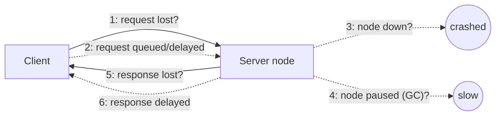
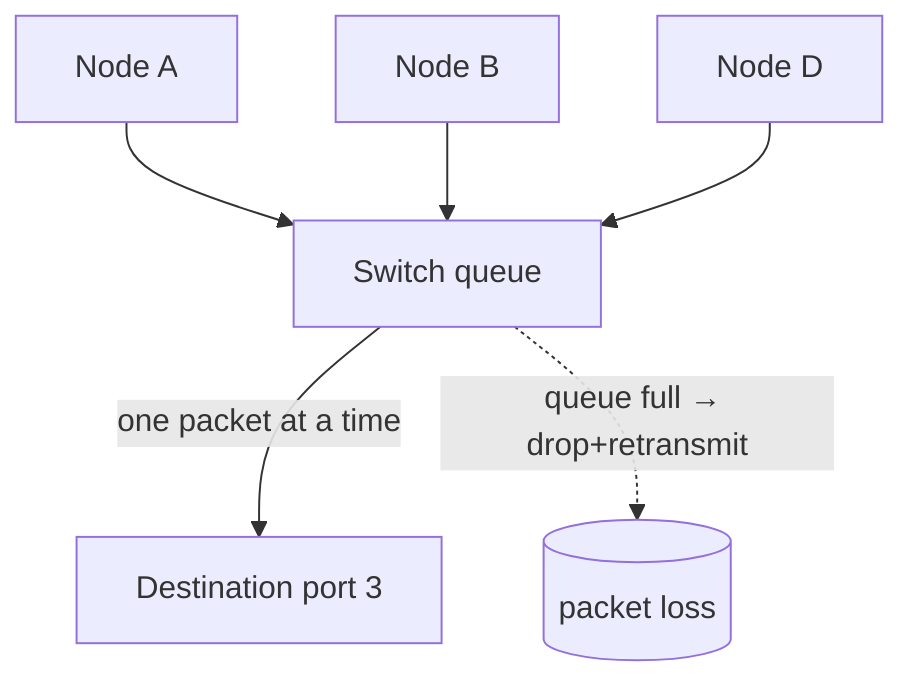
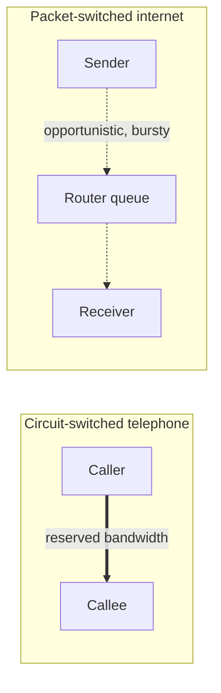
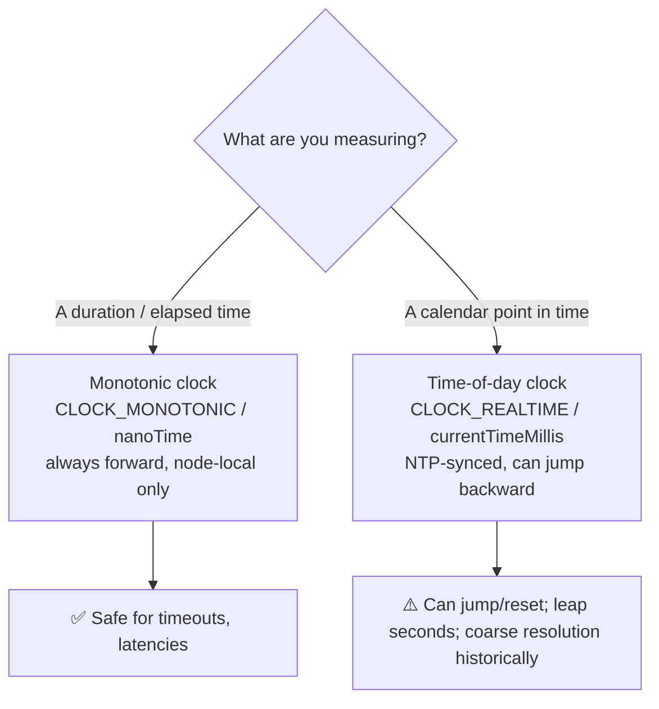
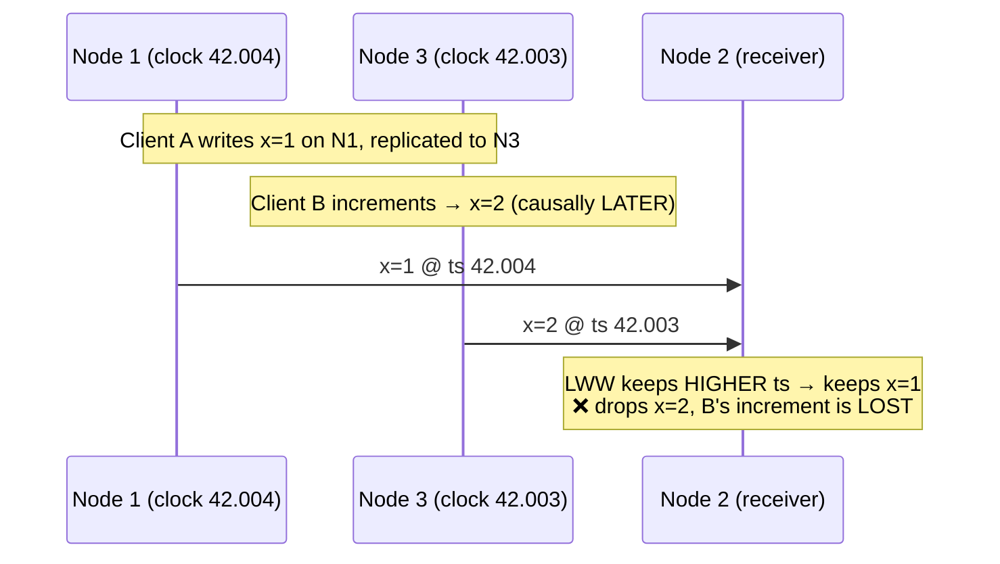
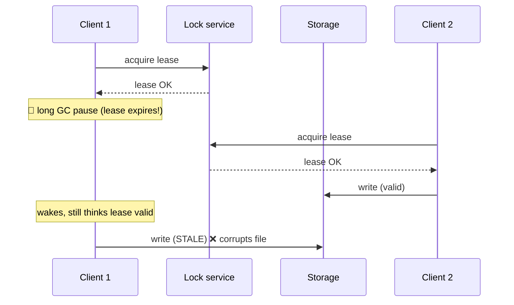
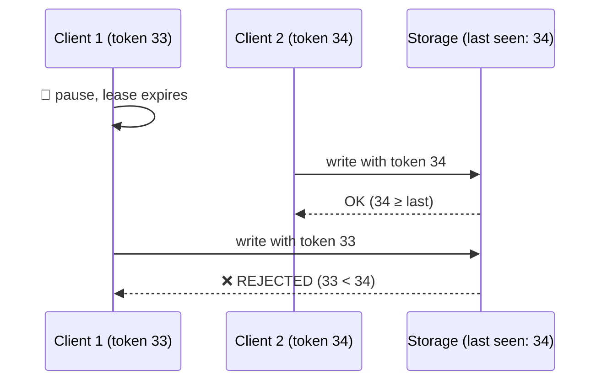
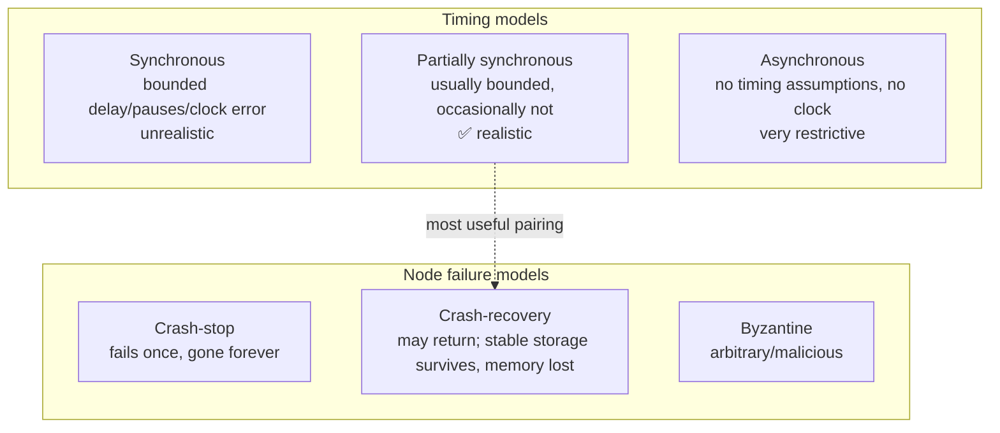

# DDIA Chapter 8: The Trouble with Distributed Systems

> Part II: Distributed Data | Maps to: [system-design/04-very-hard/distributed-systems.md](../../system-design/04-very-hard/distributed-systems.md)

## 🎯 Chapter in One Paragraph

A single computer is a comfortable place: when the hardware works, the same operation always produces the same result, and when it fails, it usually fails completely (crash, kernel panic) rather than returning a subtly wrong answer. Distributed systems destroy this comfortable illusion. The moment you connect machines with a network, you inherit **partial failures** — some parts break while others keep working — and these failures are **nondeterministic**: an operation may work, fail, or hang, and you often *cannot even tell which happened*. This chapter is a deliberately pessimistic tour of the three great sources of trouble: **unreliable networks** (packets get lost, delayed, reordered, and you can't distinguish a dead node from a slow one), **unreliable clocks** (quartz drift, NTP jumps, leap seconds, and confidence intervals mean timestamps lie), and **process pauses** (GC stop-the-world, VM suspension, paging — a thread can freeze for minutes and not know it). Because of all this, a node can never *know* the truth on its own; it can only guess from messages it receives. The chapter's constructive conclusion is that we survive by defining explicit **system models** (synchronous / partially synchronous / asynchronous; crash-stop / crash-recovery / Byzantine), reasoning about **safety and liveness** properties, and using tools like **quorums** and **fencing tokens** to build reliable systems out of unreliable components. It sets up Chapter 9 (Consistency and Consensus), which provides the algorithms that actually solve these problems.

## 🧠 Key Concepts & Vocabulary

- **Partial failure** — some components of a distributed system fail while others keep running; nondeterministic and the defining characteristic of distributed systems.
- **Shared-nothing architecture** — machines each own their memory/disk and communicate only via the network; the dominant model for internet services.
- **Asynchronous packet network** — a network (Ethernet/IP, the internet) that gives no guarantee about *when* a packet arrives, or *whether* it arrives at all.
- **Timeout** — the only reliable-ish way to detect a fault; after waiting some time you assume no response is coming. It cannot tell you *why* (lost request? dead node? lost response?).
- **Unbounded delay** — no upper limit exists on how long a packet may take in an asynchronous network.
- **Bounded delay** — a fixed maximum latency, achievable in a *synchronous* (circuit-switched) network but not on the internet.
- **Network partition / netsplit** — part of the network is cut off from the rest. (DDIA prefers "network fault" to avoid confusion with storage *partitions*/shards.)
- **Network congestion / queueing** — the dominant source of variable network delay: switch queues, OS queues, VM pauses, TCP flow control.
- **Circuit switching vs. packet switching** — telephone networks reserve fixed bandwidth (bounded delay, wasteful for bursty traffic); the internet uses packet switching (efficient, but unbounded delay).
- **Phi Accrual failure detector** — adaptively tunes timeouts from observed response-time distributions (used in Akka, Cassandra).
- **Time-of-day clock (wall-clock)** — returns calendar date/time (e.g., `CLOCK_REALTIME`, `System.currentTimeMillis()`); NTP-synced but can jump backward; **bad for measuring durations**.
- **Monotonic clock** — always moves forward (e.g., `CLOCK_MONOTONIC`, `System.nanoTime()`); absolute value is meaningless; **good for measuring elapsed time / timeouts**; cannot be compared across machines.
- **NTP (Network Time Protocol)** — synchronizes time-of-day clocks against reference servers; accuracy limited by network delay (tens of ms typical).
- **Clock drift / skew** — quartz clocks run fast/slow (Google assumes ~200 ppm); *skew* is the difference between two clocks.
- **Slewing** — NTP gradually speeds/slows the clock rate instead of jumping it.
- **Leap second smearing** — spreading a leap-second adjustment over a day so systems don't break.
- **Clock confidence interval** — a clock reading should be treated as a *range* `[earliest, latest]`, not a point. Most APIs don't expose it.
- **TrueTime API (Google Spanner)** — explicitly returns `[earliest, latest]`; Spanner waits out the interval to order transactions causally.
- **Logical clock** — orders events by incrementing counters (not physical time); safer for ordering than wall-clock timestamps.
- **Last Write Wins (LWW)** — conflict resolution by highest timestamp; prone to silent data loss and can't distinguish concurrent from sequential writes.
- **Process pause** — a thread frozen for an unbounded time (GC stop-the-world, VM suspend/live-migration, laptop lid, context switch/steal time, disk I/O, page fault/swapping thrashing, `SIGSTOP`).
- **Lease** — a lock with a timeout, periodically renewed; the classic dangerous pattern when combined with pauses/clock skew.
- **Quorum** — a decision requires a minimum number of votes; a **majority quorum** (>half) guarantees only one majority can exist at a time.
- **Split brain** — two nodes both believe they are the leader; prevented by quorum + fencing.
- **Fencing token** — a monotonically increasing number issued with each lock grant; the *resource* rejects writes carrying an older token, neutralizing a stale lock holder.
- **Byzantine fault** — a node behaves arbitrarily/maliciously (lies, sends corrupt/fake messages). The **Byzantine Generals Problem** is consensus among nodes with traitors.
- **Byzantine fault tolerance (BFT)** — surviving arbitrary/malicious node behavior; usually needs a supermajority (>2/3 honest); expensive, rare in datacenters, relevant to aerospace and blockchains.
- **System model** — an abstraction of the faults an algorithm may assume:
  - Timing: **synchronous** (bounded everything — unrealistic), **partially synchronous** (usually well-behaved, occasionally not — realistic), **asynchronous** (no timing assumptions, no clock — very restrictive).
  - Node: **crash-stop** (fails once, gone forever), **crash-recovery** (may crash and return; stable storage survives, memory lost), **Byzantine** (arbitrary).
- **Safety property** — "nothing bad happens"; once violated it *cannot be undone* (e.g., uniqueness of fencing tokens). Required to hold in all situations.
- **Liveness property** — "something good eventually happens" (often literally uses the word "eventually", e.g., availability, eventual consistency); may be conditioned on caveats (majority up, network recovers).

## 📚 Deep Dive

### Faults and Partial Failures

On a single machine, software is essentially deterministic: correct hardware → same input, same output. Computers are *designed* to fail completely rather than return wrong answers, presenting an "idealized system model" of mathematical perfection over messy physical reality.

Distributed systems abandon this luxury. The canonical Coda Hale anecdote lists real datacenter horrors: long-lived partitions, PDU (power) failures, switch failures, accidental rack power-cycles, whole-DC backbone/power failures, and "a hypoglycemic driver smashing his Ford pickup into a DC's HVAC system." The key property is that **partial failures are nondeterministic** — the same multi-node operation may succeed, fail, or hang unpredictably, and you may never learn whether it succeeded.

**Two philosophies of large-scale computing:**

| Aspect | Supercomputer / HPC | Cloud / Internet Services |
|---|---|---|
| Fault handling | Checkpoint + restart whole job; escalate partial failure → total failure | Tolerate failed nodes, keep serving |
| Hardware | Specialized, reliable nodes; shared memory / RDMA | Commodity machines, higher failure rate |
| Network | Specialized topologies (meshes, toruses) | IP/Ethernet, Clos topologies |
| Availability | Offline batch OK to stop | Online, must serve users with low latency continuously |
| Recovery model | Like a big single computer | Rolling upgrades, kill-and-replace VMs |

The engineering goal: **build a reliable system from unreliable components**. This is an old idea — error-correcting codes tolerate bit errors; TCP builds reliable delivery on unreliable IP. But there are limits: TCP can hide packet loss but cannot remove delay; ECC handles a few bit-flips but not a swamped signal.

### Unreliable Networks

Shared-nothing systems communicate *only* over an asynchronous packet network. When you send a request and wait for a response, six distinct things can go wrong — and from the sender's side several are **indistinguishable**:



The only signal you actually have is: *"I haven't received a response yet."* You cannot tell whether the request was lost, the node is down, the node is paused, or the response was lost. The usual remedy is a **timeout** — but even after a timeout fires you still don't know if the remote node processed the request (it may still be queued and get delivered later).

**Network faults are common in practice**, even in one company's datacenter:
- A study found ~12 network faults/month in a medium datacenter (half disconnected a single machine, half a whole rack).
- Redundant networking gear helps less than hoped — it doesn't guard against *human error* (misconfigured switches), a major outage cause.
- Public clouds (EC2) are notorious for transient glitches; sharks bite undersea cables; a NIC may drop *all inbound* packets while sending outbound fine (asymmetric fault).

Handling faults ≠ tolerating them. A valid strategy can be to show users an error while the network is down — but you must *know and test* how your software reacts, or you risk deadlock, permanent unavailability, or data deletion. This motivates **Chaos Monkey**-style deliberate fault injection.

**Detecting faults** — occasionally you get explicit signals:
- OS sends `RST`/`FIN` if no process listens on the port (but if it crashed mid-request, you don't know how much was processed).
- A supervisor script can notify peers of a crash (e.g., HBase) for fast failover.
- Switch management interfaces can report link failures at hardware level (not available over the internet / shared DCs).
- `ICMP Destination Unreachable` from a router (but routers have no magic failure detector either).

Bottom line: rapid feedback is useful but *unreliable*. To be sure a request succeeded, you need a **positive application-level response**.

#### Timeouts and Unbounded Delays

How long should a timeout be? There's no simple answer:

| Timeout too **long** | Timeout too **short** |
|---|---|
| Slow to detect failure; users wait / see errors | Falsely declares live-but-slow nodes dead |
| — | Actions may run twice (failover to another node) |
| — | Load shed to other nodes → **cascading failure** (all nodes declare each other dead) |

If the network guaranteed max delay `d` and nodes guaranteed max handling time `r`, then `2d + r` would be a safe timeout. But real networks have **unbounded delays** and servers can't guarantee bounded handling time, so **there is no correct timeout** — you must determine it experimentally.

**Why delays vary — queueing (the traffic-jam analogy):**



Sources of queueing delay:
1. **Network switch queues** — multiple senders to one destination; full queue → dropped packet → retransmit.
2. **OS queues** — packet arrives but all CPU cores busy; request waits arbitrarily.
3. **VM pauses** — a VM paused tens of ms while another VM uses the core; inbound data buffered by the hypervisor.
4. **TCP flow control / backpressure** — sender throttles itself, adding queueing before data even enters the network.
5. **TCP retransmission** — lost packets retransmitted after a timeout; the app doesn't see the loss but sees the delay.

**TCP vs UDP:** latency-sensitive apps (VoIP, video calls) prefer UDP — no flow control, no retransmit. Delayed data is worthless (you can't replay a lost audio packet in time), so UDP fills the gap with silence; "the retry happens at the human layer" ("Could you repeat that?").

Delays are worst near maximum capacity: a system with spare capacity drains queues; a saturated one builds long queues fast. In multi-tenant clouds a **noisy neighbor** can spike your delays unpredictably. **Better than a constant timeout:** continuously measure round-trip times and jitter, then adapt (Phi Accrual failure detector — Akka, Cassandra).

#### Synchronous vs. Asynchronous Networks

Why can't hardware just make networks reliable? Compare to the fixed-line telephone network, which is extremely reliable because it establishes a **circuit**: a fixed slice of bandwidth reserved end-to-end for the call's duration (ISDN: 16 bits per 4000 frames/sec = guaranteed data every 250 µs). No queueing → **bounded delay**.



| | Circuit (telephone) | Packet (Ethernet/IP) |
|---|---|---|
| Bandwidth | Reserved, fixed | Opportunistic, shared |
| Delay | Bounded | Unbounded (queueing) |
| Idle cost | Wasted (reserved anyway) | Zero (uses no bandwidth) |
| Optimized for | Constant-rate audio/video | Bursty traffic (web, email, files) |

The internet uses packet switching because it optimizes for **bursty** traffic — a file transfer has no fixed bandwidth requirement, it just wants to finish ASAP. A circuit would force you to guess a bandwidth allocation (too low = slow, too high = wasteful). Hybrids (ATM, QoS/DiffServ) exist but aren't commonly deployed for general multi-tenant traffic. Conclusion: **variable delays are a cost/benefit consequence of packet switching, not an unavoidable law** — but for practical systems, treat delay as unbounded.

### Unreliable Clocks

Clocks answer two different kinds of question: **durations** (has this timed out? p99 latency? QPS?) and **points in time** (when was this published? when to send the reminder?). Each machine has its own imperfect quartz oscillator, so every node has a slightly different notion of time. NTP syncs them, imperfectly.

#### Monotonic vs. Time-of-Day Clocks



- **Time-of-day**: calendar time since the Unix epoch. Synced by NTP so timestamps *ideally* mean the same across machines — **but** if the local clock drifts too far ahead, NTP forcibly resets it, and it appears to **jump backward**. Historically coarse (10 ms steps on old Windows). Ignoring leap seconds makes it unsuitable for elapsed-time measurement.
- **Monotonic**: guaranteed to move forward, resolution in µs or better; absolute value is arbitrary (nanoseconds since boot). NTP can only *slew* it (up to ~0.05% rate change), never jump it. **Never compare monotonic values across machines.** For timeouts within one node, this is the right tool.

#### Clock Synchronization and Accuracy — the ways NTP betrays you

- **Quartz drift** — temperature-dependent; Google assumes 200 ppm ≈ 6 ms drift if resynced every 30 s, or **17 s/day** if resynced once a day.
- **Forced reset** — if local clock is too far off, NTP refuses to sync or hard-resets; observers see time jump.
- **Firewalled-off NTP** — misconfiguration goes unnoticed while the clock silently drifts.
- **Network delay limits accuracy** — ~35 ms minimum error over the internet; spikes to ~1 s under congestion.
- **Wrong/misconfigured NTP servers** — some report time off by hours; clients query several and drop outliers, but "you're betting correctness on a stranger's clock."
- **Leap seconds** — a 59- or 61-second minute has crashed many large systems; best handled by **smearing** the adjustment across a day.
- **VM clocks** — virtualized hardware clock; a paused VM sees the clock suddenly jump forward.
- **Untrusted devices** — mobile/embedded clocks may be deliberately set wrong (e.g., to cheat game timers).

Very high accuracy *is* achievable (MiFID II requires HFT firms within 100 µs of UTC) using GPS receivers + **PTP (Precision Time Protocol)** + careful monitoring — but it's expensive and easy to break.

#### Relying on Synchronized Clocks — subtle, silent danger

The scary part: a broken clock **fails silently**. A bad CPU or network usually breaks loudly and gets fixed; a drifting clock keeps "working" while quietly corrupting logic → subtle data loss, not a crash. If you depend on synced clocks, you **must** monitor clock offsets between nodes and evict any node whose clock drifts too far.

**Worked example — LWW loses a write (Figure 8-3):**



Even with excellent sync (skew < 3 ms), the *later* write got the *smaller* timestamp, so LWW silently discards it. Problems with LWW:
- Writes vanish: a lagging-clock node can't overwrite a fast-clock node's value until skew elapses → arbitrary silent data loss.
- Can't distinguish truly concurrent writes from quick sequential ones → needs **version vectors** for causality.
- Two nodes can generate identical timestamps (ms resolution) → need a random tiebreaker, which can *itself* violate causality.

**A packet can appear to arrive before it was sent**: send at ts 100 ms (sender clock), receive at ts 99 ms (receiver clock). No NTP accuracy can fully prevent this, because sync accuracy is itself bounded by network round-trip time. **Logical clocks** (incrementing counters) are the safe alternative for *ordering*; time-of-day/monotonic are *physical* clocks.

#### Clock Confidence Intervals and Spanner's TrueTime

A fine-grained reading isn't an accurate reading. Treat a clock as a **range** `[earliest, latest]`. Most APIs (`clock_gettime`) hide this — you can't tell if your error is 5 ms or 5 years. Google's **TrueTime** (Spanner) explicitly returns the interval.

**Spanner's trick for global snapshot isolation across datacenters:** if two intervals don't overlap (`A_latest < B_earliest`), then B *definitely* happened after A. To guarantee a transaction's timestamp reflects causality, Spanner **deliberately waits out the width of the confidence interval** before committing a read-write transaction (commit-wait), so any later reader's interval can't overlap. To keep the wait short, Google puts GPS/atomic clocks in each DC (sync within ~7 ms).

```mermaid
gantt
    title TrueTime: non-overlapping intervals prove ordering
    dateFormat X
    axisFormat %L
    section Txn A
    A interval [earliest,latest] :a1, 0, 7
    section commit-wait
    Spanner waits out uncertainty :crit, 7, 7
    section Txn B
    B interval (starts after A's) :a2, 14, 7
```



### Process Pauses

Consider a leader that holds a **lease** (a lock with timeout) to prove it may accept writes, renewing it before expiry. Naive request loop:

```java
while (true) {
  request = getIncomingRequest();
  if (lease.expiryTimeMillis - System.currentTimeMillis() < 10000)
      lease = lease.renew();
  if (lease.isValid())
      process(request);   // ⚠️ what if we paused right here?
}
```

Two bugs: (1) it compares a *remote-set* expiry to the *local* clock (clock-skew dependent); (2) it assumes almost no time passes between the check and `process(request)`. But a thread can be **paused for an unbounded time**:

- **Stop-the-world GC** — JVM GC pauses have lasted *minutes*; even "concurrent" collectors (CMS) must stop the world sometimes.
- **VM suspend / live migration** — a VM can be frozen and resumed at any instant, for any duration.
- **Laptop lid closed** — execution suspended and resumed arbitrarily.
- **OS context switch / hypervisor switch** — thread preempted at any point; **steal time** if other VMs hog the CPU.
- **Synchronous disk I/O** — even implicit (Java classloader lazily loading a class); network disks (EBS) add network delay variability.
- **Page fault / swapping (thrashing)** — a plain memory access triggers disk I/O; often paging is disabled on servers to avoid this.
- **`SIGSTOP`** (Ctrl-Z) — pauses a process until `SIGCONT`; can be sent accidentally by an operator.

The analogy: like multi-threaded code on one machine, you can't assume anything about timing — but distributed systems have **no shared memory**, only messages over an unreliable network, so mutexes/semaphores don't help. A paused node's peers may declare it dead; when it wakes, it doesn't even know time passed.

**Response-time guarantees** are possible only in **hard real-time systems** (airbags, avionics, rockets) requiring an RTOS, documented worst-case execution times, restricted/no dynamic allocation, and enormous testing. Real-time ≠ high-performance (real-time often has *lower* throughput). For ordinary server systems this is uneconomical, so they must live with pauses.

**Mitigating GC pauses** without full real-time:
- Treat a GC pause as a **planned brief outage**: warn the app, stop routing new requests to that node, drain in-flight requests, GC while idle. Hides pauses from clients, cuts high-percentile latency (used by some HFT systems).
- Collect only short-lived objects and **restart processes periodically** (rolling restart) before long-lived garbage accumulates enough to force a full GC.

### Knowledge, Truth, and Lies

A node cannot *know* anything for certain — it can only infer from messages received (or not). A non-responding remote node is indistinguishable from a network problem. So how do we reason about truth?

#### The Truth Is Defined by the Majority

Three nightmare scenarios where a node is wrongly declared dead:
1. **Asymmetric fault** — a node receives everything but its outgoing messages are dropped; peers declare it dead ("I'm not dead!" but nobody hears).
2. **Semi-disconnected** — it notices its messages aren't acked but can't stop being declared dead.
3. **GC pause** — frozen a minute, declared dead, then wakes "in full health," unaware any time passed.

Moral: **a node cannot trust its own judgment.** Decisions (including "is that node dead?") are made by a **quorum** — voting among nodes. A **majority quorum** (> half) is safe because there can be only one majority at a time, so two conflicting majorities can't coexist. With 3 nodes tolerate 1 failure; with 5, tolerate 2.

#### The Leader and the Lock — split brain

Many systems need exactly one of something: one leader per partition, one lock holder, one owner of a username. Danger: a node may *believe* it's "the chosen one" while a quorum has already demoted it (after a network blip or GC pause elected a new leader).

**Worked example — data corruption from a stale lease (Figure 8-4), the real HBase bug:**



#### Fencing Tokens — the fix

Every lock grant returns a **monotonically increasing fencing token**. Clients attach it to every write; the **storage resource itself rejects any write with a token ≤ one already processed.**



Key insight: **the resource must actively check tokens** — you cannot rely on clients checking their own lock status ("it is unwise to assume clients will be well behaved"). ZooKeeper's `zxid` or node `cversion` work as fencing tokens (monotonic). For resources lacking native support, encode the token into the write (e.g., in a filename).

#### Byzantine Faults

Fencing stops a node acting in *inadvertent* error. But a **malicious** node could send a *fake* fencing token. DDIA's default assumption is that nodes are **unreliable but honest** — slow, silent, or stale, but not lying. When nodes may lie (send arbitrary/corrupt/fake messages), that's a **Byzantine fault**, and reaching agreement is the **Byzantine Generals Problem** (generalizing the Two Generals Problem: n generals, some traitors, unknown who).

| BFT relevant | BFT usually NOT needed |
|---|---|
| Aerospace/avionics (radiation-corrupted memory) | Datacenter you control (trusted nodes) |
| Blockchains/P2P (Bitcoin — mutually untrusting parties, no central authority) | Server-side systems (cost impractical) |
| Multi-org systems where participants may cheat | Web clients — make the server the authority + validate/sanitize inputs |

Caveats: BFT needs a **supermajority (> 2/3 honest)**; a bug deployed to *all* nodes defeats BFT (they'd need independent implementations). If an attacker compromises one node they likely compromise all (same software), so traditional defenses (authN, access control, encryption, firewalls) remain primary.

**Weak forms of lying** — cheap, pragmatic guards short of full BFT: application-level **checksums** (TCP/UDP checksums occasionally miss corruption); **input sanitization** and range/size checks (prevent DoS via huge allocations); NTP querying **multiple servers** to exclude a lying outlier.

### System Model and Reality

To reason about algorithms, we formalize expected faults into a **system model**.



**Most useful real-world model: partially synchronous + crash-recovery.**

**Correctness = properties.** Example: fencing-token generator properties:
- **Uniqueness** — no two requests get the same token. *(safety)*
- **Monotonic sequence** — if x completed before y began, then `t_x < t_y`. *(safety)*
- **Availability** — a non-crashing requester eventually gets a response. *(liveness)*

**Safety vs. liveness:**

| | Safety | Liveness |
|---|---|---|
| Slogan | "nothing bad happens" | "something good *eventually* happens" |
| Violation | Points to a specific instant; **cannot be undone** | Not yet satisfied, but future hope remains |
| Examples | uniqueness, monotonicity | availability, eventual consistency |
| Requirement | Must hold in **all** situations (even total crash) | May carry caveats (majority up, network recovers) |

**Mapping models to reality is imperfect.** Crash-recovery assumes stable storage survives — but disks corrupt, get wiped, or a firmware bug fails to detect drives on reboot; quorum algorithms break if a node "forgets" acknowledged data. A real implementation must still handle "impossible" cases — even if handling is `printf("Sucks to be you"); exit(666)` (hand it to a human operator). Proving an algorithm correct in a model doesn't guarantee correct real behavior, but it's an invaluable first step: **theoretical analysis and empirical testing are equally important.**

## ⚠️ Edge Cases, Failure Modes & Gotchas

- **Indistinguishable outcomes** — request lost vs. node down vs. node paused vs. response lost: from the sender, all look identical (no response yet). You can never be certain a request was processed without a positive app-level ack.
- **Timeout fired ≠ request not processed** — the request may still be queued and get delivered *after* you gave up, causing duplicate side effects (e.g., an email sent twice).
- **Cascading failure from premature timeouts** — declaring an overloaded-but-alive node dead shifts its load to others, overloading them, until everything declares everything dead and the whole system stops.
- **Asymmetric network faults** — a link works one direction but not the other; a NIC drops all inbound but sends outbound fine. Bidirectional health can't be assumed.
- **Redundant hardware doesn't stop human error** — misconfigured switches cause outages that redundancy can't prevent.
- **Time going backward** — NTP hard-reset makes the time-of-day clock jump back; anything measuring duration with wall-clock time breaks.
- **Leap seconds** — 59/61-second minutes have crashed major systems; unhandled assumptions ("a day has 86,400 seconds") are wrong.
- **Silent clock drift** — broken clocks don't crash; they quietly corrupt logic → silent data loss, the worst kind of failure.
- **LWW data loss** — later write with an earlier timestamp is silently discarded; lagging-clock nodes can't overwrite for the duration of the skew; identical timestamps need risky tiebreakers.
- **Packet "arrives before it was sent"** — sender and receiver clock skew can make receive-timestamp < send-timestamp; impossible in reality, real in your logs.
- **Confidence-interval blindness** — a nanosecond-resolution reading may be accurate only to ±100 ms; `clock_gettime` won't tell you.
- **Unbounded process pauses** — GC (minutes!), VM suspend/live-migration, laptop lid, steal time, implicit disk I/O (lazy classloading), page-fault/thrashing, accidental `SIGSTOP`. A node can freeze mid-function and not know.
- **The stale-lease / split-brain corruption** — a paused lease holder wakes and writes with an expired lease → two "leaders" corrupt data (the real HBase bug). Fix: **fencing tokens checked by the resource**, not self-checked by clients.
- **Fencing only helps if the resource enforces it** — trusting clients to check their own lock status is insufficient; malicious clients can forge tokens (that's a Byzantine fault, out of scope of fencing).
- **Byzantine bugs defeat BFT** — same buggy software on all nodes defeats Byzantine tolerance; a compromised node likely means all are compromised.
- **Checksums miss corruption** — TCP/UDP checksums occasionally fail to catch corrupt packets; add application-level checksums for critical data.
- **Model-vs-reality gap** — stable storage may be lost (disk corruption, firmware failing to see drives), breaking crash-recovery/quorum assumptions; real code must handle "impossible" events.
- **Quorum amnesia** — a node forgetting acknowledged data breaks the majority-overlap guarantee that quorums depend on.
- **Rolling out a bad config to all nodes** — brings even a fault-tolerant distributed system to its knees (fault tolerance is per-node, not against correlated global mistakes).

## 🔑 Key Takeaways

- Distributed systems differ from single machines primarily through **partial, nondeterministic failure** — the defining characteristic.
- Networks are asynchronous with **unbounded delay**; you can't distinguish lost/down/paused/slow. Timeouts are the only practical detector, and there's **no correct timeout** — measure and adapt.
- Bounded delay is achievable (circuits, real-time systems) but expensive and wasteful; packet switching trades predictability for efficiency on bursty traffic.
- **Use monotonic clocks for durations, time-of-day clocks (cautiously) for calendar points.** Never trust wall-clock timestamps for cross-node ordering.
- Clocks drift, jump, and lie; broken clocks fail **silently**. Treat readings as confidence intervals; monitor offsets and evict outliers.
- **LWW loses data.** Use logical clocks / version vectors for ordering and causality, not physical timestamps.
- A thread can **pause for an unbounded time** (GC, VM, paging). Leases + naive time checks cause split brain and corruption.
- **Truth is decided by a majority quorum**, not by any single node's self-belief.
- **Fencing tokens**, enforced by the resource, neutralize stale lock/lease holders.
- **Byzantine fault tolerance** is usually unnecessary inside a controlled datacenter but essential for aerospace and trustless (blockchain/P2P) settings; add cheap "weak-lying" guards (checksums, input validation, multi-server NTP) regardless.
- Reason with explicit **system models** (partially synchronous + crash-recovery is most realistic) and **safety vs. liveness** properties. Safety must always hold; liveness may carry caveats. Proofs plus empirical testing are both required.
- Chapter 9 provides the algorithms (consensus) that build reliable guarantees on top of this bleak foundation.

## 💡 Real-World Applications & Examples

- **Netflix Chaos Monkey / Simian Army** — deliberately kills instances (and injects latency/faults) in production to force engineers to build for partial failure, exactly as the chapter advocates ("suspicion, pessimism, and paranoia pay off").
- **Jepsen (Kyle Kingsbury)** — the industry-standard framework for injecting network partitions, clock skew, and pauses to find real consistency bugs in Cassandra, etcd, MongoDB, Kafka, CockroachDB, and many more. The chapter's epigraph is from Kingsbury's Carly-Rae-Jepsen partition post.
- **Google Spanner / TrueTime** — commercializes clock confidence intervals; commit-wait uses GPS + atomic clocks per datacenter (~7 ms uncertainty) to give globally consistent snapshots.
- **Apache Cassandra & Riak** — Dynamo-style stores that historically used **LWW** with wall-clock timestamps, directly exhibiting the data-loss risks the chapter warns about; Cassandra uses a Phi-Accrual-style failure detector.
- **Apache ZooKeeper** — provides monotonic `zxid`/`cversion` used as **fencing tokens** and quorum-based leader election; the canonical coordination service for avoiding split brain.
- **Apache HBase** — the concrete source of the stale-lease file-corruption bug in Figure 8-4; also uses crash-notification scripts for fast failover.
- **HFT / financial trading systems** — treat GC pauses as planned outages (drain then collect) and require MiFID II 100 µs clock sync via PTP/GPS.
- **Bitcoin / blockchains** — real-world Byzantine-fault-tolerant consensus among mutually untrusting parties without a central authority.
- **HDFS / GFS-style storage** — replicate blocks to tolerate node/disk failure, the "reliable system from unreliable components" principle.

## 🛠️ Open-Source Implementations (GitHub)

| Project | GitHub | How it relates to this chapter | ★ (approx) |
|---|---|---|---|
| Jepsen | https://github.com/jepsen-io/jepsen | Injects partitions, clock skew, and process pauses to find safety/liveness violations — the chapter's failure modes, weaponized for testing | ~7k |
| Maelstrom | https://github.com/jepsen-io/maelstrom | Workbench for writing toy distributed systems and testing them against network faults; great for learning quorums/consensus | ~3k |
| Apache ZooKeeper | https://github.com/apache/zookeeper | Quorum-based coordination; `zxid`/`cversion` serve as fencing tokens; leader election avoids split brain | ~12k |
| Apache Cassandra | https://github.com/apache/cassandra | Dynamo-style leaderless store; Phi-Accrual failure detector; historically LWW-with-timestamps (the data-loss gotcha) | ~9k |
| Apache HBase | https://github.com/apache/hbase | Source of the stale-lease corruption bug (Fig 8-4); crash-notification failover | ~5.5k |
| Netflix Chaos Monkey | https://github.com/Netflix/chaosmonkey | Deliberate fault injection in production to force fault-tolerant design | ~14k |
| Netflix Simian Army | https://github.com/Netflix/SimianArmy | Broader suite (Latency Monkey, etc.) injecting network latency/faults | ~8k |
| CockroachDB | https://github.com/cockroachdb/cockroach | Spanner-inspired; uses hybrid-logical clocks and bounded clock offset; heavily Jepsen-tested | ~30k |
| etcd | https://github.com/etcd-io/etcd | Raft-based consistent key-value store; leases + fencing-style guarantees for locks/leader election | ~48k |
| ntpd / NTP reference implementation | https://github.com/ntp-project/ntp | The clock-synchronization mechanism (and its fickleness) discussed at length | ~0.5k |
| chrony | https://github.com/mlichvar/chrony | Modern NTP client with better handling of drift/jitter and leap-second smearing | ~0.4k |

*(Star counts are approximate and drift over time; treat as order-of-magnitude.)*

## 🔗 References & Further Reading

Papers and sources the chapter cites, plus researched material:

- Leslie Lamport, Robert Shostak, Marshall Pease — **"The Byzantine Generals Problem"** (ACM TOPLAS, 1982). The foundational BFT paper. https://lamport.azurewebsites.net/pubs/byz.pdf
- Leslie Lamport — **"Time, Clocks, and the Ordering of Events in a Distributed System"** (CACM, 1978). Logical clocks / happens-before. https://lamport.azurewebsites.net/pubs/time-clocks.pdf
- James C. Corbett et al. — **"Spanner: Google's Globally-Distributed Database"** (OSDI 2012). TrueTime, commit-wait. https://research.google/pubs/pub39966/
- Cynthia Dwork, Nancy Lynch, Larry Stockmeyer — **"Consensus in the Presence of Partial Synchrony"** (JACM, 1988). The synchronous/partially-synchronous/asynchronous models. https://groups.csail.mit.edu/tds/papers/Lynch/jacm88.pdf
- Peter Bailis & Kyle Kingsbury — **"The Network Is Reliable"** (ACM Queue, 2014). Catalog of real-world network faults. https://queue.acm.org/detail.cfm?id=2655736
- Kyle Kingsbury — **Jepsen analyses** ("Call Me Maybe" series), including *Carly Rae Jepsen and the Perils of Network Partitions* (the chapter epigraph). https://aphyr.com/tags/jepsen and https://jepsen.io/analyses
- Jeff Hodges — **"Notes on Distributed Systems for Young Bloods"** (2013). https://www.somethingsimilar.com/2013/01/14/notes-on-distributed-systems-for-young-bloods/
- Mark Cavage — **"There's Just No Getting Around It: You're Building a Distributed System"** (ACM Queue, 2013). https://queue.acm.org/detail.cfm?id=2482856
- John von Neumann — **"Probabilistic Logics and the Synthesis of Reliable Organisms from Unreliable Components"** (1956). The "reliable from unreliable" idea.
- Martin Kleppmann — *Designing Data-Intensive Applications*, Chapter 8 (O'Reilly, 2017). https://dataintensive.net/
- Google — **Spanner / TrueTime** documentation. https://cloud.google.com/spanner/docs/true-time-external-consistency
- NTP FAQ & leap-second smearing (Google Public NTP). https://developers.google.com/time/smear

## ❓ Self-Check Questions

1. **Why can't you distinguish a dead node from a slow one over an asynchronous network?**
   Because the only signal you receive is the *absence* of a response. Request loss, node crash, node pause, and response loss all look identical from the sender's perspective. A timeout only tells you no reply arrived — not whether the request was processed.

2. **When should you use a monotonic clock vs. a time-of-day clock?**
   Use a **monotonic** clock for measuring *durations* (timeouts, latencies) — it only moves forward and isn't affected by NTP jumps, but its values are meaningless across machines. Use a **time-of-day** clock for *calendar points* (log timestamps, "publish at" times), accepting that it can jump backward on NTP reset.

3. **Explain how Last Write Wins can silently lose data.**
   LWW keeps the write with the highest timestamp. If a causally later write originates on a node with a slightly slower clock, it gets a smaller timestamp and is discarded — even though it happened later. Clock skew, not causality, decides the winner, so writes vanish without any error.

4. **What is a fencing token and why must the resource (not the client) enforce it?**
   A monotonically increasing number issued with each lock grant. The client sends it with every write, and the *resource* rejects writes with a token ≤ one already seen. Enforcement must be server-side because a paused/stale client wrongly believes it still holds the lock and would happily write; only the resource can reliably block it. Clients also can't be trusted to police themselves.

5. **Why do majority quorums make decisions safe?**
   Because at most one majority can exist at any time — two subsets each larger than half the nodes must overlap, so there can't be two conflicting majority decisions simultaneously. This lets the system tolerate a minority of failed/paused nodes while avoiding split brain.

6. **Name three causes of unbounded process pauses and one mitigation.**
   Stop-the-world GC, VM suspension/live-migration, and paging/thrashing (also steal time, synchronous disk I/O, `SIGSTOP`). Mitigation: treat GC as a planned outage — drain requests off the node, collect while idle, then rejoin (or restart processes periodically). Real-time scheduling is a heavier alternative.

7. **When is Byzantine fault tolerance worth the cost, and when not?**
   Worth it when nodes may behave arbitrarily/maliciously and are outside your control: aerospace (radiation-corrupted memory), multi-organization systems, and trustless P2P/blockchains (Bitcoin). Not worth it inside a single controlled datacenter where nodes are trusted — the cost is impractical, BFT needs a >2/3 honest supermajority, and it can't protect against a bug or compromise common to all nodes.

8. **Distinguish safety from liveness properties with examples.**
   A **safety** property ("nothing bad happens", e.g., fencing-token uniqueness/monotonicity) can be pinpointed to the instant it's violated and can't be undone; it must hold in *all* situations. A **liveness** property ("something good eventually happens", e.g., availability, eventual consistency) may be unsatisfied temporarily but hopeful for the future; it may carry caveats like "if a majority stays up and the network recovers."

9. **What does Spanner's TrueTime provide, and how does it order transactions?**
   It returns a clock **confidence interval** `[earliest, latest]`. If two intervals don't overlap, the later-starting one definitely happened after. Spanner enforces this by **commit-wait**: it waits out the interval width before committing a read-write transaction, so any later reader's interval can't overlap, guaranteeing causal ordering. GPS/atomic clocks keep the interval small (~7 ms).

10. **Why is "the model may not match reality" still worth modeling?**
    Because system models distill messy reality into a manageable set of faults you can reason about and prove algorithms correct against. Even though real hardware can violate assumptions (disk corruption, firmware bugs), theoretical proofs catch design flaws that would otherwise stay hidden until unusual conditions hit — so theory and empirical testing (e.g., Jepsen) are complementary and both necessary.
