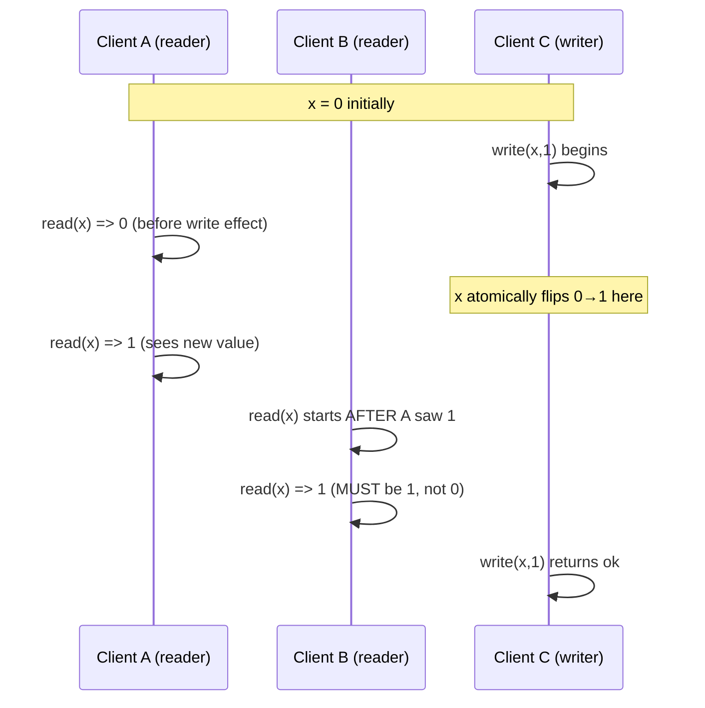
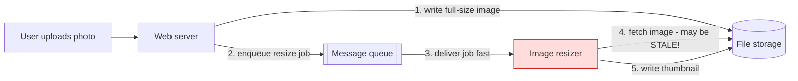
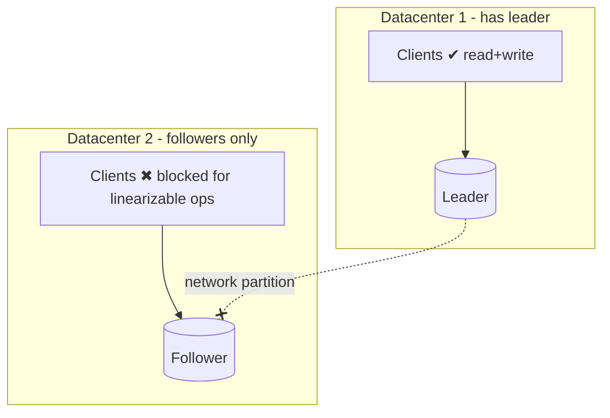
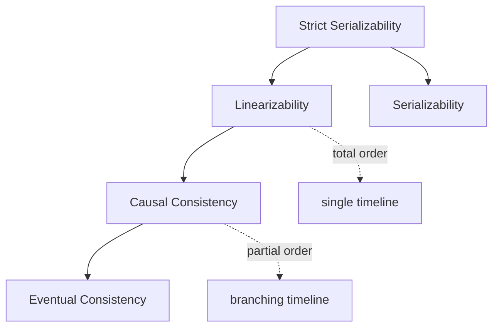
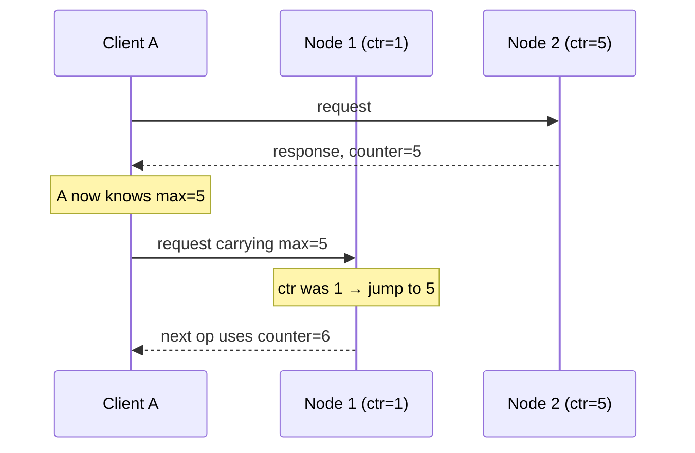
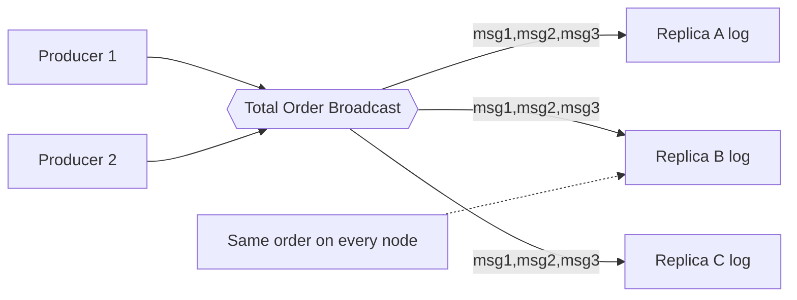
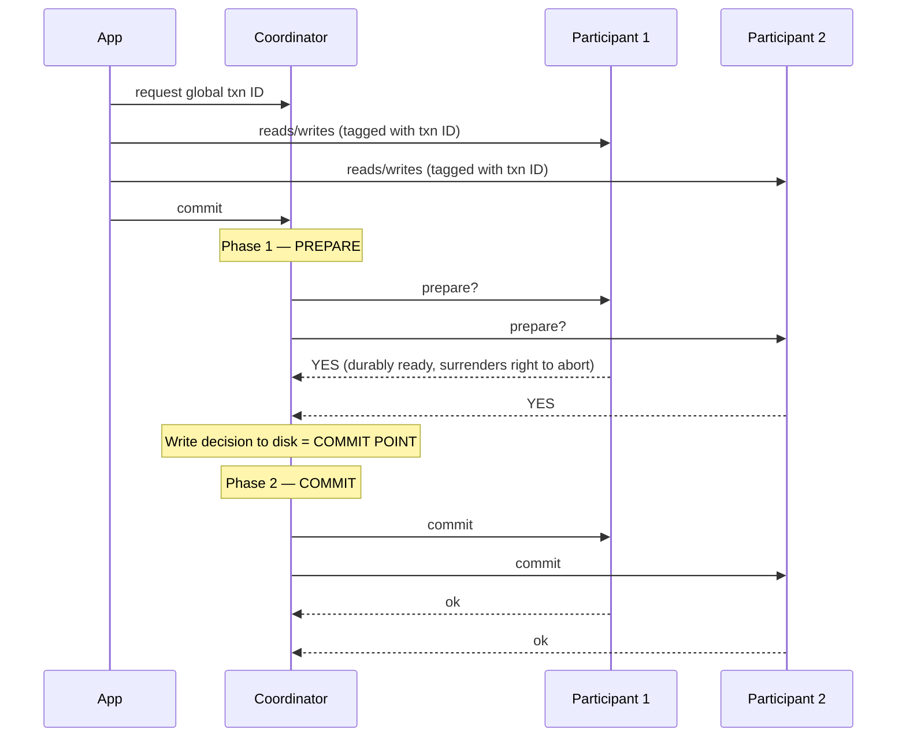
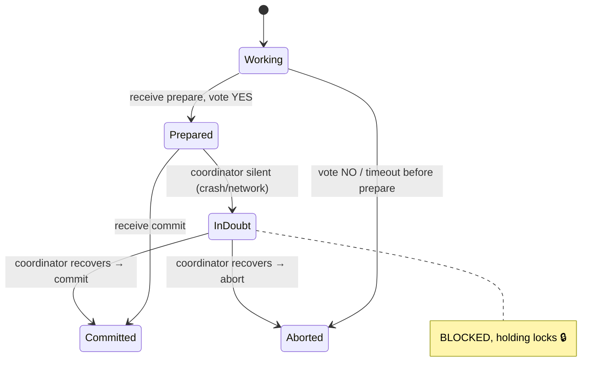
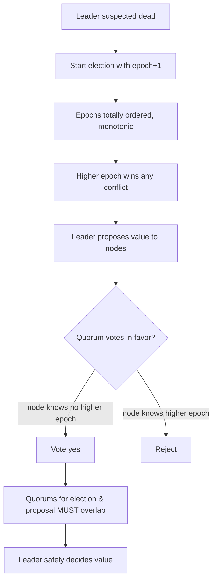
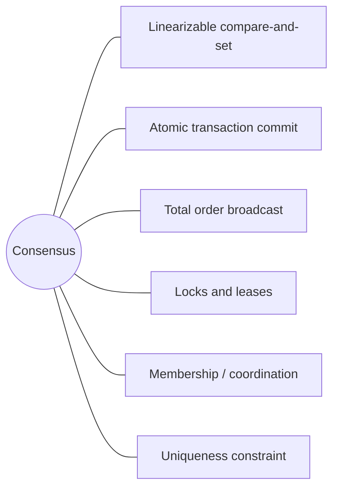

# DDIA Chapter 9: Consistency and Consensus

> Part II: Distributed Data | Maps to: [consensus-algorithms](../../system-design/04-very-hard/consensus-algorithms.md) · [leader-election](../../system-design/04-very-hard/leader-election.md) · [distributed-consensus](../../system-design/04-very-hard/distributed-consensus.md)

## 🎯 Chapter in One Paragraph

Distributed systems fail in messy ways — packets are lost, reordered, delayed; clocks lie; nodes pause or crash. Rather than let every application reinvent fault tolerance, DDIA Chapter 9 hunts for *general-purpose abstractions* that hide this chaos behind clean guarantees. It builds a ladder of consistency models, starting from the strongest and most intuitive one — **linearizability** (the illusion that there is a single, always-up-to-date copy of the data) — and shows why it is powerful but slow and fragile under network partitions (the practical meaning of the **CAP theorem**). It then steps down to **causal consistency**, which preserves cause-and-effect ordering without the coordination cost, and explores how to order events using **Lamport timestamps** and **total order broadcast**. Finally it confronts **consensus** — getting nodes to irrevocably agree on a value — showing that atomic commit (**2PC**), total order broadcast, linearizable compare-and-set, uniqueness constraints, locks, and leader election are all *the same problem in disguise*. The chapter closes with real consensus algorithms (Paxos, Raft, Zab, VSR) and coordination services (ZooKeeper, etcd) that package this hard-won theory into reusable infrastructure. The overarching lesson: consensus is unavoidable if you want fault-tolerant agreement, so don't hand-roll it — outsource it to a proven system.

## 🧠 Key Concepts & Vocabulary

- **Eventual consistency (convergence):** If writes stop, all replicas eventually return the same value. Says nothing about *when*; reads may return stale or missing data until convergence.
- **Linearizability (atomic / strong / immediate / external consistency):** A **recency guarantee** — the system behaves as if there is a single copy of the data and every operation takes effect atomically at one instant between its start and end. Once any client reads a new value, all later reads (by any client) must see it or newer.
- **Register:** The abstract unit of storage in the literature — one key, one row, or one document. Supports `read`, `write`, and `cas` (compare-and-set).
- **Serializability:** An **isolation** property of *transactions* — the outcome equals *some* serial order of whole transactions. Different concern from linearizability.
- **Strict serializability (strong-1SR):** Serializability + linearizability combined.
- **CAP theorem:** During a network **partition**, a system must choose between linearizable **C**onsistency and **A**vailability. Better phrased "Consistent *or* Available when Partitioned." Narrow scope; mostly historical.
- **Causality / happens-before:** A partial order: A happened-before B if B could have known about / depended on A. If neither precedes the other, they are **concurrent**.
- **Causal consistency:** The strongest model that stays fast and available under network delays; guarantees causally related operations are seen in order.
- **Total order vs partial order:** Total order — any two elements comparable (linearizability). Partial order — some elements incomparable/concurrent (causality).
- **Logical clock:** A counter-based mechanism for ordering events, independent of wall-clock time.
- **Lamport timestamp:** A `(counter, node ID)` pair giving a *total order consistent with causality*. Nodes carry the max counter seen and bump their own to match.
- **Version vector:** Tracks per-node counters; can *distinguish* concurrent vs causally-dependent operations (Lamport timestamps cannot).
- **Total order broadcast (atomic broadcast / total order multicast):** Delivering messages to all nodes **reliably** and in the **same total order**, with the order fixed at delivery time.
- **State machine replication:** If all replicas apply the same deterministic operations in the same order, they stay consistent — the foundation for replicated databases.
- **Fencing token:** A monotonically increasing number handed out with a lock/lease so a paused-then-resumed client cannot corrupt shared state (ZooKeeper's `zxid`).
- **Atomic commit / 2PC:** Getting all nodes in a distributed transaction to agree to *all commit* or *all abort*.
- **Coordinator (transaction manager):** The 2PC component that runs the prepare/commit phases and stores the decision.
- **In-doubt / uncertain transaction:** A participant that voted "yes" but hasn't heard the coordinator's decision — it must block (holding locks).
- **3PC:** A non-blocking commit variant that only works under bounded delays / a perfect failure detector — impractical in real networks.
- **XA / JTA:** A standard C API (and Java binding) for 2PC across heterogeneous databases and message brokers.
- **Heuristic decision:** An XA escape hatch letting a participant unilaterally commit/abort an in-doubt transaction — "probably breaking atomicity."
- **Consensus:** Nodes propose values; the algorithm decides one, satisfying **uniform agreement**, **integrity**, **validity**, **termination**.
- **FLP result:** No deterministic algorithm guarantees consensus in a purely asynchronous model with crashes — but timeouts or randomness sidestep it.
- **Epoch / ballot / view / term number:** A monotonically increasing election counter; the leader is unique *within* an epoch.
- **Quorum:** A majority (typically) of nodes; two quorums must overlap so decisions are consistent.
- **Membership / coordination service:** ZooKeeper, etcd, Consul — outsourced consensus, locking, failure detection, and service discovery.

## 📚 Deep Dive

The chapter is a three-act journey: **(1) Linearizability**, **(2) Ordering Guarantees**, **(3) Distributed Transactions and Consensus** — with the punchline that these acts are secretly the same story.

### 1. Consistency Guarantees: from eventual to strong

Every replication scheme (single-leader, multi-leader, leaderless) yields at least **eventual consistency**: stop writing, wait an unspecified time, and replicas converge. That's a *very* weak promise — before convergence, reads "could return anything or nothing." It's hard to program against because a database *looks* like a variable but doesn't behave like one; bugs hide until a fault or high concurrency exposes them.

Stronger models cost performance or fault tolerance but are far easier to reason about. Note the distinction from transaction isolation: **isolation** fights races between concurrent transactions; **distributed consistency** coordinates replicas under delay and failure. They overlap but are largely independent.

### 2. Linearizability — the illusion of a single copy

Linearizability makes the system *pretend* there is one copy of the data on which all operations are atomic. It is fundamentally a **recency guarantee**: the moment a write completes, every subsequent read must return that value (or a newer one), never a stale one.

**The football example:** Alice refreshes and sees the World Cup final score; she tells Bob; Bob refreshes and his phone (hitting a lagging replica) still shows the game in progress. Because Bob's read began *after* Alice's, linearizability is violated.

**Formalizing it with a register.** Consider clients reading/writing key `x` with variable network delays. Each operation spans an interval (request sent → response received):

- A read entirely *before* a write must return the old value.
- A read entirely *after* a write completes must return the new value.
- A read *overlapping* the write may return either.
- **Crucial extra constraint:** once any read returns the new value, all later reads must too — the value flips atomically at a single point and never flips back.

Adding `cas(x, old, new)` (atomic compare-and-set) lets us model conditional updates. Testing linearizability means recording all request/response timings and checking they can be arranged into one valid sequential history where the "effect points" only move forward in time.

#### Linearizability vs Serializability

| | Serializability | Linearizability |
|---|---|---|
| What it constrains | Whole transactions (multi-object) | Single register/object ops |
| Guarantee type | Isolation (behaves like *some* serial order) | Recency (reads see latest write) |
| Order freedom | Serial order may differ from real time | Must match real-time ordering |
| Prevents write skew? | Yes (if truly serializable) | No (single-object only) |
| Combined form | — | Both = **strict serializability** |

2PL and actual-serial-execution are typically linearizable; **Serializable Snapshot Isolation (SSI) is *not*** — it reads from a consistent snapshot that deliberately excludes the newest writes.

#### When you actually need linearizability

- **Locking & leader election:** Only one node may hold the lock/become leader. ZooKeeper and etcd provide this via consensus (their writes are linearizable; reads can be stale unless you ask for a `quorum read` in etcd or call `sync()` in ZooKeeper).
- **Uniqueness constraints:** Registering a username, reserving a seat, keeping a balance non-negative — all need a single up-to-date value that everyone agrees on. This is essentially a `cas`.
- **Cross-channel timing dependencies:** The image-resizer example — a web server writes a photo to file storage, then enqueues a resize job. If storage isn't linearizable, the resizer may fetch a stale/absent image because the fast message queue outraces the slow internal replication. Two communication channels → race condition, exactly like Alice's voice bypassing the DB replication.

#### Can replication methods be linearizable?

| Replication method | Linearizable? | Why |
|---|---|---|
| Single-leader | Potentially | Reads from leader or sync followers *can* be, but snapshot isolation, bugs, or a "delusional" old leader break it |
| Consensus algorithms | Yes | Built-in defenses against split brain & stale replicas (ZooKeeper, etcd) |
| Multi-leader | No | Concurrent writes on multiple nodes → conflicts |
| Leaderless (Dynamo-style) | Probably not | Even strict quorums can race; LWW clocks & sloppy quorums definitely break it |

**The quorum surprise:** Even with `w + r > n` strict quorums, linearizability can fail (Figure 9-6): a writer sends `x=1` to all three nodes; reader A (quorum of 2) catches one node already updated and returns `1`; reader B, starting *after* A finished, hits the two lagging nodes and returns the old `0`. To fix it you'd need synchronous read repair and writers reading a quorum first — at a big performance cost. Riak skips it; Cassandra does read repair but still loses linearizability under concurrent writes (LWW). A linearizable `cas` can't be built from quorums at all — it needs consensus.

### 3. The Cost of Linearizability & CAP

Consider two datacenters connected by a link that fails:

- **Multi-leader:** Each DC keeps working, queuing writes to exchange later → **available**, not linearizable.
- **Single-leader:** The leader lives in one DC; the other DC can't reach it → no writes, no linearizable reads → **unavailable** there.

**CAP** captures this: under a partition, choose Consistency (linearizability) *or* Availability. Key clarifications the chapter stresses:

- Partitions are a *fault*, not a design choice — you don't "pick" P.
- CAP's formal "availability" is idiosyncratic; many "highly available" systems don't meet it.
- CAP only covers *one* consistency model (linearizability) and *one* fault (partitions) — nothing about delays, dead nodes, latency. It's superseded by finer results and "best avoided."

**Deeper truth — linearizability is slow always, not just during faults.** Even RAM on a multi-core CPU isn't linearizable (per-core caches/store buffers) — and that's for *performance*, not fault tolerance. Attiya & Welch proved linearizable read/write response time is at least proportional to network delay *uncertainty*. No faster algorithm exists; weaker models can be much faster.

### 4. Ordering Guarantees — causality

Ordering, linearizability, and consensus are deeply linked. **Causality** imposes a partial order (cause before effect; question before answer; message sent before received). Examples woven through the book: consistent prefix reads, "row created before updated," the happens-before relation, consistent snapshots, write-skew detection in SSI, and Alice/Bob.

- **Linearizability = total order** (one timeline, no concurrency).
- **Causality = partial order** (timeline branches and merges — like a Git commit graph).

**Linearizability implies causality** (it's *stronger*). But linearizability hurts performance/availability, whereas **causal consistency is the strongest model that stays fast and available under network delays** and to which CAP does not apply. Many systems that seem to need linearizability really only need causal consistency.

**Capturing causality** needs tracking which operation happened-before which — generalizing version vectors across the whole database (not just one key), passing read version numbers back on writes (like SSI conflict detection).

### 5. Sequence Number Ordering

Tracking *all* causal dependencies is impractical, so use **sequence numbers / timestamps** — compact and totally ordered. A single leader's replication log naturally gives a total order consistent with causality (just increment a counter).

**Without a single leader**, naive generators break causality:
- Odd/even split per node → counters drift, can't compare cross-node.
- Physical clock timestamps → clock skew makes them inconsistent with causality (also used by LWW).
- Preallocated blocks (node A: 1–1000, B: 1001–2000) → a causally-later op can get a *lower* number.

#### Lamport timestamps

A `(counter, node ID)` pair. Comparison: higher counter wins; tie broken by node ID. **The magic:** every node and client tracks the **maximum counter it has seen** and includes it on every request; on receiving a higher max, it jumps its counter forward. This threads causality through the counters, producing a total order consistent with causality.

Lamport timestamps vs version vectors: Lamport always yields a *total* order but **cannot** tell if two ops are concurrent; version vectors *can* distinguish concurrent from causal but are larger.

**But timestamp ordering isn't enough.** For a uniqueness constraint (two users grabbing the same username), a node deciding *right now* can't know whether another node is concurrently claiming the same name with a lower timestamp — it would have to check every other node, and any unreachable node halts the system. The total order only *emerges after* collecting all operations. You need to know **when the order is finalized** → total order broadcast.

### 6. Total Order Broadcast

Two safety properties, always upheld even under faults:

- **Reliable delivery:** if a message reaches one node, it reaches all.
- **Totally ordered delivery:** every node delivers messages in the same order.

The order is **fixed at delivery time** — no retroactive insertion. Uses:

- **Database replication** via **state machine replication** — same writes, same order, consistent replicas.
- **Serializable transactions** — deterministic stored procedures applied in the same order everywhere.
- **A log** — delivering a message == appending to the log; everyone reads the same sequence.
- **Fencing tokens** — the sequence number is monotonically increasing (ZooKeeper's `zxid`).

#### Linearizable storage ⇄ Total order broadcast

- **Build linearizable `cas` from TOB:** append your claim to the log, read the log back until your message appears, and check whether *your* message is the first claim for that username. First-wins; everyone agrees. (This gives **sequential consistency** for reads unless you also sequence reads through the log, use ZooKeeper `sync()`, or read from a synchronously-updated replica as in chain replication.)
- **Build TOB from linearizable storage:** keep a linearizable integer with atomic **increment-and-get**; tag each message with the returned number and deliver in order. Unlike Lamport timestamps, these numbers have **no gaps** — a node holding message 4 that receives 6 knows it must wait for 5.

**Profound insight:** a linearizable `cas`/increment-and-get register and total order broadcast are **both equivalent to consensus**. Solve one → solve them all. Building a fault-tolerant linearizable sequence generator inevitably becomes a consensus algorithm.

### 7. Distributed Transactions and Consensus

Situations needing agreement: **leader election** (avoid split brain) and **atomic commit** (all-commit or all-abort across nodes).

#### Two-Phase Commit (2PC)

A **coordinator** (transaction manager) drives two phases across **participants**:

**Two points of no return:** (1) a participant voting "yes" *promises* it can commit later (no crash/power/disk excuse); (2) once the coordinator writes its decision to disk, that decision is irrevocable and retried forever. These promises give atomicity. (Don't confuse **2PC** = atomic commit with **2PL** = serializable isolation — unrelated despite the names.)

**Coordinator failure is the fatal flaw.** If the coordinator crashes *after* participants vote "yes" but *before* sending the decision, participants are **in-doubt** — they cannot safely commit (another may have aborted) or abort (another may have committed). They can only **block, holding locks**, until the coordinator recovers and reads its log. This is why 2PC is a **blocking** protocol.

**3PC** promises non-blocking but needs bounded delays and a *perfect failure detector* — impossible with unbounded network delay and process pauses. A timeout is not a reliable failure detector. So 2PC persists despite its flaw.

#### Distributed transactions in practice

Two conflated types:

| Type | Participants | Verdict |
|---|---|---|
| Database-internal | Same DB software (VoltDB, MySQL Cluster NDB) | Can work well; can use optimizations, even distributed SSI |
| Heterogeneous (XA/JTA) | Different vendors, DBs + message brokers | Powerful but painful |

Heterogeneous XA enables **exactly-once message processing** — atomically commit the message ack *and* the DB writes; on abort both roll back so the message can be safely redelivered.

**XA limitations:** it's just a C API loaded into the *application* process; if the app crashes, in-doubt participants block. The coordinator log becomes crucial durable state → app servers are no longer stateless. XA is a lowest-common-denominator: can't detect cross-system deadlocks, can't do SSI. **Heuristic decisions** (unilateral commit/abort) "probably break atomicity" — emergency only. Distributed transactions **amplify failures**: if any participant is down, the whole transaction fails, running counter to fault tolerance. MySQL distributed txns are reportedly ~10× slower (fsync + round-trips).

#### Fault-Tolerant Consensus

Formal properties:

| Property | Meaning | Type |
|---|---|---|
| Uniform agreement | No two nodes decide differently | Safety |
| Integrity | No node decides twice | Safety |
| Validity | A decided value was proposed by some node | Safety |
| Termination | Every non-crashed node eventually decides | Liveness |

- A "dictator" node satisfies the first three but fails **termination** if it crashes (exactly 2PC's coordinator problem).
- **Termination requires a majority** of nodes alive; safety (agreement/integrity/validity) holds *even if* a majority fails or the network breaks — an outage can *stop progress* but never *corrupt* the decision.
- **FLP** says no deterministic async algorithm always reaches consensus with crashes — but timeouts or randomness make it solvable in practice.
- Standard algorithms assume **no Byzantine faults** (tolerable only if < 1/3 nodes are Byzantine, via BFT protocols).

**Best-known algorithms:** Viewstamped Replication (VSR), **Paxos** (Multi-Paxos for sequences), **Raft**, **Zab** (ZooKeeper). Most don't decide a single value — they decide a *sequence*, making them **total order broadcast** algorithms == repeated rounds of consensus.

**Single-leader replication vs consensus — the chicken-and-egg.** Manual leader config = a "dictator" that fails termination. Automatic failover gets closer but needs consensus to elect a leader — yet consensus algorithms *use* a leader. Resolution via **epoch numbering**:

Two voting rounds (elect leader; approve proposal) whose **quorums must overlap** — so any successful proposal proves no newer election happened. Differences from 2PC: coordinator is *elected* (not fixed), only a *majority* must vote (not everyone), and there's a defined recovery process.

**Limitations of consensus:**
- Voting on proposals = synchronous replication → slower; many accept async replication's data-loss risk instead.
- Needs a strict majority: 3 nodes tolerate 1 failure, 5 tolerate 2. A partition blocks the minority side.
- Mostly fixed membership; **dynamic membership** is harder and less understood.
- Relies on timeouts → in variable-delay networks, false leader-death triggers churning elections (Raft can bounce leadership on one bad link). Robustness to unreliable networks is an open problem.

#### Membership & Coordination Services (ZooKeeper, etcd)

Modeled on Google's **Chubby**. They hold *small*, slow-changing data (e.g., "node 10.1.1.23 is leader for partition 7") replicated via fault-tolerant total order broadcast. Feature set:

| Feature | What it provides | Needs consensus? |
|---|---|---|
| Linearizable atomic ops (`cas`) | Distributed locks/leases | Yes |
| Total ordering of ops | Fencing tokens (`zxid`, `cversion`) | (from TOB) |
| Failure detection | Sessions + heartbeats; ephemeral nodes auto-release on timeout | — |
| Change notifications (watches) | Clients notified on changes instead of polling | — |

Uses: **allocating work/partitions to nodes**, automatic failover, **service discovery** (though discovery itself doesn't strictly need consensus — DNS-style stale reads are fine; leader election does). ZooKeeper runs on a fixed small ensemble (3 or 5) doing majority votes while serving many clients — "outsourced" coordination. Read-only caching replicas can serve non-linearizable reads.

**The grand equivalence** — all reducible to consensus:

## ⚠️ Edge Cases, Failure Modes & Gotchas

- **Read-your-own-writes illusion broken:** Write then immediately read from a different replica returns the old value — eventual consistency provides no recency.
- **Value flip-flop:** Without the full linearizability constraint, concurrent reads could see a value bounce old→new→old — forbidden by "once seen, always seen."
- **Delusional leader:** An old leader that doesn't know it was deposed keeps serving reads → violates linearizability. Async failover can silently *lose committed writes*.
- **Strict-quorum non-linearizability (Figure 9-6):** `w+r>n` still races — reader A (updated quorum) sees new, later reader B (lagging quorum) sees old.
- **LWW eats writes:** Time-of-day-clock last-write-wins (Cassandra) is non-linearizable and silently drops concurrent writes due to clock skew.
- **Sloppy quorums / hinted handoff:** Destroy any chance of linearizability.
- **`cas` can't come from quorums:** Compare-and-set fundamentally requires consensus.
- **Cross-channel race:** Message queue outraces internal storage replication → resizer sees stale/absent image → permanently inconsistent thumbnail.
- **CAP misuse:** "Pick 2 of 3" is misleading; partitions aren't optional. CAP's "availability" ≠ everyday meaning. Don't use CAP to justify multi-core memory models.
- **Physical clocks inconsistent with causality (Figure 8-3):** A causally-later op can receive a *smaller* timestamp.
- **Block allocator inversion:** A later op gets a number in block 1–1000 while an earlier op sits in 1001–2000.
- **Lamport timestamps can't detect concurrency:** Great for total order, useless for "were these concurrent?" — use version vectors for that.
- **Timestamp ordering can't enforce uniqueness live:** Deciding *now* requires knowing the order is finalized; checking every node halts on one unreachable node.
- **Lamport gaps vs TOB no-gaps:** With Lamport, seeing message 6 doesn't tell you to wait for 5; with linearizable increment-and-get, gaps signal missing messages.
- **2PC coordinator crash → in-doubt participants block, holding locks**, freezing other transactions — possibly for 20 minutes (slow restart) or forever (lost log).
- **Orphaned in-doubt transactions:** Corrupted/lost coordinator logs → transactions stuck forever; even DB reboots must preserve their locks; only manual admin resolution helps.
- **Heuristic decisions break atomicity:** Emergency unilateral commit/abort can leave participants inconsistent.
- **XA is a lowest common denominator:** No cross-system deadlock detection, no SSI, coordinator-in-app-process makes servers stateful and creates a single point of failure.
- **Distributed transactions amplify failures:** Any down participant fails the whole txn.
- **FLP impossibility:** Pure async + deterministic + crash = no guaranteed consensus; escape via timeouts/randomness.
- **Byzantine faults:** Standard consensus assumes honest nodes; a lying node breaks safety unless BFT (< 1/3 faulty) is used.
- **Consensus needs a majority:** Minority partition can't make progress.
- **Election churn (Raft edge case):** One consistently flaky link can cause endless leadership bouncing → no progress despite safety holding.
- **Split brain:** Two nodes both believing they're leader accept conflicting writes → data loss/corruption; fencing (STONITH) mitigates but can misfire.
- **GitHub incident:** A stale MySQL follower promoted to leader reused autoincrement primary keys already in Redis → private data leaked to wrong users (a real consequence of failover losing writes).
- **ZooKeeper reads are stale by default:** Writes are linearizable; use etcd `quorum read` or ZooKeeper `sync()` for linearizable reads.
- **Membership false negatives:** A live node can be wrongly declared dead by consensus — but shared agreement on membership is still valuable.

## 🔑 Key Takeaways

- **Eventual consistency is weak;** it says replicas converge but never *when* — hard to program against, bugs surface only under faults/concurrency.
- **Linearizability = "single copy + atomic ops + recency."** Intuitive but slow *all the time* (response time ∝ network-delay uncertainty) and unavailable under partitions.
- **Linearizability ≠ serializability:** recency of one object vs isolation of whole transactions. Both together = strict serializability.
- **CAP** = choose Consistency or Availability *when Partitioned*; it's narrow, widely misused, and mostly of historical interest.
- **Causal consistency is the sweet spot:** strongest model that stays fast and available under network delay; linearizability implies causality but costs more.
- **Lamport timestamps** give a total order consistent with causality but can't detect concurrency and can't finalize an order — insufficient for uniqueness constraints.
- **Total order broadcast** (reliable + same-order delivery) underlies state-machine replication and is **equivalent to consensus**.
- **2PC** provides atomic commit but is **blocking** — a coordinator crash strands in-doubt participants holding locks. **3PC** is impractical.
- **XA/heterogeneous distributed transactions** amplify failures and carry heavy operational cost; the coordinator is itself a critical database.
- **Consensus** (agreement, integrity, validity, termination) needs a **majority**; safety survives outages, only liveness stops. FLP is dodged by timeouts/randomness.
- **A huge family of problems reduces to consensus:** linearizable `cas`, atomic commit, total order broadcast, locks/leases, uniqueness constraints, membership.
- **A single leader "kicks the can down the road":** it avoids per-write consensus but still needs consensus to elect/maintain the leader.
- **Don't hand-roll consensus.** Use proven algorithms (Paxos/Raft/Zab/VSR) or outsource to **ZooKeeper/etcd/Consul**.

## 💡 Real-World Applications & Examples

- **Kubernetes** stores all cluster state in **etcd**, relying on Raft-backed linearizable operations for the API server's optimistic concurrency and leader election of controllers.
- **HBase, Hadoop YARN, OpenStack Nova, and Apache Kafka** use **ZooKeeper** for coordination, leader/controller election, and membership. (Kafka's newer KRaft mode replaces ZooKeeper with a self-managed Raft quorum.)
- **Google Chubby** (the ancestor of ZooKeeper) provides coarse-grained locks and small-file storage for GFS/Bigtable master election.
- **Google Spanner** makes physical-clock timestamps consistent with causality using **TrueTime** — waiting out the clock-uncertainty interval before commit, enabling external consistency at global scale.
- **CockroachDB** and **TiKV/TiDB** use Raft per data range/region for strongly-consistent, horizontally-scalable SQL.
- **Consul** (HashiCorp) uses Raft for its KV store + service discovery and health checking.
- **Microsoft Azure Storage** uses **chain replication** (a synchronous-replication variant) for durability without losing data on failover.
- **VoltDB / Calvin** use deterministic transactions ordered by total order broadcast for serializable distributed execution.
- **Financial/booking systems** (last airline seat, unique username, non-negative balance) require the linearizable `cas`/uniqueness guarantees only consensus can safely provide.
- **Jepsen (aphyr) testing** empirically found linearizability/consistency violations in MongoDB, etcd, Consul, Elasticsearch, and Cassandra — validating the chapter's warnings.

## 🛠️ Open-Source Implementations (GitHub)

| Project | GitHub | How it relates to this chapter | ~Stars |
|---|---|---|---|
| etcd | https://github.com/etcd-io/etcd | Raft-based linearizable key-value store; distributed locks, leader election, quorum reads (backs Kubernetes) | ~48k |
| etcd/raft | https://github.com/etcd-io/raft | Standalone Raft library implementing total order broadcast / replicated state machine | ~1k |
| Apache ZooKeeper | https://github.com/apache/zookeeper | Zab-based coordination service: linearizable atomic ops, fencing tokens (zxid), ephemeral nodes, watches | ~12k |
| HashiCorp Raft | https://github.com/hashicorp/raft | Widely-used Go Raft library for replicated logs/FSMs (Consul, Nomad, Vault) | ~8k |
| HashiCorp Consul | https://github.com/hashicorp/consul | Raft-backed KV store, service discovery, leader election, membership | ~28k |
| CockroachDB | https://github.com/cockroachdb/cockroach | Per-range Raft consensus for strict-serializable distributed SQL | ~30k |
| TiKV | https://github.com/tikv/tikv | Distributed transactional KV store using Multi-Raft (Percolator-style txns) | ~15k |
| Apache Kafka | https://github.com/apache/kafka | Partitioned log = total order broadcast per partition; KRaft mode is a Raft consensus quorum | ~29k |
| Apache Curator | https://github.com/apache/curator | High-level ZooKeeper recipes (locks, leader election, barriers) | ~3k |
| Jepsen | https://github.com/jepsen-io/jepsen | Framework that empirically tests linearizability & consensus safety of real databases | ~7k |

## 🔗 References & Further Reading

- Herlihy & Wing, "Linearizability: A Correctness Condition for Concurrent Objects," ACM TOPLAS, 1990 — the formal definition of linearizability.
- Leslie Lamport, "Time, Clocks, and the Ordering of Events in a Distributed System," CACM, 1978 — Lamport timestamps & happens-before. https://lamport.azurewebsites.net/pubs/time-clocks.pdf
- Fischer, Lynch & Paterson, "Impossibility of Distributed Consensus with One Faulty Process" (FLP), JACM, 1985.
- Gilbert & Lynch, "Brewer's Conjecture and the Feasibility of Consistent, Available, Partition-Tolerant Web Services," 2002 — the CAP theorem, formalized.
- Martin Kleppmann, "A Critique of the CAP Theorem," arXiv:1509.05393, 2015. https://arxiv.org/abs/1509.05393 · and "Please Stop Calling Databases CP or AP," https://martin.kleppmann.com/2015/05/11/please-stop-calling-databases-cp-or-ap.html
- Lamport, "The Part-Time Parliament" (Paxos, 1998) & "Paxos Made Simple" (2001). https://lamport.azurewebsites.net/pubs/paxos-simple.pdf
- Ongaro & Ousterhout, "In Search of an Understandable Consensus Algorithm" (Raft), USENIX ATC 2014. https://raft.github.io/raft.pdf
- Junqueira, Reed & Serafini, "Zab: High-Performance Broadcast for Primary-Backup Systems," DSN 2011.
- Mike Burrows, "The Chubby Lock Service for Loosely-Coupled Distributed Systems," OSDI 2006. https://research.google/pubs/pub27897/
- Fred Schneider, "Implementing Fault-Tolerant Services Using the State Machine Approach: A Tutorial," ACM Computing Surveys, 1990.
- Gray & Lamport, "Consensus on Transaction Commit," ACM TODS, 2006 — links 2PC and consensus.
- Attiya & Welch, "Sequential Consistency Versus Linearizability," ACM TOCS, 1994 — the cost-of-linearizability lower bound.
- Chandra & Toueg, "Unreliable Failure Detectors for Reliable Distributed Systems," JACM, 1996.
- Kyle Kingsbury (aphyr), "Call Me Maybe" Jepsen series. https://aphyr.com/tags/jepsen
- etcd docs: https://etcd.io/docs/ · ZooKeeper docs: https://zookeeper.apache.org/doc/current/ · Raft visualization: https://raft.github.io/

## ❓ Self-Check Questions

1. **What exactly does linearizability guarantee, and how does it differ from serializability?**
   Linearizability is a *recency* guarantee on individual objects: the system acts as if there's one copy and every op is atomic at a point in time, so once a value is read all later reads see it or newer. Serializability is a transaction *isolation* property: the outcome equals some serial order of whole (multi-object) transactions, and that order need not match real time. Both together = strict serializability.

2. **Why can a strict quorum (`w + r > n`) still be non-linearizable?**
   Variable network delays let a write reach different replicas at different times. A read completing earlier may hit an already-updated quorum (new value) while a *later* read hits a lagging quorum (old value), violating recency — as in Figure 9-6. Fixing it needs synchronous read repair and quorum reads by writers, at a performance cost; a `cas` can't be done this way at all.

3. **State the CAP theorem precisely and explain why "pick 2 of 3" is misleading.**
   During a network partition you must choose linearizable Consistency *or* Availability — better stated "Consistent or Available when Partitioned." "Pick 2 of 3" is wrong because partitions are a fault you don't choose; they happen regardless. CAP also covers only one consistency model and one fault type, so it's of limited practical value.

4. **What makes Lamport timestamps consistent with causality, and what can't they do?**
   Each node/client tracks the maximum counter it has seen and bumps its own counter to any larger value it receives, so every causal dependency raises the timestamp — yielding a total order consistent with causality. They *cannot* tell whether two operations are concurrent (version vectors can) and can't tell you *when* the total order is finalized.

5. **Why is total order broadcast equivalent to consensus?**
   TOB requires delivering the same messages in the same order to all nodes — that's repeated rounds of consensus, one decision per delivered message. Agreement→same order, integrity→no duplicates, validity→no fabrication, termination→no loss. Conversely, a linearizable increment-and-get register (a consensus primitive) can build TOB.

6. **Why is 2PC a *blocking* protocol, and what state causes the block?**
   If the coordinator crashes after participants vote "yes" but before broadcasting the decision, those participants are *in-doubt*: they can't unilaterally commit (someone may have aborted) or abort (someone may have committed). They must block, holding locks, until the coordinator recovers and reads its on-disk decision. 3PC would be non-blocking only with a perfect failure detector, which real networks can't provide.

7. **List the four properties of consensus and which is the liveness property.**
   Uniform agreement, integrity, validity (all safety), and **termination** (liveness — every non-crashed node eventually decides). Termination requires a majority alive; safety holds even if a majority fails.

8. **How does epoch/term numbering solve the "to elect a leader you need a leader" paradox?**
   Consensus protocols don't guarantee a *unique* leader globally, only per epoch. On suspected leader death, a new election with an incremented, totally-ordered epoch runs; higher epochs win conflicts. A leader must gather a quorum for each proposal, and the election and proposal quorums overlap — so a successful proposal proves no newer election occurred, letting the leader safely decide.

9. **Which coordination tasks genuinely require consensus, and which don't?**
   Linearizable atomic operations (locks, leader election, uniqueness) require consensus. Failure detection, change notifications, and *service discovery* do not strictly need it — DNS-style stale reads are acceptable — though leader election (which discovery may piggyback on) does.

10. **Give a concrete production consequence of failover losing writes.**
    GitHub promoted a stale MySQL follower whose autoincrement counter lagged; it reused primary keys already referenced in Redis, cross-linking records and leaking private data to the wrong users — a direct result of async replication + failover discarding unreplicated writes.
