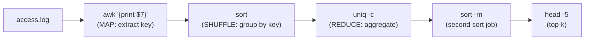
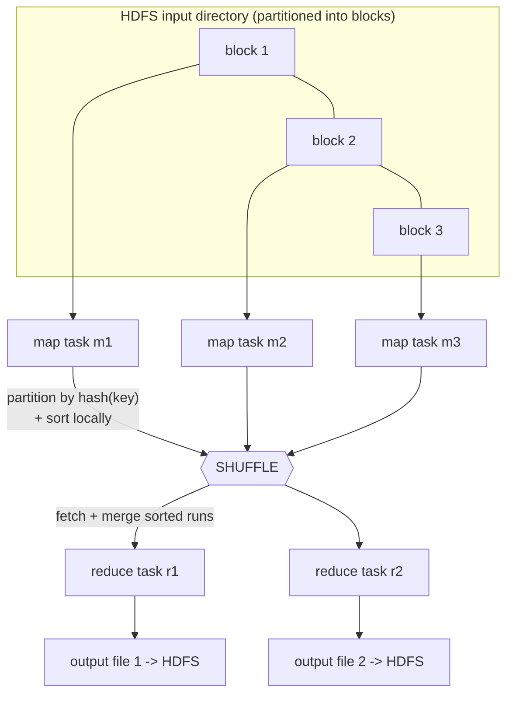
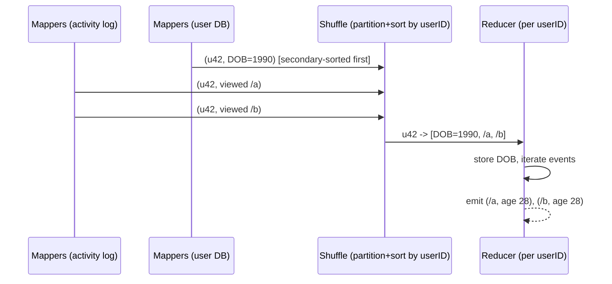
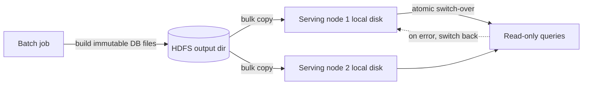
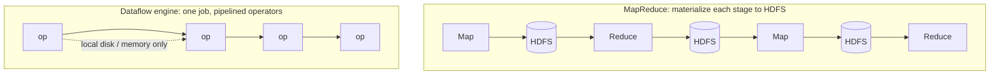
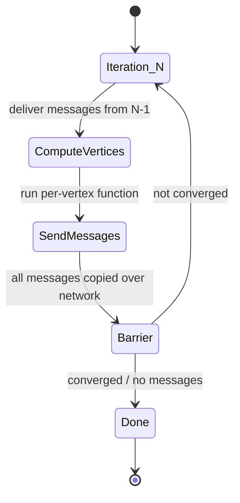

# DDIA Chapter 10: Batch Processing

> Part III: Derived Data | Maps to: Distributed Data Processing, MapReduce, Dataflow Engines (Spark/Flink/Tez), Data Warehousing/ETL, Graph Processing

## 🎯 Chapter in One Paragraph

Batch processing is the family of "offline" data systems that take a **large, bounded** input dataset, run a job over it, and produce derived output — optimizing for **throughput** rather than latency, because no user is waiting on the response. The chapter grounds the whole topic in the **Unix philosophy** (small composable tools joined by pipes over a uniform interface), then shows how those same ideas scale to thousands of machines via **MapReduce** running on a **distributed filesystem (HDFS)**. It walks through how joins, grouping, and sessionization are implemented with partitioning + sorting (sort-merge joins, broadcast/partitioned hash joins), how batch outputs (search indexes, read-only key-value stores, ML models) are built as immutable files, and why treating inputs as immutable gives **human fault tolerance** (just re-run). It contrasts MapReduce with MPP databases, then explains why newer **dataflow engines** (Spark, Flink, Tez) beat MapReduce by avoiding full materialization of intermediate state, and covers **iterative graph processing** (Pregel/BSP) and the rise of high-level declarative APIs. The unifying insight: batch jobs derive output from immutable, bounded input with no side effects, which makes them reliable, re-runnable, and easy to reason about.

## 🧠 Key Concepts & Vocabulary

- **Service (online system):** Waits for a request, responds ASAP. Measured by **response time** and availability.
- **Batch processing system (offline):** Crunches a large bounded input into output; runs for minutes to days; measured by **throughput**; typically scheduled periodically.
- **Stream processing (near-real-time / nearline):** Consumes/produces like batch but operates on events shortly after they occur (unbounded input); covered in Ch. 11.
- **Throughput:** Time to process an input dataset of a given size — the primary metric for batch jobs.
- **Unix philosophy:** Do one thing well; expect your output to become another program's input; build tools; iterate fast.
- **Uniform interface:** In Unix, the *file* (a byte stream / file descriptor). In MapReduce, the *distributed filesystem*. Enables composition.
- **stdin/stdout & pipes:** Separation of *logic* (the program) from *wiring* (where input comes from / output goes) — a form of loose coupling / inversion of control.
- **MapReduce:** A distributed batch programming model (Dean & Ghemawat, 2004): a **mapper** extracts key/value pairs from each record; the framework **sorts by key**; a **reducer** aggregates all values for a key.
- **HDFS (Hadoop Distributed File System):** Open-source reimplementation of the **Google File System (GFS)**. Shared-nothing; a central **NameNode** tracks which blocks live on which DataNode; blocks are replicated (or erasure-coded).
- **Shared-nothing vs shared-disk:** HDFS uses commodity machines with local disks (shared-nothing), contrasting with NAS/SAN (shared-disk) that need special hardware.
- **Erasure coding (e.g., Reed–Solomon):** Redundancy scheme with lower storage overhead than full replication, but loses data-locality advantage.
- **Partitioning:** Splitting work so each task handles a subset. Map tasks = input blocks; reduce tasks = configurable, assigned by **hash of key**.
- **Shuffle:** The process of partitioning mapper output by reducer, sorting, and copying partitions from mappers to reducers. (No randomness despite the name.)
- **Putting computation near the data:** Scheduling a map task on a machine that holds a replica of its input block to avoid network transfer.
- **Reduce-side join / sort-merge join:** Both inputs are keyed by the join key, sorted, and merged in the reducer so matching records are adjacent.
- **Secondary sort:** Arranging records so the reducer sees them in a chosen order (e.g., user record before its activity events).
- **Map-side join:** Join done in mappers with no reducers/sorting; requires assumptions about input layout.
- **Broadcast hash join:** Small input loaded fully into an in-memory hash table in every mapper; scan the large input against it.
- **Partitioned (bucketed) hash join:** Both inputs partitioned identically by the join key; each mapper joins one matching partition pair.
- **Map-side merge join:** Both inputs partitioned *and* sorted the same way; mappers merge incrementally.
- **GROUP BY / sessionization:** Grouping records by a key to aggregate; sessionization groups a user's events across servers.
- **Skew / hot keys / linchpin objects:** A single key with disproportionately much data (e.g., a celebrity), overloading one reducer.
- **Materialization:** Eagerly computing and writing intermediate results to files (vs streaming via pipes).
- **Dataflow engine:** Spark/Tez/Flink — treat a whole workflow as one job of connected **operators**, avoiding full materialization to HDFS between stages.
- **RDD (Resilient Distributed Dataset):** Spark's abstraction tracking data lineage for recomputation-based fault tolerance.
- **Checkpointing:** Periodically writing operator/vertex state to durable storage to enable recovery (used by Flink and Pregel).
- **Determinism:** Same input → same output. Required for safe recomputation-based recovery.
- **MPP database (Massively Parallel Processing):** Monolithic, tightly integrated analytic SQL systems (Teradata, Gamma, etc.).
- **Schema-on-read / data lake / "sushi principle":** Dump raw data first, interpret later; the consumer decides the schema.
- **Human fault tolerance:** Ability to recover from *buggy code* by rolling back and re-running, because inputs are immutable.
- **Pregel / Bulk Synchronous Parallel (BSP):** Iterative graph model where vertices send messages along edges in fixed rounds, remembering state between iterations.
- **Transitive closure:** Repeatedly following edges until convergence (e.g., all locations within a region).
- **Vectorized execution:** Processing data in tight, cache-friendly inner loops avoiding per-record function calls.

## 📚 Deep Dive

### Three kinds of systems and where batch fits

The chapter opens by distinguishing systems by their interaction and performance model:

| Type | Trigger | Latency profile | Primary metric | Example |
|------|---------|-----------------|----------------|---------|
| Service (online) | Client request; user waiting | Low response time critical | Response time, availability | Web server, REST API |
| Batch (offline) | Scheduled; no user waiting | Minutes → days | Throughput | MapReduce nightly job |
| Stream (near-real-time) | Event arrives | Between the two | Latency + throughput | Kafka + Flink (Ch. 11) |

Batch is "closer to analytics" (it scans large portions of input) but is neither OLTP nor a SQL analytic query — its output is often a *structure* (index, model, key-value DB), not a report. Batch is also ancient: the Hollerith tabulating machines (1890 US Census) and 1940s–50s IBM card sorters are conceptual ancestors of MapReduce.

### Batch Processing with Unix Tools

The running example: analyze an nginx access log to find the five most-requested URLs.

```
cat /var/log/nginx/access.log |
  awk '{print $7}' |   # extract the URL (7th whitespace field) — the "mapper"
  sort             |   # group identical URLs adjacently
  uniq -c          |   # count adjacent duplicates — the "reducer"
  sort -r -n       |   # sort by count, descending
  head -n 5            # keep top 5
```

This chain processes gigabytes in seconds and is trivially modifiable (e.g., `'$7 !~ /\.css$/'` to omit CSS, or `'{print $1}'` for top IPs).

**Sorting vs in-memory aggregation.** A Ruby equivalent keeps an in-memory hash table `{url → count}`. The Unix pipeline instead *sorts*. Which is better depends on the **working set**:
- If distinct keys (URLs) fit in memory → hash table is fine, even on a laptop.
- If the working set exceeds RAM → the sort approach wins because GNU `sort` **spills to disk** (mergesort with sequential I/O) and **parallelizes across cores** automatically. Same principle as SSTables/LSM-trees (Ch. 3).



**The Unix philosophy** (McIlroy, 1978), paraphrased: make each program do one thing well; expect output to become another program's input; avoid columnar/binary formats and interactive input; build and throw away tools freely. This is remarkably close to modern Agile/DevOps.

Why Unix tools compose:
- **Uniform interface:** everything is a file / byte stream (real files, pipes, sockets, devices). By convention, ASCII text with `\n` record separators, whitespace-delimited fields.
- **Separation of logic and wiring:** programs use stdin/stdout; the *shell* wires them, so a program doesn't care where input/output goes (loose coupling / late binding / inversion of control).
- **Transparency & experimentation:** inputs are immutable (rerun freely), you can inspect any pipeline stage with `less`, and you can persist a stage's output to restart from it.

**The key limitation:** Unix tools run on a **single machine**. That's the gap Hadoop fills.

### MapReduce and Distributed Filesystems

MapReduce is "Unix tools, distributed across thousands of machines." A job takes inputs, produces outputs, doesn't modify inputs, and writes output files once, sequentially.

**HDFS** provides the uniform interface. It is **shared-nothing**: a daemon on each machine exposes local disks over the network; a central **NameNode** maps file blocks → machines. Blocks are replicated (or erasure-coded) for fault tolerance. Object stores (S3, Azure Blob, Swift) are similar, but HDFS uniquely enables scheduling computation *on the machine holding a block's replica*. HDFS scales to tens of thousands of machines / hundreds of petabytes on commodity hardware.

**Job execution steps** (mirroring the log example):
1. Read input files, break into records (input format parser; e.g., `\n` splits lines).
2. **Mapper** extracts key/value from each record (called once per record, stateless).
3. Framework **sorts** all key/value pairs by key (implicit — you don't write it).
4. **Reducer** iterates over the sorted values for each key (adjacent duplicates), producing output.



**Distributed execution details:**
- **Parallelization = partitioning.** #map tasks = #input blocks; #reduce tasks = author-configured.
- The scheduler runs mappers **near the data** (on a machine holding the block), first copying the application code (JAR) there.
- Reducers are assigned keys by **hash of key** so all pairs with the same key land at the same reducer.
- **Shuffle:** each mapper writes sorted, per-reducer-partitioned files to *local* disk (SSTable-style). When a mapper finishes, reducers fetch their partition from every mapper, then **merge** the sorted runs. Reducer output is written to HDFS (local replica + copies elsewhere).

**Workflows.** A single job is limited (e.g., can compute page views per URL but not top-5, which needs a second sort). Jobs are chained into **workflows**: job 1's output directory becomes job 2's input directory. Hadoop has no native workflow support, so this is wired implicitly by directory name and orchestrated by schedulers: **Oozie, Azkaban, Luigi, Airflow, Pinball**. Recommendation systems commonly chain 50–100 jobs. A job's output is only valid on *successful* completion (partial output of failed jobs is discarded), so a job starts only when the jobs producing its inputs succeed. Higher-level tools (**Pig, Hive, Cascading, Crunch, FlumeJava**) auto-wire multi-stage workflows.

### Reduce-Side Joins and Grouping

In batch context, a "join" means resolving *all* occurrences of an association across a dataset (not one-record lookups). MapReduce has no indexes — it does **full table scans**, which is reasonable for analytic aggregates over many records.

**Worked example (Figure 10-2):** a large log of user activity events (fact table, only has user ID) joined with a user profile database (dimension, has date of birth) to compute, e.g., page popularity by age group.

**Naïve approach (bad):** for each event, query the remote user DB. Poor throughput (round-trip bound), overwhelms the DB, and is **nondeterministic** (remote data may change).

**Better: sort-merge join.**
- One set of mappers reads activity events → emits `(userID, event)`.
- Another set of mappers reads the user DB → emits `(userID, dateOfBirth)`.
- Framework partitions + sorts by user ID → all records for a user ID become adjacent at one reducer.
- **Secondary sort** ensures the reducer sees the DB record *first*, then activity events in timestamp order.
- The reducer holds the DOB in a local variable and iterates events, emitting `(viewed-url, viewer-age)`. Single-threaded, low memory, no network requests.



**Mappers "send messages" to reducers:** the key is like a destination address; all pairs with the same key are delivered to the same reducer call. This cleanly separates *network communication* (framework's job) from *application logic* (your join code), and the framework transparently retries failed tasks.

**GROUP BY** uses the same "bring related data together" pattern: set the mapper's output key to the grouping key; the reducer aggregates (COUNT, SUM, top-k). **Sessionization** groups all of a user's events (scattered across web servers' logs) by session/user ID — useful for A/B testing and funnel analysis.

**Handling skew (hot keys / linchpin objects):** one key with huge data (a celebrity) overloads a single reducer, and the whole job waits for the slowest reducer. Mitigations:

| Technique | System | How it works |
|-----------|--------|--------------|
| Skewed join | Pig | Sampling job finds hot keys; hot-key records go to *several random* reducers; the other input's hot-key records are replicated to all those reducers |
| Sharded join | Crunch | Same idea but hot keys specified explicitly (no sampling) |
| Skewed join | Hive | Hot keys declared in metadata, stored in separate files, joined map-side |
| Two-stage grouping | (general) | Stage 1 sends hot-key records to random reducers for partial aggregation; stage 2 combines partials into one value per key |

### Map-Side Joins

Reduce-side joins make no assumptions about input but pay for sorting/shuffling/merging (data may hit disk several times). If you *can* make assumptions, **map-side joins** skip reducers and sorting entirely — each mapper reads one input block and writes one output file.

| Join type | Precondition | Mechanism |
|-----------|--------------|-----------|
| **Broadcast hash join** | One input small enough to fit in memory | Each mapper loads the small input into a hash table, scans the large input's block, looks up matches. (Pig "replicated join", Hive "MapJoin", Impala.) Alternative: read-only on-disk index leveraging OS page cache. |
| **Partitioned (bucketed) hash join** | Both inputs partitioned identically (same key, hash fn, #partitions) | Each mapper joins one matching partition pair; smaller hash table per mapper. (Hive "bucketed map join".) |
| **Map-side merge join** | Both inputs partitioned *and* sorted the same way | Mapper merges both inputs incrementally like a reducer would; size-independent. |

**Output layout matters downstream:** a reduce-side join outputs data partitioned/sorted by the *join key*; a map-side join outputs data partitioned/sorted like the *large input*. So downstream jobs must know the physical layout (partition count, sort keys) — metadata kept in **HCatalog / the Hive metastore**.

### The Output of Batch Workflows

Batch output is neither OLTP nor a report. Common outputs:

- **Search indexes** (Google's original MapReduce use: 5–10 jobs building the search index; still used for Lucene/Solr). Mappers partition documents; reducers build per-partition indexes (term dictionary → postings list); index files are immutable. Rebuild wholesale periodically, or update incrementally (Lucene segment files).
- **Read-only key-value stores** (recommendation/ML outputs queried by a web app). **Don't** write to a live DB from mappers/reducers — it's slow (per-record network calls), can overwhelm the DB, and breaks MapReduce's all-or-nothing guarantee (external side effects can't be rolled back). Instead, **build the DB files inside the job**, write them to HDFS as immutable files, then bulk-load. Voldemort, Terrapin, ElephantDB, **HBase bulk loading** do this. Voldemort keeps serving old files while copying new ones, then atomically switches (and can roll back).



**Philosophy of batch outputs** — mirrors Unix: read input, write output, leave input unchanged, no side effects. Benefits:
- **Human fault tolerance:** buggy code? Roll back the code and re-run — or just point back at the old output directory. A read-write DB can't do this (bad writes persist).
- **Minimizing irreversibility** → faster, bolder feature development.
- **Safe automatic retries:** failed tasks are re-run because inputs are immutable and failed-task output is discarded.
- **Reuse:** the same input files feed many jobs (including monitoring jobs comparing runs).
- Structured formats (**Avro, Parquet**) reduce the ugly text parsing Unix tools need and support schema evolution.

### Comparing Hadoop to Distributed Databases

MapReduce's ideas were not new — **MPP databases** (Gamma, Teradata, Tandem NonStop SQL) had parallel join algorithms a decade earlier. Key differences:

| Dimension | MPP database | Hadoop / MapReduce |
|-----------|--------------|--------------------|
| **Storage** | Proprietary format; careful up-front modeling | Any bytes; dump raw, model later (schema-on-read, data lake, "sushi principle") |
| **Processing model** | SQL only; monolithic, tuned; great for BI tools | Arbitrary code (ML, NLP, image, indexing); many models coexist on one cluster |
| **Fault handling** | Abort & retry whole query (queries are short) | Retry at *task* granularity; eager disk writes |
| **Memory/disk** | Keep data in memory (hash joins) | Spill to disk eagerly (assume data > RAM) |
| **Extensibility** | UDFs cumbersome, poor package-manager integration | Native use of Maven/npm/gems ecosystems |

**Why MapReduce tolerates frequent faults:** it was built for Google's **mixed-use datacenters** where low-priority batch jobs run alongside online services and can be **preempted** anytime a higher-priority task needs resources. A 1-hour task has ~5% chance of preemption — an order of magnitude above hardware failure. With 100 tasks × 10 min, >50% chance at least one is killed. Task-level recovery + disk materialization make this survivable. (Note: preemption is *less* common in open-source schedulers — YARN CapacityScheduler has limited support; general priority preemption wasn't in YARN/Mesos/Kubernetes at the time of writing — so MapReduce's tradeoffs make less sense outside Google.)

### Beyond MapReduce: Materialization and Dataflow Engines

MapReduce is a great *learning* tool but is hard to use directly (you implement joins from scratch) and has performance problems the higher-level abstractions can't fix.

**Materialization problem.** MapReduce fully **materializes** intermediate state to HDFS between jobs. Downsides vs Unix pipes (which stream incrementally):
- A job can't start until *all* tasks of predecessor jobs finish — **stragglers** slow the whole workflow.
- **Redundant mappers** just re-read what a reducer just wrote.
- Intermediate state is **replicated** across HDFS nodes — overkill for temporary data.

**Dataflow engines — Spark, Tez, Flink** — treat the whole workflow as **one job** of connected **operators** (a generalization of map/reduce), giving flexible connection options: repartition+sort (for sort-merge joins/grouping), partition without sorting (for hash joins), or broadcast (for broadcast hash joins).



Advantages of dataflow engines:
- Sorting only where needed (not between every stage).
- No unnecessary map tasks (mapper work folds into the preceding reduce operator).
- Explicit data dependencies → scheduler does **locality optimizations** (co-locate producer/consumer, exchange via shared memory).
- Intermediate state kept in memory or local disk (no HDFS replication).
- Operators start as soon as input is ready (pipelining; Flink especially).
- **JVM reuse** instead of a new JVM per task.

Existing Pig/Hive/Cascading workflows can switch from MapReduce to Tez/Spark by config change, no code rewrite. Tez is a thin library over YARN's shuffle service; Spark and Flink are full frameworks with their own networking/scheduler/APIs.

**Fault tolerance without full materialization.** If a machine's intermediate state is lost, it is **recomputed** from earlier stages (or original HDFS input). This needs lineage tracking: Spark uses **RDD** ancestry; Flink **checkpoints operator state**. Recomputation requires **deterministic** operators — nondeterminism creeps in via hash-table iteration order, random numbers, system clock, external data. Fixes: seed RNGs, avoid clock/external reads. If recomputation is expensive (CPU-heavy or intermediate data much smaller than source), materializing to disk may be cheaper than recomputing.

### Graphs and Iterative Processing

Batch graph analysis (e.g., **PageRank**, transitive closure) traverses edges repeatedly, propagating information until convergence. Plain MapReduce can't express "repeat until done" (it's single-pass), so naïve iteration re-reads the *entire* dataset each round even if little changed — very inefficient.

> Note the naming trap: dataflow engines arrange *operators* in a DAG (data flows as a graph of tuples). **Graph processing** is different — the *data itself* is a graph.

**Pregel / Bulk Synchronous Parallel (BSP)** — implemented by Apache Giraph, Spark GraphX, Flink Gelly:
- Each iteration, a function runs per vertex, receiving all messages sent to it in the previous iteration (like a reducer call).
- Unlike MapReduce, a vertex **remembers state in memory** between iterations — only new messages need processing; idle parts of the graph do no work.
- Similar to the **actor model**, but vertex state and messages are fault-tolerant/durable, and communication is in **fixed synchronized rounds**.



**Fault tolerance:** periodic **checkpointing** of all vertex state. On failure, roll back to last checkpoint and restart (or, if deterministic + messages logged, recover only the lost partition). Pregel guarantees **exactly-once** message delivery per iteration even over unreliable networks.

**Parallel execution:** vertices address each other by ID; the framework partitions the graph (usually by arbitrary vertex ID). Because ideal locality-aware partitioning is hard, graph algorithms often incur heavy cross-machine message traffic — intermediate messages can exceed the graph size. **Consequence:** if the graph fits in one machine's RAM (or even disk, via GraphChi), a single-machine algorithm often *beats* a distributed one. Go distributed (Pregel) only when the graph truly doesn't fit.

### High-Level APIs and Languages

Physical scaling is "solved" (petabytes on 10,000+ machines), so focus shifted to programmability and efficiency. **Hive, Pig, Cascading, Crunch** (and Spark/Flink's own DataFrame/dataflow APIs, inspired by FlumeJava) use relational building blocks (join, group, filter, aggregate).

Benefits:
- **Less code** and **interactive/incremental** development (Unix-like experimentation).
- **Move toward declarative:** specifying joins declaratively lets **cost-based query optimizers** (Hive, Spark, Flink) pick the best join algorithm and reorder joins to minimize intermediate state.
- Declarative filters/projections enable **column-oriented storage** reads (only needed columns) and **vectorized execution** (cache-friendly loops, avoiding per-record calls). Spark generates JVM bytecode; Impala uses LLVM for native inner loops.
- Yet they keep MapReduce's flexibility: **arbitrary code** and **arbitrary formats**, leveraging language package managers (Maven/npm/gems).

**Specialization by domain:** reusable libraries emerge — **Mahout** (ML on MapReduce/Spark/Flink), **MADlib** (ML inside MPP database Apache HAWQ), spatial/k-nearest-neighbors, genome similarity search. As batch engines gain declarative operators and MPP databases become more programmable, the two converge — "in the end, they are all just systems for storing and processing data."

## ⚠️ Edge Cases, Failure Modes & Gotchas

- **Working set exceeds RAM:** In-memory aggregation (hash table) blows up; sorting with disk-spill (GNU sort / SSTable-style) is required. Choosing the wrong approach silently fails at scale.
- **Data skew / hot keys:** One reducer gets a celebrity's millions of records; the whole job waits for the slowest reducer. Requires skewed-join / two-stage-grouping mitigations. Uneven load also causes **straggler tasks**.
- **Stragglers block workflows:** Because a MapReduce job starts only after *all* predecessor tasks finish, a single slow task delays the entire downstream chain.
- **Querying a remote DB per record:** Kills throughput (round-trip bound), can overwhelm the production DB (operational incidents), and makes the job **nondeterministic** (remote data changes between reads/retries). Always co-locate a snapshot instead.
- **Writing to an external DB from mappers/reducers:** Breaks the all-or-nothing guarantee — partial/failed-task output becomes externally visible; speculative execution and task retries can double-write. Build immutable files and bulk-load instead.
- **Nondeterministic operators + recomputation (dataflow engines):** If lost data was already sent downstream and recomputation yields *different* results, downstream operators see contradictions. Fix: make operators deterministic, or kill+rerun downstream (cascading recomputation). Common hidden nondeterminism: hash-table iteration order, RNGs without fixed seed, system clock, external sources.
- **Erasure coding vs locality:** Erasure-coded blocks must be reassembled from several machines, so the "compute near the data" locality advantage is lost.
- **Preemption (Google mixed-use clusters):** Low-priority batch tasks can be killed anytime (~5%/hour); a 100-task job has >50% chance of at least one preemption — the reason for task-level recovery and eager disk writes. Outside such environments, these overheads may not pay off.
- **Map-side join precondition violations:** Broadcast join fails if the "small" input doesn't fit in memory; partitioned hash join requires *identical* partitioning (same key, hash fn, and partition count) on both inputs; merge join additionally requires both sorted. Wrong assumptions → incorrect or failing joins.
- **Downstream layout mismatch:** A consumer must know whether upstream used a map-side or reduce-side join (different partition/sort key of the output). Missing this metadata (HCatalog/Hive metastore) leads to unexpected reshuffles or wrong assumptions.
- **Iterative graphs on plain MapReduce:** Re-reads and rewrites the whole dataset every iteration regardless of how little changed — pathologically inefficient; use Pregel/BSP.
- **Distributed graph overhead:** Message traffic can exceed the original graph size; a single-machine algorithm may outperform a cluster if the graph fits. Don't distribute prematurely.
- **Checkpoint cost tradeoff:** Recomputing lost intermediate state is not always cheaper than materializing it — depends on data size vs CPU cost.
- **Recommendation-style workflows (50–100 jobs):** Enormous intermediate state and complex dependency graphs; need workflow schedulers and are prime candidates for dataflow engines.

## 🔑 Key Takeaways

- Batch processing derives output from **immutable, bounded** input with **no side effects** — so jobs are re-runnable, safely retryable, and give **human fault tolerance** (roll back code, re-run).
- The **Unix philosophy** (compose small tools via a uniform interface + separate logic from wiring) scales up: Unix's uniform interface is the *file*; MapReduce's is the *distributed filesystem*.
- The two core problems of distributed batch frameworks are **partitioning** (bring related data together via hash + sort) and **fault tolerance**.
- **Sort-merge, broadcast hash, and partitioned hash joins** are the workhorse algorithms — also used inside MPP databases and dataflow engines.
- MapReduce's full **materialization** to HDFS is robust but slow; **dataflow engines (Spark/Flink/Tez)** pipeline operators, keep intermediate state in memory/local disk, and recompute on failure using lineage/checkpoints — often orders of magnitude faster.
- **Recomputation-based recovery demands deterministic operators.**
- Hadoop's edge over MPP DBs: **any data format** (schema-on-read / data lake) and **arbitrary code** (ML, NLP, indexing), all on one shared cluster.
- Iterative **graph** algorithms need Pregel/BSP (stateful vertices, message passing in synchronized rounds); go distributed only when the graph won't fit on one machine.
- High-level **declarative** APIs let query optimizers pick join algorithms, use columnar storage, and vectorize — converging batch engines and MPP databases.

## 💡 Real-World Applications & Examples

- **Google:** Original MapReduce built the web **search index** (a 5–10 job workflow) and ran on Borg-managed mixed-use datacenters with preemption. Later moved beyond MapReduce (Dremel, Flume, etc.).
- **LinkedIn:** "People You May Know" and Browsemaps collaborative filtering built by Hadoop workflows; served via **Project Voldemort** read-only stores loaded from batch output.
- **Pinterest / Nathan Marz:** **Terrapin** and **ElephantDB** — serving systems for batch-generated read-only data.
- **Facebook:** **Hive** created to give SQL over Hadoop for petabyte-scale warehousing; contended with stronger-consistency/hot-key challenges (linchpin objects).
- **Yahoo:** Massive early **HDFS** deployments (tens of thousands of nodes).
- **Uber/Alibaba/Netflix (modern):** Heavy **Apache Flink** and **Spark** use for unified batch+stream ETL and ML feature pipelines.
- **Data lakes / ETL:** Enterprises dump raw transactional data into HDFS/S3, then run Spark/MapReduce jobs to clean/transform and load into an MPP warehouse — schema-on-read decoupling collection from modeling.
- **Lucene/Solr search indexing:** Batch-built document-partitioned indexes, immutable once written.
- **Airflow / Luigi / Oozie:** Widely used to orchestrate multi-job batch workflows and their dependencies.

## 🛠️ Open-Source Implementations (GitHub)

| Project | GitHub | How it relates to this chapter | Approx stars |
|---------|--------|--------------------------------|--------------|
| Apache Hadoop (HDFS + MapReduce + YARN) | https://github.com/apache/hadoop | The canonical open-source MapReduce + distributed filesystem discussed throughout | ~14k+ |
| Apache Spark | https://github.com/apache/spark | Dataflow engine with RDD lineage-based fault tolerance; DataFrame/Spark SQL declarative APIs | ~40k+ |
| Apache Flink | https://github.com/apache/flink | Dataflow engine with pipelined execution and operator-state checkpointing; batch + stream | ~24k+ |
| Apache Beam | https://github.com/apache/beam | Unified batch/stream model with runners for Spark, Flink, Google Dataflow | ~8k+ |
| Apache Hive | https://github.com/apache/hive | SQL-on-Hadoop; cost-based optimizer, MapJoin/bucketed joins, skewed-join optimization, metastore | ~5k+ |
| Apache Pig | https://github.com/apache/pig | High-level dataflow language over MapReduce/Tez; skewed join, replicated join | ~0.7k+ |
| Apache Tez | https://github.com/apache/tez | Thin dataflow library over YARN shuffle; DAG execution for Hive/Pig | ~0.5k+ |
| Apache Giraph | https://github.com/apache/giraph | Pregel/BSP graph processing on Hadoop | ~0.6k+ |
| Apache Crunch | https://github.com/apache/crunch | FlumeJava-style pipeline API over MapReduce/Spark; sharded (hot-key) joins | ~0.1k+ |
| Apache HBase | https://github.com/apache/hbase | LSM-tree store; HBase bulk loading is a batch-output target | ~5k+ |
| Apache Mahout | https://github.com/apache/mahout | Reusable ML algorithms on MapReduce/Spark/Flink | ~2k+ |
| Apache Airflow | https://github.com/apache/airflow | Workflow scheduler for batch job dependency graphs | ~36k+ |
| Voldemort | https://github.com/voldemort/voldemort | Read-only store loaded from MapReduce batch output (LinkedIn) | ~2.6k+ |

(Star counts are approximate and change over time.)

## 🔗 References & Further Reading

- Jeffrey Dean & Sanjay Ghemawat, *"MapReduce: Simplified Data Processing on Large Clusters"*, OSDI 2004 — the foundational paper. https://research.google/pubs/pub62/
- Sanjay Ghemawat, Howard Gobioff, Shun-Tak Leung, *"The Google File System"*, SOSP 2003 — the design HDFS reimplements. https://research.google/pubs/pub51/
- Grzegorz Malewicz et al., *"Pregel: A System for Large-Scale Graph Processing"*, SIGMOD 2010. https://research.google/pubs/pub37252/
- Matei Zaharia et al., *"Resilient Distributed Datasets: A Fault-Tolerant Abstraction for In-Memory Cluster Computing"*, NSDI 2012 (Spark RDDs). https://www.usenix.org/conference/nsdi12/technical-sessions/presentation/zaharia
- Vinod Kumar Vavilapalli et al., *"Apache Hadoop YARN: Yet Another Resource Negotiator"*, SoCC 2013.
- Abhishek Verma et al., *"Large-Scale Cluster Management at Google with Borg"*, EuroSys 2015 — preemption/priority context. https://research.google/pubs/pub43438/
- David DeWitt & Michael Stonebraker, *"MapReduce: A Major Step Backwards"* (2008) — the MPP-database critique.
- Frank McSherry et al., *"Scalability! But at What COST?"*, HotOS 2015 — single-machine vs distributed graph processing.
- Martin Kleppmann, *"Kafka, Samza, and the Unix Philosophy of Distributed Data"* (2015). https://martin.kleppmann.com/2015/08/05/kafka-samza-unix-philosophy-distributed-data.html
- Tom White, *Hadoop: The Definitive Guide*, 4th ed., O'Reilly.
- Ashish Thusoo et al., *"Hive – A Petabyte Scale Data Warehouse Using Hadoop"*, ICDE 2010.
- Apache Spark docs: https://spark.apache.org/docs/latest/ · Apache Flink docs: https://flink.apache.org/

## ❓ Self-Check Questions

1. **Why do batch jobs optimize for throughput instead of response time?**
   Because there is no user waiting on an individual response; the job runs on a large bounded dataset and success is measured by how fast it crunches the whole input, not any single record's latency.

2. **What are the two core problems every distributed batch framework must solve, and how does MapReduce solve each?**
   *Partitioning* — mappers are partitioned by input block, mapper output is repartitioned by hash(key), sorted, and merged into reducer partitions to bring related data together. *Fault tolerance* — MapReduce materializes to disk and retries failed tasks individually, discarding failed-task output, so it never restarts the whole job.

3. **Compare sort-merge, broadcast hash, and partitioned hash joins. When is each appropriate?**
   Sort-merge (reduce-side): no assumptions on input; both sides keyed/sorted/merged in the reducer — general but expensive. Broadcast hash (map-side): one input small enough for memory; loaded into every mapper. Partitioned hash (map-side): both inputs partitioned identically by the join key; each mapper joins one partition pair.

4. **Why is writing directly to a production database from inside a MapReduce job discouraged?**
   Per-record network calls destroy throughput, concurrent writers can overwhelm the DB, and external side effects break MapReduce's all-or-nothing guarantee (partial/failed-task/speculative output becomes visible and can't be rolled back). Build immutable files and bulk-load instead.

5. **What is "human fault tolerance" and why can't a read-write database offer it easily?**
   Because batch inputs are immutable and output completely replaces prior output, you can recover from a *code* bug by rolling back the code (or pointing at the previous output directory) and re-running. A read-write DB persists the bad writes even after you fix the code.

6. **How do dataflow engines (Spark/Flink/Tez) improve on MapReduce?**
   They model the whole workflow as connected operators, avoid full materialization to HDFS (keep intermediate state in memory/local disk), sort only when needed, drop redundant map tasks, reuse JVMs, pipeline execution, and do locality optimizations. They recover via lineage recomputation (RDDs) or checkpoints instead of always writing to disk.

7. **Why does recomputation-based fault tolerance require deterministic operators?**
   If a lost partition is recomputed and yields *different* output than before, and that data was already consumed downstream, downstream operators face contradictions. Determinism guarantees recomputed data matches the lost data; otherwise you must also kill and rerun downstream operators.

8. **What problem does the Pregel/BSP model solve that plain MapReduce cannot, and how?**
   Iterative graph algorithms ("repeat until converged"). Vertices keep state in memory across iterations and communicate by messages sent along edges in fixed synchronized rounds, so only new messages are processed and idle regions do no work — avoiding MapReduce's full re-read/re-write per iteration.

9. **Why did MapReduce adopt aggressive disk materialization and task-level retry, and when do those choices *not* pay off?**
   It was designed for Google's mixed-use clusters where low-priority batch tasks are frequently *preempted* (~5%/hour) by higher-priority work, so cheap per-task recovery matters. In environments without heavy preemption (most open-source YARN/Mesos/Kubernetes setups), the disk-write overhead is largely wasted, which is why dataflow engines make different tradeoffs.

10. **What does "schema-on-read" / the "sushi principle" mean, and what's the tradeoff versus an MPP database's up-front modeling?**
    Dump raw data first and let consumers interpret it later, shifting interpretation from producer to consumer. It speeds centralized data collection and enables multiple views, at the cost of messier raw data and deferred modeling — versus MPP's clean-but-slow up-front schema design.
