# DDIA Chapter 11: Stream Processing

> Part III: Derived Data | Maps to: [Event-Driven Architecture](../../system-design/03-hard/event-driven-architecture.md) · [Message Queues](../../system-design/02-moderate/message-queues.md)

## 🎯 Chapter in One Paragraph

Batch processing (Chapter 10) assumes a **bounded** input: a finite set of files that the job reads to completion before producing output. But real data is **unbounded** — it keeps arriving forever, one event at a time. Waiting until "end of day" to process a day's data introduces unacceptable latency, so we shrink the window until we process each event as it happens. That is **stream processing**. This chapter shows how to transmit event streams (direct messaging, message brokers, and — crucially — *log-based* brokers like Kafka), how databases and streams are actually two views of the same thing (a write is an event; a replication log is a stream; **change data capture** and **event sourcing** turn state into streams and back), and how to *process* streams (complex event processing, windowed analytics, materialized-view maintenance, and the three kinds of joins). It confronts the hardest practical problems — reasoning about **time** (event time vs. processing time, stragglers, windows) and achieving **fault tolerance / exactly-once semantics** on an infinite input via microbatching, checkpointing, atomic commit, and idempotence. The unifying insight: an append-only log of immutable events is a superb foundation for keeping many heterogeneous derived data systems (search indexes, caches, warehouses) consistent with each other.

## 🧠 Key Concepts & Vocabulary

- **Stream**: Data made available incrementally over time; the unbounded counterpart to a batch file.
- **Event**: A small, self-contained, immutable record of something that happened at a point in time (usually carrying a timestamp). The streaming analogue of a record.
- **Producer / Consumer** (a.k.a. publisher/subscriber, sender/recipient): The party that generates an event vs. the party that processes it.
- **Topic / Stream**: A named grouping of related events (analogous to a filename grouping related records).
- **Messaging system**: Infrastructure that pushes events from producers to consumers instead of forcing consumers to poll.
- **Backpressure (flow control)**: Blocking a producer from sending faster than a consumer can accept (used by TCP and Unix pipes).
- **Message broker (message queue)**: A server optimized for handling message streams; a database-like intermediary that clients connect to.
- **Load balancing vs. fan-out**: Deliver each message to *one* consumer in a group (share work) vs. deliver each message to *all* consumers (broadcast).
- **Acknowledgment / redelivery**: Consumer tells the broker a message is done; unacknowledged messages get redelivered (possibly reordered).
- **Log-based message broker**: A broker built on an append-only, partitioned log where consuming is a non-destructive read (Kafka, Kinesis, DistributedLog).
- **Partition / Offset**: A single append-only log; a monotonically increasing sequence number identifying a message's position within a partition.
- **Consumer offset**: The position up to which a consumer has processed a partition (analogous to a replication log sequence number).
- **Log compaction**: Background process that discards superseded values for a key, retaining only the latest (a `null` value / *tombstone* deletes a key).
- **Change Data Capture (CDC)**: Observing all writes to a database and exporting them as a stream to keep derived systems in sync; makes one DB the leader and others followers.
- **Dual writes**: Application code writing to multiple stores directly — an anti-pattern prone to race conditions and partial failures.
- **Event sourcing**: Modeling application state as an append-only log of immutable, application-level events; current state is a derived view.
- **Command vs. event**: A request that may still fail vs. a validated, durable, immutable fact.
- **CQRS (Command Query Responsibility Segregation)**: Separating the write path (append events) from the read path (derived, read-optimized views).
- **State/stream duality**: State is the *integral* of an event stream over time; a changelog is the *derivative* of state. "The truth is the log; the database is a cache of the log" (Pat Helland).
- **Complex Event Processing (CEP)**: Searching a stream for specified patterns of events; queries are stored long-term while data flows past them.
- **Stream analytics**: Aggregations/statistics over windows (rates, rolling averages, percentiles), often using probabilistic algorithms (Bloom filters, HyperLogLog).
- **Materialized view maintenance**: Continuously updating a derived view (cache, index, warehouse) from a change stream.
- **Event time vs. processing time**: When the event actually happened vs. when the processor observed it.
- **Window types**: Tumbling (fixed, non-overlapping), Hopping (fixed, overlapping), Sliding (interval-based), Session (activity-gap defined).
- **Straggler event**: An event that arrives after its window was already declared complete.
- **Watermark**: A marker "no more events earlier than time *t*" used to trigger window completion.
- **Stream joins**: Stream-stream (window join), stream-table (enrichment), table-table (materialized view maintenance).
- **Slowly Changing Dimension (SCD)**: A joined record whose value changes over time; versioning it makes joins deterministic.
- **Exactly-once (effectively-once) semantics**: The visible output is as if every event were processed exactly once, despite retries.
- **Microbatching / Checkpointing**: Fault-tolerance techniques — treat small stream blocks as batches (Spark Streaming) vs. periodically snapshot operator state (Flink).
- **Idempotence**: An operation that has the same effect whether applied once or many times.
- **Fencing**: Preventing a presumed-dead node from interfering after failover.

## 📚 Deep Dive

### Transmitting Event Streams

In batch processing, inputs and outputs are files. The streaming equivalent parses a byte stream into a sequence of **events** — small, immutable, timestamped records. An event is produced once but may be consumed by many consumers, and related events are grouped into a **topic**.

A file or database *could* connect producers and consumers (write events, then poll), but polling is wasteful for low-latency continual processing: the more frequently you poll, the more requests return nothing. Databases historically supported change notifications poorly (triggers are limited and bolted-on), so specialized **messaging systems** emerged that *push* events to consumers.

Two questions distinguish every messaging system:

1. **What happens if producers outpace consumers?** Three options: drop messages, buffer in a queue, or apply **backpressure** (block the producer). Unix pipes and TCP use backpressure with a small fixed buffer.
2. **What happens if a node crashes?** Durability may require writing to disk and/or replication — which costs throughput. Whether loss is tolerable is application-specific: an occasional dropped sensor reading is fine; a dropped "purchase" event corrupts counts.

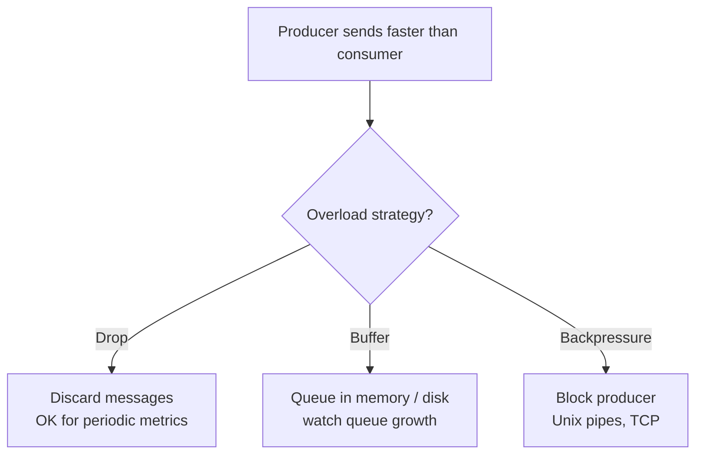

#### Direct messaging (no broker)

Some systems connect producers to consumers directly:

- **UDP multicast** — stock-market feeds; app-level protocols recover lost packets.
- **Brokerless libraries** — ZeroMQ, nanomsg (pub/sub over TCP or IP multicast).
- **StatsD / Brubeck** — UDP metric collection (approximate by design).
- **Webhooks** — a consumer registers a callback URL; the producer makes an HTTP/RPC call on each event.

These are efficient but fragile: the *application* must handle message loss, and they assume producers and consumers are constantly online. An offline consumer simply misses messages.

#### Message brokers

A **message broker** is a database specialized for message streams. Producers and consumers are clients; the broker centralizes durability and tolerates clients coming and going. Consumers are typically **asynchronous**: a producer only waits for the broker to buffer the message, not for it to be processed.

**Broker vs. database** — traditional (JMS/AMQP) brokers differ from databases:

| Aspect | Database | Traditional Message Broker (JMS/AMQP) |
|---|---|---|
| Retention | Keeps data until explicitly deleted | Deletes a message once acknowledged |
| Working set | Large datasets are normal | Assumes short queues; slows if it must spill to disk |
| Selection | Secondary indexes, arbitrary queries | Subscribe to a topic/pattern subset |
| Query model | Point-in-time snapshot; no change notification | No arbitrary queries, but notifies on new messages |

Implementations: RabbitMQ, ActiveMQ, HornetQ, Qpid, TIBCO EMS, IBM MQ, Azure Service Bus, Google Cloud Pub/Sub.

**Multiple consumers** combine two patterns:

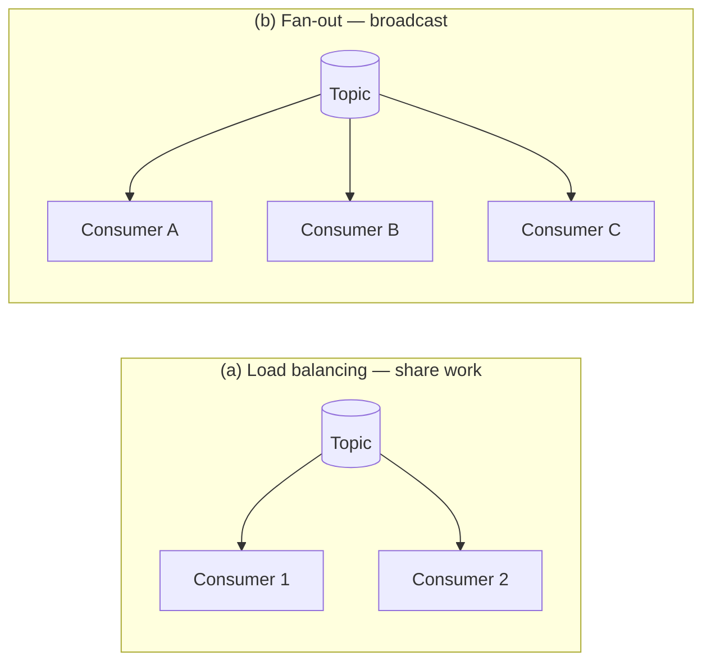

**Acknowledgments and redelivery**: a consumer must explicitly ack. If the connection drops before ack, the broker redelivers to another consumer. Combined with load balancing, redelivery **reorders** messages:

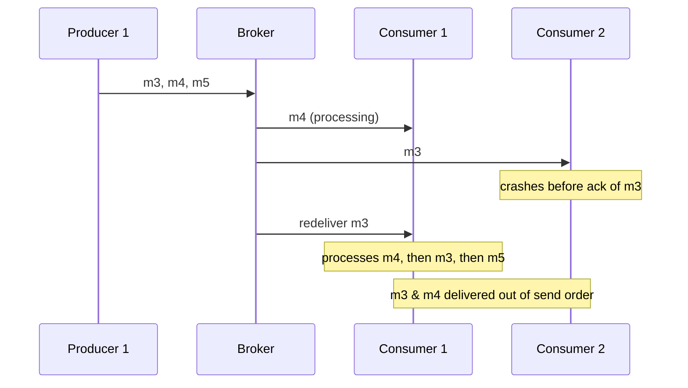

To avoid reordering, give each consumer its own queue (skip load balancing). Reordering only matters when messages have causal dependencies.

### Partitioned Logs

Traditional brokers have a **transient** mindset: a message is deleted once delivered. Databases/filesystems have a **durable** mindset: data stays until explicitly deleted. Adding a *new* consumer to a JMS/AMQP broker gets you only messages sent after registration — everything before is gone. **Log-based message brokers** combine the low-latency notifications of messaging with the durability and replayability of storage.

A **log** is an append-only sequence of records on disk. A producer appends; a consumer reads sequentially and waits (like `tail -f`) at the end. To scale beyond one disk, the log is **partitioned** across machines; each partition assigns a monotonically increasing **offset**. Messages are totally ordered *within* a partition but **not across** partitions.

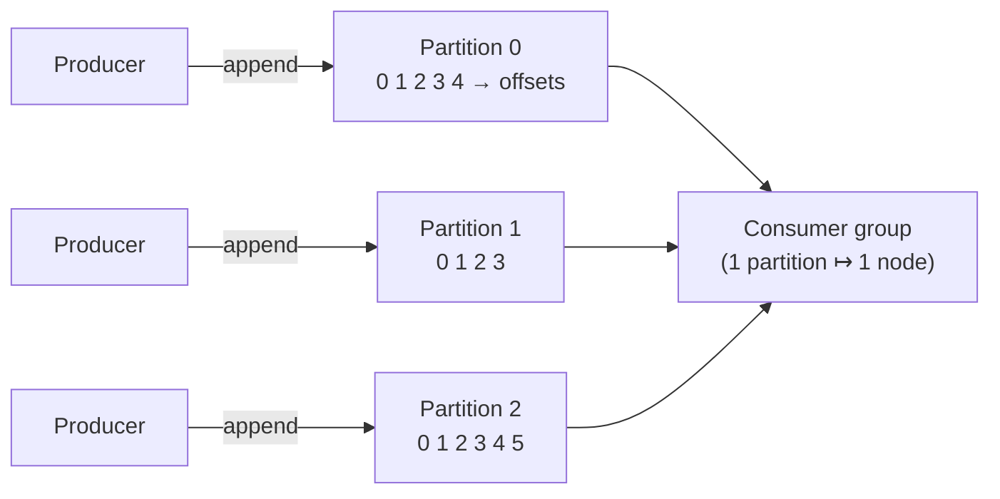

Implementations: **Apache Kafka**, **Amazon Kinesis Streams**, **Twitter DistributedLog**. Google Cloud Pub/Sub is architecturally similar but exposes a JMS-style API. Despite writing everything to disk, they reach millions of messages/sec via partitioning and provide fault tolerance via replication.

**Logs vs. traditional messaging:**

- **Fan-out is trivial** — many consumers read independently; reading doesn't delete.
- **Load balancing is coarse-grained** — the broker assigns whole *partitions* to nodes. Consequences:
  - Max parallelism = number of partitions in the topic.
  - A slow message causes **head-of-line blocking** for later messages in its partition.
- Rule of thumb: for *expensive-to-process, order-insensitive* messages, prefer JMS/AMQP; for *high-throughput, fast, order-sensitive* messages, prefer the log-based approach.

**Consumer offsets**: Because a partition is consumed in order, the broker only records each consumer's current offset (like a DB replication log sequence number) rather than acking every message — reducing bookkeeping. On failover, another node resumes from the last recorded offset; messages processed but not yet checkpointed are **reprocessed** (at-least-once).

**Disk usage & the circular buffer**: The log is split into **segments**; old segments are deleted or archived, making it a large, disk-backed **ring buffer**. Back-of-envelope: a 6 TB drive at 150 MB/s fills in ~11 hours, so it can buffer ~11 hours at full write rate (in practice, days or weeks). Throughput stays constant regardless of retention because every message is written to disk anyway — unlike memory-first brokers that slow down when queues spill to disk.

**When consumers can't keep up**: The log is buffering with a fixed-size buffer. If a consumer falls behind the oldest retained segment, it *drops* those messages — but only *that* consumer is affected; others are unaffected. This is a major operational advantage: you can run a throwaway consumer against a production log for debugging without disrupting anything. **Replaying old messages** is a read-only offset rewind — start a copy of a consumer at yesterday's offset, vary the code, repeat. This makes log-based messaging behave like batch processing (derived data cleanly separated from immutable input).

### Databases and Streams

A write to a database *is* an event. A **replication log** is a stream of write events produced by the leader. **State machine replication**: if every replica applies the same events in the same order deterministically, they converge to the same state. So streams and databases are deeply connected.

#### Keeping systems in sync — and why dual writes fail

Applications combine many stores (OLTP DB, cache, search index, warehouse), each needing the same data. **Dual writes** (app writes to each store directly) have two serious flaws:

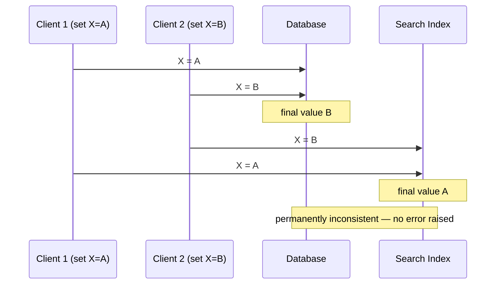

1. **Race condition** — concurrent writes are applied in different orders by different stores → permanent divergence (undetected without version vectors).
2. **Partial failure** — one write succeeds, the other fails (an atomic-commit problem, expensive to solve).

The fix: funnel all writes through **one leader** that decides the order, and make the other systems **followers**.

#### Change Data Capture (CDC)

CDC observes all writes to a database and exports them as a stream, immediately as they happen, so derived systems apply the *same changes in the same order*. It effectively makes the source DB the leader and the derived systems followers. A log-based broker is ideal transport because it preserves order.

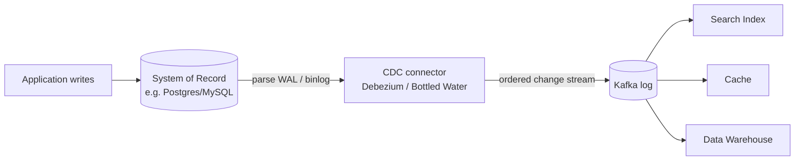

Implementation approaches and tools:
- **Triggers** — write changes to a changelog table; simple but fragile & slow.
- **Parse the replication log** — more robust (must handle schema changes). LinkedIn **Databus**, Facebook **Wormhole**, Yahoo **Sherpa**; **Bottled Water** (Postgres WAL), **Maxwell** & **Debezium** (MySQL binlog), **Mongoriver** (Mongo oplog), **GoldenGate** (Oracle).

CDC is **asynchronous** (source doesn't wait for consumers) — good for isolation, but all replication-lag issues apply.

- **Initial snapshot**: To seed a *new* derived system you need a consistent snapshot tied to a known log offset, then apply changes from there (you can't rebuild everything from a truncated log).
- **Log compaction**: Keep only the latest value per key (tombstones delete). Disk usage depends on current DB contents, not write history. Now a new consumer can start at offset 0 and get a full copy of the DB without a separate snapshot. Supported by **Kafka**.
- **First-class change streams**: RethinkDB query subscriptions, Firebase & CouchDB change feeds, Meteor (Mongo oplog), VoltDB export streams, and **Kafka Connect** for integrating many DBs.

#### Event Sourcing

Similar to CDC but at a *higher level of abstraction*:

| | Change Data Capture | Event Sourcing |
|---|---|---|
| Level | Low-level DB row changes (parsed log) | Application-level, meaningful events |
| DB usage | App mutates DB freely; log extracted underneath | App appends immutable events; updates/deletes discouraged |
| App awareness | App unaware CDC is happening | App logic explicitly built on the event log |
| Compaction | Latest event per key determines value → compactable | Later events don't override priors → need full history |

Event sourcing records *intent* ("student cancelled enrollment") instead of *mechanics* ("deleted a row, inserted feedback row"). Benefits: easier evolution, better debugging/auditing, resilience against bugs, and new features can chain off existing events.

**Commands vs. events**: A user request is first a **command** that may be rejected (validation, integrity). Once validated it becomes an immutable **event** — a fact. Consumers cannot reject events. Validation must happen *synchronously* before the event is published (e.g., in a serializable transaction), or split into a tentative event + a later confirmation event.

**Deriving current state**: An event log alone isn't useful (users want current state, not history), so applications replay the log (deterministically) into read-optimized state, optionally caching **snapshots** for fast recovery — but keeping raw events forever so any view can be rebuilt.

#### State, Streams, and Immutability

State is the *result* of a sequence of events; mutable state and an append-only log of immutable events are two sides of the same coin.

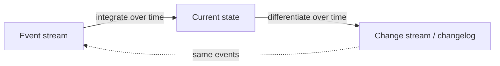

> "The truth is the log. The database is a cache of a subset of the log." — Pat Helland

**Advantages of immutable events**:
- **Auditability** — like an accountant's ledger: never erase a mistake, append a compensating entry.
- **Recovery from bad code** — append-only makes it easy to diagnose and recover; destructive overwrites don't.
- **Richer information** — capture actions later undone (e.g., item added to cart then removed) that a mutable DB would lose.
- **Multiple derived views** — the same log feeds Druid, Pistachio (KV store on Kafka), search servers, etc. This is **CQRS**: separate the write form from many read-optimized forms; normalization vs. denormalization debates fade when you can re-derive views (e.g., Twitter's denormalized home-timeline cache kept in sync by a fan-out service).

**Concurrency control**: Because a single self-contained event is one append, much of the need for multi-object transactions disappears. If log and state are partitioned identically, a single-threaded consumer needs *no* write concurrency control (the log defines a serial order).

**Limits of immutability**: High-churn workloads make the immutable history grow large; compaction/GC performance becomes critical. Also, sometimes you must *truly* delete data (privacy law, GDPR, leaks) — appending a "deleted" marker is insufficient. Datomic calls true deletion **excision**; Fossil calls it **shunning**. Truly deleting is hard because copies live in storage engines, filesystems, SSDs (copy-on-write), and immutable backups — it's more "harder to retrieve" than "impossible to retrieve."

### Processing Streams

Three things you can do with a stream:
1. **Write it to storage** (DB, cache, search index) for later querying — the streaming equivalent of batch output.
2. **Push to humans** — email/push alerts, real-time dashboards.
3. **Derive new streams** (the focus) — a stream **operator/job** reads input streams read-only and appends to output streams, forming acyclic pipelines.

The crucial difference from batch: **a stream never ends**. Sorting is meaningless on unbounded data (so sort-merge joins are out), and fault tolerance can't just "restart from the beginning" after years of running.

#### Uses of stream processing

- **Monitoring/alerting**: fraud detection, algorithmic trading, factory monitoring, military/intelligence — sophisticated pattern matching.
- **Complex Event Processing (CEP)**: Like regex-for-events. You express patterns in a declarative language; the engine keeps a state machine and emits a *complex event* on match. Roles are reversed vs. a DB: **queries are stored long-term, data flows past them**. Implementations: Esper, IBM InfoSphere Streams, Apama, TIBCO StreamBase, SQLstream; Samza gaining SQL.
- **Stream analytics**: Aggregations & statistics over **windows** (rates, rolling averages, percentiles). Often uses probabilistic algorithms — **Bloom filters** (set membership), **HyperLogLog** (cardinality), percentile estimators — for memory efficiency. Approximation is an *optimization*, not an inherent property. Frameworks: Storm, Spark Streaming, Flink, Concord, Samza, Kafka Streams; hosted: Google Cloud Dataflow, Azure Stream Analytics.
- **Materialized-view maintenance**: Keep caches/indexes/warehouses continually up to date. Unlike analytics, this needs the *entire* history (a window back to the beginning of time), minus log-compacted obsolete events. Samza and Kafka Streams support this.
- **Search on streams**: Store queries, run documents past them (Elasticsearch **percolator**) — the inverse of index-then-query; index the queries too for efficiency.
- **Message passing / RPC**: Related but distinct — actor frameworks manage concurrency (ephemeral, one-to-one, cyclic), whereas stream processors are a data-management technique (durable, multi-subscriber, acyclic). Storm's *distributed RPC* is a crossover.

#### Reasoning About Time

Windows like "average over the last 5 minutes" are surprisingly tricky. Many frameworks window by the **processing time** (local clock), which is simple but wrong if there's processing lag.

**Event time vs. processing time**: Delays arise from queueing, network faults, contention, restarts, and reprocessing. Delays also reorder messages (server B's event may reach the broker before server A's). Analogy: Star Wars episodes released IV, V, VI, then I, II, III — release order (processing time) ≠ narrative order (event time).

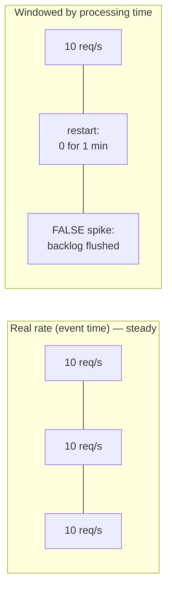

Confusing the two produces **bad data**: after a 1-minute restart, windowing by processing time shows a fake request spike as the backlog flushes.

**Knowing when you're ready**: You can never be certain all events for a window have arrived. **Straggler** events arrive after the window closed. Two options:
1. **Ignore stragglers** (track a dropped-events metric, alert if significant).
2. **Publish a correction** (updated window value, possibly retracting prior output).

A **watermark** message ("no more events earlier than *t*") can trigger window completion — but with many producers, each has its own threshold and consumers must track them individually.

**Whose clock?** A mobile app used offline buffers events and uploads them hours later — extreme stragglers. The device clock (event time) is meaningful but untrustworthy; the server clock (arrival) is trustworthy but less meaningful. Fix: log **three timestamps** — event time (device), send time (device), receive time (server) — then `receive − send` estimates the device-clock offset to correct the event time.

**Window types**:

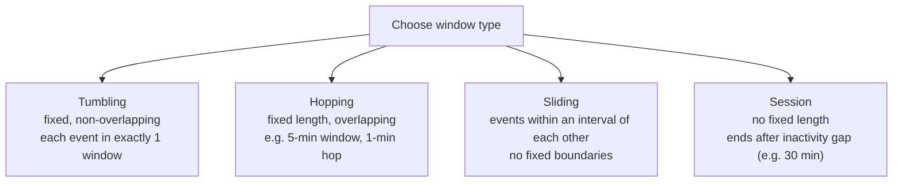

| Window | Length | Overlap | Boundaries | Example use |
|---|---|---|---|---|
| Tumbling | Fixed | None | Fixed clock-aligned | Requests per minute |
| Hopping | Fixed | Yes | Fixed, stepped | Smoothed 5-min avg every 1 min |
| Sliding | Fixed interval | Yes | Relative to events | "Two events within 5 min" |
| Session | Variable | — | Activity gap | Website sessionization |

#### Stream Joins

Three types, all requiring the processor to **maintain state** from one input and query it with the other:

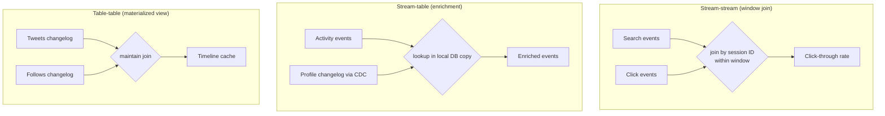

- **Stream-stream join (window join)**: e.g., match search + click by session ID within, say, one hour. You can't just embed search details in the click event — that misses searches with no click (needed for accurate click-through rate). The processor indexes recent events from both streams by key; on each event it checks the other index.
- **Stream-table join (enrichment)**: Augment each activity event with data from a table (e.g., user profile). Remote lookups per event are slow/overloading; instead keep a **local copy** of the DB (in-memory hash table or on-disk index), kept fresh via **CDC** on the table's changelog. It's essentially a stream-stream join where the table side uses an infinite window with newer versions overwriting older.
- **Table-table join (materialized view maintenance)**: Both inputs are changelogs. Twitter timeline: maintain a per-user inbox updated on tweet send/delete and follow/unfollow. Equivalent to keeping a materialized view of a `tweets ⋈ follows` query fresh. (Cute calculus: if a stream is the derivative of a table, the join's change stream follows the product rule `(u·v)′ = u′v + uv′`.)

**Time-dependence of joins**: The order of state-maintaining events matters (follow-then-unfollow ≠ unfollow-then-follow). Across streams/partitions there's usually no ordering guarantee. So *which* version of the state do you join with? Example: apply the tax rate **at the time of sale**, not the current rate, when reprocessing history. Undetermined cross-stream order makes joins **nondeterministic** (re-running yields different results). In warehouses this is a **slowly changing dimension (SCD)** — give each version a unique ID and reference it (makes joins deterministic but prevents log compaction, since all versions must be kept).

### Fault Tolerance

Batch processing gets fault tolerance almost for free: a failed task restarts, its partial output is discarded, and inputs are immutable — so the result looks as if each record was processed **exactly once** ("effectively once" is more accurate). Streams can't "wait until finished" because they're infinite.

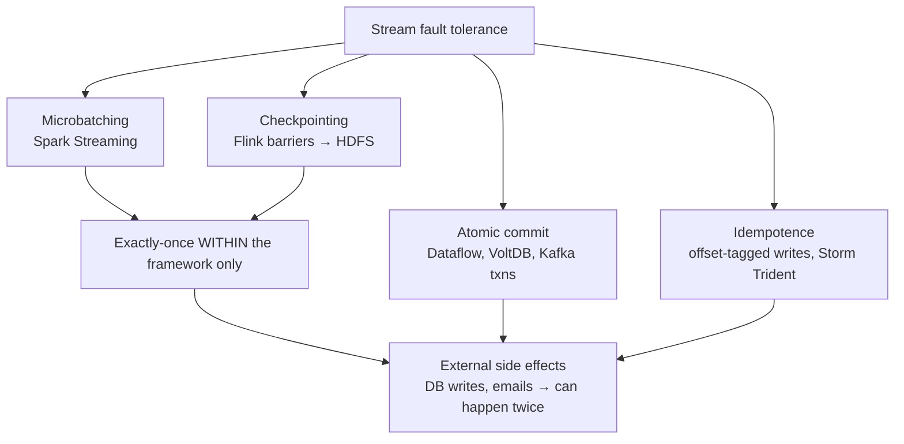

- **Microbatching** (Spark Streaming): Break the stream into ~1-second blocks and treat each like a tiny batch job. Small batches → scheduling overhead; large batches → latency. Implicitly provides a tumbling window (by processing time) equal to the batch size.
- **Checkpointing** (Flink): Periodically snapshot operator state to durable storage (HDFS), triggered by **barriers** in the message stream. On crash, restart from the last checkpoint and discard output since then — without forcing a window size.
- **Atomic commit revisited**: For true exactly-once, *all* effects of processing an event — downstream messages, DB writes, state changes, and offset advance — must take effect atomically or not at all. This is the exactly-once/2PC problem, but restricted to a single framework's own state/messaging (unlike heterogeneous XA), which can be efficient. Used in Google Cloud Dataflow, VoltDB; added to Kafka.
- **Idempotence**: Make retried operations harmless. Setting a key = value is idempotent; incrementing a counter is not. Non-idempotent ops can be made idempotent with metadata — e.g., store the Kafka **offset** alongside the value so you can detect an already-applied update. Assumptions: replay same messages in same order (log-based broker), deterministic processing, no concurrent updater. Use **fencing** on failover to block a presumed-dead-but-alive node.
- **Rebuilding state after a failure**: Windowed aggregations and join tables/indexes need recoverable state. Options: (a) keep state remote and replicate (slow per-message queries); (b) keep state **local** and replicate periodically — Flink snapshots to HDFS; Samza & Kafka Streams replicate state changes to a log-compacted Kafka topic (like CDC); VoltDB re-processes each input on several nodes. Sometimes state can simply be **rebuilt from the input stream** (short-window aggregations, or a CDC-derived local DB copy rebuilt from a log-compacted change stream). The best trade-off depends on relative disk vs. network latency/bandwidth and evolves with hardware.

## ⚠️ Edge Cases, Failure Modes & Gotchas

- **Message loss vs. counting**: Dropping occasional periodic sensor readings is fine; dropping "event count" messages silently corrupts counters — and large drops may not be obvious.
- **Load balancing + redelivery reorders messages**: A crashed consumer's unacked message is redelivered to another, so it's processed *after* later messages. Harmless if messages are independent; corrupting if causally dependent. Mitigation: one queue per consumer.
- **Ack lost in network**: The message was fully processed but the ack was lost → redelivery → double processing. Solving cleanly needs an atomic commit protocol.
- **Dual writes race condition**: Concurrent writes ordered differently across stores → permanent, silent inconsistency (undetected without version vectors).
- **Dual writes partial failure**: One store updated, the other not → inconsistency (atomic-commit problem).
- **Slow consumer falls off the log**: If a consumer lags past the oldest retained segment, it *silently misses* messages. Monitor consumer lag and alert; the large buffer buys human reaction time.
- **Head-of-line blocking (log brokers)**: One slow-to-process message stalls all later messages in the same partition. Parallelism capped at partition count.
- **Reprocessing after restart (at-least-once)**: Messages processed but whose offset wasn't yet recorded get reprocessed after failover → duplicates unless downstream is idempotent.
- **CDC replication lag**: CDC is async, so all replication-lag anomalies (stale reads, "can't read your own writes") apply to derived systems.
- **Missing initial snapshot**: Building a new index from only *recent* changes misses records not recently updated — you need a consistent snapshot tied to a known offset, or a log-compacted topic.
- **Event sourcing can't compact like CDC**: High-level events don't override priors, so you must retain full history (only snapshots for performance).
- **Consumers cannot reject events**: Validation must happen *before* an event is published (command→event), because by the time consumers see it, it's an immutable fact possibly already observed by others.
- **Read-your-writes under async derived views**: A user may write to the log then not see their write in a derived read view. Fix: synchronous read-view update (needs a transaction) or total-order-broadcast techniques.
- **Truly deleting data is hard**: Tombstones/append-only markers don't erase copies in SSDs (copy-on-write), filesystems, and immutable backups — a problem for GDPR/privacy.
- **Immutable history blows up under churn**: High update/delete rates on small datasets make the log grow huge; compaction/GC performance becomes operationally critical.
- **Processing-time windowing artifacts**: A restart makes a backlog flush look like a traffic spike; a gap looks like an outage — pure artifacts of processing time.
- **Stragglers after window close**: Late events either get dropped or force a correction/retraction of already-emitted output.
- **Untrusted device clocks**: Mobile event timestamps may be wrong/malicious; correct via the three-timestamp offset trick.
- **Watermark bookkeeping with many producers**: Each producer has its own minimum-timestamp threshold; consumers must track all of them, and adding/removing producers is tricky.
- **Nondeterministic joins (time-dependence)**: Undefined cross-stream order → re-running yields different results; SCD versioning fixes determinism but blocks log compaction.
- **Exactly-once leaks past the framework boundary**: Microbatching/checkpointing only guarantee exactly-once *inside* the processor. Once output leaves (DB write, email, external broker), a retried task causes the side effect twice unless you use transactions or idempotence.
- **Idempotence assumptions**: Requires same replay order, determinism, and no concurrent writer; failover needs fencing to stop a zombie node.

## 🔑 Key Takeaways

- Streams are the unbounded counterpart to batch files; message brokers and event logs are the streaming equivalent of a filesystem.
- Two broker families: **JMS/AMQP-style** (per-message ack, delete on ack — good for task queues, order-insensitive, expensive-per-message work) vs. **log-based** (partitioned append-only log, offset checkpointing, replayable — good for high-throughput, order-sensitive, derived-data pipelines).
- **A database write is an event.** Replication logs, CDC, and event sourcing all treat state changes as streams; state and log are two sides of the same coin (integral/derivative).
- **Dual writes are an anti-pattern.** Route all writes through a single ordered log and make other systems followers to avoid race conditions and partial failures.
- **CDC** keeps heterogeneous derived systems (search, cache, warehouse) consistent by replaying an ordered change stream; **log compaction** lets a log hold a full DB copy.
- **Event sourcing + CQRS**: append immutable, intent-carrying events; derive many read-optimized views; gain auditability, debuggability, and easy evolution.
- **Time is hard.** Distinguish event time from processing time; expect stragglers; pick the right window (tumbling/hopping/sliding/session); use watermarks or corrections.
- **Three joins**: stream-stream (windowed), stream-table (enrichment via a locally-cached, CDC-updated table), table-table (materialized view maintenance).
- **Exactly-once is really "effectively-once"** — achieved via microbatching, checkpointing, restricted atomic commit, or idempotent writes; guarantees stop at the framework boundary unless outputs are transactional/idempotent.
- Recoverable operator state can be replicated (to HDFS or a compacted Kafka topic) or rebuilt from the input stream.

## 💡 Real-World Applications & Examples

- **LinkedIn** built Kafka and Databus (CDC) to make the "log" the backbone of data integration across DBs, search, and analytics (Jay Kreps' "The Log" essay).
- **Twitter** maintains denormalized home-timeline caches (a table-table join / materialized view) kept in sync by a fan-out service; DistributedLog is its replicated log service.
- **Financial trading & fraud detection** use CEP and low-latency feeds (UDP multicast market data) to react to patterns in milliseconds.
- **Debezium** streams MySQL/Postgres/Mongo changes into Kafka so companies can drive search indexes, caches, and event-driven microservices from a single system of record.
- **Metamarkets/Druid** ingests directly from Kafka to power real-time analytics dashboards; **Yahoo Pistachio** uses Kafka as a commit log for a KV store.
- **Netflix, Uber, and others** use Flink/Kafka Streams for windowed analytics, sessionization, and exactly-once pipelines; **Uber** famously runs large-scale Flink and Kafka deployments.
- **Elasticsearch percolator** powers "alert me when a new listing matches my search" features (search-on-streams) on real-estate and media-monitoring sites.
- **Mobile analytics SDKs** (e.g., usage metrics) buffer events offline and reconcile device vs. server clocks using multiple timestamps.

## 🛠️ Open-Source Implementations (GitHub)

| Project | GitHub | How it relates to this chapter | Approx. stars |
|---|---|---|---|
| Apache Kafka | https://github.com/apache/kafka | The canonical **log-based message broker**: partitioned logs, offsets, log compaction, replayability | ~28–34k |
| Apache Flink | https://github.com/apache/flink | Stream processor with **event-time windowing**, **checkpointing** (barriers → durable state), exactly-once | ~24k |
| Apache Spark | https://github.com/apache/spark | Spark Streaming pioneered **microbatching** for stream fault tolerance | ~40k |
| Apache Beam | https://github.com/apache/beam | Unified batch+stream model; event-time windows/watermarks (runs on Flink, Dataflow) | ~8k |
| Apache Samza | https://github.com/apache/samza | Stream processor with **local state replicated to a compacted Kafka topic** (CDC-like) | ~0.8k |
| Debezium | https://github.com/debezium/debezium | **Change Data Capture** by parsing MySQL binlog / Postgres WAL / Mongo oplog into Kafka | ~11k |
| ksqlDB | https://github.com/confluentinc/ksql | Declarative **SQL over streams** (CEP/analytics, stream joins, materialized views) on Kafka | ~6k |
| RabbitMQ | https://github.com/rabbitmq/rabbitmq-server | Classic **AMQP** broker: per-message ack, load balancing/fan-out, redelivery | ~12k |
| ZeroMQ (libzmq) | https://github.com/zeromq/libzmq | **Brokerless** pub/sub messaging over TCP / IP multicast | ~10k |
| Elasticsearch | https://github.com/elastic/elasticsearch | **Percolator** implements search-on-streams (stored queries, documents flow past) | ~70k |

> Star counts are approximate and change over time; treat them as order-of-magnitude indicators.

## 🔗 References & Further Reading

- Tyler Akidau et al., ["The Dataflow Model"](https://research.google/pubs/pub43864/) — VLDB 2015. Foundational treatment of event time, windows, watermarks, correctness vs. latency. (Chapter ref [1].)
- Jay Kreps, ["The Log: What every software engineer should know about real-time data's unifying abstraction"](https://engineering.linkedin.com/distributed-systems/log-what-every-software-engineer-should-know-about-real-time-datas-unifying) — LinkedIn, 2013. (Chapter ref [24].)
- Jay Kreps, Neha Narkhede, Jun Rao, ["Kafka: A Distributed Messaging System for Log Processing"](https://www.microsoft.com/en-us/research/wp-content/uploads/2017/09/Kafka.pdf) — NetDB 2011. (Chapter ref [18].)
- Pat Helland, ["Immutability Changes Everything"](https://www.cidrdb.org/cidr2015/Papers/CIDR15_Paper16.pdf) — CIDR 2015. State/log duality. (Chapter ref [52].)
- Martin Fowler, ["Event Sourcing"](https://martinfowler.com/eaaDev/EventSourcing.html) and ["CQRS"](https://martinfowler.com/bliki/CQRS.html). (Chapter refs [43], [58].)
- Martin Kleppmann, ["Bottled Water: Real-Time Integration of PostgreSQL and Kafka"](https://www.confluent.io/blog/bottled-water-real-time-integration-of-postgresql-and-kafka/) — CDC via WAL decoding. (Chapter ref [28].)
- Martin Kleppmann, [*Making Sense of Stream Processing*](https://www.confluent.io/wp-content/uploads/confluent-kafka-definitive-guide-complete.pdf) — O'Reilly report, 2016. (Chapter ref [47].)
- Arasu, Babu, Widom, ["The CQL Continuous Query Language"](https://web.stanford.edu/~widom/cql.pdf) — VLDB Journal 2006. CEP foundations. (Chapter ref [67].)
- Official docs: [Apache Kafka](https://kafka.apache.org/documentation/), [Apache Flink](https://nightlies.apache.org/flink/flink-docs-stable/), [Debezium](https://debezium.io/documentation/), [Apache Beam](https://beam.apache.org/documentation/).

## ❓ Self-Check Questions

1. **Why is a log-based broker better than a JMS/AMQP broker for feeding derived data systems, and what's the main downside?**
   Consuming is a non-destructive, replayable read (offset rewind), so you can add consumers anytime, reprocess history, and debug against production safely; ordering is preserved within a partition. Downsides: coarse-grained (per-partition) load balancing capped by partition count, and head-of-line blocking on a slow message.

2. **What are the two problems with dual writes, and how does the log-based approach solve them?**
   (a) A race condition where concurrent writes are ordered differently by different stores → silent divergence; (b) partial failure where one write succeeds and another fails. Funneling all writes through a single ordered log and making stores followers gives one authoritative order and deterministic, idempotent replay.

3. **CDC vs. event sourcing — what's the key difference, and why can't event-sourced logs be compacted the same way?**
   CDC captures low-level row changes underneath a mutating app; event sourcing records high-level, intent-carrying events the app is explicitly built on. CDC events carry the full new value, so log compaction can keep only the latest per key. Event-sourcing events express intent and don't override priors, so you need the full history to reconstruct state.

4. **Explain event time vs. processing time with a concrete failure.**
   Event time = when it happened; processing time = when observed. If you window by processing time and the processor restarts for a minute, the flushed backlog appears as a sudden request spike even though the true (event-time) rate was steady.

5. **Name the four window types and one use for each.**
   Tumbling (requests per minute), hopping (smoothed 5-min average every 1 min), sliding (two events within 5 min of each other), session (website sessionization by inactivity gap).

6. **Distinguish the three stream joins.**
   Stream-stream: match related activity events within a time window (e.g., search+click by session). Stream-table: enrich each event by looking up a locally-cached table kept fresh via CDC (infinite window, newer overwrites older). Table-table: join two changelogs to maintain a materialized view (e.g., Twitter timeline).

7. **Why is "exactly-once" really "effectively-once," and where does the guarantee break?**
   Tasks may physically reprocess records on retry, but the *visible output* is as if processed once. The guarantee holds only inside the framework (microbatching/checkpointing can discard internal output); once a side effect leaves (DB write, email), a retry duplicates it unless you use restricted atomic commit or idempotent writes.

8. **How can a non-idempotent operation be made idempotent in a Kafka-based pipeline?**
   Attach the triggering message's monotonically increasing **offset** to the write; on replay, compare the stored offset to detect and skip already-applied updates. Requires deterministic processing, same replay order, no concurrent writer, and fencing on failover.

9. **What is a straggler event and what are your two options for handling it?**
   An event that arrives after its window was declared complete. Either ignore it (and track/alert on the drop rate) or publish a correction (updated window value, possibly retracting prior output). Watermarks can help decide when to close a window.

10. **What does "the truth is the log; the database is a cache of the log" mean operationally?**
   Treat an append-only event log as the system of record and all mutable state (DBs, indexes, caches) as derived, reproducible views. This yields auditability, easy recovery from bad code, the ability to build new views by replaying history, and reduced need for multi-object transactions.
