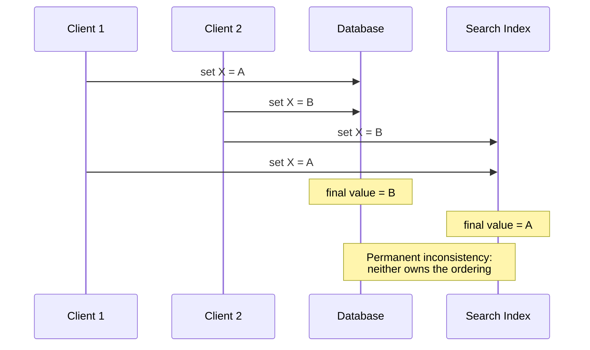
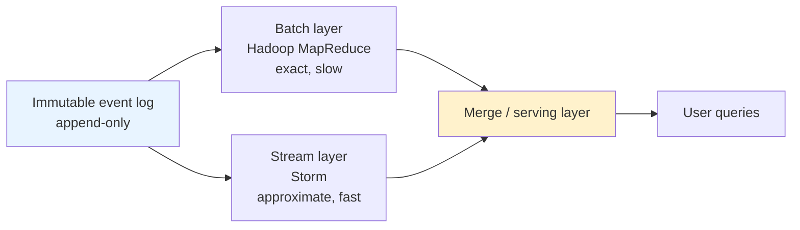
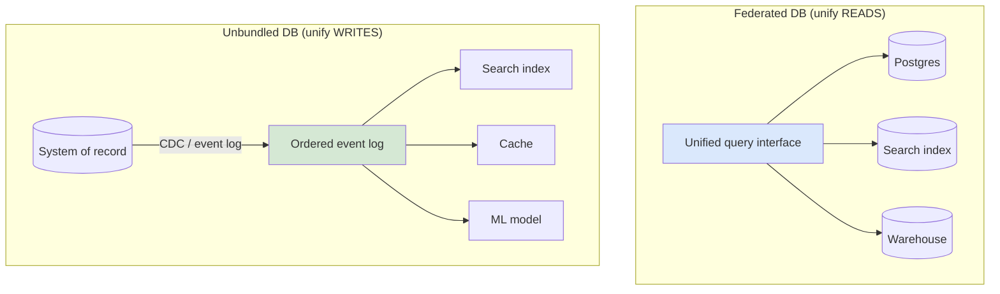
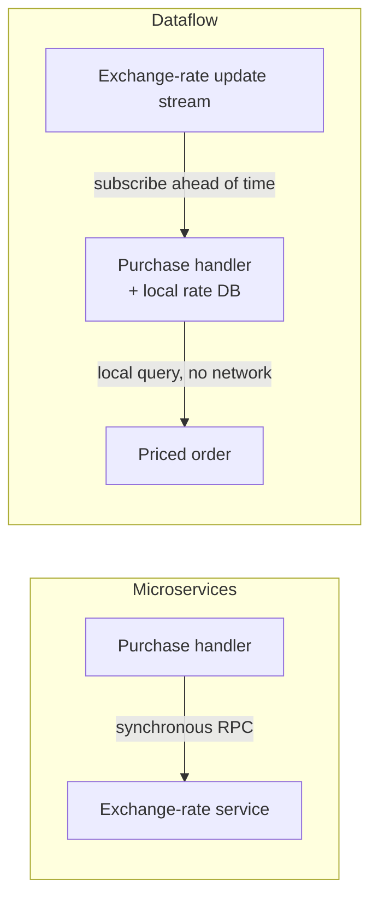
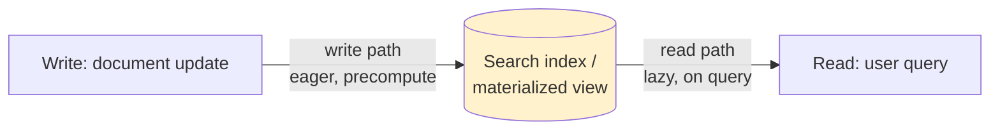
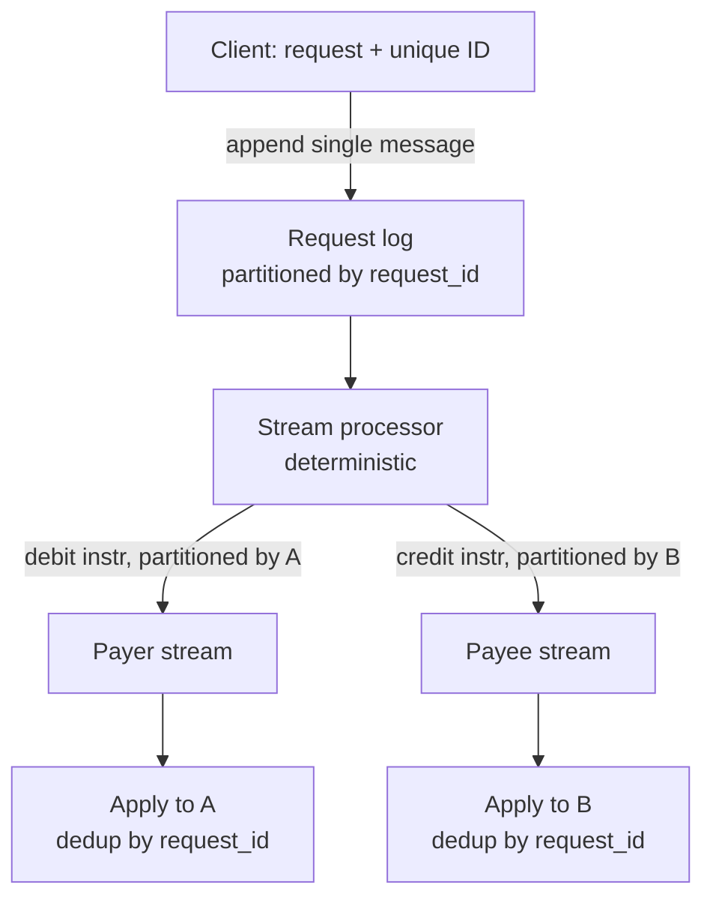
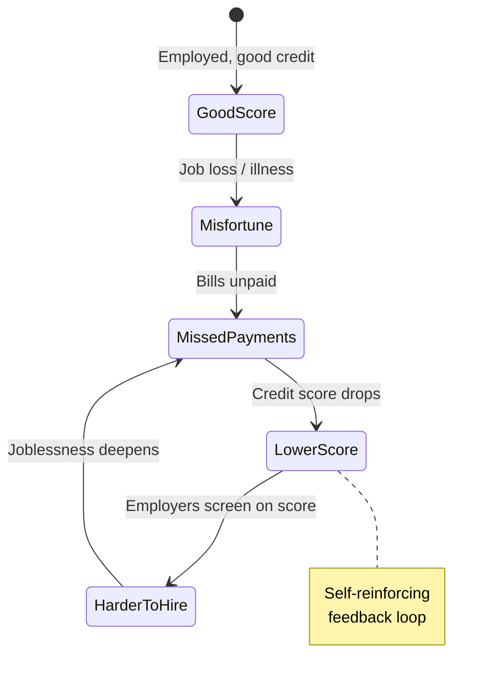

# DDIA Chapter 12: The Future of Data Systems

> Part III: Derived Data | Maps to: system-design topics on Data Integration, CDC & Event Sourcing, Lambda/Kappa architectures, Exactly-Once Semantics, and Data Ethics/Privacy.

## 🎯 Chapter in One Paragraph

This is the closing, opinion-driven chapter of DDIA where Kleppmann stops describing "what is" and argues for "what should be." His central thesis: no single tool serves every access pattern, so real applications inevitably stitch together many specialized systems (OLTP databases, search indexes, caches, analytics warehouses, ML models). The hard part is **data integration** — keeping all those derived representations consistent. He argues the most robust way to do this is *not* distributed (XA) transactions but **log-based derived data**: pick a single system of record, capture its changes as an ordered, immutable event log, and asynchronously derive every other view from that log using deterministic, idempotent functions. This reframes the whole architecture as **"unbundling the database"** — treating batch/stream processors as the trigger-and-materialized-view machinery of a giant organization-wide database, composed Unix-style from loosely coupled parts. He then tackles **correctness**: using the *end-to-end argument* he shows that low-level guarantees (TCP, serializable transactions) are insufficient, and that end-to-end operation IDs + idempotence give exactly-once effects without coordination. He separates **timeliness** (being up-to-date) from **integrity** (no corruption/loss), arguing integrity matters more and can be preserved *without* synchronous coordination, enabling **coordination-avoiding** systems that apologize-and-compensate for the rare constraint violation. He closes with **"trust but verify"** (auditing, self-checking systems, Merkle trees) and a sober ethical warning about **predictive analytics, algorithmic bias, surveillance, and privacy** — insisting engineers bear responsibility for the world their systems create.

## 🧠 Key Concepts & Vocabulary

- **Data integration** — the problem of getting the same data into the right form in all the right places (DB, search index, cache, warehouse, ML model) and keeping them consistent as the data changes.
- **System of record (source of truth)** — the authoritative store where data is first written; all other copies are derived from it.
- **Derived data system** — any dataset computed from another (search index, materialized view, cache, ML model, aggregate). Can be rebuilt by reprocessing the source.
- **Change Data Capture (CDC)** — observing the ordered stream of writes to a database and applying them to derived systems, guaranteeing derived views stay consistent with the source.
- **Event sourcing** — recording all state changes as an append-only log of immutable events; current state is a derived fold over the log.
- **Total order broadcast** — delivering messages to all nodes in the same order; formally equivalent to consensus. Underpins deterministic derivation.
- **Dual writes** — the anti-pattern of an app writing directly to two systems (e.g., DB + index); leads to permanent inconsistency because neither owns the ordering.
- **Lambda architecture** — run a batch layer (exact, slow, reprocesses everything) and a stream layer (approximate, fast) in parallel over an immutable event log, merging results at read time.
- **Kappa / unified processing** — one engine handles both recent stream events and historical replay (event-time windowing, exactly-once, replayable log), removing lambda's double-maintenance.
- **Unbundling the database** — decomposing a database's internal features (indexing, materialized views, replication) into separate composable tools connected by event logs (Unix pipes philosophy).
- **Federated database / polystore** — a unified *read* query interface over heterogeneous storage engines (e.g., PostgreSQL foreign data wrappers).
- **"Database inside-out"** — Kleppmann's design pattern: turn the DB's change log outward and build derived state from it via application code + stream processors.
- **Write path / read path** — write path = eager precomputation done as data arrives; read path = lazy work done on query. Indexes/caches/materialized views shift the boundary between them.
- **Derivation function** — the (ideally deterministic) transformation that produces a derived dataset from its source (e.g., `CREATE INDEX`, feature extraction, cache population).
- **Exactly-once / effectively-once semantics** — arranging processing so the final effect is as if no fault occurred, even when retries happen.
- **Idempotence** — an operation whose repeated execution has the same effect as a single execution; the key enabler of exactly-once.
- **Operation/request ID** — a client-generated unique identifier (UUID) carried end-to-end to suppress duplicates across all hops.
- **End-to-end argument** — (Saltzer, Reed, Clark 1984) a function can only be fully/correctly implemented with knowledge at the communication endpoints; lower layers can help performance but can't guarantee it alone.
- **Timeliness** — users observe an up-to-date state (linearizability/read-your-writes are strong forms). Violations = "eventual consistency" (temporary).
- **Integrity** — absence of corruption/loss/contradiction. Violations = "perpetual inconsistency" (needs explicit repair).
- **Coordination-avoiding data system** — one that preserves integrity without synchronous cross-partition coordination, accepting weak timeliness.
- **Compensating transaction** — a business action that corrects a temporarily-violated constraint after the fact (refund, apology, upgrade).
- **Loosely interpreted constraint** — a constraint (seats, stock) that the business tolerates violating briefly and fixes with compensation, avoiding the need for linearizable enforcement.
- **Auditing / "trust but verify"** — continuously reading back and checking data integrity rather than blindly trusting hardware/software correctness.
- **Merkle tree** — a tree of hashes enabling efficient proof that a record belongs to a dataset; basis of certificate transparency and blockchains.
- **Predictive analytics** — using data/ML to make automated decisions about people (credit, hiring, recidivism), with risks of bias amplification.
- **Algorithmic prison** — being systematically excluded from services by opaque algorithmic "no" decisions with little chance of appeal.
- **Feedback loop** — self-reinforcing dynamics where a prediction shapes behavior that confirms the prediction (e.g., credit-score → joblessness spiral).
- **Surveillance / data as "toxic asset"** — behavioral data collected as a byproduct of use; valuable but hazardous, transferring privacy (a decision right) from individuals to corporations.

## 📚 Deep Dive

### 1. Data Integration: Combining Specialized Tools by Deriving Data

Every tool is optimized for a usage pattern; a single "general-purpose" database can't be ideal for full-text search, analytics, caching, ML, and notifications simultaneously. Complex apps therefore combine several tools, and the number of *representations* of the same data grows. The engineering challenge shifts from "which tool?" to "which data flows into which, in what order, and how do I keep them consistent?"

**Reasoning about dataflows.** Be explicit about inputs and outputs: where is data written *first* (the system of record) and which copies are *derived*? If the search index is updated *only* via CDC from the DB, it is guaranteed derivable and consistent (barring bugs). The failure mode is **dual writes** — the app writing to both DB and index directly:



The fix: funnel all input through a single system that decides a **total order** of writes; every derived view then processes writes in that same order — an application of **state machine replication / total order broadcast**. Whether you call it CDC or event sourcing matters less than committing to a single ordering. Updates applied from an ordered log can be made **deterministic and idempotent**, making fault recovery easy.

**Derived data vs. distributed transactions.** Both keep systems consistent, differently:

| Aspect | Distributed transactions (2PC / XA) | Log-based derived data (CDC / event sourcing) |
|---|---|---|
| Ordering mechanism | Locks (mutual exclusion, 2PL) | An ordered log |
| "Once" guarantee | Atomic commit | Deterministic retry + idempotence |
| Consistency | Linearizable (read-your-writes) | Asynchronous; weaker timing guarantees |
| Fault behavior | Aborts if *any* participant fails → amplifies failures | Fault contained locally; log buffers for slow/failed consumers |
| Heterogeneous systems | Needs a shared transaction protocol (rare) | Just needs an ordered log + idempotent consumers |
| Kleppmann's verdict | XA has poor fault tolerance & performance | Most promising approach for integration |

**Limits of total ordering.** A single-leader log works until scale breaks it: throughput exceeding one machine forces partitioning (order across partitions is undefined); geo-distributed datacenters need a leader each (cross-DC order undefined); microservices with independent state have no defined cross-service order; offline-capable clients see events in different orders. Formally, total order broadcast = consensus, and scaling consensus beyond a single node's throughput (especially geo-distributed) is still an open research problem.

**Ordering to capture causality.** Concurrent events can be ordered arbitrarily; the danger is *causal* dependencies. Classic example: a user unfriends their ex, then posts a rude message meant for remaining friends. If friendship and messages live in different stores, the notification service may process the message *before* the unfriend and notify the ex. Partial remedies: **logical timestamps** (total order without coordination, but recipients must handle out-of-order delivery); **logging what the user saw** with a unique ID that later events reference ("reads are events too"); **conflict resolution algorithms** (help state, not external side effects like notifications).

### 2. Batch and Stream Processing

Batch and stream processing are the tools of data integration — they consume inputs, transform/join/filter/aggregate/train, and write derived outputs. The only fundamental difference: **streams are unbounded, batch inputs are finite**. The distinction is blurring — Spark does streaming via microbatches on a batch engine; Flink does batch on a streaming engine.

**Maintaining derived state.** Batch has a functional flavor: deterministic, pure functions, immutable inputs, append-only outputs. Stream extends this with managed, fault-tolerant state. Determinism aids both fault tolerance (idempotence) and *reasoning* about org-wide dataflows. Derived data *could* be maintained synchronously (like a secondary index in the same transaction) but **asynchrony is what makes log-based systems robust** — a fault stays local instead of aborting everything the way a distributed transaction would.

**Reprocessing for evolution.** Stream processing reflects new inputs with low delay; batch reprocessing lets you rebuild *entirely new* views over historical data. Without reprocessing, schema evolution is limited to adding optional fields; *with* it you can restructure into a whole new model. The **railway gauge migration** analogy: add a third rail (dual gauge) so old and new coexist, shift traffic gradually, then remove the old rail. Derived views enable the same gradual, **reversible** migration — run old and new schema side-by-side as two views, shift users incrementally, drop the old view when done.

**The lambda architecture** and its successor:



| Property | Lambda architecture | Unified (Kappa-style) processing |
|---|---|---|
| Codebases | Two (batch + stream logic) | One engine, replay + live |
| Merge complexity | Must reconcile two outputs (hard for joins/sessionization) | No merge; single output |
| Reprocessing | Full reprocessing expensive → incremental batches creep toward streaming | Replay historical events through same engine |
| Requirements | — | Replayable log, exactly-once semantics, event-time windowing (e.g., Apache Beam on Flink/Dataflow) |

Lambda's contribution (deriving views from immutable events, reprocessing on demand) was hugely influential, but maintaining two systems is costly; **unifying** them removes the downside.

### 3. Unbundling Databases

Databases, Hadoop, and operating systems all fundamentally *store data and let you query it*. Unix and relational DBs solved information management with opposite philosophies: Unix = thin low-level byte-stream abstraction (pipes, files); RDBMS = high-level declarative abstraction hiding indexes, concurrency, recovery. Kleppmann reads NoSQL as applying the Unix philosophy to distributed OLTP, and wants to reconcile both.

**The insight:** batch/stream processors that maintain search indexes, materialized views, and replicated derived stores are *elaborate implementations of triggers, stored procedures, and materialized-view maintenance*. Running `CREATE INDEX` — scan a snapshot, build the index, then catch up on the write backlog, then keep it updated — is structurally identical to **setting up a follower replica** and to **bootstrapping CDC**. So the whole organization's dataflow starts to look like *one giant database* whose index types are separate systems run by different teams.

Two complementary ways to compose systems:



- **Federated / polystore** — one high-level query language over many engines (e.g., PostgreSQL foreign data wrappers). Solves *read* unification; mapping data models is manageable.
- **Unbundled** — reliably plug storage systems together via CDC + event logs so writes propagate everywhere, even under faults. This is the *harder* problem, and Kleppmann's preferred solution over distributed transactions across heterogeneous stores.

**Why log-based integration wins:** loose coupling on two axes. (1) *System level* — async event streams buffer for slow/failed consumers; a faulty consumer catches up when fixed; faults stay contained (vs. distributed transactions escalating local faults into global failures). (2) *Human level* — teams develop/operate components independently behind well-defined interfaces.

**Unbundled vs. integrated.** Unbundling isn't about beating a single DB on its own workload — it's about *breadth*, combining systems to serve a wider range of workloads than any one product. If one product does everything you need, just use it (building for unneeded scale is premature optimization). **What's missing:** a high-level "Unix shell for databases" — imagine `mysql | elasticsearch` declaratively creating and continuously maintaining a search index. Early research: **differential dataflow**.

### 4. Designing Applications Around Dataflow ("Database Inside-Out")

The pattern draws on dataflow languages (Oz, Juttle), functional reactive programming (Elm), and logic programming (Bloom). The **spreadsheet** is the aspiration: change one cell and every dependent formula recalculates automatically — we want that for data systems (change a record → indexes, caches, aggregations auto-refresh) but *fault-tolerant, scalable, durable*, and able to integrate heterogeneous tools.

**Application code as a derivation function.** Some derivations are cookie-cutter (`CREATE INDEX`); others are application-specific (full-text NLP pipelines, ML feature engineering, UI-shaped caches) and need custom code — which is exactly where DBs struggle (triggers/stored procedures are afterthoughts).

**Separation of Church and state.** Modern apps deploy **stateless services** (state lives in the DB); deployment/cluster tools (Mesos, YARN, Docker, Kubernetes) are far better at running app code than DB user-defined functions. Keep durable-storage parts and app-code parts separate but interacting. Problem: DBs are *passive* — you can only poll for changes, not subscribe (the observer pattern isn't built in).

**Dataflow reframes state.** Instead of a database as a passive shared variable, think of the interplay between state, state changes, and code — app code reacts to a change in one place by causing a change in another. Maintaining derived data is *not* ordinary async job execution because it needs (a) **stable ordering** (many message brokers lose order on redelivery; dual writes ruled out) and (b) **fault tolerance** (a single lost message = permanent divergence). Modern stream processors provide both, cheaper and more robustly than distributed transactions.

**Stream processors vs. microservices.** Dataflow resembles microservices (loose coupling, independent teams) but communicates via **one-directional async streams** instead of synchronous request/response. Worked example — currency conversion at purchase time:



The dataflow version replaces a synchronous network call with a local DB query — faster *and* robust to the rate service being down. "The fastest and most reliable network request is no network request at all." It becomes a **stream-table join** between purchase events and rate-update events (time-dependent: reprocessing needs the *historical* rate).

### 5. Observing Derived State: Write Path and Read Path

The **write path** precomputes derived data eagerly as writes arrive (like eager evaluation); the **read path** does work lazily when a user queries (like lazy evaluation). The derived dataset is where they meet — it's a trade-off knob.



- **No index:** cheap writes, expensive reads (scan everything, like `grep`).
- **Precompute all possible query results:** cheap reads, *infinite* write cost (impossible).
- **Cache common queries / materialized view:** middle ground — precompute the hot set, fall back to the index for the rest.

Indexes, caches, and materialized views all just *shift the boundary* — more write-path work to save read-path work. (This is the same idea as the Twitter timeline fan-out from Chapter 1 — "after 500 pages we've come full circle.")

**Stateful, offline-capable clients.** The stateless-client/authoritative-server model is so ingrained we forget alternatives. Single-page apps and mobile apps now hold real state locally. Think of **on-device state as a cache of server state**: pixels are a materialized view of model objects, which are a local replica of remote state. Offline-first apps sync in the background.

**Pushing state changes to clients.** Traditional HTTP is poll-based (RSS is just polling). **Server-sent events / WebSockets** let the server actively push changes, **extending the write path all the way to the end user**. When a device is offline it's just a disconnected log consumer that resumes from its **consumer offset** on reconnect — the exact same mechanism as a log-based message broker consumer. Tools like Elm and React/Flux/Redux already model client state as a stream of events (event-sourcing-like), so extending it to server-pushed events is natural. The blocker is that request/response is baked into our stacks; moving to **publish/subscribe dataflow** is the recommended direction.

**Reads are events too.** You can represent read requests *as events* routed through the same stream processor as writes — making a serving request equivalent to a **stream-table join** between the query stream and the database. A one-off read passes through the join and is forgotten; a *subscription* is a persistent join with future events. Logging read events also captures **causal dependencies / provenance** (what did the user see before deciding?) — useful but with extra storage/IO cost.

**Multi-partition data processing.** Treating queries as streams enables distributed complex queries across partitions using the processor's routing/partitioning/join infrastructure (e.g., Storm distributed RPC computing the reach of a URL on Twitter; fraud scoring joining IP/email/address reputation databases that are each separately partitioned). For simple multi-partition joins a real MPP database is simpler, but the stream approach scales past off-the-shelf limits.

### 6. Aiming for Correctness

Stateless services are forgiving (fix bug, restart). Stateful systems remember forever, so faults have lasting effects. For ~40 years ACID transactions were the tool of choice, but their foundations are weaker than they appear (confused weak isolation levels; Jepsen showing products' claimed guarantees don't match reality; apps misusing features). Serializability + atomic commit work but only within one datacenter and limit scale/fault tolerance.

**The end-to-end argument for databases.** Serializable transactions don't stop an application *bug* from writing/deleting wrong data. Deeper example — **exactly-once execution**:

```mermaid
sequenceDiagram
    participant U as User (browser)
    participant App as App server
    participant DB as Database
    U->>App: POST transfer $11 (weak signal)
    App->>DB: BEGIN; UPDATE...; COMMIT
    DB-->>App: committed
    App--xU: response LOST (signal drops)
    U->>App: retry POST (user clicks again)
    App->>DB: BEGIN; UPDATE...; COMMIT
    Note over DB: $22 transferred — duplicate!
```

TCP suppresses duplicate *packets* — but only within one connection. 2PC breaks the 1:1 connection↔transaction mapping but still can't stop the *user* re-submitting after a timeout. Each layer's dedup is scoped too narrowly. The fix is **end-to-end**: a client-generated **operation/request ID** carried all the way to the DB, enforced with a uniqueness constraint:

```sql
ALTER TABLE requests ADD UNIQUE (request_id);
BEGIN TRANSACTION;
INSERT INTO requests (request_id, from_account, to_account, amount)
  VALUES ('0286FDB8-...', 4321, 1234, 11.00);   -- fails if duplicate → abort
UPDATE accounts SET balance = balance + 11.00 WHERE account_id = 1234;
UPDATE accounts SET balance = balance - 11.00 WHERE account_id = 4321;
COMMIT;
```

The `requests` table doubles as an **event log** (event-sourcing flavor). The Saltzer/Reed/Clark **end-to-end argument (1984)**: a function (duplicate suppression, integrity checking, encryption) can only be *completely and correctly* implemented with knowledge at the endpoints; lower-layer versions (TCP dedup, Ethernet/TLS checksums, WiFi encryption) are useful performance/probability reducers but insufficient alone. Kleppmann laments we lack a good *abstraction* that gives application-specific end-to-end correctness with good performance at scale.

**Enforcing constraints.** Uniqueness (usernames, seats, no-overdraft, no-overbooking) **requires consensus** in a distributed setting — typically a single leader per partition. Scale by **partitioning on the value that must be unique** (route same-username requests to the same partition/log). Async multi-master is ruled out (concurrent conflicting accepts). In log-based messaging, a single-threaded stream processor reading a partitioned log deterministically decides which conflicting request came first (this is "implementing linearizable storage using total order broadcast"), emitting success/rejection to an output stream the client watches.

**Multi-partition atomicity without atomic commit** — money transfer touching request-ID, payer, and payee partitions:



Because the single request message is written atomically (single-object writes are atomic almost everywhere) and the derivation is deterministic + deduplicated by request ID, you get *exactly-once effect on both accounts* under faults — with **no distributed transaction**. Add a balance-validating processor (partitioned by payer) upstream to prevent overdrafts.

**Timeliness vs. integrity** — the chapter's crisp distinction:

| | Timeliness | Integrity |
|---|---|---|
| Meaning | Observe an up-to-date state | No corruption, loss, or contradiction |
| Violation | "eventual consistency" — *temporary* | "perpetual inconsistency" — *permanent* |
| Fix | Wait / retry | Explicit checking & repair |
| Strong form | Linearizability (CAP sense) | Atomic commit, idempotence, dedup |
| Kleppmann's ranking | Less critical (a late credit-card charge is fine) | **More critical** (money disappearing is catastrophic) |

Dataflow systems **decouple** the two: async processing gives no timeliness guarantee (unless a client explicitly waits for an output message), but integrity is *central* — preserved via (1) content-as-single-message, (2) deterministic derivation, (3) end-to-end request IDs, (4) immutable events + reprocessing.

**Loosely interpreted constraints & coordination avoidance.** Many real constraints tolerate temporary violation + **compensating transactions**: two people grab the same username → apologize and ask one to pick another; oversell stock → reorder/discount (same as a forklift crushing inventory); airlines/hotels *deliberately* overbook and compensate. If the apology cost (money/reputation) is acceptable, the traditional "check all constraints before writing" is unnecessarily restrictive — write optimistically, validate after. This yields **coordination-avoiding data systems**: maintain *integrity* without atomic commit/linearizability/synchronous cross-partition coordination, accepting weak *timeliness*. Such a system can run multi-leader across datacenters, each DC operating independently. Coordination reduces apologies-from-inconsistency but increases apologies-from-outages — find the sweet spot, not zero.

### 7. Trust, but Verify

Our **system models** assume some things fail (crashes, network loss) and others don't (fsync'd data survives, memory isn't corrupted, CPU multiply is correct). Reality is probabilistic: disk data rots silently, network corruption can evade TCP checksums, and pathological memory access can flip bits even in healthy RAM (**rowhammer**, exploitable to break OS security). Software bugs bite too — Kleppmann personally saw MySQL fail a uniqueness constraint and PostgreSQL serializable exhibit write skew. Apps often don't even *use* the integrity features DBs offer.

**A culture of verification.** ACID culture bred *blind trust* and neglected auditability; then NoSQL brought weaker guarantees and less mature storage, making blind trust more dangerous. HDFS and S3 already **don't fully trust disks** — background processes continually read back files, compare replicas, and relocate data. The lesson: to know your data is still there, *actually read it and check*; test-restore backups periodically.

**Designing for auditability.** Mutating transactions obscure *why* mutations happened. **Event-sourced** systems record user input as one immutable event; deterministic derivation makes state reproducible. Being explicit about dataflow clarifies **provenance**, enables integrity checks (hash the event log; re-run derivations and compare; run redundant derivations in parallel), and gives **time-travel debugging**. End-to-end integrity checks over a whole pipeline implicitly cover every disk/network/service/algorithm along the path — and, like automated tests, catch bugs fast so you can evolve fearlessly.

**Cryptographic auditing.** Signing logs with an HSM makes them tamper-proof but doesn't prove the *right* transactions went in. Cryptocurrencies/blockchains (Bitcoin, Ethereum, Ripple, Stellar) are, from a data-systems view, distributed databases where mutually-untrusting replicas cross-check integrity via consensus. Kleppmann is skeptical of Byzantine fault tolerance framing and finds proof-of-work "extraordinarily wasteful," but the **integrity-checking ideas are interesting**. **Merkle trees** (also used by **certificate transparency** for TLS certs) efficiently prove record membership and could make general data systems self-auditing.

### 8. Doing the Right Thing (Ethics)

Every system has intended and unintended consequences; much data is *about people*, who deserve humanity and respect.



- **Predictive analytics.** Predicting weather is benign; predicting recidivism, loan default, or hireability directly constrains lives. Being labeled "risky" can mean systematic exclusion — an **"algorithmic prison"** with no presumption of innocence and little appeal.
- **Bias & discrimination.** Algorithms aren't inherently fairer than humans; if input data is biased, the model **learns and amplifies** the bias. Non-protected features (postal code, IP) proxy for protected traits (race). "Machine learning is like money laundering for bias." Predictive systems extrapolate the past; escaping a discriminatory past needs **moral imagination — only humans provide it.**
- **Responsibility & accountability.** When an algorithm errs (self-driving crash, discriminatory credit scoring) who is accountable? Can you *explain* the decision to a judge? Credit scores summarize "how *did you* behave"; predictive analytics ask "how did people *like you* behave" — stereotyping with near-impossible recourse for wrong-bucket cases.
- **Feedback loops & systems thinking.** Recommenders create **echo chambers**; consider the *whole* system (people + machines), not just the code.
- **Privacy & surveillance.** Behavioral data collected as a *side effect* turns a service from working *for* the user to working for advertisers — **surveillance**. Consent is largely meaningless (users don't understand what's collected; data about non-users leaks in; take-it-or-leave-it terms; de-facto-mandatory services). **Privacy = a decision right** (choosing what to reveal to whom), which surveillance *transfers from individuals to corporations.*
- **Data as toxic asset / power.** "Data exhaust" reframed: behavioral data is the *core asset*; the app is bait. Data brokers monetize it; governments coerce or steal it; breaches are frequent; bankruptcy sells it. "Poor civic hygiene to install technologies that could someday facilitate a police state."
- **Industrial Revolution parallel.** Like early industry's pollution, the information age needs safeguards. Schneier: "Data is the pollution problem of the information age, and protecting privacy is the environmental challenge."
- **Legislation & self-regulation.** The 1995 EU Data Protection Directive (purpose limitation, data minimization) conflicts with Big Data's collect-everything ethos and is arguably ineffective online (updated regulation — GDPR-era — was emerging). Kleppmann calls for a **culture shift**: treat users as humans not metrics, self-regulate, educate users, **purge data when no longer needed**, and explore **cryptographic access control** over policy-only control.

## ⚠️ Edge Cases, Failure Modes & Gotchas

- **Dual writes → permanent divergence.** Two clients' conflicting writes reach DB and index in different orders; neither owns ordering → the copies disagree *forever* (unfixable by waiting). Always derive via a single ordered log.
- **Lost causal ordering (unfriend/message).** Splitting related data across stores loses the happens-before relation; a notification fires for a message the user meant to hide. Concurrent events are fine to reorder; *causal* ones are not.
- **Cross-partition / cross-DC / cross-service ordering is undefined.** Single-leader total order breaks at scale, geo-distribution, microservice boundaries, and offline clients. Don't assume a global order you can't build.
- **LWW-style timestamp ordering is unsafe** (referenced from Ch8): clock skew silently drops writes; needs logical timestamps/version vectors instead.
- **Lambda architecture pitfalls:** double codebase maintenance; hard output merges (joins, sessionization, non-time-series); full reprocessing too expensive → incrementalized batch drifts into streaming complexity.
- **Microbatching windows.** Spark-style microbatching can perform poorly on hopping/sliding windows.
- **Reprocessing time-dependent joins.** Reprocessing the currency-conversion join later uses the *wrong* (current) exchange rate unless you retain the *historical* rate — time-dependence of joins.
- **Message brokers lose ordering on redelivery.** Many brokers don't preserve order when redelivering unacknowledged messages — breaks derived-state consistency.
- **In-memory actor state is lost on crash.** Default actor systems keep state/messages in memory; a machine crash loses them → derived data diverges permanently. Derived data needs durable, ordered, fault-tolerant delivery.
- **TCP dedup is connection-scoped.** A client reconnect after a `COMMIT`-then-timeout escapes TCP dedup → the money transfer runs twice ($22 not $11). Real banks don't work like the naive atomic-transfer example.
- **2PC still can't stop user-level retries.** Reconnect/POST-retry over a weak cellular link is a *separate* transaction to the DB; only an end-to-end operation ID solves it.
- **Post/Redirect/Get helps normal flow but not timeouts.** The browser "submit again?" warning reappears when the POST itself timed out.
- **Application-level check-then-insert fails under weak isolation** (write skew / phantoms); rely on a DB **uniqueness constraint**, which holds even at weak isolation.
- **Uniqueness needs consensus; async multi-master can't provide it.** Concurrent masters accept conflicting values → duplicates. Immediate rejection requires synchronous coordination.
- **Deterministic reprocessing may re-emit duplicates.** A crashed stream processor resumes from its checkpoint and may reprocess requests, producing duplicate debit/credit instructions — safe *only because* downstream deduplicates by request ID.
- **Coordination-avoidance costs timeliness.** Coordination-avoiding systems can't be linearizable; they trade timeliness for availability/performance and rely on compensation. Zero apologies is impossible.
- **Silent data corruption.** Bit-rot on disk, corruption evading TCP checksums, rowhammer bit-flips, and DB/app bugs (MySQL uniqueness, PostgreSQL write skew) mean "correct most of the time" ≠ "always correct." Without auditing you learn of corruption too late.
- **Untested backups.** A backup you never restore may be silently broken — you find out only after data loss.
- **Signed logs prove tamper-resistance, not correctness.** An HSM-signed log can still contain the *wrong* transactions.
- **Bias amplification & wrong-bucket harm.** Statistically-correct models are individually wrong sometimes; feedback loops entrench harm; recourse is near-impossible; proxies leak protected traits.
- **Meaningless consent & non-user data.** Privacy policies obscure; data about *other* people (non-users) is captured; popular services are effectively mandatory, so "just don't use it" isn't a real choice.
- **Purging vs. immutability tension.** "Delete data when no longer needed" conflicts with immutable event logs — solvable, but a real design tension (also relevant to regulatory right-to-erasure).

## 🔑 Key Takeaways

- No single tool fits all access patterns; real systems are *compositions* of specialized tools, and **data integration** is the core challenge.
- Prefer **log-based derived data** (CDC / event sourcing + deterministic, idempotent consumers) over **distributed (XA) transactions** for cross-system consistency — it contains faults instead of amplifying them.
- Pick **one system of record** and a **single total order**; derive everything else. Dual writes are a trap.
- **Unbundle the database:** treat batch/stream processors as the trigger/materialized-view engine of an org-wide "database," composed Unix-style via event logs (unify writes) and federated interfaces (unify reads).
- **Reprocessing** enables fearless, reversible schema evolution and recovery from bugs — rerun the derivation over the whole log.
- Indexes/caches/materialized views just **shift the write-path/read-path boundary**; extend the write path all the way to offline-capable clients via pub/sub.
- **Exactly-once = idempotence + end-to-end operation IDs.** Lower layers (TCP, transactions) can't guarantee it alone — the **end-to-end argument**.
- Separate **timeliness** (fixable by waiting, "eventual consistency") from **integrity** (permanent, needs repair). Integrity usually matters more and can be preserved **without coordination**.
- **Coordination-avoiding** systems + **compensating transactions** ("apologize and fix") often beat linearizable constraints for real business needs.
- **Trust but verify:** build self-auditing systems (read-back checks, hashes, redundant derivation, Merkle trees); don't blindly trust hardware or software.
- Engineers bear **ethical responsibility**: guard against bias amplification, algorithmic exclusion, surveillance, and privacy erosion. Data is a "toxic asset"; treat users as humans, minimize/purge data, and consider all future governments.

## 💡 Real-World Applications & Examples

- **LinkedIn** popularized the log-as-central-nervous-system idea (Jay Kreps, "The Log"); **Apache Kafka** + **Kafka Connect** + **Kafka Streams**/**Samza** operationalize CDC-driven unbundling.
- **Debezium** streams row-level changes from MySQL/PostgreSQL/MongoDB into Kafka, driving derived search indexes, caches, and warehouses — the practical `mysql | elasticsearch` Kleppmann wished for.
- **Elasticsearch + PostgreSQL** integrations use CDC so the search index is a pure derived view of the system of record.
- **Netflix, Uber, Stripe** run large event-log/stream-processing platforms; Stripe's public "Online Migrations at Scale" mirrors the gradual dual-view migration pattern (railway-gauge analogy).
- **Google Cloud Dataflow** + **Apache Beam** on **Apache Flink** deliver unified batch/stream with event-time windowing and exactly-once — the post-lambda ideal.
- **Twitter** used Storm distributed RPC (Trident) to compute URL reach across partitioned follower sets — the multi-partition query pattern.
- **Fraud prevention** (e.g., via Samza/Kafka) joins independently partitioned reputation databases (IP, email, billing/shipping address) per purchase event.
- **Facebook's React/Flux/Redux** and **Elm** manage client state as event streams — the client-side end of the end-to-end write path; offline-first apps sync via consumer-offset-style resumption.
- **HDFS** and **Amazon S3** run continuous background integrity scrubbing/replication — production "trust but verify."
- **Certificate Transparency** uses Merkle trees to audit TLS certificate issuance; **Bitcoin/Ethereum** explore mutually-untrusting replicated ledgers with consensus-based integrity checks.
- **GDPR-era regulation** and privacy-by-design/data-minimization practices are the industry's response to the surveillance and "toxic asset" concerns.

## 🛠️ Open-Source Implementations (GitHub)

| Project | GitHub | How it relates to this chapter | Approx ★ |
|---|---|---|---|
| Apache Kafka | https://github.com/apache/kafka | Partitioned, replayable, ordered log = backbone of log-based data integration and unbundled databases | ~29k |
| Debezium | https://github.com/debezium/debezium | Change Data Capture from many DBs into event streams — practical CDC-driven derived data | ~11k |
| Apache Flink | https://github.com/apache/flink | Unified stream/batch engine with event-time windowing & exactly-once (post-lambda) | ~24k |
| Apache Beam | https://github.com/apache/beam | Unified batch+stream programming model (event-time windows) run on Flink/Dataflow/Spark | ~8k |
| Apache Spark | https://github.com/apache/spark | Batch + microbatch streaming; classic lambda/batch layer and reprocessing | ~40k |
| Apache Samza | https://github.com/apache/samza | Stream processing built around Kafka; canonical "database inside-out"/unbundling implementation | ~0.8k |
| Materialize | https://github.com/MaterializeInc/materialize | Streaming SQL materialized views kept incrementally up to date (differential dataflow in production) | ~6k |
| Differential Dataflow | https://github.com/TimelyDataflow/differential-dataflow | The incremental-computation research (McSherry et al.) Kleppmann cites for declarative derived views | ~2.7k |
| Elm | https://github.com/elm/compiler | FRP language modeling UI state as event streams — client end of end-to-end dataflow | ~7k |
| Kubernetes | https://github.com/kubernetes/kubernetes | Cluster manager running stateless app code separate from state ("separation of Church and state") | ~110k |
| Certificate Transparency | https://github.com/google/certificate-transparency-go | Merkle-tree auditing for TLS certs — the "trust but verify" / cryptographic integrity idea | ~0.9k |

(Star counts are approximate and grow over time.)

## 🔗 References & Further Reading

- Saltzer, Reed, Clark — "End-to-End Arguments in System Design" (1984): the foundational paper behind end-to-end correctness. https://web.mit.edu/Saltzer/www/publications/endtoend/endtoend.pdf
- Jay Kreps — "The Log: What Every Software Engineer Should Know About Real-Time Data's Unifying Abstraction" (2013). https://engineering.linkedin.com/distributed-systems/log-what-every-software-engineer-should-know-about-real-time-datas-unifying
- Jay Kreps — "Questioning the Lambda Architecture" (2014) — the Kappa/unified argument. https://www.oreilly.com/radar/questioning-the-lambda-architecture/
- Martin Kleppmann — "Turning the Database Inside-Out with Apache Samza" (Strange Loop 2014). https://www.confluent.io/blog/turning-the-database-inside-out-with-apache-samza/
- Kleppmann & Kreps — "Kafka, Samza and the Unix Philosophy of Distributed Data," IEEE Data Eng. Bulletin (2015). http://sites.computer.org/debull/A15dec/p4.pdf
- Nathan Marz & James Warren — *Big Data: Principles and Best Practices of Scalable Real-Time Data Systems* (2015): the lambda architecture book.
- Pat Helland — "Life Beyond Distributed Transactions: An Apostate's Opinion" (CIDR 2007). https://queue.acm.org/detail.cfm?id=3025012
- Pat Helland & Dave Campbell — "Building on Quicksand" (CIDR 2009): apologies/compensation and integrity vs. timeliness.
- McSherry, Murray, Isaacs, Isard — "Differential Dataflow" (CIDR 2013) and "Naiad: A Timely Dataflow System" (SOSP 2013). https://github.com/TimelyDataflow/differential-dataflow
- Peter Bailis et al. — "Feral Concurrency Control: An Empirical Investigation of Modern Application Integrity" (SIGMOD 2015): apps misusing DB integrity features.
- Kyle Kingsbury — Jepsen analyses: claimed vs. actual safety under partitions/crashes. https://jepsen.io/analyses
- Laurie/Langley/Kasper — "Certificate Transparency" (RFC 6962) and Merkle-tree auditing. https://datatracker.ietf.org/doc/html/rfc6962
- Bruce Schneier — "Data is a toxic asset" / privacy-as-pollution essays. https://www.schneier.com/essays/archives/2016/03/data_is_a_toxic_asset.html
- ACM Software Engineering Code of Ethics and Professional Practice. https://www.acm.org/code-of-ethics

## ❓ Self-Check Questions

1. **Why does Kleppmann prefer log-based derived data over distributed (XA) transactions for integrating heterogeneous systems?**
   Distributed transactions abort if any participant fails (amplifying local faults into global failures) and require a shared transaction protocol that heterogeneous systems lack. An ordered event log with idempotent consumers is loosely coupled: it buffers for slow/failed consumers, contains faults locally, and lets independent teams evolve components — while still giving strong ordering/durability guarantees.

2. **What is the "dual writes" problem and how is it avoided?**
   When an app writes directly to two stores (e.g., DB + search index), concurrent conflicting writes can be applied in different orders, leaving the stores permanently inconsistent because neither owns the ordering. Avoid it by funneling all writes through a single system of record with a total order and deriving other views from that ordered log (via CDC / event sourcing).

3. **Explain the write path vs. read path, and how caches/indexes relate.**
   The write path precomputes derived data eagerly as writes arrive; the read path does work lazily at query time. Indexes, caches, and materialized views shift the boundary — doing more work on the write path (precomputation) to save work on the read path. No index = cheap writes/expensive reads; precomputing all results = impossible write cost; a materialized view of hot queries is the middle ground.

4. **Why can't TCP or a database transaction alone guarantee exactly-once, and what does?**
   TCP dedup is scoped to one connection; a transaction is (traditionally) scoped to one connection too. A user retry after a timeout is a brand-new request/transaction that escapes both. The end-to-end argument says you need a client-generated **operation ID** carried all the way to the database and enforced with a uniqueness constraint (plus idempotent derivation) to suppress duplicates end-to-end.

5. **Distinguish timeliness from integrity. Which is more important and why?**
   Timeliness = observing an up-to-date state; violations are temporary ("eventual consistency") and fixed by waiting. Integrity = absence of corruption/loss/contradiction; violations are permanent ("perpetual inconsistency") and need explicit repair. Integrity usually matters more — a slightly-late credit-card charge is fine, but money disappearing is catastrophic.

6. **How can a multi-partition money transfer achieve exactly-once effect without an atomic commit?**
   Write the transfer request as a single atomic message to a log (partitioned by request ID). A deterministic stream processor derives a debit instruction (partitioned by payer) and a credit instruction (partitioned by payee), each carrying the request ID. Downstream processors deduplicate by request ID. Determinism + single-object atomic write + end-to-end dedup give exactly-once effect on both accounts under faults, no 2PC.

7. **What is a coordination-avoiding data system, and what makes it possible?**
   A system that preserves integrity guarantees without synchronous cross-partition coordination (no atomic commit/linearizability), accepting weak timeliness. It's possible because (a) dataflow can maintain integrity via idempotent, deterministic, ordered processing, and (b) many real constraints are "loosely interpreted" — they can be temporarily violated and fixed with compensating transactions (apologies/refunds/overbooking).

8. **What does "trust, but verify" mean for data systems, and give a real example.**
   Don't assume hardware/software are always correct; continuously audit integrity by reading data back and checking (hashes, replica comparison, redundant/re-run derivations, Merkle-tree proofs). Example: HDFS and Amazon S3 run background scrubbers that re-read files, compare replicas, and relocate data to catch silent corruption.

9. **How does "unbundling the database" relate to `CREATE INDEX`?**
   Running `CREATE INDEX` scans a snapshot, builds the index, catches up on the write backlog, then keeps it updated — structurally identical to setting up a follower replica or bootstrapping CDC. Unbundling generalizes this: batch/stream processors act as external trigger/materialized-view machinery, deriving caches, search indexes, and ML models from the source's change log — the database's index maintenance, decomposed across separate composable tools.

10. **What ethical risks does Kleppmann highlight, and what does he recommend?**
    Predictive analytics can create an "algorithmic prison" and amplify bias (proxies leak protected traits; feedback loops entrench harm), with poor accountability/recourse. Behavioral tracking becomes surveillance, transferring privacy (a decision right) from individuals to corporations, and data becomes a "toxic asset." He urges a culture shift: treat users as humans, self-regulate, educate users, minimize and purge data, and enforce access via cryptographic protocols rather than policy alone.
