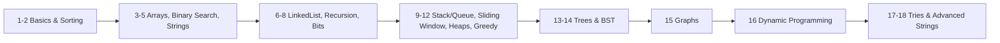

# 🧗 Striver's A2Z DSA Sheet — Complete Revision Resource

> High-quality, interview-focused guides for every topic in [Striver's A2Z DSA Sheet](https://takeuforward.org/dsa/strivers-a2z-sheet-learn-dsa-a-to-z) by Raj Vikramaditya (takeUforward).

**474 problems · 18 steps · 62 patterns** — 🟢 Easy: 151 · 🟡 Medium: 187 · 🔴 Hard: 136

Each guide covers: core concepts, **every pattern** (recognition signals → approach → Mermaid diagram → complexity → reusable C++ template → LeetCode problem links), **regularly-asked interview questions with answers**, common mistakes, and a last-minute revision cheat-sheet.

## 📚 Guides (in learning order)

| # | Topic | Problems | Guide |
|---|-------|----------|-------|
| 1 | Learn the basics | 54 | [Open](guides/01-learn-the-basics.md) |
| 2 | Learn Important Sorting Techniques | 7 | [Open](guides/02-sorting-techniques.md) |
| 3 | Solve Problems on Arrays [Easy -> Medium -> Hard] | 40 | [Open](guides/03-arrays.md) |
| 4 | Binary Search [1D, 2D Arrays, Search Space] | 32 | [Open](guides/04-binary-search.md) |
| 5 | Strings [Basic and Medium] | 15 | [Open](guides/05-strings-basic-medium.md) |
| 6 | Learn LinkedList [Single LL, Double LL, Medium, Hard Problems] | 31 | [Open](guides/06-linked-list.md) |
| 7 | Recursion [PatternWise] | 25 | [Open](guides/07-recursion.md) |
| 8 | Bit Manipulation [Concepts & Problems] | 18 | [Open](guides/08-bit-manipulation.md) |
| 9 | Stack and Queues [Learning, Pre-In-Post-fix, Monotonic Stack, Implementation] | 30 | [Open](guides/09-stack-and-queues.md) |
| 10 | Sliding Window & Two Pointer Combined Problems | 12 | [Open](guides/10-sliding-window-two-pointer.md) |
| 11 | Heaps [Learning, Medium, Hard Problems] | 17 | [Open](guides/11-heaps.md) |
| 12 | Greedy Algorithms [Easy, Medium/Hard] | 15 | [Open](guides/12-greedy.md) |
| 13 | Binary Trees [Traversals, Medium and Hard Problems] | 38 | [Open](guides/13-binary-trees.md) |
| 14 | Binary Search Trees [Concept and Problems] | 16 | [Open](guides/14-binary-search-trees.md) |
| 15 | Graphs [Concepts & Problems] | 53 | [Open](guides/15-graphs.md) |
| 16 | Dynamic Programming [Patterns and Problems] | 55 | [Open](guides/16-dynamic-programming.md) |
| 17 | Tries | 7 | [Open](guides/17-tries.md) |
| 18 | Strings | 9 | [Open](guides/18-strings-advanced.md) |

## 🗺️ Suggested Path

- **Foundations first:** Steps 1–5 build the muscles (complexity, hashing, two-pointer, binary search).
- **Core interview topics:** Sliding Window (10), Binary Search on Answer (4), Trees (13), Graphs (15), DP (16) are the highest-frequency.
- **Practice loop:** read a pattern → solve its LeetCode problems → redo from the cheat-sheet → answer the interview Q&A from memory.

- Track your progress in **[PROGRESS.md](PROGRESS.md)**. Raw data lives in [`data/`](data/).

## 🔗 Related in this Learning repo

- [System Design guides](../../system-design/README.md)
- [DDIA notes](../../books/ddia/README.md)
- [Alex Xu System Design Interview notes](../../books/alex-xu-system-design/README.md)
