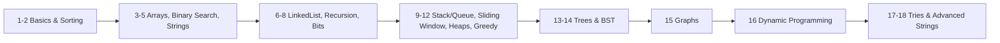

# 🧗 Striver's A2Z DSA Sheet — Complete Revision Resource

> High-quality, interview-focused study package for every topic in [Striver's A2Z DSA Sheet](https://takeuforward.org/dsa/strivers-a2z-sheet-learn-dsa-a-to-z) by Raj Vikramaditya (takeUforward).

**474 problems · 18 topics · 62 patterns** — 🟢 Easy 151 · 🟡 Medium 187 · 🔴 Hard 136

## 📁 Structure — 3 files per topic

Each topic folder in [`topics/`](topics/) contains three focused files:

- **theory-and-patterns.md** — deep theory + every pattern (recognition → approach → Mermaid diagram → complexity → C++ template)
- **problems.md** — *every* problem grouped by pattern, each with intuition, a worked example, and a memorable analogy
- **resources.md** — curated videos, blogs, visualizers, most-asked interview Q&A, books, and official problem links

## 📚 Topics (learning order)

| # | Topic | Problems | Theory | Problems | Resources |
|---|-------|:--------:|:------:|:--------:|:---------:|
| 1 | Learn the basics | 54 | [📖](topics/01-learn-the-basics/theory-and-patterns.md) | [🧩](topics/01-learn-the-basics/problems.md) | [🔗](topics/01-learn-the-basics/resources.md) |
| 2 | Learn Important Sorting Techniques | 7 | [📖](topics/02-sorting-techniques/theory-and-patterns.md) | [🧩](topics/02-sorting-techniques/problems.md) | [🔗](topics/02-sorting-techniques/resources.md) |
| 3 | Solve Problems on Arrays [Easy -> Medium -> Hard] | 40 | [📖](topics/03-arrays/theory-and-patterns.md) | [🧩](topics/03-arrays/problems.md) | [🔗](topics/03-arrays/resources.md) |
| 4 | Binary Search [1D, 2D Arrays, Search Space] | 32 | [📖](topics/04-binary-search/theory-and-patterns.md) | [🧩](topics/04-binary-search/problems.md) | [🔗](topics/04-binary-search/resources.md) |
| 5 | Strings [Basic and Medium] | 15 | [📖](topics/05-strings-basic-medium/theory-and-patterns.md) | [🧩](topics/05-strings-basic-medium/problems.md) | [🔗](topics/05-strings-basic-medium/resources.md) |
| 6 | Learn LinkedList [Single LL, Double LL, Medium, Hard Problems] | 31 | [📖](topics/06-linked-list/theory-and-patterns.md) | [🧩](topics/06-linked-list/problems.md) | [🔗](topics/06-linked-list/resources.md) |
| 7 | Recursion [PatternWise] | 25 | [📖](topics/07-recursion/theory-and-patterns.md) | [🧩](topics/07-recursion/problems.md) | [🔗](topics/07-recursion/resources.md) |
| 8 | Bit Manipulation [Concepts & Problems] | 18 | [📖](topics/08-bit-manipulation/theory-and-patterns.md) | [🧩](topics/08-bit-manipulation/problems.md) | [🔗](topics/08-bit-manipulation/resources.md) |
| 9 | Stack and Queues [Learning, Pre-In-Post-fix, Monotonic Stack, Implementation] | 30 | [📖](topics/09-stack-and-queues/theory-and-patterns.md) | [🧩](topics/09-stack-and-queues/problems.md) | [🔗](topics/09-stack-and-queues/resources.md) |
| 10 | Sliding Window & Two Pointer Combined Problems | 12 | [📖](topics/10-sliding-window-two-pointer/theory-and-patterns.md) | [🧩](topics/10-sliding-window-two-pointer/problems.md) | [🔗](topics/10-sliding-window-two-pointer/resources.md) |
| 11 | Heaps [Learning, Medium, Hard Problems] | 17 | [📖](topics/11-heaps/theory-and-patterns.md) | [🧩](topics/11-heaps/problems.md) | [🔗](topics/11-heaps/resources.md) |
| 12 | Greedy Algorithms [Easy, Medium/Hard] | 15 | [📖](topics/12-greedy/theory-and-patterns.md) | [🧩](topics/12-greedy/problems.md) | [🔗](topics/12-greedy/resources.md) |
| 13 | Binary Trees [Traversals, Medium and Hard Problems] | 38 | [📖](topics/13-binary-trees/theory-and-patterns.md) | [🧩](topics/13-binary-trees/problems.md) | [🔗](topics/13-binary-trees/resources.md) |
| 14 | Binary Search Trees [Concept and Problems] | 16 | [📖](topics/14-binary-search-trees/theory-and-patterns.md) | [🧩](topics/14-binary-search-trees/problems.md) | [🔗](topics/14-binary-search-trees/resources.md) |
| 15 | Graphs [Concepts & Problems] | 53 | [📖](topics/15-graphs/theory-and-patterns.md) | [🧩](topics/15-graphs/problems.md) | [🔗](topics/15-graphs/resources.md) |
| 16 | Dynamic Programming [Patterns and Problems] | 55 | [📖](topics/16-dynamic-programming/theory-and-patterns.md) | [🧩](topics/16-dynamic-programming/problems.md) | [🔗](topics/16-dynamic-programming/resources.md) |
| 17 | Tries | 7 | [📖](topics/17-tries/theory-and-patterns.md) | [🧩](topics/17-tries/problems.md) | [🔗](topics/17-tries/resources.md) |
| 18 | Strings | 9 | [📖](topics/18-strings-advanced/theory-and-patterns.md) | [🧩](topics/18-strings-advanced/problems.md) | [🔗](topics/18-strings-advanced/resources.md) |

## 🗺️ Suggested Path

- **Highest-frequency interview topics:** Sliding Window (10), Binary Search on Answer (4), Trees (13), Graphs (15), DP (16).
- **Practice loop:** read `theory-and-patterns.md` → solve from `problems.md` (LeetCode links) → revise via the analogies → go deeper with `resources.md`.
- Track progress in **[PROGRESS.md](PROGRESS.md)**. Raw scraped data is in [`data/`](data/).

## 🔗 Related in this Learning repo

- [System Design guides](../../system-design/README.md)
- [DDIA notes](../../books/ddia/README.md)
- [Alex Xu System Design Interview notes](../../books/alex-xu-system-design/README.md)
