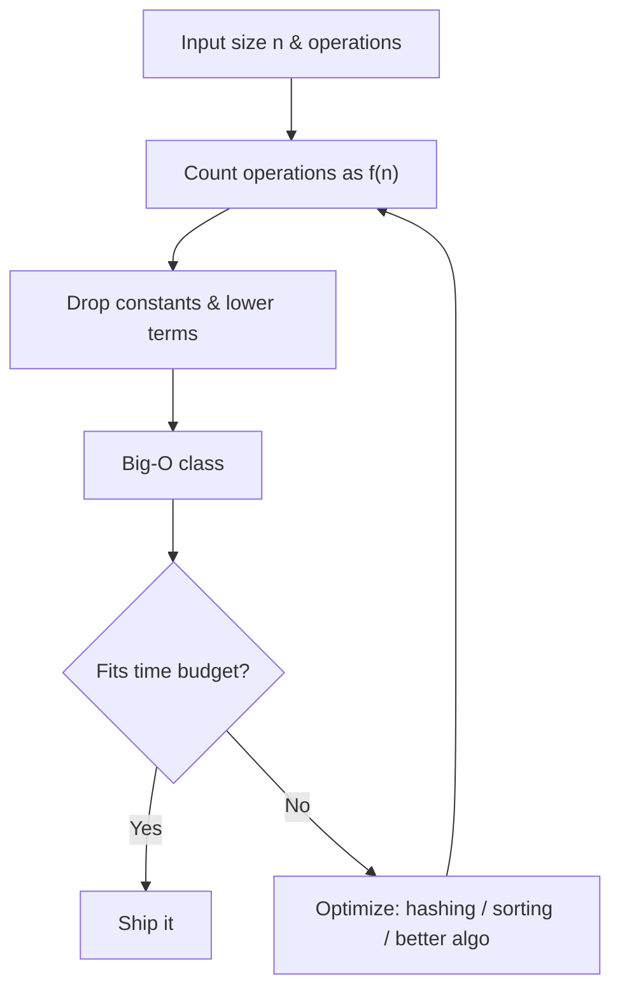
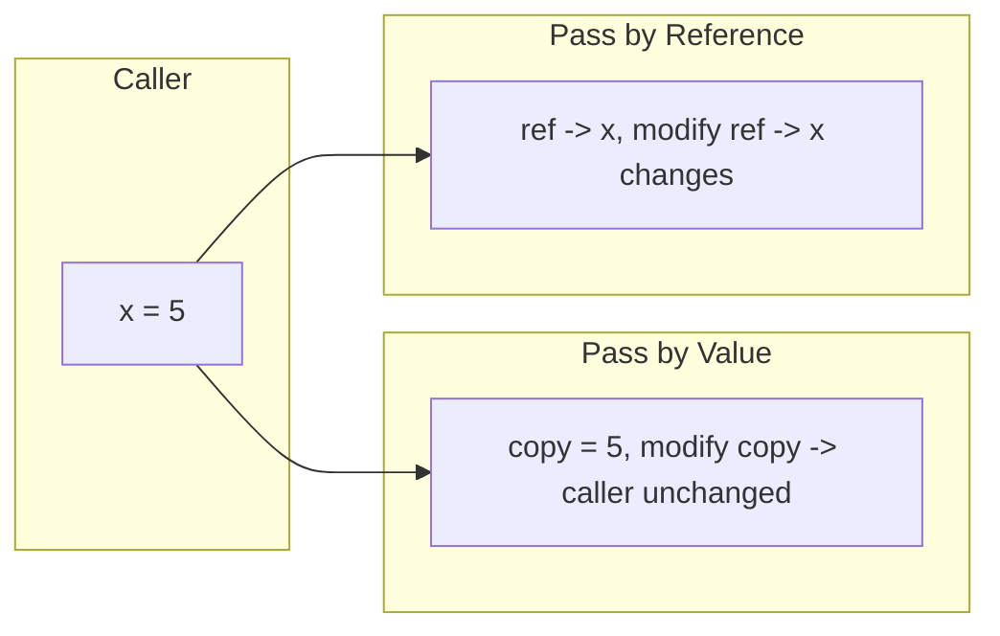
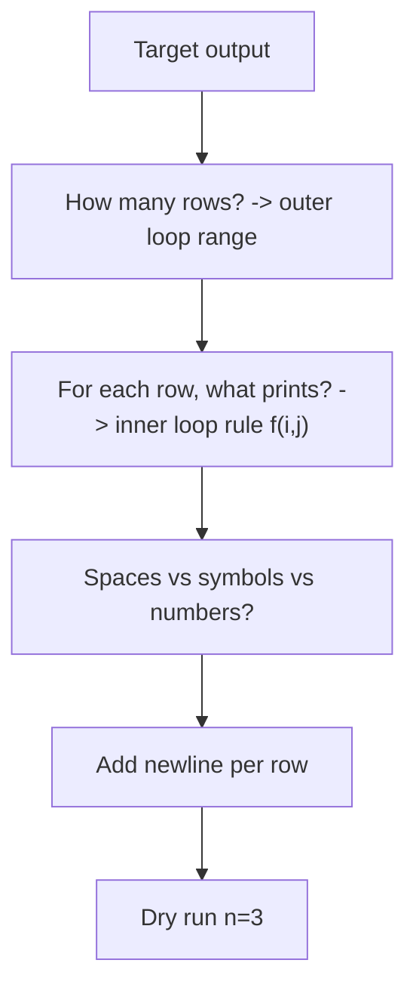
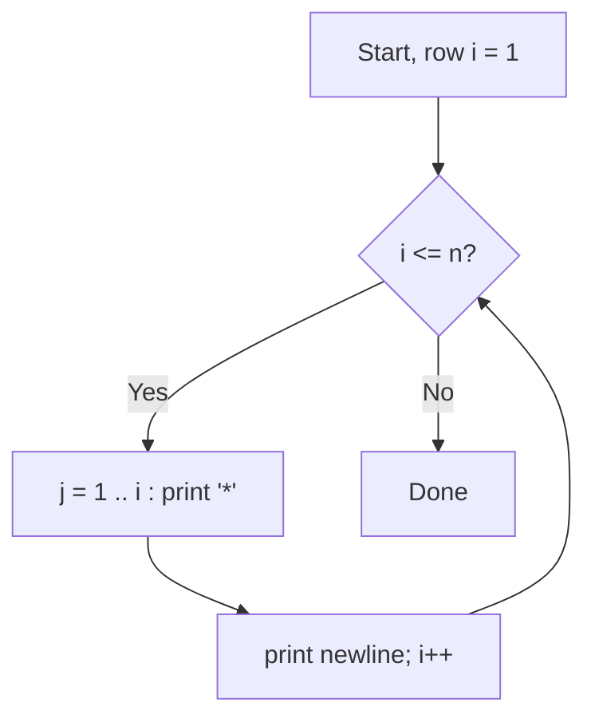
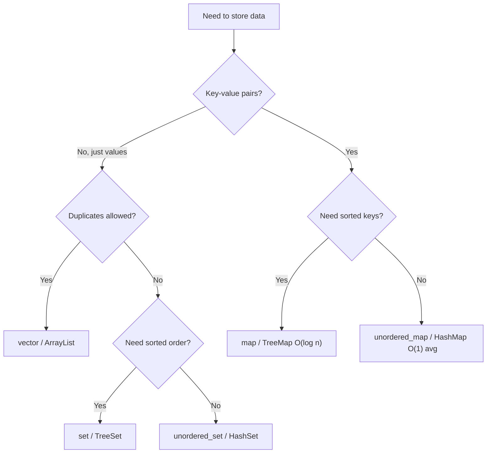
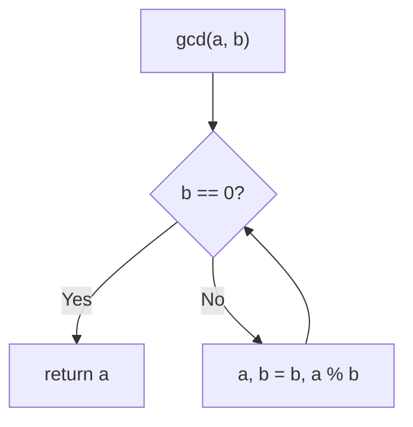
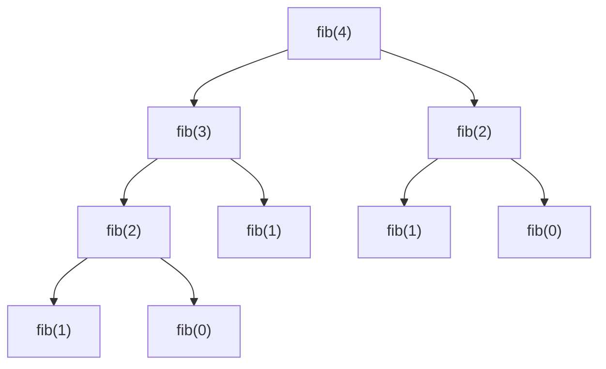
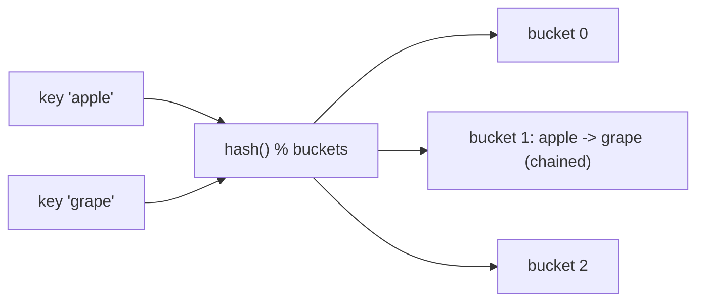

# Step 1: Learn the Basics

> The foundation of the entire A2Z journey — language essentials, **time & space complexity analysis**, loop-driven star patterns, number-theory math (GCD, prime, Armstrong), the recursion mental model, and **hashing** (frequency counting in O(1) average lookups). Master complexity and hashing here and every later step becomes easier.

**📊 Stats:** 55 problems total — 🟢 52 Easy · 🟡 3 Medium · 🔴 0 Hard.

---

## 📌 Overview & Why It Matters

"Learn the Basics" is where you build the *vocabulary and reflexes* you'll use for the rest of DSA. It is deceptively important: interviewers rarely ask "print pattern 14," but they *constantly* ask **"what's the time and space complexity?"** after you code anything, and hashing is the single most reused trick in array/string problems.

This step covers six threads:

- **Language basics** — I/O, conditionals, loops, functions (pass by value vs reference), arrays/strings, and the standard library (C++ STL / Java Collections). You must be fluent enough that syntax never slows you down in an interview.
- **Complexity analysis** — Big-O / Ω / Θ, how to count operations, and how to translate input constraints into an acceptable time budget.
- **Pattern printing** — nested-loop control flow. Great for building "row × column" thinking.
- **Basic math** — digit manipulation, GCD (Euclid), divisors in O(√n), primality, Armstrong numbers.
- **Basic recursion** — base case + recursive case, the call stack, and the recursion tree.
- **Basic hashing** — pre-computation / frequency counting for O(1) average lookups.

**Where it shows up in interviews:** complexity questions on *every* problem; "count frequency / find duplicate / most frequent element" (hashing); "reverse a number / check palindrome / GCD" (warm-up screens); "print 1..N / factorial / Fibonacci" (recursion intros).

**Prerequisites:** basic programming in one language. Nothing else.

---

## 🧠 Core Concepts

**Asymptotic notation** describes how runtime/memory grows as input size `n → ∞`, ignoring constants and lower-order terms:

- **Big-O `O(f)`** — upper bound (worst case). The one interviewers ask for.
- **Omega `Ω(f)`** — lower bound (best case).
- **Theta `Θ(f)`** — tight bound (both).

The **growth-rate ordering** you must memorize:

```
O(1) < O(log n) < O(√n) < O(n) < O(n log n) < O(n²) < O(2ⁿ) < O(n!)
```

A **rough time budget** for a 1–2 second limit (~10⁸ simple operations/sec): `n ≤ 10` → O(n!); `n ≤ 20` → O(2ⁿ); `n ≤ 500` → O(n³); `n ≤ 5000` → O(n²); `n ≤ 10⁶` → O(n log n); `n ≤ 10⁸` → O(n).

**Hashing** trades memory for speed: instead of scanning to answer "does x exist / how many times?", you *pre-store* answers in a hash table (array or hash map) keyed by the value, giving **O(1) average** lookups.



---

## 🔑 Patterns & Approaches

### 1. Things to Know in C++/Java/Python (Language Basics)

**When to use it / recognition signals:** Every problem. If you fumble I/O, loop syntax, or how arguments are passed, you lose time and introduce bugs.

**The approach/algorithm (key ideas):**
1. **Fast I/O (C++):** `ios_base::sync_with_stdio(false); cin.tie(NULL);` — matters when reading 10⁵+ lines.
2. **Conditionals:** `if / else if / else` for ranges; `switch` for discrete equality on an integral/enum value (uses jump tables, needs `break` to avoid fall-through).
3. **Loops:** `for` when the count is known; `while` when driven by a condition.
4. **Functions:** *pass by value* copies the argument (mutations don't escape); *pass by reference* (`int&` in C++) mutates the caller's variable and avoids copying large objects.
5. **Arrays vs strings:** arrays are fixed-size contiguous memory (O(1) index); strings are arrays of chars with helper methods.

**Diagram — pass by value vs reference:**



**Complexity:** N/A per-construct; the point is *zero overhead* fluency. Prefer pass-by-reference (`const&`) for large objects to avoid O(n) copies.

**Reusable template (C++):**

```cpp
#include <bits/stdc++.h>
using namespace std;

// Pass large objects by const reference to avoid copies.
void modify(int &x) { x *= 2; }          // by reference: caller sees change
int  compute(int x) { return x * 2; }    // by value: caller unchanged

int main() {
    ios_base::sync_with_stdio(false);
    cin.tie(NULL);

    int n;
    cin >> n;
    vector<int> a(n);
    for (int i = 0; i < n; i++) cin >> a[i];   // for loop: known count

    int i = 0;
    while (i < n) {                            // while loop: condition-driven
        if (a[i] % 2 == 0)      cout << "even ";
        else if (a[i] > 0)      cout << "positive-odd ";
        else                    cout << "other ";
        i++;
    }
    return 0;
}
```

**Problems:**

| # | Problem | Difficulty | Practice |
|---|---------|-----------|----------|
| 1 | Input Output | 🟢 Easy | [Article](https://takeuforward.org/c/c-basic-input-output/) · [🎥](https://youtu.be/EAR7De6Goz4?t=250) |
| 2 | Cpp Basics | 🟢 Easy | [Article](https://takeuforward.org/data-structure/what-are-arrays-strings) · [🎥](https://youtu.be/EAR7De6Goz4?t=2415) |
| 3 | If ElseIf | 🟢 Easy | [Article](https://takeuforward.org/if-else/if-else-statements/) · [🎥](https://youtu.be/EAR7De6Goz4?t=1259) |
| 4 | Switch Case | 🟢 Easy | [Article](https://takeuforward.org/switch-case/switch-case-statements/) · [🎥](https://youtu.be/EAR7De6Goz4) |
| 5 | What are arrays, strings? | 🟢 Easy | [Article](https://takeuforward.org/data-structure/what-are-arrays-strings) · [🎥](https://youtu.be/EAR7De6Goz4?t=2415) |
| 6 | For loops | 🟢 Easy | [Article](https://takeuforward.org/for-loop/understanding-for-loop/) · [🎥](https://youtu.be/EAR7De6Goz4?t=3096) |
| 7 | While loops | 🟢 Easy | [Article](https://takeuforward.org/while-loop/while-loops-in-programming/) · [🎥](https://youtu.be/EAR7De6Goz4?t=3459) |
| 8 | Functions (Pass by Reference and Value) | 🟢 Easy | [Article](https://takeuforward.org/data-structure/functions-pass-by-reference-and-value) · [🎥](https://youtu.be/EAR7De6Goz4?t=3677) |
| 9 | Theory with examples (Complexity) | 🟢 Easy | [Article](https://takeuforward.org/time-complexity/time-and-space-complexity-strivers-a2z-dsa-course/) · [🎥](https://youtu.be/FPu9Uld7W-E) |

> **Complexity focus (problem 9):** learn to *count* nested loops (`for i: for j` → O(n²)), recognize `n/2, n/4, …` halving as O(log n), and remember that **space** includes the recursion stack, not just allocated arrays.

**Edge cases & gotchas:** forgetting `break` in `switch` (fall-through); integer overflow (use `long long` in C++ / `long` in Java for products); off-by-one in loop bounds; reading with the wrong type (mixing `getline` and `>>`).

---

### 2. Build-up Logical Thinking

**When to use it / recognition signals:** Any "produce this exact output shape/sequence" task. You decompose the target into **rows and per-row rules**, then map that to nested loops.

**The approach/algorithm:**
1. Identify what varies per **row** (outer loop) and per **column** (inner loop).
2. Express each printed element as a function of `(i, j)`.
3. Handle spacing and newlines explicitly.
4. Dry-run for `n = 3` before submitting.

**Diagram — decomposition mental model:**



**Complexity:** typically **O(n²)** time (two nested loops over n rows), **O(1)** extra space.

**Reusable template (C++):**

```cpp
// General nested-loop scaffold: adapt the inner condition/what-to-print.
void draw(int n) {
    for (int i = 0; i < n; i++) {        // rows
        for (int j = 0; j < n; j++) {    // columns
            // decide: print '*', ' ', or a number based on (i, j)
            cout << '*';
        }
        cout << '\n';
    }
}
```

**Problems:**

| # | Problem | Difficulty | Practice |
|---|---------|-----------|----------|
| 1 | Easy and Medium | 🟢 Easy | [Article](https://takeuforward.org/strivers-a2z-dsa-course/must-do-pattern-problems-before-starting-dsa/) · [🎥](https://www.youtube.com/watch?v=tNm_NNSB3_w&list=PLgUwDviBIf0oF6QL8m22w1hIDC1vJ_BHz&index=3) |
| 2 | Hard | 🟢 Easy | [Article](https://takeuforward.org/strivers-a2z-dsa-course/must-do-pattern-problems-before-starting-dsa/) · [🎥](https://www.youtube.com/watch?v=tNm_NNSB3_w&list=PLgUwDviBIf0oF6QL8m22w1hIDC1vJ_BHz&index=3) |

**Edge cases & gotchas:** trailing spaces breaking output checks; forgetting the row-end newline; symmetric patterns needing an extra loop for leading spaces.

---

### 3. Patterns (Star & Number Patterns)

**When to use it / recognition signals:** Explicitly asked to print pyramids, triangles, diamonds, hollow shapes, or numeric matrices. The universal skill is **mapping shape geometry to nested loops**.

**The approach/algorithm (star-pattern playbook):**
1. **Outer loop** = number of rows.
2. **Inner loop(s):** often one loop for **leading spaces** and one for **symbols**.
3. Derive the count formulas from the row index `i` (0- or 1-indexed — pick one and stay consistent).
4. For **hollow** shapes: print the border character only when `j` is at the first/last position of that row; otherwise a space.
5. For **diamonds**: an upper triangle loop followed by a lower (inverted) triangle loop.

**Diagram — right-triangle nesting:**



**Complexity:** **O(n²)** time (total symbols printed ≈ n²), **O(1)** extra space.

**Reusable template (C++) — right triangle & pyramid:**

```cpp
// Right-angled triangle of stars
void rightTriangle(int n) {
    for (int i = 1; i <= n; i++) {
        for (int j = 1; j <= i; j++) cout << '*';
        cout << '\n';
    }
}

// Centered pyramid: spaces then stars (2*i - 1 stars on row i)
void pyramid(int n) {
    for (int i = 1; i <= n; i++) {
        for (int s = 0; s < n - i; s++) cout << ' ';   // leading spaces
        for (int j = 0; j < 2 * i - 1; j++) cout << '*'; // stars
        cout << '\n';
    }
}
```

**Problems:**

| # | Problem | Difficulty | Practice |
|---|---------|-----------|----------|
| 1 | Pattern 1 | 🟢 Easy | [Article](https://takeuforward.org/strivers-a2z-dsa-course/must-do-pattern-problems-before-starting-dsa/) · [🎥](https://www.youtube.com/watch?v=tNm_NNSB3_w&list=PLgUwDviBIf0oF6QL8m22w1hIDC1vJ_BHz&index=3) |
| 2 | Pattern 2 | 🟢 Easy | [Article](https://takeuforward.org/strivers-a2z-dsa-course/must-do-pattern-problems-before-starting-dsa/) · [🎥](https://www.youtube.com/watch?v=tNm_NNSB3_w&list=PLgUwDviBIf0oF6QL8m22w1hIDC1vJ_BHz&index=3) |
| 3 | Pattern 3 | 🟢 Easy | [Article](https://takeuforward.org/strivers-a2z-dsa-course/must-do-pattern-problems-before-starting-dsa/) · [🎥](https://www.youtube.com/watch?v=tNm_NNSB3_w&list=PLgUwDviBIf0oF6QL8m22w1hIDC1vJ_BHz&index=3) |
| 4 | Pattern 4 | 🟢 Easy | [Article](https://takeuforward.org/strivers-a2z-dsa-course/must-do-pattern-problems-before-starting-dsa/) · [🎥](https://www.youtube.com/watch?v=tNm_NNSB3_w&list=PLgUwDviBIf0oF6QL8m22w1hIDC1vJ_BHz&index=3) |
| 5 | Pattern 5 | 🟢 Easy | [Article](https://takeuforward.org/strivers-a2z-dsa-course/must-do-pattern-problems-before-starting-dsa/) · [🎥](https://www.youtube.com/watch?v=tNm_NNSB3_w&list=PLgUwDviBIf0oF6QL8m22w1hIDC1vJ_BHz&index=3) |
| 6 | Pattern 6 | 🟢 Easy | [Article](https://takeuforward.org/strivers-a2z-dsa-course/must-do-pattern-problems-before-starting-dsa/) · [🎥](https://www.youtube.com/watch?v=tNm_NNSB3_w&list=PLgUwDviBIf0oF6QL8m22w1hIDC1vJ_BHz&index=3) |
| 7 | Pattern 7 | 🟢 Easy | [Article](https://takeuforward.org/strivers-a2z-dsa-course/must-do-pattern-problems-before-starting-dsa/) · [🎥](https://www.youtube.com/watch?v=tNm_NNSB3_w&list=PLgUwDviBIf0oF6QL8m22w1hIDC1vJ_BHz&index=3) |
| 8 | Pattern 8 | 🟢 Easy | [Article](https://takeuforward.org/strivers-a2z-dsa-course/must-do-pattern-problems-before-starting-dsa/) · [🎥](https://www.youtube.com/watch?v=tNm_NNSB3_w&list=PLgUwDviBIf0oF6QL8m22w1hIDC1vJ_BHz&index=3) |
| 9 | Pattern 9 | 🟢 Easy | [Article](https://takeuforward.org/strivers-a2z-dsa-course/must-do-pattern-problems-before-starting-dsa/) · [🎥](https://www.youtube.com/watch?v=tNm_NNSB3_w&list=PLgUwDviBIf0oF6QL8m22w1hIDC1vJ_BHz&index=3) |
| 10 | Pattern 10 | 🟢 Easy | [Article](https://takeuforward.org/strivers-a2z-dsa-course/must-do-pattern-problems-before-starting-dsa/) · [🎥](https://www.youtube.com/watch?v=tNm_NNSB3_w&list=PLgUwDviBIf0oF6QL8m22w1hIDC1vJ_BHz&index=3) |
| 11 | Pattern 11 | 🟢 Easy | [Article](https://takeuforward.org/strivers-a2z-dsa-course/must-do-pattern-problems-before-starting-dsa/) · [🎥](https://www.youtube.com/watch?v=tNm_NNSB3_w&list=PLgUwDviBIf0oF6QL8m22w1hIDC1vJ_BHz&index=3) |
| 12 | Pattern 12 | 🟢 Easy | [Article](https://takeuforward.org/strivers-a2z-dsa-course/must-do-pattern-problems-before-starting-dsa/) · [🎥](https://www.youtube.com/watch?v=tNm_NNSB3_w&list=PLgUwDviBIf0oF6QL8m22w1hIDC1vJ_BHz&index=3) |
| 13 | Pattern 13 | 🟢 Easy | [Article](https://takeuforward.org/strivers-a2z-dsa-course/must-do-pattern-problems-before-starting-dsa/) · [🎥](https://www.youtube.com/watch?v=tNm_NNSB3_w&list=PLgUwDviBIf0oF6QL8m22w1hIDC1vJ_BHz&index=3) |
| 14 | Pattern 14 | 🟢 Easy | [Article](https://takeuforward.org/strivers-a2z-dsa-course/must-do-pattern-problems-before-starting-dsa/) · [🎥](https://www.youtube.com/watch?v=tNm_NNSB3_w&list=PLgUwDviBIf0oF6QL8m22w1hIDC1vJ_BHz&index=3) |
| 15 | Pattern 15 | 🟢 Easy | [Article](https://takeuforward.org/strivers-a2z-dsa-course/must-do-pattern-problems-before-starting-dsa/) · [🎥](https://www.youtube.com/watch?v=tNm_NNSB3_w&list=PLgUwDviBIf0oF6QL8m22w1hIDC1vJ_BHz&index=3) |
| 16 | Pattern 16 | 🟢 Easy | [Article](https://takeuforward.org/strivers-a2z-dsa-course/must-do-pattern-problems-before-starting-dsa/) · [🎥](https://www.youtube.com/watch?v=tNm_NNSB3_w&list=PLgUwDviBIf0oF6QL8m22w1hIDC1vJ_BHz&index=3) |
| 17 | Pattern 17 | 🟢 Easy | [Article](https://takeuforward.org/strivers-a2z-dsa-course/must-do-pattern-problems-before-starting-dsa/) · [🎥](https://www.youtube.com/watch?v=tNm_NNSB3_w&list=PLgUwDviBIf0oF6QL8m22w1hIDC1vJ_BHz&index=3) |
| 18 | Pattern 18 | 🟢 Easy | [Article](https://takeuforward.org/strivers-a2z-dsa-course/must-do-pattern-problems-before-starting-dsa/) · [🎥](https://www.youtube.com/watch?v=tNm_NNSB3_w&list=PLgUwDviBIf0oF6QL8m22w1hIDC1vJ_BHz&index=3) |
| 19 | Pattern 19 | 🟢 Easy | [Article](https://takeuforward.org/strivers-a2z-dsa-course/must-do-pattern-problems-before-starting-dsa/) · [🎥](https://www.youtube.com/watch?v=tNm_NNSB3_w&list=PLgUwDviBIf0oF6QL8m22w1hIDC1vJ_BHz&index=3) |
| 20 | Pattern 20 | 🟡 Medium | [Article](https://takeuforward.org/strivers-a2z-dsa-course/must-do-pattern-problems-before-starting-dsa/) · [🎥](https://www.youtube.com/watch?v=tNm_NNSB3_w&list=PLgUwDviBIf0oF6QL8m22w1hIDC1vJ_BHz&index=3) |
| 21 | Pattern 21 | 🟡 Medium | [Article](https://takeuforward.org/strivers-a2z-dsa-course/must-do-pattern-problems-before-starting-dsa/) · [🎥](https://www.youtube.com/watch?v=tNm_NNSB3_w&list=PLgUwDviBIf0oF6QL8m22w1hIDC1vJ_BHz&index=3) |
| 22 | Pattern 22 | 🟡 Medium | [Article](https://takeuforward.org/strivers-a2z-dsa-course/must-do-pattern-problems-before-starting-dsa/) · [🎥](https://www.youtube.com/watch?v=tNm_NNSB3_w&list=PLgUwDviBIf0oF6QL8m22w1hIDC1vJ_BHz&index=3) |

**Edge cases & gotchas:** mixing 0-indexed and 1-indexed formulas mid-solution; leading-space count wrong by one; diamond/hourglass needing two separate loops; number patterns that reset per row vs continue.

---

### 4. Learn STL / Java Collections

**When to use it / recognition signals:** Always — knowing the right container/algorithm is half the battle. "I need ordered keys" → `map`/`TreeMap`; "I need O(1) lookup" → `unordered_map`/`HashMap`; "auto-sorted, min/max on top" → `priority_queue`/`PriorityQueue`.

**The approach/algorithm — key containers & complexities:**

| Need | C++ STL | Java | Lookup/Insert |
|------|---------|------|---------------|
| Dynamic array | `vector` | `ArrayList` | amortized O(1) push_back |
| Ordered map | `map` (RB-tree) | `TreeMap` | O(log n) |
| Hash map | `unordered_map` | `HashMap` | O(1) avg, O(n) worst |
| Ordered set | `set` | `TreeSet` | O(log n) |
| Hash set | `unordered_set` | `HashSet` | O(1) avg |
| FIFO queue | `queue` | `LinkedList`/`ArrayDeque` | O(1) |
| LIFO stack | `stack` | `Stack`/`ArrayDeque` | O(1) |
| Heap | `priority_queue` | `PriorityQueue` | O(log n) push/pop |

**Diagram — picking a container:**



**Complexity:** container-dependent (see table). Know these cold — interviewers probe them.

**Reusable template (C++ STL essentials):**

```cpp
vector<int> v = {3, 1, 2};
sort(v.begin(), v.end());                     // O(n log n)
v.push_back(4);                               // amortized O(1)

unordered_map<int,int> freq;                  // O(1) avg
for (int x : v) freq[x]++;

set<int> s(v.begin(), v.end());               // sorted, unique, O(log n) ops
auto it = s.lower_bound(2);                   // first element >= 2

priority_queue<int> maxHeap;                  // max-heap by default
priority_queue<int, vector<int>, greater<int>> minHeap;
```

**Problems:**

| # | Problem | Difficulty | Practice |
|---|---------|-----------|----------|
| 1 | STL | 🟢 Easy | [Article](https://takeuforward.org/c/c-stl-tutorial-most-frequent-used-stl-containers/) · [🎥](https://www.youtube.com/watch?v=RRVYpIET_RU) |
| 2 | Java Collections | 🟢 Easy | [Article](https://takeuforward.org/data-structure/java-collections) |

**Edge cases & gotchas:** `unordered_map` worst case is O(n) on adversarial hashes; `[]` on a C++ map **inserts** a default value if key absent (use `.count()`/`.find()` to just check); iterator invalidation after insert/erase; `map` iterates in sorted key order, `unordered_map` in arbitrary order.

---

### 5. Know Basic Maths

**When to use it / recognition signals:** Digit-by-digit processing (count/reverse digits, palindrome, Armstrong) or number theory (GCD, divisors, prime). Recognition: "given an integer, do something with its digits / factors."

**The approach/algorithm:**
- **Extract digits:** `d = n % 10; n /= 10;` in a loop. Count of digits = `floor(log10(n)) + 1`.
- **Reverse a number:** `rev = rev*10 + n%10; n/=10;` — watch **32-bit overflow**.
- **Palindrome:** reverse and compare (or check with digit math).
- **Armstrong:** sum of each digit raised to the power = number of digits; compare to original.
- **Divisors in O(√n):** iterate `i` up to `√n`; whenever `i` divides `n`, both `i` and `n/i` are divisors.
- **Prime check in O(√n):** `n > 1` and no divisor `i` in `[2, √n]`.
- **GCD (Euclid):** `gcd(a, b) = gcd(b, a % b)`, base `gcd(a, 0) = a` — **O(log(min(a,b)))**.

**Diagram — Euclid's GCD:**



**Complexity:** digit ops **O(log₁₀ n)** (number of digits); divisors/prime **O(√n)**; GCD **O(log(min(a,b)))**. All **O(1)** space.

**Reusable template (C++):**

```cpp
long long reverseNum(long long n) {           // handles sign; watch overflow for 32-bit
    long long rev = 0;
    while (n) { rev = rev * 10 + n % 10; n /= 10; }
    return rev;
}

int gcd(int a, int b) {                        // Euclidean, O(log min(a,b))
    while (b) { int t = a % b; a = b; b = t; }
    return a;
}

vector<int> divisors(int n) {                  // O(sqrt(n))
    vector<int> res;
    for (int i = 1; (long long)i * i <= n; i++)
        if (n % i == 0) { res.push_back(i); if (i != n / i) res.push_back(n / i); }
    return res;                                // sort if order matters
}

bool isPrime(int n) {                          // O(sqrt(n))
    if (n < 2) return false;
    for (int i = 2; (long long)i * i <= n; i++)
        if (n % i == 0) return false;
    return true;
}

bool isArmstrong(int n) {                       // sum of digit^k == n, k = #digits
    int digits = to_string(n).size(), sum = 0, temp = n;
    while (temp) { int d = temp % 10; sum += pow(d, digits); temp /= 10; }
    return sum == n;
}
```

**Problems:**

| # | Problem | Difficulty | Practice |
|---|---------|-----------|----------|
| 1 | Count all Digits of a Number | 🟢 Easy | [Article](https://takeuforward.org/data-structure/count-digits-in-a-number/) · [🎥](https://youtu.be/1xNbjMdbjug) |
| 2 | Reverse a number | 🟢 Easy | [LeetCode](https://leetcode.com/problems/reverse-integer/) · [🎥](https://youtu.be/1xNbjMdbjug?t=930) |
| 3 | Palindrome Number | 🟢 Easy | [LeetCode](https://leetcode.com/problems/palindrome-number/) · [🎥](https://youtu.be/1xNbjMdbjug?t=1230) |
| 4 | GCD of Two Numbers | 🟢 Easy | [Article](https://takeuforward.org/data-structure/find-gcd-of-two-numbers/) · [🎥](https://youtu.be/1xNbjMdbjug?t=2684) |
| 5 | Check if the Number is Armstrong | 🟢 Easy | [LeetCode](https://leetcode.com/problems/armstrong-number/) · [🎥](https://youtu.be/1xNbjMdbjug?t=1418) |
| 6 | Print all Divisors | 🟢 Easy | [Article](https://takeuforward.org/data-structure/print-all-divisors-of-a-given-number/) · [🎥](https://youtu.be/1xNbjMdbjug?t=1580) |
| 7 | Check for Prime Number | 🟢 Easy | [Article](https://takeuforward.org/data-structure/check-if-a-number-is-prime-or-not/) · [🎥](https://youtu.be/1xNbjMdbjug?t=2381) |

**Edge cases & gotchas:** **overflow** when reversing (return 0 outside 32-bit range for the LeetCode variant); negative numbers are not palindromes; `1` is **not** prime, `2` **is**; iterate to `i*i <= n` (not `i <= sqrt(n)` with floating error); Armstrong power should use integer arithmetic to avoid `pow` rounding.

---

### 6. Learn Basic Recursion

**When to use it / recognition signals:** A problem defined in terms of a **smaller version of itself** (factorial, Fibonacci, tree/subarray splits) or when you'd otherwise nest loops of unknown depth. Signal words: "all subsets/permutations," "process n then n-1," "divide and conquer."

**The approach/algorithm:**
1. **Base case** — smallest input solvable directly; without it you get infinite recursion → **stack overflow**.
2. **Recursive case** — reduce toward the base case and combine results.
3. Decide **head recursion** (work after the call, e.g., print on the way back) vs **tail recursion** (work before the call).
4. Track the **call stack** — depth `d` means **O(d)** stack space.

**Diagram — recursion tree for `fib(4)`:**



**Complexity:** varies — linear recursions (factorial, sum, print) are **O(n)** time, **O(n)** stack; naive Fibonacci is **O(2ⁿ)** time (exponential branching), **O(n)** stack.

**Reusable template (C++):**

```cpp
// 1) Print 1..N (increasing): recurse first, print on the way (or head/tail choice)
void print1toN(int i, int n) {
    if (i > n) return;              // base case
    cout << i << ' ';
    print1toN(i + 1, n);            // recursive case
}

// 2) Sum of first N
int sumN(int n) {
    if (n == 0) return 0;           // base case
    return n + sumN(n - 1);
}

// 3) Factorial
long long fact(int n) {
    if (n <= 1) return 1;
    return (long long)n * fact(n - 1);
}

// 4) Reverse array using two pointers recursively
void reverse(vector<int>& a, int l, int r) {
    if (l >= r) return;
    swap(a[l], a[r]);
    reverse(a, l + 1, r - 1);
}

// 5) Fibonacci (naive, exponential — mention memoization improves to O(n))
int fib(int n) {
    if (n <= 1) return n;
    return fib(n - 1) + fib(n - 2);
}
```

**Problems:**

| # | Problem | Difficulty | Practice |
|---|---------|-----------|----------|
| 1 | Understand recursion by print something N times | 🟢 Easy | [Article](https://takeuforward.org/recursion/introduction-to-recursion-understand-recursion-by-printing-something-n-times/) · [🎥](https://www.youtube.com/watch?v=yVdKa8dnKiE&list=PLgUwDviBIf0rGlzIn_7rsaR2FQ5e6ZOL9) |
| 2 | Print name N times using recursion | 🟢 Easy | [Article](https://takeuforward.org/recursion/print-name-n-times-using-recursion/) · [🎥](https://www.youtube.com/watch?v=un6PLygfXrA&list=PLgUwDviBIf0rGlzIn_7rsaR2FQ5e6ZOL9&index=2) |
| 3 | Print 1 to N using Recursion | 🟢 Easy | [Article](https://takeuforward.org/recursion/print-1-to-n-using-recursion/) · [🎥](https://www.youtube.com/watch?v=un6PLygfXrA&list=PLgUwDviBIf0rGlzIn_7rsaR2FQ5e6ZOL9&index=2) |
| 4 | Print N to 1 using Recursion | 🟢 Easy | [Article](https://takeuforward.org/recursion/print-n-to-1-using-recursion/) · [🎥](https://www.youtube.com/watch?v=un6PLygfXrA&list=PLgUwDviBIf0rGlzIn_7rsaR2FQ5e6ZOL9&index=2) |
| 5 | Sum of First N Numbers | 🟢 Easy | [Article](https://takeuforward.org/data-structure/sum-of-first-n-natural-numbers/) · [🎥](https://www.youtube.com/watch?v=69ZCDFy-OUo&list=PLgUwDviBIf0rGlzIn_7rsaR2FQ5e6ZOL9&index=3) |
| 6 | Factorial of a given number | 🟢 Easy | [Article](https://takeuforward.org/data-structure/factorial-of-a-number-iterative-and-recursive) · [🎥](https://www.youtube.com/watch?v=69ZCDFy-OUo&list=PLgUwDviBIf0rGlzIn_7rsaR2FQ5e6ZOL9&index=3) |
| 7 | Reverse an array | 🟢 Easy | [Article](https://takeuforward.org/data-structure/reverse-a-given-array/) · [🎥](https://www.youtube.com/watch?v=twuC1F6gLI8&list=PLgUwDviBIf0rGlzIn_7rsaR2FQ5e6ZOL9&index=4) |
| 8 | Check if String is Palindrome or Not | 🟢 Easy | [LeetCode](https://leetcode.com/problems/valid-palindrome/) · [🎥](https://www.youtube.com/watch?v=twuC1F6gLI8&list=PLgUwDviBIf0rGlzIn_7rsaR2FQ5e6ZOL9&index=4) |
| 9 | Fibonacci Number | 🟢 Easy | [LeetCode](https://leetcode.com/problems/fibonacci-number/) · [🎥](https://www.youtube.com/watch?v=kvRjNm4rVBE&list=PLgUwDviBIf0rGlzIn_7rsaR2FQ5e6ZOL9&index=5) |

> Note: problem **#1** ("understand recursion by print something N times") and **#2** share the intro article/videos; both are included.

**Edge cases & gotchas:** missing/incorrect base case → infinite recursion & **StackOverflowError**; deep recursion in Python (default limit ~1000, raise with `sys.setrecursionlimit`); recomputation in naive Fibonacci (fix with memoization → O(n)); confusing print-order between head vs tail recursion.

---

### 7. Learn Basic Hashing

**When to use it / recognition signals:** "How many times does x occur?", "does x exist?", "most/least frequent element", "any duplicates?", "two-sum-style complement lookup." Any time repeated **queries** hit the same data — **pre-compute** then answer in **O(1)**.

**The approach/algorithm:**
1. **Pre-compute** a frequency table in one pass:
   - **Array hashing** when keys are small bounded integers (e.g., 0–10⁶ or 'a'–'z'): `freq[x]++`. O(1) exact lookups.
   - **Map/dictionary hashing** (`unordered_map`/`HashMap`) for large or non-integer keys.
2. **Answer queries** in O(1) average by indexing the table.
3. **Internals:** hash function → bucket index; **collisions** (two keys → same bucket) resolved by **chaining** (linked list, upgraded to a balanced tree in Java 8+) or **open addressing**. **Load factor** = entries / buckets; when it exceeds a threshold (~0.75) the table **rehashes** (doubles buckets) to keep operations near O(1).

**Diagram — hash map buckets with a collision:**



**Complexity:** build **O(n)**; each lookup **O(1) average** (O(n) worst case with adversarial collisions). Space **O(n)** (or O(range) for array hashing).

**Reusable template (C++):**

```cpp
// Array hashing for small integer range (e.g., values 0..MAXN)
const int MAXN = 1e6 + 1;
int freq[MAXN] = {0};
for (int x : arr) freq[x]++;          // O(n) precompute
// query: freq[q] answered in O(1)

// Character hashing (lowercase letters)
int cnt[26] = {0};
for (char c : s) cnt[c - 'a']++;

// Map hashing for large/arbitrary keys
unordered_map<int,int> mp;
for (int x : arr) mp[x]++;

// Highest occurring element
int best = arr[0], bestCnt = 0;
for (auto& [val, c] : mp) if (c > bestCnt) { bestCnt = c; best = val; }
```

**Problems:**

| # | Problem | Difficulty | Practice |
|---|---------|-----------|----------|
| 1 | Basic Hashing | 🟢 Easy | [Article](https://takeuforward.org/hashing/hashing-maps-time-complexity-collisions-division-rule-of-hashing-strivers-a2z-dsa-course/) · [🎥](https://www.youtube.com/watch?v=KEs5UyBJ39g) |
| 2 | Counting Frequencies of Array Elements | 🟢 Easy | [Article](https://takeuforward.org/data-structure/count-frequency-of-each-element-in-the-array/) |
| 3 | Highest Occurring Element in an Array | 🟢 Easy | [LeetCode](https://leetcode.com/problems/frequency-of-the-most-frequent-element/) |

**Edge cases & gotchas:** array hashing needs a **bounded, non-negative** key range (offset negatives, or use a map); C++ `map[key]++` auto-inserts (fine for counting, dangerous for existence checks); memory blows up if the range is huge — switch to a map; ties in "most frequent" need a defined tie-break; `unordered_map` degrades to O(n) under hash attacks.

---

## ❓ Regularly Asked Interview Questions

**Q: What is Big-O notation and why do we use it?**
**A:** Big-O describes the asymptotic upper bound on an algorithm's time or space as input size grows, ignoring constants and lower-order terms. It lets us compare algorithms' scalability independent of hardware.

**Q: Difference between Big-O, Big-Ω, and Big-Θ?**
**A:** O = worst-case upper bound, Ω = best-case lower bound, Θ = tight bound when upper and lower coincide. Interviewers almost always mean worst-case O.

**Q: What's the time complexity of two nested loops over n? What about a loop that halves each step?**
**A:** Nested loops → O(n²). Halving (`i *= 2` / `i /= 2`) → O(log n). Halving inside a linear loop → O(n log n).

**Q: Does dropping constants mean O(2n) and O(n) are the same?**
**A:** Yes asymptotically — both are O(n). Constants matter in practice but not in Big-O classification.

**Q: What is space complexity — do we count the input?**
**A:** Space complexity is *auxiliary* memory used beyond the input, including the recursion call stack. Typically we exclude the input array itself unless stated.

**Q: How do you decide the algorithm from input constraints?**
**A:** Map n to a budget: n ≤ 20 → exponential OK; n ≤ 500 → O(n³); n ≤ 5·10³ → O(n²); n ≤ 10⁶ → O(n log n); n ≤ 10⁸ → O(n). Pick the simplest algorithm that fits.

**Q: What is recursion and what are its two essential parts?**
**A:** A function calling itself on smaller input. The two parts are the **base case** (stops recursion) and the **recursive case** (reduces toward the base). Missing base case → infinite recursion → stack overflow.

**Q: Recursion vs iteration — trade-offs?**
**A:** Recursion is cleaner for self-similar/divide-and-conquer problems but uses O(depth) stack space and has call overhead; iteration is more memory-efficient. Tail recursion can sometimes be optimized to iteration.

**Q: Why is naive Fibonacci O(2ⁿ) and how do you fix it?**
**A:** Each call spawns two calls, forming an exponential tree with repeated subproblems. Memoization (cache results) reduces it to O(n) time, O(n) space; bottom-up DP gives O(1) space.

**Q: How does a hash map achieve O(1) lookups, and when does it degrade?**
**A:** A hash function maps a key to a bucket index for direct access. It degrades to O(n) when many keys collide into one bucket (bad hash or adversarial input); Java 8+ mitigates by converting long collision chains to balanced trees (O(log n)).

**Q: What is a hash collision and how is it resolved?**
**A:** Two distinct keys hashing to the same bucket. Resolved by **chaining** (store multiple entries per bucket via list/tree) or **open addressing** (probe for the next free slot).

**Q: What is load factor and rehashing?**
**A:** Load factor = number of entries / number of buckets. When it exceeds a threshold (~0.75), the table **rehashes** — allocates a larger bucket array and redistributes entries — to keep operations near O(1).

**Q: How would you find the most frequent element in an array?**
**A:** One pass to build a frequency map (O(n)), then one pass over the map to take the key with max count (O(n)). Overall O(n) time, O(n) space.

**Q: Compute GCD of two numbers — approach and complexity?**
**A:** Euclid's algorithm: `gcd(a,b) = gcd(b, a % b)` until b = 0. Runs in O(log(min(a,b))).

**Q: How do you check primality efficiently?**
**A:** Test divisibility only up to √n (a factor larger than √n implies a co-factor smaller than √n). O(√n). For many queries in a range, use the Sieve of Eratosthenes (O(n log log n)).

---

## 💡 Interview Tips & Common Mistakes

- **Always state complexity unprompted** after coding — "this is O(n) time, O(n) space." It signals maturity.
- Include the **recursion stack** in space complexity; forgetting it is a common miss.
- Watch **integer overflow**: use `long long`/`long` for products, sums, and number reversal.
- Iterate to `i*i <= n` instead of `i <= sqrt(n)` to avoid floating-point error and repeated sqrt cost.
- For hashing, choose **array vs map** deliberately: array for small bounded integer keys, map otherwise; mention memory cost of large ranges.
- Don't fabricate an O(1) claim for `unordered_map` without noting the **O(n) worst case**.
- In patterns, **fix your indexing convention** (0- or 1-based) and dry-run n=3 before claiming correctness.
- Define your **base case first** in recursion, then the recursive step.
- Know that `1` is not prime and `2` is the only even prime.
- Prefer **pass-by-const-reference** for large objects to avoid silent O(n) copies.

---

## 🐟 Revision Cheat-Sheet

| Pattern | Key Idea | Time | Space | Signature problem |
|---------|----------|------|-------|-------------------|
| Language Basics | I/O, loops, pass by value vs reference, fluency | — | — | Theory with examples |
| Build-up Logical Thinking | Decompose output into row/column rules | O(n²) | O(1) | Must-do pattern problems |
| Patterns (star/number) | Outer=rows, inner=spaces+symbols via f(i,j) | O(n²) | O(1) | Pyramid (Pattern) |
| STL / Collections | Pick the right container for the operation | container-dep. | container-dep. | STL |
| Basic Maths | Digit math + O(√n) factors + Euclid GCD | O(√n) / O(log n) | O(1) | GCD of Two Numbers |
| Basic Recursion | Base case + recursive case + call stack | O(n)–O(2ⁿ) | O(depth) | Fibonacci Number |
| Basic Hashing | Precompute frequencies for O(1) lookups | O(n) build, O(1) query | O(n) | Highest Occurring Element |

---

## 🔗 References & Further Reading

- **Striver A2Z — Step 1 (takeuforward):** <https://takeuforward.org/strivers-a2z-dsa-course/strivers-a2z-dsa-course-sheet-2/>
- **Striver — Time & Space Complexity:** <https://takeuforward.org/time-complexity/time-and-space-complexity-strivers-a2z-dsa-course/>
- **Striver — Hashing (maps, collisions, division rule):** <https://takeuforward.org/hashing/hashing-maps-time-complexity-collisions-division-rule-of-hashing-strivers-a2z-dsa-course/>
- **Striver — Must-do pattern problems:** <https://takeuforward.org/strivers-a2z-dsa-course/must-do-pattern-problems-before-starting-dsa/>
- **GeeksforGeeks — Big-O Notation Interview Questions:** <https://www.geeksforgeeks.org/dsa/big-o-notation-interview-questions-answers/>
- **GeeksforGeeks — Hashing Interview Questions:** <https://www.geeksforgeeks.org/dsa/commonly-asked-data-structure-interview-questions-on-hashing/>
- **GeeksforGeeks — Recursion Interview Questions:** <https://www.geeksforgeeks.org/dsa/commonly-asked-data-structure-interview-questions-on-recursion/>
- **GeeksforGeeks — Load Factor and Rehashing:** <https://www.geeksforgeeks.org/dsa/load-factor-and-rehashing/>
- **Tech Interview Handbook — Recursion cheatsheet:** <https://www.techinterviewhandbook.org/algorithms/recursion/>
- **Big-O Cheat Sheet:** <https://www.bigocheatsheet.com/>
