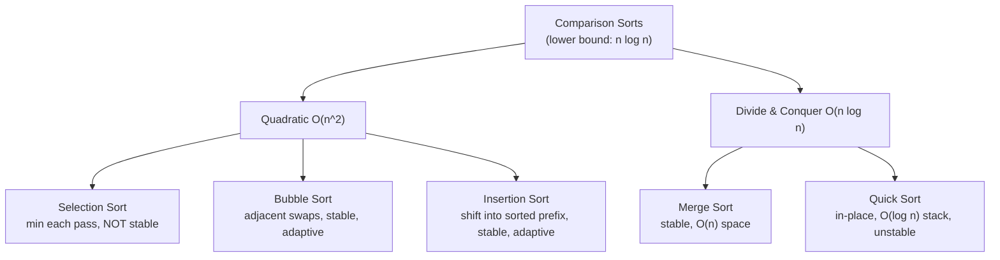
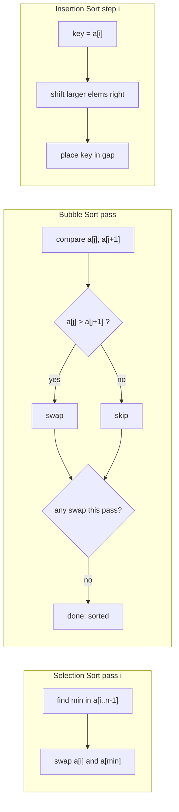
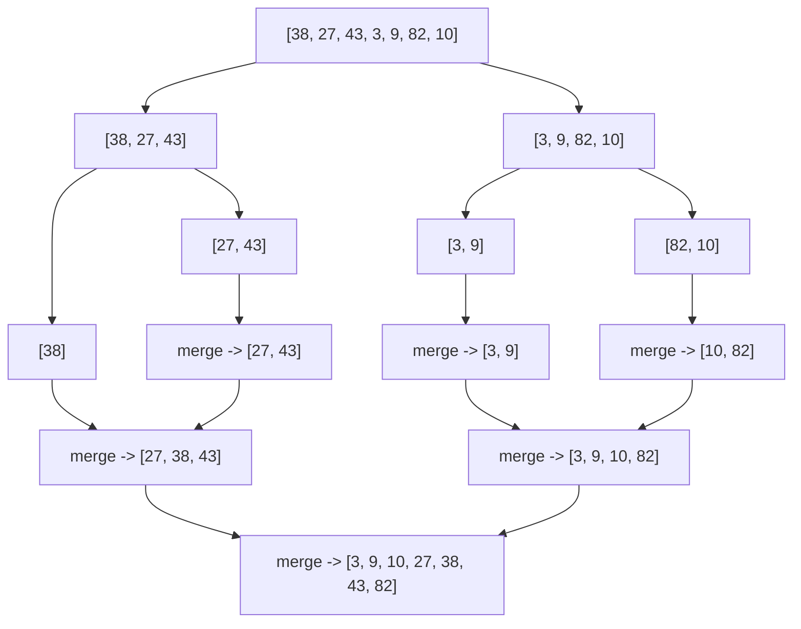
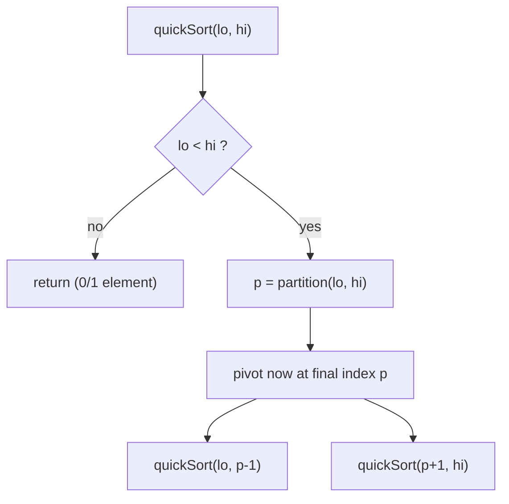

# Step 2: Learn Important Sorting Techniques

A hands-on tour of the five foundational sorting algorithms — Selection, Bubble, Insertion, Merge, and Quick — with their invariants, stability, in-place behavior, and complexity trade-offs.

**Total problems: 7** — 🟢 Easy: 6 · 🟡 Medium: 1 · 🔴 Hard: 0

---

## 📌 Overview & Why It Matters

Sorting is the single most re-used building block in all of DSA. Binary search, two pointers, greedy scheduling, interval merging, sweep-line, and dozens of other patterns *assume the input is sorted*. Understanding **how** each classic sort works — and its exact trade-offs — is a bread-and-butter interview topic.

Interviewers rarely ask you to implement `std::sort`. Instead they probe:

- Can you code Merge Sort or Quick Sort **from scratch** with a correct partition/merge step?
- Do you know **why** Quick Sort is O(n²) worst case but preferred in practice?
- What does **stable** mean and which of these sorts are stable?
- What is an **in-place** sort and which ones qualify?
- How would you sort with **O(1) extra space** vs. when is O(n) acceptable?

These questions test whether you understand *invariants* (what is guaranteed true after each pass) rather than memorized code.

**Prerequisites:** arrays, loops, recursion (for Merge/Quick), and Big-O notation.

**Key vocabulary:**

| Term | Meaning |
|------|---------|
| **Stable** | Equal keys keep their original relative order after sorting. |
| **In-place** | Uses O(1) extra space (recursion stack usually excluded, but noted). |
| **Comparison sort** | Orders elements by comparing pairs; lower bound is **Ω(n log n)**. |
| **Adaptive** | Runs faster on already (nearly) sorted input. |
| **Invariant** | A property guaranteed true at a checkpoint (e.g. "the left part is sorted"). |

---

## 🧠 Core Concepts

All five algorithms here are **comparison-based**, so none can beat the Ω(n log n) lower bound in the general case. They split into two families:

- **O(n²) quadratic sorts** (Selection, Bubble, Insertion) — simple, in-place, good for tiny or nearly-sorted arrays.
- **O(n log n) divide-and-conquer sorts** (Merge, Quick) — the ones interviewers actually want you to code.



**The comparison cheat-matrix** (memorize this — it answers 80% of interview questions):

| Algorithm | Best | Average | Worst | Space | Stable? | In-place? | Adaptive? |
|-----------|------|---------|-------|-------|---------|-----------|-----------|
| Selection | O(n²) | O(n²) | O(n²) | O(1) | ❌ No | ✅ Yes | ❌ No |
| Bubble | O(n) | O(n²) | O(n²) | O(1) | ✅ Yes | ✅ Yes | ✅ Yes |
| Insertion | O(n) | O(n²) | O(n²) | O(1) | ✅ Yes | ✅ Yes | ✅ Yes |
| Merge | O(n log n) | O(n log n) | O(n log n) | O(n) | ✅ Yes | ❌ No | ❌ No |
| Quick | O(n log n) | O(n log n) | O(n²) | O(log n)* | ❌ No | ✅ Yes** | ❌ No |

\* Recursion stack. \*\* No extra array, but stack space is O(log n) average / O(n) worst.

---

## 🔑 Patterns & Approaches

### Sorting-I — Quadratic In-Place Sorts (Selection, Bubble, Insertion)

**When to use / recognition signals**

- Tiny arrays (n ≤ ~10–20), or "sort with **O(1) extra space** and it's fine if it's slow."
- **Bubble/Insertion** shine when the array is **already nearly sorted** (adaptive → O(n)).
- **Insertion Sort** is what real libraries fall back to for small subarrays (e.g. introsort's base case).
- **Selection Sort** when you must **minimize the number of writes/swaps** (exactly n−1 swaps).
- Interview signal: "implement a sort without recursion / without extra memory."

**The approach — step by step**

**Selection Sort** — repeatedly select the minimum of the unsorted suffix and place it at the front.
1. For `i` from `0` to `n−2`: assume `min = i`.
2. Scan `j` from `i+1` to `n−1`, tracking the index of the smallest element.
3. Swap `a[i]` with `a[min]`.
4. **Invariant:** after iteration `i`, `a[0..i]` holds the `i+1` smallest elements, sorted.

**Bubble Sort** — repeatedly walk the array swapping adjacent out-of-order pairs; the largest "bubbles" to the end each pass.
1. For each pass, compare adjacent pairs and swap if `a[j] > a[j+1]`.
2. After pass `k`, the largest `k` elements are parked at the end.
3. **Early exit:** if a pass makes zero swaps, the array is sorted → break (this gives the O(n) best case).
4. **Invariant:** after pass `k`, `a[n-k..n-1]` is sorted and final.

**Insertion Sort** — grow a sorted prefix; take the next element and insert it into its correct slot by shifting.
1. For `i` from `1` to `n−1`, hold `key = a[i]`.
2. Shift every element in `a[0..i-1]` that is greater than `key` one step right.
3. Drop `key` into the gap.
4. **Invariant:** at the start of iteration `i`, `a[0..i-1]` is sorted (but not necessarily final).



**Complexity**

- Selection: **O(n²)** always (the inner scan runs regardless of order); O(1) space.
- Bubble: **O(n)** best (already sorted, early exit) / **O(n²)** average & worst; O(1) space.
- Insertion: **O(n)** best (sorted) / **O(n²)** worst; O(1) space. Fast on small/nearly-sorted data.

**Reusable code template (C++)**

```cpp
// Selection Sort — O(n^2), NOT stable, in-place
void selectionSort(vector<int>& a) {
    int n = a.size();
    for (int i = 0; i < n - 1; i++) {
        int mn = i;
        for (int j = i + 1; j < n; j++)
            if (a[j] < a[mn]) mn = j;
        swap(a[i], a[mn]);
    }
}

// Bubble Sort — O(n^2), stable, adaptive (early exit)
void bubbleSort(vector<int>& a) {
    int n = a.size();
    for (int i = n - 1; i >= 1; i--) {
        bool swapped = false;
        for (int j = 0; j < i; j++)
            if (a[j] > a[j + 1]) { swap(a[j], a[j + 1]); swapped = true; }
        if (!swapped) break;            // already sorted
    }
}

// Insertion Sort — O(n^2), stable, adaptive
void insertionSort(vector<int>& a) {
    int n = a.size();
    for (int i = 1; i < n; i++) {
        int key = a[i], j = i - 1;
        while (j >= 0 && a[j] > key) {  // strict > keeps it stable
            a[j + 1] = a[j];
            j--;
        }
        a[j + 1] = key;
    }
}
```

**Problems**

| # | Problem | Difficulty | Practice |
|---|---------|-----------|----------|
| 1 | Selection Sort | 🟢 Easy | [Article](https://takeuforward.org/sorting/selection-sort-algorithm/) · [🎥](https://youtu.be/HGk_ypEuS24?t=167) |
| 2 | Bubble Sort | 🟢 Easy | [Article](https://takeuforward.org/data-structure/bubble-sort-algorithm/) · [🎥](https://youtu.be/HGk_ypEuS24?t=1061) |
| 3 | Insertion Sorting | 🟢 Easy | [Article](https://takeuforward.org/data-structure/insertion-sort-algorithm/) · [🎥](https://youtu.be/HGk_ypEuS24?t=1900) |

**Edge cases & gotchas**

- **Selection Sort is NOT stable** — a long-range swap can jump an equal element past its twin (e.g. `[4a, 4b, 2]` → the `4a`/`4b` order flips). You can make a linked-list variant stable, but the array version is not.
- Use **strict `>`** in Bubble/Insertion comparisons (not `>=`) — using `>=` breaks stability.
- Forgetting Bubble Sort's early-exit flag turns the O(n) best case into O(n²).
- Off-by-one in Insertion's `a[j+1] = key` after the while loop is the classic bug.

---

### Sorting-II — Divide & Conquer + Recursive Variants (Merge, Quick, Recursive Bubble/Insertion)

**When to use / recognition signals**

- Any time you need **guaranteed O(n log n)** and are asked to "code your own sort."
- **Merge Sort:** need a **stable** sort, sorting **linked lists**, external sorting (data doesn't fit in RAM), or counting inversions.
- **Quick Sort:** need **in-place** O(n log n) with small constants; the default when memory matters and average-case speed wins.
- **Recursive Bubble/Insertion:** interviewer explicitly asks to "convert your loop-based sort to recursion" (tests understanding of recursion, not new logic).

**The approach — step by step**

**Merge Sort (divide & conquer, stable, O(n) space)**
1. **Divide:** split the array in half at `mid = (lo+hi)/2`.
2. **Conquer:** recursively sort `a[lo..mid]` and `a[mid+1..hi]`.
3. **Combine:** merge the two sorted halves into a temp array using two pointers, then copy back.
4. Base case: a segment of size 0 or 1 is already sorted.
5. **Invariant:** after `merge`, `a[lo..hi]` is fully sorted; stability preserved by taking the **left** element on ties.

**Quick Sort (divide & conquer, in-place, unstable)**
1. **Partition:** pick a pivot, rearrange so elements `≤ pivot` sit left and `> pivot` sit right; return the pivot's final index `p`.
2. **Recurse** on `a[lo..p-1]` and `a[p+1..hi]`.
3. No combine step — the array is sorted once all partitions finish.
4. **Invariant:** after partition, the pivot is in its **final sorted position**; everything left is ≤ it, everything right is > it.
5. Choose a **random / median-of-three** pivot to dodge the O(n²) worst case on sorted input.

**Recursive Bubble Sort** — one full bubble pass, then recurse on the first `n−1` elements.
**Recursive Insertion Sort** — recursively sort `a[0..i-1]`, then insert `a[i]`.





**Complexity**

- Merge: **O(n log n)** in all cases (log n levels × O(n) merge); **O(n)** auxiliary space.
- Quick: **O(n log n)** best/average (balanced partitions); **O(n²)** worst (already-sorted with bad pivot); **O(log n)** stack space average.
- Recursive Bubble/Insertion: same O(n²) as their iterative forms, plus O(n) recursion stack.

**Reusable code template (C++)**

```cpp
// ---------- Merge Sort: stable, O(n log n), O(n) space ----------
void merge(vector<int>& a, int lo, int mid, int hi) {
    vector<int> tmp;
    int i = lo, j = mid + 1;
    while (i <= mid && j <= hi) {
        if (a[i] <= a[j]) tmp.push_back(a[i++]);  // '<=' keeps it STABLE
        else              tmp.push_back(a[j++]);
    }
    while (i <= mid) tmp.push_back(a[i++]);
    while (j <= hi)  tmp.push_back(a[j++]);
    for (int k = lo; k <= hi; k++) a[k] = tmp[k - lo];
}
void mergeSort(vector<int>& a, int lo, int hi) {
    if (lo >= hi) return;                 // base: size 0 or 1
    int mid = lo + (hi - lo) / 2;
    mergeSort(a, lo, mid);
    mergeSort(a, mid + 1, hi);
    merge(a, lo, mid, hi);
}

// ---------- Quick Sort: in-place, O(n log n) avg, unstable ----------
int partition(vector<int>& a, int lo, int hi) {
    // Lomuto scheme; randomize pivot to avoid O(n^2) on sorted input
    int r = lo + rand() % (hi - lo + 1);
    swap(a[r], a[hi]);
    int pivot = a[hi], i = lo - 1;
    for (int j = lo; j < hi; j++)
        if (a[j] <= pivot) swap(a[++i], a[j]);
    swap(a[i + 1], a[hi]);
    return i + 1;                         // pivot's final position
}
void quickSort(vector<int>& a, int lo, int hi) {
    if (lo >= hi) return;
    int p = partition(a, lo, hi);
    quickSort(a, lo, p - 1);
    quickSort(a, p + 1, hi);
}

// ---------- Recursive Bubble Sort ----------
void recBubble(vector<int>& a, int n) {
    if (n == 1) return;
    bool swapped = false;
    for (int j = 0; j < n - 1; j++)
        if (a[j] > a[j + 1]) { swap(a[j], a[j + 1]); swapped = true; }
    if (!swapped) return;
    recBubble(a, n - 1);
}

// ---------- Recursive Insertion Sort ----------
void recInsertion(vector<int>& a, int i, int n) {
    if (i == n) return;
    int key = a[i], j = i - 1;
    while (j >= 0 && a[j] > key) { a[j + 1] = a[j]; j--; }
    a[j + 1] = key;
    recInsertion(a, i + 1, n);
}
```

**Problems**

| # | Problem | Difficulty | Practice |
|---|---------|-----------|----------|
| 1 | Merge Sorting | 🟡 Medium | [Article](https://takeuforward.org/data-structure/merge-sort-algorithm/) · [🎥](https://youtu.be/ogjf7ORKfd8) |
| 2 | Recursive Bubble Sort | 🟢 Easy | [Article](https://takeuforward.org/arrays/recursive-bubble-sort-algorithm/) |
| 3 | Recursive Insertion Sort | 🟢 Easy | [Article](https://takeuforward.org/arrays/recursive-insertion-sort-algorithm/) |
| 4 | Quick Sorting | 🟢 Easy | [Article](https://takeuforward.org/data-structure/quick-sort-algorithm/) · [🎥](https://youtu.be/WIrA4YexLRQ) |

**Edge cases & gotchas**

- **Merge:** allocate the temp array correctly and copy back with the `k - lo` offset — a frequent bug. Use `<=` on ties for stability.
- **Quick worst case:** a naive "first/last element as pivot" is O(n²) on **already-sorted** input — always randomize or use median-of-three.
- **Integer overflow:** compute `mid = lo + (hi - lo) / 2`, never `(lo + hi) / 2` for very large indices.
- **Quick is NOT stable** and its recursion stack is O(n) worst case — recurse on the smaller partition first (tail-call trick) to bound stack to O(log n).
- Recursive Bubble/Insertion can hit **stack overflow** for large `n` since depth is O(n); prefer iterative in production.

---

## ❓ Regularly Asked Interview Questions

**Q: What does it mean for a sort to be "stable," and why does it matter?**
**A:** A sort is stable if two elements with equal keys retain their input order in the output. It matters when sorting by a secondary key after a primary one (e.g. sort by name, then stably by age → names stay ordered within each age). Merge, Bubble, and Insertion are stable; Selection and Quick are not.

**Q: Which sort would you pick for a nearly-sorted array and why?**
**A:** Insertion Sort. It's adaptive — each element only shifts a few slots, giving near O(n) time with O(1) space and stability. Bubble with early-exit is also O(n) but does more comparisons.

**Q: Why is Quick Sort usually preferred over Merge Sort in practice despite the O(n²) worst case?**
**A:** Quick Sort is **in-place** (O(log n) stack vs. Merge's O(n) array), has smaller constant factors, and is cache-friendly due to sequential access. With randomized/median-of-three pivots the worst case is practically never hit. Merge is chosen when stability or worst-case guarantees are required.

**Q: What is the worst case for Quick Sort and how do you avoid it?**
**A:** O(n²), occurring when partitions are maximally unbalanced — e.g. an already-sorted array with the first/last element as pivot. Avoid it with a **random pivot** or **median-of-three**, which makes bad splits astronomically unlikely.

**Q: Why can't a comparison-based sort be faster than O(n log n)?**
**A:** There are n! possible orderings. A comparison tree distinguishing them needs at least ⌈log₂(n!)⌉ ≈ n log n comparisons (Stirling's approximation). So Ω(n log n) is a proven lower bound for comparison sorts.

**Q: How would you sort in better than O(n log n)?**
**A:** Use a **non-comparison** sort when keys are bounded integers/strings: Counting Sort (O(n+k)), Radix Sort (O(d·(n+b))), or Bucket Sort (O(n) average for uniform data). These sidestep the comparison lower bound.

**Q: Merge Sort needs O(n) extra space — how would you sort a huge file that doesn't fit in memory?**
**A:** External Merge Sort: split the file into chunks that fit in RAM, sort each chunk, write them back, then do a k-way merge of the sorted runs streaming from disk. Merge Sort is the natural fit because merging is sequential.

**Q: How would you count the number of inversions in an array?**
**A:** Modify Merge Sort: during the merge step, when you take an element from the right half before exhausting the left, every remaining left element forms an inversion — add `(mid - i + 1)` to the count. Total time O(n log n).

**Q: Selection Sort vs. Bubble Sort — which does fewer swaps?**
**A:** Selection Sort — it performs exactly **n−1 swaps** regardless of input, which is ideal when writes are expensive (e.g. flash memory). Bubble Sort can do up to O(n²) swaps.

**Q: Is Quick Sort in-place? Explain.**
**A:** Yes, it partitions within the original array using O(1) extra space per call. It does use recursion stack space — O(log n) on average, O(n) worst — so "in-place" refers to no auxiliary *data* array, not zero total memory.

**Q: How do you make Quick Sort's recursion depth O(log n) in the worst case?**
**A:** Recurse on the **smaller** partition first and loop (tail-recurse) on the larger one. This bounds the live stack depth to O(log n) even when partitions are skewed.

**Q: What sort does your language's standard library use?**
**A:** Typically a hybrid: C++ `std::sort` uses **introsort** (Quick Sort + Heap Sort fallback + Insertion Sort for small ranges); Python and Java (objects) use **Timsort** (a stable, adaptive Merge/Insertion hybrid). This is a great answer because it shows you know real-world trade-offs.

**Q: How would you approach sorting a linked list?**
**A:** Use **Merge Sort** — it doesn't need random access, merging is pointer-splicing, and it's stable with O(1) extra space beyond recursion (you rewire `next` pointers instead of copying). Quick Sort on a list is awkward due to no random pivot access.

---

## 💡 Interview Tips & Common Mistakes

- **Always state trade-offs up front:** stability, in-place, best/avg/worst. Interviewers love the "matrix in your head."
- Use `mid = lo + (hi - lo) / 2` to avoid overflow — do it reflexively.
- **Randomize the Quick Sort pivot.** Coding `pivot = a[lo]` and testing on a sorted array = self-inflicted O(n²).
- For Merge, don't forget to **copy the temp buffer back** and use the correct offset; use `<=` on ties for stability.
- Don't claim Selection Sort is stable — it isn't (array version).
- Mention the **Ω(n log n) lower bound** and pivot to counting/radix if asked to "beat" it.
- State the base case first when writing recursive sorts — it prevents infinite recursion bugs live.
- Bubble Sort's early-exit flag is what makes its best case O(n) — mention it.
- Know that `std::sort` isn't stable but `std::stable_sort` is (Merge-based).

---

## 🐟 Revision Cheat-Sheet

| Pattern | Key Idea | Time (avg) | Space | Signature Problem |
|---------|----------|-----------|-------|-------------------|
| Selection Sort | Pick min of suffix, place at front; n−1 swaps | O(n²) | O(1) | Selection Sort |
| Bubble Sort | Swap adjacent pairs, largest bubbles up; early exit | O(n²) / O(n) best | O(1) | Bubble Sort |
| Insertion Sort | Insert each element into sorted prefix; adaptive | O(n²) / O(n) best | O(1) | Insertion Sorting |
| Merge Sort | Divide, sort halves, merge; stable | O(n log n) | O(n) | Merge Sorting |
| Quick Sort | Partition around pivot in-place; randomize pivot | O(n log n) / O(n²) worst | O(log n) | Quick Sorting |
| Recursive Bubble/Insertion | Same logic expressed via recursion | O(n²) | O(n) stack | Recursive Insertion Sort |

---

## 🔗 References & Further Reading

- Striver / takeuforward — [Sorting Techniques (Step 2, A2Z Sheet)](https://takeuforward.org/strivers-a2z-dsa-course/strivers-a2z-dsa-course-sheet-2/)
- GeeksforGeeks — [Time Complexities of all Sorting Algorithms](https://www.geeksforgeeks.org/dsa/time-complexities-of-all-sorting-algorithms/)
- GeeksforGeeks — [Stable and Unstable Sorting Algorithms](https://www.geeksforgeeks.org/dsa/stable-and-unstable-sorting-algorithms/)
- GeeksforGeeks — [Which Sorting Algorithm is Best and Why?](https://www.geeksforgeeks.org/dsa/gfact-which-sorting-algorithm-is-best-and-why/)
- GeeksforGeeks — [Introduction to Sorting Techniques (in-place)](https://www.geeksforgeeks.org/dsa/introduction-to-sorting-algorithm/)
- GeeksforGeeks — [Sorting Interview Questions](https://www.geeksforgeeks.org/dsa/commonly-asked-data-structure-interview-questions-on-sorting/)
- Devinterview.io — [60 Sorting Algorithms Interview Questions (2026)](https://devinterview.io/blog/sorting-algorithms-interview-questions/)
- InterviewPrep — [Top 25 Sorting Interview Questions](https://interviewprep.org/sorting-programming-interview-questions/)
