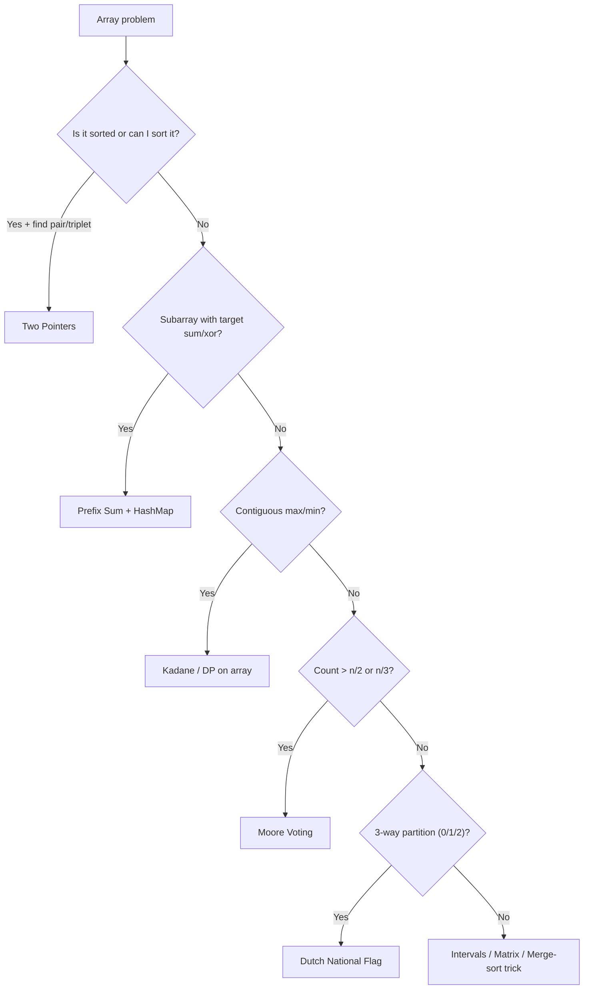
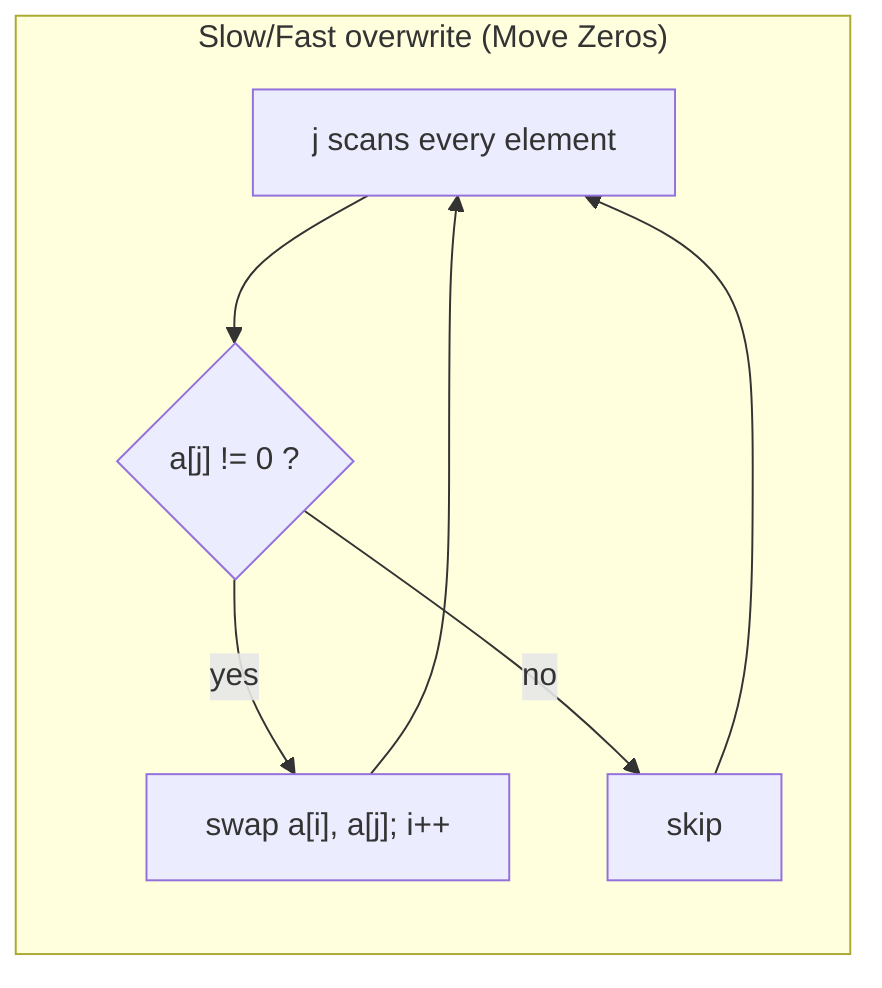
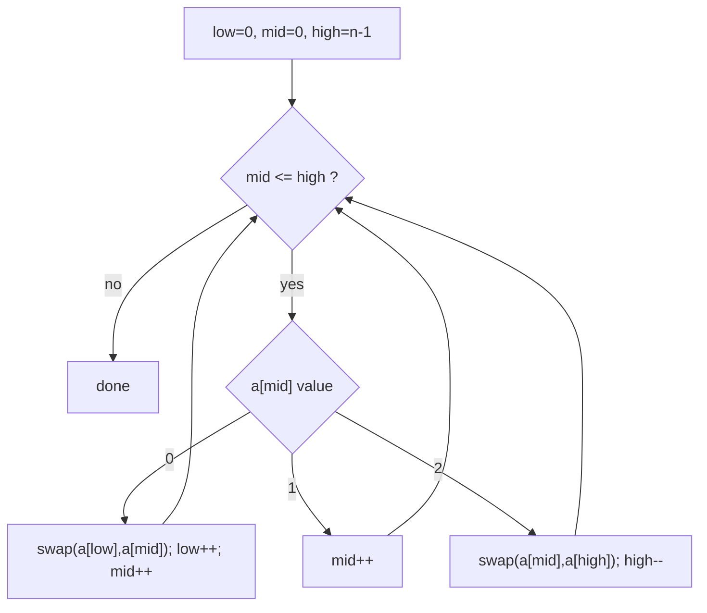
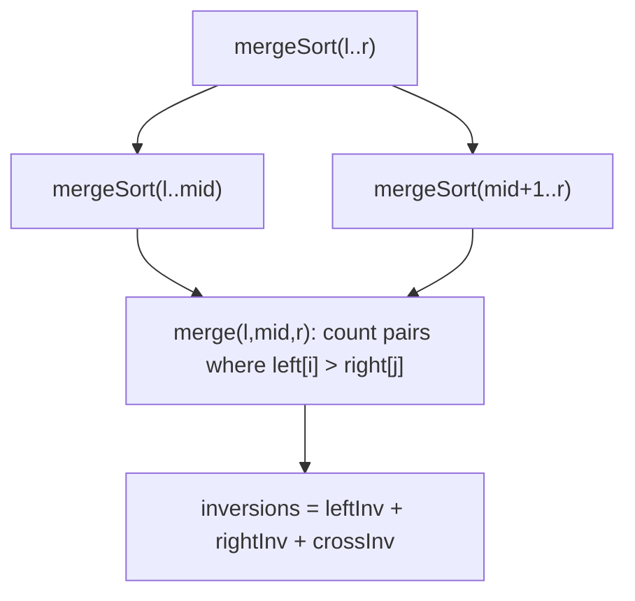

# Step 3: Solve Problems on Arrays [Easy -> Medium -> Hard]

The single most interview-relevant DSA step — master these array patterns (two-pointer, Kadane, Dutch National Flag, prefix sum + hashing, Moore voting, merge intervals, matrix ops) and you cover ~40% of coding-round questions.

**Stats:** 40 problems total — 🟢 14 Easy · 🟡 20 Medium · 🔴 6 Hard *(counts by per-problem difficulty label)*

---

## 📌 Overview & Why It Matters

An **array** is a contiguous block of memory holding elements of the same type, addressable in **O(1)** by index. It is the first data structure every interview leans on, because array questions test exactly what interviewers care about: pointer discipline, off-by-one control, edge-case handling, and the ability to trade time for space.

Where it shows up in interviews:
- **Warm-up screens:** largest element, reverse, rotate, remove duplicates.
- **Core rounds:** two-sum family, subarray sums, Kadane, sorting variants, matrix manipulation.
- **Hard/optimization rounds:** merge without extra space, count inversions, reverse pairs, XOR-subarray counting.

Prerequisites: basic loops & recursion, `sort()`, hash maps/sets, and the merge step of merge sort (needed for inversions / reverse pairs). Everything below builds on those.

The recurring meta-skill is **pattern recognition** — most array problems collapse into one of ~7 templates. This guide organizes all 40 problems under those patterns.

---

## 🧠 Core Concepts

- **Indexing & bounds:** valid indices are `0 … n-1`. Most bugs are off-by-one at the boundaries.
- **In-place vs extra space:** many "optimal" solutions win by using **O(1)** extra space (two-pointer overwrite, swapping, using the array itself as a hash).
- **Prefix sum:** `pre[i] = a[0]+…+a[i]`. Then `sum(l..r) = pre[r] - pre[l-1]`. Combined with a hash map of prefix values → count/length of subarrays with a target sum/xor in O(n).
- **Two pointers:** shrink/expand a window or converge two indices from the ends of a **sorted** array.
- **Invariant-driven partitioning:** Dutch National Flag & Moore voting maintain an invariant across a single pass.
- **Hashing:** trade space for time to get O(1) membership / frequency.



---

## 🔑 Patterns & Approaches

> The data groups problems into three ordered buckets — **Easy**, **Medium**, **Hard**. Each bucket is one `###` pattern-family below, and within it problems are mapped to the specific technique they teach. C++ is used for all templates (aligns with Striver).

---

### 🟩 Easy — Traversal, Two-Pointer Overwrite & Prefix Fundamentals

**When to use / recognition signals:** single-pass scans (max/second-max/search), *in-place* overwrite with a slow/fast pointer (remove duplicates, move zeros), or your first taste of **prefix-sum + hashing** (longest subarray with sum K). If the array is small and the ask is "find/verify/rearrange," a linear scan or a two-pointer overwrite is almost always the intended O(n) answer.

**Approach (the building blocks):**
1. **Single scan trackers** — keep `largest` (and `secondLargest`) while iterating; verify sortedness by checking `a[i-1] <= a[i]`.
2. **Slow/fast overwrite** — a *write pointer* `i` lags behind a *read pointer* `j`; write only the elements you want to keep (unique values, non-zeros), compacting the array in place.
3. **Rotation via reversal** — reverse three ranges to rotate by `k` in O(n)/O(1).
4. **Prefix-sum + hashmap** — for *longest subarray with sum K*, store the earliest index of each running prefix sum; if `pre - K` was seen, the subarray between them sums to K. (For all-positive arrays, a sliding window also works.)

**Recognition for prefix+hash:** "longest / count of subarrays whose sum equals K" with possible negatives ⇒ prefix sum + hashmap; all positives ⇒ sliding window.



**Complexity:** scans & overwrites are **O(n)** time / **O(1)** space; prefix-sum+hashmap is **O(n)** time / **O(n)** space (hash of prefixes).

**Reusable templates:**

```cpp
// (1) Largest & Second Largest in one pass
pair<int,int> firstTwo(vector<int>& a) {
    int large = INT_MIN, second = INT_MIN;
    for (int x : a) {
        if (x > large) { second = large; large = x; }
        else if (x < large && x > second) second = x;
    }
    return {large, second};
}

// (2) Slow/fast overwrite: remove duplicates from a SORTED array
int removeDuplicates(vector<int>& a) {
    int i = 0;                          // last unique write index
    for (int j = 1; j < a.size(); j++)
        if (a[j] != a[i]) a[++i] = a[j];
    return i + 1;                       // new length
}

// (2b) Move all zeros to the end (stable, in-place)
void moveZeros(vector<int>& a) {
    int i = 0;                          // next slot for a non-zero
    for (int j = 0; j < a.size(); j++)
        if (a[j] != 0) swap(a[i++], a[j]);
}

// (3) Rotate left by k using reversal
void leftRotate(vector<int>& a, int k) {
    int n = a.size(); k %= n;
    reverse(a.begin(), a.begin()+k);
    reverse(a.begin()+k, a.end());
    reverse(a.begin(), a.end());
}

// (4) Longest subarray with sum K (handles negatives) — prefix + hashmap
int longestSubarraySumK(vector<int>& a, long long K) {
    unordered_map<long long,int> firstIdx;   // prefixSum -> earliest index
    long long pre = 0; int best = 0;
    for (int i = 0; i < a.size(); i++) {
        pre += a[i];
        if (pre == K) best = i + 1;
        if (firstIdx.count(pre - K)) best = max(best, i - firstIdx[pre - K]);
        if (!firstIdx.count(pre)) firstIdx[pre] = i;   // keep earliest only
    }
    return best;
}

// XOR trick used by "single number" and "missing number"
int singleNumber(vector<int>& a){ int x=0; for(int v:a) x^=v; return x; }
```

**Problems (Easy bucket):**

| # | Problem | Difficulty | Practice |
|---|---------|-----------|----------|
| 1 | Largest Element | 🟢 Easy | [Article](https://takeuforward.org/data-structure/find-the-largest-element-in-an-array/) · [🎥](https://youtu.be/37E9ckMDdTk?t=526) |
| 2 | Second Largest Element | 🟢 Easy | [Article](https://takeuforward.org/data-structure/find-second-smallest-and-second-largest-element-in-an-array/) · [🎥](https://youtu.be/37E9ckMDdTk?t=810) |
| 3 | Check if the Array is Sorted II | 🟢 Easy | [LeetCode](https://leetcode.com/problems/check-if-array-is-sorted-and-rotated/) · [🎥](https://youtu.be/37E9ckMDdTk?t=17224) |
| 4 | Remove duplicates from Sorted array | 🟢 Easy | [LeetCode](https://leetcode.com/problems/remove-duplicates-from-sorted-array/) · [🎥](https://youtu.be/37E9ckMDdTk?t=1887) |
| 5 | Left Rotate Array by One | 🟢 Easy | [LeetCode](https://leetcode.com/problems/rotate-array/) · [🎥](https://youtu.be/wvcQg43_V8U?t=61) |
| 6 | Left Rotate Array by K Places | 🟢 Easy | [LeetCode](https://leetcode.com/problems/rotate-array/) · [🎥](https://youtu.be/wvcQg43_V8U?t=485) |
| 7 | Move Zeros to End | 🟢 Easy | [LeetCode](https://leetcode.com/problems/move-zeroes/) · [🎥](https://youtu.be/wvcQg43_V8U?t=1633) |
| 8 | Linear Search | 🟢 Easy | [Article](https://takeuforward.org/data-structure/linear-search-in-c/) · [🎥](https://youtu.be/wvcQg43_V8U?t=2465) |
| 9 | Union of two sorted arrays | 🟢 Easy | [Article](https://takeuforward.org/data-structure/union-of-two-sorted-arrays/) · [🎥](https://youtu.be/wvcQg43_V8U?t=2584) |
| 10 | Find missing number | 🟢 Easy | [Article](https://www.geeksforgeeks.org/find-the-missing-number/) |
| 11 | Maximum Consecutive Ones | 🟢 Easy | [LeetCode](https://leetcode.com/problems/max-consecutive-ones/) · [🎥](https://youtu.be/bYWLJb3vCWY?t=1124) |
| 12 | Find the number that appears once, and other numbers twice | 🟡 Medium | [LeetCode](https://leetcode.com/problems/single-number/) · [🎥](https://youtu.be/bYWLJb3vCWY?t=1369) |
| 13 | Longest subarray with given sum K (positives) | 🟡 Medium | [Article](https://takeuforward.org/data-structure/longest-subarray-with-given-sum-k/) · [🎥](https://www.youtube.com/watch?v=frf7qxiN2qU) |
| 14 | Longest subarray with sum K (pos & neg) | 🟡 Medium | [Article](https://takeuforward.org/arrays/longest-subarray-with-sum-k-postives-and-negatives) · [🎥](https://youtu.be/frf7qxiN2qU) |

**Edge cases & gotchas:**
- `k %= n` before rotating (k can exceed n); handle `n == 0`.
- "Move zeros" must be **stable** — preserve relative order of non-zeros.
- Missing number: prefer XOR or `n(n+1)/2 - sum` but watch integer **overflow** for large n (use `long long`).
- Longest-subarray-with-sum-K: for the earliest-index map, **do not overwrite** an existing prefix key (earliest index gives the longest span). Sliding window only works when all elements are positive.
- Second largest must be strictly less than largest (skip duplicates of the max).

---

### 🟨 Medium — Two Pointers, Kadane, DNF, Greedy & Matrix Ops

This bucket is the interview core. It mixes several distinct techniques; each is broken out below.

**A. Two-pointer / hashing pair problems** — *Two Sum*, *3 Sum*, *4 Sum* (latter two live in the Hard bucket but use the same skeleton). Recognition: "find a pair/triplet/quad summing to target." Sort, fix outer indices, converge two pointers inward.

**B. Kadane's algorithm (DP on arrays)** — *Maximum Subarray*, *Print the max-sum subarray*, *Best Time to Buy & Sell Stock*, and *Maximum Product Subarray* (Hard bucket). Recognition: "maximum/best **contiguous** subarray value." Carry the best result ending at `i`.

**C. Dutch National Flag** — *Sort Colors (0/1/2)*. Recognition: exactly three categories to partition in one pass, O(1) space.

**D. Moore Voting** — *Majority Element (> n/2)* here, *(> n/3)* in Hard. Recognition: "element appearing more than n/k times."

**E. Greedy / rearrange / permutation** — *Rearrange by sign*, *Next Permutation*, *Leaders in an Array*.

**F. Hashing set** — *Longest Consecutive Sequence*.

**G. Matrix operations** — *Set Matrix Zeroes*, *Rotate by 90°*, *Spiral traversal*.

**H. Prefix + hashmap counting** — *Count subarrays with given sum* (and XOR/zero-sum in Hard).

**Approach highlights:**
- **Kadane:** `cur = max(a[i], cur + a[i]); best = max(best, cur)`. To *print* the subarray, record `start` when `cur` resets and freeze `[ansStart, ansEnd]` when `best` updates.
- **Stock buy/sell:** track running `minPrice`; profit = `max(profit, price - minPrice)`.
- **DNF:** three pointers `low, mid, high`; `0`→swap to low, `1`→advance mid, `2`→swap to high (don't advance mid).
- **Moore (>n/2):** cancel unlike pairs; a single candidate survives, then verify.
- **Next Permutation:** find first `a[i] < a[i+1]` from right (pivot), swap with next-greater to its right, reverse the suffix.
- **Rotate 90° clockwise:** transpose, then reverse each row.
- **Spiral:** shrink four boundaries `top,bottom,left,right`.
- **Longest Consecutive:** put all in a set; start counting only from numbers with no predecessor (`x-1` absent).



**Complexity:** Kadane / DNF / Moore / stock = **O(n)** time, **O(1)** space. Two-pointer 3Sum = **O(n²)**, 4Sum = **O(n³)**. Matrix ops = **O(m·n)** time; optimal Set-Zeroes / Rotate = **O(1)** extra space. Longest Consecutive / count-subarrays = **O(n)** time, **O(n)** space.

**Reusable templates:**

```cpp
// Kadane — max subarray sum (+ optional index tracking)
int kadane(vector<int>& a) {
    int best = a[0], cur = a[0];
    for (int i = 1; i < a.size(); i++) {
        cur = max(a[i], cur + a[i]);
        best = max(best, cur);
    }
    return best;                 // for empty-allowed variant, start best = 0
}

// Dutch National Flag — sort 0s,1s,2s
void sort012(vector<int>& a) {
    int low = 0, mid = 0, high = a.size() - 1;
    while (mid <= high) {
        if (a[mid] == 0)      swap(a[low++], a[mid++]);
        else if (a[mid] == 1) mid++;
        else                  swap(a[mid], a[high--]);
    }
}

// Boyer–Moore majority (> n/2)
int majority(vector<int>& a) {
    int count = 0, cand = 0;
    for (int x : a) {
        if (count == 0) cand = x;
        count += (x == cand) ? 1 : -1;
    }
    return cand;                  // verify with a second pass if not guaranteed
}

// Two Sum on a SORTED array (two pointers)
pair<int,int> twoSumSorted(vector<int>& a, int t) {
    int i = 0, j = a.size() - 1;
    while (i < j) {
        int s = a[i] + a[j];
        if (s == t) return {i, j};
        (s < t) ? i++ : j--;
    }
    return {-1, -1};
}

// Rotate matrix 90° clockwise: transpose then reverse rows
void rotate90(vector<vector<int>>& m) {
    int n = m.size();
    for (int i = 0; i < n; i++)
        for (int j = i + 1; j < n; j++) swap(m[i][j], m[j][i]);
    for (auto& row : m) reverse(row.begin(), row.end());
}

// Count subarrays with sum == K (prefix + hashmap)
int countSubarraySumK(vector<int>& a, int K) {
    unordered_map<int,int> freq{{0,1}};   // empty prefix
    int pre = 0, cnt = 0;
    for (int x : a) {
        pre += x;
        cnt += freq[pre - K];
        freq[pre]++;
    }
    return cnt;
}
```

**Problems (Medium bucket):**

| # | Problem | Difficulty | Practice |
|---|---------|-----------|----------|
| 1 | Two Sum | 🟢 Easy | [LeetCode](https://leetcode.com/problems/two-sum/) · [🎥](https://youtu.be/UXDSeD9mN-k) |
| 2 | Sort an array of 0's 1's and 2's | 🟡 Medium | [LeetCode](https://leetcode.com/problems/sort-colors/) · [🎥](https://youtu.be/tp8JIuCXBaU) |
| 3 | Majority Element-I | 🟢 Easy | [LeetCode](https://leetcode.com/problems/majority-element/) · [🎥](https://youtu.be/nP_ns3uSh80) |
| 4 | Kadane's Algorithm | 🟡 Medium | [LeetCode](https://leetcode.com/problems/maximum-subarray/) · [🎥](https://youtu.be/AHZpyENo7k4) |
| 5 | Print subarray with maximum subarray sum | 🟡 Medium | [Article](https://takeuforward.org/data-structure/kadanes-algorithm-maximum-subarray-sum-in-an-array/) · [🎥](https://youtu.be/AHZpyENo7k4) |
| 6 | Stock Buy and Sell | 🟡 Medium | [LeetCode](https://leetcode.com/problems/best-time-to-buy-and-sell-stock/) · [🎥](https://youtu.be/excAOvwF_Wk) |
| 7 | Rearrange array elements by sign | 🟡 Medium | [LeetCode](https://leetcode.com/problems/rearrange-array-elements-by-sign/) · [🎥](https://youtu.be/h4aBagy4Uok) |
| 8 | Next Permutation | 🟡 Medium | [LeetCode](https://leetcode.com/problems/next-permutation/) · [🎥](https://youtu.be/JDOXKqF60RQ) |
| 9 | Leaders in an Array | 🟡 Medium | [Article](https://takeuforward.org/data-structure/leaders-in-an-array/) · [🎥](https://youtu.be/cHrH9CQ8pmY) |
| 10 | Longest Consecutive Sequence in an Array | 🟡 Medium | [LeetCode](https://leetcode.com/problems/longest-consecutive-sequence/) · [🎥](https://youtu.be/oO5uLE7EUlM) |
| 11 | Set Matrix Zeroes | 🟡 Medium | [LeetCode](https://leetcode.com/problems/set-matrix-zeroes/) · [🎥](https://youtu.be/N0MgLvceX7M) |
| 12 | Rotate matrix by 90 degrees | 🟡 Medium | [LeetCode](https://leetcode.com/problems/rotate-image/) · [🎥](https://youtu.be/Z0R2u6gd3GU) |
| 13 | Print the matrix in spiral manner | 🟡 Medium | [LeetCode](https://leetcode.com/problems/spiral-matrix/) · [🎥](https://youtu.be/3Zv-s9UUrFM) |
| 14 | Count subarrays with given sum | 🟡 Medium | [LeetCode](https://leetcode.com/problems/subarray-sum-equals-k/) · [🎥](https://www.youtube.com/watch?v=xvNwoz-ufXA) |

**Edge cases & gotchas:**
- **Kadane:** if the array can be all-negative and the empty subarray is *not* allowed, initialize `best = a[0]` (not `0`), else you'll wrongly return 0.
- **Max product subarray:** unlike sum, a negative × negative flips sign — track **both** running max and min (or scan prefix & suffix products).
- **DNF:** when swapping the `high` element, **do not** advance `mid` (the swapped-in value is unexamined).
- **Moore:** the raw algorithm assumes a majority exists — always **verify** with a count pass unless guaranteed.
- **Set Matrix Zeroes:** use row 0 / col 0 as markers but handle their own zeroing separately to avoid double-counting.
- **Next Permutation:** the entirely-descending array wraps to fully ascending (smallest) — handle the "no pivot" case.
- **Rearrange by sign (LeetCode variant):** equal positives/negatives, result must start with positive and alternate.
- **Longest Consecutive:** O(n) hinges on starting counts only from sequence heads; naive per-element `while` scanning is O(n²).

---

### 🟥 Hard — Advanced Hashing, Merge-Sort Tricks & Combinatorial Counting

**When to use / recognition signals:** these problems either (a) push earlier patterns to their limit (Moore >n/3, Kadane→product, 2-pointer→3Sum/4Sum), (b) exploit **prefix + hashmap** for zero-sum / XOR-K counting, or (c) require the **merge step of merge sort** to count cross-pairs (inversions, reverse pairs) in O(n log n). Recognition of the merge-sort trick: "count pairs `(i, j)` with `i < j` and some order relation" that would be O(n²) by brute force.

**Approach highlights:**
- **Majority > n/3:** at most **two** such elements — run *two* Moore candidates/counters, then verify both.
- **3Sum / 4Sum:** sort; fix outer index (or two), two-pointer the rest; skip duplicates at every level.
- **Longest subarray with sum 0 / count subarrays with XOR K:** prefix value + hashmap. For XOR: if running xor is `X` and we want subarrays with xor `K`, look up `X ^ K` in the map (since `prefix[i] ^ prefix[j] = K`).
- **Merge Intervals:** sort by start; merge while `next.start <= curEnd`.
- **Merge two sorted arrays, no extra space:** gap method (Shell-sort-like) or swap-and-sort tails.
- **Repeating & missing:** solve two equations (sum & sum-of-squares) or XOR bucketing.
- **Count Inversions / Reverse Pairs:** modified merge sort; count cross-pairs during merge.
- **Max Product Subarray:** track running max & min (sign flips).



**Complexity:** Moore/product/Pascal = **O(n)** (Pascal row-gen O(k)); 3Sum **O(n²)**, 4Sum **O(n³)**; prefix+hash counting **O(n)** time/space; merge intervals **O(n log n)** (sort dominates); inversions/reverse pairs **O(n log n)**; merge-without-space (gap) **O((n+m) log(n+m))**.

**Reusable templates:**

```cpp
// Majority > n/3  (Extended Boyer–Moore, at most two answers)
vector<int> majorityN3(vector<int>& a) {
    int c1 = 0, c2 = 0, n1 = INT_MIN, n2 = INT_MIN;
    for (int x : a) {
        if (x == n1) c1++;
        else if (x == n2) c2++;
        else if (c1 == 0) { n1 = x; c1 = 1; }
        else if (c2 == 0) { n2 = x; c2 = 1; }
        else { c1--; c2--; }
    }
    vector<int> res; c1 = c2 = 0;
    for (int x : a) { if (x == n1) c1++; else if (x == n2) c2++; }
    int t = a.size() / 3;
    if (c1 > t) res.push_back(n1);
    if (c2 > t) res.push_back(n2);
    return res;
}

// Count subarrays with XOR == K  (prefix xor + hashmap)
int countXorK(vector<int>& a, int K) {
    unordered_map<int,int> freq{{0,1}};
    int xr = 0, cnt = 0;
    for (int x : a) {
        xr ^= x;
        cnt += freq[xr ^ K];   // prefix[j] ^ prefix[i] = K
        freq[xr]++;
    }
    return cnt;
}

// Merge overlapping intervals
vector<vector<int>> merge(vector<vector<int>>& iv) {
    sort(iv.begin(), iv.end());
    vector<vector<int>> res;
    for (auto& in : iv) {
        if (res.empty() || res.back()[1] < in[0]) res.push_back(in);
        else res.back()[1] = max(res.back()[1], in[1]);
    }
    return res;
}

// Count inversions via merge sort
long long merge(vector<int>& a, int l, int m, int r) {
    vector<int> tmp; int i = l, j = m + 1; long long inv = 0;
    while (i <= m && j <= r) {
        if (a[i] <= a[j]) tmp.push_back(a[i++]);
        else { tmp.push_back(a[j++]); inv += (m - i + 1); }   // a[i..m] > a[j]
    }
    while (i <= m) tmp.push_back(a[i++]);
    while (j <= r) tmp.push_back(a[j++]);
    for (int k = l; k <= r; k++) a[k] = tmp[k - l];
    return inv;
}
long long msort(vector<int>& a, int l, int r) {
    if (l >= r) return 0;
    int m = (l + r) / 2;
    return msort(a, l, m) + msort(a, m + 1, r) + merge(a, l, m, r);
}

// 3Sum (unique triplets summing to 0)
vector<vector<int>> threeSum(vector<int>& a) {
    sort(a.begin(), a.end());
    vector<vector<int>> res; int n = a.size();
    for (int i = 0; i < n - 2; i++) {
        if (i && a[i] == a[i-1]) continue;
        int l = i + 1, r = n - 1;
        while (l < r) {
            int s = a[i] + a[l] + a[r];
            if (s == 0) {
                res.push_back({a[i], a[l], a[r]});
                while (l < r && a[l] == a[l+1]) l++;
                while (l < r && a[r] == a[r-1]) r--;
                l++; r--;
            } else if (s < 0) l++; else r--;
        }
    }
    return res;
}
```

**Problems (Hard bucket):**

| # | Problem | Difficulty | Practice |
|---|---------|-----------|----------|
| 1 | Pascal's Triangle I | 🟢 Easy | [LeetCode](https://leetcode.com/problems/pascals-triangle/) · [🎥](https://youtu.be/bR7mQgwQ_o8) |
| 2 | Majority Element-II | 🔴 Hard | [LeetCode](https://leetcode.com/problems/majority-element-ii/) · [🎥](https://youtu.be/vwZj1K0e9U8) |
| 3 | 3 Sum | 🟡 Medium | [LeetCode](https://leetcode.com/problems/3sum/) · [🎥](https://youtu.be/DhFh8Kw7ymk) |
| 4 | 4 Sum | 🟡 Medium | [LeetCode](https://leetcode.com/problems/4sum/) · [🎥](https://youtu.be/eD95WRfh81c) |
| 5 | Largest Subarray with Sum 0 | 🟡 Medium | [Article](https://takeuforward.org/data-structure/length-of-the-longest-subarray-with-zero-sum/) · [🎥](https://www.youtube.com/watch?v=xmguZ6GbatA) |
| 6 | Count subarrays with given xor K | 🔴 Hard | [Article](https://takeuforward.org/data-structure/count-the-number-of-subarrays-with-given-xor-k/) · [🎥](https://youtu.be/eZr-6p0B7ME) |
| 7 | Merge Overlapping Subintervals | 🟡 Medium | [LeetCode](https://leetcode.com/problems/merge-intervals/) · [🎥](https://youtu.be/IexN60k62jo) |
| 8 | Merge two sorted arrays without extra space | 🟡 Medium | [LeetCode](https://leetcode.com/problems/merge-sorted-array/) · [🎥](https://youtu.be/n7uwj04E0I4) |
| 9 | Find the repeating and missing number | 🔴 Hard | [Article](https://takeuforward.org/data-structure/find-the-repeating-and-missing-numbers/) · [🎥](https://youtu.be/2D0D8HE6uak) |
| 10 | Count Inversions | 🔴 Hard | [Article](https://takeuforward.org/data-structure/count-inversions-in-an-array) · [🎥](https://youtu.be/AseUmwVNaoY) |
| 11 | Reverse Pairs | 🔴 Hard | [LeetCode](https://leetcode.com/problems/reverse-pairs/) · [🎥](https://youtu.be/0e4bZaP3MDI) |
| 12 | Maximum Product Subarray in an Array | 🔴 Hard | [LeetCode](https://leetcode.com/problems/maximum-product-subarray/) |

**Edge cases & gotchas:**
- **Majority >n/3:** the two-counter update order matters — check `== n1`/`== n2` *before* the `count==0` branches, and always verify.
- **XOR-K / zero-sum:** seed the map with `{0:1}` (or prefix 0 at index -1) so subarrays starting at index 0 are counted.
- **Reverse Pairs:** the *counting* step (`a[i] > 2*a[j]`) must be done in a **separate loop before** the standard merge, using `long long` to avoid `2*a[j]` overflow.
- **Merge without extra space (gap method):** initial gap = `ceil((n+m)/2)`, then halve; stop after gap becomes 0.
- **Repeating & missing:** use `long long` for sum-of-squares; guard against overflow.
- **4Sum:** target may be non-zero; use `long long` when summing four ints.
- **Pascal's Triangle:** row `r` value at `c` = `C(r,c)`; generate iteratively `val = val * (r - c) / (c + 1)`.

---

## ❓ Regularly Asked Interview Questions

**Q: What is the time complexity of accessing, searching, inserting, and deleting in an array?**
**A:** Access by index O(1); search O(n) unsorted / O(log n) if sorted (binary search); insert/delete at end O(1) amortized, at arbitrary position O(n) due to shifting.

**Q: How does Kadane's algorithm work, and why is it correct?**
**A:** It maintains `cur` = best sum of a subarray ending at index `i`. At each step you either extend the previous subarray (`cur + a[i]`) or start fresh at `a[i]` — whichever is larger — because a negative running sum can only hurt future sums. The global `best` tracks the max over all endings. O(n)/O(1).

**Q: Kadane works for max *sum* subarray; why can't you use it directly for max *product* subarray?**
**A:** Multiplication by a negative flips a large positive into a large negative and vice-versa, so the current max isn't a simple function of the previous max. You must also track the running **minimum** (most negative) product — a future negative can turn it into the maximum. Alternatively scan prefix and suffix products.

**Q: Explain the Boyer–Moore Voting algorithm. What's its key assumption?**
**A:** Keep a candidate and a counter; increment on a match, decrement otherwise, and switch candidate when the counter hits 0. Non-majority elements cancel out majority ones, so the true majority (>n/2) survives. Key assumption: a majority element exists — otherwise you must verify with a second counting pass. For >n/3, run two independent candidate/counter pairs.

**Q: Walk me through the Dutch National Flag algorithm.**
**A:** Three pointers partition the array into `[0..low)`=0s, `[low..mid)`=1s, `(high..end]`=2s. Scan `mid`: a 0 swaps into the low region (advance both low and mid), a 1 just advances mid, a 2 swaps into the high region (only decrement high, keep mid since the swapped value is unseen). One pass, O(1) space.

**Q: How do you count/find subarrays with a given sum K when negatives are allowed?**
**A:** Prefix sums + hashmap. Running prefix `pre`; a subarray `(i, j]` sums to K iff `pre[j] - pre[i] = K`, i.e., `pre[i] = pre - K`. Store frequency (for count) or earliest index (for longest length) of each prefix, seeding `{0:1}`/`{0:-1}`. O(n).

**Q: How is counting subarrays with XOR = K similar?**
**A:** Same prefix idea with XOR: `prefix[j] ^ prefix[i] = K` ⇒ look up `prefix ^ K` in the frequency map. Seed `{0:1}`.

**Q: How would you rotate an n×n matrix 90° clockwise in place?**
**A:** Transpose it (swap `m[i][j]` with `m[j][i]` for `j>i`), then reverse each row. For counter-clockwise, transpose then reverse each column (or reverse rows first). O(n²) time, O(1) space.

**Q: Set Matrix Zeroes in O(1) extra space?**
**A:** Use the first row and first column as marker arrays. Track separately whether row 0 / col 0 themselves need zeroing (since `matrix[0][0]` is shared). First pass marks, second pass zeroes based on markers, then handle row 0 and col 0.

**Q: How do you count inversions in an array efficiently?**
**A:** Modified merge sort. During the merge of two sorted halves, when a right-half element is placed before remaining left-half elements, all those `(m - i + 1)` remaining left elements form inversions with it. Sum across all merges → O(n log n).

**Q: What is the difference between counting inversions and reverse pairs?**
**A:** Inversions count `i<j` with `a[i] > a[j]`; reverse pairs count `i<j` with `a[i] > 2*a[j]`. Reverse pairs need a **separate counting loop** before merging (the `2*` breaks the direct merge counting) and `long long` to avoid overflow.

**Q: How do you find the repeating and missing number in [1..n]?**
**A:** Two equations: let S=sum, S2=sum of squares of the array; expected `Sn=n(n+1)/2`, `S2n=n(n+1)(2n+1)/6`. Then `x - y = S - Sn` and `x² - y² = S2 - S2n` ⇒ solve for repeating `x` and missing `y`. O(n)/O(1). (XOR bucketing is an alternative.)

**Q: How would you merge two sorted arrays without extra space?**
**A:** Gap method: start with gap = ceil((n+m)/2), compare elements gap apart across both arrays treated as one virtual array, swap if out of order, halve the gap each round until it becomes 0. O((n+m) log(n+m)) time, O(1) space.

**Q: When do you pick two-pointer over hashing for pair-sum problems?**
**A:** Two-pointer needs a **sorted** array and gives O(1) space but O(n log n) if you must sort. Hashing works on unsorted input in O(n) time but O(n) space and doesn't naturally handle "closest pair"/ordering constraints. For 3Sum/4Sum, sorting + two-pointer also makes duplicate-skipping clean.

---

## 💡 Interview Tips & Common Mistakes

- **State the brute force first, then optimize.** Interviewers want to see the progression (e.g., O(n²) → prefix+hash O(n)).
- **Off-by-one is the #1 array bug.** Say your loop bounds out loud and dry-run a size-1 and size-2 example.
- **Overflow:** use `long long` for sums, products, `2*a[j]`, and sum-of-squares. Very common trap in count-inversions / reverse-pairs / repeating-missing.
- **Kadane initialization:** start `best = a[0]` (not 0) unless the empty subarray is allowed.
- **DNF:** never advance `mid` after swapping with `high`.
- **Moore voting:** always verify unless a majority is guaranteed; use two counters for >n/3.
- **Prefix-hash maps:** remember to seed `{0:1}` (count) or `{0:-1}` (index); for *longest* keep the **earliest** prefix index, for *count* keep frequency.
- **In-place claims:** if you promise O(1) space, don't secretly allocate an auxiliary array (a frequent mismatch on Set-Matrix-Zeroes and merge-without-space).
- **Duplicate handling** in 3Sum/4Sum: skip duplicates at each pointer level to avoid repeated tuples.
- **Clarify constraints early:** value ranges (negatives? size of n?), duplicates allowed?, is the array sorted?, is empty subarray valid? These change the algorithm.

---

## 🐟 Revision Cheat-Sheet

| Pattern | Key Idea | Time | Space | Signature Problem |
|---------|----------|------|-------|-------------------|
| Two Pointers | Converge from ends of sorted array | O(n) / O(n²)-O(n³) for 3/4Sum | O(1) | 3 Sum |
| Slow/Fast Overwrite | Write pointer compacts in place | O(n) | O(1) | Move Zeros / Remove Duplicates |
| Kadane (DP) | Best subarray ending at i | O(n) | O(1) | Maximum Subarray |
| Kadane (product) | Track running max **and** min | O(n) | O(1) | Maximum Product Subarray |
| Dutch National Flag | 3-way partition, one pass | O(n) | O(1) | Sort Colors (0/1/2) |
| Moore Voting | Cancel unlike pairs; verify | O(n) | O(1) | Majority Element I / II |
| Prefix Sum + Hash | `pre[j]-pre[i]=K` (or XOR) | O(n) | O(n) | Subarray Sum / XOR = K |
| Merge Intervals | Sort by start, merge overlaps | O(n log n) | O(n) | Merge Intervals |
| Merge-Sort Counting | Count cross-pairs during merge | O(n log n) | O(n) | Count Inversions / Reverse Pairs |
| Matrix Ops | Transpose+reverse / boundary shrink | O(m·n) | O(1) | Rotate Image / Spiral Matrix |
| Hashing Set | O(1) membership for sequences | O(n) | O(n) | Longest Consecutive Sequence |
| Greedy/Permutation | Local rule → global order | O(n) | O(1) | Next Permutation |

---

## 🔗 References & Further Reading

- **Striver A2Z — Step 3 (Arrays):** https://takeuforward.org/strivers-a2z-dsa-course/strivers-a2z-dsa-course-sheet-2/
- **Maximum Subarray (Kadane) — Wikipedia:** https://en.wikipedia.org/wiki/Maximum_subarray_problem
- **Kadane's Algorithm — GeeksforGeeks:** https://www.geeksforgeeks.org/largest-sum-contiguous-subarray/
- **Prefix Sum Array — GeeksforGeeks:** https://www.geeksforgeeks.org/prefix-sum-array-implementation-applications-competitive-programming/
- **Dutch National Flag Problem — GeeksforGeeks:** https://www.geeksforgeeks.org/dsa/dutch-national-flag-problem-in-python/
- **Boyer–Moore Majority Voting — GeeksforGeeks:** https://www.geeksforgeeks.org/theory-of-computation/boyer-moore-majority-voting-algorithm/
- **Commonly Asked Array Interview Questions — GeeksforGeeks:** https://geeksforgeeks.org/commonly-asked-data-structure-interview-questions-on-array
- **Array Data Structure Interview Questions — Devinterview.io:** https://github.com/Devinterview-io/array-data-structure-interview-questions
- **Sort an Array of 0s,1s,2s — GeeksforGeeks:** https://www.geeksforgeeks.org/sort-an-array-of-0s-1s-and-2s/
