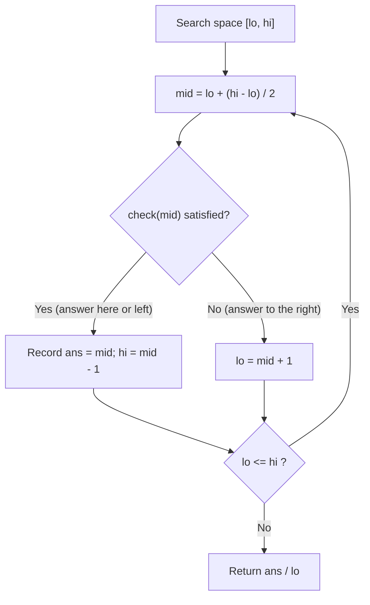
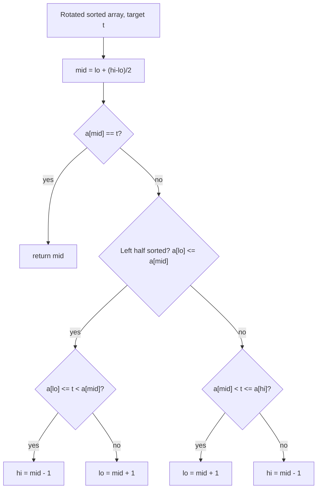
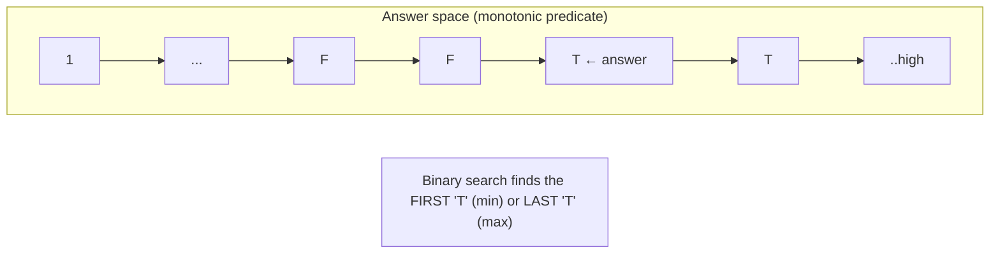
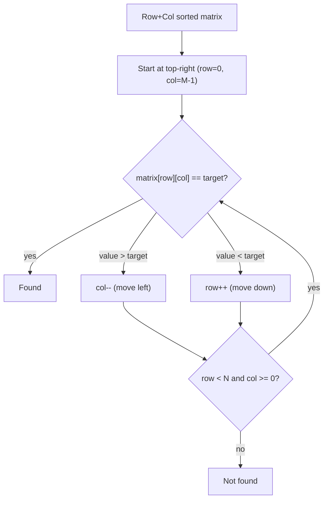

# Step 4: Binary Search [1D, 2D Arrays, Search Space]

> Master the O(log N) search paradigm — from the classic template, to `lower_bound`/`upper_bound`, to the interview-favourite "**Binary Search on the Answer**", and finally 2D matrices.

**📊 Stats:** 32 problems total — 🟢 10 Easy · 🟡 14 Medium · 🔴 8 Hard · across **3 patterns**.

---

## 📌 Overview & Why It Matters

**Binary Search (BS)** repeatedly halves a **monotonic search space** until it converges on the answer. Any problem where the search space can be split into a "no" region and a "yes" region (a boolean predicate that flips exactly once) is a binary-search problem — the array need not even be explicitly sorted.

**Where it shows up in interviews:**
- FAANG/SDE rounds love BS because it turns O(N) or O(N²) brute force into O(log N) / O(N log N). Amazon reportedly uses it in ~40% of coding rounds.
- The hardest and most discriminating variant — **"BS on the answer"** — is what Google/Meta test at SDE-2 level. It's rarely spotted by candidates, which is exactly why it's asked.
- Common wrappers: rotated arrays, matrices, "minimize the maximum / maximize the minimum" optimization.

**Prerequisites:** arrays, sorting, understanding of `mid` overflow, and the notion of a **monotonic predicate** `f(x)` that is `false...false true...true` (or the reverse).

**The golden rule:** *If you can phrase the problem as "find the smallest/largest `x` such that `check(x)` is true", and `check` is monotonic, it's binary search.*

---

## 🧠 Core Concepts

- **Search space** — the range of candidate answers `[lo, hi]`. In classic BS it's array indices; in "BS on answer" it's the *value* range of the answer.
- **Monotonicity / predicate** — a function `check(mid)` returning a boolean that is **false for a prefix then true for a suffix** (or vice-versa). BS finds the boundary.
- **`mid` computation** — always `mid = lo + (hi - lo) / 2` to avoid integer overflow.
- **Invariant discipline** — decide *before coding* whether your interval is inclusive `[lo, hi]` or half-open `[lo, hi)`, and never mix them.
- **Lower bound** — first index with `arr[i] >= x`. **Upper bound** — first index with `arr[i] > x`. These two primitives solve a huge fraction of BS problems.



**Overflow-safe canonical BS (C++):**

```cpp
int binarySearch(vector<int>& a, int target) {
    int lo = 0, hi = (int)a.size() - 1;
    while (lo <= hi) {
        int mid = lo + (hi - lo) / 2;
        if (a[mid] == target) return mid;
        else if (a[mid] < target) lo = mid + 1;
        else hi = mid - 1;
    }
    return -1; // not found
}
```

---

## 🔑 Patterns & Approaches

### 1. BS on 1D Arrays

**When to use it / recognition signals**
- Input is **sorted** (or can be treated as monotonic) and you need to *find an element*, *find a boundary* (first/last occurrence, floor/ceil, insert position), or exploit structure (rotated array, peak, single element).
- Keywords: "sorted array", "O(log n) required", "rotated", "first/last position", "peak".

**The approach/algorithm**
1. **Exact search**: standard template above.
2. **Lower/Upper bound**: search for a *boundary* using a `[lo, hi)` half-open interval; shrink `hi = mid` when the predicate holds, else `lo = mid + 1`.
3. **Rotated arrays**: at each step one half is sorted — check which half is sorted, then decide if the target lies within it.
4. **Peak / single element**: compare `mid` to its neighbour to decide which half is guaranteed to contain the answer (uses the *shape* of the array, not sortedness).



**Complexity:** Time **O(log N)**, Space **O(1)** — each step halves the search space. (Rotated-II worst case degrades to O(N) when duplicates make halves indistinguishable.)

**Reusable template — lower/upper bound:**

```cpp
// First index i with a[i] >= x  (lower_bound)
int lowerBound(vector<int>& a, int x) {
    int lo = 0, hi = a.size(); // half-open [lo, hi)
    while (lo < hi) {
        int mid = lo + (hi - lo) / 2;
        if (a[mid] >= x) hi = mid;   // condition true -> go left
        else             lo = mid + 1;
    }
    return lo; // == a.size() if no such element
}

// First index i with a[i] > x  (upper_bound): use a[mid] > x
// floor  = lowerBound(x+1)-1 style / largest a[i] <= x
// ceil   = lowerBound(x)  (first a[i] >= x)
// countOccurrences(x) = upperBound(x) - lowerBound(x)
// searchInsertPosition(x) = lowerBound(x)
```

**Edge cases & gotchas**
- Off-by-one between `lower_bound` (`>=`) and `upper_bound` (`>`) — memorize the single character difference.
- Empty array; target smaller than all / larger than all elements.
- Rotated arrays with **duplicates** (II): when `a[lo] == a[mid] == a[hi]`, you can't tell which side is sorted — shrink both ends (`lo++, hi--`).
- Peak element: use sentinels `a[-1] = a[n] = -∞` conceptually; never index out of bounds.

| # | Problem | Difficulty | Practice |
|---|---------|-----------|----------|
| 1 | Search X in sorted array | 🟢 Easy | [LeetCode](https://leetcode.com/problems/binary-search/) · [🎥](https://youtu.be/MHf6awe89xw) |
| 2 | Lower Bound | 🟢 Easy | [Article](https://takeuforward.org/arrays/implement-lower-bound-bs-2/) · [🎥](https://youtu.be/6zhGS79oQ4k) |
| 3 | Upper Bound | 🟢 Easy | [Article](https://takeuforward.org/arrays/implement-upper-bound/) · [🎥](https://youtu.be/6zhGS79oQ4k) |
| 4 | Search Insert Position | 🟢 Easy | [LeetCode](https://leetcode.com/problems/search-insert-position/) · [🎥](https://youtu.be/6zhGS79oQ4k) |
| 5 | Floor and Ceil in Sorted Array | 🟢 Easy | [Article](https://takeuforward.org/arrays/floor-and-ceil-in-sorted-array/) · [🎥](https://www.youtube.com/watch?v=6zhGS79oQ4k) |
| 6 | First and Last Occurrence | 🟢 Easy | [LeetCode](https://leetcode.com/problems/find-first-and-last-position-of-element-in-sorted-array/) · [🎥](https://youtu.be/hjR1IYVx9lY) |
| 7 | Count Occurrences in a Sorted Array | 🟢 Easy | [Article](https://takeuforward.org/data-structure/count-occurrences-in-sorted-array/) · [🎥](https://youtu.be/hjR1IYVx9lY) |
| 8 | Search in Rotated Sorted Array I | 🟡 Medium | [LeetCode](https://leetcode.com/problems/search-in-rotated-sorted-array/) · [🎥](https://www.youtube.com/watch?v=r3pMQ8-Ad5s) |
| 9 | Search in Rotated Sorted Array II | 🟡 Medium | [LeetCode](https://leetcode.com/problems/search-in-rotated-sorted-array-ii/) · [🎥](https://youtu.be/w2G2W8l__pc) |
| 10 | Find Minimum in Rotated Sorted Array | 🟢 Easy | [LeetCode](https://leetcode.com/problems/find-minimum-in-rotated-sorted-array/) · [🎥](https://youtu.be/nhEMDKMB44g) |
| 11 | Find how many times the array is rotated | 🟢 Easy | [Article](https://takeuforward.org/arrays/find-out-how-many-times-the-array-has-been-rotated/) · [🎥](https://youtu.be/jtSiWTPLwd0) |
| 12 | Single Element in a Sorted Array | 🟡 Medium | [LeetCode](https://leetcode.com/problems/single-element-in-a-sorted-array/) · [🎥](https://youtu.be/AZOmHuHadxQ) |
| 13 | Find Peak Element | 🟡 Medium | [LeetCode](https://leetcode.com/problems/find-peak-element/) · [🎥](https://youtu.be/cXxmbemS6XM) |

---

### 2. BS on Answers (Search Space) ⭐

**When to use it / recognition signals** — *the most important pattern in this step.*
- The problem asks to **minimize a maximum** or **maximize a minimum**, or find the *smallest/largest value* satisfying some feasibility condition.
- The array itself is **not** what you binary-search; instead you binary-search over the **range of possible answers** `[low, high]`.
- Tell-tale phrases: *"minimum capacity"*, *"minimum days"*, *"smallest divisor"*, *"minimum eating speed"*, *"maximize the minimum distance"*, *"allocate ... to minimize the maximum"*.
- **The litmus test:** define a boolean `possible(x)` = "can we achieve the goal if the answer is `x`?". If `possible` is **monotonic** (once true, stays true — or once false, stays false), binary-search `x`.

**The approach/algorithm**
1. Identify the **answer range** `[low, high]` (e.g., min value..max value, 1..sum).
2. Write a **feasibility/predicate** function `check(mid)` that greedily tests whether `mid` works — usually O(N).
3. Binary-search the *smallest* `mid` for which `check(mid)` is true (minimization) — or the largest true (maximization; flip the shrink direction).
4. The boundary is your answer.



**Complexity:** Time **O(N · log(range))** — `log(range)` BS iterations, each calling an O(N) `check`. Space **O(1)**.

**Reusable template — minimize x such that check(x) is true:**

```cpp
// Returns smallest x in [low, high] with check(x) == true. Assumes monotonic.
int bsOnAnswer(int low, int high, function<bool(int)> check) {
    int ans = high;                 // fallback = largest candidate
    while (low <= high) {
        int mid = low + (high - low) / 2;
        if (check(mid)) {           // feasible -> try smaller
            ans = mid;
            high = mid - 1;
        } else {                    // infeasible -> need larger
            low = mid + 1;
        }
    }
    return ans;
}

// Example — Koko eating bananas:
//   low = 1, high = max(piles)
//   check(speed) = (sum of ceil(pile/speed) for all piles) <= h
// Example — Ship packages in D days:
//   low = max(weights), high = sum(weights)
//   check(cap) = (days needed with capacity cap) <= D
// Example — Aggressive Cows (MAXIMIZE min distance):
//   low = 1, high = max-min; check(d) = canPlace(k cows >= d apart)
//   here we KEEP the largest feasible: if check -> ans=mid, low=mid+1
```

**Edge cases & gotchas**
- Getting `low`/`high` bounds wrong (too tight → miss answer; too loose → still correct but slower). When unsure, use generous bounds.
- **Direction of shrink** flips between "minimize" and "maximize". Aggressive Cows / Gas Stations *maximize*; Koko / Ship / Book Allocation *minimize*.
- `check` must be **monotonic** — verify it before applying BS.
- Overflow in `sum`/`high` for large arrays → use `long long`.
- **Book Allocation / Painter / Split Array** are the *same* problem: minimize the maximum subarray sum with K partitions. Answer range `[max(arr), sum(arr)]`. Return -1 if `K > n`.
- **Gas station** & **Nth root/sqrt** need floating-point BS (iterate fixed times or until `hi - lo < eps`).
- **Median of two sorted arrays** & **Kth element** use a *partition* BS on the smaller array, not the answer-value template.

| # | Problem | Difficulty | Practice |
|---|---------|-----------|----------|
| 1 | Find square root of a number | 🟡 Medium | [Article](https://takeuforward.org/binary-search/finding-sqrt-of-a-number-using-binary-search/) · [🎥](https://youtu.be/Bsv3FPUX_BA) |
| 2 | Find Nth root of a number | 🟡 Medium | [Article](https://takeuforward.org/data-structure/nth-root-of-a-number-using-binary-search/) · [🎥](https://www.youtube.com/watch?v=WjpswYrS2nY) |
| 3 | Koko Eating Bananas | 🟡 Medium | [LeetCode](https://leetcode.com/problems/koko-eating-bananas/) · [🎥](https://youtu.be/qyfekrNni90) |
| 4 | Minimum days to make M bouquets | 🟡 Medium | [LeetCode](https://leetcode.com/problems/minimum-number-of-days-to-make-m-bouquets/) · [🎥](https://youtu.be/TXAuxeYBTdg) |
| 5 | Find the smallest divisor | 🟡 Medium | [LeetCode](https://leetcode.com/problems/find-the-smallest-divisor-given-a-threshold/) · [🎥](https://youtu.be/UvBKTVaG6U8) |
| 6 | Capacity to Ship Packages Within D Days | 🟡 Medium | [LeetCode](https://leetcode.com/problems/capacity-to-ship-packages-within-d-days/) · [🎥](https://youtu.be/MG-Ac4TAvTY) |
| 7 | Kth Missing Positive Number | 🟡 Medium | [LeetCode](https://leetcode.com/problems/kth-missing-positive-number/) · [🎥](https://youtu.be/uZ0N_hZpyps) |
| 8 | Aggressive Cows | 🔴 Hard | [Article](https://takeuforward.org/data-structure/aggressive-cows-detailed-solution/) · [🎥](https://youtu.be/R_Mfw4ew-Vo) |
| 9 | Book Allocation Problem | 🔴 Hard | [Article](https://takeuforward.org/data-structure/allocate-minimum-number-of-pages/) · [🎥](https://www.youtube.com/watch?v=gYmWHvRHu-s) |
| 10 | Split Array — Largest Sum | 🔴 Hard | [LeetCode](https://leetcode.com/problems/split-array-largest-sum/) · [🎥](https://www.youtube.com/watch?v=thUd_WJn6wk) |
| 11 | Painter's Partition | 🟡 Medium | [Article](https://takeuforward.org/arrays/painters-partition-problem/) · [🎥](https://www.youtube.com/watch?v=thUd_WJn6wk) |
| 12 | Minimize Max Distance to Gas Station | 🔴 Hard | [LeetCode](https://leetcode.com/problems/minimize-max-distance-to-gas-station/) · [🎥](https://www.youtube.com/watch?v=kMSBvlZ-_HA) |
| 13 | Median of 2 Sorted Arrays | 🔴 Hard | [LeetCode](https://leetcode.com/problems/median-of-two-sorted-arrays/) · [🎥](https://www.youtube.com/watch?v=NTop3VTjmxk) |
| 14 | Kth Element of 2 Sorted Arrays | 🟡 Medium | [Article](https://takeuforward.org/data-structure/k-th-element-of-two-sorted-arrays/) · [🎥](https://youtu.be/D1oDwWCq50g) |

---

### 3. BS on 2D Arrays

**When to use it / recognition signals**
- A matrix with **sorted structure**: fully sorted (flatten to 1D), row-wise + column-wise sorted, or "find peak in 2D".
- Need better than O(N·M) — target O(log(N·M)) or O(N + M) or O(N log M).

**The approach/algorithm**
1. **Fully sorted matrix (row-major sorted)** → treat as a 1D array of length `N*M`; map index `idx → (idx / M, idx % M)`; run standard BS.
2. **Row & column sorted (Search II)** → start at **top-right** corner: if too big move left, if too small move down → O(N + M). (Staircase search.)
3. **Find row with max 1's** → each row sorted; `lower_bound` of `1` per row → O(N log M).
4. **Peak Element II** → binary-search on **columns**; in the mid column pick the row of the global max, then move toward the larger horizontal neighbour → O(N log M).
5. **Matrix Median** → BS on the **value range** `[min, max]`; `check(x)` = count of elements ≤ x across rows (each via `upper_bound`) ≥ (N*M+1)/2 → O(N log M · log(range)). (This is BS-on-answer applied to 2D!)



**Complexity:** varies by sub-type — Fully sorted **O(log(N·M))**; Staircase **O(N + M)**; Peak II / row-max **O(N log M)**; Matrix Median **O(N log M · log(maxVal))**. Space **O(1)**.

**Reusable template — search fully-sorted matrix as 1D:**

```cpp
bool searchMatrix(vector<vector<int>>& mat, int target) {
    int n = mat.size(), m = mat[0].size();
    int lo = 0, hi = n * m - 1;
    while (lo <= hi) {
        int mid = lo + (hi - lo) / 2;
        int val = mat[mid / m][mid % m];   // map 1D index -> 2D
        if (val == target) return true;
        else if (val < target) lo = mid + 1;
        else hi = mid - 1;
    }
    return false;
}

// Row & column sorted (staircase, O(N+M)):
bool searchMatrixII(vector<vector<int>>& mat, int target) {
    int r = 0, c = mat[0].size() - 1;
    while (r < (int)mat.size() && c >= 0) {
        if (mat[r][c] == target) return true;
        else if (mat[r][c] > target) c--;
        else r++;
    }
    return false;
}
```

**Edge cases & gotchas**
- **Search-2D-I vs II are different matrices** — I is fully sorted (BS as 1D works); II is only row & column sorted (staircase, BS-as-1D would be *wrong*).
- Index mapping `idx/m` and `idx%m` — use `m` (columns), not `n`.
- Peak II: never step out of the grid; handle single row/column.
- Matrix Median: total elements is odd by problem constraint; count "≤ x" not "< x".

| # | Problem | Difficulty | Practice |
|---|---------|-----------|----------|
| 1 | Find row with maximum 1's | 🟢 Easy | [Article](https://takeuforward.org/arrays/find-the-row-with-maximum-number-of-1s/) · [🎥](https://youtu.be/SCz-1TtYxDI) |
| 2 | Search in a 2D Matrix | 🔴 Hard | [LeetCode](https://leetcode.com/problems/search-a-2d-matrix/) · [🎥](https://youtu.be/ZYpYur0znng) |
| 3 | Search in 2D Matrix II | 🔴 Hard | [LeetCode](https://leetcode.com/problems/search-a-2d-matrix-ii/) · [🎥](https://youtu.be/9ZbB397jU4k) |
| 4 | Find Peak Element II | 🟡 Medium | [LeetCode](https://leetcode.com/problems/find-a-peak-element-ii/) · [🎥](https://youtu.be/nGGp5XBzC4g) |
| 5 | Matrix Median | 🔴 Hard | [Article](https://takeuforward.org/data-structure/median-of-row-wise-sorted-matrix/) · [🎥](https://youtu.be/Q9wXgdxJq48) |

---

## ❓ Regularly Asked Interview Questions

**Q: What are the exact preconditions for binary search?**
**A:** A **monotonic** search space — either a sorted array, or a predicate `check(x)` that flips from false→true (or true→false) exactly once. Sortedness is sufficient but not necessary; monotonicity of the decision boundary is the real requirement.

**Q: Why compute `mid = lo + (hi - lo) / 2` instead of `(lo + hi) / 2`?**
**A:** To avoid integer overflow when `lo + hi` exceeds `INT_MAX`. The subtractive form keeps the intermediate value within range.

**Q: What's the difference between `lower_bound` and `upper_bound`?**
**A:** `lower_bound(x)` = first index with `a[i] >= x`; `upper_bound(x)` = first index with `a[i] > x`. The only code difference is `>=` vs `>`. `count(x) = upper_bound(x) - lower_bound(x)`; `insertPos = lower_bound(x)`; `ceil = lower_bound(x)`; `floor = lower_bound(x)-1`-ish (first `<= x` from the right).

**Q: How do you recognise a "binary search on the answer" problem?**
**A:** It asks to minimize a maximum / maximize a minimum, or find the smallest/largest value meeting a feasibility condition — and you can write a monotonic `check(x)`. If brute force would try every candidate answer and the "works/doesn't work" flips once, binary-search the candidate.

**Q: How would you approach Koko Eating Bananas?**
**A:** Binary-search the eating **speed** in `[1, max(piles)]`. `check(speed)` = total hours `Σ ceil(pile/speed) <= h`. It's monotonic (higher speed → fewer hours), so find the smallest feasible speed. O(N log maxPile).

**Q: Book Allocation, Split Array Largest Sum, and Painter's Partition — how are they related?**
**A:** They are the same problem: partition the array into K contiguous groups minimizing the maximum group sum. BS the answer in `[max(arr), sum(arr)]`; `check(cap)` = number of partitions needed with cap ≤ K. Return -1 if K > n.

**Q: How do you search a rotated sorted array in O(log n)?**
**A:** At each step, one half `[lo..mid]` or `[mid..hi]` is guaranteed sorted. Detect the sorted half (`a[lo] <= a[mid]`), check if the target lies within its range; if yes recurse there, else the other half. With duplicates (II), when `a[lo]==a[mid]==a[hi]` shrink both ends, degrading to O(N) worst case.

**Q: How do you find a peak element in O(log n)?**
**A:** Compare `a[mid]` with `a[mid+1]`. If `a[mid] < a[mid+1]`, a peak must lie to the right (`lo = mid+1`); otherwise to the left/at mid (`hi = mid`). Works because moving uphill always leads to a peak.

**Q: Median of two sorted arrays in O(log(min(n,m)))?**
**A:** Binary-search a **partition** on the smaller array so that left partition sizes total `(n+m+1)/2` and `maxLeft <= minRight` across both arrays. The median is derived from the four boundary elements. This is a partition BS, not value BS.

**Q: When does binary search NOT apply even if the array is sorted?**
**A:** When the property you're searching for isn't monotonic over the ordering — e.g., searching for an element by a key the array isn't sorted on, or when duplicates break the monotonic predicate (rotated-II).

**Q: How do you binary-search on floating-point (e.g., sqrt, gas stations)?**
**A:** Either iterate a fixed number of times (~100 for double precision) or loop while `hi - lo > eps`. Never rely on exact equality; converge on the interval.

**Q: Search-in-2D-Matrix I vs II — what's the key distinction?**
**A:** I is fully sorted row-major (each row's first element > previous row's last) → flatten and BS in O(log(N·M)). II is only row-wise and column-wise sorted → use staircase search from top-right in O(N+M); flattening would be incorrect.

**Q: Why is `check` monotonicity essential and how do you prove it?**
**A:** BS discards half the space based on `check(mid)`; if `check` weren't monotonic, a false at `mid` wouldn't guarantee all smaller candidates are false, so discarding would be unsound. Prove it by arguing: if `x` works, does `x+1` (or `x-1`) necessarily work? For "min capacity" problems, more capacity never hurts → monotonic.

---

## 💡 Interview Tips & Common Mistakes

- **State your invariant out loud**: inclusive `[lo, hi]` (`while lo <= hi`) vs half-open `[lo, hi)` (`while lo < hi`). Mixing them causes infinite loops / off-by-ones.
- **Infinite loop guard**: if you use `lo = mid` (not `mid+1`), ensure `mid` is biased correctly (`mid = lo + (hi-lo+1)/2`) so the interval always shrinks.
- Always use the **overflow-safe mid**.
- For BS-on-answer, **first write and verify `check(mid)`** as an independent O(N) function; then wrap BS around it.
- **Name the pattern** to the interviewer ("this is binary search on the answer / predicate search") — it signals seniority.
- Watch the **shrink direction**: minimize → keep left on success; maximize → keep right on success. Getting this backwards is the #1 bug.
- Use `long long` for sums/bounds to avoid overflow (Split Array, Ship Packages with large weights).
- For rotated arrays with duplicates, remember worst case is O(N).
- Don't confuse Search-2D-I (flatten) with II (staircase).
- Test with tiny inputs: size 0, 1, 2, all-equal, target absent, target at both ends.

---

## 🐟 Revision Cheat-Sheet

| Pattern | Key Idea | Time | Space | Signature problem |
|---------|----------|------|-------|-------------------|
| BS on 1D Arrays | Halve a sorted/structured array; lower/upper bound as primitives | O(log N) | O(1) | Search in Rotated Sorted Array |
| BS on Answers (Search Space) | Binary-search the *answer value*; monotonic `check(mid)` feasibility | O(N·log(range)) | O(1) | Koko Eating Bananas / Aggressive Cows |
| BS on 2D Arrays | Flatten (fully sorted) / staircase (row+col sorted) / BS on value (median) | O(log(N·M)) → O(N+M) | O(1) | Search a 2D Matrix |

---

## 🔗 References & Further Reading

- **Striver / takeuforward — Binary Search step (A2Z):** https://takeuforward.org/strivers-a2z-dsa-course/strivers-a2z-dsa-course-sheet-2/
- **GeeksforGeeks — Binary Search: Identify, Solve & Interview Questions:** https://www.geeksforgeeks.org/dsa/binary-search-identify-solve-and-interview-questions/
- **GeeksforGeeks — Binary Search Intuition and Predicate Functions:** https://www.geeksforgeeks.org/binary-search-intuition-and-predicate-functions/
- **GeeksforGeeks — Implement Lower Bound / Upper Bound:** https://www.geeksforgeeks.org/dsa/implement-lower-bound/ · https://www.geeksforgeeks.org/dsa/implement-upper-bound/
- **The Interview Pattern Most Developers Miss (BS on Answers):** https://interviews.techkoalainsights.com/python/binary-search-on-answers-in-python-the-interview-pattern/
- **CodeIntuition — Google Binary Search Interview: The Hidden (Predicate) Pattern:** https://www.codeintuition.io/blogs/google-binary-search-interview
- **interviewing.io — Binary Search Interview Questions & Tips:** https://interviewing.io/binary-search-interview-questions
- **Educative — 10 Common Binary Search Interview Questions:** https://www.educative.io/blog/binary-search-interview-questions
- **C++ STL `binary_search` / `lower_bound` / `upper_bound`:** https://www.geeksforgeeks.org/cpp/binary-search-functions-in-c-stl-binary_search-lower_bound-and-upper_bound/
