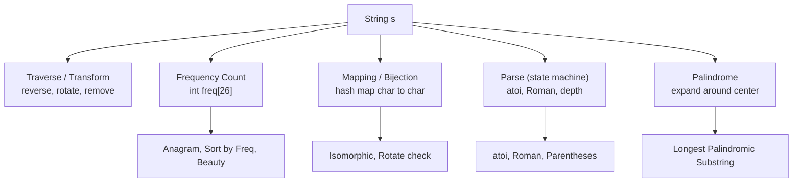
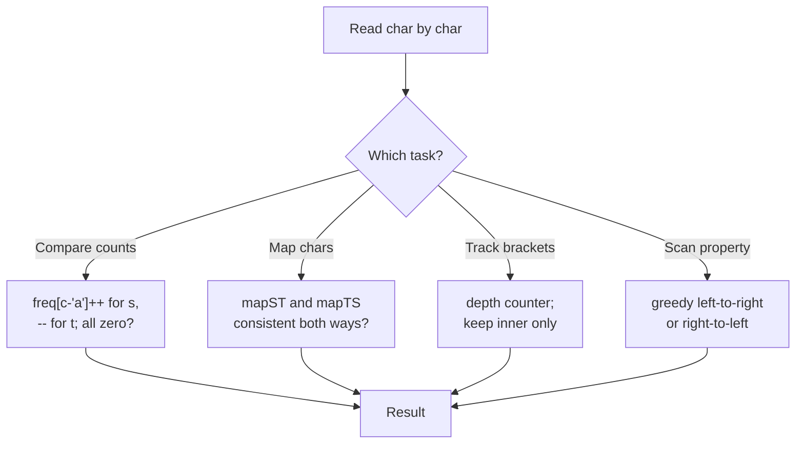
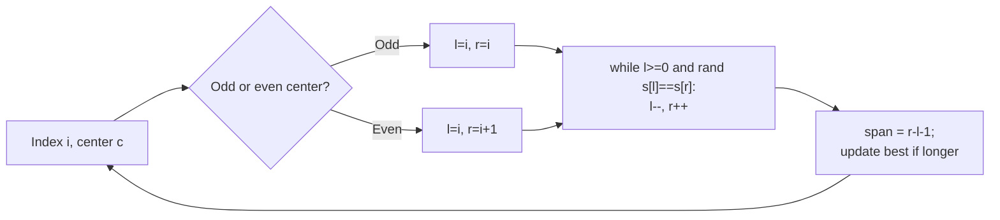

# Step 5: Strings [Basic and Medium]

A hands-on tour of the string-manipulation toolkit — traversal, frequency counting, hashing/mapping, parsing, and the classic center-expansion palindrome pattern — that powers a huge share of interview questions.

**Stats:** 15 problems total · 🟢 7 Easy · 🟡 8 Medium · 🔴 0 Hard

---

## 📌 Overview & Why It Matters

Strings are just arrays of characters, but interviewers love them because a single problem can test parsing discipline, hash-map fluency, two-pointer technique, and edge-case handling all at once. Studies of interview corpora repeatedly put strings among the top-3 most common topics (alongside arrays and linked lists) — roughly one in three coding interviews includes at least one string question.

This step is the "vocabulary builder": you learn to
- traverse and transform strings (reverse words, remove characters, rotate),
- count and compare character frequencies (anagram, sort by frequency, isomorphic),
- parse structured text (Roman numerals, `atoi`, parentheses depth), and
- apply the **expand-around-center** palindrome pattern.

**Prerequisites:** basic arrays, hash maps / frequency arrays (`int[26]`), two-pointer technique, and awareness of **string immutability** (in Java/Python creating a new string is O(n); C++ `std::string` is mutable).

**Where it shows up:** phone screens and OA rounds (easy parsing/counting), and as building blocks inside harder DP / sliding-window questions later.

---

## 🧠 Core Concepts

- **Character as index:** map `'a'..'z'` to `0..25` via `c - 'a'`. A `int freq[26]` array is your default counting tool — O(1) space, cache-friendly, faster than a hash map.
- **Frequency signatures:** two strings are anagrams iff their frequency vectors are equal. Many "grouping/matching" problems reduce to comparing counts.
- **Two pointers:** reverse in place, palindrome check, and skip-whitespace parsing all use a left/right or read/write pointer pair.
- **Mapping / bijection:** isomorphic strings need a *consistent two-way* mapping. One map is not enough.
- **Parsing state machines:** `atoi`, Roman-to-integer, and parentheses problems walk left→right maintaining running state (sign, accumulator, depth).
- **Expand around center:** every palindrome has a center (a char for odd length, a gap for even). There are `2n-1` centers; expanding each is the go-to O(n²) palindrome technique.
- **Immutability caution:** avoid `s += c` in a loop in Python/Java (O(n²)); use a list / `StringBuilder` and join at the end. In C++ prefer `reserve` + `push_back`.



---

## 🔑 Patterns & Approaches

### 1. Basic and Easy String Problems

**When to use it / recognition signals:** the problem asks you to *transform* a string (reverse words, remove characters), *compare* two strings (anagram, isomorphic, rotation), or *scan* for a property (largest odd number, common prefix). These are the "warm-up" problems that lean on traversal, two pointers, frequency arrays, and mapping — not on advanced algorithms.

**The approach / algorithm (per problem family):**
1. **Remove Outermost Parentheses** — track `depth`. Append a char to the result only when it is *not* the outermost bracket: when you see `'('`, append it if `depth > 0` then `depth++`; when you see `')'`, `depth--` then append if `depth > 0`.
2. **Reverse Words / Palindrome Check** — split on spaces (or two-pointer scan from the end), collect non-empty words, join with single spaces. Palindrome check = two pointers moving inward comparing `s[l] == s[r]`.
3. **Largest Odd Number** — greedy: walk from the *right* to find the last odd digit; the prefix up to and including it is the answer. No need to build substrings while scanning.
4. **Longest Common Prefix** — vertical scanning: compare the i-th char of every string; stop at first mismatch or end of any string.
5. **Isomorphic Strings** — maintain **two** maps (`s→t` and `t→s`); a violation of either consistency rule means not isomorphic.
6. **Rotate String** — `goal` is a rotation of `s` iff `len(s)==len(goal)` and `goal` is a substring of `s+s`.
7. **Anagram** — build `freq[26]` from `s` (`++`) and `t` (`--`); all zero ⇒ anagram.



**Complexity:** each is **O(n)** time (n = total chars; LCP is O(n·m) over m strings; rotation check is O(n²) naive or O(n) with KMP). Space is **O(1)** for frequency-array approaches, **O(k)** where a map/output is needed.

**Reusable code template (C++) — frequency & mapping toolkit:**
```cpp
// Anagram check via frequency array
bool isAnagram(string s, string t) {
    if (s.size() != t.size()) return false;
    int freq[26] = {0};
    for (char c : s) freq[c - 'a']++;
    for (char c : t) if (--freq[c - 'a'] < 0) return false;
    return true;
}

// Isomorphic: two-way mapping
bool isIsomorphic(string s, string t) {
    if (s.size() != t.size()) return false;
    int mp1[256], mp2[256];
    memset(mp1, -1, sizeof mp1);
    memset(mp2, -1, sizeof mp2);
    for (int i = 0; i < (int)s.size(); i++) {
        unsigned char a = s[i], b = t[i];
        if (mp1[a] == -1 && mp2[b] == -1) { mp1[a] = b; mp2[b] = a; }
        else if (mp1[a] != b || mp2[b] != a) return false;
    }
    return true;
}

// Remove outermost parentheses
string removeOuterParentheses(string s) {
    string res; int depth = 0;
    for (char c : s) {
        if (c == '(') { if (depth > 0) res += c; depth++; }
        else { depth--; if (depth > 0) res += c; }
    }
    return res;
}
```

**Problems table:**

| # | Problem | Difficulty | Practice |
|---|---------|-----------|----------|
| 1 | Remove Outermost Parentheses | 🟡 Medium | [LeetCode](https://leetcode.com/problems/remove-outermost-parentheses/) |
| 2 | Reverse words in a given string / Palindrome Check | 🟡 Medium | [LeetCode](https://leetcode.com/problems/reverse-words-in-a-string/) |
| 3 | Largest Odd Number in a String | 🟢 Easy | [LeetCode](https://leetcode.com/problems/largest-odd-number-in-string/) |
| 4 | Longest Common Prefix | 🟢 Easy | [LeetCode](https://leetcode.com/problems/longest-common-prefix/) |
| 5 | Isomorphic String | 🟢 Easy | [LeetCode](https://leetcode.com/problems/isomorphic-strings/) |
| 6 | Rotate String | 🟢 Easy | [LeetCode](https://leetcode.com/problems/rotate-string/) |
| 7 | Check if two strings are anagram of each other | 🟢 Easy | [LeetCode](https://leetcode.com/problems/valid-anagram/) |

**Edge cases & gotchas:**
- Anagram: check lengths first; watch for Unicode/uppercase — the `[26]` array assumes lowercase `a–z`.
- Isomorphic: forgetting the *second* map lets `"ab" → "aa"` pass incorrectly.
- Reverse words: multiple/leading/trailing spaces must collapse to a single separator.
- LCP: empty input array, or one empty string ⇒ answer is `""`.
- Rotate: unequal lengths short-circuits; empty strings are rotations of each other.
- Largest Odd Number: leading zeros in the answer are allowed by the problem; return `""` if no odd digit exists.

---

### 2. Medium String Problems

**When to use it / recognition signals:** the problem needs **parsing with running state** (`atoi`, Roman numerals, nesting depth), **frequency-driven ordering** (sort by frequency, sum of beauty), **substring enumeration** (count substrings, beauty of all substrings), or the **palindrome center-expansion** technique. Signals: "convert this string to a number", "parse this format", "consider all substrings", "longest palindromic…", "reorder by count".

**The approach / algorithm (per problem family):**
1. **Sort Characters by Frequency** — count with a map, then sort characters by descending count and rebuild the string (`char * count`). Bucket sort by frequency gives O(n).
2. **Maximum Nesting Depth of Parentheses** — one pass; `depth++` on `'('`, track running max, `depth--` on `')'`. Ignore other chars.
3. **Roman to Integer** — right-to-left (or subtractive) scan: add each symbol's value; if a smaller value precedes a larger one (e.g. `IV`), subtract instead of add.
4. **String to Integer (atoi)** — state machine: skip leading spaces → optional sign → consume digits with **overflow clamping** to `[INT_MIN, INT_MAX]` → stop at first non-digit.
5. **Count Number of Substrings** — the total number of substrings of length n is `n*(n+1)/2`; the Striver variant asks for substrings with exactly k distinct characters, solved as `atMost(k) - atMost(k-1)` via sliding window.
6. **Longest Palindromic Substring** — **expand around center**: for each of the `2n-1` centers, expand outward while chars match; keep the longest span. (Manacher's gives O(n).)
7. **Sum of Beauty of All Substrings** — for each start index, extend the substring while updating a `freq[26]`; beauty = `maxFreq - minFreq` (over chars with count > 0). Add beauty for every substring.
8. **Reverse Every Word in a String** — trim, split on whitespace, reverse the list of words, join with single space.



**Complexity:**
- Sort by frequency: **O(n + k log k)** time (k distinct), O(k) space.
- Nesting depth / Roman / atoi / reverse words: **O(n)** time, **O(1)**–**O(n)** space.
- Count substrings (distinct-k): **O(n)** with sliding window.
- Longest palindromic substring: **O(n²)** time, **O(1)** space (expand-around-center); Manacher = O(n).
- Sum of beauty: **O(n² · 26)** ≈ O(n²) time, O(26) space.

**Reusable code template (C++) — parsing + palindrome:**
```cpp
// atoi state machine with overflow clamping
int myAtoi(string s) {
    int i = 0, n = s.size(); long long num = 0; int sign = 1;
    while (i < n && s[i] == ' ') i++;               // 1. skip spaces
    if (i < n && (s[i] == '+' || s[i] == '-'))      // 2. optional sign
        sign = (s[i++] == '-') ? -1 : 1;
    while (i < n && isdigit(s[i])) {                // 3. digits
        num = num * 10 + (s[i++] - '0');
        if (sign * num <= INT_MIN) return INT_MIN;  // 4. clamp
        if (sign * num >= INT_MAX) return INT_MAX;
    }
    return (int)(sign * num);
}

// Longest palindromic substring: expand around center
string longestPalindrome(string s) {
    if (s.empty()) return "";
    int start = 0, maxLen = 1;
    auto expand = [&](int l, int r) {
        while (l >= 0 && r < (int)s.size() && s[l] == s[r]) { l--; r++; }
        if (r - l - 1 > maxLen) { maxLen = r - l - 1; start = l + 1; }
    };
    for (int i = 0; i < (int)s.size(); i++) {
        expand(i, i);      // odd length center
        expand(i, i + 1);  // even length center
    }
    return s.substr(start, maxLen);
}

// Roman to integer
int romanToInt(string s) {
    unordered_map<char,int> v = {{'I',1},{'V',5},{'X',10},{'M',1000},
                                 {'L',50},{'C',100},{'D',500}};
    int total = 0, n = s.size();
    for (int i = 0; i < n; i++) {
        if (i + 1 < n && v[s[i]] < v[s[i+1]]) total -= v[s[i]];
        else total += v[s[i]];
    }
    return total;
}
```

**Problems table:**

| # | Problem | Difficulty | Practice |
|---|---------|-----------|----------|
| 1 | Sort Characters by Frequency | 🟢 Easy | [LeetCode](https://leetcode.com/problems/sort-characters-by-frequency/) |
| 2 | Maximum Nesting Depth of the Parentheses | 🟡 Medium | [LeetCode](https://leetcode.com/problems/maximum-nesting-depth-of-the-parentheses/) |
| 3 | Roman to Integer | 🟡 Medium | [LeetCode](https://leetcode.com/problems/roman-to-integer/) |
| 4 | String to Integer (atoi) | 🟡 Medium | [LeetCode](https://leetcode.com/problems/string-to-integer-atoi/) |
| 5 | Count Number of Substrings | 🟢 Easy | [Article](https://takeuforward.org/data-structure/count-number-of-substrings) |
| 6 | Longest Palindromic Substring | 🟡 Medium | [LeetCode](https://leetcode.com/problems/longest-palindromic-substring/) |
| 7 | Sum of Beauty of All Substrings | 🟡 Medium | [LeetCode](https://leetcode.com/problems/sum-of-beauty-of-all-substrings/) |
| 8 | Reverse every word in a string | 🟡 Medium | [LeetCode](https://leetcode.com/problems/reverse-words-in-a-string/) |

**Edge cases & gotchas:**
- **atoi:** the single most bug-prone problem — handle overflow *during* accumulation (use `long long` or check before multiplying), reject strings with no digits (return 0), and stop at the first invalid char (`"4193 with words"` → 4193).
- **Roman:** valid input assumed; the subtractive rule only fires for the six pairs (IV, IX, XL, XC, CD, CM).
- **Nesting depth:** input is a Valid Parentheses String (VPS); non-bracket characters (digits, `+`) must be skipped.
- **Sort by frequency:** ties can be output in any order unless the problem says otherwise; watch for uppercase/lowercase/digits (use a 128- or 256-size map, not `[26]`).
- **Longest palindromic substring:** don't forget **even-length** centers; a single character is a valid palindrome of length 1.
- **Sum of beauty:** recompute or incrementally maintain `min`/`max` over *only* characters with non-zero count.

---

## ❓ Regularly Asked Interview Questions

**Q: Are strings mutable? Why does it matter for complexity?**
**A:** In Java and Python strings are immutable — every concatenation creates a new object, so `s += c` in a loop is O(n²). Use `StringBuilder` (Java) / a list + `"".join()` (Python). In C++ `std::string` is mutable, so in-place edits and `push_back` are O(1) amortized.

**Q: How do you check if two strings are anagrams, and what are the trade-offs of sorting vs. counting?**
**A:** Sorting both and comparing is O(n log n) time, O(1) extra (or O(n)) space, and works for any alphabet. Frequency counting with `int[26]` is O(n) time and O(1) space but assumes a fixed alphabet. Counting is preferred; sorting is a quick one-liner when the alphabet is unbounded.

**Q: What's the difference between a substring and a subsequence?**
**A:** A substring is **contiguous** (`s[i..j]`); a subsequence keeps order but may skip characters. A string of length n has `n(n+1)/2` substrings but `2^n` subsequences. This distinction changes both the algorithm and the complexity.

**Q: How would you find the longest palindromic substring efficiently?**
**A:** Expand around each of the `2n-1` centers (n odd centers + n-1 even centers), tracking the longest match — O(n²) time, O(1) space. For O(n), use **Manacher's algorithm**, which reuses mirror information around a running center/right boundary.

**Q: Why do isomorphic strings need two maps?**
**A:** Isomorphism must be a **bijection**. A single map `s→t` allows two different source chars to map to the same target (e.g. `"ab" → "aa"`), which isn't isomorphic. The second map `t→s` enforces the reverse uniqueness.

**Q: How do you handle overflow in `atoi`?**
**A:** Accumulate in a wider type (`long long`) or check before each multiply: if `num > INT_MAX/10` or (`== INT_MAX/10` and next digit pushes past the last digit), clamp to `INT_MAX`/`INT_MIN`. Return the clamped boundary, don't wrap around.

**Q: How can you check if one string is a rotation of another in O(n)?**
**A:** `goal` is a rotation of `s` iff they're the same length and `goal` is a substring of `s + s`. Using KMP/`std::string::find` intelligently gives O(n); the naive `find` on `s+s` is O(n²) worst case but usually fine.

**Q: How would you count substrings with exactly K distinct characters?**
**A:** Use the "at most" trick: `exactly(K) = atMost(K) − atMost(K−1)`, where `atMost` is a sliding window that shrinks whenever the window has more than K distinct chars, adding `right − left + 1` valid substrings at each step. O(n) time.

**Q: What data structure counts character frequency fastest, and when would you not use it?**
**A:** A fixed-size array `int[26]` (or `[256]`) — O(1) access, cache-friendly, no hashing overhead. Switch to a hash map when the alphabet is large/unknown (Unicode) or sparse, where a full array wastes space.

**Q: How do you reverse the words of a sentence in place?**
**A:** Reverse the entire string, then reverse each individual word. This gives correct word order with O(1) extra space (in a mutable language). Remember to normalize extra spaces.

**Q: What is Manacher's algorithm and when is it worth it?**
**A:** It finds the longest palindromic substring (and all palindrome radii) in **O(n)** by transforming the string with separators and reusing previously computed radii via a center/right boundary. Worth it only when O(n²) is too slow; in interviews expand-around-center usually suffices — mention Manacher as the optimal follow-up.

**Q: How do you convert Roman numerals to an integer?**
**A:** Scan left to right; add each symbol's value, but if the current symbol's value is smaller than the next one's, subtract it instead (handles IV, IX, XL, XC, CD, CM). O(n) time, O(1) space.

**Q: What defines "beauty" of a substring and how do you sum it over all substrings?**
**A:** Beauty = (max frequency − min frequency) among characters present in the substring. Fix each start index, extend the end while maintaining a `freq[26]`, compute beauty each step, and accumulate. O(n²·26).

---

## 💡 Interview Tips & Common Mistakes

- **State your assumptions about the alphabet.** Lowercase-only lets you use `int[26]`; otherwise use `[256]` or a hash map. Say it out loud.
- **Never build strings with `+=` in a loop** in Python/Java — use a builder/list. This is a frequent silent O(n²).
- **Handle whitespace deliberately** in word-reversal / `atoi` problems: leading, trailing, and multiple internal spaces are classic trap inputs.
- **Overflow in `atoi`** is the top failure — clamp during accumulation, don't rely on the final cast.
- **Don't forget even-length palindromes** — always expand with both `(i,i)` and `(i,i+1)`.
- **Isomorphic / pattern-match problems need two-way maps** — one map is a common wrong answer that passes weak tests.
- **Confirm substring vs. subsequence** before choosing your approach; they have wildly different complexities.
- **Off-by-one in expand-around-center:** after the while loop the valid span is `[l+1, r-1]`, length `r - l - 1`.
- **Prefer frequency arrays over sorting** when the alphabet is fixed — O(n) beats O(n log n).
- **Clarify tie-breaking / output order** (e.g. sort-by-frequency) before coding.

---

## 🐟 Revision Cheat-Sheet

| Pattern | Key Idea | Time | Space | Signature problem |
|---------|----------|------|-------|-------------------|
| Basic & Easy String Problems | Traverse, freq-array, two-pointer, two-way mapping | O(n) | O(1)–O(k) | Valid Anagram / Isomorphic Strings |
| Medium String Problems | Parse-with-state, freq ordering, expand-around-center | O(n)–O(n²) | O(1)–O(k) | Longest Palindromic Substring / atoi |

---

## 🔗 References & Further Reading

- **Striver A2Z — Step 5 (Strings Basic & Medium):** https://takeuforward.org/strivers-a2z-dsa-course/strivers-a2z-dsa-course-sheet-2/
- **GeeksforGeeks — Top 50 String Coding Problems for Interviews:** https://www.geeksforgeeks.org/dsa/top-50-string-coding-problems-for-interviews/
- **GeeksforGeeks — Longest Palindromic Substring:** https://www.geeksforgeeks.org/longest-palindromic-substring/
- **GeeksforGeeks — Manacher's Algorithm (O(n) LPS):** https://www.geeksforgeeks.org/dsa/manachers-algorithm-linear-time-longest-palindromic-substring-part-1/
- **GeeksforGeeks — Commonly Asked String Interview Questions:** https://www.geeksforgeeks.org/dsa/commonly-asked-data-structure-interview-questions-on-strings/
- **LeetCode Discuss — Essential String Patterns for Coding Interviews:** https://leetcode.com/discuss/post/7345087/
- **dev.to — Master Strings in 20 Problems: Complete Pattern Guide:** https://dev.to/yakhilesh/master-strings-in-20-problems-complete-pattern-guide-2ei0
- **PYnative — Python String Interview Questions & Answers:** https://pynative.com/python-string-interview-questions/
