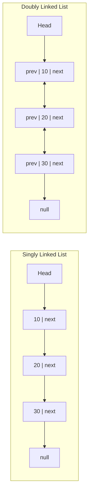
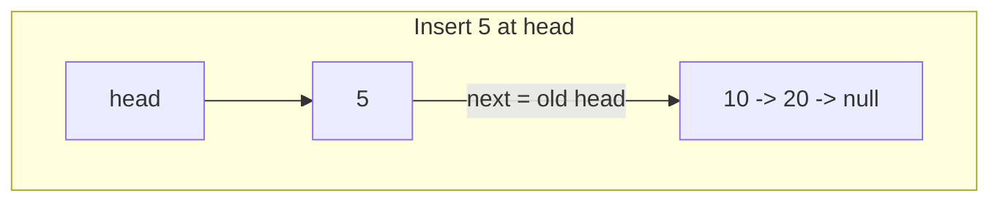
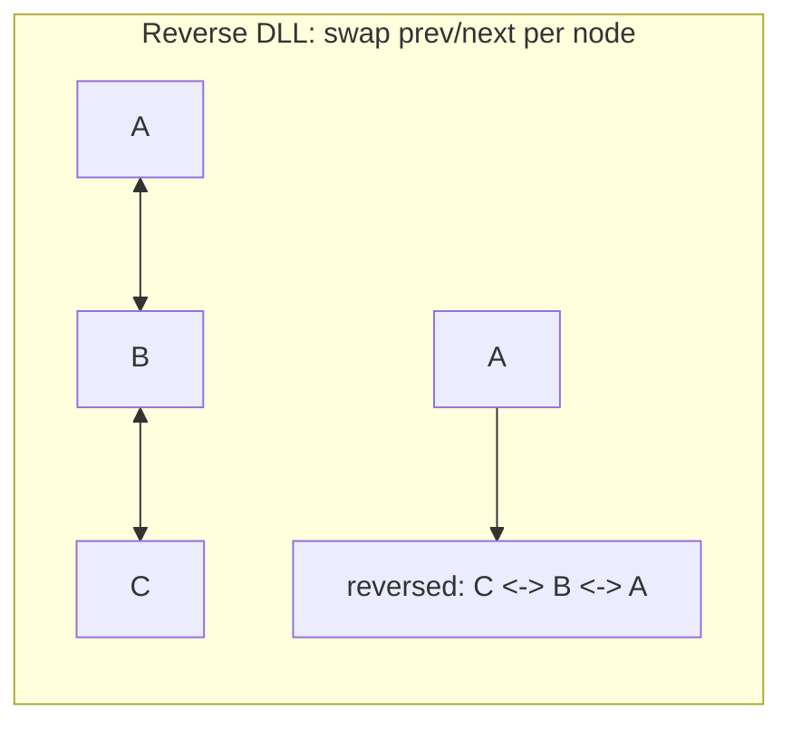
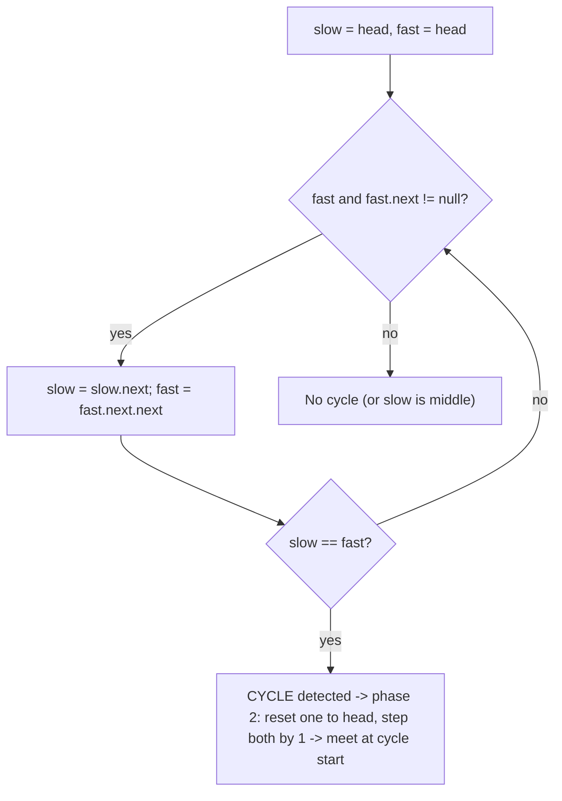
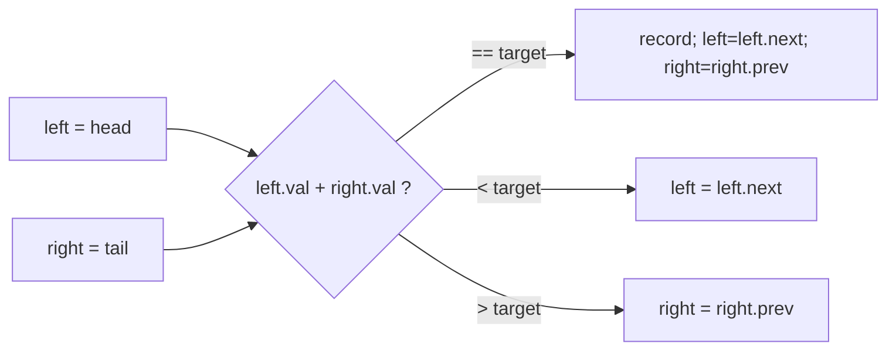
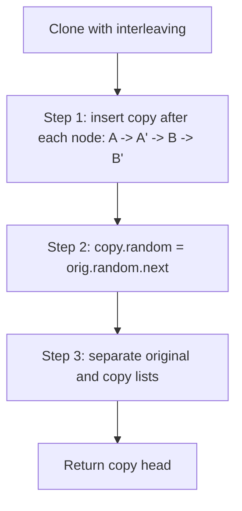

# Step 6: Learn LinkedList [Single LL, Double LL, Medium, Hard Problems]

> Master pointer manipulation — the single most common "can you reason about references without breaking things?" test in interviews. This step walks from building a list to Floyd's cycle detection, k-group reversal, and cloning with random pointers.

**Stats:** 31 problems total — 🟢 Easy: 8 · 🟡 Medium: 16 · 🔴 Hard: 7 *(difficulty normalized from the data; "easy"/"hard" lowercase treated as Easy/Hard).*

---

## 📌 Overview & Why It Matters

A **linked list** is a linear data structure where each element (a **node**) stores data plus one or more **pointers** to other nodes, instead of living in contiguous memory like an array. This gives O(1) insert/delete at a known position but O(n) random access.

Why interviewers love it:
- It tests **pointer discipline** — off-by-one, dangling pointers, lost heads, and null dereferences show up instantly.
- Many elegant O(1)-space tricks (fast/slow pointers, in-place reversal) reveal whether you can optimize beyond the brute-force hash-set/array-copy approach.
- Companies like Google, Amazon, Microsoft, and Meta ask cycle detection, reversal, and merge questions constantly.

**Prerequisites:** basic recursion, pointers/references in your language, and comfort with the two-pointer idea from arrays.

**Key insight to carry throughout:** almost every linked-list bug is fixed by (a) using a **dummy/sentinel head**, (b) saving `node->next` **before** you overwrite it, and (c) drawing the pointers on paper.

---

## 🧠 Core Concepts

**Vocabulary**
- **Node:** `{ value, next }` (singly) or `{ prev, value, next }` (doubly).
- **Head:** first node. **Tail:** last node (its `next` is `null`).
- **Dummy/Sentinel node:** a throwaway node placed before the head so you never special-case "modifying the head."
- **Fast/Slow pointers:** two pointers advancing at different speeds — the backbone of middle-finding and cycle detection.



**Node definitions (C++ — primary language for this guide):**

```cpp
struct Node {           // singly
    int val;
    Node* next;
    Node(int x) : val(x), next(nullptr) {}
};

struct DNode {          // doubly
    int val;
    DNode* prev;
    DNode* next;
    DNode(int x) : val(x), prev(nullptr), next(nullptr) {}
};
```

**Cost model (why we pick linked lists):**

| Operation | Array | Singly LL | Doubly LL |
|---|---|---|---|
| Access by index | O(1) | O(n) | O(n) |
| Insert/delete at head | O(n) | O(1) | O(1) |
| Insert/delete at tail | O(1)* | O(n) | O(1) w/ tail |
| Insert/delete before a given node | O(n) | O(n) | O(1) |

---

## 🔑 Patterns & Approaches

### 1. Learn 1D LinkedList (build, traverse, length, search)

**When to use it / recognition signals:** Any problem that first requires *constructing* a list from an array, or the sub-tasks "insert at head," "delete head," "count nodes," "find a value." These are the primitives every harder problem composes.

**Approach, step by step:**
1. **Build:** iterate the array; for each value create a node and link it. Keep a `head` and a moving `tail`.
2. **Traverse:** `for (Node* cur = head; cur; cur = cur->next)`.
3. **Insert at head:** `newNode->next = head; head = newNode;` — O(1).
4. **Delete head:** `Node* t = head; head = head->next; delete t;` — O(1).
5. **Length:** walk to null counting.
6. **Search:** walk comparing `cur->val == target`.



**Complexity:** build/length/search O(n); head insert/delete O(1). Space O(1) extra (O(n) to build).

**Reusable template:**
```cpp
Node* buildList(const vector<int>& a) {
    Node dummy(0); Node* tail = &dummy;
    for (int x : a) { tail->next = new Node(x); tail = tail->next; }
    return dummy.next;
}
int length(Node* head) {
    int n = 0;
    for (Node* cur = head; cur; cur = cur->next) n++;
    return n;
}
bool search(Node* head, int key) {
    for (Node* cur = head; cur; cur = cur->next)
        if (cur->val == key) return true;
    return false;
}
Node* insertHead(Node* head, int x) {
    Node* nn = new Node(x); nn->next = head; return nn;
}
Node* deleteHead(Node* head) {
    if (!head) return nullptr;
    Node* t = head; head = head->next; delete t; return head;
}
```

| # | Problem | Difficulty | Practice |
|---|---------|-----------|----------|
| 1 | Introduction to Singly LinkedList | 🟢 Easy | [Article](https://takeuforward.org/linked-list/linked-list-introduction) · [🎥](https://youtu.be/Nq7ok-OyEpg?si=9PR1o8OPRWil7fRA) |
| 2 | Insertion at the head of Linked List | 🟢 Easy | [Article](https://takeuforward.org/linked-list/insert-at-the-head-of-a-linked-list) · [🎥](https://youtu.be/VaECK03Dz-g?si=vHSwdf9jhE05adKM&t=1934) |
| 3 | Deletion of the head of LL | 🟢 Easy | [LeetCode](https://leetcode.com/problems/delete-node-in-a-linked-list/) · [🎥](https://youtu.be/VaECK03Dz-g?si=CRaBHbOo2bHFbOT5) |
| 4 | Find the length of the Linked List | 🟢 Easy | [Article](https://takeuforward.org/linked-list/find-the-length-of-a-linked-list) · [🎥](https://youtu.be/Nq7ok-OyEpg?si=xqQbukLfo2oZ6C6s&t=2240) |
| 5 | Search in Linked List | 🟡 Medium | [Article](https://takeuforward.org/linked-list/search-an-element-in-a-linked-list) · [🎥](https://youtu.be/Nq7ok-OyEpg?si=WNXcIaXZ_B6cNq0s&t=2524) |

**Edge cases & gotchas:** empty list (`head == nullptr`); single node; deleting head must reassign `head`; free memory to avoid leaks (C++); don't dereference `cur->next` without checking `cur`.

---

### 2. Learn Doubly LinkedList (prev/next maintenance)

**When to use it / recognition signals:** You need O(1) deletion of a *given* node, bidirectional traversal, or an LRU-cache-style structure. Any DLL sub-task (insert before head, delete head, reverse).

**Approach:** every mutation must fix **both** `prev` and `next` links of the affected neighbors. The invariant: for adjacent nodes `x` and `y`, `x->next == y` ⟺ `y->prev == x`.

- **Insert before head:** `nn->next = head; head->prev = nn; head = nn;`
- **Delete head:** `head = head->next; if (head) head->prev = nullptr;`
- **Reverse:** for each node swap its `prev` and `next`; the old tail becomes the new head.



**Complexity:** insert/delete at ends O(1); reverse/traverse O(n); space O(1).

**Reusable template:**
```cpp
DNode* insertBeforeHead(DNode* head, int x) {
    DNode* nn = new DNode(x);
    nn->next = head;
    if (head) head->prev = nn;
    return nn;                       // new head
}
DNode* deleteHead(DNode* head) {
    if (!head) return nullptr;
    DNode* t = head; head = head->next;
    if (head) head->prev = nullptr;
    delete t; return head;
}
DNode* reverseDLL(DNode* head) {
    DNode* cur = head; DNode* last = nullptr;
    while (cur) {
        last = cur->prev;            // temp
        cur->prev = cur->next;       // swap
        cur->next = last;
        cur = cur->prev;             // move forward (old next)
    }
    return last ? last->prev : head; // new head
}
```

| # | Problem | Difficulty | Practice |
|---|---------|-----------|----------|
| 1 | Introduction to Doubly LL | 🟢 Easy | [Article](https://takeuforward.org/linked-list/introduction-to-doubly-linked-list) · [🎥](https://youtu.be/0eKMU10uEDI?si=uDnoj_C5ghEpNLvP) |
| 2 | Insert node before head in Doubly Linked List | 🟢 Easy | [Article](https://takeuforward.org/data-structure/insert-at-end-of-doubly-linked-list/) · [🎥](https://youtu.be/0eKMU10uEDI?si=J5a0pQTosimcO_aA&t=2684) |
| 3 | Delete head of Doubly Linked List | 🟢 Easy | [Article](https://takeuforward.org/data-structure/delete-last-node-of-a-doubly-linked-list/) · [🎥](https://youtu.be/0eKMU10uEDI?si=sE7jqrW46lfRHVLd&t=853) |
| 4 | Reverse a Doubly Linked List | 🟡 Medium | [Article](https://takeuforward.org/data-structure/reverse-a-doubly-linked-list/) · [🎥](https://youtu.be/u3WUW2qe6ww?si=96Wwlju72IvmzkxE) |

**Edge cases & gotchas:** forgetting to set `head->prev = nullptr` after deleting the old head; single node (its `prev`/`next` both null); after reversing, return the correct new head (the old tail), not the old head.

---

### 3. Medium Problems of LL (fast/slow, reversal, Floyd, merge tricks)

This is the largest and most interview-critical group. It braids three master patterns: **fast/slow (tortoise-hare)**, **in-place reversal**, and **two-pointer alignment**.

**When to use it / recognition signals:**
- "Find middle," "detect cycle," "nth from end," "delete middle" → **fast/slow pointers**.
- "Reverse," "palindrome," "add numbers (LSB-first)" → **in-place reversal**.
- "Intersection of two lists," "cycle start" → **two-pointer alignment / Floyd phase 2**.
- "Sort list," "sort 0s/1s/2s" → **merge sort on links / pointer partitioning**.

**Core algorithms:**

**(a) Fast/Slow for middle & cycle (Floyd).** Slow moves 1, fast moves 2. When fast (or `fast->next`) hits null → slow is the middle. If they ever *meet* → cycle exists.

**(b) Floyd cycle *start*.** After the meet, reset one pointer to head; advance both by 1; they meet at the cycle entry. *Why:* if `L` = distance head→entry, `C` = cycle length, and they meet `k` past the entry, algebra gives `L ≡ (C − k) mod C`, so a pointer from head and a pointer from the meet point (both stepping 1) converge exactly at the entry.

**(c) Loop length.** Once they meet, keep one fixed and walk the other around until it returns, counting steps.

**(d) In-place reversal.** Classic three-pointer `prev/cur/next` re-linking.

**(e) Intersection.** Two pointers walk both lists; when one hits null it jumps to the *other* head. After at most `lenA + lenB` steps they meet at the intersection (or both at null). Equalizes the length difference automatically.



**Complexity:** all of the above are **O(n) time, O(1) space** except sort-list which is **O(n log n) time, O(log n) stack** (merge sort). Reversal/palindrome/add are O(n)/O(1).

**Reusable templates:**
```cpp
// Fast/slow middle (returns 2nd middle for even length — LeetCode style)
Node* middle(Node* head) {
    Node *slow = head, *fast = head;
    while (fast && fast->next) { slow = slow->next; fast = fast->next->next; }
    return slow;
}

// Iterative reverse
Node* reverse(Node* head) {
    Node *prev = nullptr, *cur = head;
    while (cur) { Node* nxt = cur->next; cur->next = prev; prev = cur; cur = nxt; }
    return prev;
}

// Detect cycle
bool hasCycle(Node* head) {
    Node *s = head, *f = head;
    while (f && f->next) { s = s->next; f = f->next->next; if (s == f) return true; }
    return false;
}

// Cycle start (Floyd phase 2)
Node* cycleStart(Node* head) {
    Node *s = head, *f = head;
    while (f && f->next) {
        s = s->next; f = f->next->next;
        if (s == f) { s = head;
            while (s != f) { s = s->next; f = f->next; }
            return s; }
    }
    return nullptr;
}

// Remove Nth from end (one pass, dummy)
Node* removeNthFromEnd(Node* head, int n) {
    Node dummy(0); dummy.next = head;
    Node *fast = &dummy, *slow = &dummy;
    for (int i = 0; i < n; i++) fast = fast->next;
    while (fast->next) { fast = fast->next; slow = slow->next; }
    Node* del = slow->next; slow->next = del->next; delete del;
    return dummy.next;
}

// Merge sort a linked list
Node* merge(Node* a, Node* b) {
    Node dummy(0); Node* t = &dummy;
    while (a && b) {
        if (a->val <= b->val) { t->next = a; a = a->next; }
        else { t->next = b; b = b->next; }
        t = t->next;
    }
    t->next = a ? a : b;
    return dummy.next;
}
Node* sortList(Node* head) {
    if (!head || !head->next) return head;
    Node *slow = head, *fast = head->next;          // split
    while (fast && fast->next) { slow = slow->next; fast = fast->next->next; }
    Node* mid = slow->next; slow->next = nullptr;
    return merge(sortList(head), sortList(mid));
}
```

| # | Problem | Difficulty | Practice |
|---|---------|-----------|----------|
| 1 | Middle of a LinkedList [Tortoise-Hare] | 🟢 Easy | [LeetCode](https://leetcode.com/problems/middle-of-the-linked-list/) · [🎥](https://youtu.be/7LjQ57RqgEc?si=ir_rRDio38rhamU_) |
| 2 | Reverse a LinkedList [Iterative] | 🟡 Medium | [LeetCode](https://leetcode.com/problems/reverse-linked-list/) · [🎥](https://youtu.be/D2vI2DNJGd8?si=RCaLSx01qR21IBdh) |
| 3 | Reverse a LL (Recursive) | 🟡 Medium | [LeetCode](https://leetcode.com/problems/reverse-linked-list/) · [🎥](https://youtu.be/D2vI2DNJGd8?si=RCaLSx01qR21IBdh) |
| 4 | Detect a loop in LL | 🟡 Medium | [LeetCode](https://leetcode.com/problems/linked-list-cycle/) · [🎥](https://youtu.be/wiOo4DC5GGA?si=zagt6O6tFXc4_3cx) |
| 5 | Find the starting point in LL | 🟡 Medium | [LeetCode](https://leetcode.com/problems/linked-list-cycle-ii/) · [🎥](https://youtu.be/2Kd0KKmmHFc?si=7UreDPRjRvapeVB0) |
| 6 | Length of loop in LL | 🟡 Medium | [Article](https://takeuforward.org/linked-list/length-of-loop-in-linked-list) · [🎥](https://youtu.be/I4g1qbkTPus?si=ONktpqewvx57T8pF) |
| 7 | Check if LL is palindrome or not | 🟡 Medium | [LeetCode](https://leetcode.com/problems/palindrome-linked-list/) · [🎥](https://youtu.be/lRY_G-u_8jk?si=BpM8hRYvXSYyjl-G) |
| 8 | Segregate odd and even nodes in LL | 🟡 Medium | [LeetCode](https://leetcode.com/problems/odd-even-linked-list/) · [🎥](https://youtu.be/qf6qp7GzD5Q?si=JozAyXUdT8EJMSCQ) |
| 9 | Remove Nth node from the back of the LL | 🟡 Medium | [LeetCode](https://leetcode.com/problems/remove-nth-node-from-end-of-list/) · [🎥](https://youtu.be/3kMKYQ2wNIU?si=DtFDnPU7z9HMz_GM) |
| 10 | Delete the middle node in LL | 🟡 Medium | [LeetCode](https://leetcode.com/problems/delete-the-middle-node-of-a-linked-list/) · [🎥](https://youtu.be/ePpV-_pfOeI?si=Au9GsZkVO57j6SiN) |
| 11 | Sort LL | 🔴 Hard | [LeetCode](https://leetcode.com/problems/sort-list/) · [🎥](https://youtu.be/8ocB7a_c-Cc?si=Gv-Y8q8-WyARoV35) |
| 12 | Sort a Linked List of 0's 1's and 2's | 🟡 Medium | [Article](https://takeuforward.org/data-structure/sort-a-linked-list-of-0s-1s-and-2s-by-changing-links) · [🎥](https://youtu.be/gRII7LhdJWc?si=l3qRC7w3NhY7OAqw) |
| 13 | Find the intersection point of Y LL | 🟡 Medium | [LeetCode](https://leetcode.com/problems/intersection-of-two-linked-lists/) · [🎥](https://youtu.be/0DYoPz2Tpt4?si=L-uJs5yXUxj4VJM2) |
| 14 | Add one to a number represented by LL | 🟡 Medium | [Article](https://takeuforward.org/data-structure/add-1-to-a-number-represented-by-ll) · [🎥](https://youtu.be/aXQWhbvT3w0?si=uRgU9S4r5cVmnUy7) |
| 15 | Add two numbers in Linked List | 🟡 Medium | [LeetCode](https://leetcode.com/problems/add-two-numbers/) · [🎥](https://www.youtube.com/watch?v=LBVsXSMOIk4&list=PLgUwDviBIf0p4ozDR_kJJkONnb1wdx2Ma&index=32) |

**Edge cases & gotchas:** fast-pointer null checks (`fast && fast->next`) — the #1 crash; even-vs-odd length changes which "middle" you get; palindrome must **restore** the reversed half if the list is reused; "add one" needs carry propagation, often solved by reversing, adding 1 to LSB, reversing back (or recursion); intersection compares **node identity**, not value.

---

### 4. Medium Problems of DLL (traversal deletes & pair-sum)

**When to use it / recognition signals:** Sorted DLL de-duplication, deleting *all* occurrences of a key, or two-sum on a **sorted** DLL (two pointers from both ends — only possible because DLL allows backward movement).

**Approach:**
- **Delete all occurrences:** traverse; when `cur->val == key`, splice `cur` out by relinking `cur->prev->next` and `cur->next->prev`, handling the head case. Use a dummy or explicitly update `head`.
- **Pairs with sum (sorted DLL):** `left = head`, `right = tail`. While `left != right` and haven't crossed: if `left+right == target` record pair and move both inward; if `< target` move `left` right; else move `right` left.
- **Remove duplicates from sorted DLL:** for each node, skip forward past equal-valued neighbors, relinking `prev`/`next`.



**Complexity:** delete/dedup O(n) time, O(1) space; pair-sum O(n) time (find tail once), O(1) space.

**Reusable template:**
```cpp
DNode* deleteAllOccurrences(DNode* head, int key) {
    DNode dummy(0); dummy.next = head; if (head) head->prev = &dummy;
    DNode* cur = head;
    while (cur) {
        DNode* nxt = cur->next;
        if (cur->val == key) {
            cur->prev->next = cur->next;
            if (cur->next) cur->next->prev = cur->prev;
            delete cur;
        }
        cur = nxt;
    }
    DNode* nh = dummy.next; if (nh) nh->prev = nullptr; return nh;
}

vector<pair<int,int>> pairSum(DNode* head, int target) {
    vector<pair<int,int>> res;
    if (!head) return res;
    DNode* tail = head; while (tail->next) tail = tail->next;
    DNode *l = head, *r = tail;
    while (l != r && r->next != l) {           // r->next != l guards crossing
        int s = l->val + r->val;
        if (s == target) { res.push_back({l->val, r->val}); l = l->next; r = r->prev; }
        else if (s < target) l = l->next;
        else r = r->prev;
    }
    return res;
}
```

| # | Problem | Difficulty | Practice |
|---|---------|-----------|----------|
| 1 | Delete all occurrences of a key in DLL | 🔴 Hard | [Article](https://takeuforward.org/data-structure/delete-all-occurrences-of-a-key-in-dll) · [🎥](https://youtu.be/Mh0NH_SD92k?si=tCYshBRi1upMqSVz) |
| 2 | Find Pairs with Given Sum in Doubly Linked List | 🟡 Medium | [Article](https://takeuforward.org/data-structure/find-pairs-with-given-sum-in-doubly-linked-list) · [🎥](https://youtu.be/YitR4dQsddE?si=iZAC259hdngV_OxC) |
| 3 | Remove duplicates from sorted DLL | 🔴 Hard | [Article](https://takeuforward.org/data-structure/remove-duplicates-from-sorted-dll) · [🎥](https://youtu.be/YJKVTnOJXSY?si=AsZoNUoewetsBjr0) |

**Edge cases & gotchas:** key at head/tail; consecutive matches; empty list; pair-sum crossing condition (`l != r && r->next != l`) to avoid double-counting or overshoot; always fix **both** `prev` and `next` when splicing.

---

### 5. Hard Problems of LL (k-group reverse, rotate, flatten, random-pointer clone)

**When to use it / recognition signals:** Explicit "in groups of k," "rotate by k," "flatten a multilevel/bottom list," or "deep copy with random pointer." These stack the base patterns and demand meticulous pointer bookkeeping.

**Approach:**
- **Reverse in k-groups:** count k nodes; if fewer than k remain, leave as-is; otherwise reverse the block and recursively/iteratively connect the reversed block's tail to the next group's (reversed) head.
- **Rotate by k:** compute length `L`, connect tail→head to form a ring, then break the ring `k % L` places back from the tail; new head is `L - k%L` from the front.
- **Flatten:** merge the vertical (`bottom`) sorted lists pairwise from right to left using the merge routine, treating `bottom` as the "next" during merge.
- **Clone with random pointer:** interleave copies (`A→A'→B→B'…`), set `copy->random = orig->random->next`, then detach the two lists. O(1) extra space (vs. hash map O(n)).



**Complexity:** k-reverse O(n)/O(1); rotate O(n)/O(1); flatten O(n·m) time / O(1) iterative (O(depth) recursion); clone O(n)/O(1) with interleaving.

**Reusable template (k-group reverse):**
```cpp
Node* reverseKGroup(Node* head, int k) {
    Node* node = head;
    for (int i = 0; i < k; i++) {          // check we have k nodes
        if (!node) return head;
        node = node->next;
    }
    // reverse first k, `node` is head of the remainder
    Node* prev = reverseKGroup(node, k);   // recurse on rest
    Node* cur = head;
    for (int i = 0; i < k; i++) {
        Node* nxt = cur->next;
        cur->next = prev;
        prev = cur;
        cur = nxt;
    }
    return prev;                            // new head of this group
}

// Rotate right by k
Node* rotateRight(Node* head, int k) {
    if (!head || !head->next || k == 0) return head;
    int len = 1; Node* tail = head;
    while (tail->next) { tail = tail->next; len++; }
    k %= len; if (k == 0) return head;
    tail->next = head;                      // make ring
    int stepsToNewTail = len - k;
    Node* newTail = head;
    for (int i = 1; i < stepsToNewTail; i++) newTail = newTail->next;
    Node* newHead = newTail->next;
    newTail->next = nullptr;
    return newHead;
}
```

| # | Problem | Difficulty | Practice |
|---|---------|-----------|----------|
| 1 | Reverse LL in group of given size K | 🔴 Hard | [LeetCode](https://leetcode.com/problems/reverse-nodes-in-k-group/) · [🎥](https://youtu.be/lIar1skcQYI?si=_jFghHKX4eaK36a1) |
| 2 | Rotate a LL | 🔴 Hard | [LeetCode](https://leetcode.com/problems/rotate-list/description/) · [🎥](https://youtu.be/uT7YI7XbTY8?si=ZaChW3a68c_v54Is) |
| 3 | Flattening of LL | 🔴 Hard | [Article](https://takeuforward.org/data-structure/flattening-a-linked-list/) · [🎥](https://youtu.be/ykelywHJWLg?si=InMg9MmTHzY22NSR) |
| 4 | Clone a LL with random and next pointer | 🔴 Hard | [LeetCode](https://leetcode.com/problems/copy-list-with-random-pointer/) · [🎥](https://youtu.be/q570bKdrnlw?si=epZtpWvtNwuTf23o) |

**Edge cases & gotchas:** k-group — leave the last partial group **unreversed** (LeetCode); rotate — `k %= len` (k can exceed length) and don't forget to break the ring; flatten — the flattened list uses `bottom` as next, set the merged `next` to null; clone — restore the original list's `next` pointers when detaching, and handle `random == null`.

---

## ❓ Regularly Asked Interview Questions

**Q: How does a linked list differ from an array, and when would you choose one?**
**A:** Arrays give O(1) random access but O(n) insert/delete in the middle and need contiguous memory. Linked lists give O(1) insert/delete at a known node but O(n) access and use extra memory per node for pointers. Choose linked lists when you do frequent insertions/deletions and rarely index randomly (e.g., LRU cache, adjacency lists).

**Q: How do you find the middle of a linked list in one pass?**
**A:** Fast/slow pointers: `slow` moves 1, `fast` moves 2. When `fast` reaches the end, `slow` is at the middle — O(n)/O(1).

**Q: Explain Floyd's cycle detection and why the second phase finds the cycle start.**
**A:** Phase 1: slow(1)/fast(2) meet inside the cycle iff a cycle exists. Phase 2: reset one pointer to head, advance both by 1; they meet at the entry. Reason: if `L` is the non-cycle prefix length and they meet `k` nodes into the cycle of length `C`, then `L = C − k (mod C)`, so a pointer from head and one from the meeting point converge exactly at the entry.

**Q: How do you detect the length of a loop?**
**A:** After slow/fast meet, keep one pointer fixed and walk the other around the cycle until it returns, counting steps = loop length.

**Q: How do you reverse a linked list iteratively and recursively?**
**A:** Iterative: three pointers `prev/cur/next`, relink `cur->next = prev` each step — O(n)/O(1). Recursive: reverse the rest, then `head->next->next = head; head->next = nullptr;` — O(n) time, O(n) stack.

**Q: How would you check if a linked list is a palindrome in O(1) space?**
**A:** Find the middle (fast/slow), reverse the second half, compare the two halves node by node, then (optionally) reverse the second half back to restore the list. O(n)/O(1).

**Q: How do you remove the Nth node from the end in one pass?**
**A:** Use a dummy head. Advance `fast` by n, then move `fast` and `slow` together until `fast->next` is null; `slow->next` is the target — unlink it. Dummy handles removing the head cleanly.

**Q: How do you find the intersection point of two singly linked lists?**
**A:** Two pointers traverse both lists; when one reaches null it switches to the other head. After at most `lenA + lenB` steps they meet at the intersection node (by identity) or both at null. O(n+m)/O(1).

**Q: How do you detect and handle a cycle when finding the middle or nth node?**
**A:** For plain middle/nth you assume no cycle; if a cycle is possible you must run cycle detection first, otherwise fast/slow loops forever. Always guard `fast && fast->next`.

**Q: How would you sort a linked list in O(n log n)?**
**A:** Merge sort: split via fast/slow, recursively sort halves, merge with a dummy node. Merge sort is preferred over quicksort for lists because it needs no random access and is stable. O(n log n) time, O(log n) recursion stack.

**Q: How do you clone a linked list with a random pointer in O(1) extra space?**
**A:** Interleave each copy right after its original (`A→A'→B→B'`), set `A'->random = A->random->next`, then split the interleaved list back into original and copy. Alternative: hash map old→new in O(n) space.

**Q: Why use a dummy/sentinel node?**
**A:** It removes special-casing for operations that might modify the head (deletion, insertion, merging), simplifying the code and avoiding null-head bugs. You return `dummy.next` at the end.

**Q: How do you reverse a linked list in groups of k?**
**A:** Check k nodes exist; reverse that block; recursively process the remainder and connect the block's tail to the reversed remainder. Leave a trailing group of fewer than k unchanged (per LeetCode).

**Q: What's the most common bug in linked-list code?**
**A:** Losing a reference by overwriting `node->next` before saving it, or dereferencing null (missing `fast && fast->next` guard). Fix by saving `next` first and drawing the pointers.

---

## 💡 Interview Tips & Common Mistakes

- **Always guard `fast && fast->next`** before `fast = fast->next->next`. This single check prevents most null-deref crashes.
- **Save `next` before rewiring.** In reversal, `Node* nxt = cur->next;` comes first, always.
- **Use a dummy node** whenever the head might change (delete, merge, remove-nth). Return `dummy.next`.
- **Draw the pointers.** Two or three nodes on paper catch off-by-one errors interviewers love.
- **Clarify even-length "middle"** — first or second middle? LeetCode returns the second.
- **Intersection compares node identity, not value.** `==` on pointers, not on `->val`.
- **Restore mutated lists** (palindrome's reversed half, clone's original `next`) if the problem expects the input intact.
- **Watch for cycles** before running any traversal that assumes termination.
- **Free memory** in C++ when deleting nodes; don't leak.
- **`k %= len`** in rotation — inputs often exceed the list length.
- Prefer **iterative** solutions for O(1) space; mention the recursive option and its O(n) stack cost.

---

## 🐟 Revision Cheat-Sheet

| Pattern | Key Idea | Time | Space | Signature problem |
|---|---|---|---|---|
| 1D LinkedList basics | Build/traverse/insert/delete with head + tail | O(n) build; O(1) head ops | O(1) | Insertion at head |
| Doubly LinkedList | Maintain both `prev` and `next` on every mutation | O(n) / O(1) ends | O(1) | Reverse a DLL |
| Fast/Slow + Reversal + Merge (Medium LL) | Tortoise-hare, in-place reverse, two-pointer align, merge sort | O(n) (O(n log n) sort) | O(1) (O(log n) sort) | Detect/Find cycle start (Floyd) |
| Medium DLL | Splice by fixing both links; two-pointer pair-sum on sorted DLL | O(n) | O(1) | Pairs with given sum |
| Hard LL | Compose base patterns; careful bookkeeping | O(n)–O(n·m) | O(1)–O(depth) | Reverse in k-groups |

---

## 🔗 References & Further Reading

- **Striver / takeuforward — Step 6 (this step):** https://takeuforward.org/strivers-a2z-dsa-course/strivers-a2z-dsa-course-sheet-2/
- **cp-algorithms — Tortoise and Hare (cycle detection):** https://cp-algorithms.com/others/tortoise_and_hare.html
- **GeeksforGeeks — Floyd's Cycle Finding Algorithm:** https://www.geeksforgeeks.org/floyds-cycle-finding-algorithm/
- **A Complete Mathematical Proof of Floyd's Cycle-Finding (Medium):** https://medium.com/@ekelman3/a-complete-mathematical-proof-of-floyds-cycle-finding-algorithm-f1ab765dc99a
- **Tech Interview Handbook — Linked List cheatsheet:** https://www.techinterviewhandbook.org/algorithms/linked-list/
- **GeeksforGeeks — Linked List Interview Questions:** https://www.geeksforgeeks.org/dsa/commonly-asked-data-structure-interview-questions-on-linked-list/
- **FullStack.Cafe — 32 Linked List Interview Questions:** https://www.fullstack.cafe/blog/linked-list-interview-questions
- **LeetCode Explore — Linked List:** https://leetcode.com/explore/learn/card/linked-list/
