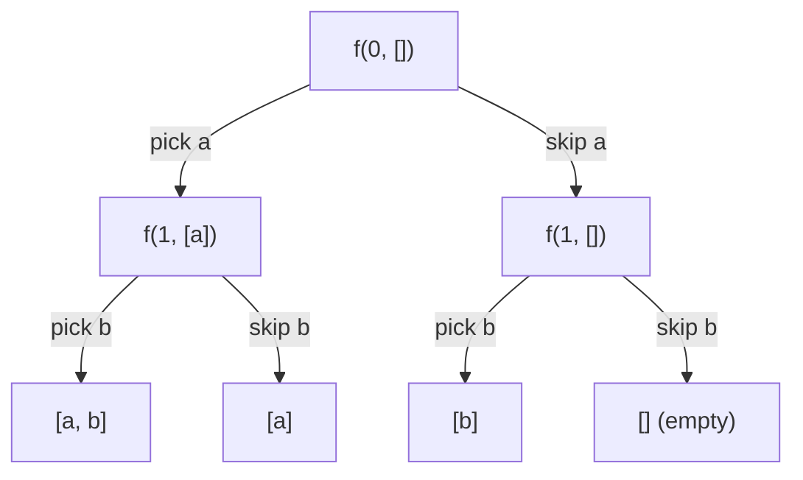
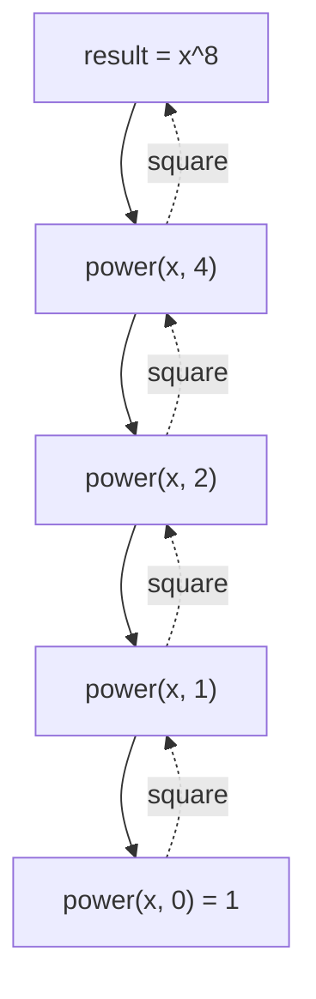
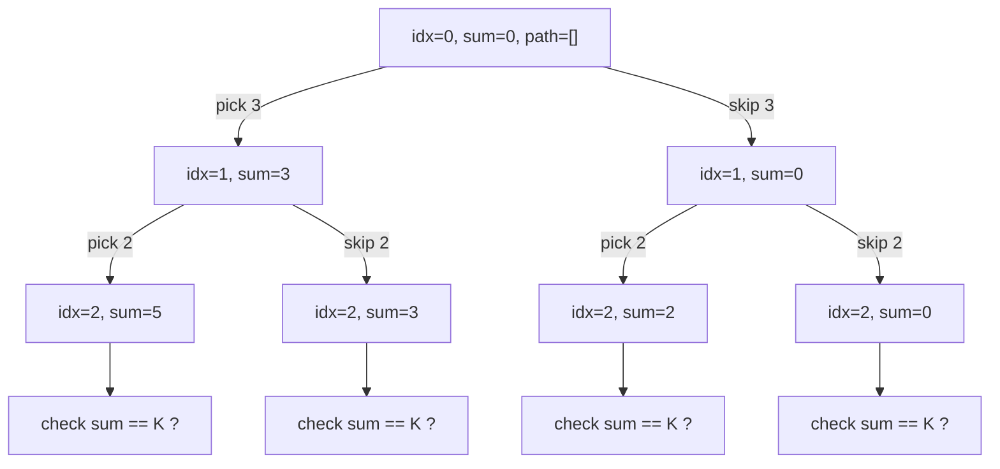
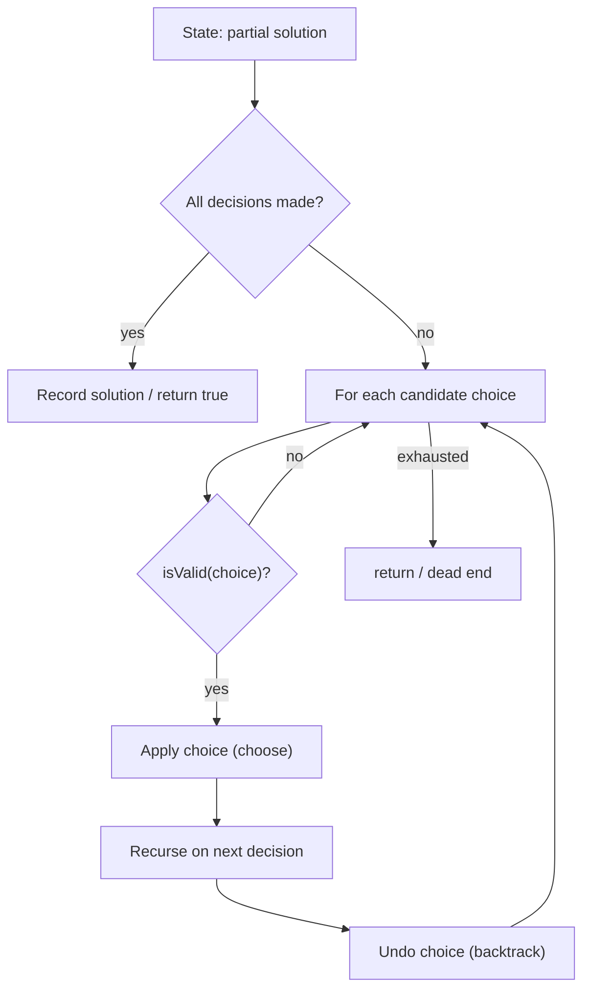

# Step 7: Recursion [PatternWise]

> Master recursion by *patterns* — recursion trees, pick / not-pick, subsequence generation, the universal backtracking template, and combinatorial search — the engine behind DP, trees, graphs, and constraint solving.

**Stats:** 25 problems total — 🟢 4 Easy · 🟡 13 Medium · 🔴 8 Hard

---

## 📌 Overview & Why It Matters

**Recursion** is a function calling itself on a smaller instance of the same problem until it reaches a *base case*. **Backtracking** is recursion that *builds a partial candidate, explores it, then undoes the choice* to try alternatives — a depth-first search over a tree of decisions.

Why it dominates interviews:

- It is the **foundation of half the syllabus**: DP is memoized recursion, trees/graphs are recursive traversals, divide-and-conquer (merge/quick sort) is recursion.
- Interviewers use it to test whether you can **model a problem as a decision tree** and reason about the **call stack**.
- Backtracking is the go-to for *"generate all / find all / is there a valid arrangement"* problems: subsets, permutations, N-Queens, Sudoku, word search.

**Prerequisites:** functions & the call stack, arrays/strings, basic complexity analysis. Comfort with the idea that each recursive call has its **own local frame** but can share a **mutable path/state** via references.

**Signal words that scream recursion/backtracking:** *"generate all", "print every", "count the number of ways", "find all valid ...", "does there exist a ...", partitioning, placing, coloring, choosing.*

---

## 🧠 Core Concepts

Every recursive solution has three parts:

1. **Base case** — the smallest input where the answer is known directly (stops infinite recursion).
2. **Recursive relation** — express the answer in terms of a smaller sub-problem.
3. **State** — parameters that shrink toward the base case (index, remaining sum, current path).

The mental model is a **recursion tree**: each node is a call, each edge is a choice. The number of leaves ≈ number of full candidates; the depth ≈ length of a decision.

The single most important backtracking idea is **choose → explore → un-choose**:

```
add the choice to the path        # choose
recurse                           # explore
remove the choice from the path   # un-choose (backtrack)
```

Because we undo on the way up, one shared mutable `path` represents the entire tree — no per-node copying.

### Recursion tree for "pick / not-pick" on `[a, b]`



Two choices per element over `n` elements ⇒ `2^n` leaves ⇒ the power set. This binary "include-or-exclude" tree is the skeleton of subsequences, subset-sum, and combination problems.

---

## 🔑 Patterns & Approaches

### 1. Get a Strong Hold — Functional Recursion & Divide-and-Conquer

**When to use / recognition signals:** Problems that reduce to a *single* smaller sub-problem returning a value (`pow`, `atoi`, digit counting), or that must manipulate a data structure (stack) **without extra data structures** — the call stack *is* your auxiliary storage. Look for *"implement X recursively"*, *"without loops/extra space"*, huge exponents needing `O(log n)`.

**Approach, step by step:**

- **Pow(x, n):** binary/fast exponentiation. `x^n = (x^(n/2))^2` if `n` even, `x * x^(n-1)` if odd. Handle negative `n` via `x → 1/x, n → -n`; guard `INT_MIN` by using `long`.
- **atoi:** recurse over characters — skip leading spaces, capture sign, accumulate `result = result*10 + digit`, and clamp to `[INT_MIN, INT_MAX]` on overflow.
- **Count Good Numbers:** even indices (0-based) need even digits (5 choices), odd indices need primes 2/3/5/7 (4 choices). Answer = `5^(ceil(n/2)) * 4^(floor(n/2)) mod 1e9+7` — use **fast modular exponentiation**.
- **Sort a stack / Reverse a stack:** pop the top, recurse to sort/reverse the rest, then a helper `insertInSortedOrder` / `insertAtBottom` places the held element back — no auxiliary array; recursion holds the elements in stack frames.



**Complexity:** Pow / Count Good Numbers `O(log n)` time, `O(log n)` stack. Sort/Reverse stack `O(n^2)` time (each of n elements re-inserted through up to n frames), `O(n)` stack.

**Reusable template — fast exponentiation (the backbone of Pow & Count Good Numbers):**

```cpp
// Modular fast exponentiation. Drop the % MOD lines for plain pow.
long long power(long long x, long long n, long long MOD = 1e9 + 7) {
    if (n == 0) return 1;                 // base case
    long long half = power(x, n / 2, MOD);
    long long sq = (half * half) % MOD;   // (x^(n/2))^2
    if (n % 2 == 1) sq = (sq * (x % MOD)) % MOD;  // one extra x if odd
    return sq;
}

// Insert-at-bottom helper — the pattern for reversing/sorting a stack.
void insertAtBottom(stack<int>& st, int val) {
    if (st.empty()) { st.push(val); return; }
    int top = st.top(); st.pop();
    insertAtBottom(st, val);
    st.push(top);                          // restore on the way back up
}
```

| # | Problem | Difficulty | Practice |
|---|---------|------------|----------|
| 1 | Recursive Implementation of atoi() | 🟡 Medium | [LeetCode](https://leetcode.com/problems/string-to-integer-atoi/) |
| 2 | Pow(x, n) | 🟢 Easy | [LeetCode](https://leetcode.com/problems/powx-n/) · [🎥](https://youtu.be/l0YC3876qxg) |
| 3 | Count Good Numbers | 🟡 Medium | [LeetCode](https://leetcode.com/problems/count-good-numbers/) |
| 4 | Sort a stack using recursion | 🟡 Medium | [Article](https://takeuforward.org/data-structure/sort-a-stack) |
| 5 | Reverse a Stack | 🟡 Medium | [Article](https://takeuforward.org/data-structure/reverse-a-stack-using-recursion) |

**Edge cases & gotchas:** Pow — `n = INT_MIN` (negating overflows `int`; use `long`), `n = 0` → 1, `x = 0`. atoi — leading spaces, `+/-` sign, overflow clamping, non-digit termination. Fast-pow — remember to `% MOD` the *base* too. Stack recursion — never introduce an auxiliary array (defeats the exercise).

---

### 2. Subsequences Pattern — Pick / Not-Pick & Combinatorial Generation

**When to use / recognition signals:** *"all subsequences/subsets", "power set", "count/check subsequences with sum K", "all combinations summing to target", "letter combinations"*. Whenever each element can be **included or excluded**, or you must **try each candidate from an index onward**, this is your pattern.

**Approach, step by step (two canonical shapes):**

**A. Pick / Not-Pick (fixed number of elements, binary choice each):** at index `i`, branch twice — include `nums[i]` in the path then recurse to `i+1`, or skip it and recurse to `i+1`. Base case at `i == n` records/counts the path. This is the natural fit for **all subsequences, subset-sum count/existence, binary strings, power set**.

**B. For-loop "start index" (variable length, avoid permutation duplicates):** iterate `j = start..n-1`, pick `nums[j]`, recurse from `j` (reuse allowed, e.g. Combination Sum) or `j+1` (each used once, e.g. Subsets/Combination Sum II), then pop. Skipping duplicates: sort, and inside the loop `if (j > start && nums[j] == nums[j-1]) continue;`.

**Handling constraints:** for sum problems, pass `remaining = target - nums[i]` and prune when it goes negative; for early-exit existence, return `true` as soon as one branch succeeds (short-circuit).



**Complexity:** subsets / power set `O(2^n * n)` (2^n subsets, `O(n)` to copy each). Combination Sum family `O(2^t * k)`-ish depending on target/branching. Letter Combinations `O(4^n * n)` (up to 4 letters per digit). Space `O(n)` recursion depth + output.

**Reusable template — the pick/not-pick + start-index hybrid:**

```cpp
// Generic "generate all combinations" (subsets, subset-sum, comb-sum).
// - reuseAllowed = true  -> recurse(i) (Combination Sum)
// - reuseAllowed = false -> recurse(i+1) (Subsets, Combination Sum II)
void solve(int start, vector<int>& nums, vector<int>& path,
           vector<vector<int>>& ans, bool reuseAllowed) {
    ans.push_back(path);                    // every node is a valid subset
    for (int j = start; j < (int)nums.size(); j++) {
        if (j > start && nums[j] == nums[j - 1]) continue;  // skip dup (sorted)
        path.push_back(nums[j]);            // choose
        solve(reuseAllowed ? j : j + 1, nums, path, ans, reuseAllowed);  // explore
        path.pop_back();                    // un-choose (backtrack)
    }
}

// Pure pick / not-pick — count subsequences with sum K.
int countSubseq(int i, int target, vector<int>& a) {
    if (target == 0) return 1;
    if (i == (int)a.size() || target < 0) return 0;
    int pick    = countSubseq(i + 1, target - a[i], a);   // include a[i]
    int notPick = countSubseq(i + 1, target, a);          // exclude a[i]
    return pick + notPick;
}
```

| # | Problem | Difficulty | Practice |
|---|---------|------------|----------|
| 1 | Generate Binary Strings Without Consecutive 1s | 🟡 Medium | [Article](https://takeuforward.org/data-structure/generate-all-binary-strings) |
| 2 | Generate Parentheses | 🟡 Medium | [LeetCode](https://leetcode.com/problems/generate-parentheses/) |
| 3 | Power Set | 🟡 Medium | [Article](https://takeuforward.org/data-structure/power-set-print-all-the-possible-subsequences-of-the-string/) · [🎥](https://www.youtube.com/watch?v=b7AYbpM5YrE&list=PLgUwDviBIf0p4ozDR_kJJkONnb1wdx2Ma&index=67) |
| 4 | Learn All Patterns of Subsequences (Theory) | 🟢 Easy | [Article](https://takeuforward.org/data-structure/learn-all-patterns-of-subsequences-theory) · [🎥](https://www.youtube.com/watch?v=eQCS_v3bw0Q&list=PLgUwDviBIf0rGlzIn_7rsaR2FQ5e6ZOL9&index=7) |
| 5 | Count all subsequences with sum K | 🟢 Easy | [Article](https://takeuforward.org/data-structure/count-all-subsequences-with-sum-k) |
| 6 | Check if there exists a subsequence with sum K | 🟢 Easy | [Article](https://takeuforward.org/data-structure/check-if-there-exists-a-subsequence-with-sum-k) |
| 7 | Combination Sum | 🟡 Medium | [LeetCode](https://leetcode.com/problems/combination-sum/) · [🎥](https://www.youtube.com/watch?v=OyZFFqQtu98&list=PLgUwDviBIf0p4ozDR_kJJkONnb1wdx2Ma&index=49) |
| 8 | Combination Sum II | 🟡 Medium | [LeetCode](https://leetcode.com/problems/combination-sum-ii/) · [🎥](https://www.youtube.com/watch?v=G1fRTGRxXU8&list=PLgUwDviBIf0p4ozDR_kJJkONnb1wdx2Ma&index=50) |
| 9 | Subsets I | 🟡 Medium | [Article](https://takeuforward.org/data-structure/subset-sum-sum-of-all-subsets/) · [🎥](https://www.youtube.com/watch?v=rYkfBRtMJr8&list=PLgUwDviBIf0p4ozDR_kJJkONnb1wdx2Ma&index=52) |
| 10 | Subsets II | 🟡 Medium | [LeetCode](https://leetcode.com/problems/subsets-ii/) · [🎥](https://www.youtube.com/watch?v=RIn3gOkbhQE&list=PLgUwDviBIf0p4ozDR_kJJkONnb1wdx2Ma&index=53) |
| 11 | Combination Sum III | 🟡 Medium | [LeetCode](https://leetcode.com/problems/combination-sum-iii/) |
| 12 | Letter Combinations of a Phone Number | 🔴 Hard | [LeetCode](https://leetcode.com/problems/letter-combinations-of-a-phone-number/) |

**Edge cases & gotchas:** Empty subset must be counted in the power set. **Duplicates** — sort first, then skip `nums[j]==nums[j-1]` *only when `j>start`* (skipping at `j==start` would drop valid picks). Combination Sum reuses an element (`recurse(j)`), Combination Sum II does not (`recurse(j+1)`) and must dedup. Generate Parentheses: only add `)` when `close < open`, add `(` when `open < n`. Always `pop_back` after recursing (classic bug: forgetting to un-choose).

---

### 3. Trying out all Combos / Hard — Backtracking & Constraint Satisfaction

**When to use / recognition signals:** *"place N queens", "color the graph with M colors", "solve the Sudoku", "find a path in a maze", "partition into palindromes", "does the string break into dictionary words", "add operators to reach a target"*. These are **constraint-satisfaction / search** problems: build a candidate cell-by-cell (or char-by-char), validate constraints, prune invalid branches early, and backtrack.

**Approach, step by step (universal backtracking):**

1. **State:** what has been decided so far (board, path, index, used[]).
2. **Choices:** enumerate options for the *next* decision point (next queen row, next number in a Sudoku cell, next direction in the maze, next cut in the string).
3. **isValid / prune:** reject choices that violate constraints *before* recursing (a queen not attacked, a color not used by neighbors, a palindrome slice). Early pruning is what makes exponential search tractable.
4. **Recurse** into the choice; if it leads to a solution, record it (or return `true` for "find one").
5. **Un-choose** (reset the board cell / pop the path) and try the next option.



**Complexity (worst case):** N-Queens `O(N!)`; Sudoku `O(9^(empty cells))` pruned heavily; M-Coloring `O(M^V)`; Word Search `O(N * 3^L)` (N cells, L word length, 3 unvisited neighbors); Rat in a Maze `O(4^(n*n))`; Palindrome Partitioning `O(2^n * n)`; Word Break `O(2^n)` (memoize → `O(n^2)`); Expression Add Operators `O(4^n)`. Space is `O(depth)` recursion plus the board/visited structures.

**Reusable template — universal backtracking (N-Queens shape):**

```cpp
void backtrack(State& s, Result& res) {
    if (isComplete(s)) {                    // all decisions made
        res.record(s);                      // or: found = true; return;
        return;
    }
    for (auto& choice : candidates(s)) {    // enumerate next options
        if (!isValid(s, choice)) continue;  // prune early
        apply(s, choice);                   // choose
        backtrack(s, res);                  // explore
        undo(s, choice);                    // un-choose (backtrack)
    }
}

// Concrete N-Queens: try one queen per column.
void solveNQ(int col, int n, vector<int>& pos,
             vector<bool>& row, vector<bool>& diag, vector<bool>& anti,
             vector<vector<int>>& ans) {
    if (col == n) { ans.push_back(pos); return; }
    for (int r = 0; r < n; r++) {
        if (row[r] || diag[r + col] || anti[r - col + n - 1]) continue; // attacked?
        row[r] = diag[r + col] = anti[r - col + n - 1] = true;          // choose
        pos.push_back(r);
        solveNQ(col + 1, n, pos, row, diag, anti, ans);                 // explore
        pos.pop_back();
        row[r] = diag[r + col] = anti[r - col + n - 1] = false;         // backtrack
    }
}
```

| # | Problem | Difficulty | Practice |
|---|---------|------------|----------|
| 1 | Palindrome partitioning | 🔴 Hard | [Article](/plus/dsa/problems/palindrome-partitioning?tab=editorial) · [🎥](https://youtu.be/_H8V5hJUGd0) |
| 2 | Word Search | 🔴 Hard | [LeetCode](https://leetcode.com/problems/word-search/) |
| 3 | N Queen | 🔴 Hard | [LeetCode](https://leetcode.com/problems/n-queens/) · [🎥](https://www.youtube.com/watch?v=i05Ju7AftcM&list=PLgUwDviBIf0p4ozDR_kJJkONnb1wdx2Ma&index=57) |
| 4 | Rat in a Maze | 🔴 Hard | [Article](https://takeuforward.org/data-structure/rat-in-a-maze/) · [🎥](https://www.youtube.com/watch?v=bLGZhJlt4y0&list=PLgUwDviBIf0p4ozDR_kJJkONnb1wdx2Ma&index=60) |
| 5 | Word Break | 🟡 Medium | [Article](/plus/dsa/problems/word-break?tab=editorial) |
| 6 | M Coloring Problem | 🔴 Hard | [Article](https://takeuforward.org/data-structure/m-coloring-problem/) · [🎥](https://www.youtube.com/watch?v=wuVwUK25Rfc&list=PLgUwDviBIf0p4ozDR_kJJkONnb1wdx2Ma&index=59) |
| 7 | Sudoku Solver | 🔴 Hard | [LeetCode](https://leetcode.com/problems/sudoku-solver/) · [🎥](https://www.youtube.com/watch?v=FWAIf_EVUKE&list=PLgUwDviBIf0p4ozDR_kJJkONnb1wdx2Ma&index=58) |
| 8 | Expression Add Operators | 🔴 Hard | [LeetCode](https://leetcode.com/problems/expression-add-operators/) |

**Edge cases & gotchas:** Word Search — mark a cell visited before recursing and **restore it after** (in-place `'#'` sentinel), respect grid bounds. Sudoku — validate row/col/3×3 box; return `true` up the chain to stop once solved. Rat in Maze — mark visited to avoid cycles, follow a fixed direction order for lexicographic paths. Palindrome Partitioning — check `isPalindrome(start, i)` before cutting. Word Break — **memoize** on start index or you TLE. Expression Add Operators — track the **previous operand** to correctly undo for `*` precedence, and guard against numbers with leading zeros. Constraint arrays (attacked diagonals, used colors) must be reset on backtrack.

---

## ❓ Regularly Asked Interview Questions

**Q: What are the three essential components of any recursive function?**
**A:** A base case (stops recursion), a recursive case (calls itself on a smaller input), and state that provably moves toward the base case. Missing or wrong base case → stack overflow.

**Q: What is the difference between recursion and backtracking?**
**A:** All backtracking is recursion, but backtracking adds the discipline of *undoing* a choice after exploring it, so a single mutable state can represent the entire search tree. Plain recursion (e.g. `pow`) just returns a value from a smaller sub-problem.

**Q: Explain "choose → explore → un-choose".**
**A:** Add a candidate to the current partial solution, recurse to extend it, then remove the candidate before trying the next one. The un-choose step guarantees the parent frame sees the exact state it had before the child ran.

**Q: How do you decide the recursion tree's branching and depth?**
**A:** Branching = number of choices at each step (2 for pick/not-pick, k for k candidates); depth = number of decisions to make (n elements, board columns, string length). Leaves ≈ number of complete candidates.

**Q: How do you generate all subsets, and what's the complexity?**
**A:** Either pick/not-pick each element (`2^n` leaves) or a start-index for-loop that records the path at every node. `O(2^n * n)` time to build and copy, `O(n)` recursion depth.

**Q: How do you handle duplicates in Subsets II / Combination Sum II?**
**A:** Sort the array, and inside the choice loop skip an element when it equals the previous one *and it's not the first pick at this level* (`j > start && nums[j] == nums[j-1]`). This avoids generating the same combination twice.

**Q: When do you recurse with `i` versus `i+1` in combination problems?**
**A:** `i` (same index) when an element may be reused (Combination Sum); `i+1` when each element is used at most once (Subsets, Combination Sum II, Combination Sum III).

**Q: Why is fast exponentiation `O(log n)` and how does it work?**
**A:** `x^n = (x^(n/2))^2`, halving the exponent each call, giving `log n` recursive levels. Multiply an extra `x` when `n` is odd. Essential for `Pow(x,n)` and modular counting like Count Good Numbers.

**Q: How would you solve N-Queens efficiently?**
**A:** Place one queen per column; track attacked rows and both diagonals with boolean arrays (`diag = row+col`, `anti = row-col+n-1`) for O(1) validity checks. Backtrack when a column has no safe row.

**Q: How would you approach Word Search on a grid?**
**A:** DFS from every cell that matches the first character; at each step mark the cell visited (temporarily overwrite it), explore the 4 neighbors for the next character, then restore the cell on backtrack. Prune on bounds and mismatches.

**Q: Why does naive Word Break TLE and how do you fix it?**
**A:** It re-solves the same suffixes exponentially. Memoize on the start index (or use bottom-up DP) to make it `O(n^2)` given O(1) dictionary lookups.

**Q: How do you avoid recomputation in recursion generally?**
**A:** Memoization — cache results keyed by the state parameters (e.g. index, remaining sum). This is exactly the bridge from recursion to dynamic programming.

**Q: What causes a stack overflow and how do you mitigate it?**
**A:** Missing/incorrect base case, or recursion depth exceeding the stack (deep inputs). Fix the base case, convert tail recursion to iteration, or use an explicit stack for very deep trees.

**Q: How do you reason about the space complexity of a recursive algorithm?**
**A:** It's the maximum recursion depth × per-frame size, plus any output/auxiliary structures. For most backtracking it's `O(depth)` for the call stack plus the size of the path/board.

---

## 💡 Interview Tips & Common Mistakes

- **Always state the base case first** out loud — it frames the whole solution and reassures the interviewer.
- **Draw the recursion tree** on 2–3 elements before coding; it exposes the branching factor and duplicate handling.
- **Never forget to un-choose** (`pop_back` / reset the cell / clear the boolean) — the #1 backtracking bug.
- **Prune early.** Check validity *before* recursing (negative remaining sum, attacked square) — this is the difference between AC and TLE.
- **Sort to dedup.** Sorting enables the `nums[j]==nums[j-1] && j>start` skip and monotonic pruning.
- **Copy the path only at leaves/records**, not at every call, to control the `* n` factor.
- **Pass big state by reference**, not by value, or you silently blow up memory and time.
- **Guard integer overflow** in Pow/atoi (`INT_MIN` negation, use `long`), and remember `% MOD` on the base in modular power.
- **Memoize** when the same state recurs (Word Break, subset-sum counting) — recognize when recursion has become DP.
- **For "find one" vs "find all":** return `bool` and short-circuit for existence (Sudoku, subseq exists); collect into a result list for enumeration.

---

## 🐟 Revision Cheat-Sheet

| Pattern | Key Idea | Time | Space | Signature problem |
|---------|----------|------|-------|-------------------|
| Functional recursion & D&C | One smaller sub-problem returns a value; `x^n=(x^(n/2))^2` | `O(log n)` (fast pow) | `O(log n)` stack | Pow(x, n) |
| Stack via recursion | Call stack holds elements; insert-at-bottom on return | `O(n^2)` | `O(n)` stack | Reverse / Sort a stack |
| Pick / Not-Pick subsequences | Include or exclude each element → `2^n` branches | `O(2^n · n)` | `O(n)` depth | Power Set / Count subseq sum K |
| Start-index combinations | For-loop from `start`; recurse `i`(reuse) or `i+1`; sort+skip dup | `O(2^n · n)` | `O(n)` depth | Subsets II / Combination Sum |
| Backtracking (constraint search) | choose → validate/prune → explore → un-choose | `O(k^depth)` (pruned) | `O(depth)` + board | N-Queens / Sudoku Solver |

---

## 🔗 References & Further Reading

- **Striver A2Z — Step 7: Recursion (takeuforward):** https://takeuforward.org/strivers-a2z-dsa-course/strivers-a2z-dsa-course-sheet-2/
- **GeeksforGeeks — Recursion Interview Questions:** https://www.geeksforgeeks.org/dsa/commonly-asked-data-structure-interview-questions-on-recursion/
- **GeeksforGeeks — Backtracking Interview Questions:** https://www.geeksforgeeks.org/dsa/commonly-asked-data-structure-interview-questions-on-backtracking/
- **LeetCode Discuss — Backtracking Cheat Sheet (Basics to Advanced):** https://leetcode.com/discuss/post/6164330/Backtracking-Cheat-Sheet-in-Java-(From-Basics-to-Advanced)/
- **LeetCode Discuss — One Stop Guide to Backtracking:** https://leetcode.com/discuss/post/5711159/One-stop-guide-to-Backtracking/
- **StealthInterview — Backtracking Pattern, Template & 105 Problems:** https://www.stealthinterview.ai/leetcode/patterns/backtracking
- **Substack — Backtracking Template: Subsets, Permutations, Combination Sum:** https://paulepps.substack.com/p/backtracking-template-subsets-permutations
- **Devinterview — 35 Essential Backtracking Interview Questions:** https://devinterview.io/blog/backtracking-algorithms-interview-questions
