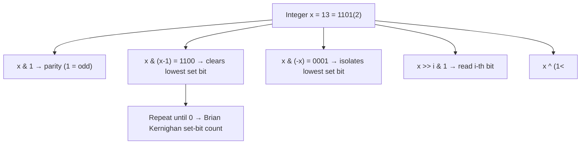
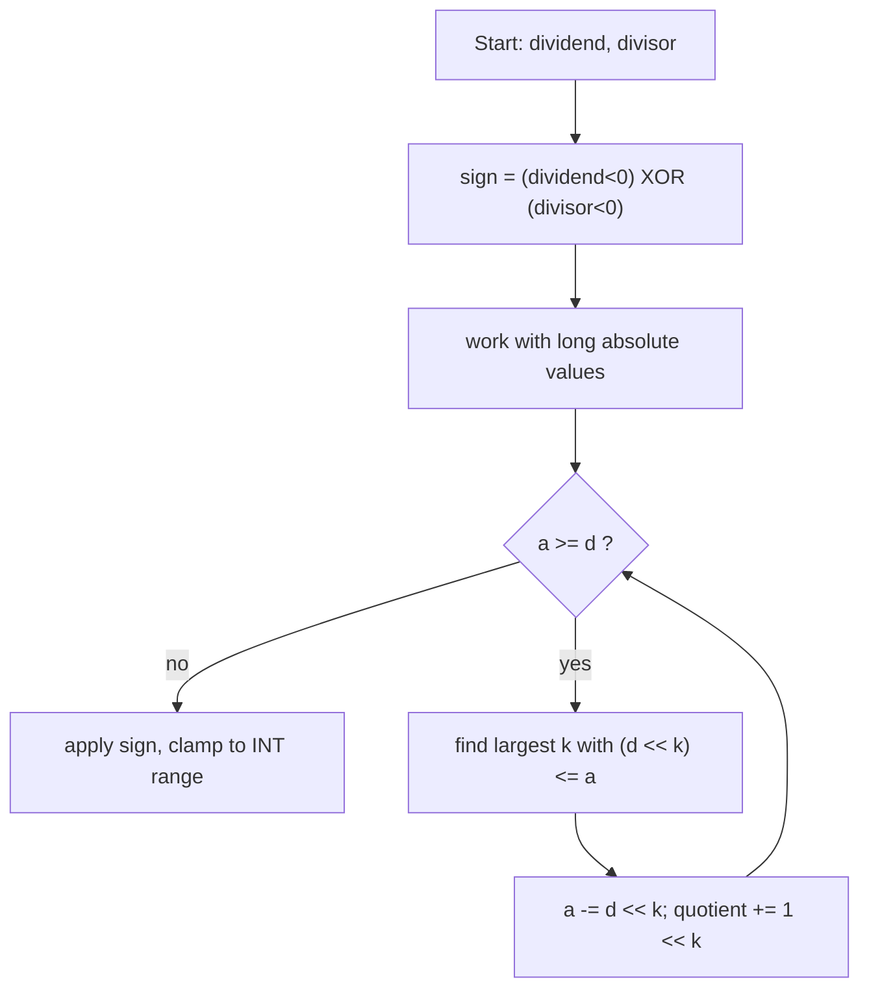
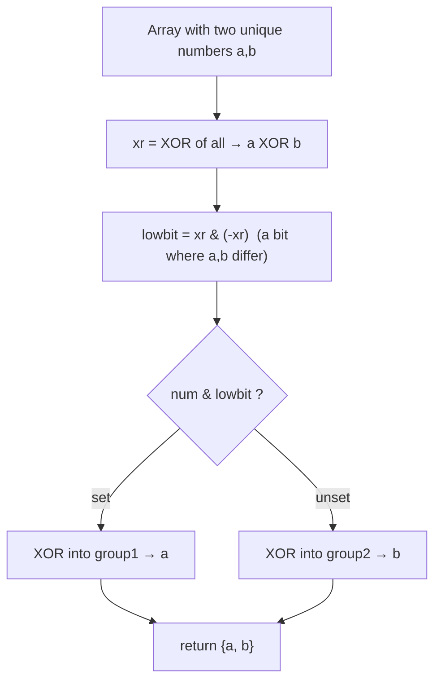
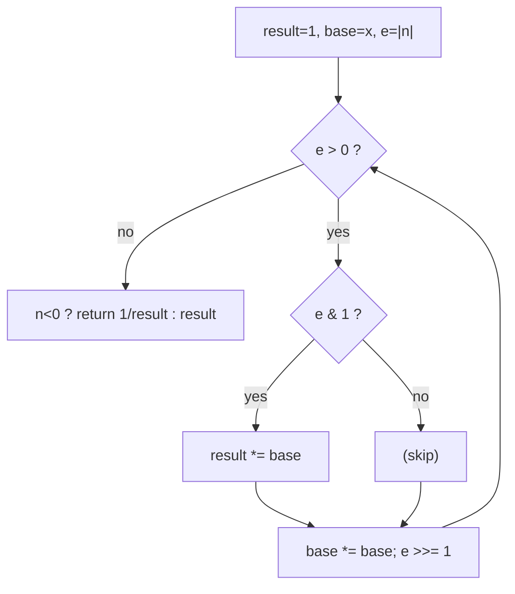

# Step 8: Bit Manipulation [Concepts & Problems]

Master bit tricks, XOR patterns, set/clear/toggle operations, power-set enumeration, and number-theory-with-bits to write blazing-fast `O(1)`/`O(31)` solutions that impress interviewers.

**Stats:** 18 problems total — 🟢 8 Easy · 🟡 7 Medium · 🔴 3 Hard

---

## 📌 Overview & Why It Matters

**Bit manipulation** is the art of operating directly on the binary representation of integers using bitwise operators (`&`, `|`, `^`, `~`, `<<`, `>>`). Because these map to single CPU instructions, they turn many `O(n)` or `O(log n)` operations into `O(1)`.

Where it shows up in interviews:
- **Micro-optimizations**: multiply/divide by powers of 2, parity checks, `power of two` detection.
- **XOR magic**: finding the unique element among duplicates, swapping without temp, parity of a set — a recurring FAANG favorite.
- **State compression**: representing subsets of ≤ 20 elements as an integer bitmask (power set, bitmask DP, Travelling Salesman).
- **Number theory**: fast exponentiation (`pow(x,n)` via binary exponentiation), divisor/prime enumeration, sieve — often blended with bit tricks.

**Prerequisites:** binary number system, two's complement (how negatives are stored), basic loops/recursion, and modular arithmetic for the number-theory problems.

> **Golden identities:** `x ^ 0 = x`, `x ^ x = 0`, XOR is commutative & associative → *same bits cancel, different bits survive*.

---

## 🧠 Core Concepts

The six operators and their canonical uses:

| Operator | Symbol | Key use |
|---|---|---|
| AND | `&` | test/clear bits, mask, `x & 1` = parity |
| OR | `\|` | set bits |
| XOR | `^` | toggle bits, cancel duplicates, swap |
| NOT | `~` | invert all bits (`~x = -x - 1`) |
| Left shift | `<<` | `x << k` = `x * 2^k` |
| Right shift | `>>` | `x >> k` = `x / 2^k` (arithmetic for signed) |

The essential toolkit (memorize these):

| Trick | Expression |
|---|---|
| i-th bit set? | `(x >> i) & 1` |
| Set i-th bit | `x \| (1 << i)` |
| Clear i-th bit | `x & ~(1 << i)` |
| Toggle i-th bit | `x ^ (1 << i)` |
| Lowest set bit | `x & (-x)` |
| Clear lowest set bit | `x & (x - 1)` |
| Is power of two? | `x > 0 && (x & (x - 1)) == 0` |
| Count set bits | Brian Kernighan: loop `x &= (x-1)` |



> **Two's complement note:** `-x == ~x + 1`. That is why `x & (-x)` isolates the lowest set bit: `-x` flips every bit above the lowest set bit and keeps it aligned.

---

## 🔑 Patterns & Approaches

### 1. Learn Bit Manipulation (Fundamentals & Tricks)

**When to use / recognition signals:** Any problem mentioning "i-th bit", "power of 2", "count 1s", "swap without extra variable", "odd/even", or division/multiplication that forbids arithmetic operators. These are the building blocks reused everywhere else.

**Approach (step-by-step):**
- **Read bit i:** shift `x` right by `i`, mask with `1` → `(x >> i) & 1`.
- **Set / clear / toggle bit i:** use `1 << i` as a mask with `|`, `& ~`, `^`.
- **Odd check:** `x & 1` (LSB is 1 ⇔ odd).
- **Power of 2:** a power of two has exactly one set bit, so `x & (x-1) == 0` and `x > 0`.
- **Count set bits (Brian Kernighan):** repeatedly do `x &= (x-1)`; each step removes one set bit, so it loops exactly *popcount* times.
- **Set the rightmost unset bit:** `x | (x+1)` flips the lowest `0` to `1`.
- **Swap two numbers (no temp):** `a ^= b; b ^= a; a ^= b;`.
- **Divide without `* / %`:** binary long division — subtract the largest shifted divisor repeatedly, accumulating the quotient via shifted powers of two; handle sign and `INT_MIN` overflow.



**Complexity:** all single-bit tricks are `O(1)`. Set-bit count is `O(number of set bits) ≤ O(31)`. Divide is `O(log(dividend))` because the quotient doubles each outer step.

**Reusable template (C++):**
```cpp
// --- Core bit toolkit ---
bool isBitSet(int x, int i)  { return (x >> i) & 1; }
int  setBit   (int x, int i) { return x |  (1 << i); }
int  clearBit (int x, int i) { return x & ~(1 << i); }
int  toggleBit(int x, int i) { return x ^  (1 << i); }
bool isOdd    (int x)        { return x & 1; }
bool isPow2   (int x)        { return x > 0 && (x & (x - 1)) == 0; }

int countSetBits(int x) {        // Brian Kernighan — O(popcount)
    int cnt = 0;
    while (x) { x &= (x - 1); cnt++; }
    return cnt;
}

void swapNoTemp(int &a, int &b) { a ^= b; b ^= a; a ^= b; }

int divide(int dividend, int divisor) {           // no * / %
    if (dividend == INT_MIN && divisor == -1) return INT_MAX; // overflow
    bool neg = (dividend < 0) ^ (divisor < 0);
    long a = labs((long)dividend), d = labs((long)divisor), q = 0;
    while (a >= d) {
        long temp = d, m = 1;
        while (a >= (temp << 1)) { temp <<= 1; m <<= 1; }
        a -= temp; q += m;
    }
    return neg ? -q : q;
}
```

**Edge cases & gotchas:**
- `1 << 31` overflows a 32-bit `int`; use `1u << i` or `1LL << i` for high bits.
- `x & (x-1) == 0` alone is *true for 0* — always add `x > 0` for the power-of-two test.
- Right shift of negatives is implementation-defined/arithmetic; prefer `unsigned` when counting bits of negatives.
- `divide`: only overflow case is `INT_MIN / -1` → clamp to `INT_MAX`.

| # | Problem | Difficulty | Practice |
|---|---------|------------|----------|
| 1 | Introduction to Bits and Tricks | 🟢 Easy | [Article](https://takeuforward.org/data-structure/introduction-to-bit-manipulation-theory) · [🎥](https://youtu.be/qQd-ViW7bfk?si=QtdNaRhHmZb08Mr8) |
| 2 | Check if the i-th bit is Set or Not | 🟢 Easy | [Article](https://takeuforward.org/data-structure/check-if-the-i-th-bit-is-set-or-not) · [🎥](https://youtu.be/nttpF8kwgd4?si=x9o8PsYaA2XVZ9rV) |
| 3 | Check if a Number is Odd or Not | 🟢 Easy | [Article](https://takeuforward.org/data-structure/check-if-a-number-is-odd-or-not) · [🎥](https://youtu.be/nttpF8kwgd4?si=x9o8PsYaA2XVZ9rV) |
| 4 | Check if a Number is Power of 2 or Not | 🟢 Easy | [LeetCode](https://leetcode.com/problems/power-of-two/) · [🎥](https://youtu.be/nttpF8kwgd4?si=x9o8PsYaA2XVZ9rV) |
| 5 | Count the Number of Set Bits | 🟢 Easy | [Article](https://takeuforward.org/data-structure/count-the-number-of-set-bits) · [🎥](https://youtu.be/nttpF8kwgd4?si=x9o8PsYaA2XVZ9rV) |
| 6 | Set/Unset the rightmost unset bit | 🟢 Easy | [Article](https://takeuforward.org/data-structure/set-the-rightmost-bit) · [🎥](https://youtu.be/nttpF8kwgd4?si=x9o8PsYaA2XVZ9rV) |
| 7 | Swap Two Numbers | 🟢 Easy | [Article](https://takeuforward.org/data-structure/swap-two-numbers) · [🎥](https://youtu.be/nttpF8kwgd4?si=x9o8PsYaA2XVZ9rV) |
| 8 | Divide two numbers without multiplication and division | 🟡 Medium | [LeetCode](https://leetcode.com/problems/divide-two-integers/) · [🎥](https://youtu.be/pBD4B1tzgVc?si=G9c5pEE-RrzeU6sz) |

---

### 2. Interview Problems (XOR Patterns, Bit Flips & Power Set)

**When to use / recognition signals:** "every element appears twice except one", "two numbers appear once", "minimum flips to convert A → B", "generate all subsets", or "XOR of a range `[L,R]`". Whenever duplicates should cancel or you need to enumerate subsets, reach for XOR / bitmask.

**Approach (step-by-step):**
- **Minimum Bit Flips (A → B):** `A ^ B` sets a bit wherever they differ; the answer is `popcount(A ^ B)`.
- **Single Number I** (all twice, one once): XOR the whole array — pairs cancel (`x^x=0`), leaving the unique value.
- **Single Number III** (two uniques): XOR all → `xr = a ^ b`. Pick any set bit (`lowest = xr & -xr`), partition numbers by that bit, XOR each group separately to recover `a` and `b`.
- **Power Set (subsets):** for `n` elements there are `2^n` masks `0…2^n-1`; bit `j` of the mask decides whether element `j` is included.
- **XOR of range `[L,R]`:** use `xorTill(n)` with the pattern based on `n % 4` (`n, 1, n+1, 0`), then answer = `xorTill(R) ^ xorTill(L-1)`.



**Complexity:** all XOR scans are `O(n)` time, `O(1)` space. Power set is `O(n · 2^n)` time / `O(2^n)` output. `xorTill` is `O(1)` per query.

**Reusable template (C++):**
```cpp
int minBitFlips(int a, int b) { return __builtin_popcount(a ^ b); }

int singleNumberI(vector<int>& nums) {
    int xr = 0; for (int x : nums) xr ^= x; return xr;
}

vector<int> singleNumberIII(vector<int>& nums) {
    long xr = 0; for (int x : nums) xr ^= x;   // xr = a ^ b
    int low = xr & (-xr);                       // a differing bit
    int a = 0, b = 0;
    for (int x : nums) (x & low) ? a ^= x : b ^= x;
    return {a, b};
}

vector<vector<int>> powerSet(vector<int>& nums) {
    int n = nums.size();
    vector<vector<int>> res;
    for (int mask = 0; mask < (1 << n); ++mask) {
        vector<int> sub;
        for (int j = 0; j < n; ++j)
            if (mask & (1 << j)) sub.push_back(nums[j]);
        res.push_back(sub);
    }
    return res;
}

int xorTill(int n) {                 // XOR of 0..n
    switch (n % 4) { case 0: return n; case 1: return 1;
                     case 2: return n + 1; default: return 0; }
}
int xorRange(int L, int R) { return xorTill(R) ^ xorTill(L - 1); }
```

**Edge cases & gotchas:**
- Single Number III: `xr & -xr` needs a 64-bit `xr` if `a ^ b` could equal `INT_MIN`; using `long` avoids UB.
- Power set order depends on iteration; if the empty set must appear, `mask = 0` already covers it.
- `xorRange`: `xorTill(L-1)` with `L = 0` → `xorTill(-1)`; guard `L >= 1` or shift the definition.
- Min bit flips assumes non-negative ints; for negatives count over the full 32-bit width (`__builtin_popcount` on `unsigned`).

| # | Problem | Difficulty | Practice |
|---|---------|------------|----------|
| 1 | Minimum Bit Flips to Convert Number | 🟡 Medium | [LeetCode](https://leetcode.com/problems/minimum-bit-flips-to-convert-number/) · [🎥](https://youtu.be/OOdrmcfZXd8?si=rnkRVz1UiVBKWC69) |
| 2 | Single Number - I | 🟡 Medium | [LeetCode](https://leetcode.com/problems/single-number/) · [🎥](https://youtu.be/bYWLJb3vCWY?t=1369) |
| 3 | Power Set (Bit Manipulation) | 🟡 Medium | [LeetCode](https://leetcode.com/problems/subsets/) · [🎥](https://youtu.be/LqKaUv1G3_I?si=UXU_T5OsHiokPRvP) |
| 4 | XOR of numbers in a given range | 🟡 Medium | [Article](https://takeuforward.org/data-structure/find-xor-of-numbers-from-l-to-r) · [🎥](https://youtu.be/WqGb7159h7Q?si=uGUEbNUUaIN_6Vvr) |
| 5 | Single Number - III | 🟡 Medium | [Article](https://takeuforward.org/data-structure/find-the-two-numbers-appearing-odd-number-of-times) · [🎥](https://youtu.be/UA5JnV1J2sI?si=VFBRJyb3boZvx_r1) |

---

### 3. Advanced Maths (Number Theory with Bits)

**When to use / recognition signals:** "prime factorization", "all divisors", "count primes up to N", or "compute x^n" — number-theory problems that pair naturally with the bit-based **binary exponentiation** and the space-efficient **sieve** (often implemented as a bitset).

**Approach (step-by-step):**
- **Divisors of N:** iterate `i` from `1` to `√N`; if `i | N`, both `i` and `N/i` are divisors. `O(√N)`.
- **Prime factorization (√N):** trial-divide by every `i` up to `√N`, dividing out each factor fully; any remainder > 1 is a prime factor. `O(√N)`.
- **Prime factorization via Smallest Prime Factor (SPF):** precompute an SPF sieve, then factorize any query in `O(log N)` — ideal for many queries.
- **Count primes in `[L,R]`:** Sieve of Eratosthenes marks composites; a **bitset** representation keeps memory tiny. Answer via prefix counts. `O(N log log N)`.
- **`Pow(x,n)` (binary exponentiation):** read the exponent bit by bit — square the base each step, and multiply into the result when the current exponent bit is 1. Handle negative `n` by inverting.



**Complexity:** divisors & √N-factorization → `O(√N)`. Sieve → `O(N log log N)` time, `O(N)` bits space (bitset). Binary exponentiation → `O(log n)` time, `O(1)` space.

**Reusable template (C++):**
```cpp
// Fast power via binary exponentiation — O(log n)
double myPow(double x, long long n) {
    if (n < 0) { x = 1 / x; n = -n; }
    double res = 1;
    while (n > 0) {
        if (n & 1) res *= x;   // exponent bit is 1
        x *= x;                // square the base
        n >>= 1;               // next bit
    }
    return res;
}

vector<int> divisors(int n) {
    vector<int> d;
    for (int i = 1; (long)i * i <= n; ++i)
        if (n % i == 0) { d.push_back(i); if (i != n / i) d.push_back(n / i); }
    return d;
}

vector<int> primeFactors(int n) {          // O(sqrt(n))
    vector<int> f;
    for (int i = 2; (long)i * i <= n; ++i)
        while (n % i == 0) { f.push_back(i); n /= i; }
    if (n > 1) f.push_back(n);
    return f;
}

// Sieve of Eratosthenes (bitset) — count primes in [L,R]
const int MAX = 1e6 + 1;
bitset<MAX> notPrime;
void sieve() {
    notPrime[0] = notPrime[1] = 1;
    for (int i = 2; (long)i * i < MAX; ++i)
        if (!notPrime[i])
            for (int j = i * i; j < MAX; j += i) notPrime[j] = 1;
}
int countPrimes(int L, int R) {
    int c = 0;
    for (int i = max(2, L); i <= R; ++i) if (!notPrime[i]) ++c;
    return c;
}
```

**Edge cases & gotchas:**
- `myPow`: `n = INT_MIN` overflows on negation → use `long long n`.
- Trial factorization: after the loop, a leftover `n > 1` is itself prime — don't forget it.
- Sieve: start inner loop at `i*i` (not `2*i`) and use `long` for `i*i` to avoid overflow near the bound.
- LeetCode "Count Primes" counts primes strictly **less than** `n`; adjust the range accordingly.

| # | Problem | Difficulty | Practice |
|---|---------|------------|----------|
| 1 | Print Prime Factors of a Number | 🔴 Hard | [Article](https://takeuforward.org/data-structure/find-the-two-numbers-appearing-odd-number-of-times) · [🎥](https://youtu.be/LT7XhVdeRyg?si=6HkjQokJRPTFai21) |
| 2 | Divisors of a Number | 🟢 Easy | [Article](https://takeuforward.org/data-structure/print-all-divisors-of-a-given-number/) · [🎥](https://youtu.be/1xNbjMdbjug?t=1580) |
| 3 | Count primes in range L to R | 🔴 Hard | [LeetCode](https://leetcode.com/problems/count-primes/) · [🎥](https://youtu.be/g5Fuxn_AvSk?si=fv6Q-Po7wrMW0a5n) |
| 4 | Prime factorisation of a Number | 🔴 Hard | [Article](https://takeuforward.org/data-structure/find-the-two-numbers-appearing-odd-number-of-times) · [🎥](https://youtu.be/LT7XhVdeRyg?si=6HkjQokJRPTFai21) |
| 5 | Pow(x, n) | 🟡 Medium | [LeetCode](https://leetcode.com/problems/powx-n/) · [🎥](https://youtu.be/l0YC3876qxg) |

---

## ❓ Regularly Asked Interview Questions

**Q: How do you check if a number is a power of two in O(1)?**
**A:** `x > 0 && (x & (x - 1)) == 0`. A power of two has exactly one set bit; subtracting 1 flips that bit and sets all lower bits, so the AND is 0. The `x > 0` guard rejects 0 and negatives.

**Q: Why does XOR-ing all elements find the single number?**
**A:** XOR is commutative/associative and `x ^ x = 0`, `x ^ 0 = x`. Every duplicate cancels to 0, leaving only the element that appears once.

**Q: How do you find two numbers that appear once when all others appear twice?**
**A:** XOR everything to get `a ^ b`. Isolate any differing bit with `xr & -xr`, partition the array by that bit, and XOR each partition — one yields `a`, the other `b`. `O(n)` time, `O(1)` space.

**Q: How do you count set bits faster than checking every bit?**
**A:** Brian Kernighan's trick: `x &= (x - 1)` clears the lowest set bit, so the loop runs exactly *popcount* times instead of 32. Or use the built-in `__builtin_popcount` / `Integer.bitCount`.

**Q: What does `x & (-x)` do?**
**A:** It isolates the lowest set bit. In two's complement `-x = ~x + 1`, which flips all bits above the lowest set bit while keeping that bit aligned, so the AND leaves only it.

**Q: How do you swap two numbers without a temporary variable?**
**A:** `a ^= b; b ^= a; a ^= b;`. Each XOR is reversible, so after three steps the values are exchanged. (Caveat: if `a` and `b` alias the same memory it zeroes them — use with distinct variables.)

**Q: How do you compute the minimum bit flips to turn A into B?**
**A:** Count the set bits of `A ^ B`. Differing bits are exactly the ones that must flip, so the answer is `popcount(A ^ B)`.

**Q: How would you generate the power set of n elements using bits?**
**A:** Loop `mask` from `0` to `2^n - 1`; include element `j` whenever bit `j` of `mask` is set. This maps each of the `2^n` subsets to a unique integer — `O(n · 2^n)`.

**Q: How do you compute XOR of all numbers from 1 to N in O(1)?**
**A:** Use the `N % 4` pattern: `0→N, 1→1, 2→N+1, 3→0`. For a range `[L,R]`, answer = `xorTill(R) ^ xorTill(L-1)`.

**Q: How does binary exponentiation compute x^n in O(log n)?**
**A:** Represent `n` in binary; square the base each iteration and multiply it into the result whenever the current exponent bit is 1. Each doubling covers one bit, so it runs in `O(log n)`.

**Q: What is the difference between logical and arithmetic right shift?**
**A:** Logical shift fills the high bits with 0; arithmetic shift preserves the sign bit (fills with the MSB). In C/C++, `>>` on signed negatives is arithmetic/implementation-defined; use `unsigned` for pure bit work.

**Q: How do you divide two integers without `*`, `/`, or `%`?**
**A:** Binary long division: repeatedly subtract the largest left-shifted multiple of the divisor that still fits, adding the corresponding power of two to the quotient. Handle sign separately and clamp the `INT_MIN / -1` overflow to `INT_MAX`.

**Q: Why use a bitset for the Sieve of Eratosthenes?**
**A:** A `bitset` stores each flag in 1 bit instead of 1 byte, cutting memory 8× — crucial when sieving up to `10^7`+ — while keeping `O(N log log N)` time.

**Q: How would you factorize many queries efficiently?**
**A:** Precompute a Smallest Prime Factor (SPF) sieve once in `O(N log log N)`, then factorize any number in `O(log N)` by repeatedly dividing by its SPF.

---

## 💡 Interview Tips & Common Mistakes

- **Always guard power-of-two** with `x > 0`; `(x & (x-1)) == 0` is also true for 0.
- **Watch shift overflow:** `1 << 31` overflows `int`; use `1LL << i` for bits ≥ 31.
- **Prefer `unsigned`** when counting bits or shifting negatives to avoid implementation-defined behavior.
- **Use built-ins when allowed:** `__builtin_popcount`, `__builtin_ctz` (count trailing zeros), `__builtin_clz` (leading zeros) — but be able to reimplement them.
- **Operator precedence bites:** `x & 1 == 0` parses as `x & (1 == 0)`. Parenthesize: `(x & 1) == 0`.
- **XOR swap fails on aliases** (`a` and `b` the same address) — mention this trade-off.
- **`INT_MIN` traps:** negating it overflows; promote to `long`/`long long` in divide and `myPow`.
- **Sieve inner loop starts at `i*i`** and uses `long` for the product to prevent overflow.
- **State the invariant** ("same bits cancel, different bits survive") aloud — interviewers reward connecting the operator to the pattern.

---

## 🐟 Revision Cheat-Sheet

| Pattern | Key Idea | Time | Space | Signature problem |
|---|---|---|---|---|
| Fundamentals & Tricks | set/clear/toggle via `1<<i`; `x&(x-1)` clears lowest bit | `O(1)`–`O(31)` | `O(1)` | Check if Power of 2 |
| XOR / Bit Flips / Power Set | duplicates cancel; mask enumerates subsets; `A^B` flips | `O(n)` / `O(n·2ⁿ)` | `O(1)` / `O(2ⁿ)` | Single Number III |
| Number Theory with Bits | binary exponentiation; √N factorization; bitset sieve | `O(log n)` / `O(N log log N)` | `O(1)` / `O(N)` bits | Pow(x, n) |

---

## 🔗 References & Further Reading

- Striver / takeuforward — [A2Z DSA Course: Bit Manipulation Step](https://takeuforward.org/strivers-a2z-dsa-course/strivers-a2z-dsa-course-sheet-2/)
- GeeksforGeeks — [Bit Tricks for Competitive Programming](https://www.geeksforgeeks.org/dsa/bit-tricks-competitive-programming/)
- GeeksforGeeks — [Commonly Asked Interview Questions on Bit Manipulation](https://www.geeksforgeeks.org/commonly-asked-data-structure-interview-questions-on-bit-manipulation/)
- GeeksforGeeks — [Top Problems on Bit Manipulation for Interviews](https://www.geeksforgeeks.org/dsa/top-problems-on-bit-manipulation-for-interviews/)
- cp-algorithms — [Binary Exponentiation](https://cp-algorithms.com/algebra/binary-exp.html)
- cp-algorithms — [Sieve of Eratosthenes](https://cp-algorithms.com/algebra/sieve-of-eratosthenes.html)
- LeetCode Discuss — [Bit Manipulation Problems & Resources Guide](https://leetcode.com/discuss/post/7359165/)
- LeetCode Discuss — [The Bit Manipulation Cheat Sheet](https://leetcode.com/discuss/post/8368800/the-bit-manipulation-cheat-sheet-i-wish-eqkdb/)
