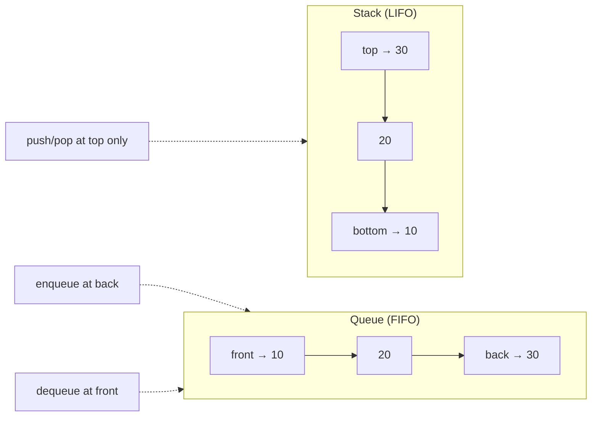
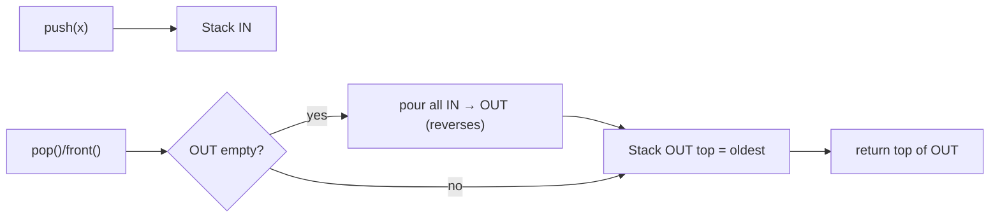
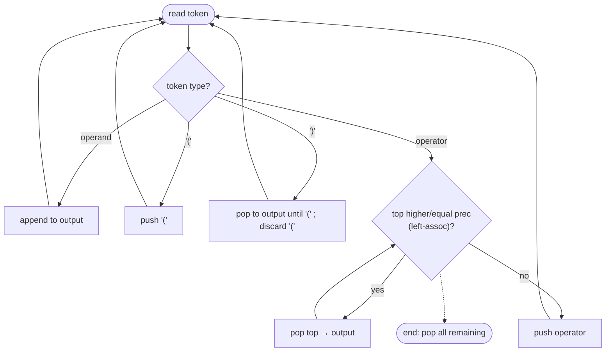
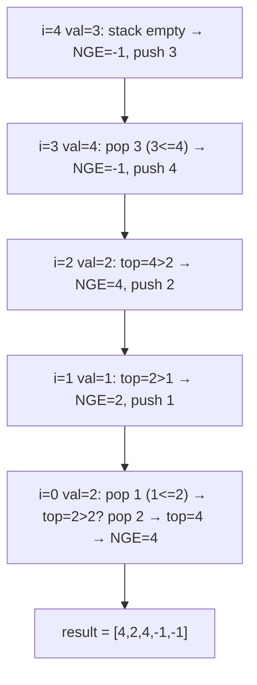
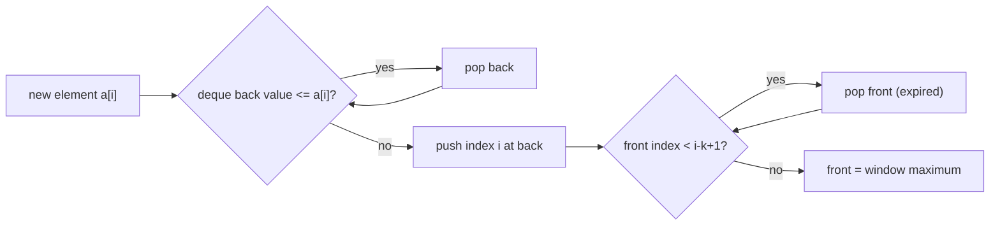

# Step 9: Stack and Queues [Learning, Pre-In-Post-fix, Monotonic Stack, Implementation]

> LIFO/FIFO data structures and the **monotonic stack/queue** pattern that turns brute-force O(n²) scans into single-pass O(n) solutions — plus expression conversion and classic design problems.

**Stats:** 30 problems total — 🟢 9 Easy · 🟡 13 Medium · 🔴 8 Hard

---

## 📌 Overview & Why It Matters

A **stack** is a Last-In-First-Out (LIFO) container: you only ever touch the *top*. A **queue** is First-In-First-Out (FIFO): you push at the back and pop from the front. Both support O(1) push/pop and are the backbone of an enormous number of interview problems.

Where this shows up in interviews:

- **Monotonic stack** — the single most tested pattern here. Next Greater/Smaller Element, histogram area, trapping rain water, subarray min/max sums, "remove k digits" — all FAANG favorites (Amazon, Google, Microsoft love these).
- **Expression parsing** — infix/prefix/postfix conversion and evaluation (compilers, calculators, Reverse Polish Notation).
- **Design questions** — Min Stack, LRU/LFU Cache, implement one structure using another. These test whether you can compose primitives under time constraints.
- **Monotonic deque** — Sliding Window Maximum, the "most feared window problem."

**Prerequisites:** arrays, hashing (for O(1) lookups), linked lists (for O(1) node moves in caches), and comfort with amortized analysis (why "push once, pop once" is O(n)).

---

## 🧠 Core Concepts

- **Stack (LIFO):** `push`, `pop`, `top/peek`, `empty`. Backed by an array, linked list, or `std::stack`.
- **Queue (FIFO):** `push/enqueue`, `pop/dequeue`, `front`, `empty`. Backed by a circular array, linked list, or `std::queue`.
- **Deque (double-ended queue):** push/pop at *both* ends in O(1). Foundation of the monotonic queue.
- **Monotonic stack:** a stack whose elements are kept sorted (increasing or decreasing) as you push. To keep the invariant you *pop* everything that violates it — and those pops are exactly the answers to "next greater/smaller" queries.
  - **Decreasing stack** → answers **next greater** element.
  - **Increasing stack** → answers **next smaller** element.
- **Amortized O(n):** each index is pushed once and popped at most once, so a whole sweep is linear even though there is an inner `while`.
- **Notations:** *Infix* `A + B` (operator between), *Prefix/Polish* `+ A B` (operator first), *Postfix/RPN* `A B +` (operator last). Postfix/prefix need no parentheses and evaluate with one stack.



---

## 🔑 Patterns & Approaches

### 1. Learning — Stack/Queue Implementation & Basics

**When to use it / recognition signals:** "Implement X using Y", "design a stack that returns min in O(1)", "check if brackets are balanced". Any problem that needs LIFO/FIFO bookkeeping or that constrains you to build one primitive from another.

**The approach/algorithm:**

- **Stack via array:** keep a `top` index; `push` = `arr[++top]=x`, `pop` = `arr[top--]`.
- **Queue via array (circular):** track `front`, `rear`, `size`; advance indices modulo capacity to reuse freed slots.
- **Stack via queue (single queue):** after each push, rotate the queue so the newest element sits at the front — push becomes O(n), pop O(1).
- **Queue via two stacks:** push into `in`; when popping, if `out` is empty, drain `in` into `out` (reverses order). Amortized O(1) per op.
- **Stack/Queue via linked list:** push/pop at head (stack) or maintain head+tail pointers (queue) for O(1).
- **Balanced parentheses:** push opens, on a close bracket verify the top matches; valid iff every close matches and the stack ends empty.
- **Min Stack:** store `(value, currentMin)` pairs (or use a second min-stack) so `getMin` is O(1).

**Diagram — Queue using two stacks:**



**Complexity:** Array/LL stack & queue: O(1) per op. Queue-from-2-stacks: amortized O(1). Stack-from-1-queue push: O(n). Balanced parens & Min Stack: O(n) time / O(n) space.

**Reusable code template (C++):**

```cpp
// Min Stack — O(1) getMin using paired minimum
class MinStack {
    stack<pair<long long,long long>> st; // {value, minSoFar}
public:
    void push(int x) {
        long long mn = st.empty() ? x : min<long long>(st.top().second, x);
        st.push({x, mn});
    }
    void pop()      { st.pop(); }
    int  top()      { return st.top().first; }
    int  getMin()   { return st.top().second; }
};

// Queue using two stacks — amortized O(1)
class MyQueue {
    stack<int> in, out;
    void shift() { while(!in.empty()){ out.push(in.top()); in.pop(); } }
public:
    void push(int x){ in.push(x); }
    int  pop(){ if(out.empty()) shift(); int v=out.top(); out.pop(); return v; }
    int  peek(){ if(out.empty()) shift(); return out.top(); }
    bool empty(){ return in.empty() && out.empty(); }
};

// Balanced parentheses
bool isValid(string s){
    stack<char> st;
    unordered_map<char,char> m{{')','('},{']','['},{'}','{'}};
    for(char c: s){
        if(c=='('||c=='['||c=='{') st.push(c);
        else { if(st.empty()||st.top()!=m[c]) return false; st.pop(); }
    }
    return st.empty();
}
```

| # | Problem | Difficulty | Practice |
|---|---------|------------|----------|
| 1 | Implement Stack using Arrays | 🟢 Easy | [Article](https://takeuforward.org/data-structure/implement-stack-using-array/) · [🎥](https://youtu.be/tqQ5fTamIN4) |
| 2 | Implement Queue using Arrays | 🟢 Easy | [Article](https://takeuforward.org/data-structure/implement-queue-using-array/) · [🎥](https://youtu.be/tqQ5fTamIN4) |
| 3 | Implement Stack using Queue | 🟢 Easy | [LeetCode](https://leetcode.com/problems/implement-stack-using-queues/) · [🎥](https://youtu.be/tqQ5fTamIN4) |
| 4 | Implement Queue using Stack | 🟢 Easy | [LeetCode](https://leetcode.com/problems/implement-queue-using-stacks/) · [🎥](https://youtu.be/tqQ5fTamIN4) |
| 5 | Implement Stack using Linked List | 🟢 Easy | [Article](https://takeuforward.org/data-structure/implement-stack-using-linked-list/) · [🎥](https://youtu.be/tqQ5fTamIN4) |
| 6 | Implement Queue using Linked List | 🟢 Easy | [Article](https://takeuforward.org/data-structure/implement-queue-using-linked-list/) · [🎥](https://youtu.be/tqQ5fTamIN4) |
| 7 | Balanced Parentheses | 🟢 Easy | [LeetCode](https://leetcode.com/problems/valid-parentheses/) · [🎥](https://youtu.be/xwjS0iZhw4I) |
| 8 | Implement Min Stack | 🔴 Hard | [LeetCode](https://leetcode.com/problems/min-stack/) · [🎥](https://youtu.be/NdDIaH91P0g) |

**Edge cases & gotchas:** empty pop/peek (underflow) and full push (overflow) in array-backed structures; circular queue wrap-around and full-vs-empty ambiguity (track size); odd-length or leading-close strings in balanced parens; Min Stack with duplicate minima (use `<=` when using a separate min-stack); watch integer overflow in Min Stack (use `long long`).

---

### 2. Prefix, Infix, Postfix Conversion Problems

**When to use it / recognition signals:** the problem gives a mathematical expression string and asks to convert notation or evaluate it; mentions operator precedence, associativity, parentheses, or "Reverse Polish Notation".

**The approach/algorithm (Infix → Postfix, the master algorithm):**

1. Scan left to right. **Operand** → append to output.
2. `(` → push. `)` → pop to output until `(` (discard the `(`).
3. **Operator** → while stack top is an operator with **greater** precedence, or **equal** precedence *and the current op is left-associative*, pop to output; then push current op. (`^` is right-associative, so only pop strictly greater.)
4. At the end, pop everything remaining.

Precedence: `^` (highest, right-assoc) > `* /` > `+ -`.

**Deriving the others (all use the same core):**
- **Infix → Prefix:** reverse the infix (swap brackets), run infix→postfix with `^` handling flipped, then reverse the result.
- **Postfix → Infix:** scan; push operands; on operator pop two, form `"(a op b)"`, push back.
- **Prefix → Infix:** scan **right→left**; on operator pop two, form `"(a op b)"`, push.
- **Postfix → Prefix:** scan L→R; on operator pop two `a,b`, push `"op a b"`.
- **Prefix → Postfix:** scan **right→left**; on operator pop two `a,b`, push `"a b op"`.

**Diagram — Infix → Postfix state machine:**



**Complexity:** O(n) time (each token pushed/popped O(1)), O(n) stack + O(n) output space.

**Reusable code template (C++ — Infix → Postfix):**

```cpp
int prec(char c){ if(c=='^')return 3; if(c=='*'||c=='/')return 2; if(c=='+'||c=='-')return 1; return -1; }

string infixToPostfix(string s){
    stack<char> st; string out;
    for(char c: s){
        if(isalnum(c)) out += c;
        else if(c=='(') st.push(c);
        else if(c==')'){ while(!st.empty() && st.top()!='('){ out+=st.top(); st.pop(); } st.pop(); }
        else { // operator
            while(!st.empty() && st.top()!='(' &&
                  (prec(st.top()) > prec(c) ||
                   (prec(st.top())==prec(c) && c!='^')))  // '^' right-assoc
            { out+=st.top(); st.pop(); }
            st.push(c);
        }
    }
    while(!st.empty()){ out+=st.top(); st.pop(); }
    return out;
}

// Postfix -> Infix
string postfixToInfix(string s){
    stack<string> st;
    for(char c: s){
        if(isalnum(c)) st.push(string(1,c));
        else { string b=st.top();st.pop(); string a=st.top();st.pop();
               st.push("("+a+c+b+")"); }
    }
    return st.top();
}
```

| # | Problem | Difficulty | Practice |
|---|---------|------------|----------|
| 1 | Infix to Postfix Conversion | 🟡 Medium | [Article](https://takeuforward.org/data-structure/infix-to-postfix/) · [🎥](https://youtu.be/4pIc9UBHJtk) |
| 2 | Prefix to Infix Conversion | 🟡 Medium | [Article](https://takeuforward.org/data-structure/prefix-to-infix-conversion) · [🎥](https://youtu.be/4pIc9UBHJtk) |
| 3 | Prefix to Postfix Conversion | 🟡 Medium | [Article](https://takeuforward.org/data-structure/prefix-to-postfix-conversion) · [🎥](https://youtu.be/4pIc9UBHJtk) |
| 4 | Postfix to Prefix Conversion | 🟡 Medium | [Article](https://takeuforward.org/data-structure/postfix-to-prefix-conversion) · [🎥](https://youtu.be/4pIc9UBHJtk) |
| 5 | Postfix to Infix Conversion | 🟢 Easy | [Article](https://takeuforward.org/data-structure/postfix-to-infix) · [🎥](https://youtu.be/4pIc9UBHJtk) |
| 6 | Infix to Prefix Conversion | 🟡 Medium | [Article](https://takeuforward.org/data-structure/infix-to-prefix/) · [🎥](https://youtu.be/4pIc9UBHJtk) |

**Edge cases & gotchas:** the `^` right-associativity exception (pop only strictly-greater, never equal); don't forget to discard the matching `(` when hitting `)`; multi-character operands/numbers need tokenization; for infix→prefix reversing, `(` and `)` must be swapped; parentheses never appear in prefix/postfix output.

---

### 3. Monotonic Stack / Queue Problems [VVV Important]

**When to use it / recognition signals:** "next/previous **greater** or **smaller** element", "for each element find the span/width until a bigger one", "largest rectangle", "how much water is trapped", "sum over all subarrays of min/max", "make the number smallest by removing k digits". Whenever the answer at index `i` depends on the nearest element on one side that is bigger/smaller — reach for a monotonic stack.

**The approach/algorithm (Next Greater Element, canonical):**

1. Traverse right → left (or left → right storing indices).
2. Maintain a stack that is **monotonically decreasing** from bottom to top.
3. Before recording the answer for `i`, **pop** all stack elements `<= a[i]` (they can never be the "next greater" for anything to the left).
4. The answer for `i` is the current top (or -1 if empty). Then push `a[i]`.

Because each element is pushed once and popped at most once, the total work is linear. Swap the comparison to get next **smaller**; traverse the other direction to get **previous** greater/smaller. For the *circular* variant (NGE-II), iterate `2n` times using `i % n`.

**Derived problems:**
- **Sum of Subarray Minimums/Ranges:** count, for each element, how many subarrays it is the min (or max) of = `(left span) * (right span)` using PLE/PSE via monotonic stacks.
- **Largest Rectangle in Histogram:** for each bar find PSE and NSE (nearest strictly-smaller on each side); width = `NSE − PSE − 1`.
- **Maximal Rectangle (all-1s):** build a histogram row by row, apply largest-rectangle each row.
- **Trapping Rain Water:** monotonic decreasing stack of indices; when a taller bar arrives, pop and add trapped water bounded by the new bar and the new top.
- **Asteroid Collision:** stack simulation — a positive on the stack meets an incoming negative; pop/annihilate by magnitude.
- **Remove K Digits:** greedy monotonic-increasing stack — pop larger preceding digits while `k>0` to make the number smallest.

**Diagram — Next Greater Element with a decreasing stack (array `[2,1,2,4,3]`, scanning right→left):**



**Complexity:** O(n) time (each index pushed/popped once), O(n) stack space. Maximal Rectangle is O(rows × cols).

**Reusable code template (C++ — generic monotonic stack):**

```cpp
// Next Greater Element to the right (values). Decreasing stack, right->left.
vector<int> nextGreater(vector<int>& a){
    int n=a.size(); vector<int> res(n,-1); stack<int> st; // holds values (or indices)
    for(int i=n-1;i>=0;--i){
        while(!st.empty() && st.top()<=a[i]) st.pop();  // '<' for strictly-greater duplicates
        if(!st.empty()) res[i]=st.top();
        st.push(a[i]);
    }
    return res;
}

// Largest Rectangle in Histogram — one pass with sentinel
int largestRectangleArea(vector<int>& h){
    h.push_back(0);                 // sentinel flushes the stack
    stack<int> st; int best=0;
    for(int i=0;i<(int)h.size();++i){
        while(!st.empty() && h[st.top()]>=h[i]){
            int height=h[st.top()]; st.pop();
            int width = st.empty()? i : i-st.top()-1;
            best=max(best, height*width);
        }
        st.push(i);
    }
    return best;
}

// Trapping Rain Water — monotonic stack
int trap(vector<int>& h){
    stack<int> st; int water=0;
    for(int i=0;i<(int)h.size();++i){
        while(!st.empty() && h[i]>h[st.top()]){
            int bottom=h[st.top()]; st.pop();
            if(st.empty()) break;
            int width = i-st.top()-1;
            water += width * (min(h[i],h[st.top()]) - bottom);
        }
        st.push(i);
    }
    return water;
}
```

| # | Problem | Difficulty | Practice |
|---|---------|------------|----------|
| 1 | Next Greater Element | 🟡 Medium | [LeetCode](https://leetcode.com/problems/next-greater-element-i/) · [🎥](https://youtu.be/e7XQLtOQM3I) |
| 2 | Next Greater Element - 2 | 🟡 Medium | [LeetCode](https://leetcode.com/problems/next-greater-element-ii/) · [🎥](https://youtu.be/7PrncD7v9YQ) |
| 3 | Next Smaller Element | 🟡 Medium | [Article](https://takeuforward.org/data-structure/next-smaller-element) |
| 4 | Number of Greater Elements to the Right | 🟢 Easy | [Article](https://takeuforward.org/data-structure/number-of-nges-to-the-right) |
| 5 | Trapping Rainwater | 🔴 Hard | [LeetCode](https://leetcode.com/problems/trapping-rain-water/) · [🎥](https://youtu.be/1_5VuquLbXg) |
| 6 | Sum of Subarray Minimums | 🟡 Medium | [LeetCode](https://leetcode.com/problems/sum-of-subarray-minimums/) · [🎥](https://youtu.be/v0e8p9JCgRc) |
| 7 | Asteroid Collision | 🟡 Medium | [LeetCode](https://leetcode.com/problems/asteroid-collision/) · [🎥](https://youtu.be/_eYGqw_VDR4) |
| 8 | Sum of Subarray Ranges | 🟡 Medium | [LeetCode](https://leetcode.com/problems/sum-of-subarray-ranges/) · [🎥](https://youtu.be/gIrMptNPf5M) |
| 9 | Remove K Digits | 🟡 Medium | [LeetCode](https://leetcode.com/problems/remove-k-digits/) · [🎥](https://youtu.be/jmbuRzYPGrg) |
| 10 | Largest Rectangle in a Histogram | 🔴 Hard | [LeetCode](https://leetcode.com/problems/largest-rectangle-in-histogram/) · [🎥](https://youtu.be/Bzat9vgD0fs) |
| 11 | Maximum Rectangles (Maximal Rectangle) | 🔴 Hard | [LeetCode](https://leetcode.com/problems/maximal-rectangle/) · [🎥](https://youtu.be/tOylVCugy9k) |

**Edge cases & gotchas:** strict vs non-strict comparison decides duplicate handling (subarray-min counting uses `<` on one side and `<=` on the other to avoid double counting); use sentinels (append 0 to histogram) to flush the stack cleanly; store **indices** not values when you need distances/widths; for NGE-II use `2n` iterations with modulo; watch overflow in subarray-sum problems (use `long long` and modulo `1e9+7`); Remove K Digits: strip leading zeros and handle leftover `k` (trim from the tail) and the all-removed case (return "0").

---

### 4. Implementation Problems (Design & Monotonic Deque)

**When to use it / recognition signals:** "design a cache with O(1) get/put", "maximum of every window of size k", "stock span", "who is the celebrity". These combine stacks/queues/deques with hashing or two-pointer/matrix elimination logic.

**The approach/algorithm:**

- **Sliding Window Maximum (monotonic deque):** keep a **decreasing** deque of indices. Before pushing `i`, pop from the back all indices whose value `<= a[i]`; pop from the front any index that has slid out of the window (`< i-k+1`). The front is always the window max.
- **Stock Span:** monotonic stack of `(price, span)` — pop while `top.price <= today`, accumulate spans; span = number of consecutive days back with price `<=` today.
- **Celebrity Problem:** two-pointer elimination — `if knows(a,b)` then `a` is not celeb (`a++`) else `b` is not (`b--`); verify the survivor knows nobody and everybody knows them. O(n) time, O(1) space (stack-based variant also common).
- **LRU Cache:** hashmap → doubly-linked-list node. On access move node to front (most recent); evict from the tail on overflow. All ops O(1).
- **LFU Cache:** hashmap of key→node, hashmap of freq→doubly-linked list, and a `minFreq` pointer. On access bump frequency and move the node between freq lists; evict the LRU node in the `minFreq` list.

**Diagram — Sliding Window Maximum monotonic deque:**



**Complexity:** Sliding Window Max: O(n) time, O(k) deque. Stock Span: amortized O(1)/query, O(n) stack. Celebrity: O(n) time, O(1) space. LRU/LFU: O(1) per op, O(capacity) space.

**Reusable code template (C++ — Sliding Window Maximum & LRU):**

```cpp
// Sliding Window Maximum — monotonic decreasing deque of indices
vector<int> maxSlidingWindow(vector<int>& a, int k){
    deque<int> dq; vector<int> res;
    for(int i=0;i<(int)a.size();++i){
        if(!dq.empty() && dq.front() <= i-k) dq.pop_front();     // expire front
        while(!dq.empty() && a[dq.back()] <= a[i]) dq.pop_back(); // maintain decreasing
        dq.push_back(i);
        if(i>=k-1) res.push_back(a[dq.front()]);
    }
    return res;
}

// LRU Cache — hashmap + std::list (doubly linked)
class LRUCache {
    int cap;
    list<pair<int,int>> dll;                              // front = most recent
    unordered_map<int, list<pair<int,int>>::iterator> mp;
public:
    LRUCache(int c):cap(c){}
    int get(int key){
        if(!mp.count(key)) return -1;
        dll.splice(dll.begin(), dll, mp[key]);           // move to front
        return mp[key]->second;
    }
    void put(int key,int val){
        if(mp.count(key)){ mp[key]->second=val; dll.splice(dll.begin(),dll,mp[key]); return; }
        if((int)dll.size()==cap){ mp.erase(dll.back().first); dll.pop_back(); }
        dll.push_front({key,val}); mp[key]=dll.begin();
    }
};
```

| # | Problem | Difficulty | Practice |
|---|---------|------------|----------|
| 1 | Sliding Window Maximum | 🔴 Hard | [LeetCode](https://leetcode.com/problems/sliding-window-maximum/) · [🎥](https://youtu.be/NwBvene4Imo) |
| 2 | Stock Span Problem | 🔴 Hard | [LeetCode](https://leetcode.com/problems/online-stock-span/) · [🎥](https://youtu.be/eay-zoSRkVc) |
| 3 | Celebrity Problem | 🔴 Hard | [LeetCode](https://leetcode.com/problems/find-the-celebrity/) · [🎥](https://youtu.be/cEadsbTeze4) |
| 4 | LRU Cache | 🟡 Medium | [Article](https://takeuforward.org/data-structure/program-for-least-recently-used-lru-page-replacement-algorithm) |
| 5 | LFU Cache | 🔴 Hard | [LeetCode](https://leetcode.com/problems/lfu-cache/) · [🎥](https://www.youtube.com/watch?v=0PSB9y8ehbk) |

**Edge cases & gotchas:** Sliding Window — store **indices** (not values) so you can expire by position; expire front *before* reading the answer. Celebrity — verify the candidate at the end (a survivor is not guaranteed to be a celebrity). LRU/LFU — update value *and* recency on a `put` to an existing key; handle capacity 0; in LFU maintain `minFreq` carefully after eviction and after promoting the last node out of the min-freq bucket.

---

## ❓ Regularly Asked Interview Questions

**Q: What is the difference between a stack and a queue?**
**A:** A stack is LIFO — insertion and removal happen at the same end (top). A queue is FIFO — insert at the back, remove from the front. Stacks model nesting/backtracking (recursion, undo, parsing); queues model ordered processing (BFS, scheduling).

**Q: What is a monotonic stack and when do you use it?**
**A:** A stack kept sorted (increasing or decreasing) by popping violating elements on push. Use it for "nearest greater/smaller element on a side" queries and anything reducible to them (spans, histogram area, trapping water). A *decreasing* stack finds next-greater; an *increasing* stack finds next-smaller.

**Q: Why is a monotonic-stack sweep O(n) despite the inner while loop?**
**A:** Amortized analysis: each element is pushed exactly once and popped at most once, so total push+pop operations ≤ 2n across the whole run — linear regardless of how many pops happen in one step.

**Q: How do you find the Next Greater Element for a circular array?**
**A:** Iterate `2n` times using index `i % n`. The first pass primes the stack; the second resolves wrap-around neighbors. Same decreasing-stack logic otherwise.

**Q: How does the largest-rectangle-in-histogram algorithm work?**
**A:** For each bar, the maximal rectangle using it as height extends to the nearest strictly-smaller bar on the left (PSE) and right (NSE). Width = `NSE − PSE − 1`. One monotonic-increasing stack computes both in a single pass with a sentinel; area = height × width.

**Q: How would you implement a queue using two stacks, and what's the cost?**
**A:** Push into an `in` stack. To pop/peek, if `out` is empty, pour everything from `in` into `out` (reversing order), then operate on `out`. Each element moves between stacks at most once → amortized O(1) per operation.

**Q: How do you get O(1) getMin in a stack?**
**A:** Alongside each value store the minimum seen so far (a pair), or keep a parallel min-stack that pushes when the new value ≤ current min and pops in lockstep. `getMin` just reads the top.

**Q: Convert infix to postfix — what's the core rule?**
**A:** Operands go straight to output. For an operator, pop all stack operators with higher precedence (or equal precedence if left-associative) before pushing it. `(` is pushed; `)` pops until `(`. The exponent `^` is right-associative, so you pop only strictly-higher precedence.

**Q: Why prefer postfix/prefix over infix for evaluation?**
**A:** They are unambiguous without parentheses or precedence rules, so a machine evaluates them with a single stack in one linear pass — ideal for stack-based CPUs and compilers.

**Q: How do you solve Sliding Window Maximum in O(n)?**
**A:** A monotonic decreasing deque of indices. Pop the back while its value ≤ the incoming value, pop the front if it has left the window, then push the new index. The front always holds the current window's maximum.

**Q: When would you use a monotonic queue (deque) instead of a monotonic stack?**
**A:** When elements can also *expire* from the other end — e.g., sliding windows where old indices leave the window. The deque supports removal from both ends; a stack cannot expire its bottom.

**Q: How do you design an LRU cache with O(1) operations?**
**A:** A hashmap from key to a node in a doubly-linked list ordered by recency. `get`/`put` move the node to the front; on overflow evict the tail. Hashmap gives O(1) lookup; the DLL gives O(1) reordering and eviction.

**Q: How does LFU differ from LRU in implementation?**
**A:** LFU tracks frequency. Keep a map key→node, a map freq→DLL of nodes with that frequency, and a `minFreq` pointer. On access, move the node to the next-higher freq list; evict from the `minFreq` list (LRU within that frequency) on overflow.

**Q: How do you solve the celebrity problem in O(n) time and O(1) space?**
**A:** Two-pointer elimination: compare `a` and `b`; if `a` knows `b`, `a` can't be the celebrity (`a++`), else `b` can't (`b--`). One candidate survives; verify they know no one and everyone knows them.

**Q: What's the trick in Remove K Digits?**
**A:** Greedy monotonic-increasing stack: for each digit, while `k>0` and the stack top is larger than the current digit, pop (removing a larger high-order digit shrinks the number most). Trim leftover `k` from the end, strip leading zeros, and return "0" if empty.

---

## 💡 Interview Tips & Common Mistakes

- **Decide stack contents first:** values vs indices. Indices unlock distances/widths and window expiry — most monotonic problems store indices.
- **Pick the monotonic direction deliberately:** decreasing → next greater; increasing → next smaller. Say it out loud before coding.
- **Master ONE monotonic template** and adapt the comparison operator (`<` vs `<=`) rather than memorizing each problem — strictness controls duplicate handling.
- **Use sentinels** (a trailing 0 in histogram, or virtual boundaries) to flush the stack and avoid special end-of-array cases.
- **Watch overflow** in subarray-sum/range problems — use `long long` and apply modulo where required.
- **For sliding windows, expire the front before reading the answer**, and only record once `i >= k-1`.
- **Common bugs:** forgetting to discard `(` on `)`; mishandling `^` right-associativity; popping with the wrong strictness and double-counting; reading Min Stack top after a pop; not re-verifying the celebrity candidate.
- **Design questions:** state your data structures and their invariants up front (hashmap + DLL for LRU), then walk through get/put; interviewers grade the O(1) reasoning.
- **Always mention amortized O(n)** when using a monotonic stack — it signals you understand *why* it's fast.

---

## 🐟 Revision Cheat-Sheet

| Pattern | Key Idea | Time | Space | Signature Problem |
|---------|----------|------|-------|-------------------|
| Learning / Implementation | LIFO/FIFO primitives; build one from another; O(1) min | O(1) amortized/op | O(n) | Min Stack / Queue via 2 Stacks |
| Prefix/Infix/Postfix | One stack + precedence & associativity rules; reverse tricks derive the rest | O(n) | O(n) | Infix → Postfix |
| Monotonic Stack | Keep stack sorted; pops answer nearest greater/smaller | O(n) | O(n) | Largest Rectangle in Histogram |
| Implementation (Deque/Design) | Monotonic deque for windows; hashmap+DLL for caches | O(n) / O(1) op | O(k)/O(cap) | Sliding Window Maximum / LRU Cache |

---

## 🔗 References & Further Reading

- Striver A2Z — Step 9: [Stack and Queues](https://takeuforward.org/strivers-a2z-dsa-course/strivers-a2z-dsa-course-sheet-2/)
- HelloInterview — [Monotonic Stack (Next Greater/Smaller template)](https://www.hellointerview.com/learn/code/stack/monotonic-stack)
- GeeksforGeeks — [Infix to Postfix Conversion using Stack](https://www.geeksforgeeks.org/convert-infix-expression-to-postfix-expression/)
- GeeksforGeeks — [Infix, Postfix and Prefix Notations](https://www.geeksforgeeks.org/dsa/infix-postfix-prefix-notation/)
- TheLinuxCode — [Introduction to Monotonic Queues (sliding-window patterns)](https://thelinuxcode.com/introduction-to-monotonic-queues-with-practical-sliding-window-patterns/)
- dwf.dev — [Introduction to Monotonic Stacks and Queues (with LeetCode problems)](https://dwf.dev/blog/2024/04/26/2024/monotonic-stacks-queues/)
- prachub.com — [Monotonic Stack Interview Pattern: Trigger, Template, and Traps](https://prachub.com/resources/monotonic-stack-interview-pattern)
- VerveCopilot — [LRU Cache Interview Questions & Answers](https://www.vervecopilot.com/interview-questions/lru-cache-interview-questions)
