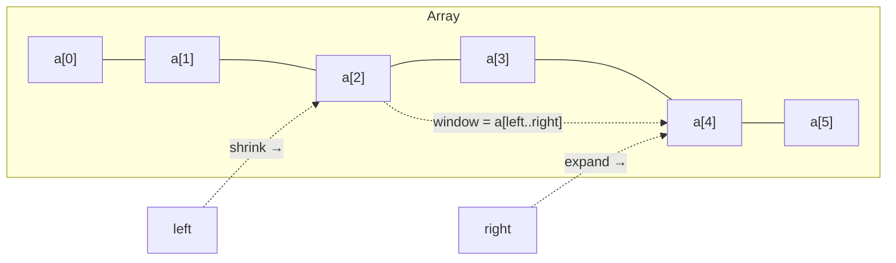
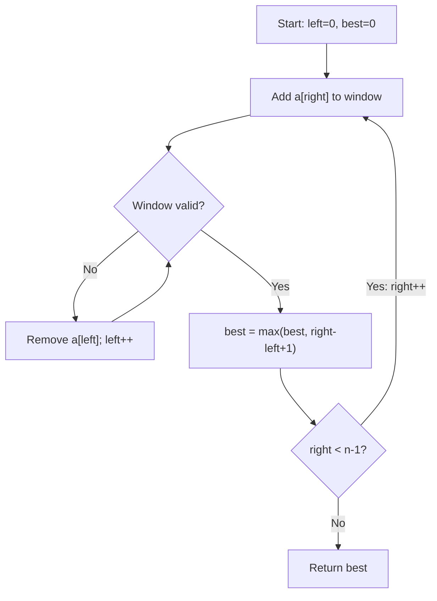

# Step 10: Sliding Window & Two Pointer Combined Problems

A single-pass toolkit for "longest / shortest / count / max" over **contiguous** subarrays and substrings — collapsing O(n²) brute force into O(n) using two moving indices.

> **Stats:** 12 problems total · 🟢 Easy: 0 · 🟡 Medium: 6 · 🔴 Hard: 6

---

## 📌 Overview & Why It Matters

The **Sliding Window** technique maintains a *contiguous* range `[left, right]` over an array or string and updates a running summary (sum, count, frequency map, distinct count) **incrementally** as the window moves — so each element is added and removed at most once. The **Two Pointer** technique is the more general parent: two indices that move under some rule (same direction, or from both ends inward). A sliding window is essentially a *same-direction two-pointer* that keeps a valid contiguous window.

**Where it shows up in interviews**
- Extremely high frequency at FAANG/product companies. Almost every "substring / subarray with condition X" question is a window problem.
- Classic signals: *"contiguous"*, *"substring"*, *"subarray"*, *"longest / shortest / at most K / exactly K / sum equals K / at most K distinct"*.
- Often the intended optimization from a brute-force O(n²)/O(n·k) solution the interviewer expects you to improve.

**Prerequisites**
- Comfort with arrays, strings, and hash maps / frequency arrays.
- Prefix-sum intuition (helps for the "exactly K" counting trick).
- Understanding of amortized analysis (why two nested-looking loops are still O(n)).

---

## 🧠 Core Concepts

A window is defined by two indices. The **right** pointer *expands* the window (adds `arr[right]`); the **left** pointer *shrinks* it (removes `arr[left]`) when the window becomes invalid or exceeds a fixed size.

| Term | Meaning |
|---|---|
| Fixed window | Size `k` is given and constant; slide by adding one, removing one. |
| Variable window | Size grows/shrinks to satisfy a constraint (longest/shortest). |
| Expand | Move `right` forward, include a new element. |
| Shrink | Move `left` forward, drop an element, until valid again. |
| Window summary | Running state: sum, count, frequency map, distinct count. |
| "Exactly K" trick | `exactly(K) = atMost(K) − atMost(K−1)`. |



**The universal decision:**
- *Fixed size?* → slide a window of length `k`.
- *"At most / longest / shortest" (monotonic condition)?* → variable window, shrink when invalid.
- *"Exactly K" count?* → `atMost(K) − atMost(K−1)`.
- *Sorted input / pair from both ends?* → opposite-direction two pointers.

---

## 🔑 Patterns & Approaches

The data groups these into **Medium** and **Hard** buckets; within each we identify the concrete window pattern so you can pattern-match instantly in an interview.

### Medium Problems — Variable Window (longest/max) + Fixed Window + "Exactly K" counting

**When to use / recognition signals**
- "Longest substring/subarray such that …" → **variable window, maximize**: expand `right`, shrink `left` only while invalid, record `max(right−left+1)`.
- "Max sum of first/last k cards", "size exactly k" → **fixed window** (slide by k).
- "Count subarrays with sum = goal / with exactly K odds / containing all of a,b,c" → **"exactly K" via atMost trick** or an at-least prefix-count trick.

**The approach (variable window, longest)** — step by step
1. Init `left = 0`, empty window summary, `best = 0`.
2. For each `right`, add `arr[right]` to the summary.
3. **While the window is invalid**, remove `arr[left]` and `left++`.
4. Now window `[left, right]` is valid → update `best = max(best, right − left + 1)`.
5. Return `best`.

For **fixed window**: build the first `k`, then for each new `right` add `arr[right]` and remove `arr[right−k]`.

For **"exactly K" counting**: `count(exactly K) = count(atMost K) − count(atMost K−1)`, where `atMost(K)` is itself a variable window that shrinks whenever the constraint exceeds `K` and adds `(right − left + 1)` per step.



**Complexity:** Time **O(n)** — each index enters/leaves the window once (amortized); Space **O(1)** for numeric windows, **O(k)** or **O(Σ)** when a frequency map/array is needed.

**Reusable templates (C++)**

```cpp
// (A) Variable window — LONGEST subarray/substring satisfying a monotonic condition
int longestWindow(vector<int>& a) {
    int n = a.size(), left = 0, best = 0;
    long windowState = 0;                    // sum / count / distinct...
    for (int right = 0; right < n; ++right) {
        windowState += a[right];             // expand: include a[right]
        while (/* window INVALID */ false) { // shrink until valid again
            windowState -= a[left];
            ++left;
        }
        best = max(best, right - left + 1);  // record best valid window
    }
    return best;
}

// (B) Fixed window of size k — e.g. max sum of size k
long maxSumFixed(vector<int>& a, int k) {
    long sum = 0, best = LONG_MIN;
    for (int i = 0; i < (int)a.size(); ++i) {
        sum += a[i];
        if (i >= k) sum -= a[i - k];         // drop element leaving the window
        if (i >= k - 1) best = max(best, sum);
    }
    return best;
}

// (C) "Exactly K" = atMost(K) - atMost(K-1)
int atMost(vector<int>& a, int K) {          // count subarrays with <= K (odds/distinct...)
    if (K < 0) return 0;
    int left = 0, cnt = 0, cur = 0;
    for (int right = 0; right < (int)a.size(); ++right) {
        cur += (a[right] & 1);               // example: count odd numbers
        while (cur > K) cur -= (a[left++] & 1);
        cnt += right - left + 1;             // all subarrays ending at right
    }
    return cnt;
}
```

**Problems**

| # | Problem | Difficulty | Practice |
|---|---------|------------|----------|
| 1 | Longest Substring Without Repeating Characters | 🟡 Medium | [LeetCode](https://leetcode.com/problems/longest-substring-without-repeating-characters/) · [🎥](https://youtu.be/-zSxTJkcdAo) |
| 2 | Max Consecutive Ones III | 🟡 Medium | [LeetCode](https://leetcode.com/problems/max-consecutive-ones-iii/) · [🎥](https://youtu.be/3E4JBHSLpYk) |
| 3 | Fruit Into Baskets | 🟡 Medium | [LeetCode](https://leetcode.com/problems/fruit-into-baskets/description/) · [🎥](https://youtu.be/e3bs0uA1NhQ) |
| 4 | Longest Repeating Character Replacement | 🔴 Hard | [LeetCode](https://leetcode.com/problems/longest-repeating-character-replacement/) · [🎥](https://youtu.be/_eNhaDCr6P0) |
| 5 | Binary Subarrays With Sum | 🔴 Hard | [LeetCode](https://leetcode.com/problems/binary-subarrays-with-sum/) · [🎥](https://youtu.be/XnMdNUkX6VM) |
| 6 | Count Number of Nice Subarrays | 🔴 Hard | [LeetCode](https://leetcode.com/problems/count-number-of-nice-subarrays/) · [🎥](https://youtu.be/j_QOv9OT9Og) |
| 7 | Number of Substrings Containing All Three Characters | 🔴 Hard | [LeetCode](https://leetcode.com/problems/number-of-substrings-containing-all-three-characters/) · [🎥](https://youtu.be/xtqN4qlgr8s) |
| 8 | Maximum Points You Can Obtain from Cards | 🟡 Medium | [LeetCode](https://leetcode.com/problems/maximum-points-you-can-obtain-from-cards/) · [🎥](https://youtu.be/pBWCOCS636U) |

**Per-problem quick notes**
- **Longest Substring w/o Repeating**: variable window; keep `last[c]`; when a char repeats inside, jump `left = max(left, last[c]+1)`.
- **Max Consecutive Ones III**: longest window with `zeros ≤ K`; shrink when zeros exceed K.
- **Fruit Into Baskets**: longest window with **at most 2 distinct** types (a specialization of K-distinct).
- **Longest Repeating Char Replacement**: longest window where `windowLen − maxFreq ≤ K` (chars to change ≤ K); track running `maxFreq`.
- **Binary Subarrays With Sum = goal**: `atMost(goal) − atMost(goal−1)` (0/1 array), or hashmap of prefix sums.
- **Count Nice Subarrays (exactly K odds)**: map odd→1, even→0; `atMost(K) − atMost(K−1)`.
- **Substrings Containing a,b,c**: for each `right`, once all three present, every `left` up to `min(lastA,lastB,lastC)` forms a valid substring → add `min(lastA,lastB,lastC)+1`.
- **Max Points from Cards**: fixed window trick — take `k` from ends = total minus a **min-sum window of size n−k** in the middle.

**Edge cases & gotchas**
- Empty array / `k = 0` / `k > n`.
- For "longest", update `best` **after** shrinking; for "shortest", update **inside** the shrink loop.
- Don't over-shrink: shrink only while the window is invalid (variable) or by exactly one (fixed).
- Frequency map: remember to erase / decrement to zero to keep `distinct` accurate.

---

### Hard Problems — K-distinct variants & Minimum Window (shortest) patterns

**When to use / recognition signals**
- "At most K distinct" → variable window, shrink while `distinct > K`, maximize length.
- "Exactly K distinct" → `atMost(K) − atMost(K−1)`.
- "**Smallest** window containing all of T" / "minimum window" → variable window, **expand until valid, then shrink while still valid**, minimizing length.
- "Minimum window **subsequence**" (order matters, not contiguity of T) → two-pointer forward scan + backward tighten (DP for the true optimum).

**The approach (minimum window — shortest, contains-all)** — step by step
1. Build `need` = frequency map of target `T`; `required = distinct chars in T`; `formed = 0`.
2. Expand `right`, update `window[c]`; if `window[c] == need[c]` then `formed++`.
3. **While `formed == required`** (valid): try to update the min length/answer, then shrink `left`: decrement `window[left]`, if it drops below `need[left]` do `formed--`, `left++`.
4. Return the best window found (or `""`).

```mermaid
stateDiagram-v2
    [*] --> Expanding
    Expanding --> Expanding: "right++, add char (formed < required)"
    Expanding --> Valid: "formed == required"
    Valid --> Valid: "record min; left++ (still valid)"
    Valid --> Expanding: "left++ broke validity (formed--)"
    Expanding --> [*]: "right reached end"
```



**Complexity:** At most K distinct / exactly K distinct → **O(n)** time, **O(K)**/**O(Σ)** space. Minimum Window Substring → **O(|s| + |t|)** time, **O(Σ)** space. Minimum Window **Subsequence** → two-pointer scan is **O(|s|·|t|)** worst case; the clean optimal is **O(|s|·|t|)** DP.

**Reusable templates (C++)**

```cpp
// (A) At most K distinct characters — longest such substring
int atMostKDistinct(const string& s, int K) {
    unordered_map<char,int> freq;
    int left = 0, best = 0;
    for (int right = 0; right < (int)s.size(); ++right) {
        freq[s[right]]++;
        while ((int)freq.size() > K) {           // too many distinct → shrink
            if (--freq[s[left]] == 0) freq.erase(s[left]);
            ++left;
        }
        best = max(best, right - left + 1);
    }
    return best;
}
// Exactly K distinct = atMostKDistinct-count(K) - atMostKDistinct-count(K-1)

// (B) Minimum window substring — smallest window of s containing all chars of t
string minWindow(const string& s, const string& t) {
    if (s.empty() || t.empty()) return "";
    array<int,128> need{}; int required = 0;
    for (char c : t) if (need[c]++ == 0) ++required;
    int left = 0, formed = 0, bestLen = INT_MAX, bestL = 0;
    array<int,128> win{};
    for (int right = 0; right < (int)s.size(); ++right) {
        char c = s[right];
        if (++win[c] == need[c]) ++formed;
        while (formed == required) {             // valid → shrink to minimize
            if (right - left + 1 < bestLen) { bestLen = right - left + 1; bestL = left; }
            char d = s[left++];
            if (win[d]-- == need[d]) --formed;
        }
    }
    return bestLen == INT_MAX ? "" : s.substr(bestL, bestLen);
}
```

**Problems**

| # | Problem | Difficulty | Practice |
|---|---------|------------|----------|
| 1 | Longest Substring With At Most K Distinct Characters | 🔴 Hard | [LeetCode](https://leetcode.com/problems/longest-substring-with-at-most-k-distinct-characters/) · [🎥](https://youtu.be/teM9ZsVRQyc) |
| 2 | Subarrays with K Different Integers | 🟡 Medium | [LeetCode](https://leetcode.com/problems/subarrays-with-k-different-integers/) · [🎥](https://youtu.be/7wYGbV_LsX4) |
| 3 | Minimum Window Substring | 🔴 Hard | [LeetCode](https://leetcode.com/problems/minimum-window-substring/) · [🎥](https://youtu.be/WJaij9ffOIY) |
| 4 | Minimum Window Subsequence | 🔴 Hard | [LeetCode](https://leetcode.com/problems/minimum-window-subsequence/) |

**Per-problem quick notes**
- **At Most K Distinct**: template (A) directly; longest window where `freq.size() ≤ K`.
- **Subarrays with K Different Integers (exactly K)**: `atMost(K) − atMost(K−1)` where `atMost` counts subarrays (add `right−left+1`) with `distinct ≤ K`.
- **Minimum Window Substring**: template (B); *expand to become valid, shrink while valid* to minimize.
- **Minimum Window Subsequence**: T must appear **in order** (not contiguous). Two-pointer: scan forward to match all of T, then walk `left` backward to tighten the start; record min. Optimal via DP `dp[i][j]` = start index of smallest window of `s[0..i]` covering `t[0..j]`.

**Edge cases & gotchas**
- `K = 0` in K-distinct → answer is 0 / empty; guard against `atMost(-1)`.
- Minimum Window: must handle **duplicate** chars in `t` — use counts, not a set, and the `formed` counter compares `win[c] == need[c]`.
- Distinct-count map: erase keys at zero so `map.size()` reflects true distinct count.
- Subsequence ≠ substring: don't apply the contiguous minWindow template to Minimum Window **Subsequence**.

---

## ❓ Regularly Asked Interview Questions

**Q: What is the sliding window technique and why is it faster than brute force?**
**A:** It maintains a contiguous window with two indices and updates a running summary incrementally, so each element is added/removed at most once. This reuses work across overlapping ranges, turning O(n²) or O(n·k) into O(n).

**Q: What's the difference between sliding window and the two-pointer technique?**
**A:** Sliding window is a specialization of two pointers: both pointers move in the same direction and bound a *contiguous* window. General two pointers can move independently or from both ends (e.g., pair sum on a sorted array), and aren't restricted to contiguous windows.

**Q: How do you decide between a fixed-size and a variable-size window?**
**A:** If the problem fixes the length `k`, use a fixed window (add one, drop one). If the length is determined by a condition ("longest/shortest such that…"), use a variable window that expands and shrinks based on validity.

**Q: When do you expand vs. shrink the window?**
**A:** Always expand by moving `right` to include the next element. For a *longest* problem, shrink `left` only while the window is invalid, then record the length. For a *shortest* problem, once the window is valid, shrink while it stays valid, recording the minimum each time.

**Q: For "longest", where do you record the answer — before or after shrinking?**
**A:** After shrinking, when the window is guaranteed valid. For "shortest/minimum", record inside the shrink loop while validity still holds.

**Q: How do you count subarrays/substrings with *exactly* K of something?**
**A:** Use `exactly(K) = atMost(K) − atMost(K−1)`. `atMost(K)` is a variable window that shrinks when the count exceeds K and adds `right − left + 1` per step (number of valid subarrays ending at `right`).

**Q: Why does `atMost(K) − atMost(K−1)` give exactly K?**
**A:** Subarrays with ≤ K minus those with ≤ K−1 leaves exactly those whose count equals K. It's inclusion–exclusion over a monotonic property.

**Q: Can sliding window work on arrays with negative numbers?**
**A:** For *sum ≥ target* / *sum ≤ target* the shrink condition is monotonic only when values are non-negative. With negatives, the window sum isn't monotonic, so plain sliding window breaks — use prefix sums + hashmap or prefix sum + deque/binary search instead.

**Q: How would you approach "Longest Substring Without Repeating Characters"?**
**A:** Variable window with a `lastIndex` map. Move `right`; if the char was seen at index ≥ `left`, jump `left = lastIndex + 1`. Update `best = right − left + 1`. O(n) time, O(Σ) space.

**Q: How would you approach "Minimum Window Substring"?**
**A:** Count needed chars of `t`. Expand `right` until all are covered (`formed == required`), then shrink `left` while still covered, tracking the smallest window. O(|s|+|t|).

**Q: How would you get maximum points from cards taken from either end (k cards)?**
**A:** Taking k from the ends = total sum minus the **minimum-sum contiguous window of size n−k** in the middle. Slide that fixed window once. O(n).

**Q: Longest Repeating Character Replacement — what's the invariant?**
**A:** A window is valid if `windowLength − maxFrequency ≤ K` (the chars we'd have to replace). Expand always; if invalid, move `left` once. Track `maxFrequency` (never needs to decrease for a correct max-length answer).

**Q: What data structure tracks the window content, and what's the cost?**
**A:** A hashmap or fixed-size frequency array (size 26/128/256). Array is O(1) per op and cache-friendly; hashmap is O(1) average but with overhead. `map.size()` gives distinct count if you erase zero-count keys.

**Q: What's the difference between Minimum Window Substring and Minimum Window Subsequence?**
**A:** Substring requires all target chars in any order within a contiguous window (counts matter). Subsequence requires the target to appear **in order** as a subsequence within the window; you match forward then tighten, and the optimal solution uses DP.

**Q: Is sliding window always O(n)?**
**A:** Not always. Each pointer moves O(n) total, but work *inside* the window (e.g., re-scanning, sorting, heap ops) can raise it, e.g., O(n log n) or O(n·k).

---

## 💡 Interview Tips & Common Mistakes

- **State the pattern out loud**: "This is a variable window maximizing length with an at-most-K constraint." It signals recognition.
- **Pick the right skeleton first** (fixed vs. variable vs. atMost-trick) before coding — most bugs come from mixing them.
- **"Longest" updates after shrink; "shortest" updates inside shrink.** Getting this backwards is the #1 bug.
- **Use `while` to shrink, not `if`** — for variable windows, multiple elements may need removing (except the classic "at most one over" cases where `if` suffices, like Longest Repeating Char Replacement).
- **Window length = `right − left + 1`.** Off-by-one here is extremely common.
- **Erase zero-count keys** so `map.size()` equals true distinct count.
- **Beware negatives**: sliding window's monotonic shrink assumption fails; fall back to prefix sums + hashmap.
- **"Exactly K" → atMost(K) − atMost(K−1)`** instead of a fragile direct two-condition window.
- **Don't recompute the window from scratch** each step — update incrementally, that's the whole point.
- **Substring ≠ subsequence** — different templates entirely.
- **Confirm constraints**: character set size (26 vs. Unicode) decides array vs. hashmap.

---

## 🐟 Revision Cheat-Sheet

| Pattern | Key Idea | Time | Space | Signature problem |
|---|---|---|---|---|
| Fixed window | Add one, drop `arr[i−k]`; slide length `k` | O(n) | O(1) | Maximum Points From Cards |
| Variable window (longest) | Expand right, shrink while invalid, record after | O(n) | O(Σ) | Longest Substring Without Repeating Characters |
| Variable window (at most K) | Shrink while constraint > K, maximize length | O(n) | O(K) | Longest Substring With At Most K Distinct |
| "Exactly K" counting | `atMost(K) − atMost(K−1)`, add `r−l+1` | O(n) | O(K) | Subarrays with K Different Integers / Nice Subarrays |
| Minimum window (shortest) | Expand to valid, shrink while valid, minimize | O(n) | O(Σ) | Minimum Window Substring |
| Window subsequence | Forward match + backward tighten / DP | O(n·m) | O(n·m) | Minimum Window Subsequence |

---

## 🔗 References & Further Reading

- Striver / takeuforward — [A2Z DSA Sheet: Sliding Window & Two Pointer](https://takeuforward.org/strivers-a2z-dsa-course/strivers-a2z-dsa-course-sheet-2/)
- GeeksforGeeks — [Sliding Window Technique Interview Questions](https://www.geeksforgeeks.org/dsa/commonly-asked-interview-questions-on-sliding-window-technique/)
- GeeksforGeeks — [Window Sliding Technique](https://www.geeksforgeeks.org/dsa/window-sliding-technique/)
- LeetCode Discuss — [10+ Two-Pointer / Sliding Window Patterns Explained with Code](https://leetcode.com/discuss/post/6849599/10-two-pointer-sliding-window-patterns-e-lfid/)
- LeetCode Discuss — [Ultimate Interview Cheat Sheet: Two Pointers & Sliding Window (Python)](https://leetcode.com/discuss/post/8423376/my-ultimate-interview-cheat-sheet-two-po-d3za/)
- Prachub — [Sliding Window Algorithm: Coding Interview Guide + Templates](https://prachub.com/resources/sliding-window-algorithm-coding-interview-guide-plus-templates)
- TheLinuxCode — [Top Two Pointers Interview Problems: Patterns, Pitfalls & Templates](https://thelinuxcode.com/top-two-pointers-interview-problems-patterns-pitfalls-and-runnable-templates/)
- LivePhysics — [Two Pointers & Sliding Window Patterns Cheat Sheet](https://livephysics.com/cheat-sheets/computer-science-two-pointers-sliding-window-patterns/)
