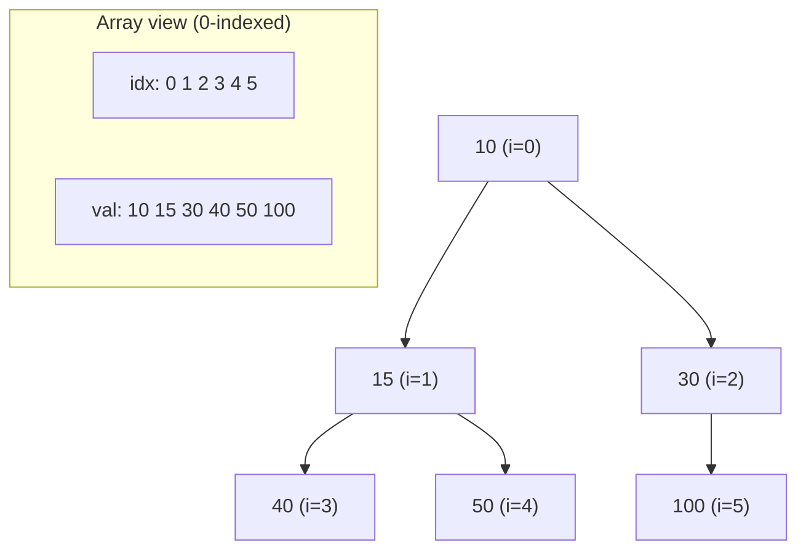
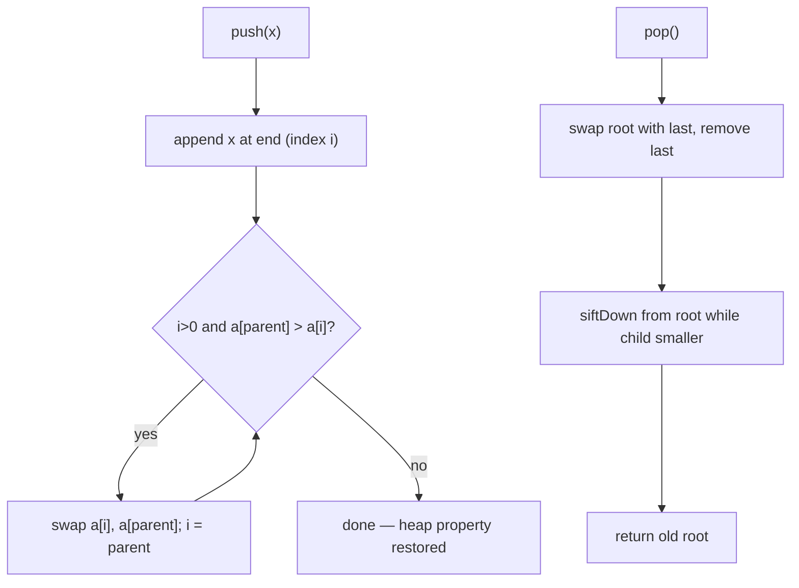
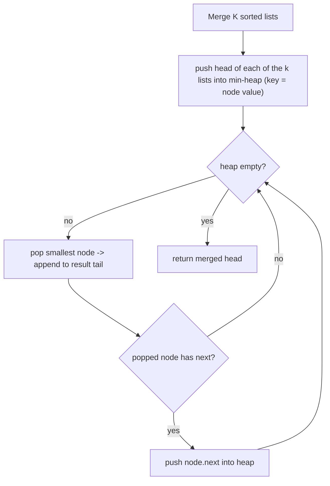
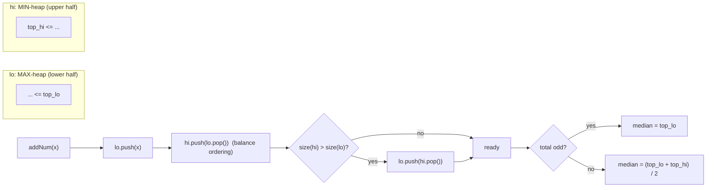

# Step 11: Heaps [Learning, Medium, Hard Problems]

Master the priority queue: a complete-binary-tree data structure that gives you O(1) access to the min/max and O(log n) insert/delete — the backbone of top-K, streaming-median, k-way-merge and scheduling problems.

**Stats:** 17 problems total — 🟢 3 Easy · 🟡 10 Medium · 🔴 4 Hard.

---

## 📌 Overview & Why It Matters

A **heap** is a complete binary tree that maintains the **heap property**: in a *min-heap* every parent ≤ its children (root = global minimum); in a *max-heap* every parent ≥ its children (root = global maximum). It is the standard implementation of a **priority queue** — an ADT that always yields the highest-priority element next.

Why interviewers love heaps:

- They separate candidates who *sort everything* (O(n log n)) from those who realize you only need the **k best** or **one extreme at a time** (O(n log k) or O(log n) per step).
- They power a huge family of recognizable patterns: **top-K**, **k-way merge**, **two-heaps / running median**, **greedy scheduling**, and graph algorithms (Dijkstra, Prim).
- They test whether you understand array-backed trees, custom comparators, and streaming/online algorithms.

**Where they show up:** "k largest / smallest", "top k frequent", "merge k sorted …", "median of a data stream", "schedule tasks / connect ropes with minimum cost", "kth largest in a stream".

**Prerequisites:** arrays, complete binary trees, recursion, comparators, and Big-O. In C++ use `std::priority_queue`; in Python use `heapq` (always a min-heap — negate values for a max-heap).

---

## 🧠 Core Concepts

A binary heap is stored in a plain array — no pointers. For a node at index `i` (0-indexed):

- **parent(i)** = `(i - 1) / 2`
- **left(i)** = `2*i + 1`
- **right(i)** = `2*i + 2`

Two primitive repair operations keep the heap valid:

- **sift-up (bubble up)** — after inserting at the end, swap with parent while the property is violated. O(log n).
- **sift-down (heapify)** — after replacing the root (e.g. after a pop), swap with the smaller/larger child while the property is violated. O(log n).

**Build-heap** runs sift-down from the last internal node `n/2 - 1` down to the root — this is **O(n)**, *not* O(n log n) (nodes near the leaves are cheap; the tight bound is a telescoping series that sums to Θ(n)).



Key complexity table:

| Operation | Time |
|---|---|
| Peek (top) | O(1) |
| Insert / push | O(log n) |
| Extract root / pop | O(log n) |
| Build heap (heapify array) | O(n) |
| Heap sort | O(n log n) |
| Search arbitrary element | O(n) |

**Heap vs BST:** a heap only orders parent-vs-child (weak ordering), so it finds one extreme in O(1) but searching is O(n); a BST maintains full sorted order and searches in O(log n) but has no O(1) min *and* max. Use a heap when you repeatedly need the single best element.

---

## 🔑 Patterns & Approaches

### 1. Learning — Heap Structure, Heapify & Representation

**When to use it / recognition signals:** You must *implement* a heap from scratch, validate a heap array, or convert between min/max heaps. These are the fundamentals every interviewer expects you to reproduce before using the library.

**The approach/algorithm:**
- **Implement Min Heap** — store elements in an array. `push`: append, then sift-up. `pop`: swap root with last, shrink, sift-down from root. `top`: return `a[0]`.
- **Check if array represents a min heap** — for every internal node `i` (0 … n/2-1), verify `a[i] <= a[left]` and `a[i] <= a[right]` (guard indices). If any fails → not a heap.
- **Convert Min Heap to Max Heap** — the min-heap ordering gives no shortcut; simply run `build-heap` with the *max* comparator: sift-down from `n/2 - 1` to `0`. O(n).



**Complexity:** push/pop O(log n); build/convert O(n); check-min-heap O(n). Space O(1) extra (in-place on the backing array).

**Reusable code template (C++):**

```cpp
struct MinHeap {
    vector<int> a;
    void push(int x) {
        a.push_back(x);
        int i = a.size() - 1;
        while (i > 0 && a[(i - 1) / 2] > a[i]) {     // sift-up
            swap(a[i], a[(i - 1) / 2]);
            i = (i - 1) / 2;
        }
    }
    int top() { return a[0]; }
    void pop() {
        a[0] = a.back(); a.pop_back();
        siftDown(0);
    }
    void siftDown(int i) {
        int n = a.size();
        while (true) {
            int l = 2 * i + 1, r = 2 * i + 2, small = i;
            if (l < n && a[l] < a[small]) small = l;
            if (r < n && a[r] < a[small]) small = r;
            if (small == i) break;
            swap(a[i], a[small]); i = small;
        }
    }
    bool empty() { return a.empty(); }
};

// Check if array is a min heap
bool isMinHeap(vector<int>& a) {
    int n = a.size();
    for (int i = 0; i <= n / 2 - 1; ++i) {
        int l = 2*i+1, r = 2*i+2;
        if (l < n && a[i] > a[l]) return false;
        if (r < n && a[i] > a[r]) return false;
    }
    return true;
}

// Convert (any array) into a max-heap in O(n)
void buildMaxHeap(vector<int>& a) {
    int n = a.size();
    for (int i = n / 2 - 1; i >= 0; --i) {
        int j = i;
        while (true) {
            int l = 2*j+1, r = 2*j+2, big = j;
            if (l < n && a[l] > a[big]) big = l;
            if (r < n && a[r] > a[big]) big = r;
            if (big == j) break;
            swap(a[j], a[big]); j = big;
        }
    }
}
```

**Problems:**

| # | Problem | Difficulty | Practice |
|---|---|---|---|
| 1 | Heaps (Theory Video) | 🟢 Easy | [Article](https://takeuforward.org/data-structure/introduction-to-priority-queues-using-binary-heaps) |
| 2 | Implement Min Heap | 🟡 Medium | [Article](https://takeuforward.org/data-structure/introduction-to-priority-queues-using-binary-heaps) |
| 3 | Check if an array represents a min heap | 🟡 Medium | [Article](https://takeuforward.org/data-structure/check-if-an-array-represents-a-min-heap) |
| 4 | Convert Min Heap to Max Heap | 🟡 Medium | [Article](https://takeuforward.org/data-structure/introduction-to-priority-queues-using-binary-heaps) |

**Edge cases & gotchas:**
- Empty heap / single element — guard `pop`/`top` against size 0.
- Off-by-one on child indices; always bounds-check `l < n` and `r < n`.
- Build-heap is O(n), not O(n log n) — a classic follow-up trap.
- A sorted-ascending array *is* a valid min heap, but a valid min heap need not be sorted.

---

### 2. Medium — Top-K & k-way Merge with a Priority Queue

**When to use it / recognition signals:** The word **"k"** ("k largest / k smallest / top k / k sorted") is the tell. Also "merge k sorted lists/arrays", "nearly/K sorted array", and greedy problems where you repeatedly grab the current min/max (task scheduling, grouping consecutive cards).

**The approach/algorithm:**
- **Kth largest** → keep a **min-heap of size k**; push each element, pop when size > k. Root = kth largest. O(n log k). (Symmetrically, kth smallest → max-heap of size k.)
- **Sort a K-sorted (nearly sorted) array** → element at index `i` is within `k` of its final spot. Maintain a min-heap of the next `k+1` elements; repeatedly pop the min into the output. O(n log k).
- **k-way merge (Merge K sorted lists)** → push the head of each list into a min-heap keyed by value; pop the smallest, append it, push its successor. O(N log k) for N total nodes.
- **Task Scheduler** → max-heap on task frequencies; greedily run the most frequent available task each cycle, cooling down for `n` slots. Compute idle slots from the top frequency.
- **Hand of Straights** → count cards; from the smallest available card, greedily form `groupSize` consecutive cards; a min-heap or ordered map over distinct values drives the greedy.
- **Replace Elements by Their Rank** → sort (or use a heap/ordered structure) to assign each element its 1-based rank among distinct values.



**Complexity:** top-K / K-sorted O(n log k), space O(k). k-way merge O(N log k) time, O(k) heap space. Task Scheduler / Hand of Straights O(n log n).

**Reusable code template (C++) — the size-k heap and k-way merge:**

```cpp
// Kth largest — min-heap of size k
int kthLargest(vector<int>& nums, int k) {
    priority_queue<int, vector<int>, greater<int>> pq;   // min-heap
    for (int x : nums) {
        pq.push(x);
        if ((int)pq.size() > k) pq.pop();                // drop smallest
    }
    return pq.top();                                     // kth largest
}

// Merge K sorted linked lists (k-way merge)
struct Cmp { bool operator()(ListNode* a, ListNode* b){ return a->val > b->val; } };
ListNode* mergeKLists(vector<ListNode*>& lists) {
    priority_queue<ListNode*, vector<ListNode*>, Cmp> pq;
    for (auto* l : lists) if (l) pq.push(l);
    ListNode dummy, *tail = &dummy;
    while (!pq.empty()) {
        ListNode* node = pq.top(); pq.pop();
        tail->next = node; tail = node;
        if (node->next) pq.push(node->next);
    }
    return dummy.next;
}
```

**Problems:**

| # | Problem | Difficulty | Practice |
|---|---|---|---|
| 1 | K-th Largest element in an array | 🟡 Medium | [Article](https://takeuforward.org/data-structure/kth-largest-smallest-element-in-an-array/) |
| 2 | Kth smallest element in an array [use priority queue] | 🟡 Medium | [Article](https://takeuforward.org/data-structure/kth-largest-smallest-element-in-an-array/) |
| 3 | Sort K sorted array | 🟢 Easy | [Article](https://takeuforward.org/data-structure/sort-k-sorted-array) |
| 4 | Merge K sorted Lists | 🔴 Hard | [LeetCode](https://leetcode.com/problems/merge-k-sorted-lists/) |
| 5 | Replace Elements by Their Rank | 🟢 Easy | [Article](https://takeuforward.org/data-structure/replace-elements-by-its-rank-in-the-array/) |
| 6 | Task Scheduler | 🟡 Medium | [LeetCode](https://leetcode.com/problems/task-scheduler/) |
| 7 | Hand of Straights | 🟡 Medium | [LeetCode](https://leetcode.com/problems/hand-of-straights/) |

**Edge cases & gotchas:**
- Confusing which heap gives which answer: **min-heap of size k → kth largest**, **max-heap of size k → kth smallest**. Say it out loud before coding.
- `heapq` in Python is min-only — push negatives (or `(−value, item)` tuples) for a max-heap.
- k-way merge: skip empty/null lists before the initial push; don't forget to push `node.next`.
- Task Scheduler: answer is `max(len(tasks), (maxFreq-1)*(n+1) + countOfMaxFreq)`.
- Hand of Straights: return false immediately if `n % groupSize != 0`.

---

### 3. Hard — Two-Heaps (Running Median), Stream & Combination Problems

**When to use it / recognition signals:** "median from a **data stream**", "**k**th largest in a **stream** of running integers", "design a feed / most recent items" (Design Twitter), repeated "combine two + take the largest sum", or "repeatedly merge the two cheapest" (connect sticks). These are **online / streaming / greedy** problems where a single heap (or a pair of heaps) is queried and updated many times.

**The approach/algorithm:**
- **Find Median from Data Stream (two heaps)** — keep a **max-heap `lo`** for the lower half and a **min-heap `hi`** for the upper half. Invariant: `size(lo) == size(hi)` or `size(lo) == size(hi)+1`, and every element in `lo` ≤ every element in `hi`. On `addNum`: push to `lo`, move `lo.top` to `hi`, then rebalance if `hi` is larger. Median = `lo.top` (odd) or average of the two tops (even). O(log n) add, O(1) median.
- **Kth largest in a stream** — a **min-heap capped at size k**; the root is always the kth largest seen so far. Each `add` is O(log k).
- **Minimum Cost to Connect Sticks / ropes** — min-heap of lengths; repeatedly pop the two smallest, add their sum to the answer, push the sum back (Huffman-style greedy). O(n log n).
- **Maximum Sum Combination** — from two arrays, want the top-k largest pairwise sums. Sort both, push the largest pair `(n-1, n-1)` into a max-heap with a `visited` set, and pop-and-expand neighbors `(i-1,j)` and `(i,j-1)`. O(k log k).
- **Design Twitter** — hash maps for follows and per-user tweet lists (with a global timestamp); `getNewsFeed` does a k-way merge of the followed users' latest tweets via a heap, taking the 10 most recent.
- **Top K Frequent Elements** — count frequencies, then either a min-heap of size k over `(freq, value)` (O(n log k)) or bucket sort by frequency (O(n)).



**Complexity:** two-heaps median O(log n) insert / O(1) query, O(n) space. Kth-in-stream O(log k) per add. Connect sticks O(n log n). Max sum combination O(k log k). Top-K frequent O(n log k) or O(n) with buckets.

**Reusable code template (C++) — two-heaps running median:**

```cpp
class MedianFinder {
    priority_queue<int> lo;                                   // max-heap: lower half
    priority_queue<int, vector<int>, greater<int>> hi;        // min-heap: upper half
public:
    void addNum(int num) {
        lo.push(num);                 // step 1: always add to lower half
        hi.push(lo.top()); lo.pop();  // step 2: move top of lo to hi (keeps ordering)
        if (hi.size() > lo.size()) {  // step 3: rebalance so lo is >= hi in size
            lo.push(hi.top()); hi.pop();
        }
    }
    double findMedian() {
        if (lo.size() > hi.size()) return lo.top();
        return (lo.top() + hi.top()) / 2.0;
    }
};

// Kth largest in a stream
class KthLargest {
    priority_queue<int, vector<int>, greater<int>> pq;  int k;
public:
    KthLargest(int k, vector<int>& nums) : k(k) {
        for (int x : nums) add(x);
    }
    int add(int val) {
        pq.push(val);
        if ((int)pq.size() > k) pq.pop();
        return pq.top();
    }
};
```

**Problems:**

| # | Problem | Difficulty | Practice |
|---|---|---|---|
| 1 | Design Twitter | 🟡 Medium | [LeetCode](https://leetcode.com/problems/design-twitter/) |
| 2 | Minimum Cost to Connect Sticks | 🟡 Medium | [Article](https://takeuforward.org/data-structure/minimum-cost-to-connect-sticks) |
| 3 | Kth largest element in a stream of running integers | 🔴 Hard | [LeetCode](https://leetcode.com/problems/kth-largest-element-in-a-stream/) |
| 4 | Maximum Sum Combination | 🔴 Hard | [Article](https://takeuforward.org/data-structure/maximum-sum-combination) |
| 5 | Find Median from Data Stream | 🔴 Hard | [LeetCode](https://leetcode.com/problems/find-median-from-data-stream/) |
| 6 | Top K Frequent Elements | 🟡 Medium | [LeetCode](https://leetcode.com/problems/top-k-frequent-elements/) |

**Edge cases & gotchas:**
- Median with even count: **average the two tops** and return a `double` — watch integer overflow (`(a + b) / 2.0`, or `a/2.0 + b/2.0` for large ints).
- Two-heaps: forgetting to rebalance leaves the size invariant broken and the median wrong.
- Max Sum Combination: use a `visited` set of `(i,j)` to avoid pushing the same pair twice.
- Connect sticks: with 0 or 1 stick the cost is 0 — pop only when ≥ 2 remain.
- Design Twitter: use a monotonically increasing global timestamp so tweets order correctly across users.

---

## ❓ Regularly Asked Interview Questions

**Q: What is a heap and how is it different from a binary search tree?**
**A:** A heap is a *complete* binary tree obeying the heap property (parent ordered vs children only), giving O(1) access to one extreme and O(log n) insert/remove but O(n) search. A BST maintains full left<root<right ordering, giving O(log n) search but no single O(1) min-and-max. Use a heap for repeated min/max extraction; a BST for ordered search.

**Q: Why is building a heap O(n) and not O(n log n)?**
**A:** Build-heap sift-downs from the leaves up. Most nodes are near the bottom and do little work; the cost is Σ (number of nodes at height h × h), which telescopes to Θ(n). Inserting n elements one by one *would* be O(n log n).

**Q: Heap vs priority queue — are they the same?**
**A:** No. A priority queue is an ADT (defines "give me the highest priority next"); a heap is the most common *implementation* of it. For interview purposes they're used interchangeably.

**Q: How do you find the kth largest element efficiently?**
**A:** Maintain a min-heap of size k. Push each element; when size exceeds k, pop the smallest. The root is the kth largest. O(n log k) time, O(k) space — better than sorting for small k and it works on streams.

**Q: How would you compute a running median over a data stream?**
**A:** Two heaps — a max-heap for the lower half and a min-heap for the upper half, kept balanced within one element. Insert is O(log n), median is O(1) from the heap tops.

**Q: How do you merge k sorted lists/arrays?**
**A:** Push the first element of each list into a min-heap; repeatedly pop the smallest and push its successor from the same list. O(N log k) for N total elements, O(k) heap space.

**Q: In Python, how do you make a max-heap with heapq?**
**A:** `heapq` is min-only. Negate values on push and negate again on pop, or push tuples `(-priority, item)`. For custom objects, wrap them in a comparable tuple.

**Q: How would you get the top-k frequent elements?**
**A:** Count with a hash map, then either a size-k min-heap over `(freq, value)` in O(n log k), or bucket-sort by frequency (index = count) for O(n).

**Q: What are the time complexities of the core heap operations?**
**A:** peek O(1), push O(log n), pop O(log n), build-heap O(n), heap sort O(n log n), arbitrary search O(n).

**Q: How does heap sort work and is it stable?**
**A:** Build a max-heap, then repeatedly swap the root with the last element and sift-down the reduced heap. O(n log n) all cases, O(1) extra space, but **not stable**.

**Q: How would you find the kth largest element in a stream (online)?**
**A:** Keep a min-heap capped at size k; after each `add`, if size > k pop the smallest — the root is always the current kth largest. O(log k) per element.

**Q: When would you prefer Quickselect over a heap for kth largest?**
**A:** Quickselect gives O(n) average time (O(n²) worst) and is great for a *static* array when you only need one query. A heap wins for streams, multiple queries, or when you want the *k* elements (not just the kth) and a guaranteed O(n log k).

**Q: How do you solve "minimum cost to connect ropes/sticks"?**
**A:** Greedy with a min-heap (Huffman idea): repeatedly pop the two smallest, add their sum to the cost, push the sum back until one element remains. O(n log n).

**Q: How can you implement a heap without recursion?**
**A:** Both sift-up and sift-down are naturally iterative `while` loops over parent/child indices — no recursion or extra stack needed.

---

## 💡 Interview Tips & Common Mistakes

- **Spot the "k".** Any mention of top/least/kth or "k sorted" should immediately make you think heap (or Quickselect / bucket sort as alternatives).
- **Pick the opposite heap.** For the *k largest* use a **min**-heap of size k; for the *k smallest* use a **max**-heap of size k. Getting this backwards is the #1 bug.
- **Remember Python `heapq` is min-only** — negate for max-heaps and mention it explicitly.
- **State build-heap is O(n)** when asked — a common follow-up used to catch hand-wavers.
- **Two-heaps invariant:** always describe the size + ordering invariant before coding the median solution; rebalancing bugs are the usual failure.
- **Custom comparators:** in C++, `priority_queue` is a *max*-heap by default; pass `greater<>` or a struct comparator for min or custom order.
- **Don't over-heap.** If you need everything sorted, just sort (O(n log n)); heaps shine when you need *partial* order or streaming.
- **Overflow:** average two tops as a `double`; sum of stick lengths can exceed `int`.
- **Verify with a tiny example** (n=1, n=2, all-equal, already-sorted) before declaring done.

---

## 🐟 Revision Cheat-Sheet

| Pattern | Key Idea | Time | Space | Signature problem |
|---|---|---|---|---|
| Heap structure & heapify | Array-backed complete tree; sift-up/down; build-heap in O(n) | push/pop O(log n), build O(n) | O(1) extra | Implement Min Heap |
| Top-K (size-k heap) | Min-heap of size k → kth largest; max-heap → kth smallest | O(n log k) | O(k) | K-th Largest Element |
| k-way merge | Heap the head of each list; pop min, push successor | O(N log k) | O(k) | Merge K Sorted Lists |
| Greedy scheduling | Repeatedly grab current max/min freq or smallest cost | O(n log n) | O(n) | Task Scheduler / Connect Sticks |
| Two heaps (median) | Max-heap lower half + min-heap upper half, balanced | add O(log n), query O(1) | O(n) | Find Median from Data Stream |
| Streaming kth | Min-heap capped at size k; root = kth largest | O(log k) / add | O(k) | Kth Largest in a Stream |
| Top-K frequent | Count map + size-k heap or bucket sort | O(n log k) / O(n) | O(n) | Top K Frequent Elements |

---

## 🔗 References & Further Reading

- **Striver A2Z — Step 11 (Heaps):** https://takeuforward.org/strivers-a2z-dsa-course/strivers-a2z-dsa-course-sheet-2/
- **takeuforward — Intro to Priority Queues using Binary Heaps:** https://takeuforward.org/data-structure/introduction-to-priority-queues-using-binary-heaps
- **GeeksforGeeks — Heap Data Structure Interview Questions:** https://www.geeksforgeeks.org/dsa/commonly-asked-data-structure-interview-questions-on-heap-data-structure/
- **Tech Interview Handbook — Heap cheatsheet:** https://www.techinterviewhandbook.org/algorithms/heap/
- **GeeksforGeeks — Heap data structure & heapify:** https://www.geeksforgeeks.org/dsa/heap-data-structure/
- **Python docs — `heapq` (priority queue):** https://docs.python.org/3/library/heapq.html
- **cppreference — `std::priority_queue`:** https://en.cppreference.com/w/cpp/container/priority_queue
- **basecs — Learning to Love Heaps:** https://medium.com/basecs/learning-to-love-heaps-cef2b273a238
- **LeetCode Explore — Heap:** https://leetcode.com/explore/learn/card/heap/
