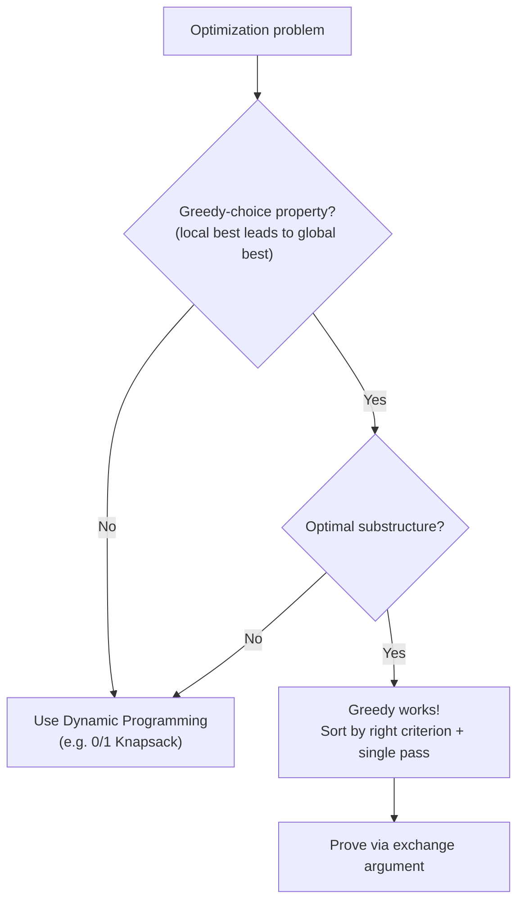
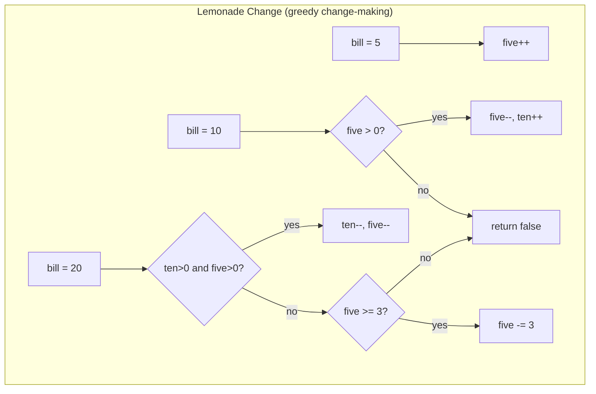
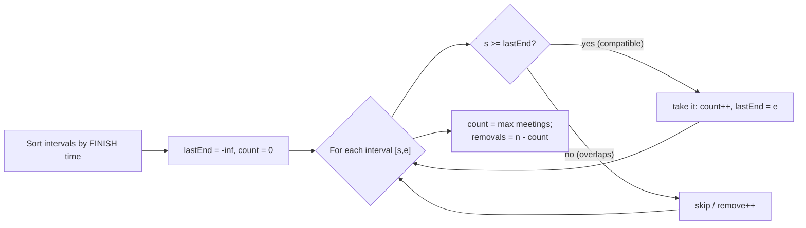

# Step 12: Greedy Algorithms [Easy, Medium/Hard]

> Build the optimal answer one **locally best, irrevocable** choice at a time — then *prove* it's globally optimal with an exchange argument.

**Stats:** 15 problems total — 🟢 3 Easy · 🟡 10 Medium · 🔴 2 Hard

---

## 📌 Overview & Why It Matters

A **greedy algorithm** solves an optimization problem by making the choice that looks best *right now* at every step, never reconsidering. When it works, it is dramatically simpler and faster than dynamic programming (usually just a sort + one linear pass).

The catch: **the code is trivial, the justification is the interview.** Interviewers rarely reward the loop — they ask *"why does always picking the earliest-finishing meeting give the maximum count?"* The real skill is (1) recognizing when a problem is greedy-solvable, (2) picking the correct greedy criterion (finish time? ratio? deadline?), and (3) proving correctness via an **exchange argument**.

**Where it shows up in interviews**
- Interval scheduling / partitioning (meetings, platforms, non-overlapping intervals) — extremely common at FAANG.
- Resource allocation with ratios (fractional knapsack, job sequencing by deadline+profit).
- Reachability / jump problems (Jump Game I & II).
- Simulation-style greedy (lemonade change, candy distribution, valid parenthesis string).

**Prerequisites**
- Sorting and custom comparators.
- Priority queues / heaps (platforms, SJF, LRU flavors).
- Basic proof intuition: *greedy-choice property* + *optimal substructure*.
- Familiarity with DP helps you recognize **when greedy fails** and DP is required (e.g., 0/1 knapsack, weighted interval scheduling).

---

## 🧠 Core Concepts

**Two conditions a problem must satisfy for greedy to be provably correct:**

1. **Greedy-choice property** — a globally optimal solution can be reached by making a locally optimal (greedy) choice. You never need to un-make a choice.
2. **Optimal substructure** — an optimal solution to the problem contains optimal solutions to its subproblems (shared with DP).

**The exchange argument (the proof tool):** Assume an optimal solution `OPT` differs from the greedy solution `G`. Look at the **first place they diverge**. Show you can *swap* the greedy choice into `OPT` without making it worse. Repeat → `OPT` can be transformed into `G` with no loss → `G` is optimal.

**Greedy vs Dynamic Programming**

| | Greedy | Dynamic Programming |
|---|---|---|
| Decision | One irrevocable local choice per step | Explores/combines many subproblem results |
| Revisits choices? | No | Yes (memo/table) |
| Speed | Fast (often sort + O(n)) | Slower (poly, e.g. O(n·W)) |
| Correct when | Greedy-choice + optimal substructure | Optimal substructure + overlapping subproblems |
| Classic fail case | 0/1 Knapsack, Coin change {1,3,4} for 6 | Solves those correctly |

> **When greedy fails:** if a *worse-looking* local choice can enable a strictly better global outcome (e.g., you can't take fractions of an item, or arbitrary weights break the ratio ordering), greedy is wrong — reach for DP.



---

## 🔑 Patterns & Approaches

### 1. Easy Problems — Sort / Simulate / Pointer Greedy

**When to use it / recognition signals**
- "Maximize the number of X you can satisfy," "give change," "check feasibility" — small, self-contained greedy rules.
- You can sort one or both arrays and match with two pointers, or simulate state left-to-right maintaining counters.
- The locally obvious choice (smallest cookie for least greedy child, highest value/weight ratio first) is provably safe.

**The approach/algorithm**
- **Assign Cookies:** sort children (greed) and cookies (size). Two pointers; give the smallest sufficient cookie to the least greedy child. Each satisfied child consumes the cheapest cookie that works → maximizes count.
- **Fractional Knapsack:** sort items by `value/weight` descending. Take whole items greedily; take a *fraction* of the last item to fill capacity. (Fractions allowed ⇒ ratio ordering is optimal — contrast 0/1 knapsack which needs DP.)
- **Lemonade Change:** simulate. Track counts of \$5 and \$10 bills. For \$10 give back a \$5; for \$20 prefer one \$10 + one \$5, else three \$5. Prefer using \$10s first (they're less flexible).
- **Valid Parenthesis String:** treat `*` as `(`, `)`, or empty. Track a *range* `[low, high]` of possible open-paren counts; clamp `low` at 0; if `high < 0` fail; valid iff `low == 0` at the end.



**Complexity**
- Assign Cookies / Fractional Knapsack: **O(n log n)** time (sort), **O(1)** extra space.
- Lemonade Change / Valid Parenthesis: **O(n)** time, **O(1)** space (single simulation pass).

**Reusable code template (C++)**
```cpp
// Assign Cookies: max children satisfied
int findContentChildren(vector<int>& g, vector<int>& s) {
    sort(g.begin(), g.end());
    sort(s.begin(), s.end());
    int i = 0, j = 0;            // i -> child, j -> cookie
    while (i < g.size() && j < s.size()) {
        if (s[j] >= g[i]) i++;  // cookie satisfies child -> move both
        j++;                    // otherwise try a bigger cookie
    }
    return i;                    // number of content children
}

// Fractional Knapsack: max value with fractions allowed
double fractionalKnapsack(int W, vector<pair<int,int>>& items) { // {value, weight}
    sort(items.begin(), items.end(), [](auto& a, auto& b){
        return (double)a.first / a.second > (double)b.first / b.second; // ratio desc
    });
    double total = 0;
    for (auto& [val, wt] : items) {
        if (W >= wt) { total += val; W -= wt; }
        else { total += val * ((double)W / wt); break; } // take fraction
    }
    return total;
}

// Valid Parenthesis String with '*'
bool checkValidString(string s) {
    int low = 0, high = 0;          // range of possible open counts
    for (char c : s) {
        if (c == '(')      { low++;  high++; }
        else if (c == ')') { low--;  high--; }
        else               { low--;  high++; } // '*' can be ) ( or empty
        if (high < 0) return false;  // too many ')'
        low = max(low, 0);           // treat surplus '*' as empty
    }
    return low == 0;
}
```

| # | Problem | Difficulty | Practice |
|---|---------|------------|----------|
| 1 | Assign Cookies | 🟢 Easy | [LeetCode](https://leetcode.com/problems/assign-cookies/) · [🎥](https://youtu.be/DIX2p7vb9co) |
| 2 | Fractional Knapsack | 🟡 Medium | [Article](https://takeuforward.org/data-structure/fractional-knapsack-problem-greedy-approach/) · [🎥](https://youtu.be/1ibsQrnuEEg) |
| 3 | Lemonade Change | 🟢 Easy | [LeetCode](https://leetcode.com/problems/lemonade-change/) · [🎥](https://youtu.be/n_tmibEhO6Q) |
| 4 | Valid Paranthesis Checker | 🔴 Hard | [LeetCode](https://leetcode.com/problems/valid-parenthesis-string/) · [🎥](https://youtu.be/cHT6sG_hUZI) |

**Edge cases & gotchas**
- Assign Cookies: empty arrays; a child no cookie can satisfy (just skip that cookie).
- Fractional Knapsack: capacity 0; item with weight 0 (infinite ratio — guard division); this greedy is **wrong for 0/1 knapsack**.
- Lemonade: always give away \$10 before \$5 for a \$20; forgetting this fails cases like `[5,5,10,10,20]`.
- Valid Parenthesis: clamp `low` at 0 (a `*` used as empty), but **never clamp `high`** — that's what detects excess `)`.

---

### 2. Medium/Hard — Interval Scheduling, Deadlines, Reachability & Merging

**When to use it / recognition signals**
- Inputs are **intervals** `[start, end]` and you must maximize compatible count, minimize removals, count overlaps, or merge — sort by **end time** (for max count / min removals) or **start time** (for merging / insertion).
- Jobs with **deadlines + profits**, or activities with a shared resource → sort and pick greedily, use a slot array or heap.
- "Reach the last index / min jumps" → track the **farthest reachable** index (Jump Game).
- "Minimum resources at any time" (platforms, CPU) → sort events or use a min-heap of end/finish times.

**The approach/algorithm**
- **Interval scheduling (N meetings, Non-overlapping):** sort by **finish time**. Greedily take a meeting if its start ≥ last selected finish. Earliest-finish leaves the most room — provable by exchange argument. Non-overlapping = n − (max compatible).
- **Min platforms:** sort arrival and departure arrays separately; sweep with two pointers, `+1` on arrival, `−1` on departure; track the running max. (Equivalent to a min-heap of departure times.)
- **Job sequencing:** sort jobs by profit descending; for each job place it in the latest free slot ≤ its deadline (DSU or slot array). Maximizes profit greedily.
- **Candy:** two passes. Left→right: if `rating[i] > rating[i-1]`, `candy[i] = candy[i-1]+1`. Right→left: if `rating[i] > rating[i+1]`, `candy[i] = max(candy[i], candy[i+1]+1)`. Sum.
- **Jump Game I:** track farthest reachable; if index > farthest, fail.
- **Jump Game II:** BFS-style level expansion — track current jump's end and the farthest reachable; increment jumps when you cross the end. O(n).
- **Merge / Insert intervals:** sort by start; merge if current start ≤ last end.
- **SJF / LRU:** greedy scheduling/eviction — pick shortest job next (min total wait); evict least-recently-used page.



**Complexity**
- Interval scheduling / merge / non-overlapping / insert: **O(n log n)** (sort dominates), **O(1)–O(n)** space.
- Min platforms: **O(n log n)** (sort arrivals/departures), **O(1)** extra.
- Job sequencing: **O(n log n + n·d)** with slot array (≈ **O(n log n)** with DSU).
- Candy: **O(n)** time, **O(n)** space.
- Jump Game I & II: **O(n)** time, **O(1)** space.

**Reusable code template (C++)**
```cpp
// --- Interval scheduling: max non-overlapping (N meetings) ---
int maxMeetings(vector<pair<int,int>>& iv) {   // {start, end}
    sort(iv.begin(), iv.end(), [](auto& a, auto& b){ return a.second < b.second; });
    int count = 0, lastEnd = INT_MIN;
    for (auto& [s, e] : iv)
        if (s >= lastEnd) { count++; lastEnd = e; } // '>' if end==start clashes
    return count;
}

// --- Non-overlapping Intervals: min removals ---
int eraseOverlapIntervals(vector<vector<int>>& iv) {
    sort(iv.begin(), iv.end(), [](auto& a, auto& b){ return a[1] < b[1]; });
    int keep = 0, lastEnd = INT_MIN;
    for (auto& x : iv) if (x[0] >= lastEnd) { keep++; lastEnd = x[1]; }
    return iv.size() - keep;
}

// --- Min platforms ---
int minPlatforms(vector<int> arr, vector<int> dep) {
    sort(arr.begin(), arr.end()); sort(dep.begin(), dep.end());
    int i = 0, j = 0, plat = 0, best = 0, n = arr.size();
    while (i < n) {
        if (arr[i] <= dep[j]) { plat++; i++; best = max(best, plat); }
        else { plat--; j++; }
    }
    return best;
}

// --- Jump Game II: min jumps ---
int jump(vector<int>& nums) {
    int jumps = 0, curEnd = 0, farthest = 0;
    for (int i = 0; i + 1 < nums.size(); ++i) {
        farthest = max(farthest, i + nums[i]);
        if (i == curEnd) { jumps++; curEnd = farthest; } // finished a level
    }
    return jumps;
}

// --- Merge Intervals ---
vector<vector<int>> merge(vector<vector<int>>& iv) {
    sort(iv.begin(), iv.end());
    vector<vector<int>> res;
    for (auto& x : iv) {
        if (res.empty() || res.back()[1] < x[0]) res.push_back(x);
        else res.back()[1] = max(res.back()[1], x[1]);
    }
    return res;
}

// --- Candy ---
int candy(vector<int>& r) {
    int n = r.size(); vector<int> c(n, 1);
    for (int i = 1; i < n; ++i) if (r[i] > r[i-1]) c[i] = c[i-1] + 1;
    for (int i = n-2; i >= 0; --i) if (r[i] > r[i+1]) c[i] = max(c[i], c[i+1] + 1);
    return accumulate(c.begin(), c.end(), 0);
}
```

| # | Problem | Difficulty | Practice |
|---|---------|------------|----------|
| 1 | N meetings in one room | 🟡 Medium | [Article](https://takeuforward.org/data-structure/n-meetings-in-one-room/) · [🎥](https://youtu.be/mKfhTotEguk) |
| 2 | Jump Game - I | 🟢 Easy | [LeetCode](https://leetcode.com/problems/jump-game/) · [🎥](https://youtu.be/tZAa_jJ3SwQ) |
| 3 | Jump Game II | 🟡 Medium | [LeetCode](https://leetcode.com/problems/jump-game-ii/) · [🎥](https://youtu.be/7SBVnw7GSTk) |
| 4 | Minimum number of platforms required for a railway | 🟡 Medium | [Article](https://takeuforward.org/data-structure/minimum-number-of-platforms-required-for-a-railway/) · [🎥](https://youtu.be/AsGzwR_FWok) |
| 5 | Job sequencing Problem | 🟡 Medium | [Article](https://takeuforward.org/data-structure/job-sequencing-problem/) · [🎥](https://youtu.be/QbwltemZbRg) |
| 6 | Candy | 🔴 Hard | [LeetCode](https://leetcode.com/problems/candy/) · [🎥](https://youtu.be/IIqVFvKE6RY) |
| 7 | Shortest Job First | 🟡 Medium | [Article](https://takeuforward.org/Greedy/shortest-job-first-or-sjf-cpu-scheduling) · [🎥](https://youtu.be/3-QbX1iDbXs) |
| 8 | LRU Page Replacement Algorithm | 🟡 Medium | [Article](https://takeuforward.org/data-structure/program-for-least-recently-used-lru-page-replacement-algorithm) |
| 9 | Insert Interval | 🟡 Medium | [LeetCode](https://leetcode.com/problems/insert-interval/) · [🎥](https://youtu.be/xxRE-46OCC8) |
| 10 | Merge Intervals | 🟡 Medium | [LeetCode](https://leetcode.com/problems/merge-intervals/) · [🎥](https://www.youtube.com/watch?v=2JzRBPFYbKE) |
| 11 | Non-overlapping Intervals | 🟡 Medium | [LeetCode](https://leetcode.com/problems/non-overlapping-intervals/) · [🎥](https://youtu.be/HDHQ8lAWakY) |

**Edge cases & gotchas**
- **Sort key matters:** max-compatible / min-removals ⇒ sort by **end**; merging / inserting ⇒ sort by **start**. Mixing them up is the #1 bug.
- Boundary touching: does `[1,2]` overlap `[2,3]`? Decide `>` vs `>=` from the problem statement (open vs closed intervals).
- Min platforms: process arrival and departure at the same time in the correct order; sort separately, don't pair.
- Job sequencing: iterate profit-descending; searching the latest free slot (not earliest) leaves room for tighter-deadline jobs.
- Candy: a single left-to-right pass is **wrong** — you need the right-to-left pass too (`max`, don't overwrite).
- Jump Game II: loop to `n-2` (don't jump from the last index); `i == curEnd` triggers a jump count.
- Insert Interval: three phases — intervals before, merge overlapping with the new one, intervals after.

---

## ❓ Regularly Asked Interview Questions

**Q: What is the greedy-choice property?**
**A:** The property that a globally optimal solution can be reached by making a locally optimal choice at each step, never revisiting it. If it holds (with optimal substructure), greedy is provably correct.

**Q: How do greedy and dynamic programming differ?**
**A:** Both need optimal substructure. Greedy commits to one irrevocable local choice per step (no lookback), so it's fast (often sort + O(n)). DP explores and combines multiple subproblem results, so it can undo bad-looking choices — slower but correct when greedy isn't.

**Q: How do you *prove* a greedy algorithm is correct?**
**A:** The **exchange argument**: assume an optimal `OPT` differs from greedy `G`; find the first divergence; swap greedy's choice into `OPT` and show it's no worse; repeat until `OPT = G`. Alternatively, "greedy stays ahead" — show greedy's partial solution is always ≥ any other after each step.

**Q: Give an example where greedy fails and DP is required.**
**A:** **0/1 Knapsack** — you can't take fractions, so highest-ratio-first can pick a light high-ratio item and waste capacity. Also **coin change with {1,3,4}** making 6: greedy gives 4+1+1 (3 coins), optimal is 3+3 (2 coins). Both need DP.

**Q: Why does Fractional Knapsack work greedily but 0/1 Knapsack doesn't?**
**A:** Fractions let you always fill capacity fully with the best-ratio items, so value/weight ordering is optimal. In 0/1 you must take whole items; a suboptimal-ratio combination can pack capacity better, breaking the greedy-choice property.

**Q: In interval scheduling, why sort by finish time instead of start time or duration?**
**A:** Choosing the interval that finishes earliest frees the resource soonest, leaving maximum room for remaining intervals. Sorting by start or shortest-duration has counterexamples. Provable by exchange argument.

**Q: How do you find the minimum number of platforms for a railway station?**
**A:** Sort arrivals and departures separately; sweep with two pointers, incrementing a counter on each arrival and decrementing on each departure, tracking the running maximum — that's the max simultaneous trains. O(n log n).

**Q: How would you approach Jump Game II (minimum jumps)?**
**A:** Greedy BFS by levels: keep `curEnd` (farthest reachable with current jumps) and `farthest` (max over the level). Iterate; update `farthest`; when `i` hits `curEnd`, increment jumps and set `curEnd = farthest`. O(n), O(1).

**Q: Why does Candy need two passes?**
**A:** Each child's candy depends on both neighbors. Left→right satisfies the "greater than left neighbor" constraint; right→left satisfies "greater than right neighbor". Taking the `max` of both guarantees both constraints with minimum total candies.

**Q: How do you solve Non-overlapping Intervals (min removals)?**
**A:** It's the complement of max non-overlapping intervals: sort by end time, greedily keep compatible intervals, and removals = `n − kept`.

**Q: How do you handle the Valid Parenthesis String with `*`?**
**A:** Track a range `[low, high]` of possible open-paren counts. `(`: both +1; `)`: both −1; `*`: low−1, high+1. If `high < 0` return false; clamp `low` at 0. Valid iff `low == 0` at the end.

**Q: What's the difference between an activity-selection (unweighted) and weighted interval scheduling?**
**A:** Unweighted (maximize count) is greedy — sort by finish. Weighted (maximize total value) breaks greedy because a low-value early-finishing job can block high-value ones; it needs DP (sort by finish + binary search for last compatible).

**Q: When you see an optimization problem, how do you decide greedy vs DP?**
**A:** Try to state a greedy rule and find a counterexample. If none exists and you can argue the exchange/stays-ahead property, use greedy. If a locally worse choice can lead to a globally better answer (fractions disallowed, arbitrary weights), use DP.

---

## 💡 Interview Tips & Common Mistakes

- **The proof is the interview.** Always be ready to justify the greedy rule with an exchange argument or a counterexample — don't just code the loop.
- **Choose the sort key deliberately:** by *finish* for max-count/min-removals; by *start* for merging/inserting; by *ratio* for fractional knapsack; by *profit* for job sequencing.
- **Sanity-check with a counterexample** before committing to greedy — if you find one, switch to DP.
- **Watch open vs closed intervals** (`>` vs `>=`) — clarify with the interviewer whether touching endpoints overlap.
- **Don't confuse Fractional (greedy) with 0/1 Knapsack (DP).** This trap is deliberate.
- **Candy / two-directional constraints** almost always need two passes with a `max` merge.
- **Jump Game II:** stop the loop before the last index and count a jump only when you exhaust the current reach.
- **State your complexity:** most greedy solutions are `O(n log n)` from the sort — mention it proactively.
- **Simulation greedy** (lemonade, LRU) — prefer spending the *less flexible* resource first (\$10 before \$5).

---

## 🐟 Revision Cheat-Sheet

| Pattern | Key Idea | Time | Space | Signature Problem |
|---------|----------|------|-------|-------------------|
| Sort + two-pointer greedy | Match least-need with cheapest resource | O(n log n) | O(1) | Assign Cookies |
| Ratio greedy | Sort by value/weight, take fractions | O(n log n) | O(1) | Fractional Knapsack |
| Simulation greedy | Track state, spend least-flexible first | O(n) | O(1) | Lemonade Change / Valid Parenthesis |
| Interval scheduling | Sort by finish, keep if start ≥ lastEnd | O(n log n) | O(1) | N Meetings / Non-overlapping |
| Sweep / heap for resources | Count simultaneous events | O(n log n) | O(1) | Min Platforms / SJF |
| Deadline + profit | Sort by profit desc, fill latest free slot | O(n log n) | O(n) | Job Sequencing |
| Two-pass greedy | Satisfy each direction, take max | O(n) | O(n) | Candy |
| Farthest-reach greedy | Track farthest reachable index | O(n) | O(1) | Jump Game I & II |
| Interval merge/insert | Sort by start, merge if overlap | O(n log n) | O(n) | Merge / Insert Intervals |

---

## 🔗 References & Further Reading

- **Striver A2Z — Step 12 (Greedy Algorithms):** https://takeuforward.org/strivers-a2z-dsa-course/strivers-a2z-dsa-course-sheet-2/
- GeeksforGeeks — Top Greedy Algorithm Interview Questions: https://www.geeksforgeeks.org/interview-experiences/top-20-greedy-algorithms-interview-questions/
- Greedy: Pattern, Template & the Exchange Argument (StealthInterview): https://www.stealthinterview.ai/leetcode/patterns/greedy
- Greedy Algorithm Interview Questions — When Greedy Works, When It Fails (Prachub): https://prachub.com/resources/greedy-algorithm-interview-questions
- Greedy Algorithm Counterexamples for Coding Interviews: https://leetcopilot.hashnode.dev/greedy-algorithm-counterexamples-for-coding-interviews
- Greedy vs Dynamic Programming (Codemia): https://codemia.io/knowledge-hub/path/what_is_the_difference_between_dynamic_programming_and_greedy_approach
- UW CSE 421 — DP & Weighted Interval Scheduling (when greedy fails): https://homes.cs.washington.edu/~anuprao/pubs/CSE421Au2021/06dp-sched.pdf
- Complete Guide with Examples & Greedy vs DP (Generalist Programmer): https://generalistprogrammer.com/tutorials/greedy-algorithms-complete-guide
