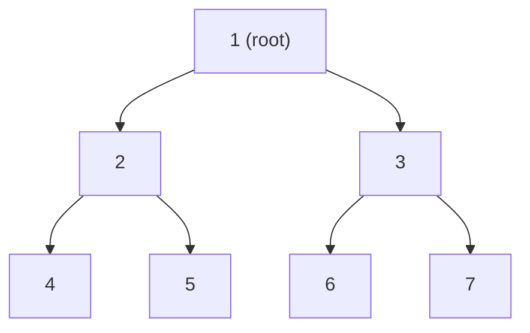
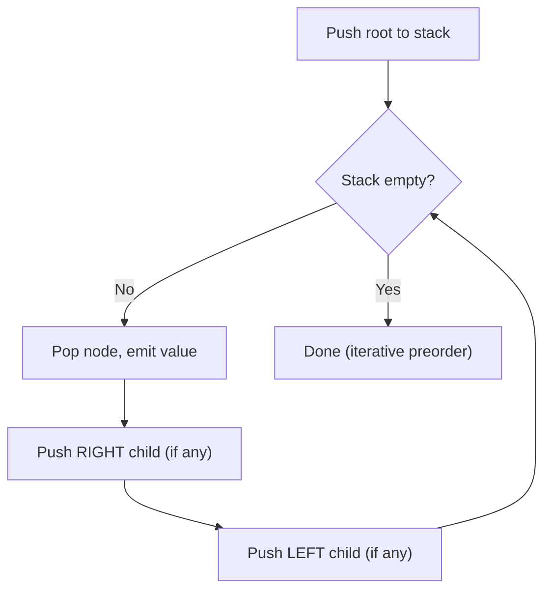
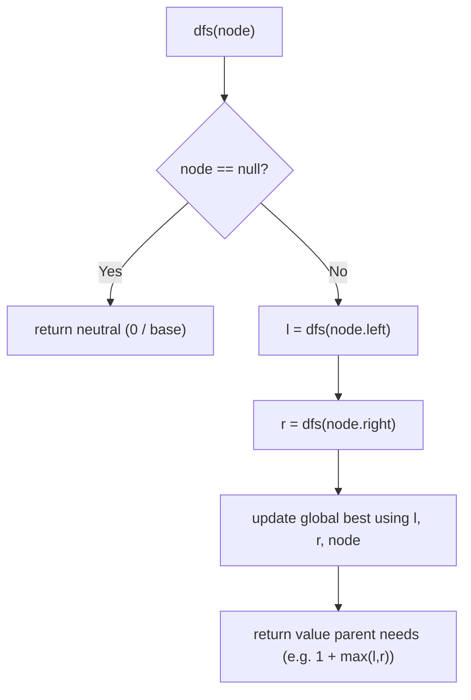
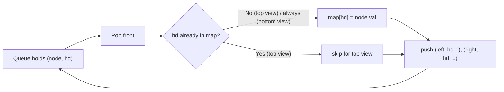
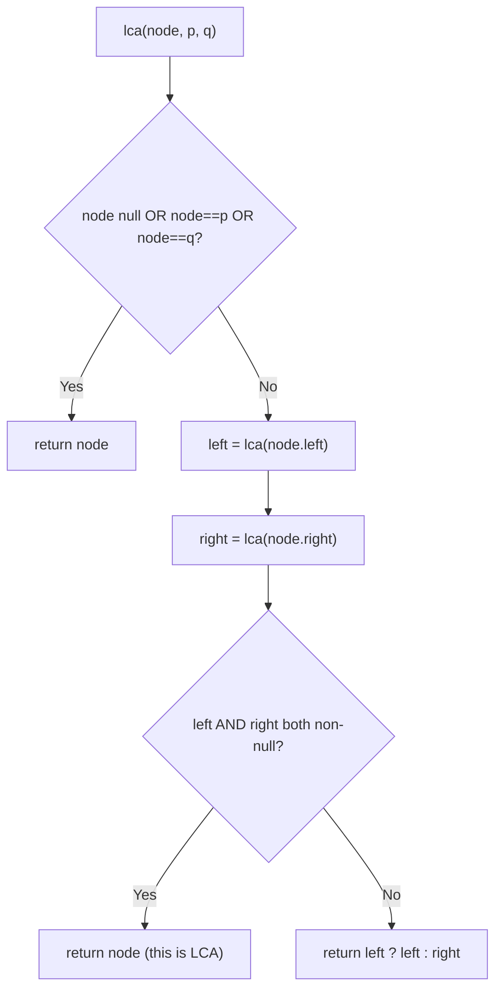
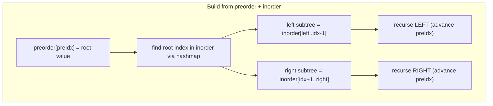
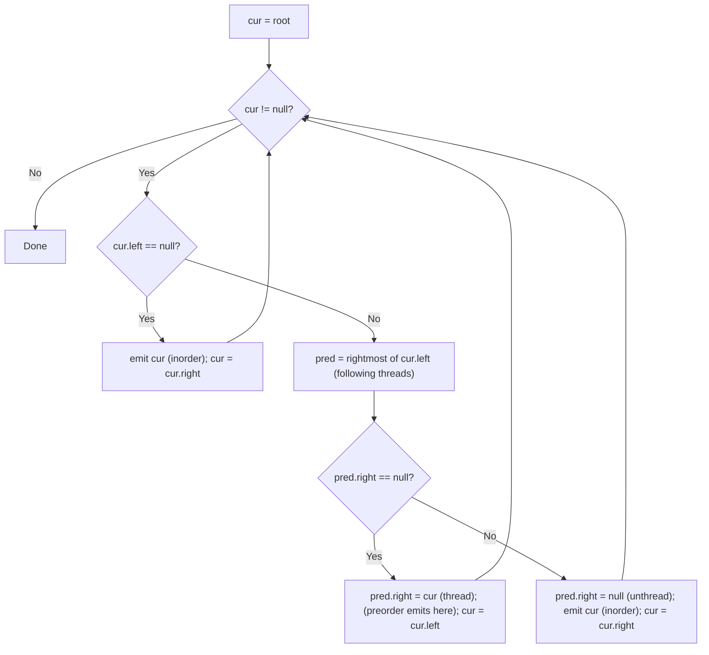

# Step 13: Binary Trees [Traversals, Medium and Hard Problems]

Master every binary-tree traversal (recursive, iterative, and Morris), the tree-view family, LCA, and the all-important bottom-up recursion pattern that powers most tree interviews.

**Stats:** 39 problems total — 🟢 8 Easy · 🟡 21 Medium · 🔴 10 Hard.

---

## 📌 Overview & Why It Matters

A **binary tree** is a hierarchical structure where each node has at most two children (`left`, `right`). Unlike a BST, there is **no ordering guarantee** between nodes — so almost every algorithm here is built on plain **DFS recursion** or **BFS with a queue**.

Binary trees are one of the highest-frequency interview topics at FAANG-tier companies. Interviewers love them because a single tree can test:
- **Recursion & base cases** — the natural way to decompose a tree into sub-problems.
- **DFS vs BFS thinking** — knowing which traversal fits which question.
- **The bottom-up return pattern** — compute a child's answer, combine at the parent, and simultaneously track a global best. This one idea solves diameter, balanced-check, max-path-sum, LCA, and more.

**Where it shows up:** traversal warm-ups, then follow-ups like "return the diameter", "find the LCA", "views of the tree", "reconstruct the tree from traversals", "serialize/deserialize". Amazon in particular loves LCA and reconstruction; Google loves path/BFS variants.

**Prerequisites:** comfort with recursion, the call stack, queues/deques, hash maps, and Big-O. If recursion still feels shaky, drill traversals first — everything else is a variation.

---

## 🧠 Core Concepts

**Node definition (used throughout):**

```cpp
struct TreeNode {
    int val;
    TreeNode *left;
    TreeNode *right;
    TreeNode(int x) : val(x), left(nullptr), right(nullptr) {}
};
```

**Vocabulary you must own:**
- **Height / Depth** — longest edge-path from a node to a leaf (height) or from root down to a node (depth).
- **Leaf** — node with no children. **Internal** — node with ≥1 child.
- **Complete tree** — all levels full except possibly the last, filled left-to-right.
- **Balanced tree** — for every node, `|height(left) − height(right)| ≤ 1`.
- **DFS orders** — Preorder (Root, L, R), Inorder (L, Root, R), Postorder (L, R, Root).
- **BFS order** — Level order, using a queue.
- **Threaded / Morris traversal** — reuse the `n+1` null right-pointers to walk without a stack → **O(1)** extra space.

**The three DFS orders on one tree** (root = 1):



For the tree above:
- **Preorder** (Root→L→R): `1 2 4 5 3 6 7`
- **Inorder** (L→Root→R): `4 2 5 1 6 3 7`
- **Postorder** (L→R→Root): `4 5 2 6 7 3 1`
- **Level order** (BFS): `1 2 3 4 5 6 7`

**Mental model:** recursion visits every node three times (before-left, between children, after-right). *Which visit you "emit" the node on decides the order.*

---

## 🔑 Patterns & Approaches

### Pattern 1 — Traversals (Recursive, Iterative & One-Pass)

**When to use / recognition signals:** Any time you must visit every node in a defined order — collecting values, printing, or as the backbone of a larger algorithm. "Return the inorder/preorder/level order", "traverse without recursion" (⇒ iterative with a stack), "traverse in O(1) space" (⇒ Morris).

**The approach:**
- **Recursive DFS** — trivial; just place the "visit" line at the right spot (before, between, after the recursive calls).
- **Iterative preorder** — push root; pop, emit, push **right then left** (so left comes out first).
- **Iterative inorder** — walk left pushing nodes; when null, pop → emit → go right.
- **Iterative postorder (2 stacks)** — do a modified preorder (Root, R, L) into stack2, then pop stack2 → reversed = postorder.
- **Iterative postorder (1 stack)** — track a `prev` pointer to decide whether to descend right or emit.
- **One-pass all-three** — carry a state `(node, state=1/2/3)` on the stack; state 1→preorder, 2→inorder, 3→postorder.
- **Level order (BFS)** — queue; process one full level per outer loop iteration.



**Complexity:** All traversals are **O(n)** time. Space: recursive/iterative **O(h)** stack (O(n) worst skewed, O(log n) balanced); BFS **O(w)** for the widest level; Morris **O(1)**.

**Reusable templates:**

```cpp
// Recursive (swap the emit line for pre/in/post)
void inorder(TreeNode* root, vector<int>& out) {
    if (!root) return;
    inorder(root->left, out);
    out.push_back(root->val);      // emit BETWEEN children => inorder
    inorder(root->right, out);
}

// Iterative preorder
vector<int> preorder(TreeNode* root) {
    vector<int> out; if (!root) return out;
    stack<TreeNode*> st; st.push(root);
    while (!st.empty()) {
        TreeNode* n = st.top(); st.pop();
        out.push_back(n->val);
        if (n->right) st.push(n->right);   // right first
        if (n->left)  st.push(n->left);    // left popped first
    }
    return out;
}

// Iterative inorder
vector<int> inorderIter(TreeNode* root) {
    vector<int> out; stack<TreeNode*> st; TreeNode* cur = root;
    while (cur || !st.empty()) {
        while (cur) { st.push(cur); cur = cur->left; }
        cur = st.top(); st.pop();
        out.push_back(cur->val);
        cur = cur->right;
    }
    return out;
}

// Iterative postorder — 2 stacks
vector<int> postorder2(TreeNode* root) {
    vector<int> out; if (!root) return out;
    stack<TreeNode*> s1, s2; s1.push(root);
    while (!s1.empty()) {
        TreeNode* n = s1.top(); s1.pop(); s2.push(n);
        if (n->left)  s1.push(n->left);
        if (n->right) s1.push(n->right);
    }
    while (!s2.empty()) { out.push_back(s2.top()->val); s2.pop(); }
    return out;
}

// All three in ONE traversal (state machine)
void allThree(TreeNode* root, vector<int>& pre, vector<int>& in, vector<int>& post) {
    if (!root) return;
    stack<pair<TreeNode*,int>> st; st.push({root, 1});
    while (!st.empty()) {
        auto [node, state] = st.top(); st.pop();
        if (state == 1) { pre.push_back(node->val); st.push({node, 2});
                          if (node->left) st.push({node->left, 1}); }
        else if (state == 2) { in.push_back(node->val); st.push({node, 3});
                               if (node->right) st.push({node->right, 1}); }
        else { post.push_back(node->val); }
    }
}

// Level order (BFS)
vector<vector<int>> levelOrder(TreeNode* root) {
    vector<vector<int>> res; if (!root) return res;
    queue<TreeNode*> q; q.push(root);
    while (!q.empty()) {
        int sz = q.size(); vector<int> level;
        for (int i = 0; i < sz; ++i) {
            TreeNode* n = q.front(); q.pop();
            level.push_back(n->val);
            if (n->left)  q.push(n->left);
            if (n->right) q.push(n->right);
        }
        res.push_back(level);
    }
    return res;
}
```

**Problems:**

| # | Problem | Difficulty | Practice |
|---|---------|-----------|----------|
| 1 | Introduction to Trees | 🟢 Easy | [Article](https://takeuforward.org/binary-tree/introduction-to-trees/) · [🎥](https://youtu.be/_ANrF3FJm7I) |
| 2 | Binary Tree Representation in Java | 🟢 Easy | [Article](https://takeuforward.org/binary-tree/binary-tree-representation-in-java/) · [🎥](https://youtu.be/hyLyW7rP24I) |
| 3 | Pre, Post, Inorder in one traversal | 🟢 Easy | [Article](https://takeuforward.org/data-structure/preorder-inorder-postorder-traversals-in-one-traversal/) · [🎥](https://youtu.be/ySp2epYvgTE) |
| 4 | Preorder Traversal | 🟢 Easy | [LeetCode](https://leetcode.com/problems/binary-tree-preorder-traversal/) · [🎥](https://youtu.be/RlUu72JrOCQ) |
| 5 | Inorder Traversal of Binary Tree | 🟢 Easy | [LeetCode](https://leetcode.com/problems/binary-tree-inorder-traversal/) · [🎥](https://youtu.be/Z_NEgBgbRVI) |
| 6 | Postorder Traversal | 🟢 Easy | [LeetCode](https://leetcode.com/problems/binary-tree-postorder-traversal/) · [🎥](https://youtu.be/2YBhNLodD8Q) |
| 7 | Level Order Traversal | 🟢 Easy | [LeetCode](https://leetcode.com/problems/binary-tree-level-order-traversal/) · [🎥](https://youtu.be/EoAsWbO7sqg) |
| 8 | Iterative Preorder Traversal | 🟢 Easy | [LeetCode](https://leetcode.com/problems/binary-tree-preorder-traversal/) · [🎥](https://youtu.be/Bfqd8BsPVuw) |
| 9 | Iterative Inorder Traversal | 🟢 Easy | [LeetCode](https://leetcode.com/problems/binary-tree-inorder-traversal/) · [🎥](https://youtu.be/lxTGsVXjwvM) |
| 10 | Postorder Traversal using 2 stacks | 🟢 Easy | [LeetCode](https://leetcode.com/problems/binary-tree-postorder-traversal/) · [🎥](https://youtu.be/2YBhNLodD8Q) |
| 11 | Postorder Traversal using 1 stack | 🟢 Easy | [LeetCode](https://leetcode.com/problems/binary-tree-postorder-traversal/) · [🎥](https://youtu.be/NzIGLLwZBS8) |
| 12 | Pre/In/Post in one Traversal | 🟢 Easy | [Article](https://takeuforward.org/data-structure/preorder-inorder-postorder-traversals-in-one-traversal/) · [🎥](https://youtu.be/ySp2epYvgTE) |

**Edge cases & gotchas:**
- Empty tree → return empty result, never dereference null.
- Iterative preorder: push **right before left** or your order flips.
- Postorder 1-stack: the `prev` bookkeeping is the classic bug source — 2-stack is safer under pressure.
- BFS: snapshot `q.size()` *before* the inner loop, otherwise you mix levels.

---

### Pattern 2 — Bottom-Up Recursion (Height, Balance, Diameter, Path Sum, Same/Symmetric)

**When to use / recognition signals:** "Return the maximum/minimum/diameter/path-sum...", "check if the whole tree satisfies property X", "compare two trees". Signal: **the answer at a node depends on answers from its subtrees**. You recurse, get children's results, combine them, and often update a **global best** while returning a *different* value upward.

**The approach (the money pattern):**
1. Base case returns a neutral value for null (e.g. height `0`, or `INT_MIN`-safe `0` for path sums).
2. Recurse into left and right to get their computed values.
3. **Combine** them to (a) update a shared/global answer (e.g. `diameter = max(diameter, l + r)`), and (b) **return** the value the parent needs (e.g. `1 + max(l, r)` for height).

This "compute once, use for two purposes" trick turns naive O(n²) into **O(n)** — because you never re-traverse subtrees to recompute heights.



**Complexity:** **O(n)** time (each node visited once), **O(h)** recursion stack.

**Reusable template (diameter as the archetype):**

```cpp
int diameter = 0;
int height(TreeNode* node) {
    if (!node) return 0;
    int l = height(node->left);
    int r = height(node->right);
    diameter = max(diameter, l + r);        // combine: use children
    return 1 + max(l, r);                    // return: what parent needs
}

// Balanced check: return -1 to short-circuit imbalance
int check(TreeNode* node) {
    if (!node) return 0;
    int l = check(node->left);  if (l == -1) return -1;
    int r = check(node->right); if (r == -1) return -1;
    if (abs(l - r) > 1) return -1;
    return 1 + max(l, r);
}

// Max path sum: clamp negatives to 0
int best = INT_MIN;
int gain(TreeNode* node) {
    if (!node) return 0;
    int l = max(0, gain(node->left));
    int r = max(0, gain(node->right));
    best = max(best, node->val + l + r);     // path THROUGH this node
    return node->val + max(l, r);            // path CONTINUING upward
}

// Same tree
bool same(TreeNode* a, TreeNode* b) {
    if (!a || !b) return a == b;
    return a->val == b->val && same(a->left, b->left) && same(a->right, b->right);
}

// Symmetric: compare mirror pairs
bool mirror(TreeNode* a, TreeNode* b) {
    if (!a || !b) return a == b;
    return a->val == b->val && mirror(a->left, b->right) && mirror(a->right, b->left);
}
```

**Problems:**

| # | Problem | Difficulty | Practice |
|---|---------|-----------|----------|
| 1 | Maximum Depth in BT | 🟡 Medium | [LeetCode](https://leetcode.com/problems/maximum-depth-of-binary-tree/) · [🎥](https://youtu.be/eD3tmO66aBA) |
| 2 | Check for balanced binary tree | 🟡 Medium | [LeetCode](https://leetcode.com/problems/balanced-binary-tree/) · [🎥](https://youtu.be/Yt50Jfbd8Po) |
| 3 | Diameter of Binary Tree | 🟢 Easy | [LeetCode](https://leetcode.com/problems/diameter-of-binary-tree/) · [🎥](https://youtu.be/Rezetez59Nk) |
| 4 | Maximum path sum | 🟡 Medium | [LeetCode](https://leetcode.com/problems/binary-tree-maximum-path-sum/) · [🎥](https://youtu.be/WszrfSwMz58) |
| 5 | Check if two trees are identical | 🟡 Medium | [LeetCode](https://leetcode.com/problems/same-tree/) · [🎥](https://youtu.be/BhuvF_-PWS0) |
| 6 | Symmetric Binary Tree | 🟡 Medium | [LeetCode](https://leetcode.com/problems/symmetric-tree/) · [🎥](https://www.youtube.com/watch?v=nKggNAiEpBE) |

**Edge cases & gotchas:**
- **Max path sum**: clamp child gains to `max(0, gain)` (skip negative branches), and the "answer through node" (`val + l + r`) is *not* what you return upward (`val + max(l,r)`).
- Initialize `best = INT_MIN`, not 0 — trees can be all-negative.
- Balanced check: the `-1` sentinel short-circuits and keeps it O(n); the naive height-per-node call is O(n²).

---

### Pattern 3 — BFS / Level-Order Variants (Zig-Zag, Views, Vertical, Width)

**When to use / recognition signals:** "level by level", "left/right/top/bottom view", "zig-zag / spiral", "vertical order", "maximum width", "nodes at distance k from root". Anything about **horizontal structure, columns, or per-level processing** → reach for a queue.

**The approach:**
- **Zig-zag:** normal BFS but reverse alternate levels (toggle a `leftToRight` flag).
- **Right view:** last node of each BFS level (or first-seen at each depth in a right-first DFS). **Left view:** first node per level.
- **Top view:** BFS carrying a **horizontal distance (hd)**; record the *first* node seen at each hd. **Bottom view:** record the *last* node seen at each hd.
- **Vertical order:** BFS/DFS with `(hd, depth)`; group by hd (sorted), then by depth, then by value for ties (LeetCode variant).
- **Maximum width:** BFS assigning **positional indices** (`2*i+1`, `2*i+2`); width of a level = `last - first + 1`. Normalize indices per level to avoid overflow.



**Complexity:** BFS traversals **O(n)** time; views with an ordered map by hd cost **O(n log n)** for sorting columns (or O(n) with min/max hd tracking), space **O(n)**.

**Reusable templates:**

```cpp
// Zig-zag
vector<vector<int>> zigzag(TreeNode* root) {
    vector<vector<int>> res; if (!root) return res;
    queue<TreeNode*> q; q.push(root); bool l2r = true;
    while (!q.empty()) {
        int sz = q.size(); vector<int> row(sz);
        for (int i = 0; i < sz; ++i) {
            TreeNode* n = q.front(); q.pop();
            int idx = l2r ? i : sz - 1 - i;
            row[idx] = n->val;
            if (n->left)  q.push(n->left);
            if (n->right) q.push(n->right);
        }
        l2r = !l2r; res.push_back(row);
    }
    return res;
}

// Top view (bottom view: drop the "if not seen" check)
vector<int> topView(TreeNode* root) {
    map<int,int> m;                          // hd -> value (ordered)
    queue<pair<TreeNode*,int>> q; if (root) q.push({root, 0});
    while (!q.empty()) {
        auto [n, hd] = q.front(); q.pop();
        if (!m.count(hd)) m[hd] = n->val;    // top: keep first; bottom: always overwrite
        if (n->left)  q.push({n->left,  hd - 1});
        if (n->right) q.push({n->right, hd + 1});
    }
    vector<int> res; for (auto& [k,v] : m) res.push_back(v);
    return res;
}

// Right view via DFS (visit right first; record first node per depth)
void rightView(TreeNode* n, int depth, vector<int>& res) {
    if (!n) return;
    if (depth == (int)res.size()) res.push_back(n->val);
    rightView(n->right, depth + 1, res);
    rightView(n->left,  depth + 1, res);
}

// Maximum width using positional index
int widthOfBinaryTree(TreeNode* root) {
    if (!root) return 0; long ans = 0;
    queue<pair<TreeNode*,long>> q; q.push({root, 0});
    while (!q.empty()) {
        int sz = q.size(); long first = q.front().second, idx = first;
        for (int i = 0; i < sz; ++i) {
            auto [n, id] = q.front(); q.pop();
            idx = id - first;                       // normalize to prevent overflow
            if (n->left)  q.push({n->left,  2*idx + 1});
            if (n->right) q.push({n->right, 2*idx + 2});
        }
        ans = max(ans, idx + 1);
    }
    return (int)ans;
}
```

**Problems:**

| # | Problem | Difficulty | Practice |
|---|---------|-----------|----------|
| 1 | Zig Zag or Spiral Traversal | 🟡 Medium | [LeetCode](https://leetcode.com/problems/binary-tree-zigzag-level-order-traversal/) · [🎥](https://youtu.be/3OXWEdlIGl4) |
| 2 | Boundary Traversal | 🟡 Medium | [LeetCode](https://leetcode.com/problems/boundary-of-binary-tree/) · [🎥](https://youtu.be/0ca1nvR0be4) |
| 3 | Vertical Order Traversal | 🟡 Medium | [LeetCode](https://leetcode.com/problems/vertical-order-traversal-of-a-binary-tree/) · [🎥](https://youtu.be/q_a6lpbKJdw) |
| 4 | Top View of BT | 🟡 Medium | [Article](https://takeuforward.org/data-structure/top-view-of-a-binary-tree/) · [🎥](https://youtu.be/Et9OCDNvJ78) |
| 5 | Bottom View of BT | 🟡 Medium | [Article](https://takeuforward.org/data-structure/bottom-view-of-a-binary-tree/) · [🎥](https://youtu.be/0FtVY6I4pB8) |
| 6 | Right/Left View of Binary Tree | 🟡 Medium | [LeetCode](https://leetcode.com/problems/binary-tree-right-side-view/) · [🎥](https://youtu.be/KV4mRzTjlAk) |
| 7 | Maximum Width of BT | 🟡 Medium | [LeetCode](https://leetcode.com/problems/maximum-width-of-binary-tree/) · [🎥](https://youtu.be/ZbybYvcVLks) |

**Edge cases & gotchas:**
- **Max width**: node indices explode; use `long` and normalize each level by subtracting `first`.
- **Top vs bottom view** differ by ONE line (keep-first vs always-overwrite). Both keyed by horizontal distance.
- **Vertical order (LeetCode)** requires tie-break by value at the same `(hd, depth)`; a plain map isn't enough — sort within a column.
- **Boundary traversal** has three parts (left boundary top-down excluding leaves, all leaves left-to-right, right boundary bottom-up excluding leaves) — avoid double-counting the root and corner leaves.

---

### Pattern 4 — Root-to-Node Path, LCA & Distance-K (Path/Parent Techniques)

**When to use / recognition signals:** "print path from root to X", "lowest common ancestor", "nodes at distance k from a target", "children-sum property", "minimum time to burn the tree". Signal: you need to **know a node's ancestors/parents** or **traverse in all directions** from a node.

**The approach:**
- **Root-to-node path:** DFS carrying a path vector; on match, freeze the path (or backtrack on failure).
- **LCA (optimal):** single DFS returning: null if neither found; the node itself if it *is* p or q; if **both** left and right returns are non-null, the current node is the LCA; else propagate the non-null side upward.
- **Distance K / Burn tree:** these need to move **toward parents too**. Build a `child → parent` map (BFS/DFS once), then run a **BFS outward** from the target treating the tree as an undirected graph, tracking visited.
- **Children-sum property:** bottom-up check that `node.val == left.val + right.val` (with a modify-variant that pushes values down).



**Complexity:** LCA & root-to-path **O(n)** time, **O(h)** space. Distance-K / burn: **O(n)** to build parent map + **O(n)** BFS = **O(n)** time, **O(n)** space (map + visited + queue).

**Reusable templates:**

```cpp
// Root-to-node path
bool getPath(TreeNode* node, int target, vector<int>& path) {
    if (!node) return false;
    path.push_back(node->val);
    if (node->val == target) return true;
    if (getPath(node->left, target, path) || getPath(node->right, target, path)) return true;
    path.pop_back();                 // backtrack
    return false;
}

// LCA in binary tree (no BST property)
TreeNode* lca(TreeNode* node, TreeNode* p, TreeNode* q) {
    if (!node || node == p || node == q) return node;
    TreeNode* l = lca(node->left,  p, q);
    TreeNode* r = lca(node->right, p, q);
    if (l && r) return node;         // p, q on opposite sides
    return l ? l : r;
}

// Distance K: parent map + BFS outward
void mapParents(TreeNode* root, unordered_map<TreeNode*, TreeNode*>& par) {
    queue<TreeNode*> q; q.push(root);
    while (!q.empty()) {
        TreeNode* n = q.front(); q.pop();
        if (n->left)  { par[n->left]  = n; q.push(n->left); }
        if (n->right) { par[n->right] = n; q.push(n->right); }
    }
}
vector<int> distanceK(TreeNode* root, TreeNode* target, int k) {
    unordered_map<TreeNode*, TreeNode*> par; mapParents(root, par);
    unordered_set<TreeNode*> seen; queue<TreeNode*> q;
    q.push(target); seen.insert(target); int dist = 0;
    while (!q.empty()) {
        if (dist == k) break;
        int sz = q.size();
        for (int i = 0; i < sz; ++i) {
            TreeNode* n = q.front(); q.pop();
            for (TreeNode* nb : {n->left, n->right, par.count(n) ? par[n] : nullptr})
                if (nb && !seen.count(nb)) { seen.insert(nb); q.push(nb); }
        }
        ++dist;
    }
    vector<int> res; while (!q.empty()) { res.push_back(q.front()->val); q.pop(); }
    return res;
}
```

**Problems:**

| # | Problem | Difficulty | Practice |
|---|---------|-----------|----------|
| 1 | Print root to leaf path in BT | 🟡 Medium | [Article](https://takeuforward.org/data-structure/print-root-to-node-path-in-a-binary-tree/) · [🎥](https://youtu.be/fmflMqVOC7k) |
| 2 | LCA in BT | 🔴 Hard | [LeetCode](https://leetcode.com/problems/lowest-common-ancestor-of-a-binary-tree/) · [🎥](https://youtu.be/_-QHfMDde90) |
| 3 | Children Sum Property | 🟡 Medium | [Article](https://takeuforward.org/data-structure/check-for-children-sum-property-in-a-binary-tree/) · [🎥](https://youtu.be/fnmisPM6cVo) |
| 4 | Nodes at distance K in BT | 🔴 Hard | [LeetCode](https://leetcode.com/problems/all-nodes-distance-k-in-binary-tree/) · [🎥](https://youtu.be/i9ORlEy6EsI) |
| 5 | Minimum time to burn the BT | 🔴 Hard | [Article](https://takeuforward.org/data-structure/minimum-time-taken-to-burn-the-binary-tree-from-a-node) · [🎥](https://youtu.be/2r5wLmQfD6g) |

**Edge cases & gotchas:**
- **LCA** assumes both nodes exist in the tree; if not guaranteed, verify presence separately.
- **Distance K / Burn**: forgetting the parent edge is the #1 bug — the target radiates in *three* directions. "Burn time" = the max BFS level reached from the fire's start node.
- **Root-to-path**: remember to `pop_back()` on the failing branch (backtracking).
- **Children-sum modify variant**: propagate the larger child down first to avoid violating the property mid-update.

---

### Pattern 5 — Tree Construction, Serialization & Structural Transforms

**When to use / recognition signals:** "build the tree from inorder+preorder/postorder", "serialize and deserialize", "flatten to linked list", "count nodes in a complete tree". Signal: you're **creating or reshaping** the tree rather than just reading it.

**The approach:**
- **Unique-construction rule:** inorder + (preorder OR postorder) ⇒ unique tree. preorder + postorder does **not** (ambiguous for nodes with one child). Inorder is what disambiguates left/right subtrees.
- **Build from pre+in:** preorder's first element is the root; find it in inorder → everything left is left subtree, right is right subtree. Use a **hashmap of value→inorder-index** for O(1) splits, and a moving preorder index.
- **Build from post+in:** postorder's *last* element is the root; consume postorder right-to-left, building **right subtree before left**.
- **Serialize/deserialize:** BFS (level order with `#`/`null` markers) or preorder DFS; deserialize by reading tokens in the same order.
- **Flatten to linked list:** rewire so each node's `right` follows preorder and `left` is null — reverse-postorder (R→L→Root) with a running `prev`, or Morris-style.
- **Count complete-tree nodes:** compute left-spine and right-spine heights; if equal → perfect subtree of `2^h - 1`; else recurse. Gives **O(log²n)**.



**Complexity:** Construction & serialize/deserialize **O(n)** time, **O(n)** space (hashmap + recursion). Flatten **O(n)** time, **O(1)** with Morris. Count complete nodes **O(log²n)** time.

**Reusable templates:**

```cpp
// Build from preorder + inorder
TreeNode* buildPreIn(vector<int>& pre, vector<int>& in) {
    unordered_map<int,int> idx;
    for (int i = 0; i < (int)in.size(); ++i) idx[in[i]] = i;
    int preIdx = 0;
    function<TreeNode*(int,int)> go = [&](int l, int r) -> TreeNode* {
        if (l > r) return nullptr;
        int rootVal = pre[preIdx++];
        TreeNode* root = new TreeNode(rootVal);
        int mid = idx[rootVal];
        root->left  = go(l, mid - 1);
        root->right = go(mid + 1, r);
        return root;
    };
    return go(0, (int)in.size() - 1);
}

// Serialize / deserialize (BFS)
string serialize(TreeNode* root) {
    if (!root) return "";
    string s; queue<TreeNode*> q; q.push(root);
    while (!q.empty()) {
        TreeNode* n = q.front(); q.pop();
        if (!n) { s += "#,"; continue; }
        s += to_string(n->val) + ",";
        q.push(n->left); q.push(n->right);
    }
    return s;
}
TreeNode* deserialize(string data) {
    if (data.empty()) return nullptr;
    stringstream ss(data); string tok;
    getline(ss, tok, ','); TreeNode* root = new TreeNode(stoi(tok));
    queue<TreeNode*> q; q.push(root);
    while (!q.empty()) {
        TreeNode* n = q.front(); q.pop();
        if (getline(ss, tok, ',') && tok != "#") { n->left = new TreeNode(stoi(tok)); q.push(n->left); }
        if (getline(ss, tok, ',') && tok != "#") { n->right = new TreeNode(stoi(tok)); q.push(n->right); }
    }
    return root;
}

// Flatten to linked list (reverse preorder with prev)
TreeNode* prev_ = nullptr;
void flatten(TreeNode* root) {
    if (!root) return;
    flatten(root->right);
    flatten(root->left);
    root->right = prev_;
    root->left  = nullptr;
    prev_ = root;
}

// Count nodes in a complete tree — O(log^2 n)
int countNodes(TreeNode* root) {
    if (!root) return 0;
    int lh = 0, rh = 0;
    for (TreeNode* n = root; n; n = n->left)  ++lh;
    for (TreeNode* n = root; n; n = n->right) ++rh;
    if (lh == rh) return (1 << lh) - 1;               // perfect subtree
    return 1 + countNodes(root->left) + countNodes(root->right);
}
```

**Problems:**

| # | Problem | Difficulty | Practice |
|---|---------|-----------|----------|
| 1 | Count total nodes in a complete BT | 🟢 Easy | [LeetCode](https://leetcode.com/problems/count-complete-tree-nodes/) · [🎥](https://youtu.be/u-yWemKGWO0) |
| 2 | Requirements to construct a unique BT | 🟡 Medium | [🎥](https://youtu.be/9GMECGQgWrQ) |
| 3 | Construct BT from Preorder and Inorder | 🔴 Hard | [LeetCode](https://leetcode.com/problems/construct-binary-tree-from-preorder-and-inorder-traversal/) · [🎥](https://youtu.be/aZNaLrVebKQ) |
| 4 | Construct BT from Postorder and Inorder | 🔴 Hard | [LeetCode](https://leetcode.com/problems/construct-binary-tree-from-inorder-and-postorder-traversal/) · [🎥](https://youtu.be/LgLRTaEMRVc) |
| 5 | Serialize and De-serialize BT | 🔴 Hard | [LeetCode](https://leetcode.com/problems/serialize-and-deserialize-binary-tree/) · [🎥](https://youtu.be/-YbXySKJsX8) |
| 6 | Flatten Binary Tree to Linked List | 🟡 Medium | [LeetCode](https://leetcode.com/problems/flatten-binary-tree-to-linked-list/) · [🎥](https://youtu.be/sWf7k1x9XR4) |

**Edge cases & gotchas:**
- **preorder + postorder alone is NOT unique** — a classic trap question. You need inorder to fix ambiguity.
- Construction: use a **hashmap for inorder indices** or you fall to O(n²) from linear searches.
- Serialize/deserialize: pick consistent markers/order; handle the empty tree; watch negative and multi-digit values (comma-separate, don't use single chars).
- Flatten with the `prev` trick relies on processing **right subtree first** — reversed preorder.

---

### Pattern 6 — Morris Traversal (Threaded, O(1) Space)

**When to use / recognition signals:** "traverse inorder/preorder using O(1) extra space", "no recursion, no stack". This is the space-optimal traversal and a favorite follow-up after you give the stack-based iterative version.

**The approach (inorder):** For the current node,
1. If there is **no left child** → emit current, go right.
2. Else find the **inorder predecessor** (rightmost node of the left subtree):
   - If its right pointer is null → set it to current (make a **thread**), then go left.
   - If its right pointer already points to current → the thread exists (left subtree done) → **remove the thread**, emit current (inorder), go right.

For **preorder**, emit the node when you *create* the thread (before going left) instead of when you remove it. The temporary threads keep the tree navigable without a stack, and are always restored, so the tree is unchanged at the end.



**Complexity:** **O(n)** time (each edge traversed at most twice — amortized), **O(1)** extra space (no stack/recursion; threads are reused nulls).

**Reusable template:**

```cpp
// Morris inorder
vector<int> morrisInorder(TreeNode* root) {
    vector<int> out; TreeNode* cur = root;
    while (cur) {
        if (!cur->left) { out.push_back(cur->val); cur = cur->right; }
        else {
            TreeNode* pred = cur->left;
            while (pred->right && pred->right != cur) pred = pred->right;
            if (!pred->right) { pred->right = cur; cur = cur->left; }        // make thread
            else { pred->right = nullptr; out.push_back(cur->val); cur = cur->right; } // remove
        }
    }
    return out;
}

// Morris preorder — only change: emit when creating the thread
vector<int> morrisPreorder(TreeNode* root) {
    vector<int> out; TreeNode* cur = root;
    while (cur) {
        if (!cur->left) { out.push_back(cur->val); cur = cur->right; }
        else {
            TreeNode* pred = cur->left;
            while (pred->right && pred->right != cur) pred = pred->right;
            if (!pred->right) { out.push_back(cur->val); pred->right = cur; cur = cur->left; }
            else { pred->right = nullptr; cur = cur->right; }
        }
    }
    return out;
}
```

**Problems:**

| # | Problem | Difficulty | Practice |
|---|---------|-----------|----------|
| 1 | Morris Preorder Traversal | 🔴 Hard | [LeetCode](https://leetcode.com/problems/binary-tree-inorder-traversal/) · [🎥](https://youtu.be/80Zug6D1_r4) |
| 2 | Morris Inorder Traversal | 🔴 Hard | [LeetCode](https://leetcode.com/problems/binary-tree-inorder-traversal/) · [🎥](https://youtu.be/80Zug6D1_r4) |

**Edge cases & gotchas:**
- Predecessor loop condition is `pred->right && pred->right != cur` — the second clause detects an existing thread; miss it and you loop forever.
- **Always remove the thread** on the second visit, or you corrupt the tree (and infinite-loop).
- Preorder vs inorder differ ONLY in *where you emit* (thread-creation vs thread-removal).
- Not thread-safe / not reentrant while running — the tree is temporarily mutated.

---

## ❓ Regularly Asked Interview Questions

**Q: What's the difference between height and depth of a node?**
**A:** Depth = number of edges from the **root down** to the node; height = number of edges on the **longest path down** to a leaf. Root has depth 0; leaves have height 0. Tree height = height of root.

**Q: When would you use BFS over DFS on a tree (and vice versa)?**
**A:** BFS (queue) for level-based questions — level order, views, min depth, width, shortest-distance problems. DFS (recursion/stack) for path, subtree-aggregate, and structural questions where a node's answer depends on its subtrees.

**Q: How does the optimal single-pass LCA work, and what does it assume?**
**A:** DFS returns the node if it equals p or q or is null; if both subtree calls return non-null, the current node is the LCA; otherwise propagate the one non-null result up. It's O(n)/O(h) and assumes both nodes exist in the tree.

**Q: Why is inorder + preorder enough to build a unique tree but preorder + postorder is not?**
**A:** Inorder tells you which values fall in the left vs right subtree relative to the root; preorder/postorder give the root. Preorder + postorder can't distinguish a single child as left vs right, so it's ambiguous unless the tree is full.

**Q: How would you find the diameter of a binary tree in O(n)?**
**A:** Bottom-up: a height function that, at each node, updates a global `diameter = max(diameter, leftHeight + rightHeight)` while returning `1 + max(leftHeight, rightHeight)`. Computing height once per node avoids the O(n²) recompute.

**Q: Explain Morris traversal and its time/space complexity.**
**A:** It threads each node's inorder-predecessor's null right pointer to the node, letting you walk inorder/preorder without recursion or a stack. Each edge is visited at most twice → **O(n)** time, **O(1)** extra space; threads are always restored so the tree is unchanged.

**Q: How do you handle "all nodes at distance K from a target"?**
**A:** Build a child→parent hashmap with one traversal, then BFS outward from the target treating the tree as an undirected graph (left, right, parent), using a visited set; nodes at BFS level K are the answer.

**Q: What is the "minimum time to burn the tree" problem really asking?**
**A:** Same parent-map + BFS-from-target technique; the answer is the maximum BFS distance (number of levels) reached from the burning start node — i.e., the eccentricity of that node.

**Q: How do you compute the maximum path sum where the path can start and end anywhere?**
**A:** Bottom-up: `gain(node) = node.val + max(0, gain(left), gain(right))` returned upward, but update the global best with `node.val + max(0,left) + max(0,right)` (the path bending through the node). Clamp negatives to 0.

**Q: How do you serialize/deserialize a binary tree?**
**A:** Level-order (BFS) with `#` for nulls, comma-separated, or preorder DFS. Deserialize by reading tokens in the same order: for BFS, use a queue to attach children as you read them. Both are O(n).

**Q: How can you count nodes in a complete binary tree faster than O(n)?**
**A:** Compare left-spine and right-spine heights; if equal, the subtree is perfect → `2^h − 1` in O(log n); otherwise recurse both children. Total **O(log²n)**.

**Q: Top view vs bottom view — how do they differ in code?**
**A:** Both use BFS with a horizontal-distance key. Top view records the **first** node seen per hd; bottom view **overwrites** so it keeps the **last** node seen per hd. Literally one line's difference.

**Q: Why snapshot the queue size at the start of each BFS level?**
**A:** So you process exactly the nodes of the current level; children pushed during the loop belong to the next level. Reading `q.size()` inside the loop would blend levels together.

**Q: How do you avoid integer overflow in maximum-width-of-tree?**
**A:** Assign positional indices (`2i+1`, `2i+2`) but normalize each level by subtracting the first index, and use a 64-bit type. Width = `last − first + 1`.

**Q: Iterative postorder — one stack or two?**
**A:** Two stacks is simplest: modified preorder (Root, Right, Left) pushed to stack2, then pop stack2 for postorder. One stack needs a `prev` pointer to decide whether to descend right or emit — more error-prone but O(1) extra vs the second stack.

---

## 💡 Interview Tips & Common Mistakes

- **Always draw the tree** and dry-run on 3–5 nodes before coding. It catches order/pointer bugs instantly.
- **State your traversal choice out loud** ("this is a bottom-up DFS returning height while tracking a global") — interviewers grade communication.
- **Null checks first.** The most common runtime crash is dereferencing a null child. Handle empty tree and single node explicitly.
- **Distinguish "answer through node" from "value returned upward"** in bottom-up problems (diameter, max path sum). Mixing them is the classic bug.
- **For distance-K / burn problems, don't forget the parent edge** — the traversal moves in three directions.
- **Prefer the O(n) single-pass** for balanced-check (return -1 sentinel) and diameter; the naive height-per-node solution is O(n²) and interviewers will push back.
- **Use a hashmap for inorder indices** in construction problems — linear search makes it O(n²).
- **Morris:** never forget to remove the thread; verify the predecessor loop's `!= cur` guard.
- **BFS width:** use `long` and normalize indices to avoid overflow.
- **Recursion depth:** mention that a skewed tree can blow the stack (O(n) depth) — iterative or Morris avoids it.
- Don't confuse a **binary tree** with a **BST** — none of these algorithms may assume ordering.

---

## 🐟 Revision Cheat-Sheet

| Pattern | Key Idea | Time | Space | Signature Problem |
|---------|----------|------|-------|-------------------|
| Traversals (rec/iter/one-pass) | Emit node at pre/in/post visit; queue for BFS | O(n) | O(h) / O(w) | Inorder Traversal |
| Bottom-Up Recursion | Return value up + update global best | O(n) | O(h) | Diameter / Max Path Sum |
| BFS / Level-Order Variants | Queue per level; hd-key for views; index for width | O(n)–O(n log n) | O(n) | Top View / Zig-Zag |
| Path / LCA / Distance-K | Parent map + BFS outward; single-pass LCA | O(n) | O(h)/O(n) | LCA in BT |
| Construction / Serialize / Flatten | Inorder splits subtrees; hashmap indices | O(n) | O(n) | Build from Pre+Inorder |
| Morris (threaded) | Thread predecessor's null right pointer | O(n) | **O(1)** | Morris Inorder |

---

## 🔗 References & Further Reading

- **Striver A2Z — Step 13 (Binary Trees):** https://takeuforward.org/strivers-a2z-dsa-course/strivers-a2z-dsa-course-sheet-2/
- **takeuforward — Introduction to Trees:** https://takeuforward.org/binary-tree/introduction-to-trees/
- **takeuforward — Morris Inorder Traversal:** https://takeuforward.org/data-structure/morris-inorder-traversal-of-a-binary-tree/
- **GeeksforGeeks — Morris Traversal for Inorder:** https://www.geeksforgeeks.org/inorder-tree-traversal-without-recursion-and-without-stack-using-morris-traversal/
- **GeeksforGeeks — Inorder Traversal of Binary Tree:** https://www.geeksforgeeks.org/dsa/inorder-traversal-of-binary-tree/
- **GeeksforGeeks — Tree Data Structure Interview Questions:** https://www.geeksforgeeks.org/dsa/commonly-asked-interview-questions-on-tree/
- **LeetCode Explore — Binary Trees:** https://leetcode.com/explore/learn/card/data-structure-tree/
- **Binary Tree LeetCode Patterns (every pattern you need):** https://syedpeerasaheb.substack.com/i/207748278/pattern-5-lca-and-ancestor-problems
- **CodeIntuition — 6 patterns behind every FAANG tree problem:** https://www.codeintuition.io/blogs/binary-tree-interview-problems
