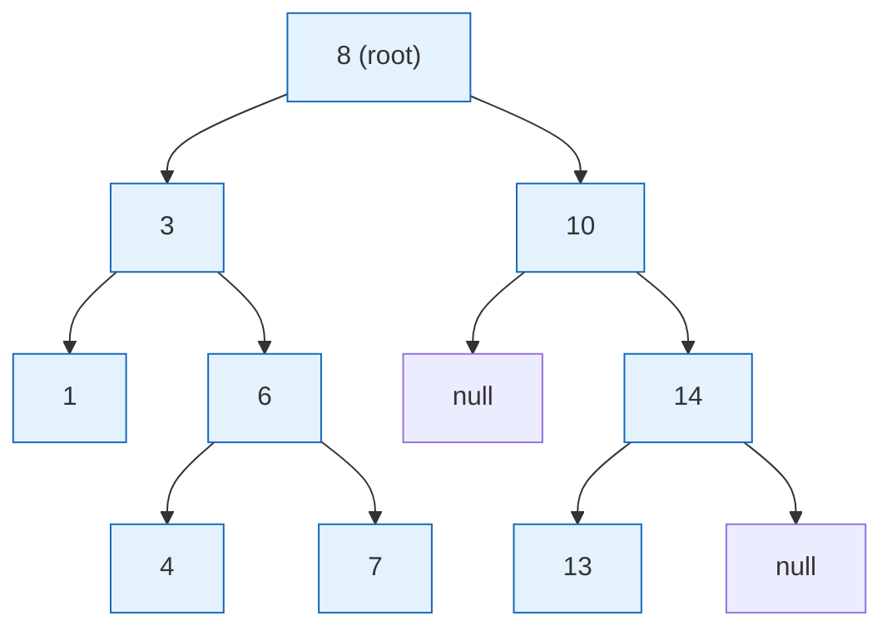
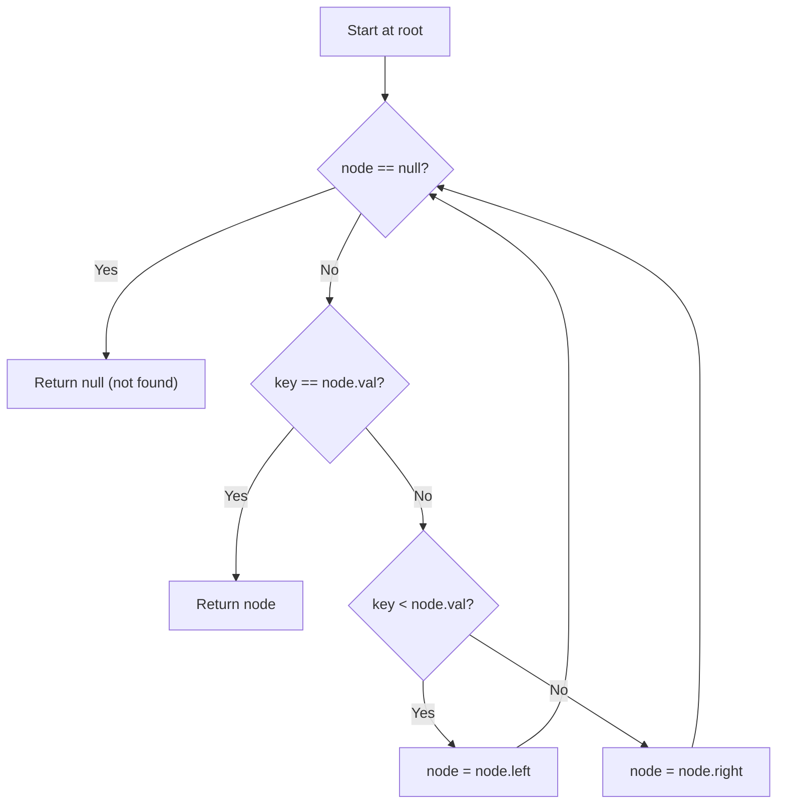
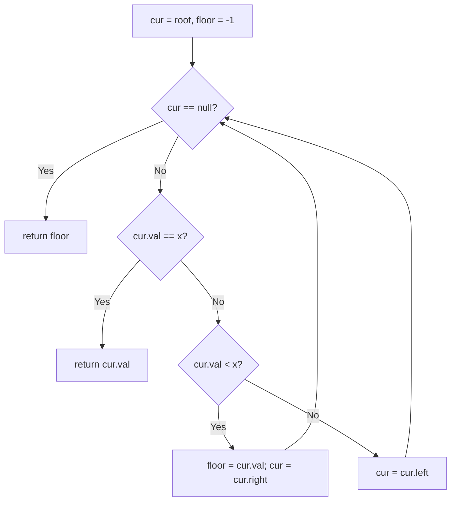
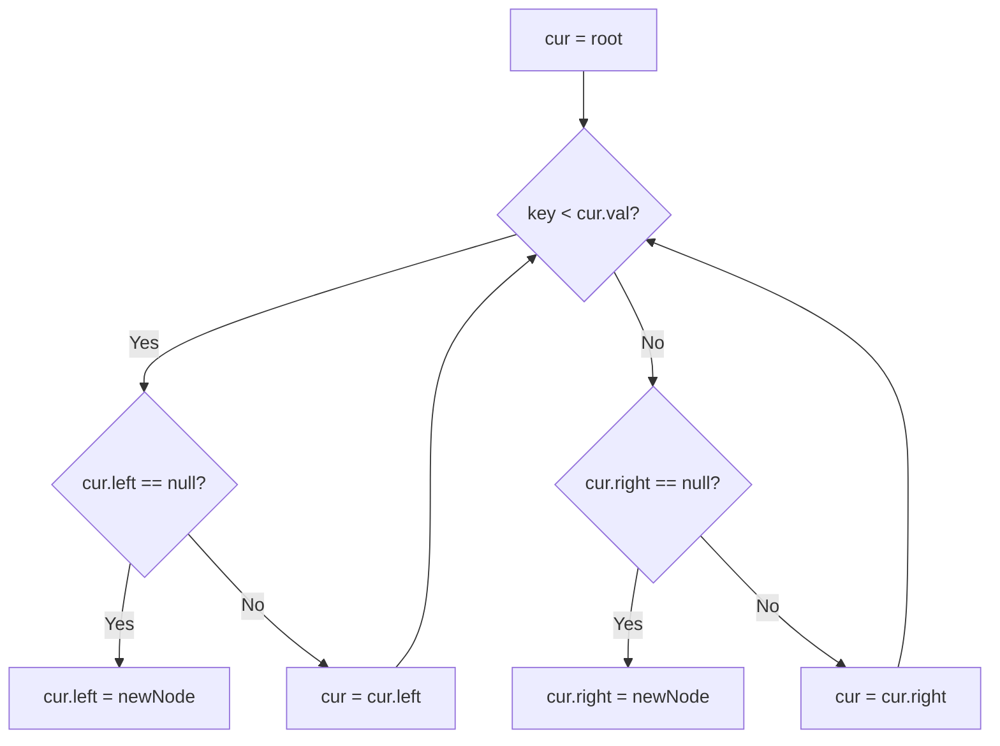
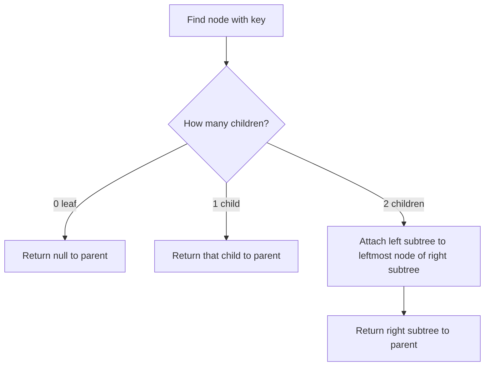
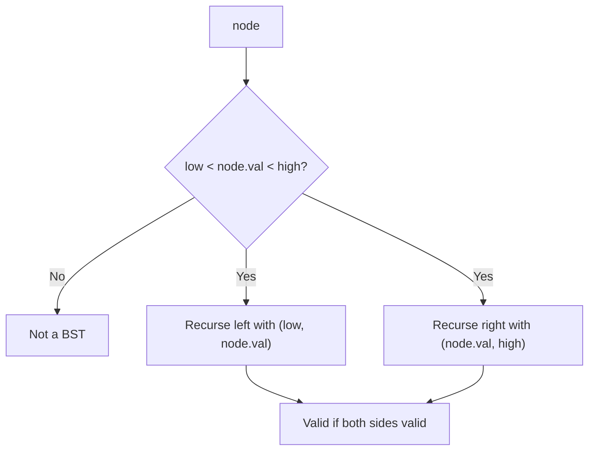
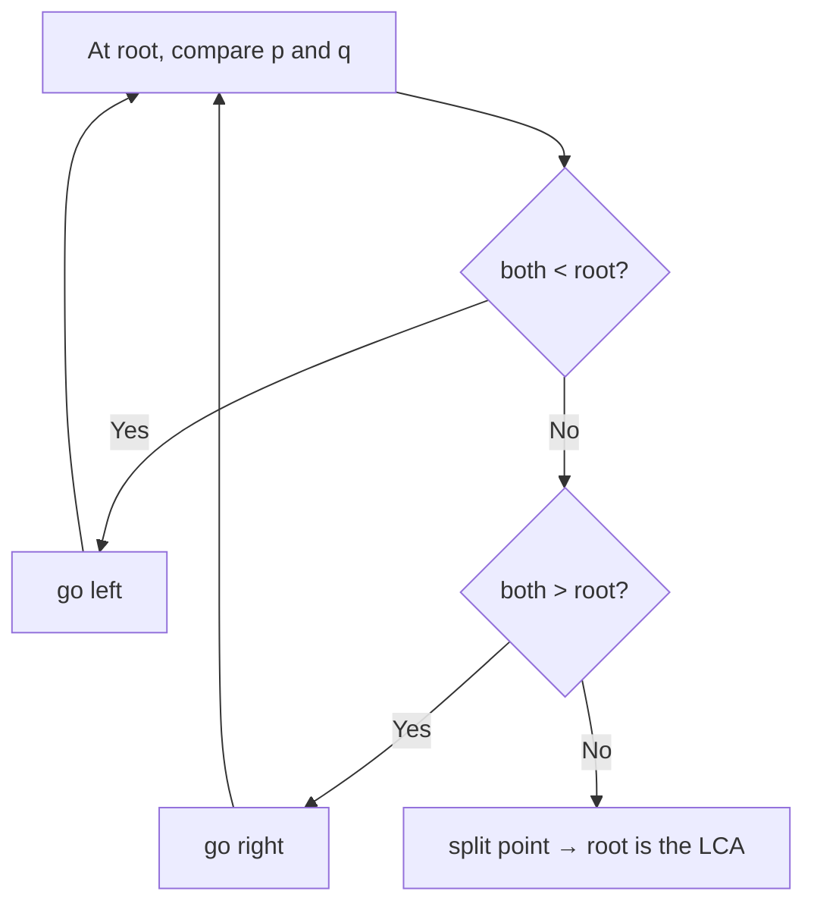

# Step 14: Binary Search Trees [Concept and Problems]

A complete, interview-focused revision guide to the Binary Search Tree (BST): its ordering invariant, core operations (search / insert / delete), successor–predecessor logic, validation, and construction from traversals.

**Stats:** 16 problems total — 🟢 5 Easy · 🟡 7 Medium · 🔴 4 Hard.

---

## 📌 Overview & Why It Matters

A **Binary Search Tree** is a binary tree that maintains a global ordering invariant: for every node, *all* keys in its left subtree are smaller and *all* keys in its right subtree are larger. This single invariant turns a tree into an ordered dictionary — supporting `search`, `insert`, `delete`, `min/max`, `floor/ceil`, `successor/predecessor`, and `kth-smallest` in **O(height)** time.

**Where it shows up in interviews:**
- BSTs are a favorite because they test *recursion, invariants, and asymptotic reasoning* in one shot. A BST question quietly checks whether you understand that **inorder traversal of a BST yields a sorted sequence** — the single most exploited property.
- Extremely common at FAANG/MAANG: *Validate BST*, *Kth Smallest*, *LCA in BST*, *Delete Node*, *Recover BST*, *BST Iterator*, *Two Sum IV*.
- Underlies real systems: `std::map`/`std::set` (red-black trees), database indexes (B-trees are BST generalizations), and range queries.

**Prerequisites:** binary tree traversals (inorder/preorder/postorder), recursion, and basic complexity analysis. If you are shaky on tree traversals, revise Step 13 first.

**The one line that unlocks 80% of problems:** *Inorder of a BST is sorted.* Whenever you see "kth", "closest", "pair with sum", "validate", "recover", or "successor" — think inorder.

---

## 🧠 Core Concepts

- **BST property (invariant):** `left.key < node.key < right.key` recursively for the *entire subtree*, not just direct children. Typically keys are **unique** (some variants allow duplicates on one side).
- **Height `h`:** For a balanced BST `h = O(log n)`; for a skewed (sorted-insert) BST `h = O(n)`. Almost every BST operation is `O(h)`.
- **Inorder traversal = sorted order.** This is the workhorse identity.
- **Successor / Predecessor:** successor = smallest key greater than a node = leftmost node of the right subtree (if it exists). Predecessor = largest key smaller = rightmost node of the left subtree.
- **Floor / Ceil:** floor(x) = largest key ≤ x; ceil(x) = smallest key ≥ x. Found by a single root-to-leaf walk.
- **Balancing:** Self-balancing variants (AVL, Red-Black) guarantee `O(log n)` worst case. Vanilla BST degrades to `O(n)` when keys are inserted in sorted order.



> Inorder of the tree above: `1 3 4 6 7 8 10 13 14` — sorted, as guaranteed by the BST property.

**Node definition (C++, used throughout):**
```cpp
struct TreeNode {
    int val;
    TreeNode *left, *right;
    TreeNode(int x) : val(x), left(nullptr), right(nullptr) {}
};
```

---

## 🔑 Patterns & Approaches

### 1. Concepts — Search / Min-Max (the ordered-walk primitive)

**When to use it / recognition signals:** Any time you must *locate* a key, or find the extreme (min/max) value. Recognition: "search for X", "smallest/largest element", "does key exist". This root-to-leaf comparison walk is the atom that every other BST operation reuses.

**Approach (step by step):**
1. Start at the root.
2. If `key == node.val` → found.
3. If `key < node.val` → go left; else go right.
4. Repeat until found or you fall off the tree (`nullptr`).
5. **Min** = follow `left` pointers until `left == nullptr`. **Max** = follow `right` pointers until `right == nullptr`.



**Complexity:** Time `O(h)` — you descend one level per comparison; Space `O(1)` iterative (`O(h)` if recursive due to stack).

**Reusable template:**
```cpp
// Search — returns the subtree rooted at the found node, or nullptr.
TreeNode* searchBST(TreeNode* root, int key) {
    while (root && root->val != key)
        root = (key < root->val) ? root->left : root->right;
    return root;
}

int findMin(TreeNode* root) {                  // assumes non-empty
    while (root->left) root = root->left;
    return root->val;
}
int findMax(TreeNode* root) {
    while (root->right) root = root->right;
    return root->val;
}
```

**Edge cases & gotchas:** empty tree (return null); single node; comparing with the wrong child direction is the classic off-by-logic bug. Min lives at the *leftmost*, not necessarily a leaf's-leaf — stop when `left` is null even if `right` exists.

| # | Problem | Difficulty | Practice |
|---|---------|-----------|----------|
| 1 | Introduction to BST | 🟢 Easy | [Article](https://takeuforward.org/binary-search-tree/introduction-to-binary-search-trees/) · [🎥](https://youtu.be/p7-9UvDQZ3w) |
| 2 | Search in a Binary Search Tree | 🟢 Easy | [LeetCode](https://leetcode.com/problems/search-in-a-binary-search-tree/) · [🎥](https://youtu.be/KcNt6v_56cc) |
| 3 | Find Min/Max in BST | 🟢 Easy | [Article](https://takeuforward.org/data-structure/find-minmax-in-a-bst) |

---

### 2. Practice Problems — Floor/Ceil, Insert, Delete, Traversal-tricks & Construction

This sub-step packs the majority of BST interview questions. They cluster into **five reusable micro-patterns**, each with its own diagram below. The consolidated problem table appears at the end of the section.

#### 2a. Floor & Ceil — the "best-so-far" root-to-leaf walk

**Recognition:** "largest value ≤ x" (floor) or "smallest value ≥ x" (ceil); nearest lower/upper bound.

**Approach:** Walk down. On each node, if `node.val == x` it *is* the answer. For **floor**: when `node.val <= x`, record it as a candidate and move right (try to get closer from below); else move left. For **ceil**: when `node.val >= x`, record and move left; else move right.



**Complexity:** `O(h)` time, `O(1)` space.

```cpp
int floorInBST(TreeNode* root, int x) {
    int ans = -1;
    while (root) {
        if (root->val == x) return x;
        if (root->val < x) { ans = root->val; root = root->right; }
        else               { root = root->left; }
    }
    return ans;                 // -1 if no key <= x
}
int ceilInBST(TreeNode* root, int x) {
    int ans = -1;
    while (root) {
        if (root->val == x) return x;
        if (root->val > x) { ans = root->val; root = root->left; }
        else               { root = root->right; }
    }
    return ans;
}
```

#### 2b. Insert — always land at a leaf

**Recognition:** "insert a key into a BST" while preserving the invariant.

**Approach:** A new key is *always* inserted as a new leaf. Walk down as in search; when the desired child pointer is null, attach the new node there. No restructuring is needed for a plain (non-balancing) BST.



**Complexity:** `O(h)` time, `O(1)` iterative space.

```cpp
TreeNode* insertIntoBST(TreeNode* root, int val) {
    if (!root) return new TreeNode(val);
    TreeNode* cur = root;
    while (true) {
        if (val < cur->val) {
            if (!cur->left) { cur->left = new TreeNode(val); break; }
            cur = cur->left;
        } else {
            if (!cur->right) { cur->right = new TreeNode(val); break; }
            cur = cur->right;
        }
    }
    return root;
}
```

#### 2c. Delete — three cases, splice via successor

**Recognition:** "remove a node and keep it a valid BST."

**Approach — three cases:**
1. **Leaf** → just remove it.
2. **One child** → replace the node with its single child.
3. **Two children** → replace the node's value with its **inorder successor** (smallest in right subtree), then delete that successor from the right subtree (it has at most one child). *(Predecessor works symmetrically.)*

A clean idiom (Striver's) rewires the left subtree onto the leftmost node of the right subtree, avoiding an explicit value copy.



**Complexity:** `O(h)` time, `O(h)` recursion space.

```cpp
TreeNode* deleteNode(TreeNode* root, int key) {
    if (!root) return nullptr;
    if (key < root->val)      root->left  = deleteNode(root->left, key);
    else if (key > root->val) root->right = deleteNode(root->right, key);
    else {                                  // found
        if (!root->left)  return root->right;
        if (!root->right) return root->left;
        // two children: graft left subtree under leftmost of right subtree
        TreeNode* succParent = root->right;
        while (succParent->left) succParent = succParent->left;
        succParent->left = root->left;
        return root->right;
    }
    return root;
}
```

#### 2d. Inorder-driven: Kth smallest/largest, Validate, Two Sum, Recover, Successor

**Recognition:** "kth smallest/largest", "is this a valid BST", "pair with sum K", "two swapped nodes", "inorder successor". All exploit **inorder = sorted**.

**Approaches:**
- **Kth smallest** → the k-th node visited in inorder. Kth largest → (n − k + 1)-th smallest, or reverse-inorder counting.
- **Validate BST** → carry a valid `(low, high)` range down; each node must satisfy `low < val < high`. (Equivalent: inorder must be strictly increasing.)
- **Two Sum in BST** → run a BST iterator forward (`next`) and a reverse iterator backward (`before`) as two pointers (like two-sum on a sorted array).
- **Successor/Predecessor** → successor: if right subtree exists, its leftmost node; else the lowest ancestor for which the node is in the left subtree (found in one downward walk).
- **Recover BST** → inorder finds the two nodes that are out of order (`first`/`second`), swap their values.



**Complexity:** `O(n)` time for full inorder (Validate/Recover/TwoSum); `O(h)` for successor and for early-stopping Kth; space `O(h)`.

```cpp
// Validate BST via range
bool isValid(TreeNode* n, long lo, long hi) {
    if (!n) return true;
    if (n->val <= lo || n->val >= hi) return false;
    return isValid(n->left, lo, n->val) && isValid(n->right, n->val, hi);
}
bool isValidBST(TreeNode* root) { return isValid(root, LONG_MIN, LONG_MAX); }

// Kth smallest via inorder with early stop
void kth(TreeNode* n, int& k, int& ans) {
    if (!n || k <= 0) return;
    kth(n->left, k, ans);
    if (--k == 0) { ans = n->val; return; }
    kth(n->right, k, ans);
}

// Inorder successor: smallest key > p->val
TreeNode* inorderSuccessor(TreeNode* root, TreeNode* p) {
    TreeNode* succ = nullptr;
    while (root) {
        if (p->val < root->val) { succ = root; root = root->left; }
        else root = root->right;
    }
    return succ;
}
```

#### 2e. Construct BST from preorder; LCA; Largest BST subtree

**Recognition:** "build BST from preorder", "lowest common ancestor in a BST", "largest BST inside a binary tree".

**Approaches:**
- **Construct from preorder** → the first element is the root; keep an `upper bound`. Recurse, consuming elements while `pre[i] < bound`. `O(n)` because each element is placed once. (Simpler mental model: preorder + sorted(preorder)=inorder → build from both; but the bound method is `O(n)`.)
- **LCA in BST** → walk from root: if both values `< node`, go left; if both `> node`, go right; otherwise the split point *is* the LCA. `O(h)`.
- **Largest BST in a binary tree** → post-order: each node returns `{min, max, size, isBST}`; a node forms a BST iff both children are BSTs and `left.max < node.val < right.min`.



**Complexity:** Construct `O(n)/O(n)`; LCA `O(h)/O(1)`; Largest BST `O(n)/O(h)`.

```cpp
// Build BST from preorder using an upper-bound cursor
TreeNode* build(vector<int>& pre, int bound, int& i) {
    if (i == (int)pre.size() || pre[i] > bound) return nullptr;
    TreeNode* root = new TreeNode(pre[i++]);
    root->left  = build(pre, root->val, i);
    root->right = build(pre, bound, i);
    return root;
}
TreeNode* bstFromPreorder(vector<int>& pre) { int i = 0; return build(pre, INT_MAX, i); }

// LCA in BST
TreeNode* lca(TreeNode* root, TreeNode* p, TreeNode* q) {
    while (root) {
        if (p->val < root->val && q->val < root->val) root = root->left;
        else if (p->val > root->val && q->val > root->val) root = root->right;
        else return root;
    }
    return nullptr;
}
```

**Edge cases & gotchas (whole sub-step):**
- **Validate:** use `long`/`LONG_MIN`–`LONG_MAX` bounds; comparing only against direct children is the #1 wrong answer. Duplicates: decide `<` vs `<=` per problem statement.
- **Delete:** forgetting to *return* the new subtree root so the parent re-links; handling the two-children case incorrectly (must delete the successor, not just copy).
- **Construct from preorder:** if you sort to get inorder and rebuild naively it becomes `O(n²)` or `O(n log n)`; the bound method is `O(n)`.
- **Successor:** last inorder node has *no* successor → return null; don't confuse successor (next greater) with parent.
- **Kth largest:** off-by-one — it is the `(n-k+1)`-th smallest.
- **Merge / BST Iterator (`2772`):** the iterator uses a controlled inorder stack giving amortized `O(1)` `next()`; to merge two BSTs, flatten both to sorted arrays via inorder, merge, then build a balanced BST from the merged sorted array.

**Problems table (Practice Problems):**

| # | Problem | Difficulty | Practice |
|---|---------|-----------|----------|
| 1 | Floor and Ceil in a BST | 🟢 Easy | [Article](/plus/dsa/problems/floor-and-ceil-in-a-bst?tab=editorial) · [🎥](https://www.youtube.com/watch?v=xm_W1ub-K-w&list=PLgUwDviBIf0q8Hkd7bK2Bpryj2xVJk8Vk&index=43) |
| 2 | Floor in a Binary Search Tree | 🟢 Easy | [Article](https://takeuforward.org/binary-search-tree/floor-in-a-binary-search-tree/) · [🎥](https://youtu.be/xm_W1ub-K-w) |
| 3 | Insert a given node in BST | 🟡 Medium | [LeetCode](https://leetcode.com/problems/insert-into-a-binary-search-tree/) · [🎥](https://youtu.be/FiFiNvM29ps) |
| 4 | Delete a node in BST | 🟡 Medium | [LeetCode](https://leetcode.com/problems/delete-node-in-a-bst/) · [🎥](https://youtu.be/kouxiP_H5WE) |
| 5 | Kth Smallest and Largest element in BST | 🟡 Medium | [LeetCode](https://leetcode.com/problems/kth-smallest-element-in-a-bst/) · [🎥](https://youtu.be/9TJYWh0adfk) |
| 6 | Check if a tree is a BST or not | 🟡 Medium | [LeetCode](https://leetcode.com/problems/validate-binary-search-tree/) · [🎥](https://youtu.be/f-sj7I5oXEI) |
| 7 | LCA in BST | 🟡 Medium | [LeetCode](https://leetcode.com/problems/lowest-common-ancestor-of-a-binary-search-tree/) · [🎥](https://youtu.be/cX_kPV_foZc) |
| 8 | Construct a BST from a preorder traversal | 🟡 Medium | [LeetCode](https://leetcode.com/problems/construct-binary-search-tree-from-preorder-traversal/) · [🎥](https://youtu.be/UmJT3j26t1I) |
| 9 | Inorder Successor/Predecessor in BST | 🟡 Medium | [LeetCode](https://leetcode.com/problems/inorder-successor-in-bst/) · [🎥](https://youtu.be/SXKAD2svfmI) |
| 10 | Merge 2 BST's / BST Iterator | 🔴 Hard | [LeetCode](https://leetcode.com/problems/binary-search-tree-iterator/) · [🎥](https://youtu.be/D2jMcmxU4bs) |
| 11 | Two Sum In BST (pair with Sum K) | 🔴 Hard | [LeetCode](https://leetcode.com/problems/two-sum-iv-input-is-a-bst/) · [🎥](https://youtu.be/ssL3sHwPeb4) |
| 12 | Correct BST with two nodes swapped | 🔴 Hard | [LeetCode](https://leetcode.com/problems/recover-binary-search-tree/) · [🎥](https://youtu.be/ZWGW7FminDM) |
| 13 | Largest BST in Binary Tree | 🔴 Hard | [LeetCode](https://leetcode.com/problems/maximum-sum-bst-in-binary-tree/) · [🎥](https://youtu.be/X0oXMdtUDwo) |

---

## ❓ Regularly Asked Interview Questions

**Q: What is the defining property of a BST?**
**A:** For every node, all keys in its left subtree are strictly less and all keys in its right subtree are strictly greater — recursively, for the whole subtree, not just immediate children.

**Q: What does an inorder traversal of a BST produce, and why is it so important?**
**A:** A sorted (ascending) sequence. It's the basis for validation, kth-smallest, two-sum, recover, and successor problems.

**Q: What are the time complexities of search/insert/delete in a BST?**
**A:** `O(h)` where `h` is the height — `O(log n)` for a balanced tree, `O(n)` worst case for a skewed tree (e.g., inserting sorted data).

**Q: How do you validate whether a binary tree is a BST?**
**A:** Recurse with a `(min, max)` range; each node must lie strictly inside its inherited bounds. Alternatively, do an inorder traversal and check it's strictly increasing. Watch integer overflow — use `long` bounds.

**Q: Why is checking a node only against its immediate children wrong for validation?**
**A:** Because the BST property is global. A node can be greater than its parent yet still violate an ancestor's bound (e.g., a value in the left subtree larger than the root).

**Q: How do you delete a node with two children?**
**A:** Replace it with its inorder successor (smallest node in the right subtree) or predecessor (largest in the left subtree), then delete that successor/predecessor, which has at most one child.

**Q: How do you find the kth smallest element in a BST?**
**A:** Inorder traversal, stopping at the kth visited node — `O(h + k)` with early stop. If the tree is modified frequently, augment nodes with subtree sizes for `O(h)` queries.

**Q: How do you find the inorder successor of a node?**
**A:** If the node has a right subtree, the successor is that subtree's leftmost node. Otherwise it's the lowest ancestor whose left subtree contains the node — computable in one `O(h)` downward walk without parent pointers.

**Q: How do you compute the LCA of two nodes in a BST efficiently?**
**A:** Walk from the root: if both values are smaller, go left; if both larger, go right; the first node where they split (or equals one of them) is the LCA — `O(h)`, no extra space.

**Q: How do you construct a BST from its preorder traversal in O(n)?**
**A:** Use a running upper bound. The first element is the root; recursively consume elements that are less than the current bound for the left subtree, then the rest for the right. Each element is placed once → `O(n)`.

**Q: How would you find if two nodes in a BST sum to a target K?**
**A:** Treat it like two-sum on a sorted array using a BST iterator (`next()` ascending) and a reverse iterator (`before()` descending) as two pointers — `O(n)` time, `O(h)` space.

**Q: How does a BST Iterator achieve amortized O(1) next()?**
**A:** Maintain a stack seeded with the leftmost path. `next()` pops a node, then pushes the leftmost path of its right child. Each node is pushed/popped once, so `n` calls cost `O(n)` → amortized `O(1)`, with `O(h)` space.

**Q: Two nodes in a BST were swapped by mistake — how do you recover it?**
**A:** Inorder traversal exposes at most two violations of the increasing order; capture the `first` and `second` offending nodes and swap their values — `O(n)` time, `O(h)` space (or `O(1)` with Morris traversal).

**Q: BST vs Hash Table — when would you pick a BST?**
**A:** When you need *ordered* operations: range queries, floor/ceil, successor/predecessor, or sorted iteration. Hash tables give `O(1)` average lookup but no ordering.

**Q: How do you keep a BST balanced?**
**A:** Use a self-balancing variant — AVL (strict height balance) or Red-Black (looser, fewer rotations, used by `std::map`). Both guarantee `O(log n)` worst-case operations.

---

## 💡 Interview Tips & Common Mistakes

- **Reach for inorder first.** If the phrase mentions "kth", "closest", "pair sum", "sorted", "validate", or "successor", inorder almost certainly applies.
- **Validation bounds must be `long`** (or use a `prev` pointer during inorder) to survive `INT_MIN`/`INT_MAX` node values.
- **Never validate against immediate children only** — carry min/max ranges down.
- **Delete: always return the (possibly new) subtree root** so the parent relinks correctly; unlink is done via return value, not by mutating a parent pointer you forgot to track.
- **Skewed trees ruin your `O(log n)`.** Mention balancing (AVL/Red-Black) when asked about worst-case guarantees.
- **Kth largest = (n−k+1)-th smallest** — or do a reverse (right→node→left) inorder.
- **Successor of the maximum node is null**; predecessor of the minimum is null — handle these.
- **Construct-from-preorder in O(n)** via bounds; don't rebuild by repeated insertion (`O(n²)` worst case).
- **Duplicates:** clarify whether they're allowed and on which side — it changes `<` vs `<=` in comparisons.
- **Prefer iterative** search/insert/floor/ceil in interviews to show `O(1)` space awareness.

---

## 🐟 Revision Cheat-Sheet

| Pattern | Key Idea | Time | Space | Signature problem |
|---------|----------|------|-------|-------------------|
| Search / Min-Max | Compare & descend; leftmost/rightmost | `O(h)` | `O(1)` | Search in a BST |
| Floor / Ceil | Best-so-far root-to-leaf walk | `O(h)` | `O(1)` | Floor in a BST |
| Insert | Always attach as a new leaf | `O(h)` | `O(1)` | Insert into a BST |
| Delete | 3 cases; splice via inorder successor | `O(h)` | `O(h)` | Delete Node in a BST |
| Inorder-driven | Inorder = sorted (kth/validate/2-sum/recover/successor) | `O(n)` / `O(h)` | `O(h)` | Validate / Kth Smallest |
| Construct / LCA / Largest BST | Bounds build · split-point walk · post-order aggregate | `O(n)` / `O(h)` | `O(h)` | BST from preorder / LCA in BST |

---

## 🔗 References & Further Reading

- Striver A2Z — Binary Search Trees step (takeuforward): https://takeuforward.org/binary-search-tree/introduction-to-binary-search-trees/
- GeeksforGeeks — Binary Search Tree Data Structure: https://www.geeksforgeeks.org/binary-search-tree-data-structure/
- GeeksforGeeks — Deletion in a BST: https://www.geeksforgeeks.org/dsa/deletion-in-binary-search-tree/
- GeeksforGeeks — Inorder predecessor & successor in a BST: https://www.geeksforgeeks.org/dsa/inorder-predecessor-successor-given-key-bst/
- GeeksforGeeks — Top 50 BST Coding Problems for Interviews: https://www.geeksforgeeks.org/dsa/top-50-binary-search-tree-coding-problems-for-interviews/
- LeetCode — Validate Binary Search Tree: https://leetcode.com/problems/validate-binary-search-tree/
- Techiedelight — BST Interview Questions & Practice Problems: https://www.techiedelight.com/binary-search-tree-bst-interview-questions/
- InterviewPrep — Top 25 Binary Search Tree Interview Questions: https://interviewprep.org/binary-search-tree-interview-questions/
