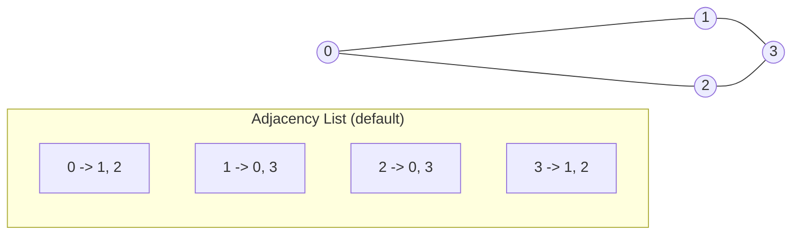
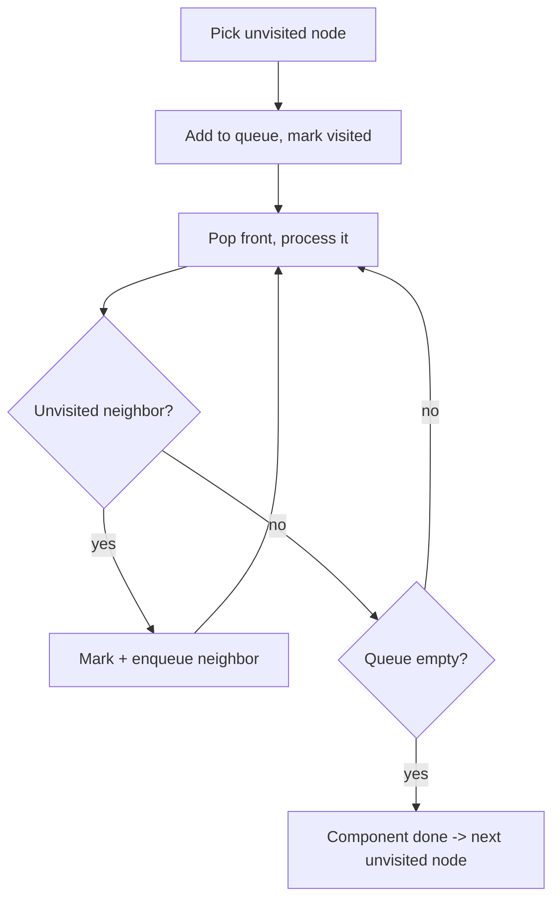
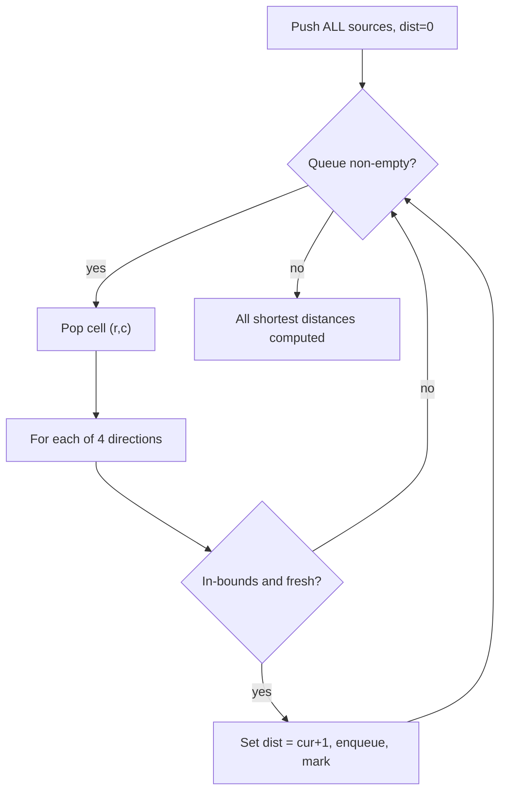
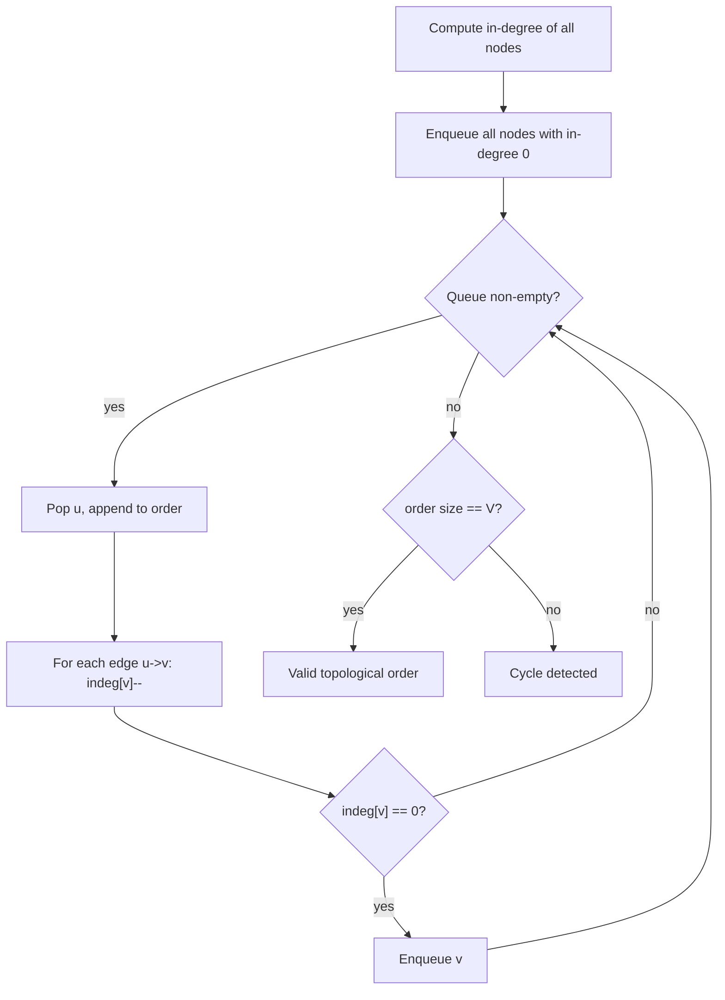
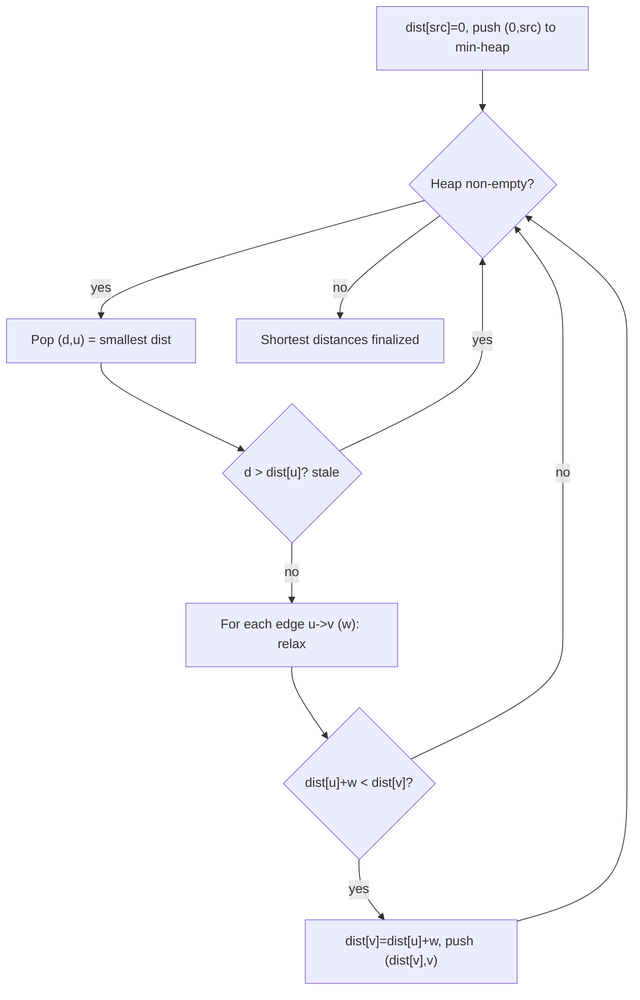
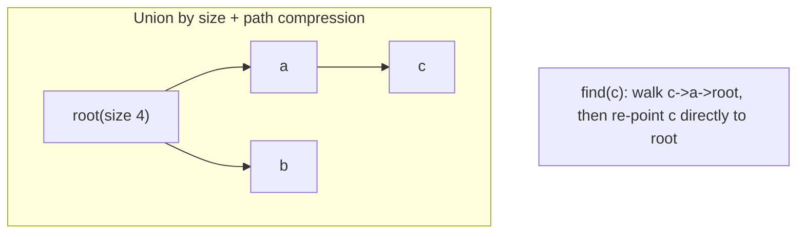
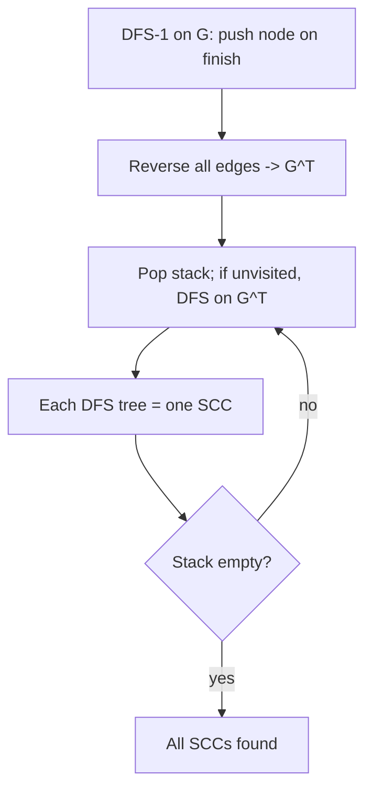

# Step 15: Graphs [Concepts & Problems]

The complete graph toolkit — representations, BFS/DFS traversal, topological sort, shortest-path algorithms, minimum spanning trees, and disjoint-set union — the single highest-value topic for FAANG-style interviews.

**Total problems: 54** — 🟢 Easy: 5 · 🟡 Medium: 10 · 🔴 Hard: 39

---

## 📌 Overview & Why It Matters

A **graph** `G = (V, E)` is a set of vertices `V` connected by edges `E`. It is the most general data structure: trees, grids, dependency chains, road networks, social networks, and state machines are all graphs. Because so many real problems reduce to a graph, this is *the* topic interviewers lean on hardest.

Nearly every graph interview question collapses to one of **five templates**: BFS traversal, DFS traversal, topological sort, shortest path, or union-find. The hard skill is not the algorithm — it is **recognizing the graph hiding inside the problem** (a grid of cells, word transformations, course prerequisites, similarity relationships) and picking the right template.

Where it shows up:
- **Grid/matrix problems** — islands, flood fill, rotting oranges, shortest maze path (BFS/DFS on an implicit graph).
- **Dependency resolution** — course scheduling, build systems, alien dictionary (topological sort).
- **Routing / networks** — cheapest flights, network delay, shortest paths (Dijkstra/Bellman-Ford/Floyd-Warshall).
- **Connectivity / clustering** — provinces, accounts merge, network cabling (DSU / MST).

**Prerequisites:** recursion & stack/queue, hashing, priority queues (heaps), and basic complexity analysis. Comfort traversing a 2D matrix with the 4-directional trick is essential.

---

## 🧠 Core Concepts

**Vocabulary you must have instant recall of:**

| Term | Meaning |
|---|---|
| Directed vs Undirected | Edges have direction (u→v) or not (u—v) |
| Weighted vs Unweighted | Edges carry a cost, or all cost 1 |
| Degree | # edges incident to a node (in-degree / out-degree for directed) |
| Path / Cycle | Sequence of connected nodes; cycle returns to start |
| Connected Component | Maximal set of mutually reachable nodes |
| DAG | Directed Acyclic Graph (no cycles → topological order exists) |
| Tree | Connected acyclic undirected graph with V−1 edges |
| Spanning Tree | Subset of edges connecting all V nodes with V−1 edges, no cycle |
| Bipartite | Nodes 2-colorable so no edge joins same color |

**Two representations:**
- **Adjacency matrix** `adj[u][v]` — `O(V²)` space, `O(1)` edge lookup. Good for dense graphs / Floyd-Warshall.
- **Adjacency list** `adj[u] = [v1, v2, ...]` — `O(V + E)` space. The default for almost everything.



**The 4-directional grid trick** (grids are implicit graphs): from cell `(r, c)`, neighbors are `(r±1, c)` and `(r, c±1)`, using direction arrays `dr = {-1,0,1,0}`, `dc = {0,1,0,-1}`.

---

## 🔑 Patterns & Approaches

### 1. Learning — Representation & Traversal Foundations

**When to use it / recognition signals:** Any time you receive edges, an adjacency list, or a grid. Before choosing an algorithm you must build a representation and know how to walk it. BFS = level-order (queue), DFS = depth-first (recursion/stack).

**The approach:**
1. **Build adjacency list** from the edge list. For undirected, push both `adj[u].add(v)` and `adj[v].add(u)`.
2. **BFS:** push source, mark visited; repeatedly pop, process, push all unvisited neighbors. Visits nodes in order of distance from source.
3. **DFS:** visit node, mark visited, recurse into each unvisited neighbor.
4. **Connected components:** loop over all nodes; every time you find an unvisited node, run a fresh BFS/DFS and increment the component count. Needed because a graph may be disconnected.



**Complexity:** BFS/DFS both `O(V + E)` time (each node & edge visited once), `O(V)` space for visited + queue/recursion stack.

**Reusable template (C++):**
```cpp
// Build adjacency list (undirected)
vector<vector<int>> adj(V);
for (auto& e : edges) {
    adj[e[0]].push_back(e[1]);
    adj[e[1]].push_back(e[0]);
}

// BFS from src
vector<int> bfs(int src, vector<vector<int>>& adj, vector<int>& vis) {
    vector<int> order;
    queue<int> q; q.push(src); vis[src] = 1;
    while (!q.empty()) {
        int node = q.front(); q.pop();
        order.push_back(node);
        for (int nb : adj[node])
            if (!vis[nb]) { vis[nb] = 1; q.push(nb); }
    }
    return order;
}

// DFS from node
void dfs(int node, vector<vector<int>>& adj, vector<int>& vis) {
    vis[node] = 1;
    // process(node);
    for (int nb : adj[node])
        if (!vis[nb]) dfs(nb, adj, vis);
}

// Count connected components
int components(int V, vector<vector<int>>& adj) {
    vector<int> vis(V, 0); int cnt = 0;
    for (int i = 0; i < V; i++)
        if (!vis[i]) { dfs(i, adj, vis); cnt++; }
    return cnt;
}
```

**Problems:**

| # | Problem | Difficulty | Practice |
|---|---------|-----------|----------|
| 1 | Introduction to Graph | 🟢 Easy | [Article](https://takeuforward.org/data-structure/graph-representation-in-java) · [🎥](https://youtu.be/3oI-34aPMWM) |
| 2 | Graph Representation \| C++ | 🟢 Easy | [Article](https://takeuforward.org/graph/graph-representation-in-c/) · [🎥](https://youtu.be/3oI-34aPMWM) |
| 3 | Graph Representation \| Java | 🟢 Easy | [Article](https://takeuforward.org/data-structure/graph-representation-in-java) · [🎥](https://youtu.be/3oI-34aPMWM) |
| 4 | Connected Components | 🟡 Medium | [Article](https://takeuforward.org/data-structure/connected-components) |
| 5 | Traversal Techniques | 🟡 Medium | [Article](https://takeuforward.org/data-structure/depth-first-search-dfs/) · [🎥](https://youtu.be/Qzf1a--rhp8) |
| 6 | DFS | 🟡 Medium | [Article](https://takeuforward.org/data-structure/depth-first-search-dfs/) · [🎥](https://youtu.be/Qzf1a--rhp8) |

**Edge cases & gotchas:** Disconnected graphs (always loop over *all* nodes). Self-loops and parallel edges. Recursion depth blowup on large graphs → prefer iterative BFS/stack DFS. Forgetting to mark visited *before* enqueue causes duplicates in the queue.

---

### 2. Problems on BFS/DFS

**When to use it / recognition signals:** Grid/matrix problems ("count islands", "spread of fire/water", "regions surrounded by X"), unweighted shortest path (BFS gives minimum steps), cycle detection, 2-coloring (bipartite), and multi-source spread. If all edge weights are equal (or absent), **BFS finds the shortest path**; DFS is for connectivity/exploration.

**The approach (key sub-patterns):**
- **Component counting on grids:** DFS/BFS from each unvisited land cell; each launch = 1 island/province.
- **Multi-source BFS:** push *all* sources at once (rotten oranges, 0/1 matrix, nearest-1). The queue processes distance layer by layer.
- **Boundary DFS:** to find "enclosed" regions, first mark everything connected to the border, then whatever remains is enclosed (Surrounded Regions, Number of Enclaves).
- **Cycle detection (undirected):** BFS/DFS carrying the parent; if you reach a visited node that is **not** the parent → cycle.
- **Cycle detection (directed, DFS):** need a `pathVis` (recursion-stack) array in addition to `vis`; a back-edge to a node in the current path = cycle.
- **Bipartite:** BFS/DFS 2-coloring; conflict (same color adjacent) = not bipartite.



**Complexity:** Grid `O(N·M)` time & space; general graph `O(V + E)`. Multi-source BFS is still linear because each cell enters the queue once.

**Reusable template (C++) — multi-source BFS on a grid:**
```cpp
int rows = grid.size(), cols = grid[0].size();
queue<pair<int,int>> q;
vector<vector<int>> dist(rows, vector<int>(cols, -1));
// seed all sources
for (int r = 0; r < rows; r++)
  for (int c = 0; c < cols; c++)
    if (isSource(grid[r][c])) { q.push({r,c}); dist[r][c] = 0; }

int dr[] = {-1,0,1,0}, dc[] = {0,1,0,-1};
while (!q.empty()) {
    auto [r, c] = q.front(); q.pop();
    for (int k = 0; k < 4; k++) {
        int nr = r + dr[k], nc = c + dc[k];
        if (nr>=0 && nr<rows && nc>=0 && nc<cols && dist[nr][nc]==-1) {
            dist[nr][nc] = dist[r][c] + 1;
            q.push({nr, nc});
        }
    }
}

// Directed cycle detection via DFS (pathVis)
bool dfsCycle(int node, vector<vector<int>>& adj,
              vector<int>& vis, vector<int>& path) {
    vis[node] = path[node] = 1;
    for (int nb : adj[node]) {
        if (!vis[nb]) { if (dfsCycle(nb, adj, vis, path)) return true; }
        else if (path[nb]) return true;   // back-edge in current path
    }
    path[node] = 0;   // remove from recursion stack
    return false;
}
```

**Problems:**

| # | Problem | Difficulty | Practice |
|---|---------|-----------|----------|
| 1 | Number of provinces | 🟡 Medium | [LeetCode](https://leetcode.com/problems/number-of-provinces/) · [🎥](https://youtu.be/ACzkVtewUYA) |
| 2 | Connected Components Problem in Matrix | 🟡 Medium | [Article](https://takeuforward.org/data-structure/connected-components) |
| 3 | Rotten Oranges | 🟡 Medium | [LeetCode](https://leetcode.com/problems/rotting-oranges/) · [🎥](https://www.youtube.com/watch?v=yf3oUhkvqA0) |
| 4 | Flood fill algorithm | 🟡 Medium | [LeetCode](https://leetcode.com/problems/flood-fill/) |
| 5 | Cycle Detection in Undirected Graph (BFS) | 🔴 Hard | [Article](https://takeuforward.org/data-structure/detect-cycle-in-an-undirected-graph-using-bfs/) · [🎥](https://youtu.be/BPlrALf1LDU) |
| 6 | Detect a cycle in an undirected graph | 🔴 Hard | [LeetCode](https://leetcode.com/problems/course-schedule/) · [🎥](https://youtu.be/zQ3zgFypzX4) |
| 7 | Distance of nearest cell having 1 | 🟡 Medium | [LeetCode](https://leetcode.com/problems/01-matrix/) · [🎥](https://youtu.be/edXdVwkYHF8) |
| 8 | Surrounded Regions | 🟡 Medium | [LeetCode](https://leetcode.com/problems/surrounded-regions/) · [🎥](https://youtu.be/BtdgAys4yMk) |
| 9 | Number of enclaves | 🟡 Medium | [LeetCode](https://leetcode.com/problems/number-of-enclaves/) · [🎥](https://youtu.be/rxKcepXQgU4) |
| 10 | Word ladder I | 🔴 Hard | [LeetCode](https://leetcode.com/problems/word-ladder/) · [🎥](https://youtu.be/tRPda0rcf8E) |
| 11 | Word ladder II | 🔴 Hard | [LeetCode](https://leetcode.com/problems/word-ladder-ii/) · [🎥](https://youtu.be/AD4SFl7tu7I) |
| 12 | Number of islands | 🟡 Medium | [LeetCode](https://leetcode.com/problems/number-of-islands/) · [🎥](https://www.youtube.com/watch?v=muncqlKJrH0) |
| 13 | Bipartite Graph (DFS) | 🔴 Hard | [LeetCode](https://leetcode.com/problems/is-graph-bipartite/) · [🎥](https://youtu.be/KG5YFfR0j8A) |
| 14 | Cycle Detection in Directed Graph (DFS) | 🔴 Hard | [Article](https://takeuforward.org/data-structure/detect-cycle-in-a-directed-graph-using-dfs-g-19/) · [🎥](https://youtu.be/9twcmtQj4DU) |

**Edge cases & gotchas:** Word Ladder needs BFS (shortest transformation) — build neighbors by changing one char at a time using a word set for O(1) lookup. For undirected cycle detection, don't flag the parent as a cycle. For directed graphs, plain `vis` is *not* enough — you need the recursion-stack (`pathVis`). Multi-source BFS: seed *all* sources before the loop, not one at a time.

---

### 3. Topo Sort and Problems

**When to use it / recognition signals:** Directed graphs with **dependencies/ordering** ("prerequisites", "must come before", "build order", "resolve order"). Only valid on a **DAG**. If a valid linear ordering is impossible, the graph has a cycle — which is exactly how you detect directed cycles via topo sort.

**The approach — Kahn's algorithm (BFS-based, preferred):**
1. Compute **in-degree** of every node.
2. Push all nodes with in-degree 0 into a queue (no dependencies).
3. Pop a node, append to the order, and decrement in-degree of each neighbor; push any neighbor whose in-degree becomes 0.
4. If the produced order has fewer than `V` nodes → a **cycle exists** (topo sort impossible).

DFS-based alternative: DFS and push each node onto a stack *after* exploring all its descendants; the reversed stack is the topo order.



**Complexity:** `O(V + E)` time, `O(V)` space — each node enqueued once, each edge relaxes an in-degree once.

**Reusable template (C++) — Kahn's algorithm:**
```cpp
vector<int> topoSort(int V, vector<vector<int>>& adj) {
    vector<int> indeg(V, 0);
    for (int u = 0; u < V; u++)
        for (int v : adj[u]) indeg[v]++;

    queue<int> q;
    for (int i = 0; i < V; i++) if (indeg[i] == 0) q.push(i);

    vector<int> order;
    while (!q.empty()) {
        int u = q.front(); q.pop();
        order.push_back(u);
        for (int v : adj[u])
            if (--indeg[v] == 0) q.push(v);
    }
    // order.size() < V  =>  cycle exists (not a DAG)
    return order;
}
```

**Problems:**

| # | Problem | Difficulty | Practice |
|---|---------|-----------|----------|
| 1 | Topo Sort | 🔴 Hard | [Article](https://takeuforward.org/data-structure/topological-sort-algorithm-dfs-g-21/) · [🎥](https://youtu.be/5lZ0iJMrUMk) |
| 2 | Topological sort / Kahn's algorithm | 🔴 Hard | [Article](https://takeuforward.org/data-structure/topological-sort-algorithm-dfs-g-21/) · [🎥](https://youtu.be/5lZ0iJMrUMk) |
| 3 | Detect a cycle in a directed graph | 🔴 Hard | [LeetCode](https://leetcode.com/problems/course-schedule/) · [🎥](https://www.youtube.com/watch?v=uzVUw90ZFIg) |
| 4 | Course Schedule I | 🔴 Hard | [LeetCode](https://leetcode.com/problems/course-schedule/) · [🎥](https://youtu.be/WAOfKpxYHR8) |
| 5 | Course Schedule II | 🟡 Medium | [LeetCode](https://leetcode.com/problems/course-schedule-ii/) · [🎥](https://youtu.be/WAOfKpxYHR8) |
| 6 | Find eventual safe states | 🔴 Hard | [LeetCode](https://leetcode.com/problems/find-eventual-safe-states/) · [🎥](https://youtu.be/2gtg3VsDGyc) |
| 7 | Alien Dictionary | 🔴 Hard | [LeetCode](https://leetcode.com/problems/alien-dictionary/solution/) · [🎥](https://youtu.be/U3N_je7tWAs) |

**Edge cases & gotchas:** Course Schedule I only asks *is it possible* (order size == V?); II asks for the *order itself*. For "eventual safe states", reverse the edges and run Kahn's on out-degree (terminal nodes have out-degree 0). Alien Dictionary: derive edges from the first differing character between adjacent words; watch the invalid prefix case (`"abc"` before `"ab"` → return `""`). Cycle → no valid order.

---

### 4. Shortest Path Algorithms and Problems

**When to use it / recognition signals:** "Minimum cost/time/distance/effort to reach", weighted edges, flight/network routing. Pick the algorithm by graph properties:
- **Unweighted** → plain BFS.
- **DAG** → topo sort + relax edges in topo order.
- **Non-negative weights, single source** → **Dijkstra** (priority queue).
- **Negative weights / detect negative cycle, single source** → **Bellman-Ford**.
- **All-pairs shortest path** (small V) → **Floyd-Warshall**.

**The approaches:**
- **Dijkstra:** min-heap of `(dist, node)`; pop the closest node, relax its neighbors (`if dist[u]+w < dist[v]` update + push). A priority queue is used so we always expand the currently-cheapest node — greedy correctness relies on non-negative weights. `0-1 BFS` (deque) is a Dijkstra shortcut when weights ∈ {0,1}.
- **Bellman-Ford:** relax *all* edges `V−1` times; one extra pass that still relaxes = negative cycle. Handles negatives; no priority queue.
- **Floyd-Warshall:** DP over intermediate nodes `k`: `dist[i][j] = min(dist[i][j], dist[i][k] + dist[k][j])`. Triple loop, `k` outermost.



**Complexity:** Dijkstra `O((V+E) log V)` with a binary heap, `O(V)` space. Bellman-Ford `O(V·E)`. Floyd-Warshall `O(V³)` time, `O(V²)` space.

**Reusable template (C++) — Dijkstra:**
```cpp
vector<int> dijkstra(int V, vector<vector<pair<int,int>>>& adj, int src) {
    vector<int> dist(V, INT_MAX);
    priority_queue<pair<int,int>, vector<pair<int,int>>,
                   greater<>> pq;          // {dist, node} min-heap
    dist[src] = 0; pq.push({0, src});
    while (!pq.empty()) {
        auto [d, u] = pq.top(); pq.pop();
        if (d > dist[u]) continue;          // skip stale entry
        for (auto [v, w] : adj[u]) {
            if (dist[u] + w < dist[v]) {
                dist[v] = dist[u] + w;
                pq.push({dist[v], v});
            }
        }
    }
    return dist;
}

// Bellman-Ford: relax all edges V-1 times; Vth pass detects negative cycle
vector<int> bellmanFord(int V, vector<vector<int>>& edges, int src) {
    vector<int> dist(V, 1e9); dist[src] = 0;
    for (int i = 0; i < V - 1; i++)
        for (auto& e : edges) {           // e = {u, v, w}
            if (dist[e[0]] != 1e9 && dist[e[0]] + e[2] < dist[e[1]])
                dist[e[1]] = dist[e[0]] + e[2];
        }
    // extra pass -> if any relaxes, negative cycle exists
    return dist;
}

// Floyd-Warshall
void floydWarshall(vector<vector<int>>& d) {  // d[i][j] = weight or INF
    int n = d.size();
    for (int k = 0; k < n; k++)
        for (int i = 0; i < n; i++)
            for (int j = 0; j < n; j++)
                if (d[i][k] != INF && d[k][j] != INF)
                    d[i][j] = min(d[i][j], d[i][k] + d[k][j]);
}
```

**Problems:**

| # | Problem | Difficulty | Practice |
|---|---------|-----------|----------|
| 1 | Shortest path in undirected graph (unit weights) | 🔴 Hard | [Article](https://takeuforward.org/data-structure/shortest-path-in-undirected-graph-with-unit-distance-g-28/) · [🎥](https://www.youtube.com/watch?v=C4gxoTaI71U) |
| 2 | Shortest path in DAG | 🔴 Hard | [Article](https://takeuforward.org/data-structure/shortest-path-in-directed-acyclic-graph-topological-sort-g-27/) · [🎥](https://www.youtube.com/watch?v=ZUFQfFaU-8U) |
| 3 | Dijkstra's Algorithm | 🔴 Hard | [Article](https://takeuforward.org/data-structure/dijkstras-algorithm-using-set-g-33/) · [🎥](https://www.youtube.com/watch?v=rp1SMw7HSO8) |
| 4 | Why priority queue in Dijkstra's | 🔴 Hard | [Article](https://takeuforward.org/data-structure/dijkstras-algorithm-using-priority-queue-g-32/) · [🎥](https://www.youtube.com/watch?v=rp1SMw7HSO8) |
| 5 | Shortest Distance in a Binary Maze | 🔴 Hard | [LeetCode](https://leetcode.com/problems/shortest-path-in-binary-matrix/) · [🎥](https://www.youtube.com/watch?v=U5Mw4eyUmw4) |
| 6 | Path with minimum effort | 🔴 Hard | [LeetCode](https://leetcode.com/problems/path-with-minimum-effort/) · [🎥](https://youtu.be/0ytpZyiZFhA) |
| 7 | Cheapest flight within K stops | 🔴 Hard | [LeetCode](https://leetcode.com/problems/cheapest-flights-within-k-stops/) · [🎥](https://youtu.be/9XybHVqTHcQ) |
| 8 | Network Delay Time | 🟡 Medium | [LeetCode](https://leetcode.com/problems/network-delay-time/) |
| 9 | Number of ways to arrive at destination | 🔴 Hard | [LeetCode](https://leetcode.com/problems/number-of-ways-to-arrive-at-destination/) · [🎥](https://youtu.be/_-0mx0SmYxA) |
| 10 | Minimum multiplications to reach end | 🔴 Hard | [Article](https://takeuforward.org/graph/g-39-minimum-multiplications-to-reach-end/) · [🎥](https://www.youtube.com/watch?v=_BvEJ3VIDWw) |
| 11 | Bellman Ford Algorithm | 🔴 Hard | [Article](https://takeuforward.org/data-structure/bellman-ford-algorithm-g-41/) · [🎥](https://youtu.be/0vVofAhAYjc) |
| 12 | Floyd Warshall algorithm | 🔴 Hard | [Article](https://takeuforward.org/data-structure/floyd-warshall-algorithm-g-42/) · [🎥](https://www.youtube.com/watch?v=YbY8cVwWAvw) |
| 13 | City with smallest number of neighbors | 🔴 Hard | [LeetCode](https://leetcode.com/problems/find-the-city-with-the-smallest-number-of-neighbors-at-a-threshold-distance/) · [🎥](https://youtu.be/9XybHVqTHcQ) |

**Edge cases & gotchas:** **Never use Dijkstra with negative weights** — the greedy pop invariant breaks. Cheapest-Flights-K-Stops has an extra "stops" constraint, so plain Dijkstra fails; use a modified BFS/Bellman-Ford bounded to `K+1` relaxations. "Number of ways to arrive" = Dijkstra tracking a `ways[]` count (reset when a strictly shorter path is found, add when equal). "Path with minimum effort" / "Swim in water" minimize the *maximum edge* on the path — use Dijkstra where the path cost is `max(cost, edge)` rather than a sum. Watch integer overflow (use `long long` when summing weights).

---

### 5. Minimum Spanning Tree / Disjoint Set and Problems

**When to use it / recognition signals:** MST — "connect all nodes with **minimum total edge cost**" (cabling, road networks). DSU — dynamic connectivity, grouping/merging by relation ("are these in the same set?", "how many groups?", online union queries, accounts/emails belonging to same person).

**The approaches:**
- **Prim's (MST):** grow the tree from any node; repeatedly add the cheapest edge crossing from tree to non-tree using a min-heap. Vertex-based.
- **Kruskal's (MST):** sort all edges by weight; add an edge if its endpoints are in different DSU components (no cycle). Edge-based — needs DSU.
- **DSU (Union-Find):** near-`O(1)` `find`/`union` with **path compression** + **union by rank/size**. `find(x)` returns the set representative; `union(a,b)` merges the smaller tree under the larger.



**Complexity:** DSU operations amortized `O(α(N)) ≈ O(1)`. Kruskal `O(E log E)` (sorting dominates). Prim `O(E log V)` with a heap.

**Reusable template (C++) — DSU + Kruskal:**
```cpp
struct DSU {
    vector<int> parent, sz;
    DSU(int n): parent(n), sz(n, 1) { iota(parent.begin(), parent.end(), 0); }
    int find(int x) {                        // path compression
        return parent[x] == x ? x : parent[x] = find(parent[x]);
    }
    bool unite(int a, int b) {               // union by size
        a = find(a); b = find(b);
        if (a == b) return false;            // already connected -> cycle
        if (sz[a] < sz[b]) swap(a, b);
        parent[b] = a; sz[a] += sz[b];
        return true;
    }
};

int kruskalMST(int V, vector<vector<int>>& edges) {  // edges = {w, u, v}
    sort(edges.begin(), edges.end());
    DSU dsu(V); int cost = 0;
    for (auto& e : edges)
        if (dsu.unite(e[1], e[2])) cost += e[0];
    return cost;
}
```

**Problems:**

| # | Problem | Difficulty | Practice |
|---|---------|-----------|----------|
| 1 | MST theory | 🟢 Easy | [Article](https://takeuforward.org/data-structure/minimum-spanning-tree-theory-g-44/) · [🎥](https://youtu.be/ZSPjZuZWCME) |
| 2 | Prim's Algorithm | 🔴 Hard | [Article](https://takeuforward.org/data-structure/prims-algorithm-minimum-spanning-tree-c-and-java-g-45/) · [🎥](https://youtu.be/mJcZjjKzeqk) |
| 3 | Disjoint Set | 🔴 Hard | [Article](https://takeuforward.org/data-structure/disjoint-set-union-by-rank-union-by-size-path-compression-g-46/) · [🎥](https://youtu.be/aBxjDBC4M1U) |
| 4 | Find the MST weight | 🔴 Hard | [Article](https://takeuforward.org/data-structure/prims-algorithm-minimum-spanning-tree-c-and-java-g-45/) · [🎥](https://youtu.be/mJcZjjKzeqk) |
| 5 | Number of operations to make network connected | 🔴 Hard | [LeetCode](https://leetcode.com/problems/number-of-operations-to-make-network-connected/) · [🎥](https://youtu.be/FYrl7iz9_ZU) |
| 6 | Most stones removed with same row or column | 🟡 Medium | [LeetCode](https://leetcode.com/problems/most-stones-removed-with-same-row-or-column/) · [🎥](https://youtu.be/OwMNX8SPavM) |
| 7 | Accounts merge | 🔴 Hard | [LeetCode](https://leetcode.com/problems/accounts-merge/) · [🎥](https://youtu.be/FMwpt_aQOGw) |
| 8 | Number of islands II | 🔴 Hard | [LeetCode](https://leetcode.com/problems/number-of-islands-ii/) · [🎥](https://youtu.be/Rn6B-Q4SNyA) |
| 9 | Making a large island | 🔴 Hard | [LeetCode](https://leetcode.com/problems/making-a-large-island/) · [🎥](https://youtu.be/lgiz0Oup6gM) |
| 10 | Swim in Rising Water | 🟡 Medium | [LeetCode](https://leetcode.com/problems/swim-in-rising-water/) |

**Edge cases & gotchas:** "Network connected" is impossible if `edges < V−1` (return −1); otherwise answer = `components − 1`. Accounts Merge & Most Stones map a 2D/string domain onto DSU indices — use a map from email/coordinate to an integer id. Number-of-Islands-II is **online** union (add land one at a time, union with existing neighbors). "Making a large island" flips one 0→1: pre-label islands with DSU sizes, then for each 0, sum sizes of *distinct* neighboring islands. Always apply *both* path compression and union-by-size, or you lose the α(N) guarantee.

---

### 6. Other Algorithms (Bridges, Articulation Points, SCC)

**When to use it / recognition signals:** "Critical connections" whose removal disconnects the graph (**bridges**), "critical nodes" (**articulation points**), and "strongly connected components" in directed graphs (mutual reachability, condensation into a DAG). These are advanced but appear at top-tier companies.

**The approaches:**
- **Tarjan's bridges/articulation points:** DFS assigning discovery time `tin[]` and low-link `low[]` (earliest reachable ancestor). Edge `(u,v)` is a **bridge** if `low[v] > tin[u]`. Node `u` is an **articulation point** if it is the root with ≥2 DFS children, or a non-root with a child `v` where `low[v] >= tin[u]`.
- **Kosaraju's SCC:** (1) DFS pushing nodes onto a stack by finish time; (2) transpose the graph (reverse all edges); (3) pop from stack and DFS on the transpose — each DFS tree is one SCC.



**Complexity:** All three are `O(V + E)` — a constant number of DFS passes. Space `O(V + E)` (transpose graph / low-link arrays).

**Reusable template (C++) — Tarjan bridges:**
```cpp
int timer = 0;
void dfsBridge(int u, int parent, vector<vector<int>>& adj,
               vector<int>& tin, vector<int>& low, vector<int>& vis,
               vector<vector<int>>& bridges) {
    vis[u] = 1; tin[u] = low[u] = timer++;
    for (int v : adj[u]) {
        if (v == parent) continue;
        if (vis[v]) low[u] = min(low[u], tin[v]);   // back edge
        else {
            dfsBridge(v, u, adj, tin, low, vis, bridges);
            low[u] = min(low[u], low[v]);
            if (low[v] > tin[u]) bridges.push_back({u, v}); // bridge!
        }
    }
}
```

**Problems:**

| # | Problem | Difficulty | Practice |
|---|---------|-----------|----------|
| 1 | Bridges in graph | 🔴 Hard | [LeetCode](https://leetcode.com/problems/critical-connections-in-a-network/) · [🎥](https://youtu.be/qrAub5z8FeA) |
| 2 | Articulation point in graph | 🔴 Hard | [Article](https://takeuforward.org/data-structure/articulation-point-in-graph-g-56/) · [🎥](https://youtu.be/j1QDfU21iZk) |
| 3 | Kosaraju's algorithm | 🔴 Hard | [Article](https://takeuforward.org/graph/strongly-connected-components-kosarajus-algorithm-g-54/) · [🎥](https://www.youtube.com/watch?v=V8qIqJxCioo) |
| | | | |

**Edge cases & gotchas:** Distinguish `low[v] > tin[u]` (bridge, strict) from `low[v] >= tin[u]` (articulation point, non-strict). The DFS root is a special case for articulation points (needs ≥2 children). Skip only *one* edge to the parent, not all parallel edges. SCC only applies to **directed** graphs; for undirected use plain connected components.

---

## ❓ Regularly Asked Interview Questions

**Q: When do you use BFS vs DFS?**
**A:** BFS for shortest path / minimum steps in an *unweighted* graph and level-order processing (it visits nodes in distance order). DFS for connectivity, cycle detection, topological sort, path existence, and backtracking. DFS uses less memory on wide graphs; BFS uses less on deep graphs.

**Q: How do you detect a cycle in an undirected vs a directed graph?**
**A:** Undirected — DFS/BFS carrying the parent; a visited non-parent neighbor is a cycle. Directed — DFS with a recursion-stack array (`pathVis`); a back-edge to a node currently on the stack is a cycle. Alternatively, Kahn's topo sort: if the ordering has fewer than V nodes, there's a cycle.

**Q: Why does Dijkstra fail with negative edge weights?**
**A:** Dijkstra greedily finalizes the closest node and never revisits it. A later negative edge could reduce that node's distance, but it's already locked — producing wrong answers. Use Bellman-Ford (or Johnson's) for negatives.

**Q: Dijkstra vs Bellman-Ford vs Floyd-Warshall — how do you choose?**
**A:** Dijkstra: single-source, non-negative weights, `O((V+E)log V)`. Bellman-Ford: single-source, handles negatives + detects negative cycles, `O(V·E)`. Floyd-Warshall: all-pairs shortest paths, small dense graphs, `O(V³)`.

**Q: Why is a priority queue used in Dijkstra?**
**A:** To always expand the currently-nearest unfinalized node in `O(log V)`. This greedy order is what makes the algorithm correct (with non-negative weights) and efficient versus scanning all nodes `O(V²)`.

**Q: Prim's vs Kruskal's — when do you prefer each?**
**A:** Both build an MST. Kruskal (sort edges + DSU) is simplest and great for sparse/edge-list graphs. Prim (grow from a node with a heap) is better for dense graphs and when you already have an adjacency list. Both are `O(E log V)`-ish.

**Q: What is the time complexity of union-find with optimizations?**
**A:** With path compression *and* union by rank/size, each operation is amortized `O(α(N))` — the inverse Ackermann function, effectively constant (< 5 for any realistic N).

**Q: How would you detect if a graph is bipartite?**
**A:** 2-color it via BFS/DFS: assign a color, give neighbors the opposite color; if any edge connects two same-colored nodes, it's not bipartite. A graph is bipartite iff it has no odd-length cycle.

**Q: How do you find shortest path in a DAG efficiently?**
**A:** Topologically sort the nodes, then relax edges in that order in a single pass — `O(V+E)`, beating Dijkstra, and it even works with negative weights (no cycles to worry about).

**Q: How do you approach "Course Schedule" problems?**
**A:** Model courses as nodes and prerequisites as directed edges. Course Schedule I = can we topologically sort (no cycle)? Course Schedule II = return the topo order. Use Kahn's algorithm; if fewer than V nodes are output, a cycle makes it impossible.

**Q: How would you model a grid problem as a graph?**
**A:** Each cell is a node; edges connect 4- (or 8-) directionally adjacent cells. Islands = connected components. Rotting oranges / nearest-1 = multi-source BFS. Path in a maze = BFS (unweighted) or Dijkstra (weighted).

**Q: What's the difference between a bridge and an articulation point?**
**A:** A bridge is an *edge* whose removal increases the number of connected components; an articulation point is a *vertex* whose removal does so. Both found via Tarjan's DFS using discovery time and low-link (bridge: `low[v] > tin[u]`; AP: `low[v] >= tin[u]`).

**Q: How do you find strongly connected components?**
**A:** Kosaraju's: DFS to order nodes by finish time, reverse the graph, then DFS in reverse-finish order — each tree is an SCC. Tarjan's does it in a single DFS pass using low-link values.

**Q: How do you count connected components / provinces?**
**A:** Iterate over all nodes; each time you find an unvisited node, launch a fresh DFS/BFS (or union all its edges in DSU) and increment a counter. With DSU, the count = number of distinct roots.

---

## 💡 Interview Tips & Common Mistakes

- **Always ask:** directed or undirected? weighted? can weights be negative? connected or possibly disconnected? — these determine the algorithm.
- **First reduce to a graph.** State your nodes and edges out loud before coding; most difficulty is in the modeling, not the traversal.
- **Loop over all nodes** for component/traversal problems — assuming a single connected component is the #1 bug.
- **Directed cycle detection needs `pathVis`**, not just `vis`. This trips up most candidates.
- **Mark visited on enqueue, not on dequeue**, in BFS — otherwise nodes get added to the queue multiple times.
- **Don't use Dijkstra with negative weights;** don't use Bellman-Ford when Dijkstra suffices (it's V× slower).
- **Skip stale heap entries** in Dijkstra (`if (d > dist[u]) continue;`) to keep it efficient.
- **DSU needs both** path compression and union by size/rank for the near-O(1) guarantee.
- **Watch overflow** — sum of weights can exceed `int`; use `long long`.
- **Grid direction arrays** and bounds checks: off-by-one and out-of-bounds are the most common runtime errors.
- **Recursion depth:** deep grids/graphs can stack-overflow; consider iterative BFS.

---

## 🐟 Revision Cheat-Sheet

| Pattern | Key Idea | Time | Space | Signature problem |
|---|---|---|---|---|
| Learning (repr + traversal) | Adjacency list; BFS=queue, DFS=recursion; loop all nodes | O(V+E) | O(V) | Connected Components |
| BFS/DFS problems | Grids as graphs; multi-source BFS; cycle/bipartite via traversal | O(V+E) / O(N·M) | O(V) | Number of islands / Rotten Oranges |
| Topological sort (Kahn) | In-degree BFS; order<V ⇒ cycle | O(V+E) | O(V) | Course Schedule II |
| Shortest paths | BFS/DAG/Dijkstra/Bellman-Ford/Floyd-Warshall by graph type | O((V+E)logV) → O(V³) | O(V) → O(V²) | Cheapest Flights Within K Stops |
| MST / DSU | Prim/Kruskal for MST; union-find for connectivity | O(E log V), α(N) | O(V) | Accounts Merge / MST weight |
| Bridges / AP / SCC | Tarjan low-link; Kosaraju reverse-DFS | O(V+E) | O(V+E) | Critical Connections (Bridges) |

---

## 🔗 References & Further Reading

- **Striver A2Z — Step 15 (Graphs):** https://takeuforward.org/strivers-a2z-dsa-course/strivers-a2z-dsa-course-sheet-2/
- **Tech Interview Handbook — Graph cheatsheet:** https://www.techinterviewhandbook.org/algorithms/graph/
- **Memgraph — Graph Algorithms Cheat Sheet for Coding Interviews:** https://memgraph.hashnode.dev/graph-algorithms-cheat-sheet-for-coding-interviews
- **CodeIntuition — 20 Graph Problems FAANG Interviews Actually Test:** https://www.codeintuition.io/blogs/graph-problems-faang
- **cp-algorithms — Dijkstra / Bellman-Ford / DSU / Floyd-Warshall:** https://cp-algorithms.com/graph/
- **Educative — Understanding weighted graph algorithms:** https://www.educative.io/blog/weighted-graph-algorithms
- **GeeksforGeeks — Graph Data Structure and Algorithms:** https://www.geeksforgeeks.org/graph-data-structure-and-algorithms/
- **USACO Guide — Graph algorithms (Silver–Platinum):** https://usaco.guide/
