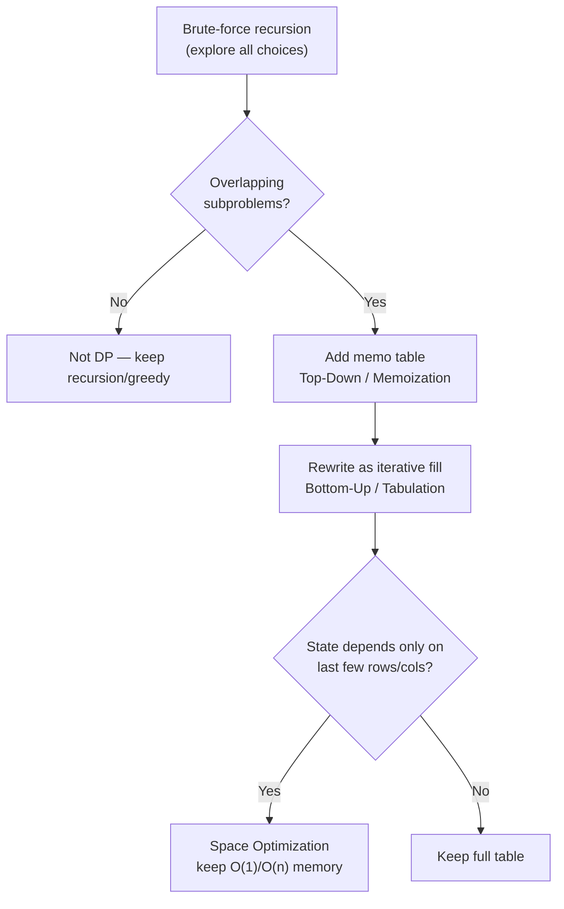
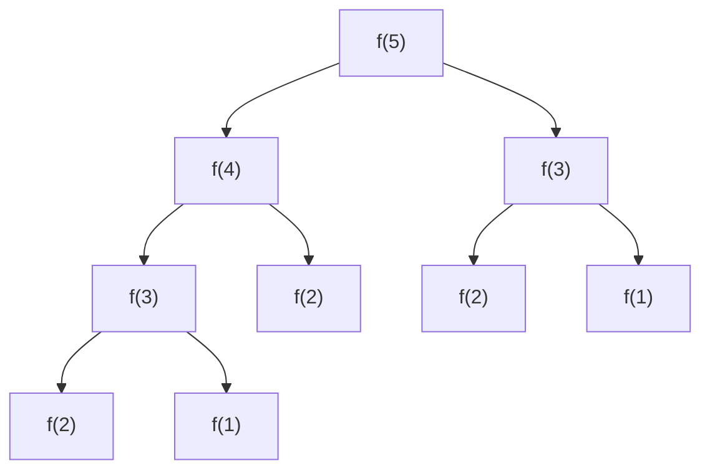
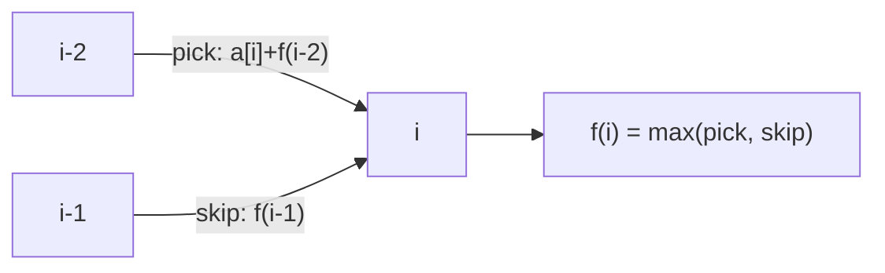
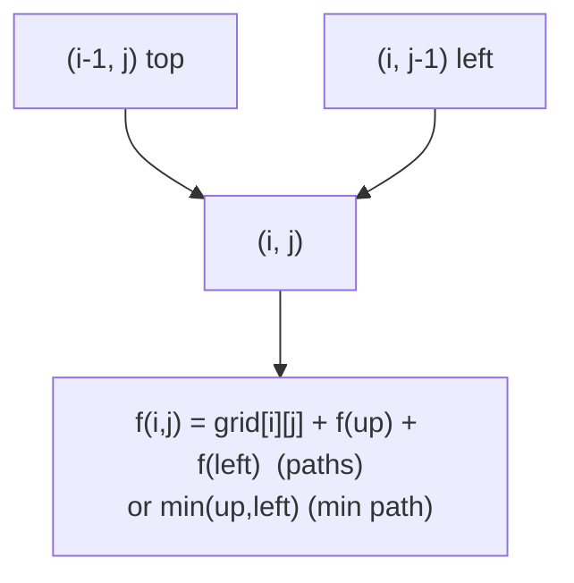
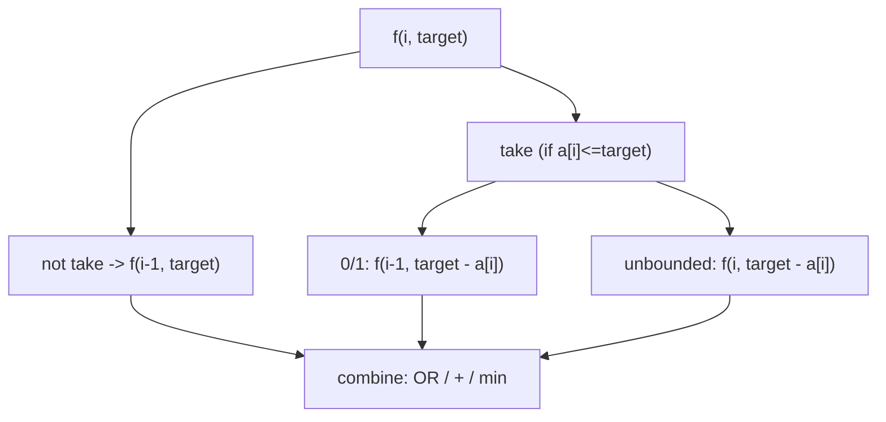
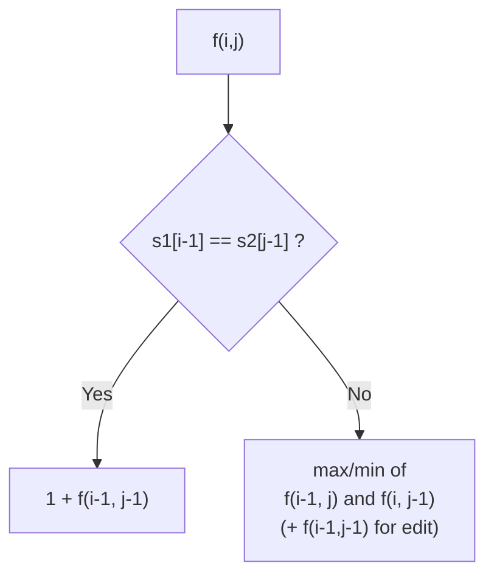
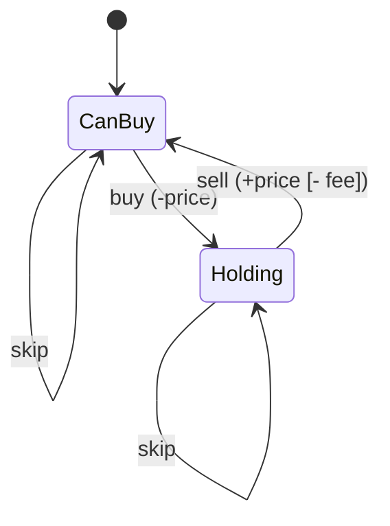
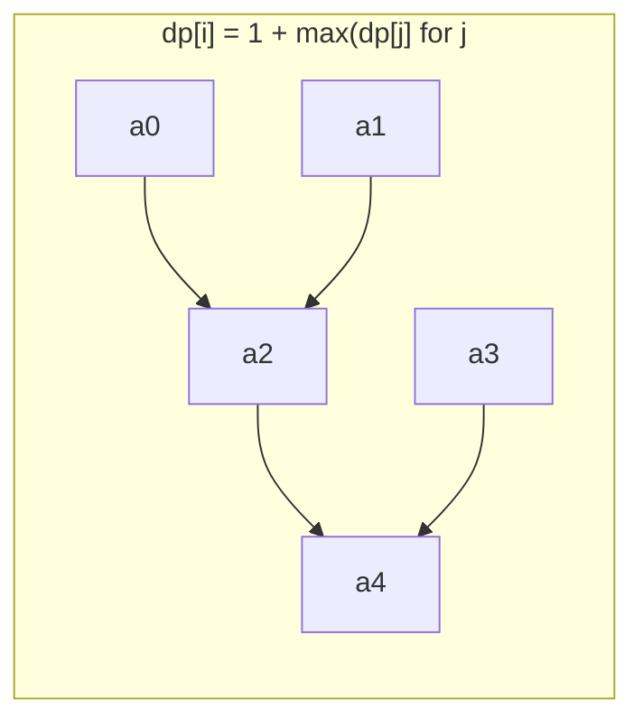
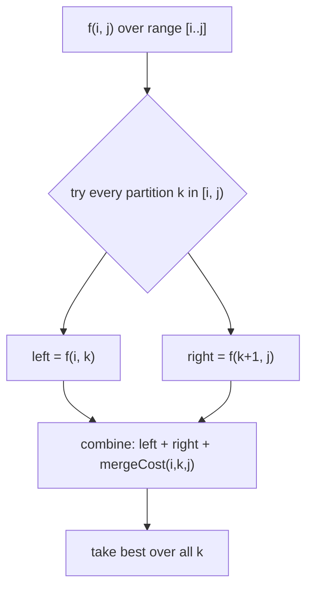
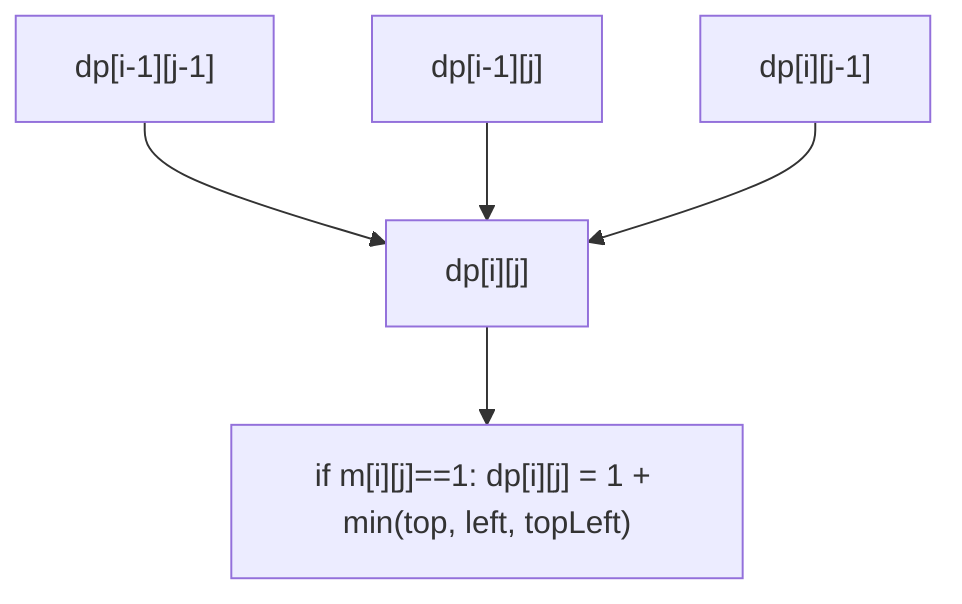

# Step 16: Dynamic Programming [Patterns and Problems]

The largest and highest-leverage step of the sheet: a complete tour of DP from the memoization → tabulation → space-optimization framework through every classic pattern (1D, grid, subsequences/knapsack, strings, stocks, LIS, partition/MCM, squares).

**Stats:** 55 problems total — 🟢 3 Easy · 🟡 26 Medium · 🔴 26 Hard.

---

## 📌 Overview & Why It Matters

**Dynamic Programming (DP)** is an optimization technique for problems that have two properties:

1. **Overlapping subproblems** — the same subproblem is solved many times (e.g. `fib(n)` recomputes `fib(n-2)` repeatedly).
2. **Optimal substructure** — the optimal answer is built from optimal answers of subproblems.

DP = **recursion + memory**. You write brute-force recursion, cache its answers (memoization), then convert to an iterative table (tabulation), then shrink memory (space optimization).

**Where it shows up in interviews:** DP is the single most feared and most-asked topic at FAANG/product companies. Almost every hard interview round contains at least one DP problem. Recognizing the *pattern family* (pick/not-pick, grid path, LCS, interval partition, LIS…) is what separates candidates who solve it in 15 minutes from those who stall.

**Prerequisites:** solid recursion & backtracking (Step on recursion), comfort with 1D/2D arrays, basic combinatorics, and understanding of time/space complexity.

**Striver's universal recipe (the shortcut for 90% of DP):**
1. Represent the problem as an **index-based state** `f(i, ...)`.
2. Explore **all choices** at that index.
3. Take the **best / count / sum** of choices per the problem.
4. Add a **base case**; memoize on the state.
5. Convert recursion → tabulation → space optimization.

---

## 🧠 Core Concepts

**The three stages every DP solution passes through:**

- **Memoization (Top-Down):** recursion + a `dp[]` cache. Easy to derive from brute force. Stack space + table space.
- **Tabulation (Bottom-Up):** iterative fill of the table from base cases upward. No recursion stack; usually the interview "clean" answer.
- **Space Optimization:** if `dp[i]` depends only on `dp[i-1]`, `dp[i-2]`… keep a few variables/rows instead of the whole table.

**Vocabulary:** *state* (the parameters that uniquely define a subproblem), *transition/recurrence* (how a state is built from smaller states), *base case*, *state-space* (total distinct states → drives time), *memo table*.



**Complexity rule of thumb:** `Time = (#states) × (work per transition)`, `Space = (#states)` + recursion stack (memoization only).

---

## 🔑 Patterns & Approaches

### 1. Introduction to DP

**When to use it / recognition signals.** This is the framework itself, illustrated on Fibonacci. Any problem where a value is defined by a self-referential recurrence and small inputs recur.

**Approach (Fibonacci as the canonical teacher):**
- Recurrence `f(n) = f(n-1) + f(n-2)`, base `f(0)=0, f(1)=1`.
- Naive recursion is `O(2^n)` because subproblems overlap.
- Memoize → `O(n)` time, `O(n)` space + stack.
- Tabulate → `O(n)`/`O(n)`, no stack.
- Space optimize → `O(n)` time, `O(1)` space (two variables).


*f(3) computed 2×, f(2) 3× — memoization stores each once.*

**Complexity.** Memo/Tab: `O(n)` time, `O(n)` space; space-optimized: `O(1)` space.

**Template (the three forms):**
```cpp
// Memoization
int solve(int n, vector<int>& dp){
    if(n <= 1) return n;
    if(dp[n] != -1) return dp[n];
    return dp[n] = solve(n-1, dp) + solve(n-2, dp);
}
// Tabulation
int tab(int n){
    vector<int> dp(n+1); dp[0]=0; dp[1]=1;
    for(int i=2;i<=n;i++) dp[i]=dp[i-1]+dp[i-2];
    return dp[n];
}
// Space optimized
int opt(int n){
    int prev2=0, prev1=1;
    for(int i=2;i<=n;i++){ int cur=prev1+prev2; prev2=prev1; prev1=cur; }
    return n==0?0:prev1;
}
```

**Problems:**

| # | Problem | Difficulty | Practice |
|---|---------|------------|----------|
| 1 | Introduction to DP | 🟢 Easy | [Article](https://takeuforward.org/data-structure/dynamic-programming-introduction/) · [🎥](https://youtu.be/tyB0ztf0DNY) |

**Edge cases & gotchas.** Initialize memo to a sentinel that can't be a valid answer (`-1` for non-negative results). Watch integer overflow for large Fibonacci-like counts (use `long long` / modulo).

---

### 2. 1D DP

**When to use it / recognition signals.** A single moving index `i`; the answer at `i` depends on a constant number of earlier indices. Phrases like "reach the last step", "cannot pick adjacent", "min/max cost to reach position n".

**Approach.** Define `f(i)` = best answer considering positions `0..i` (or "to reach i"). At each `i` enumerate the allowed moves/choices, recurse, combine (min/max/count). Base cases at the smallest indices. Then tabulate and reduce to a few rolling variables.

- **Climbing Stairs:** `f(i)=f(i-1)+f(i-2)` (Fibonacci in disguise).
- **Frog Jump:** `f(i)=min(f(i-1)+|h[i]-h[i-1]|, f(i-2)+|h[i]-h[i-2]|)`.
- **Frog Jump K:** inner loop over jumps `1..k`.
- **House Robber / Max sum non-adjacent:** `f(i)=max(f(i-1), a[i]+f(i-2))`. **House Robber II** = run the linear robber twice on `[0..n-2]` and `[1..n-1]` (circular street).



**Complexity.** `O(n)` time, `O(1)` space after optimization (`O(n·k)` for Frog-K).

**Template (pick / not-pick — House Robber):**
```cpp
int robLinear(vector<int>& a){
    int prev2=0, prev1=0;               // f(i-2), f(i-1)
    for(int i=0;i<(int)a.size();i++){
        int pick = a[i] + (i>1?prev2:0);
        int skip = prev1;
        int cur = max(pick, skip);
        prev2 = prev1; prev1 = cur;
    }
    return prev1;
}
```

**Problems:**

| # | Problem | Difficulty | Practice |
|---|---------|------------|----------|
| 1 | Climbing Stairs | 🟡 Medium | [LeetCode](https://leetcode.com/problems/climbing-stairs/) · [🎥](https://youtu.be/mLfjzJsN8us) |
| 2 | Frog Jump | 🟡 Medium | [Article](https://takeuforward.org/data-structure/dynamic-programming-frog-jump-dp-3/) · [🎥](https://www.youtube.com/watch?v=EgG3jsGoPvQ) |
| 3 | Frog Jump with K distances | 🟡 Medium | [Article](https://takeuforward.org/data-structure/dynamic-programming-frog-jump-with-k-distances-dp-4/) · [🎥](https://www.youtube.com/watch?v=Kmh3rhyEtB8) |
| 4 | Maximum sum of non adjacent elements | 🟡 Medium | [LeetCode](https://leetcode.com/problems/house-robber/) · [🎥](https://www.youtube.com/watch?v=GrMBfJNk_NY) |
| 5 | House Robber (II) | 🟡 Medium | [LeetCode](https://leetcode.com/problems/house-robber-ii/) · [🎥](https://www.youtube.com/watch?v=3WaxQMELSkw) |

**Edge cases & gotchas.** For non-adjacent sum, handle `i<=1` carefully so `prev2` isn't added at index 0/1. For House Robber II, `n==1` returns `a[0]` (both circular slices would be empty otherwise).

---

### 3. 2D/3D DP and DP on Grids

**When to use it / recognition signals.** Movement on a matrix (right/down/diagonal), "count paths", "min/max path sum", or a state that needs **two/three indices** (row + column, day + last-choice, row + two column positions).

**Approach.** State `f(i,j)` = best answer to reach cell `(i,j)` from the source. Transition = combine the cells you can come from. Convert the top-down recursion to a 2D table; space-optimize by keeping only the previous row.

- **Ninja's Training:** `f(day, last)` = max points; can't repeat yesterday's activity → 2D DP `[n][4]`.
- **Grid Unique Paths / Unique Paths II:** `f(i,j)=f(i-1,j)+f(i,j-1)` (0 at obstacles). Pure counting version can even be a combinatorics formula `C(m+n-2, n-1)`.
- **Minimum Path Sum / Falling Path Sum / Triangle:** `f(i,j)=grid[i][j]+min(reachable predecessors)`.
- **Ninja and his Friends (3D):** two people (Alice/Bob) walk simultaneously → state `f(i, j1, j2)` with 3×3 = 9 move combinations.



**Complexity.** Grid: `O(m·n)` time, `O(n)` space (one row). 3D (Ninja & Friends): `O(m·n·n)` time, `O(n·n)` space.

**Template (min path sum, space-optimized):**
```cpp
int minPathSum(vector<vector<int>>& g){
    int n=g.size(), m=g[0].size();
    vector<int> prev(m);
    for(int i=0;i<n;i++){
        vector<int> cur(m);
        for(int j=0;j<m;j++){
            if(i==0&&j==0){ cur[j]=g[0][0]; continue; }
            int up   = i>0 ? prev[j]   : INT_MAX;
            int left = j>0 ? cur[j-1]  : INT_MAX;
            cur[j] = g[i][j] + min(up,left);
        }
        prev = cur;
    }
    return prev[m-1];
}
```

**Problems:**

| # | Problem | Difficulty | Practice |
|---|---------|------------|----------|
| 1 | Ninja's Training | 🟡 Medium | [Article](https://takeuforward.org/data-structure/dynamic-programming-ninjas-training-dp-7/) · [🎥](https://www.youtube.com/watch?v=AE39gJYuRog) |
| 2 | Grid Unique Paths (DP8) | 🟡 Medium | [LeetCode](https://leetcode.com/problems/unique-paths/) · [🎥](https://www.youtube.com/watch?v=sdE0A2Oxofw) |
| 3 | Unique Paths II | 🟡 Medium | [LeetCode](https://leetcode.com/problems/unique-paths-ii/) · [🎥](https://www.youtube.com/watch?v=TmhpgXScLyY) |
| 4 | Minimum Falling Path Sum | 🟡 Medium | [LeetCode](https://leetcode.com/problems/minimum-path-sum/) · [🎥](https://youtu.be/_rgTlyky1uQ) |
| 5 | Triangle | 🟡 Medium | [LeetCode](https://leetcode.com/problems/triangle/) · [🎥](https://www.youtube.com/watch?v=SrP-PiLSYC0) |
| 6 | Ninja and his Friends (3D) | 🟡 Medium | [Article](https://takeuforward.org/data-structure/3-d-dp-ninja-and-his-friends-dp-13/) · [🎥](https://www.youtube.com/watch?v=QGfn7JeXK54) |

**Edge cases & gotchas.** Use a large sentinel (not `INT_MAX` directly in additions — it overflows) for unreachable min-path cells. For obstacle grids, a blocked start/end means answer 0. For fixed-start problems, go top-down from source; for "any column in last row" (falling path), take the min/max over the whole last row.

---

### 4. DP on Subsequences (Subset Sum / Knapsack family)

**When to use it / recognition signals.** "Pick a subset", "choose items to reach a target sum", "0/1 vs unlimited items", "count subsets", "min coins/ways to make amount". The hallmark is a **take / not-take** decision at each index plus a running **capacity/target** dimension.

**Approach.** State `f(i, target)` = can we / how many ways / min items using items `0..i` with remaining `target`. Two branches: **not-take** `f(i-1, target)`, and **take** `f(i-1, target - a[i])` (0/1) or `f(i, target - a[i])` (unbounded — stay on same index). Combine with OR / sum / min.

- **Subset Sum = Target / Partition Equal Subset Sum:** boolean DP; partition-equal reduces to subset-sum with target `total/2` (odd total → impossible).
- **Min Absolute Sum Difference:** find all reachable subset sums `s ≤ total/2`, minimize `|total - 2s|`.
- **Count Subsets with Sum K / Count Partitions with Difference:** count DP; difference `D` → subset with sum `(total+D)/2` (must be even & non-negative). Handle zeros carefully.
- **Target Sum** (+/- signs): identical to count-partitions-with-difference.
- **Min Coins / Coin Change 2 / Unbounded Knapsack / Rod Cutting:** **unbounded** knapsack — reuse allowed, so `take` stays at index `i`.
- **Assign Cookies:** greedy two-pointer (sort greed & sizes, satisfy smallest greed with smallest adequate cookie) — grouped here in Striver's flow but is greedy, not DP.



**Complexity.** `O(n·target)` time, `O(target)` space after keeping one row.

**Template (0/1 subset-sum boolean, space-optimized):**
```cpp
bool subsetSum(vector<int>& a, int target){
    int n=a.size();
    vector<bool> prev(target+1,false), cur(target+1,false);
    prev[0]=cur[0]=true;                       // empty subset makes sum 0
    if(a[0]<=target) prev[a[0]]=true;
    for(int i=1;i<n;i++){
        for(int t=0;t<=target;t++){
            bool notTake = prev[t];
            bool take = (a[i]<=t) ? prev[t-a[i]] : false;
            cur[t] = notTake || take;
        }
        prev = cur;
    }
    return prev[target];
}
```
```cpp
// Unbounded knapsack (Min Coins style): min coins to make amount
int minCoins(vector<int>& coins, int amount){
    const int INF = 1e9;
    vector<int> dp(amount+1, INF); dp[0]=0;
    for(int c: coins)
        for(int t=c;t<=amount;t++)
            dp[t] = min(dp[t], 1 + dp[t-c]);
    return dp[amount]==INF ? -1 : dp[amount];
}
```

**Problems:**

| # | Problem | Difficulty | Practice |
|---|---------|------------|----------|
| 1 | Subset sum equal to target (DP-14) | 🔴 Hard | [Article](https://takeuforward.org/data-structure/subset-sum-equal-to-target-dp-14/) · [🎥](https://www.youtube.com/watch?v=fWX9xDmIzRI) |
| 2 | Partition equal subset sum | 🔴 Hard | [LeetCode](https://leetcode.com/problems/partition-equal-subset-sum/) · [🎥](https://www.youtube.com/watch?v=7win3dcgo3k) |
| 3 | Partition set into 2 subsets with min abs sum diff | 🔴 Hard | [LeetCode](https://leetcode.com/problems/partition-array-into-two-arrays-to-minimize-sum-difference/) · [🎥](https://www.youtube.com/watch?v=GS_OqZb2CWc) |
| 4 | Count subsets with sum K | 🔴 Hard | [Article](https://takeuforward.org/data-structure/count-subsets-with-sum-k-dp-17/) · [🎥](https://www.youtube.com/watch?v=ZHyb-A2Mte4) |
| 5 | Count partitions with given difference | 🔴 Hard | [Article](https://takeuforward.org/data-structure/count-partitions-with-given-difference-dp-18/) · [🎥](https://www.youtube.com/watch?v=zoilQD1kYSg) |
| 6 | Assign Cookies (greedy) | 🟢 Easy | [LeetCode](https://leetcode.com/problems/assign-cookies/) · [🎥](https://youtu.be/DIX2p7vb9co) |
| 7 | Minimum Coins (DP-20) | 🔴 Hard | [LeetCode](https://leetcode.com/problems/coin-change/) · [🎥](https://www.youtube.com/watch?v=myPeWb3Y68A) |
| 8 | Target Sum | 🔴 Hard | [LeetCode](https://leetcode.com/problems/target-sum/) · [🎥](https://www.youtube.com/watch?v=b3GD8263-PQ) |
| 9 | Coin Change 2 (DP-22) | 🔴 Hard | [LeetCode](https://leetcode.com/problems/coin-change-2/) · [🎥](https://www.youtube.com/watch?v=HgyouUi11zk) |
| 10 | Unbounded Knapsack | 🔴 Hard | [Article](https://takeuforward.org/data-structure/unbounded-knapsack-dp-23/) · [🎥](https://youtu.be/OgvOZ6OrJoY) |
| 11 | Rod Cutting Problem (DP-24) | 🔴 Hard | [Article](https://takeuforward.org/data-structure/rod-cutting-problem-dp-24/) · [🎥](https://youtu.be/mO8XpGoJwuo) |

**Edge cases & gotchas.** Zeros in count problems double the count (each zero can be in/out) — either handle base case as `(a[0]==0)?2:1` at `t=0`, or count zeros separately and multiply by `2^(#zeros)`. For difference `D`: `(total+D)` must be even and `total>=D` else answer 0. Unbounded loops iterate capacity **forward**; 0/1 requires a fresh `prev` row (or iterate capacity **backward** in the 1-array trick).

---

### 5. DP on Strings (LCS / Edit Distance family)

**When to use it / recognition signals.** Two strings compared character-by-character; keywords "common subsequence/substring", "edit/insert/delete", "make palindrome", "match pattern". State is a pair of indices `(i, j)` into the two strings.

**Approach.** State `f(i,j)` over prefixes `s1[0..i-1]`, `s2[0..j-1]`. Core recurrence:
- If `s1[i-1]==s2[j-1]`: characters match → `1 + f(i-1, j-1)` (LCS) / `f(i-1,j-1)` (edit, no cost).
- Else: branch on skipping one char from either string and take the best.

Derived problems from LCS:
- **Longest Common Substring:** like LCS but reset to 0 on mismatch; answer = max over table.
- **Longest Palindromic Subsequence** = `LCS(s, reverse(s))`.
- **Min Insertions to make palindrome** = `n - LPS(s)`.
- **Min Insertions+Deletions to convert A→B** = `(n - LCS) + (m - LCS)`.
- **Shortest Common Supersequence** length = `n + m - LCS`; print it by walking the LCS table.
- **Distinct Subsequences** (count s appears in t): `f(i,j)= f(i-1,j-1)+f(i-1,j)` if match else `f(i-1,j)`.
- **Edit Distance:** min of insert/delete/replace: `1 + min(f(i-1,j), f(i,j-1), f(i-1,j-1))` on mismatch.
- **Wildcard Matching** (`?` any single, `*` any sequence): `*` → `f(i-1,j) || f(i, j-1)`.



**Complexity.** `O(n·m)` time, `O(n·m)` space (or `O(m)` with two rows). Printing paths needs the full table + `O(n+m)` backtrack.

**Template (LCS, tabulation):**
```cpp
int lcs(string& s, string& t){
    int n=s.size(), m=t.size();
    vector<vector<int>> dp(n+1, vector<int>(m+1,0));
    for(int i=1;i<=n;i++)
        for(int j=1;j<=m;j++)
            dp[i][j] = (s[i-1]==t[j-1]) ? 1+dp[i-1][j-1]
                                        : max(dp[i-1][j], dp[i][j-1]);
    return dp[n][m];
}
```
```cpp
// Edit Distance
int editDistance(string& s, string& t){
    int n=s.size(), m=t.size();
    vector<vector<int>> dp(n+1, vector<int>(m+1));
    for(int i=0;i<=n;i++) dp[i][0]=i;      // delete all
    for(int j=0;j<=m;j++) dp[0][j]=j;      // insert all
    for(int i=1;i<=n;i++)
        for(int j=1;j<=m;j++)
            dp[i][j] = (s[i-1]==t[j-1]) ? dp[i-1][j-1]
                       : 1 + min({dp[i-1][j], dp[i][j-1], dp[i-1][j-1]});
    return dp[n][m];
}
```

**Problems:**

| # | Problem | Difficulty | Practice |
|---|---------|------------|----------|
| 1 | Longest Common Subsequence | 🔴 Hard | [Article](https://takeuforward.org/data-structure/print-longest-common-subsequence-dp-26/) · [🎥](https://youtu.be/-zI4mrF2Pb4) |
| 2 | Print Longest Common Subsequence (DP-26) | 🔴 Hard | [Article](https://takeuforward.org/data-structure/print-longest-common-subsequence-dp-26/) · [🎥](https://youtu.be/-zI4mrF2Pb4) |
| 3 | Longest Common Substring | 🔴 Hard | [Article](https://takeuforward.org/data-structure/longest-common-substring-dp-27/) · [🎥](https://youtu.be/_wP9mWNPL5w) |
| 4 | Longest Palindromic Subsequence | 🔴 Hard | [LeetCode](https://leetcode.com/problems/longest-palindromic-subsequence/) · [🎥](https://youtu.be/6i_T5kkfv4A) |
| 5 | Minimum insertions to make string palindrome (DP-29) | 🔴 Hard | [LeetCode](https://leetcode.com/problems/minimum-insertion-steps-to-make-a-string-palindrome/) · [🎥](https://www.youtube.com/watch?v=xPBLEj41rFU) |
| 6 | Minimum insertions/deletions to convert A to B | 🔴 Hard | [LeetCode](https://leetcode.com/problems/delete-operation-for-two-strings/) · [🎥](https://www.youtube.com/watch?v=yMnH0jrir0Q) |
| 7 | Shortest Common Supersequence | 🔴 Hard | [LeetCode](https://leetcode.com/problems/shortest-common-supersequence/) · [🎥](https://youtu.be/xElxAuBcvsU) |
| 8 | Distinct Subsequences | 🔴 Hard | [LeetCode](https://leetcode.com/problems/distinct-subsequences/) · [🎥](https://youtu.be/nVG7eTiD2bY) |
| 9 | Edit Distance | 🔴 Hard | [LeetCode](https://leetcode.com/problems/edit-distance/) · [🎥](https://youtu.be/fJaKO8FbDdo) |
| 10 | Wildcard Matching | 🔴 Hard | [LeetCode](https://leetcode.com/problems/wildcard-matching/) · [🎥](https://youtu.be/ZmlQ3vgAOMo) |

**Edge cases & gotchas.** Prefer 1-indexed DP tables so base row/col (empty string) is natural. Substring ≠ subsequence (substring resets on mismatch). Watch overflow in Distinct Subsequences (use `long`/modulo). For Wildcard, initialize `dp[0][j]` true only while the pattern prefix is all `*`.

---

### 6. DP on Stocks

**When to use it / recognition signals.** "Buy/sell stock to maximize profit" with constraints: unlimited vs limited transactions, cooldown, transaction fee. State needs an index **plus a status flag** (holding or not / transactions left).

**Approach.** State `f(day, canBuy [, transactionsLeft])`. On each day you either **do nothing** (move to next day) or **act** (buy if `canBuy`, sell otherwise). Combine with `max`.

- **Stock I** (one transaction): track `minPriceSoFar`, answer `max(profit)` — simple `O(n)`.
- **Stock II** (unlimited): `f(day, buy)`; buy toggles state.
- **Stock III / IV** (at most 2 / k transactions): add a `cap` dimension.
- **Cooldown:** after selling, skip the next day (go to `day+2`).
- **Transaction fee:** subtract fee on buy (or sell).



**Complexity.** I/II/cooldown/fee: `O(n)` time, `O(1)`–`O(n)` space. III/IV: `O(n·k)` time, `O(k)` space.

**Template (unlimited transactions — Stock II, space-optimized):**
```cpp
int maxProfitII(vector<int>& p){
    int n=p.size();
    // ahead[buy]; iterate day from n-1 down to 0
    long aheadBuy=0, aheadSell=0, curBuy, curSell;
    for(int day=n-1; day>=0; day--){
        curBuy  = max(-p[day]+aheadSell, aheadBuy);   // buy or skip
        curSell = max( p[day]+aheadBuy,  aheadSell);  // sell or skip
        aheadBuy=curBuy; aheadSell=curSell;
    }
    return curBuy;   // start able to buy
}
```
```cpp
// At most k transactions (Stock IV), tabulation
int maxProfitK(int k, vector<int>& p){
    int n=p.size();
    vector<vector<int>> dp(2, vector<int>(k+1,0));   // [buy][capLeft], rolling by day
    for(int day=n-1; day>=0; day--){
        vector<vector<int>> cur(2, vector<int>(k+1,0));
        for(int cap=1; cap<=k; cap++){
            cur[1][cap] = max(-p[day]+dp[0][cap], dp[1][cap]);       // can buy
            cur[0][cap] = max( p[day]+dp[1][cap-1], dp[0][cap]);     // must sell (uses a transaction)
        }
        dp = cur;
    }
    return dp[1][k];
}
```

**Problems:**

| # | Problem | Difficulty | Practice |
|---|---------|------------|----------|
| 1 | Best Time to Buy and Sell Stock | 🟡 Medium | [LeetCode](https://leetcode.com/problems/best-time-to-buy-and-sell-stock/) · [🎥](https://youtu.be/excAOvwF_Wk) |
| 2 | Best Time to Buy and Sell Stock II | 🟡 Medium | [LeetCode](https://leetcode.com/problems/best-time-to-buy-and-sell-stock-ii/) · [🎥](https://youtu.be/nGJmxkUJQGs) |
| 3 | Best Time to Buy and Sell Stock III | 🟡 Medium | [LeetCode](https://leetcode.com/problems/best-time-to-buy-and-sell-stock-iii/) · [🎥](https://youtu.be/-uQGzhYj8BQ) |
| 4 | Best Time to Buy and Sell Stock IV | 🟡 Medium | [LeetCode](https://leetcode.com/problems/best-time-to-buy-and-sell-stock-iv/) · [🎥](https://youtu.be/IV1dHbk5CDc) |
| 5 | Buy and Sell Stock with Cooldown | 🟡 Medium | [LeetCode](https://leetcode.com/problems/best-time-to-buy-and-sell-stock-with-cooldown/) · [🎥](https://youtu.be/IGIe46xw3YY) |
| 6 | Buy and Sell Stock with Transaction Fee | 🟡 Medium | [LeetCode](https://leetcode.com/problems/best-time-to-buy-and-sell-stock-with-transaction-fee/) · [🎥](https://youtu.be/k4eK-vEmnKg) |

**Edge cases & gotchas.** Decide consistently *when* a transaction is "counted" (on buy or on sell) — mixing causes off-by-one on `k`. `cap` starts at 1 in the loop (0 transactions → 0 profit). Cooldown must jump 2 days after selling. Empty/1-element price arrays return 0.

---

### 7. DP on LIS (Longest Increasing Subsequence)

**When to use it / recognition signals.** "Longest increasing / chain / divisible / bitonic subsequence", counting such subsequences. Order matters; you extend a subsequence by later, larger (or compatible) elements.

**Approach.** Classic `O(n²)`: `dp[i]` = length of LIS ending at `i`; `dp[i]=1+max(dp[j])` for all `j<i` with `a[j]<a[i]`. Answer = `max(dp)`.

- **Print LIS:** keep a `hash[i]` parent pointer, backtrack from the index of the max.
- **LIS in `O(n log n)`:** maintain a `tails` array; binary-search (`lower_bound`) each element to extend or replace. Length of `tails` = LIS length.
- **Largest Divisible Subset:** sort, then LIS where the "increasing" condition is `a[i] % a[j] == 0`.
- **Longest String Chain:** sort by length; `dp[word]` via predecessors formed by deleting one char.
- **Longest Bitonic Subsequence:** `LIS[i] (left→right) + LDS[i] (right→left) - 1`.
- **Number of LIS:** track `count[i]` alongside `dp[i]`.



**Complexity.** `O(n²)` DP (needed for print/count/divisible/bitonic), or `O(n log n)` for plain LIS length.

**Template (O(n²) with reconstruction):**
```cpp
int lisLen(vector<int>& a){
    int n=a.size(); vector<int> dp(n,1);
    int best=1;
    for(int i=0;i<n;i++)
        for(int j=0;j<i;j++)
            if(a[j]<a[i]) dp[i]=max(dp[i], 1+dp[j]);
    for(int x:dp) best=max(best,x);
    return best;
}
```
```cpp
// O(n log n) length only
int lisFast(vector<int>& a){
    vector<int> tails;
    for(int x: a){
        auto it = lower_bound(tails.begin(), tails.end(), x);
        if(it==tails.end()) tails.push_back(x);
        else *it = x;
    }
    return tails.size();
}
```

**Problems:**

| # | Problem | Difficulty | Practice |
|---|---------|------------|----------|
| 1 | Longest Increasing Subsequence | 🟡 Medium | [Article](https://takeuforward.org/data-structure/longest-increasing-subsequence-binary-search-dp-43/) · [🎥](https://youtu.be/on2hvxBXJH4) |
| 2 | Print Longest Increasing Subsequence | 🟡 Medium | [Article](https://takeuforward.org/data-structure/printing-longest-increasing-subsequence-dp-42/) · [🎥](https://youtu.be/IFfYfonAFGc) |
| 3 | Longest Increasing Subsequence (DP-43) | 🟡 Medium | [Article](https://takeuforward.org/data-structure/longest-increasing-subsequence-binary-search-dp-43/) · [🎥](https://youtu.be/on2hvxBXJH4) |
| 4 | Largest Divisible Subset | 🟡 Medium | [LeetCode](https://leetcode.com/problems/largest-divisible-subset/) · [🎥](https://youtu.be/gDuZwBW9VvM) |
| 5 | Longest String Chain | 🟡 Medium | [LeetCode](https://leetcode.com/problems/longest-string-chain/) · [🎥](https://youtu.be/YY8iBaYcc4g) |
| 6 | Longest Bitonic Subsequence | 🟡 Medium | [Article](https://takeuforward.org/data-structure/longest-bitonic-subsequence-dp-46/) · [🎥](https://youtu.be/y4vN0WNdrlg) |
| 7 | Number of Longest Increasing Subsequences | 🟡 Medium | [LeetCode](https://leetcode.com/problems/number-of-longest-increasing-subsequence/) · [🎥](https://youtu.be/cKVl1TFdNXg) |

**Edge cases & gotchas.** "Strictly" vs "non-decreasing" changes `lower_bound` vs `upper_bound` (and `<` vs `<=`). The `O(n log n)` `tails` array is **not** an actual LIS — don't print it. For Number-of-LIS, when `dp[j]+1 == dp[i]` accumulate counts; when `>` reset the count. Sort before divisible-subset & string-chain.

---

### 8. MCM DP | Partition DP

**When to use it / recognition signals.** "Split an array/expression optimally", "cost depends on how you group/parenthesize", operations on a **range `[i..j]`** where you try every partition point `k` between them. Two flavors: **interval partition** (pick a middle) and **front partition** (pick a prefix cut).

**Approach.** State `f(i,j)` = best answer for segment `[i..j]`. Loop a partition index `k` from `i` to `j-1` (or `i..j`), combine `f(i,k)`, `f(k+1,j)` (+ merge cost). Base: single element / empty range.

- **Matrix Chain Multiplication:** `f(i,j)=min over k of f(i,k)+f(k+1,j)+dims[i-1]*dims[k]*dims[j]`.
- **Min Cost to Cut a Stick / Burst Balloons:** insert sentinels at both ends, then partition DP choosing the **last** cut / balloon to burst in `(i,j)`.
- **Boolean Expression evaluation to True:** `f(i,j,isTrue)`, partition at operators, combine truth counts.
- **Palindrome Partitioning II** (min cuts): **front partition** `f(i)=min over j≥i of (1 + f(j+1))` where `s[i..j]` is a palindrome.
- **Partition Array for Max Sum:** front partition over last block of length `≤k`, value = block length × block max.



**Complexity.** Interval partition: `O(n³)` time (`n²` states × `n` partitions), `O(n²)` space. Front partition: `O(n²)`.

**Template (interval partition — MCM):**
```cpp
int mcm(vector<int>& dims){          // dims size n+1 for n matrices
    int n=dims.size();
    vector<vector<int>> dp(n, vector<int>(n,0));
    for(int len=2; len<n; len++)
        for(int i=1; i+len-1<n; i++){
            int j=i+len-1; dp[i][j]=INT_MAX;
            for(int k=i;k<j;k++)
                dp[i][j]=min(dp[i][j],
                    dp[i][k]+dp[k+1][j]+dims[i-1]*dims[k]*dims[j]);
        }
    return dp[1][n-1];
}
```
```cpp
// Front partition — Palindrome Partitioning II (min cuts)
int minCut(string& s){
    int n=s.size();
    vector<int> dp(n+1, 0); dp[n]=0;
    auto isPal=[&](int i,int j){ while(i<j){ if(s[i++]!=s[j--]) return false;} return true; };
    for(int i=n-1;i>=0;i--){
        int best=INT_MAX;
        for(int j=i;j<n;j++)
            if(isPal(i,j)) best=min(best, 1+dp[j+1]);
        dp[i]=best;
    }
    return dp[0]-1;   // subtract the extra partition of whole string
}
```

**Problems:**

| # | Problem | Difficulty | Practice |
|---|---------|------------|----------|
| 1 | Matrix Chain Multiplication | 🔴 Hard | [Article](https://takeuforward.org/dynamic-programming/matrix-chain-multiplication-dp-48/) · [🎥](https://youtu.be/vRVfmbCFW7Y) |
| 2 | Matrix Chain Multiplication (Bottom-Up, DP-49) | 🔴 Hard | [Article](https://takeuforward.org/data-structure/matrix-chain-multiplication-tabulation-method-dp-49/) · [🎥](https://youtu.be/pDCXsbAw5Cg) |
| 3 | Minimum Cost to Cut the Stick | 🔴 Hard | [LeetCode](https://leetcode.com/problems/minimum-cost-to-cut-a-stick/) · [🎥](https://youtu.be/xwomavsC86c) |
| 4 | Burst Balloons | 🔴 Hard | [LeetCode](https://leetcode.com/problems/burst-balloons/) · [🎥](https://youtu.be/Yz4LlDSlkns) |
| 5 | Different Ways to Evaluate a Boolean Expression | 🟡 Medium | [LeetCode](https://leetcode.com/problems/parsing-a-boolean-expression/) · [🎥](https://youtu.be/MM7fXopgyjw) |
| 6 | Palindrome Partitioning II | 🔴 Hard | [LeetCode](https://leetcode.com/problems/palindrome-partitioning-ii/) · [🎥](https://youtu.be/_H8V5hJUGd0) |
| 7 | Partition Array for Maximum Sum | 🟡 Medium | [LeetCode](https://leetcode.com/problems/partition-array-for-maximum-sum/) · [🎥](https://youtu.be/PhWWJmaKfMc) |

**Edge cases & gotchas.** For Burst Balloons / stick cuts, think of the **last** operation in the range, not the first — that decouples the subranges. Add boundary sentinels (1 for balloons, stick ends). MCM dims array has `n+1` entries for `n` matrices; loop `k` in `[i, j)`. Palindrome-partition min-cuts subtracts 1 because splitting into "one palindrome" costs 0 cuts.

---

### 9. DP on Squares (DP on Rectangles)

**When to use it / recognition signals.** Binary matrix of 0/1; "largest square/rectangle of all 1s", "count square submatrices". State at a cell summarizes the largest square whose **bottom-right corner** is that cell.

**Approach.**
- **Count Square Submatrices with all 1s:** `dp[i][j]` = side of the largest all-1 square ending at `(i,j)` = `1 + min(dp[i-1][j], dp[i][j-1], dp[i-1][j-1])` when `matrix[i][j]==1`. Total count = **sum of all `dp[i][j]`** (each value counts squares of side 1..dp[i][j]).
- **Maximum Rectangle of all 1s:** reduce each row to a histogram of consecutive 1s, then apply **largest rectangle in histogram** (monotonic stack) per row; take the max. Combines matrix DP with a stack technique.



**Complexity.** Count squares: `O(m·n)` time, `O(n)` space. Max rectangle: `O(m·n)` (each row histogram in `O(n)` via stack).

**Template (count square submatrices):**
```cpp
int countSquares(vector<vector<int>>& m){
    int n=m.size(), c=m[0].size(), total=0;
    vector<vector<int>> dp(n, vector<int>(c,0));
    for(int i=0;i<n;i++)
        for(int j=0;j<c;j++){
            if(m[i][j]==0){ dp[i][j]=0; continue; }
            if(i==0||j==0) dp[i][j]=1;
            else dp[i][j]=1+min({dp[i-1][j], dp[i][j-1], dp[i-1][j-1]});
            total += dp[i][j];
        }
    return total;
}
```

**Problems:**

| # | Problem | Difficulty | Practice |
|---|---------|------------|----------|
| 1 | Maximum Rectangle Area with all 1's (DP-55) | 🔴 Hard | [LeetCode](https://leetcode.com/problems/maximal-rectangle/) · [🎥](https://youtu.be/tOylVCugy9k) |
| 2 | Count Square Submatrices with All Ones (DP-56) | 🟢 Easy | [LeetCode](https://leetcode.com/problems/count-square-submatrices-with-all-ones/) · [🎥](https://youtu.be/auS1fynpnjo) |

**Edge cases & gotchas.** First row/column: `dp = matrix value` (can only form a 1×1 square). For max rectangle, reset the histogram column height to 0 (not carry-over) when the cell is 0. Don't confuse *square* (min of 3 neighbors) with *rectangle* (histogram + stack).

---

## ❓ Regularly Asked Interview Questions

**Q:** What two properties must a problem have to be solvable by DP?
**A:** *Overlapping subproblems* (same subproblem recurs) and *optimal substructure* (the optimum is composed from optima of subproblems). Without overlap, plain recursion/divide-and-conquer suffices; without optimal substructure, DP's combine step is invalid.

**Q:** Difference between memoization and tabulation? When prefer each?
**A:** Memoization is top-down recursion + cache — quick to write from brute force, but uses stack space and can stack-overflow on deep recursion. Tabulation is bottom-up iterative — no stack, easier to space-optimize, but you must reason about fill order. Prefer memoization to derive quickly; tabulation for production/large `n`.

**Q:** How do you decide the DP state?
**A:** Identify the minimal set of parameters that, once fixed, make the remaining problem independent of how you got there. For arrays it's usually an index; add dimensions for constraints (remaining capacity, transactions left, last choice, holding-flag).

**Q:** How do you compute time and space complexity of a DP?
**A:** `Time = (#distinct states) × (work per transition)`. `Space = (#states)` for the table, plus recursion depth for memoization. E.g. LCS: `n·m` states × `O(1)` = `O(nm)`.

**Q:** What's the difference between 0/1 knapsack and unbounded knapsack in code?
**A:** 0/1: taking an item moves to the previous index `f(i-1, cap-w)`. Unbounded: taking stays on the same index `f(i, cap-w)` since the item can repeat. In the 1D array trick, 0/1 iterates capacity backward, unbounded iterates forward.

**Q:** How is Longest Palindromic Subsequence related to LCS?
**A:** `LPS(s) = LCS(s, reverse(s))`. Minimum insertions/deletions to make `s` a palindrome = `len(s) - LPS(s)`.

**Q:** How do you get LIS in `O(n log n)`?
**A:** Maintain a `tails` array; for each element binary-search (`lower_bound` for strictly increasing) — extend if larger than all, else replace the first `≥` it. The length of `tails` is the LIS length (but its contents are not a valid LIS to print).

**Q:** Why does Burst Balloons think about the *last* balloon burst rather than the first?
**A:** If you pick the first burst, the two sides aren't independent (neighbors change). Picking the **last** balloon `k` in `(i,j)` means both sides are already gone, so its neighbors are the fixed boundaries `i` and `j`, decoupling `f(i,k)` and `f(k,j)`.

**Q:** How would you approach "Best Time to Buy/Sell Stock IV" (at most k transactions)?
**A:** State `f(day, buy, capLeft)`: each day either skip or act; buying/selling toggles `buy` and (on the counting side) decrements `capLeft`. `O(n·k)` time. For unlimited transactions drop the `cap` dimension.

**Q:** Edit Distance recurrence?
**A:** If chars match, `dp[i][j]=dp[i-1][j-1]`. Else `1 + min(insert=dp[i][j-1], delete=dp[i-1][j], replace=dp[i-1][j-1])`. Base: converting to/from empty string costs its length.

**Q:** How to reconstruct the actual answer (not just its value) in DP?
**A:** Either store parent/choice pointers during the fill, or backtrack through the completed table by re-checking which transition produced each optimum (as in printing LCS / LIS / SCS).

**Q:** What is the difference between longest common *substring* and *subsequence* in DP?
**A:** Substring must be contiguous → reset `dp[i][j]=0` on mismatch and track the global max. Subsequence allows gaps → on mismatch take `max(dp[i-1][j], dp[i][j-1])`.

**Q:** How do zeros affect "count subsets with sum K"?
**A:** A zero can be included or excluded without changing the sum, doubling the count. Handle by counting zeros and multiplying by `2^(#zeros)`, or set the `t==0` base to `2` when the element is 0.

**Q:** When is a "DP-looking" problem actually greedy?
**A:** When a locally optimal choice provably leads to the global optimum and there's no need to reconsider (e.g. Assign Cookies, Stock II can be done greedily). If future choices depend on the full history of decisions, it's DP.

---

## 💡 Interview Tips & Common Mistakes

- **Always start from recursion.** Write the brute-force `f(state)` first, prove overlap, then memoize. Don't jump straight to a table you can't justify.
- **State design is 80% of the battle.** Name every dimension and its meaning in a comment before coding.
- **1-index string/array DP tables** so the empty-prefix base case (`dp[0][*]`, `dp[*][0]`) is clean.
- **Sentinel safety:** never `INT_MAX + something` (overflow). Use `1e9`/`LLONG_MAX/2` or guard the addition.
- **Memoization initialization:** use a sentinel that can't be a real answer; `0` is a valid count/length so don't use it blindly.
- **Space optimization only after correctness:** get the full table passing tests, then collapse to rows/variables.
- **Know when to reconstruct:** if the problem says "print/return the sequence", keep the full table + parent pointers; you can't reconstruct from a space-optimized version.
- **Overflow in counting DPs** (distinct subsequences, number of LIS) — use `long`/modulo.
- **Partition DP:** always reason about the *last* action in a range; add boundary sentinels for balloons/stick cuts.
- **Stocks:** be consistent about whether a transaction is counted on buy or sell; loop `cap` from 1.
- **Don't over-engineer:** if it's greedy (Assign Cookies, Stock II), a heavy DP wastes time.

---

## 🐟 Revision Cheat-Sheet

| Pattern | Key Idea | Time | Space | Signature Problem |
|---------|----------|------|-------|-------------------|
| Introduction / Framework | recursion + memo → tab → space-opt | O(n) | O(1) | Fibonacci |
| 1D DP | `f(i)` from a few previous indices | O(n) | O(1) | House Robber |
| 2D / Grid | `f(i,j)` from reachable cells | O(mn) | O(n) | Min Path Sum |
| Subsequences / Knapsack | take / not-take with capacity | O(n·T) | O(T) | Subset Sum / Coin Change |
| Strings (LCS / Edit) | `f(i,j)` on two prefixes | O(nm) | O(m) | LCS / Edit Distance |
| Stocks | `f(day, holding[, k])` | O(n·k) | O(k) | Buy/Sell Stock IV |
| LIS | best subsequence ending at `i` | O(n²) / O(n log n) | O(n) | Longest Increasing Subsequence |
| MCM / Partition | best split over range `[i..j]` (last op) | O(n³)/O(n²) | O(n²) | Matrix Chain / Burst Balloons |
| Squares / Rectangles | square side = 1 + min(3 neighbors) | O(mn) | O(n) | Count Square Submatrices |

---

## 🔗 References & Further Reading

- Striver / takeuforward — DP Introduction: https://takeuforward.org/data-structure/dynamic-programming-introduction/
- Striver A2Z DSA Sheet (Step 16, DP): https://takeuforward.org/strivers-a2z-dsa-course/strivers-a2z-dsa-course-sheet-2/
- LeetCode — Mastering Dynamic Programming: A Comprehensive Guide: https://leetcode.com/discuss/study-guide/4677772/Mastering-Dynamic-Programming:-A-Comprehensive-Guide/
- LeetCode — DP: A Complete Guide with Patterns & Examples: https://leetcode.com/discuss/post/8355323/dynamic-programming-demystified-a-comple-5kjn/
- GeeksforGeeks — Dynamic Programming Interview Questions: https://www.geeksforgeeks.org/dsa/commonly-asked-data-structure-interview-questions-on-dynamic-programming/
- Educative — How to Solve DP Problems in Coding Interviews: https://www.educative.io/blog/6-dp-problems-to-solve-for-your-next-coding-interview
- DP Patterns for Google-Level Interviews (knapsack visualizations): https://dynamicprogramming.hashnode.dev/dynamic-programming-patterns-for-google-level-interviews
- cp-algorithms — Dynamic Programming section: https://cp-algorithms.com/
