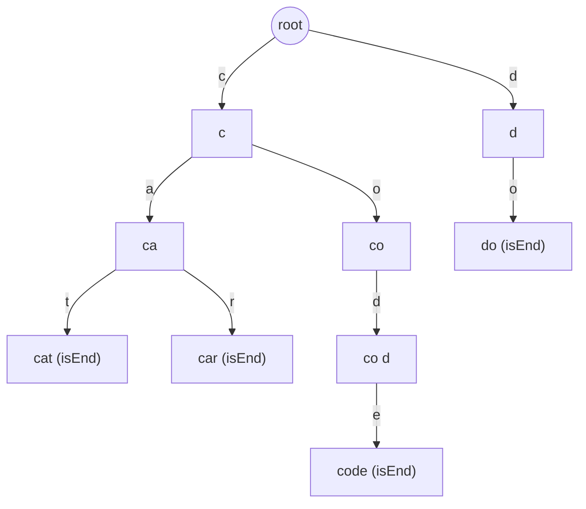
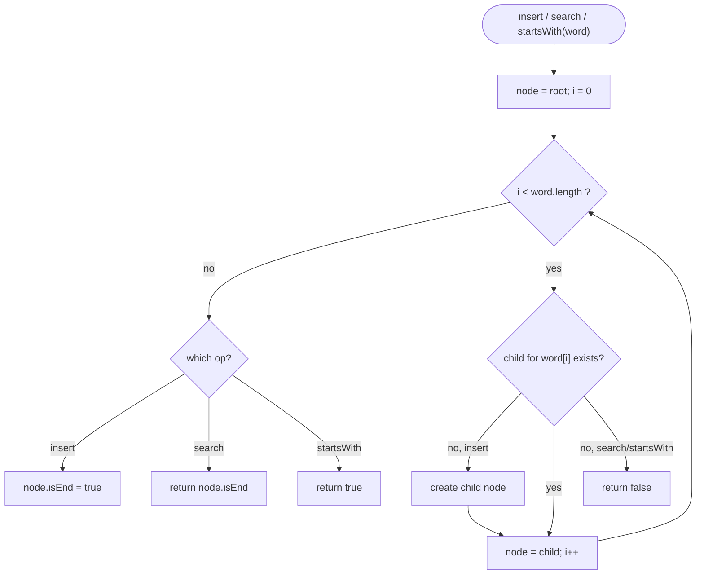
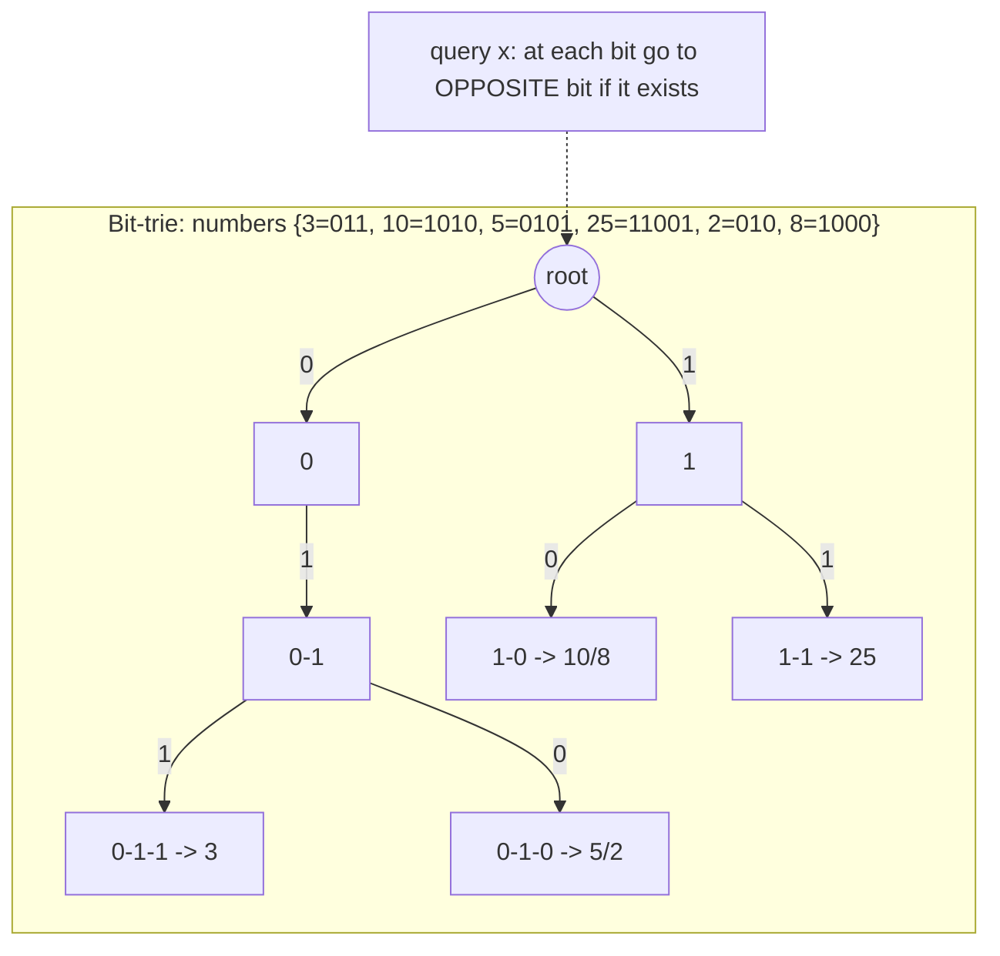

# Step 17: Tries

A revision guide to the Trie (prefix tree) — its node structure, insert/search/prefix operations, string-counting variants, and the bit-trie technique for XOR maximization problems.

**Stats:** 7 problems total — 🟢 1 Easy · 🟡 2 Medium · 🔴 4 Hard.

---

## 📌 Overview & Why It Matters

A **Trie** (pronounced "try", from re**trie**val), also called a **prefix tree**, is a tree data structure that stores a dynamic set of strings by sharing common prefixes along edges. Instead of storing whole keys in nodes, a trie encodes each character on the path from root to node, so all words sharing a prefix share the same initial path.

**Why it matters in interviews:**
- **Prefix queries in O(L)**: search/insert/`startsWith` run in time proportional to the word length `L`, independent of how many words are stored — this is the trie's superpower over hash maps for prefix work.
- Shows up constantly in **autocomplete, spell-check, IP routing, dictionary/word-search** problems, and word-grid problems (Word Search II, Replace Words, Word Break, Design Search Autocomplete).
- The **bit-trie** variant (a binary trie over the bits of integers) is the go-to tool for **maximum-XOR** problems, a very common Hard-tier interview topic.

**Prerequisites:** basic tree/recursion intuition, arrays, and — for the XOR problems — comfort with binary representation and bitwise operators (`>>`, `&`, `^`), which is exactly why "Bit PreRequisites for Trie Problems" appears in this step.

---

## 🧠 Core Concepts

**Trie node.** Each node holds:
- an array/map of **children** (size 26 for lowercase English, or a `HashMap<char, Node*>` for larger alphabets),
- a flag **`isEnd`** marking that a word terminates here,
- optionally **counters** (`countEndsHere`, `countPrefix`) for advanced operations like erase and prefix counting.

**Key invariants:**
- The **root is empty** (represents the empty prefix).
- A path from root to a node spells a prefix; if `isEnd` is set, that prefix is a stored word.
- Words with a common prefix share edges, giving compression and O(L) operations.



*Inserting `cat, car, code, do` — note `cat`/`car` share the `ca` path and `code` shares the `co` path with future words.*

**Complexity summary for the plain trie:**

| Operation | Time | Space |
|---|---|---|
| insert(word) | O(L) | O(L·Σ) worst case per word |
| search(word) | O(L) | O(1) |
| startsWith(prefix) | O(L) | O(1) |

where `L` = word length, `Σ` = alphabet size (26). Space is O(total characters × Σ) in the worst case.

---

## 🔑 Patterns & Approaches

### Pattern 1 — Theory: Trie Node Structure & Core Operations (insert / search / startsWith)

**When to use it / recognition signals:**
- The problem asks you to **implement a prefix tree**, support **`insert`, `search`, `startsWith`**.
- You see repeated **prefix lookups**, **autocomplete**, **dictionary membership**, or "does any stored word start with X".
- Many short strings with shared prefixes where hashing full strings would be wasteful.

**The approach/algorithm (step-by-step):**
1. Define a `Node` with `children[26]` and a boolean `isEnd`.
2. **Insert(word):** start at root; for each char, if the child edge is missing, create a new node; move down. After the last char, set `isEnd = true`.
3. **Search(word):** walk down following each char; if any edge is missing, return `false`. At the end return `node->isEnd`.
4. **startsWith(prefix):** identical walk but at the end simply return `true` (we reached the prefix; existence of a word beyond is irrelevant).



**Complexity:** each op is **O(L)** time (one step per character) and **O(1)** extra space per query; total structure space **O(N·L·Σ)** worst case — justified because every character can spawn a fresh node with an alphabet-sized child array.

**Reusable code template (C++):**
```cpp
struct Node {
    Node* links[26] = {nullptr};
    bool  flag = false;                 // isEnd

    bool  contains(char c)      { return links[c - 'a'] != nullptr; }
    void  put(char c, Node* n)  { links[c - 'a'] = n; }
    Node* get(char c)           { return links[c - 'a']; }
    void  setEnd()              { flag = true; }
    bool  isEnd()               { return flag; }
};

class Trie {
    Node* root;
public:
    Trie() { root = new Node(); }

    void insert(const string& word) {
        Node* node = root;
        for (char c : word) {
            if (!node->contains(c)) node->put(c, new Node());
            node = node->get(c);
        }
        node->setEnd();
    }

    bool search(const string& word) {
        Node* node = root;
        for (char c : word) {
            if (!node->contains(c)) return false;
            node = node->get(c);
        }
        return node->isEnd();
    }

    bool startsWith(const string& prefix) {
        Node* node = root;
        for (char c : prefix) {
            if (!node->contains(c)) return false;
            node = node->get(c);
        }
        return true;                    // reached the prefix — that's enough
    }
};
```

**Problems:**

| # | Problem | Difficulty | Practice |
|---|---|---|---|
| 1 | Trie Implementation and Operations | 🔴 Hard | [LeetCode](https://leetcode.com/problems/implement-trie-prefix-tree/) · [🎥](https://www.youtube.com/watch?v=dBGUmUQhjaM&list=PLgUwDviBIf0pcIDCZnxhv0LkHf5KzG9zp) |

**Edge cases & gotchas:**
- **Empty string** insert/search: the root's `isEnd` handles it — make sure your loop tolerates zero iterations.
- Don't confuse `search` (needs `isEnd`) with `startsWith` (just needs the path to exist).
- Free/`delete` nodes only if memory matters and no other word depends on them (usually skipped in interviews).
- Using `children[26]` assumes lowercase `a–z`; switch to a `HashMap` for Unicode/mixed case.

---

### Pattern 2 — Advanced Operations, Prefix Counting & Bit-Trie XOR

This sub_step bundles the harder trie variants: a trie with **counters** for `countWordsEqualTo`/`countWordsStartingWith`/`erase`, prefix-property problems, distinct-substring counting, the **bit prerequisites**, and the **bit-trie** XOR problems. Each is explained below with its own recognition signals, then all appear in one problems table.

**When to use it / recognition signals:**
- "How many words equal X / start with X" or "erase a word" → **counter trie** (Trie II).
- "Longest word buildable one character at a time / all prefixes present" → **prefix-property DFS on a trie**.
- "Count **distinct substrings**" → insert all **suffixes** into a trie; new nodes = new substrings.
- "**Maximum XOR** of a pair", "max XOR with a query element/limit" → **binary (bit) trie** storing numbers MSB→LSB, greedily choosing the opposite bit.

**The approaches (step-by-step):**

**(a) Counter Trie (Trie II).** Replace `isEnd` with two integers per node: `cntEnd` (words ending here) and `cntPrefix` (words passing through). `insert` increments `cntPrefix` on each visited child and `cntEnd` at the end. `countWordsEqualTo` returns `cntEnd`; `countWordsStartingWith` returns `cntPrefix`; `erase` walks the same path decrementing counters.

**(b) Longest Word with All Prefixes.** Insert all words. DFS/iterate words; a word is a candidate only if **every prefix of it is also `isEnd`** in the trie. Track the longest (lexicographically smallest on ties).

**(c) Distinct substrings via trie.** Every substring is a **prefix of some suffix**. Insert each suffix character-by-character; **each time you create a new node, you have found a new distinct substring**. Answer = number of nodes created (`+1` if you count the empty string).

**(d) Bit-Trie for XOR.** Insert each number as a fixed-width (e.g. 32-bit) binary string, MSB first, into a binary trie with children `0/1`. To find the max XOR for a query `x`, walk MSB→LSB and at each bit **greedily go to the opposite bit** if that child exists (contributing `1<<i` to the answer); otherwise follow the same bit. For "max XOR with limit ≤ mᵢ", **sort queries by limit** and **offline-insert** numbers ≤ limit before answering.



*Greedy XOR walk: prefer the branch whose bit differs from `x`'s bit, because a differing high bit maximizes the result.*

**Complexity:**
- Counter trie / prefix DFS: **O(L)** per op, **O(total chars · Σ)** space.
- Distinct substrings: **O(N²)** time and nodes for a length-`N` string (N suffixes × up to N chars).
- Bit-trie XOR: **O(N·B)** to build and **O(B)** per query where `B ≈ 32` bits — near-linear, justified since each number contributes one root-to-leaf path of fixed depth `B`.

**Reusable code template (C++):**
```cpp
// (a) Counter Trie (Trie II)
struct CNode { CNode* links[26] = {nullptr}; int cntEnd = 0, cntPre = 0; };
class TrieII {
    CNode* root = new CNode();
public:
    void insert(const string& w){
        CNode* n=root;
        for(char c:w){ int k=c-'a'; if(!n->links[k]) n->links[k]=new CNode();
                       n=n->links[k]; n->cntPre++; }
        n->cntEnd++;
    }
    int countWordsEqualTo(const string& w){
        CNode* n=root; for(char c:w){int k=c-'a'; if(!n->links[k])return 0; n=n->links[k];}
        return n->cntEnd;
    }
    int countWordsStartingWith(const string& p){
        CNode* n=root; for(char c:p){int k=c-'a'; if(!n->links[k])return 0; n=n->links[k];}
        return n->cntPre;
    }
    void erase(const string& w){
        CNode* n=root; for(char c:w){int k=c-'a'; if(!n->links[k])return; n=n->links[k]; n->cntPre--;}
        n->cntEnd--;
    }
};

// (d) Bit-Trie for Maximum XOR of two numbers in an array
struct BNode { BNode* ch[2] = {nullptr, nullptr}; };
class BitTrie {
    BNode* root = new BNode();
public:
    void insert(int num){
        BNode* n=root;
        for(int i=31;i>=0;--i){ int b=(num>>i)&1; if(!n->ch[b]) n->ch[b]=new BNode(); n=n->ch[b]; }
    }
    int getMax(int num){                 // best XOR of num with any inserted number
        BNode* n=root; int res=0;
        for(int i=31;i>=0;--i){ int b=(num>>i)&1;
            if(n->ch[1-b]){ res |= (1<<i); n=n->ch[1-b]; }  // greedily take opposite bit
            else            n=n->ch[b];
        }
        return res;
    }
};

int findMaximumXOR(vector<int>& nums){
    BitTrie t; int best=0;
    for(int x:nums) t.insert(x);
    for(int x:nums) best=max(best, t.getMax(x));
    return best;
}
```

**Problems:**

| # | Problem | Difficulty | Practice |
|---|---|---|---|
| 1 | Trie Implementation and Advanced Operations | 🔴 Hard | [Article](https://takeuforward.org/data-structure/implement-trie-ii/) |
| 2 | Longest Word with All Prefixes | 🟡 Medium | [Editorial](https://takeuforward.org/plus/dsa/problems/longest-word-with-all-prefixes?tab=editorial) · [🎥](https://www.youtube.com/watch?v=AWnBa91lThI&list=PLgUwDviBIf0pcIDCZnxhv0LkHf5KzG9zp&index=3) |
| 3 | Number of distinct substrings in a string | 🟡 Medium | [Article](https://takeuforward.org/data-structure/number-of-distinct-substrings-in-a-string-using-trie/) · [🎥](https://www.youtube.com/watch?v=RV0QeTyHZxo&list=PLgUwDviBIf0pcIDCZnxhv0LkHf5KzG9zp&index=4) |
| 4 | Bit PreRequisites for TRIE Problems | 🟢 Easy | [🎥](https://youtu.be/5iyuU4hQFrw) |
| 5 | Maximum XOR of two numbers in an array | 🔴 Hard | [LeetCode](https://leetcode.com/problems/maximum-xor-of-two-numbers-in-an-array/) · [🎥](https://www.youtube.com/watch?v=EIhAwfHubE8&list=PLgUwDviBIf0pcIDCZnxhv0LkHf5KzG9zp&index=6) |
| 6 | Maximum Xor with an element from an array | 🔴 Hard | [LeetCode](https://leetcode.com/problems/maximum-xor-with-an-element-from-array/) · [🎥](https://www.youtube.com/watch?v=Q8LhG9Pi5KM&list=PLgUwDviBIf0pcIDCZnxhv0LkHf5KzG9zp&index=7) |

**Edge cases & gotchas:**
- **Counter trie:** always `erase` a word that was actually inserted, or counters go negative; decrement `cntPre` on the way down and `cntEnd` at the end.
- **Longest-word-with-all-prefixes:** a word qualifies only if *every* proper prefix ends a word; break ties by shorter/lexicographically smaller as the problem states.
- **Distinct substrings:** count **newly created nodes**, not `isEnd` flags; O(N²) is expected — don't attempt suffix automaton unless asked.
- **Bit-trie:** fix the bit width (30–32) to cover the max value; iterate **MSB→LSB** (going LSB-first breaks greediness). For the "with limit" variant, use **offline sorting** of queries and numbers; return `-1` when no number ≤ limit exists.

---

## ❓ Regularly Asked Interview Questions

**Q: What is a Trie and how does it differ from a hash table for string storage?**
**A:** A trie is a prefix tree where each edge holds a character and shared prefixes share paths. Unlike a hash table, it supports **prefix queries** (`startsWith`, autocomplete) in O(L) and stores keys in sorted order, at the cost of higher memory due to per-node child arrays.

**Q: What are the time complexities of insert, search, and startsWith?**
**A:** All are **O(L)** where L is the word/prefix length, independent of the number of stored words.

**Q: What is the space complexity of a trie?**
**A:** Worst case **O(N·L·Σ)** (total characters times alphabet size Σ) because each node may allocate an alphabet-sized child array. Using hash-map children reduces the constant for sparse alphabets.

**Q: How do `search` and `startsWith` differ in implementation?**
**A:** Both walk the path following each character. `search` additionally returns the node's `isEnd` flag; `startsWith` returns `true` as soon as the full prefix path exists.

**Q: How would you support counting words equal to a key and words with a given prefix, plus deletion?**
**A:** Store two counters per node — `cntEnd` (words ending here) and `cntPrefix` (words passing through). Insert increments `cntPrefix` down the path and `cntEnd` at the end; the two count queries just read those fields; `erase` decrements them along the same path. This is "Trie II".

**Q: How do you count the number of distinct substrings of a string using a trie?**
**A:** Insert every **suffix** into a trie one character at a time. Each **new node created** corresponds to a new distinct substring, so the answer is the total nodes created — O(N²) time and space.

**Q: How does a bit-trie find the maximum XOR of two numbers in an array?**
**A:** Insert each number's 32-bit representation MSB→LSB into a binary trie. For each number, walk the trie choosing the **opposite bit** whenever that child exists (adding `1<<i` to the result), else the same bit. This greedily maximizes high bits first; take the max over all numbers. Time O(N·32).

**Q: Why is greedily choosing the opposite bit correct for max XOR?**
**A:** XOR yields 1 when bits differ. A single differing high-order bit (say bit 30) outweighs all lower bits combined (2³⁰ > 2³⁰−1), so maximizing the most significant differing bit first is provably optimal.

**Q: How do you solve "Maximum XOR with an element ≤ limit" (query version)?**
**A:** Process **offline**: sort queries by their limit and the array ascending. For each query, insert all numbers ≤ limit into the bit-trie (using a moving pointer), then run the standard max-XOR walk. Answer `-1` if no number qualifies. Overall O((N+Q)·32 + sorting).

**Q: When would you NOT use a trie?**
**A:** When you only need exact-match membership with no prefix operations — a hash set is simpler and lower-memory. Also avoid tries for very large alphabets with array children (use maps instead) or when memory is tight.

**Q: How would you implement autocomplete with a trie?**
**A:** Walk to the prefix node in O(L); then DFS the subtree to collect all words with that prefix. Optionally store frequencies/top-k at each node for ranked suggestions (Design Search Autocomplete).

**Q: How do you handle wildcard `.` matching (Add and Search Word)?**
**A:** During search, on `.` recurse into **all** existing children; on a normal char follow the single edge. Worst case O(Σ^L) but typically fast.

**Q: What is the difference between a trie and a radix/compressed trie (Patricia trie)?**
**A:** A radix trie merges chains of single-child nodes into a single edge labeled with a substring, reducing node count and memory for sparse datasets — used in IP routing tables.

---

## 💡 Interview Tips & Common Mistakes

- **State the node layout first.** Sketch `children[26] + isEnd` (or `+ counters`) before coding; interviewers want to see the structure.
- **Reuse one walk-down loop** for insert/search/startsWith — only the terminal action differs; this avoids duplicated bugs.
- **`startsWith` must NOT check `isEnd`** — a classic bug that fails "prefix exists but no full word" cases.
- **For bit-tries, iterate MSB→LSB.** LSB-first destroys the greedy optimality. Fix the bit width to cover the constraints (usually 31 or 32 bits).
- **Guard counters in Trie II** so `erase` on a non-existent word doesn't underflow; only erase words known to exist.
- **Distinct substrings = new nodes created**, not end flags — a frequent off-by-one/logic slip.
- **Choose map-children for large or mixed alphabets** (Unicode, uppercase+lowercase+digits) instead of a fixed array.
- **Watch memory**: array children (26 pointers/node) blow up fast; mention this tradeoff proactively.
- **Offline processing** is the key trick for limit/query XOR problems — sort and add incrementally.
- **Clarify the alphabet and constraints** (lowercase only? word count? value range for XOR?) before choosing array vs map and bit width.

---

## 🐟 Revision Cheat-Sheet

| Pattern | Key Idea | Time | Space | Signature problem |
|---|---|---|---|---|
| Trie node + insert/search/startsWith | `children[26]` + `isEnd`; one walk-down loop | O(L)/op | O(N·L·Σ) | Implement Trie (Prefix Tree) |
| Counter trie (Trie II) | `cntEnd` + `cntPrefix` per node → count & erase | O(L)/op | O(N·L·Σ) | Trie II — count words / erase |
| Prefix-property DFS | Word valid iff every prefix is `isEnd` | O(ΣL) | O(N·L·Σ) | Longest Word with All Prefixes |
| Suffix trie | Insert all suffixes; new nodes = distinct substrings | O(N²) | O(N²) | Number of distinct substrings |
| Bit prerequisites | `(x>>i)&1`, `^`, MSB→LSB thinking | — | — | Bit PreReq for Trie |
| Bit-trie max XOR | Insert bits MSB→LSB; greedily take opposite bit | O(N·32) | O(N·32) | Maximum XOR of two numbers |
| Bit-trie + offline queries | Sort by limit; insert ≤ limit, then max-XOR walk | O((N+Q)·32) | O(N·32) | Maximum XOR with an element (limit) |

---

## 🔗 References & Further Reading

- Striver / takeuforward — Step 17 Tries: <https://takeuforward.org/strivers-a2z-dsa-course/strivers-a2z-dsa-course-sheet-2/>
- takeuforward — Implement Trie (I): <https://takeuforward.org/data-structure/implement-trie-1/>
- takeuforward — Implement Trie II: <https://takeuforward.org/data-structure/implement-trie-ii/>
- takeuforward — Distinct substrings using Trie: <https://takeuforward.org/data-structure/number-of-distinct-substrings-in-a-string-using-trie/>
- takeuforward — Maximum XOR of two numbers in an array: <https://takeuforward.org/data-structure/maximum-xor-of-two-numbers-in-an-array/>
- takeuforward — Maximum XOR queries (Trie): <https://takeuforward.org/trie/maximum-xor-queries-trie/>
- GeeksforGeeks — Commonly Asked Trie Interview Questions: <https://www.geeksforgeeks.org/dsa/commonly-asked-data-structure-interview-questions-on-tries/>
- GeeksforGeeks — Maximum XOR of Two Numbers in an Array (Trie): <https://www.geeksforgeeks.org/maximum-xor-of-two-numbers-in-an-array-set-2/>
- LeetCode Explore — Trie card: <https://leetcode.com/explore/learn/card/trie/>
- Devinterview — Trie interview questions: <https://github.com/Devinterview-io/trie-interview-questions>
