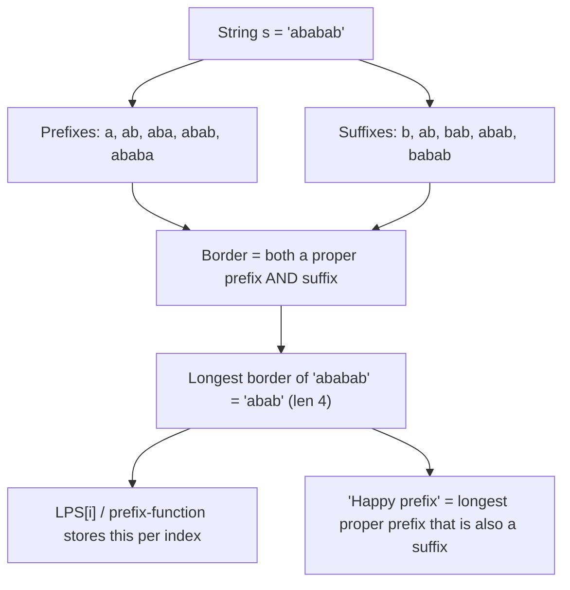
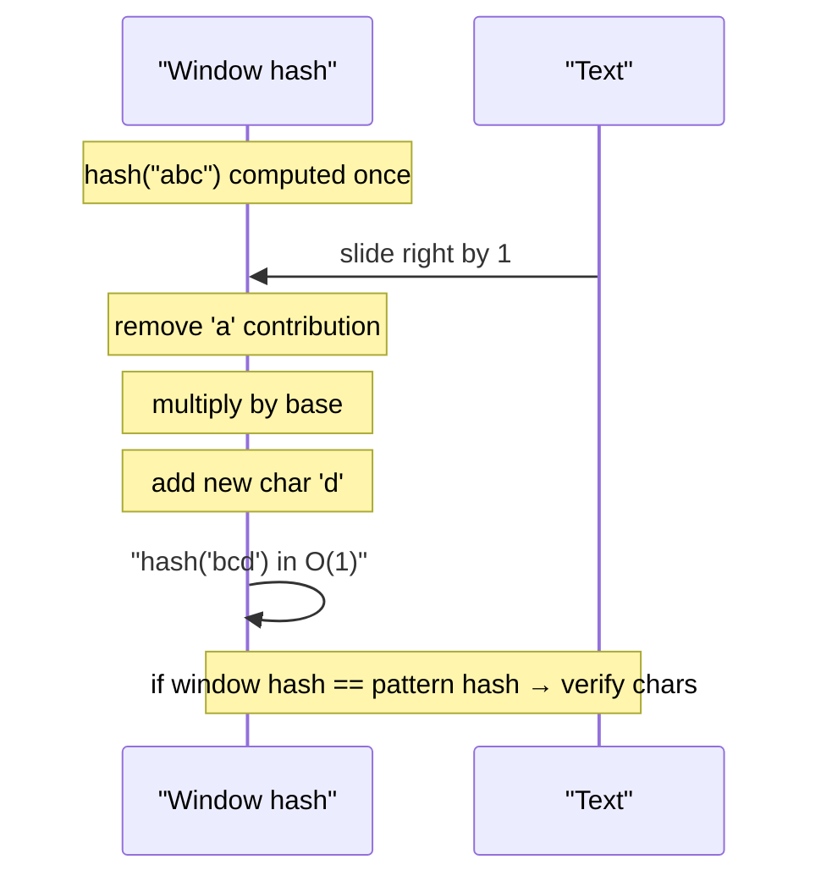
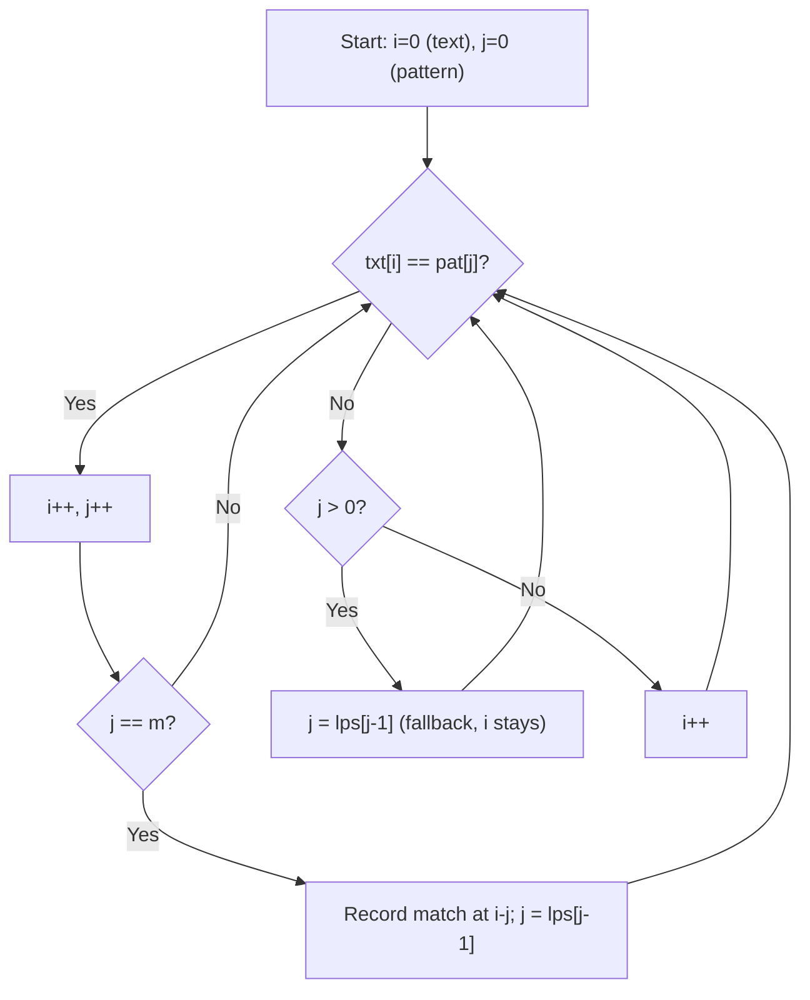
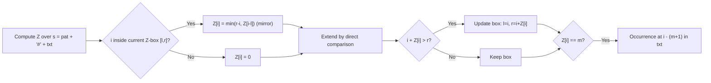
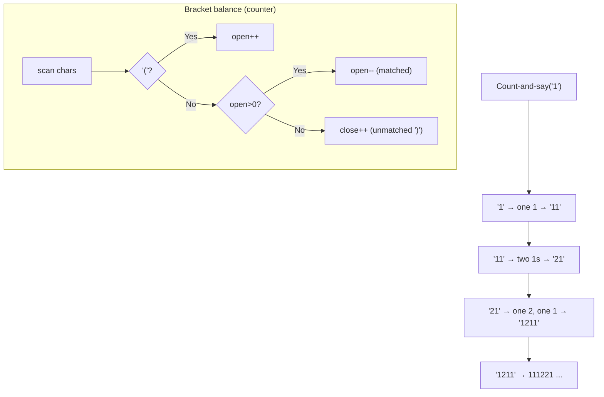

# Step 18: Strings [Advanced]

Advanced string algorithms — linear-time pattern matching (KMP/LPS, Z-function, Rabin–Karp rolling hash), the lexicographically minimal rotation trick, and a set of hard constructive string problems.

**Stats:** 9 problems total — 🟢 Easy: 1 · 🟡 Medium: 1 · 🔴 Hard: 7

---

## 📌 Overview & Why It Matters

This step is about doing serious work on strings in **linear (or near-linear) time**. The naive "check the pattern at every index" approach is `O(n·m)` and blows up on adversarial inputs like `"aaaa…aab"`. The algorithms here — **KMP**, the **Z-function**, and **Rabin–Karp** — all bring pattern search down to `O(n + m)`, each using a different insight:

- **KMP / LPS (prefix function):** precompute how much of the pattern is *self-similar* so that on a mismatch you never re-examine text characters.
- **Z-function:** for each index, how long a substring starting there matches the *prefix* of the string — a symmetric cousin of the prefix function.
- **Rabin–Karp:** turn substrings into numbers (**rolling hash**) so a window comparison becomes an `O(1)` integer compare.
- **Lexicographically minimal rotation (Booth's algorithm):** a KMP-flavored `O(n)` way to canonicalize a circular string.

**Where it shows up in interviews:**
- Substring / pattern search (`strStr`, "find needle in haystack").
- Prefix–suffix questions: shortest palindrome, longest happy prefix, repeated substring pattern.
- Deduplication / plagiarism / anagram-window problems (hashing).
- String normalization and cyclic-equivalence checks (min rotation).
- Constructive/simulation strings: count-and-say, balancing brackets, counting palindromic subsequences.

**Prerequisites:** comfort with arrays, prefix/suffix vocabulary, modular arithmetic, and basic string manipulation. Knowing the naive `O(n·m)` matcher first makes every optimization here "click."

---

## 🧠 Core Concepts

The unifying vocabulary of this step is **prefix**, **suffix**, and **border**.

- A **prefix** of `s` is `s[0..i]`; a **suffix** is `s[j..n-1]`.
- A **proper prefix/suffix** excludes the whole string itself.
- A **border** of `s` is a string that is *both* a proper prefix and a proper suffix. The **longest border** is the single fact that powers KMP, "longest happy prefix," and shortest-palindrome.



Everything below is a lens on borders:

| Concept | One-line meaning |
|---|---|
| **LPS[i] (prefix function π)** | length of the longest border of `s[0..i]` |
| **Z[i]** | length of longest substring starting at `i` that matches a prefix of `s` |
| **Rolling hash** | polynomial hash `h = s[0]·p^(m-1) + … + s[m-1]`, updatable in `O(1)` as the window slides |
| **Sentinel trick** | join `pattern + '#' + text` so a full-length match reveals occurrences |
| **Double self-concat** | `s + s` contains every rotation of `s` as a substring |

---

## 🔑 Patterns & Approaches

### 1. String Hashing & Rabin–Karp (Rolling Hash)

**When to use it / recognition signals**
- "Find a pattern in text," but you also need to compare *many* substrings, detect *duplicated* substrings, or compare substrings for equality quickly.
- Anagram/substring windows, "repeated substring," "distinct substrings," plagiarism/dedup, checking if two substrings are equal in `O(1)` after preprocessing.

**The approach/algorithm**
1. Pick a base `p` (larger than the alphabet, e.g., 31 for lowercase, 131 for ASCII) and a large prime modulus `MOD` (e.g., `1e9+7`).
2. Compute the hash of the pattern of length `m`: `H(p) = Σ p[i]·base^(m-1-i) mod MOD`.
3. Compute the hash of the first window of the text the same way.
4. **Slide** the window: to move from `[i, i+m-1]` to `[i+1, i+m]`, subtract the leading char's contribution, multiply by `base`, add the new trailing char — all `O(1)`.
5. On a **hash match**, verify character-by-character to rule out a *collision* (false positive).

Use **double hashing** (two moduli) to make collisions astronomically unlikely.



**Complexity:** Time `O(n + m)` expected (with rare `O(n·m)` verification cost on collisions); Space `O(1)` extra (or `O(n)` if precomputing prefix hashes). Justification: each slide is `O(1)`; verification is amortized negligible with a good modulus.

**Reusable code template (C++):**
```cpp
// Rabin–Karp: find all start indices of `pat` in `txt`.
vector<int> rabinKarp(const string& txt, const string& pat) {
    int n = txt.size(), m = pat.size();
    vector<int> res;
    if (m == 0 || m > n) return res;

    const long long base = 31, MOD = 1e9 + 9;
    // highPow = base^(m-1) % MOD, used to strip the leading char.
    long long highPow = 1;
    for (int i = 0; i < m - 1; i++) highPow = (highPow * base) % MOD;

    long long patHash = 0, winHash = 0;
    for (int i = 0; i < m; i++) {
        patHash = (patHash * base + pat[i]) % MOD;
        winHash = (winHash * base + txt[i]) % MOD;
    }

    for (int i = 0; i + m <= n; i++) {
        if (winHash == patHash && txt.compare(i, m, pat) == 0)
            res.push_back(i);                 // verify to defeat collisions
        if (i + m < n) {                      // roll the window
            winHash = (winHash - txt[i] * highPow % MOD + MOD) % MOD;
            winHash = (winHash * base + txt[i + m]) % MOD;
        }
    }
    return res;
}
```

**Edge cases & gotchas**
- **Always verify** on a hash hit unless you can prove no collision — hashing is probabilistic.
- Handle the modular subtraction carefully: `(x - y + MOD) % MOD` to avoid negatives.
- Choose `base > alphabet size`; using a small base causes collisions.
- For anti-hash test cases (Codeforces-style), use **two independent hashes** or randomized base.

**Problems**

| # | Problem | Difficulty | Practice |
|---|---------|------------|----------|
| 1 | Hashing In Strings \| Theory | 🟢 Easy | [Article](https://takeuforward.org/data-structure/hashing-in-strings) |
| 2 | Rabin Karp Algorithm | 🔴 Hard | [LeetCode](https://leetcode.com/problems/repeated-string-match/discuss/416144/Rabin-Karp-algorithm-C%2B%2B-implementation) |

---

### 2. KMP Algorithm / LPS Array (Prefix Function)

**When to use it / recognition signals**
- Exact substring search with a **worst-case linear** guarantee (no probabilistic risk).
- "Longest prefix that is also a suffix," "shortest palindrome by prepending," "shortest string that has `s` as a repetition," periodicity of a string.
- Streaming text where backtracking on the text is unacceptable.

**The approach/algorithm**
1. **Build LPS (π) for the pattern.** `lps[i]` = length of the longest proper border of `pat[0..i]`.
   - Keep `len` = current border length. For each `i`, if `pat[i] == pat[len]`, extend: `lps[i] = ++len`. Else fall back to `len = lps[len-1]` and retry; if `len == 0`, set `lps[i] = 0`.
2. **Match against text.** Walk `i` over text and `j` over pattern. On match advance both. On mismatch, **don't move `i`**; instead set `j = lps[j-1]` (reuse the already-matched prefix). When `j == m`, record an occurrence at `i - m` and set `j = lps[j-1]` to keep searching.

The key insight: the LPS tells you the largest already-matched prefix you can *keep* after a mismatch, so text characters are never rescanned.



**Complexity:** Time `O(n + m)`, Space `O(m)` for the LPS array. Justification: `i` only moves forward, and `j` increases at most `n` times total, so total fallbacks are bounded — amortized linear.

**Reusable code template (C++):**
```cpp
vector<int> buildLPS(const string& pat) {
    int m = pat.size();
    vector<int> lps(m, 0);
    int len = 0;                     // length of current longest border
    for (int i = 1; i < m; ) {
        if (pat[i] == pat[len]) lps[i++] = ++len;
        else if (len > 0)      len = lps[len - 1];   // fall back, retry i
        else                   lps[i++] = 0;
    }
    return lps;
}

vector<int> kmpSearch(const string& txt, const string& pat) {
    vector<int> lps = buildLPS(pat), res;
    int n = txt.size(), m = pat.size(), i = 0, j = 0;
    while (i < n) {
        if (txt[i] == pat[j]) { i++; j++; if (j == m) { res.push_back(i - j); j = lps[j - 1]; } }
        else if (j > 0)        j = lps[j - 1];
        else                   i++;
    }
    return res;
}
```

**Applications baked into this pattern:**
- **Longest happy prefix** = `lps[m-1]` of the string → `s[0 .. lps[m-1]-1]`.
- **Shortest palindrome** (prepend chars): build LPS of `s + '#' + reverse(s)`; the last LPS value = longest palindromic prefix; prepend the reverse of the remainder.

**Problems**

| # | Problem | Difficulty | Practice |
|---|---------|------------|----------|
| 1 | KMP Algorithm or LPS array | 🔴 Hard | [LeetCode](https://leetcode.com/problems/implement-strstr/) |
| 2 | Longest happy prefix | 🔴 Hard | [LeetCode](https://leetcode.com/problems/longest-happy-prefix/) |
| 3 | Shortest Palindrome | 🔴 Hard | [Article](https://takeuforward.org/data-structure/kmp-algorithm-or-lps-array) |

**Edge cases & gotchas**
- **`lps[0]` is always 0** — start the loop at `i = 1`.
- On mismatch fall back to `lps[len-1]`, *not* `len-1`.
- Empty pattern → match at index 0 by convention (`strStr` returns 0).
- For "longest happy prefix" the answer is the **proper** prefix, so it's exactly `lps[n-1]` (never the whole string, by definition of proper border).
- For shortest palindrome, the `'#'` separator is mandatory so the prefix/suffix halves can't bleed into each other.

---

### 3. Z-Function

**When to use it / recognition signals**
- Same jobs as KMP (pattern search, periodicity), but you find the **Z-function** more intuitive, or you need per-index "match length with the prefix" info (e.g., number of distinct substrings, string compression, counting occurrences).
- Recognition: "how far does the string match its own prefix starting here," or you want a single array that directly encodes prefix matches.

**The approach/algorithm**
`Z[i]` = length of the longest substring starting at `i` equal to a prefix of `s`.
1. Maintain a `[l, r]` window — the rightmost segment known to match the prefix (a "Z-box").
2. For index `i`:
   - If `i < r`, initialize `Z[i] = min(r - i, Z[i - l])` (reuse info from the mirrored position).
   - Extend `Z[i]` by comparing `s[Z[i]]` with `s[i + Z[i]]` while they match.
   - If `i + Z[i] > r`, update `l = i, r = i + Z[i]`.
3. **Pattern search:** run Z on `pat + '#' + txt`. Any index with `Z[i] == m` marks an occurrence in the text.



**Complexity:** Time `O(n + m)`, Space `O(n + m)` for the Z-array over the concatenation. Justification: `r` only moves forward, so total comparisons are linear.

**Reusable code template (C++):**
```cpp
vector<int> zFunction(const string& s) {
    int n = s.size();
    vector<int> z(n, 0);
    int l = 0, r = 0;                       // current rightmost Z-box
    for (int i = 1; i < n; i++) {
        if (i < r) z[i] = min(r - i, z[i - l]);
        while (i + z[i] < n && s[z[i]] == s[i + z[i]]) z[i]++;
        if (i + z[i] > r) { l = i; r = i + z[i]; }
    }
    return z;                                // z[0] left as 0 by convention
}

// Pattern search with Z
vector<int> zSearch(const string& txt, const string& pat) {
    string s = pat + '#' + txt;
    vector<int> z = zFunction(s), res;
    int m = pat.size();
    for (int i = m + 1; i < (int)s.size(); i++)
        if (z[i] == m) res.push_back(i - m - 1);
    return res;
}
```

**Edge cases & gotchas**
- `Z[0]` is conventionally 0 (or `n`) — don't rely on it in searches.
- The separator `#` must **not** appear in either string, else `Z[i]` could exceed `m` spuriously.
- Off-by-one in translating index in the concatenation back to the text: subtract `m + 1`.

**Problems**

| # | Problem | Difficulty | Practice |
|---|---------|------------|----------|
| 1 | Z function | 🔴 Hard | [Article](https://cp-algorithms.com/string/z-function.html) |

---

### 4. Lexicographically Minimal Rotation (Booth's Algorithm)

**When to use it / recognition signals**
- "Smallest rotation," "canonical form of a circular string," "are two strings rotations of each other / cyclically equal," normalizing necklaces / cyclic sequences.
- Recognition: the string is **circular** and you must pick a canonical starting point.

**The approach/algorithm**
1. **Naive:** among all `n` rotations of `s + s`, pick the smallest — `O(n²)`.
2. **Booth's algorithm** (`O(n)`): use a KMP-style failure function over the doubled string `s + s`, tracking a candidate start `k`. Compare `s[(k+j) % n]` with `s[(i+j) % n]`; when the second is smaller, jump the candidate start forward; skip ahead using the failure array — reminiscent of KMP fallbacks.
3. **Practical alternative — Booth via `s+s` + two pointers (Duval-like):** iterate two candidate starts `i`, `j` and an offset `k`; compare `t[i+k]` and `t[j+k]` where `t = s+s`; advance the loser past the matched block. Runs in `O(n)`.

```mermaid
stateDiagram-v2
    [*] --> Compare
    Compare --> Equal: "t[i+k] == t[j+k]"
    Compare --> iWins: "t[i+k] < t[j+k]"
    Compare --> jWins: "t[i+k] > t[j+k]"
    Equal --> Compare: "k++"
    iWins --> Advance: "j = j + k + 1"
    jWins --> Advance: "i = i + k + 1"
    Advance --> Skip: "if i==j then j++; k=0"
    Skip --> Compare: "while max(i,j) < n"
    Skip --> [*]: "answer = min(i,j)"
```



**Complexity:** Time `O(n)`, Space `O(n)` (for the doubled string) or `O(1)` with modular indexing. Justification: each comparison either advances `k` or bumps a candidate by `k+1`, bounding total work linearly.

**Reusable code template (C++):**
```cpp
// Returns the starting index of the lexicographically minimal rotation of s.
int leastRotation(const string& s) {
    int n = s.size();
    string t = s + s;                 // avoid modular index gymnastics
    int i = 0, j = 1, k = 0;          // two candidate starts, k = match length
    while (i < n && j < n && k < n) {
        char a = t[i + k], b = t[j + k];
        if (a == b) { k++; }
        else {
            if (a > b) i += k + 1;    // start i is worse, jump it
            else       j += k + 1;    // start j is worse, jump it
            if (i == j) j++;          // never keep two equal candidates
            k = 0;
        }
    }
    return min(i, j);                 // minimal rotation is s.substr(ans)+s.substr(0,ans)
}
```

**Edge cases & gotchas**
- Reset `k = 0` after every mismatch, and **skip the collision** when `i == j`.
- Ties (multiple minimal rotations) are fine — any is a valid canonical form.
- To test "is `a` a rotation of `b`": check `a.size()==b.size() && (b+b).find(a)!=npos` (or compare minimal rotations).

**Problems**

*(Booth's algorithm is a named advanced-string technique this step expects you to know; it has no dedicated LeetCode row in the dataset. The problems below apply the min-rotation / doubled-string idea and other constructive hard-string techniques.)*

| # | Problem | Difficulty | Practice |
|---|---------|------------|----------|
| 1 | Count Palindromic Subsequences | 🟡 Medium | [LeetCode](https://leetcode.com/problems/count-palindromic-subsequences/) |

---

### 5. Constructive & Balance Hard-String Problems

**When to use it / recognition signals**
- Not pattern matching per se — instead **build/transform** a string or **count** structured pieces: run-length descriptions, balancing brackets with a stack/counter, counting palindromic sub-structures.
- Recognition: "generate the next term," "minimum edits to balance," "count subsequences that are palindromes."

**The approach/algorithm**
- **Count and say:** iteratively run-length-encode the previous term. Term `1` is `"1"`; each next term reads the previous as "`count` `digit`" groups.
- **Minimum bracket reversals to balance:** single pass with a counter (or stack). Track unmatched `open` and `close`. Reversals needed ≈ `⌈open/2⌉ + ⌈close/2⌉`. (For "minimum add to make valid," you *add* rather than reverse, so answer = `open + close` unmatched.)
- **Count palindromic subsequences:** interval DP. Let `dp[i][j]` count palindromic subsequences in `s[i..j]`; combine `dp[i+1][j] + dp[i][j-1] - dp[i+1][j-1]`, and when `s[i]==s[j]` add `dp[i+1][j-1] + 1` (careful with the fixed-alphabet variant and inclusion–exclusion / modular arithmetic).



**Complexity:**
- Count-and-say: `O(Σ|term|)` time (each term can roughly double), `O(len)` space.
- Bracket reversals/adds: `O(n)` time, `O(1)` space.
- Count palindromic subsequences: `O(n²)` time, `O(n²)` space (interval DP).

**Reusable code template (C++):**
```cpp
// Count-and-say: n-th term.
string countAndSay(int n) {
    string s = "1";
    for (int t = 1; t < n; t++) {
        string next;
        for (int i = 0; i < (int)s.size(); ) {
            int j = i;
            while (j < (int)s.size() && s[j] == s[i]) j++;
            next += to_string(j - i) + s[i];
            i = j;
        }
        s = move(next);
    }
    return s;
}

// Minimum ADD to make parentheses valid (LeetCode variant).
int minAddToMakeValid(const string& s) {
    int open = 0, add = 0;                 // add = unmatched ')'
    for (char c : s) {
        if (c == '(') open++;
        else if (open > 0) open--;         // match a ')'
        else add++;                        // unmatched ')'
    }
    return add + open;                     // leftover '(' also need matches
}
```

**Edge cases & gotchas**
- **Count-and-say** grows fast — build iteratively; watch memory for large `n`.
- Distinguish "minimum **reversals**" (flip `)` to `(`) — uses `ceil(open/2)+ceil(close/2)` — from "minimum **adds**" (insert) — uses `open+close`. The linked LeetCode is the *add* variant.
- Palindromic-subsequence counting: subsequences ≠ substrings; use inclusion–exclusion and take `mod` (add `MOD` before `%` to avoid negatives).
- Odd total unmatched brackets ⇒ impossible to balance by reversal alone (only for even-length constraints).

**Problems**

| # | Problem | Difficulty | Practice |
|---|---------|------------|----------|
| 1 | Minimum number of bracket reversals to make an expression balanced | 🔴 Hard | [LeetCode](https://leetcode.com/problems/minimum-add-to-make-parentheses-valid/) |
| 2 | Count and say | 🔴 Hard | [LeetCode](https://leetcode.com/problems/count-and-say/) |

---

## ❓ Regularly Asked Interview Questions

**Q: What does the LPS array actually store, and why is it enough to make KMP linear?**
**A:** `lps[i]` is the length of the longest proper border (prefix that is also a suffix) of `pat[0..i]`. On a mismatch it tells you the largest prefix already matched that you can *keep*, so the text pointer never moves backward — total work is `O(n+m)`.

**Q: How is the Z-function different from the prefix function (LPS)?**
**A:** LPS answers "longest border of every prefix," while `Z[i]` answers "longest match with the prefix starting at position `i`." They are convertible into each other and both give `O(n)` pattern search; Z is often more intuitive for prefix-match questions.

**Q: Why must Rabin–Karp verify a match after hashes are equal?**
**A:** Because hashing is many-to-one — two different substrings can share a hash (a **collision**). Verification (or double hashing) prevents false positives. Without it, correctness isn't guaranteed.

**Q: What's a good base and modulus for polynomial hashing?**
**A:** Base slightly above the alphabet (31 for lowercase, 131/257 for ASCII) and a large prime modulus like `1e9+7` or `1e9+9`. For adversarial inputs, use two moduli (double hashing) or a randomized base.

**Q: How do you make the rolling hash update `O(1)`?**
**A:** Precompute `base^(m-1)`. To slide: subtract `leadingChar · base^(m-1)`, multiply the remainder by `base`, add the new trailing char, all mod `MOD` (with `+MOD` before `%` to stay non-negative).

**Q: How would you find the shortest palindrome by adding characters to the front?**
**A:** Build the LPS of `s + '#' + reverse(s)`. The last LPS value is the length of the longest palindromic prefix of `s`; prepend the reverse of the remaining suffix. `O(n)`.

**Q: What is a "happy prefix" and how do you compute it?**
**A:** The longest **proper** prefix of `s` that is also a suffix. It's exactly `lps[n-1]` from KMP preprocessing → `s.substr(0, lps[n-1])`.

**Q: How do you check if string A is a rotation of string B?**
**A:** `A.size()==B.size()` and `(B+B).find(A) != npos`. Alternatively compute both minimal rotations (Booth's `O(n)`) and compare.

**Q: When would you prefer KMP over Rabin–Karp and vice versa?**
**A:** KMP gives a deterministic worst-case `O(n+m)` with no collision risk — good for single-pattern exact search and streaming. Rabin–Karp shines for **multiple patterns** of the same length or repeated substring-equality queries, where hashing amortizes well.

**Q: How does Booth's algorithm find the minimal rotation in `O(n)`?**
**A:** It runs a KMP-style failure function over the doubled string while tracking a candidate start; on comparisons it advances the worse candidate by `k+1` and skips matched blocks, bounding work to linear.

**Q: Why concatenate the string with itself when dealing with rotations?**
**A:** `s + s` contains every rotation of `s` as a length-`|s|` substring, so rotation problems reduce to substring problems on the doubled string.

**Q: How would you approach "count palindromic subsequences" and control complexity?**
**A:** Interval DP: `dp[i][j]` over substrings, combining `dp[i+1][j] + dp[i][j-1] - dp[i+1][j-1]`, adding `dp[i+1][j-1]+1` when endpoints match. It's `O(n²)`; take results mod a prime to avoid overflow.

**Q: How does count-and-say generate each term, and why can it get large?**
**A:** Each term is the run-length encoding ("say") of the previous term. Because runs describe counts+digits, terms can nearly double in length, so build iteratively and mind memory.

**Q: Distinguish "minimum bracket reversals" from "minimum additions" to balance.**
**A:** Reversals flip an existing bracket (`)`→`(`), costing `ceil(open/2)+ceil(close/2)`; additions insert new brackets, costing `open+close` unmatched. The two problems have different formulas — read the prompt carefully.

---

## 💡 Interview Tips & Common Mistakes

- **State the naive `O(n·m)` baseline first**, then justify why KMP/Z/Rabin–Karp improve it — interviewers want the reasoning, not just the trick.
- **KMP fallback bug:** on mismatch set `j = lps[j-1]`, never `j = lps[j]-1` or `j--`.
- **`lps[0] = 0` always** and the build loop starts at `i = 1`.
- **Rabin–Karp:** never skip verification; and guard modular subtraction with `+MOD`.
- **Z / KMP with sentinel:** pick a separator char guaranteed absent from the inputs.
- **Off-by-one in concatenation searches:** map matched index back to the original text (`i - m - 1` for Z with `pat + '#' + txt`).
- **Rotations:** remember `s+s` and Booth's `O(n)` when the interviewer says "circular" or "canonical."
- **Palindrome counting:** subsequences vs substrings is a classic trap — clarify which, and apply modular arithmetic.
- Practice **dry-running the LPS build on a self-similar pattern** like `"aabaaac"` — it's the single most common whiteboard ask.

---

## 🐟 Revision Cheat-Sheet

| Pattern | Key Idea | Time | Space | Signature problem |
|---|---|---|---|---|
| String Hashing & Rabin–Karp | Polynomial rolling hash, slide window in `O(1)`, verify on hit | `O(n+m)` exp. | `O(1)`/`O(n)` | Repeated String Match |
| KMP / LPS (prefix function) | Longest border per prefix → never rescan text | `O(n+m)` | `O(m)` | Implement strStr / Longest Happy Prefix |
| Z-Function | `Z[i]` = prefix-match length at `i` via Z-box | `O(n+m)` | `O(n+m)` | Z-function pattern search |
| Lexicographically Minimal Rotation | Two candidates over `s+s`, KMP-style skips | `O(n)` | `O(n)` | Least/Minimal Rotation |
| Constructive & Balance Hard-Strings | RLE / counter / interval DP | `O(n)`–`O(n²)` | `O(1)`–`O(n²)` | Count and Say / Bracket balance |

---

## 🔗 References & Further Reading

- **Striver / takeuforward — Strings [Advanced] (Step 18):** https://takeuforward.org/strivers-a2z-dsa-course/strivers-a2z-dsa-course-sheet-2/
- **KMP / LPS (takeuforward):** https://takeuforward.org/data-structure/kmp-algorithm-or-lps-array
- **Longest Happy Prefix (takeuforward):** https://takeuforward.org/data-structure/longest-happy-prefix
- **cp-algorithms — Prefix function (KMP):** https://cp-algorithms.com/string/prefix-function.html
- **cp-algorithms — Z-function:** https://cp-algorithms.com/string/z-function.html
- **cp-algorithms — String Hashing (Rabin–Karp):** https://cp-algorithms.com/string/string-hashing.html
- **GeeksforGeeks — KMP Algorithm:** https://www.geeksforgeeks.org/kmp-algorithm-for-pattern-searching/
- **GeeksforGeeks — Rabin-Karp for Pattern Searching:** https://www.geeksforgeeks.org/searching-for-patterns-set-3-rabin-karp-algorithm/
- **Wikipedia — Lexicographically minimal string rotation (Booth's algorithm):** https://en.wikipedia.org/wiki/Lexicographically_minimal_string_rotation
- **GeeksforGeeks — Lexicographically minimum string rotation:** https://www.geeksforgeeks.org/dsa/lexicographically-minimum-string-rotation/
