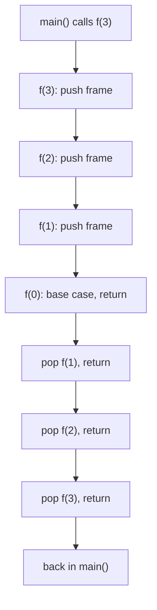
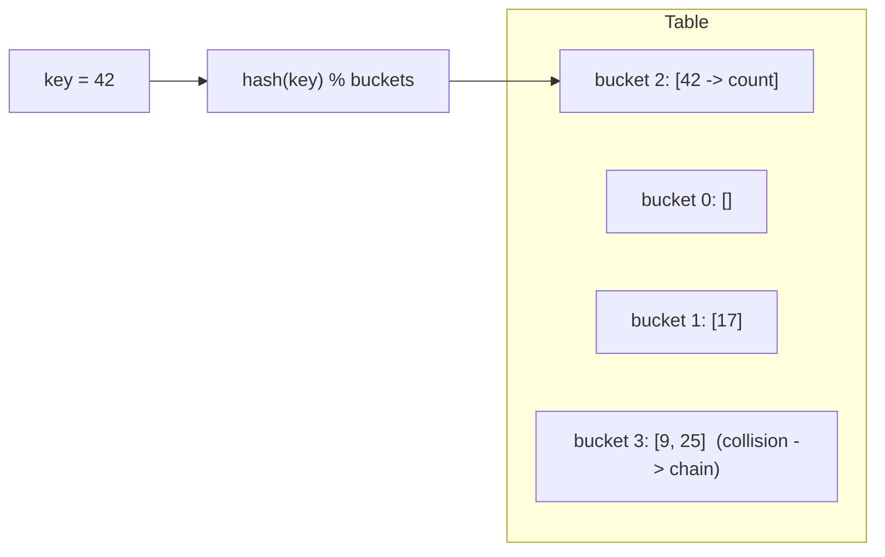
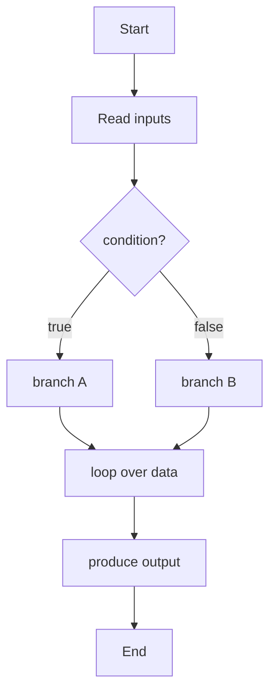
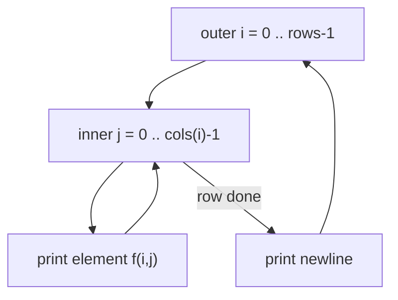
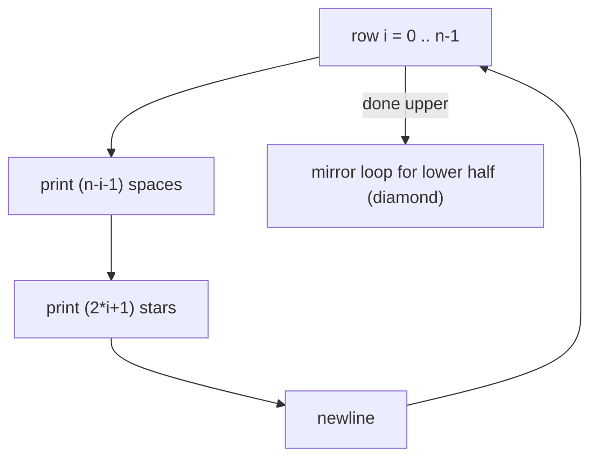
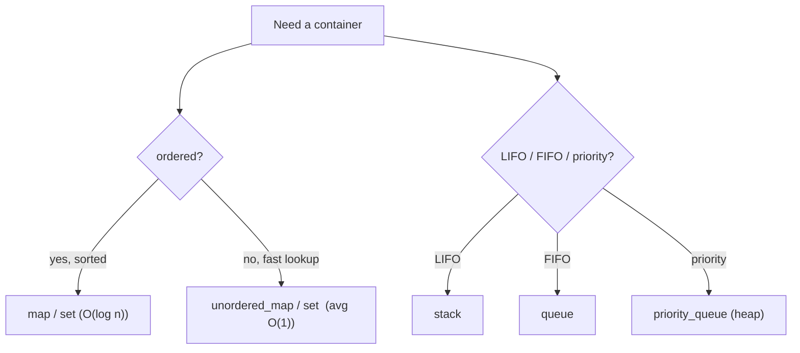
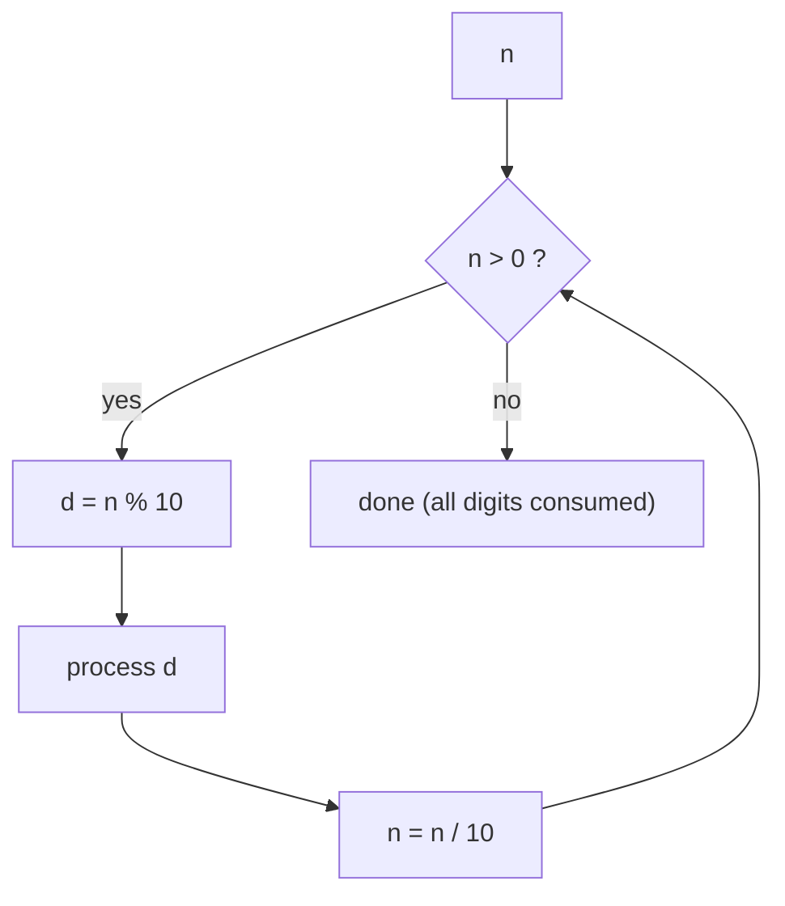
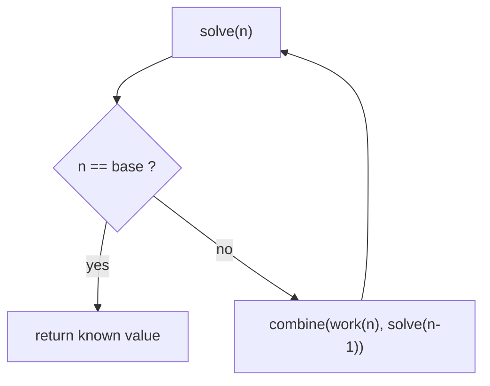
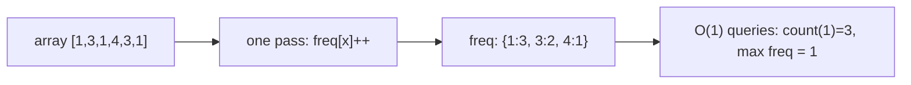

# Learn the Basics — Theory & Patterns

**Nav:** [Theory & Patterns](./theory-and-patterns.md) · [Problems](./problems.md) · [Resources](./resources.md)

**Stats:** 54 total problems · 🟢 Easy: 51 · 🟡 Medium: 3 · 🔴 Hard: 0

---

## Overview & Why It Matters

Step 1 of Striver's A2Z sheet is the *foundation floor* of the entire building. Before you can reason about arrays, graphs, or DP, you must be fluent in four things:

1. **How fast is my code?** — asymptotic (Big-O) analysis of time and space.
2. **Can I translate a shape/rule into nested loops?** — the pattern-printing drills.
3. **Do I know the tiny math toolkit?** — digits, reverse, palindrome, GCD, divisors, primes, Armstrong.
4. **Can I think recursively and hash?** — base case + recursive case, and O(1) lookups with maps/arrays.

**Where it appears in interviews:** Almost every interview *starts* here implicitly — you must state complexity for every solution ("this is O(n log n) time, O(1) space"). Pattern questions are common in campus/OA screening rounds. GCD/prime/sieve show up in math-flavored problems. Recursion is the gateway to trees, backtracking, and DP. Hashing (frequency counting, "seen before?") is the single most reused trick in array/string problems.

**Prerequisites:** Ability to write a `main()`, read input, use `for`/`while`, `if/else`, functions, and basic arrays/strings in C++. Everything else is built here.

---

## Core Concepts

### Vocabulary & Invariants

| Term | Meaning |
| --- | --- |
| **Time complexity** | How the number of operations grows with input size `n`, ignoring constants/lower-order terms. |
| **Space complexity** | Extra (auxiliary) memory growth with `n`. Recursion stack counts. |
| **Big-O / Θ / Ω** | Upper bound / tight bound / lower bound of growth. In interviews "O" usually means the worst-case tight bound. |
| **Base case** | The recursion stopping condition; without it → stack overflow. |
| **Recursive case** | The self-call on a *smaller* subproblem. |
| **Hashing** | Map a key to an index/bucket for average O(1) insert/find. |
| **Load factor** | `elements / buckets`; drives rehashing and collisions. |
| **Collision** | Two keys hash to the same bucket; resolved by chaining/probing. |

### Big-O growth ladder (memorize)

`O(1) < O(log n) < O(n) < O(n log n) < O(n²) < O(2ⁿ) < O(n!)`

Rule of thumb: **~10⁸ simple operations ≈ 1 second**. If `n = 10⁵`, an `O(n²)` (=10¹⁰) solution is too slow; you need `O(n log n)` or better.

### The recursion call stack (key structure)



Each call pushes an **activation record** (parameters, locals, return address) onto the stack. Depth `d` ⇒ O(d) stack space. Recursion "goes down" until the base case, then "unwinds" back up.

### A hash map, conceptually



For small integer keys, prefer a **plain frequency array** (`int hash[N] = {0};`) — it is a perfect hash with guaranteed O(1) and no collisions.

---

## Patterns

Below, one `###` subsection per sub_step of the data, in order.

### Pattern A — Language Foundations (I/O, control flow, functions, arrays/strings)

**Recognition signals:** You need to read/write data, branch on conditions, loop, or split logic into reusable functions. This is the "setup" layer under every problem.

**Approach / algorithm:**
1. Read input fast (`cin`/`scanf`); print with `cout`/`printf`.
2. Branch with `if/else if/else` or `switch` (discrete cases).
3. Iterate with `for` (known count) or `while` (condition-driven).
4. Extract repeated logic into functions; choose **pass-by-value** (copy, safe) vs **pass-by-reference** (`&`, no copy, can mutate).



**Complexity:** Depends on the logic; a single loop over `n` items is O(n) time, O(1) extra space. Pass-by-reference avoids an O(n) copy for large containers.

```cpp
#include <bits/stdc++.h>
using namespace std;

// pass-by-reference: no copy, may mutate
void doubleAll(vector<int> &a) {
    for (int &x : a) x *= 2;              // O(n) time, O(1) extra space
}

int classify(int x) {                     // if / else-if chain
    if (x > 0) return 1;
    else if (x < 0) return -1;
    else return 0;
}

int main() {
    ios::sync_with_stdio(false); cin.tie(nullptr);
    int n; cin >> n;                      // fast I/O
    vector<int> a(n);
    for (int i = 0; i < n; i++) cin >> a[i];   // for loop
    doubleAll(a);
    for (int x : a) cout << x << " ";
    return 0;
}
```

### Pattern B — Build-up Logical Thinking (nested-loop reasoning)

**Recognition signals:** A task described as a *grid/shape/table* of characters or numbers; anything you can draw on paper row-by-row. The bridge from single loops to nested loops.

**Approach / algorithm:**
1. Identify the **number of rows** → outer loop.
2. For each row, decide **how many columns** and **what to print** → inner loop(s).
3. Map `(row, col)` → the character/number using a rule. Print a newline after each row.



**Complexity:** Two nested loops over up to `n` each ⇒ O(n²) time, O(1) space (we only print).

```cpp
// Generic row/col driver: derive count(i) and value(i,j) per problem
void drive(int n) {
    for (int i = 0; i < n; i++) {          // rows
        for (int j = 0; j <= i; j++) {     // cols depend on i
            cout << "*";                   // value(i,j)
        }
        cout << "\n";
    }
}
```

### Pattern C — Star / Number Patterns (Patterns 1–22)

**Recognition signals:** "Print the following pattern"; triangles, pyramids, diamonds, hollow shapes, number/character grids. All 22 problems are variations of the same nested-loop skeleton.

**Approach / algorithm:**
1. **Count rows** (outer loop). 
2. Per row, split the inner work into up to three parts: **leading spaces**, **printed characters**, **trailing part** (for symmetric/hollow shapes).
3. Find the arithmetic linking `i` to the counts. For a pyramid of height `n`: spaces `= n-i-1`, stars `= 2*i+1`.
4. Symmetric shapes (diamond, butterfly) = an "upper" loop + a mirrored "lower" loop.



**Complexity:** O(n²) time (rows × per-row width bounded by O(n)), O(1) space.

```cpp
// Reusable pyramid template; change the two "count" formulas per pattern.
void pyramid(int n) {
    for (int i = 0; i < n; i++) {
        for (int s = 0; s < n - i - 1; s++) cout << " ";  // leading spaces
        for (int k = 0; k < 2 * i + 1; k++) cout << "*";  // stars
        cout << "\n";
    }
}

// Solid diamond = pyramid then inverted pyramid
void diamond(int n) {
    for (int i = 0; i < n; i++) {                          // upper half
        for (int s = 0; s < n - i - 1; s++) cout << " ";
        for (int k = 0; k < 2 * i + 1; k++) cout << "*";
        cout << "\n";
    }
    for (int i = n - 1; i >= 0; i--) {                     // lower half (mirror)
        for (int s = 0; s < n - i - 1; s++) cout << " ";
        for (int k = 0; k < 2 * i + 1; k++) cout << "*";
        cout << "\n";
    }
}
```

### Pattern D — STL / Java Collections (built-in containers)

**Recognition signals:** You need a dynamic array, sorted/hashed set or map, stack/queue, or ready-made algorithms (`sort`, `lower_bound`). Reaching for these instead of reinventing them.

**Approach / algorithm:**
1. Pick the container by the operation you need most: `vector` (index), `set/map` (sorted, O(log n)), `unordered_set/map` (hashed, avg O(1)), `stack/queue/priority_queue`.
2. Use `<algorithm>` helpers: `sort`, `reverse`, `max_element`, `accumulate`, `lower_bound`.
3. Know the complexity of each op so you can state it in interviews.



**Complexity:** `vector` push_back amortized O(1); `map/set` ops O(log n); `unordered_*` avg O(1)/worst O(n); `sort` O(n log n).

```cpp
#include <bits/stdc++.h>
using namespace std;
int main() {
    vector<int> v = {5, 2, 9, 2};
    sort(v.begin(), v.end());                 // O(n log n)
    map<int,int> ordered;                     // O(log n) ops, sorted keys
    unordered_map<int,int> fast;              // avg O(1) ops
    for (int x : v) fast[x]++;                // frequency via hash map
    set<int> uniq(v.begin(), v.end());        // dedup + sorted
    stack<int> st; st.push(1); st.pop();      // LIFO
    queue<int> q; q.push(1); q.pop();         // FIFO
    priority_queue<int> pq; pq.push(3);       // max-heap, top() = max
    return 0;
}
```

### Pattern E — Basic Maths (digits, reverse, palindrome, GCD, divisors, primes, Armstrong)

**Recognition signals:** Anything operating on the *digits* of a number, or number-theory checks (divisibility, primality, gcd). Signal words: "digits", "reverse", "palindrome", "divisor", "prime", "gcd", "Armstrong".

**Approach / algorithm:**
- **Digit extraction loop:** `while (n) { d = n % 10; n /= 10; }` — the workhorse for count/reverse/palindrome/Armstrong.
- **Divisors in O(√n):** iterate `i` from 1 to √n; when `i | n`, both `i` and `n/i` are divisors.
- **Primality in O(√n):** `n` is prime if no `i` in `[2, √n]` divides it.
- **GCD via Euclid:** `gcd(a,b) = gcd(b, a % b)`, base case `gcd(a,0)=a`. Runs in O(log(min(a,b))).



**Complexity:** digit loops O(log₁₀ n); divisors/prime O(√n); Euclid gcd O(log min(a,b)); all O(1) space.

```cpp
long long reverseNum(long long n){ long long r=0; while(n){ r=r*10 + n%10; n/=10;} return r; }
bool isPalindrome(long long n){ return n>=0 && n==reverseNum(n); }
int countDigits(long long n){ int c=0; if(n==0) return 1; n=llabs(n); while(n){c++; n/=10;} return c; }

vector<int> divisors(int n){                      // O(sqrt(n))
    vector<int> res;
    for(int i=1; (long long)i*i<=n; i++)
        if(n%i==0){ res.push_back(i); if(i!=n/i) res.push_back(n/i); }
    sort(res.begin(), res.end());
    return res;
}
bool isPrime(int n){                              // O(sqrt(n))
    if(n<2) return false;
    for(int i=2; (long long)i*i<=n; i++) if(n%i==0) return false;
    return true;
}
int gcd(int a,int b){ return b==0 ? a : gcd(b, a%b); }   // Euclid, O(log min)
bool isArmstrong(int n){                          // 3-digit style; k = #digits
    int k=countDigits(n), sum=0, t=n;
    while(t){ int d=t%10; sum += (int)pow(d,k); t/=10; }
    return sum==n;
}
```

### Pattern F — Basic Recursion (print N times, sums, factorial, reverse, palindrome, Fibonacci)

**Recognition signals:** A problem defined "in terms of itself", or naturally reduces to a smaller identical subproblem. Signal words: "print 1..N", "sum of first N", "factorial", "Fibonacci", "reverse recursively".

**Approach / algorithm (the recursion recipe):**
1. **Base case:** the smallest input where the answer is known directly (e.g., `f(0)=0`).
2. **Recursive case:** solve a *smaller* input and combine.
3. Choose **head recursion** (work after the call — prints ascending) vs **tail recursion** (work before the call — prints descending).
4. **Parameterized recursion** carries an accumulator; **functional recursion** returns the value.



**Complexity:** linear recursions (sum, factorial, print) O(n) time, O(n) stack. Naive Fibonacci O(2ⁿ) time, O(n) stack.

```cpp
void printKTimes(string s, int i, int k){ if(i==k) return; cout<<s<<"\n"; printKTimes(s,i+1,k); }
void oneToN(int i,int n){ if(i>n) return; cout<<i<<" "; oneToN(i+1,n); }         // head: ascending
void nToOne(int i){ if(i<1) return; cout<<i<<" "; nToOne(i-1); }                 // tail-ish: descending
long long sumN(int n){ return n==0 ? 0 : n + sumN(n-1); }                        // O(n)
long long fact(int n){ return n<=1 ? 1 : (long long)n * fact(n-1); }             // O(n)
void reverseArr(vector<int>&a,int l,int r){ if(l>=r) return; swap(a[l],a[r]); reverseArr(a,l+1,r-1);} 
bool isPalin(const string&s,int l,int r){ if(l>=r) return true; if(s[l]!=s[r]) return false; return isPalin(s,l+1,r-1);} 
int fib(int n){ return n<=1 ? n : fib(n-1)+fib(n-2); }                           // O(2^n) naive
```

### Pattern G — Basic Hashing (frequency counting, most/least frequent)

**Recognition signals:** "How many times does X occur?", "does X exist already?", "most/least frequent element". Anything needing repeated O(1) lookups by value.

**Approach / algorithm:**
1. **Pre-store** counts in one pass into a hash structure.
2. **Query** in O(1) afterwards, instead of re-scanning.
3. For small bounded integer keys, use a **frequency array**; for large/negative/string keys, use `unordered_map`.



**Complexity:** build O(n); each query O(1) average. Space O(k) for `k` distinct keys (or O(range) for a frequency array).

```cpp
#include <bits/stdc++.h>
using namespace std;

unordered_map<int,int> buildFreq(const vector<int>& a){
    unordered_map<int,int> freq;
    for(int x : a) freq[x]++;                   // O(n) build
    return freq;
}

int mostFrequent(const vector<int>& a){
    auto freq = buildFreq(a);
    int best = a.empty()?-1:a[0], bestCnt = 0;
    for(auto& [val,cnt] : freq)
        if(cnt > bestCnt){ bestCnt = cnt; best = val; }   // O(k) scan
    return best;
}
```

---

## Complexity Summary

| Pattern | Time | Space | Notes |
| --- | --- | --- | --- |
| A. Language foundations | depends (single loop O(n)) | O(1) | Pass-by-reference avoids O(n) copies |
| B. Logical thinking (nested loops) | O(n²) | O(1) | Foundation for grids/patterns |
| C. Star/number patterns (1–22) | O(n²) | O(1) | rows × O(n) width; spaces + stars formulas |
| D. STL / Collections | per-op (see notes) | O(n) | map/set O(log n); unordered avg O(1); sort O(n log n) |
| E. Basic maths | O(log n) digits, O(√n) prime/divisors, O(log min) gcd | O(1) | Digit loop + Euclid are the core tools |
| F. Basic recursion | O(n) linear, O(2ⁿ) naive Fib | O(n) stack | Always define a base case |
| G. Basic hashing | O(n) build, O(1) query | O(k) or O(range) | Freq array for small int keys |

---

## Interview Tips & Common Mistakes

- **Always state complexity aloud** for both time *and* space — interviewers expect "O(n) time, O(1) space" as a reflex.
- **Big-O pitfalls:** don't keep constants (`O(2n)`→`O(n)`); the recursion stack counts as space; `unordered_map` is *average* O(1) but *worst* O(n) — mention it for adversarial inputs.
- **Patterns:** derive the space/star counts as functions of `i` on paper *before* coding; off-by-one in `2*i+1` vs `2*i-1` is the #1 bug. Print a `"\n"` per row, not per element.
- **Maths:** guard integer **overflow** — reversing an `int` can exceed `INT_MAX` (LeetCode "Reverse Integer" wants you to return 0 on overflow); use `long long` or check bounds. Handle `n = 0` and negatives explicitly in digit counts/palindromes. `1` is **not** prime.
- **Divisors/prime:** loop to `√n` using `i*i <= n` (cast to `long long` to avoid overflow), *not* `i <= sqrt(n)` (floating error). Push both `i` and `n/i`, but only once when `i == n/i`.
- **Recursion:** a missing/wrong base case → **stack overflow**. Naive Fibonacci is exponential; mention memoization as the fix. Prefer parameters/return values over global state.
- **Hashing:** choose a **frequency array** for small bounded integers (faster, no collisions) and `unordered_map` for large/negative/string keys. Beware `map[key]` auto-inserting a default when you only meant to read — use `.count()`/`.find()` to check existence.
